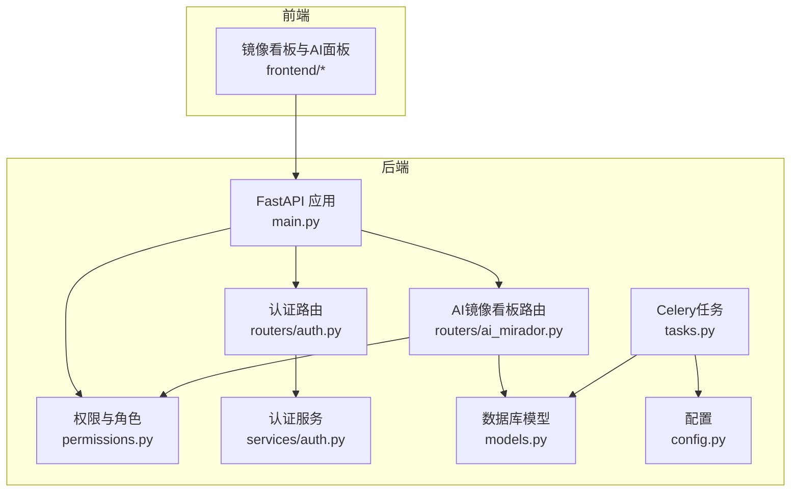
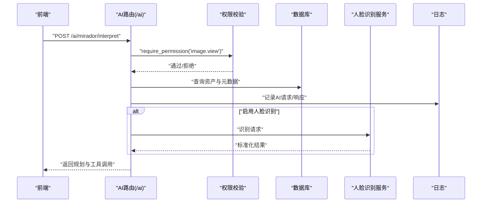
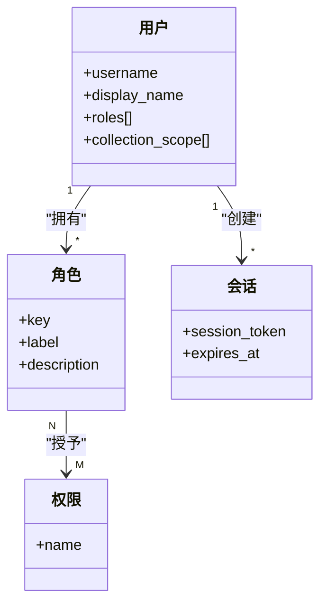
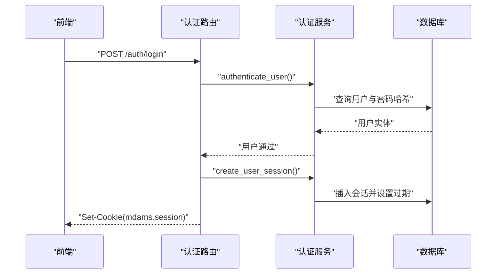
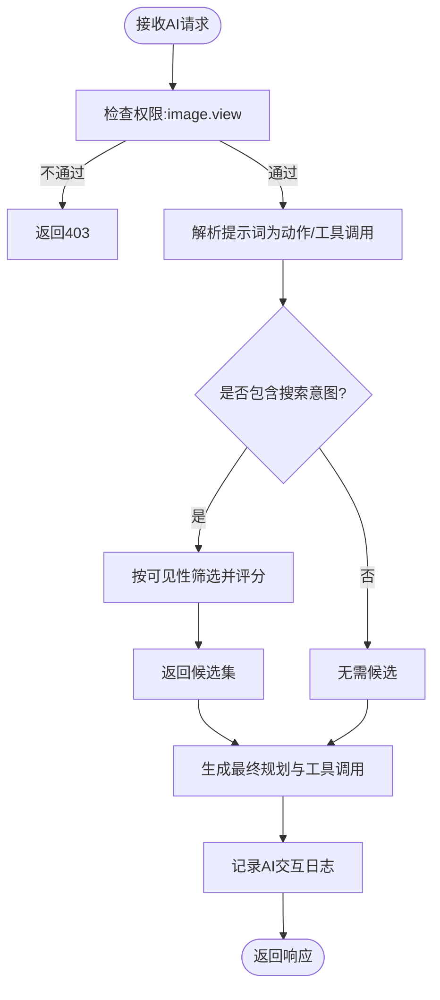
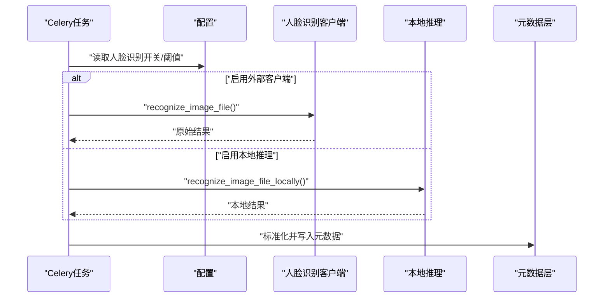
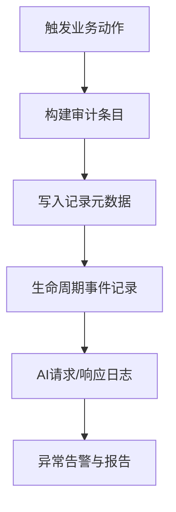
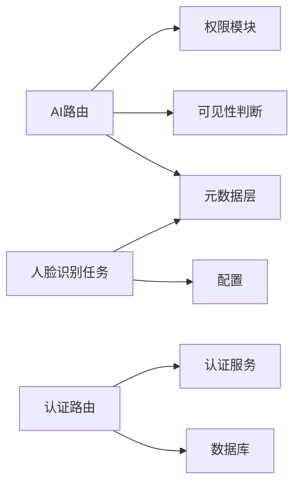

# AI功能权限控制与安全

<cite>
**本文引用的文件**
- [backend/app/permissions.py](file://backend/app/permissions.py)
- [backend/app/services/auth.py](file://backend/app/services/auth.py)
- [backend/app/routers/auth.py](file://backend/app/routers/auth.py)
- [backend/app/models.py](file://backend/app/models.py)
- [backend/app/config.py](file://backend/app/config.py)
- [backend/app/routers/ai_mirador.py](file://backend/app/routers/ai_mirador.py)
- [backend/app/services/face_recognition.py](file://backend/app/services/face_recognition.py)
- [backend/app/services/local_face_recognition.py](file://backend/app/services/local_face_recognition.py)
- [backend/app/tasks.py](file://backend/app/tasks.py)
- [backend/app/main.py](file://backend/app/main.py)
- [docs/03-产品与流程/USER_ROLE_PERMISSION_MATRIX.md](file://docs/03-产品与流程/USER_ROLE_PERMISSION_MATRIX.md)
- [docs/02-架构设计/AUTH_AND_IIIF_INTEGRATION_PLAN.md](file://docs/02-架构设计/AUTH_AND_IIIF_INTEGRATION_PLAN.md)
- [backend/app/routers/image_records.py](file://backend/app/routers/image_records.py)
- [backend/app/services/asset_detail.py](file://backend/app/services/asset_detail.py)
- [backend/app/services/metadata_layers.py](file://backend/app/services/metadata_layers.py)
- [frontend/src/components/IngestDemo.tsx](file://frontend/src/components/IngestDemo.tsx)
</cite>

## 目录
1. [简介](#简介)
2. [项目结构](#项目结构)
3. [核心组件](#核心组件)
4. [架构总览](#架构总览)
5. [详细组件分析](#详细组件分析)
6. [依赖分析](#依赖分析)
7. [性能考虑](#性能考虑)
8. [故障排查指南](#故障排查指南)
9. [结论](#结论)
10. [附录](#附录)

## 简介
本文件面向MDAMS原型项目的AI功能权限控制与安全机制，系统化阐述基于角色的访问控制（RBAC）在AI功能中的应用、敏感信息保护、审计日志、API安全防护、数据安全策略以及安全配置指南。文档同时提供最佳实践与风险评估方法，帮助读者快速理解并安全地扩展AI功能。

## 项目结构
后端采用FastAPI + SQLAlchemy架构，AI功能集中在镜像看板（Mirador）对话解释器与人脸识别任务两条主线，配合统一的RBAC与认证体系，确保AI调用与资源访问均受控。

图表来源
- [backend/app/main.py:64-86](file://backend/app/main.py#L64-L86)
- [backend/app/routers/auth.py:1-83](file://backend/app/routers/auth.py#L1-L83)
- [backend/app/routers/ai_mirador.py:1-702](file://backend/app/routers/ai_mirador.py#L1-L702)
- [backend/app/permissions.py:17-94](file://backend/app/permissions.py#L17-L94)
- [backend/app/services/auth.py:1-143](file://backend/app/services/auth.py#L1-L143)
- [backend/app/models.py:1-307](file://backend/app/models.py#L1-L307)
- [backend/app/tasks.py:1-262](file://backend/app/tasks.py#L1-L262)
- [backend/app/config.py:1-72](file://backend/app/config.py#L1-L72)

章节来源
- [backend/app/main.py:64-86](file://backend/app/main.py#L64-L86)
- [backend/app/routers/auth.py:1-83](file://backend/app/routers/auth.py#L1-L83)
- [backend/app/routers/ai_mirador.py:1-702](file://backend/app/routers/ai_mirador.py#L1-L702)
- [backend/app/permissions.py:17-94](file://backend/app/permissions.py#L17-L94)
- [backend/app/services/auth.py:1-143](file://backend/app/services/auth.py#L1-L143)
- [backend/app/models.py:1-307](file://backend/app/models.py#L1-L307)
- [backend/app/tasks.py:1-262](file://backend/app/tasks.py#L1-L262)
- [backend/app/config.py:1-72](file://backend/app/config.py#L1-L72)

## 核心组件
- RBAC与权限模型
  - 角色到权限映射集中于权限模块，支持“系统管理员”拥有最高权限，其他角色按职责细分。
  - 提供权限依赖注入与断言函数，保障接口与AI处理流程的访问控制。
- 认证与会话
  - 登录/登出接口、Cookie会话、Bearer Token解析、会话过期与删除。
- AI功能
  - Mirador对话解释器：将自然语言转化为受控的Viewer工具调用，支持搜索、对比、缩放、平移等动作。
  - 人脸识别：支持本地推理与外部客户端两种模式，输出标准化的人脸识别结果。
- 数据与元数据
  - 统一元数据分层（core/management/technical/profile/raw_metadata），支持检索与隐私控制。
- 审计与日志
  - 图像记录工作流内嵌审计轨迹；资产生命周期事件记录；AI请求与响应日志。
- 配置与安全参数
  - 外部AI服务（Moonshot/Kimi兼容OpenAI）凭据、人脸识别开关与阈值、超时等。

章节来源
- [backend/app/permissions.py:17-94](file://backend/app/permissions.py#L17-L94)
- [backend/app/services/auth.py:15-41](file://backend/app/services/auth.py#L15-L41)
- [backend/app/routers/auth.py:53-83](file://backend/app/routers/auth.py#L53-L83)
- [backend/app/routers/ai_mirador.py:583-702](file://backend/app/routers/ai_mirador.py#L583-L702)
- [backend/app/services/face_recognition.py:86-140](file://backend/app/services/face_recognition.py#L86-L140)
- [backend/app/services/local_face_recognition.py:282-346](file://backend/app/services/local_face_recognition.py#L282-L346)
- [backend/app/services/metadata_layers.py:1-28](file://backend/app/services/metadata_layers.py#L1-L28)
- [backend/app/routers/image_records.py:154-178](file://backend/app/routers/image_records.py#L154-L178)
- [backend/app/services/asset_detail.py:91-121](file://backend/app/services/asset_detail.py#L91-L121)
- [backend/app/config.py:48-72](file://backend/app/config.py#L48-L72)

## 架构总览
AI功能安全贯穿“认证—授权—资源可见性—数据脱敏—审计日志—API防护—数据安全”的闭环。

图表来源
- [backend/app/routers/ai_mirador.py:583-702](file://backend/app/routers/ai_mirador.py#L583-L702)
- [backend/app/permissions.py:214-236](file://backend/app/permissions.py#L214-L236)
- [backend/app/services/local_face_recognition.py:282-346](file://backend/app/services/local_face_recognition.py#L282-L346)

章节来源
- [backend/app/routers/ai_mirador.py:583-702](file://backend/app/routers/ai_mirador.py#L583-L702)
- [backend/app/permissions.py:214-236](file://backend/app/permissions.py#L214-L236)
- [backend/app/services/local_face_recognition.py:282-346](file://backend/app/services/local_face_recognition.py#L282-L346)

## 详细组件分析

### RBAC与权限模型
- 角色与权限
  - 内置角色覆盖二维/三维资源、图像记录、申请管理、系统管理等场景。
  - 权限集合涵盖查看、编辑、上传、审核、导出、系统管理等。
- 当前实现要点
  - 角色到权限映射集中于权限模块，系统管理员拥有“system.manage”豁免。
  - 可见范围规则：open（任意具备查看权限的馆内用户）、owner_only（系统管理员或命中责任范围）。
- 前端联动
  - 菜单入口与权限强绑定，确保UI层面的最小权限展示。

图表来源
- [backend/app/models.py:28-111](file://backend/app/models.py#L28-L111)
- [backend/app/permissions.py:17-94](file://backend/app/permissions.py#L17-L94)
- [docs/03-产品与流程/USER_ROLE_PERMISSION_MATRIX.md:16-96](file://docs/03-产品与流程/USER_ROLE_PERMISSION_MATRIX.md#L16-L96)

章节来源
- [backend/app/permissions.py:17-94](file://backend/app/permissions.py#L17-L94)
- [backend/app/models.py:28-111](file://backend/app/models.py#L28-L111)
- [docs/03-产品与流程/USER_ROLE_PERMISSION_MATRIX.md:16-96](file://docs/03-产品与流程/USER_ROLE_PERMISSION_MATRIX.md#L16-L96)

### 认证与会话
- 登录/登出
  - 登录成功后创建会话并写入HttpOnly Cookie；登出删除会话与Cookie。
- Token解析
  - 支持Authorization头（Bearer）与Cookie（mdams.session）两种方式。
- 会话有效期
  - 会话过期时间固定，过期自动清理。

图表来源
- [backend/app/routers/auth.py:53-83](file://backend/app/routers/auth.py#L53-L83)
- [backend/app/services/auth.py:136-143](file://backend/app/services/auth.py#L136-L143)
- [backend/app/services/auth.py:102-112](file://backend/app/services/auth.py#L102-L112)

章节来源
- [backend/app/routers/auth.py:53-83](file://backend/app/routers/auth.py#L53-L83)
- [backend/app/services/auth.py:136-143](file://backend/app/services/auth.py#L136-L143)
- [backend/app/services/auth.py:102-112](file://backend/app/services/auth.py#L102-L112)

### AI镜像看板（Mirador）权限控制
- 请求入口与权限
  - /ai/mirador/interpret需要“image.view”权限；搜索接口“/ai/assets/search”同样需要“image.view”。
- 动作与工具调用
  - 将自然语言转化为受控工具调用（缩放、平移、搜索、对比等），并限制允许的动作集合。
- 资源可见性
  - 搜索与规划前进行资源可见性判断，避免泄露“owner_only”受限资源。
- 日志与可观测性
  - 记录AI请求、响应、搜索结果数量、目标资产等关键指标，便于审计与问题定位。

图表来源
- [backend/app/routers/ai_mirador.py:583-702](file://backend/app/routers/ai_mirador.py#L583-L702)
- [backend/app/permissions.py:214-236](file://backend/app/permissions.py#L214-L236)
- [backend/app/permissions.py:239-255](file://backend/app/permissions.py#L239-L255)

章节来源
- [backend/app/routers/ai_mirador.py:583-702](file://backend/app/routers/ai_mirador.py#L583-L702)
- [backend/app/permissions.py:214-236](file://backend/app/permissions.py#L214-L236)
- [backend/app/permissions.py:239-255](file://backend/app/permissions.py#L239-L255)

### 人脸识别与敏感信息保护
- 本地推理与外部客户端
  - 本地推理需满足模型文件完整性与运行时依赖；外部客户端通过统一客户端封装。
- 结果标准化
  - 统一输出结构，包含人脸框、置信度、聚簇信息等；支持阈值控制与去重。
- 隐私与脱敏
  - 仅保留必要字段；对二进制数据与长文本进行脱敏或截断；在前端亦有脱敏策略。

图表来源
- [backend/app/tasks.py:189-262](file://backend/app/tasks.py#L189-L262)
- [backend/app/services/local_face_recognition.py:282-346](file://backend/app/services/local_face_recognition.py#L282-L346)
- [backend/app/services/face_recognition.py:86-140](file://backend/app/services/face_recognition.py#L86-L140)
- [backend/app/config.py:60-72](file://backend/app/config.py#L60-L72)

章节来源
- [backend/app/tasks.py:189-262](file://backend/app/tasks.py#L189-L262)
- [backend/app/services/local_face_recognition.py:282-346](file://backend/app/services/local_face_recognition.py#L282-L346)
- [backend/app/services/face_recognition.py:86-140](file://backend/app/services/face_recognition.py#L86-L140)
- [backend/app/config.py:60-72](file://backend/app/config.py#L60-L72)
- [frontend/src/components/IngestDemo.tsx:65-88](file://frontend/src/components/IngestDemo.tsx#L65-L88)

### 审计日志与异常监控
- 图像记录审计
  - 工作流中追加审计条目，记录操作者、时间、动作与备注。
- 资产生命周期
  - 生命周期事件记录关键处理步骤与证据，便于回溯。
- AI交互日志
  - 记录提示词、动作、候选数量、目标资产、工具调用等，支持异常定位与统计分析。

图表来源
- [backend/app/routers/image_records.py:154-178](file://backend/app/routers/image_records.py#L154-L178)
- [backend/app/services/asset_detail.py:91-121](file://backend/app/services/asset_detail.py#L91-L121)
- [backend/app/routers/ai_mirador.py:583-702](file://backend/app/routers/ai_mirador.py#L583-L702)

章节来源
- [backend/app/routers/image_records.py:154-178](file://backend/app/routers/image_records.py#L154-L178)
- [backend/app/services/asset_detail.py:91-121](file://backend/app/services/asset_detail.py#L91-L121)
- [backend/app/routers/ai_mirador.py:583-702](file://backend/app/routers/ai_mirador.py#L583-L702)

### API安全防护
- 身份验证与授权
  - 登录后会话写入Cookie；后续请求通过Authorization头或Cookie解析用户。
  - 接口级权限断言，如AI镜像看板解释接口要求“image.view”。
- 输入验证与速率限制
  - AI请求体与参数在路由层进行结构化校验；当前未发现专用速率限制中间件，建议结合网关或限流中间件实施。
- CORS与传输安全
  - CORS允许通配，建议在生产环境限定可信域；HTTPS应在网关层强制。

章节来源
- [backend/app/routers/auth.py:53-83](file://backend/app/routers/auth.py#L53-L83)
- [backend/app/permissions.py:214-236](file://backend/app/permissions.py#L214-L236)
- [backend/app/routers/ai_mirador.py:691-702](file://backend/app/routers/ai_mirador.py#L691-L702)
- [backend/app/main.py:66-73](file://backend/app/main.py#L66-L73)

### 数据安全策略
- 传输加密
  - 建议在反向代理层启用TLS；AI服务与人脸识别服务的通信建议走内网或受控网络。
- 存储保护
  - 会话与用户凭据采用PBKDF2哈希；敏感配置通过环境变量注入。
- 访问控制
  - 资源可见性由“visibility_scope”与“collection_scope”共同决定；AI处理前再次校验。
- 生命周期管理
  - 会话过期自动清理；错误状态写入资产元数据，便于追踪与修复。

章节来源
- [backend/app/services/auth.py:44-56](file://backend/app/services/auth.py#L44-L56)
- [backend/app/services/auth.py:115-127](file://backend/app/services/auth.py#L115-L127)
- [backend/app/permissions.py:239-255](file://backend/app/permissions.py#L239-L255)
- [backend/app/tasks.py:23-44](file://backend/app/tasks.py#L23-L44)

## 依赖分析
- 组件耦合
  - AI路由依赖权限模块与资源可见性判断；人脸识别任务依赖配置与元数据层；认证路由依赖认证服务与数据库。
- 外部依赖
  - OpenAI兼容服务（Moonshot/Kimi）、人脸识别推理引擎（ONNXRuntime/InsightFace）、Cantaloupe IIIF服务。
- 潜在风险
  - 当前IIIF图像服务地址未完全指向受控代理，存在鉴权入口不一致的风险；建议逐步将服务ID切换为后端受控代理路径。

图表来源
- [backend/app/routers/ai_mirador.py:583-702](file://backend/app/routers/ai_mirador.py#L583-L702)
- [backend/app/permissions.py:239-255](file://backend/app/permissions.py#L239-L255)
- [backend/app/tasks.py:189-262](file://backend/app/tasks.py#L189-L262)
- [backend/app/routers/auth.py:53-83](file://backend/app/routers/auth.py#L53-L83)
- [backend/app/services/auth.py:102-112](file://backend/app/services/auth.py#L102-L112)

章节来源
- [backend/app/routers/ai_mirador.py:583-702](file://backend/app/routers/ai_mirador.py#L583-L702)
- [backend/app/permissions.py:239-255](file://backend/app/permissions.py#L239-L255)
- [backend/app/tasks.py:189-262](file://backend/app/tasks.py#L189-L262)
- [backend/app/routers/auth.py:53-83](file://backend/app/routers/auth.py#L53-L83)
- [backend/app/services/auth.py:102-112](file://backend/app/services/auth.py#L102-L112)
- [docs/02-架构设计/AUTH_AND_IIIF_INTEGRATION_PLAN.md:73-96](file://docs/02-架构设计/AUTH_AND_IIIF_INTEGRATION_PLAN.md#L73-L96)

## 性能考虑
- AI推理延迟
  - 异步HTTP客户端调用外部AI服务，建议设置合理超时与重试；对高频请求可引入缓存与队列削峰。
- 人脸识别吞吐
  - 本地推理依赖GPU/ONNXProvider，建议在资源充足节点部署；对外部客户端可设置并发上限与超时。
- 搜索与评分
  - 搜索前先做可见性过滤与IIIF就绪检查，减少无效计算；评分与排序在服务端完成，注意索引与分页优化。

## 故障排查指南
- 认证失败
  - 检查会话是否过期、Cookie是否正确携带、Authorization头格式是否为Bearer。
- 权限不足
  - 确认用户角色与权限映射；检查“image.view”等必需权限是否授予。
- 资源不可见
  - 核对“visibility_scope”与“collection_scope”；owner_only资源需命中责任范围。
- AI无结果
  - 查看日志中的候选数量与评分；确认提示词是否包含搜索意图；检查IIIF就绪状态。
- 人脸识别异常
  - 检查模型文件是否存在、运行时依赖是否安装、阈值设置是否合理；查看任务日志中的错误信息。

章节来源
- [backend/app/routers/auth.py:53-83](file://backend/app/routers/auth.py#L53-L83)
- [backend/app/permissions.py:214-236](file://backend/app/permissions.py#L214-L236)
- [backend/app/permissions.py:239-255](file://backend/app/permissions.py#L239-L255)
- [backend/app/routers/ai_mirador.py:583-702](file://backend/app/routers/ai_mirador.py#L583-L702)
- [backend/app/tasks.py:236-259](file://backend/app/tasks.py#L236-L259)

## 结论
MDAMS原型在AI功能中已建立起完善的RBAC与认证体系，结合资源可见性控制、元数据分层与审计日志，形成了较为稳健的安全基线。建议下一步完善IIIF图像服务的统一鉴权入口，强化API限流与传输加密，并持续优化AI与人脸识别的性能与稳定性。

## 附录
- 安全配置清单
  - 环境变量：DATABASE_URL、REDIS_URL、UPLOAD_DIR、API_PUBLIC_URL、CANTALOUPE_PUBLIC_URL、OPENAI_*、FACE_RECOGNITION_*。
  - 建议：在生产环境限定CORS域、启用HTTPS、定期轮换密钥、限制会话有效期。
- 合规与隐私
  - 元数据分层与白名单字段；二进制与长文本脱敏；审计轨迹保留操作证据。
- 风险评估
  - 当前IIIF服务地址未完全受控，建议尽快将服务ID切换为后端代理路径，消除鉴权入口差异。

章节来源
- [backend/app/config.py:42-72](file://backend/app/config.py#L42-L72)
- [docs/02-架构设计/AUTH_AND_IIIF_INTEGRATION_PLAN.md:115-135](file://docs/02-架构设计/AUTH_AND_IIIF_INTEGRATION_PLAN.md#L115-L135)
- [docs/03-产品与流程/USER_ROLE_PERMISSION_MATRIX.md:180-187](file://docs/03-产品与流程/USER_ROLE_PERMISSION_MATRIX.md#L180-L187)