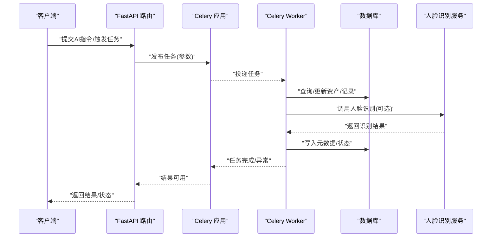
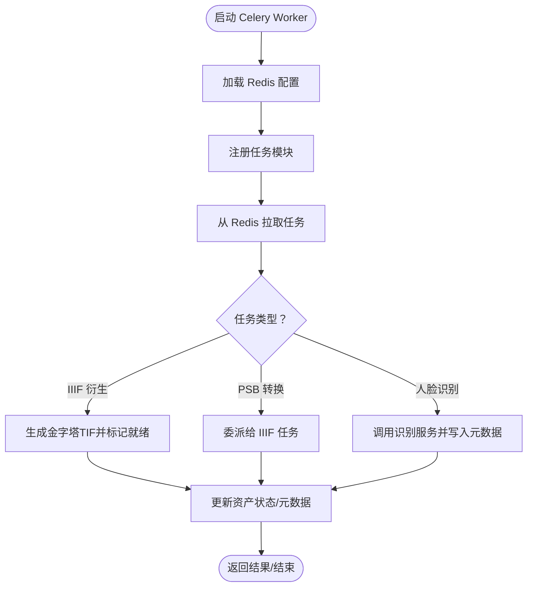
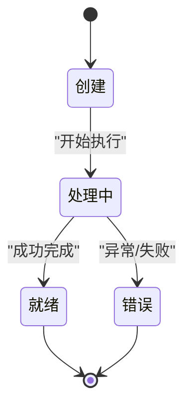
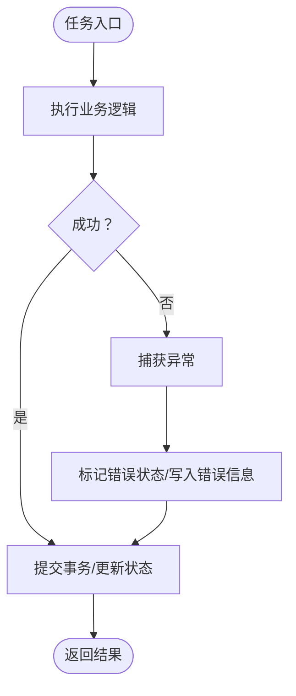
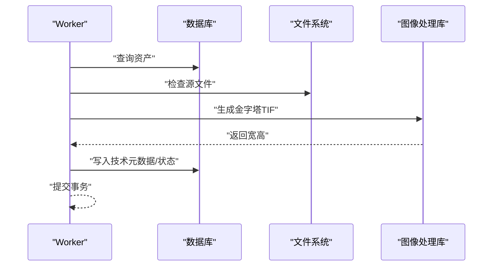
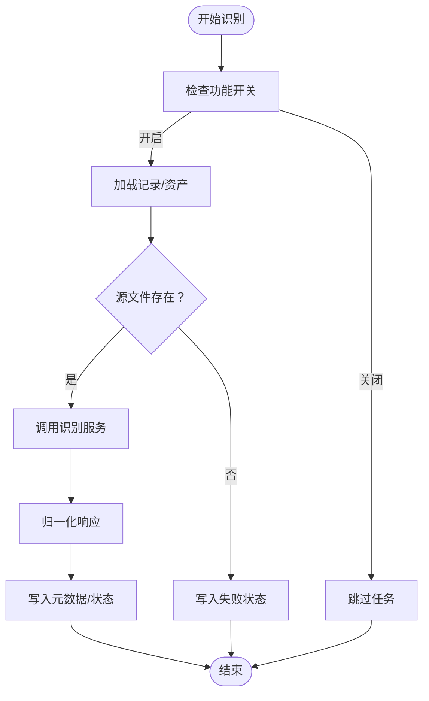
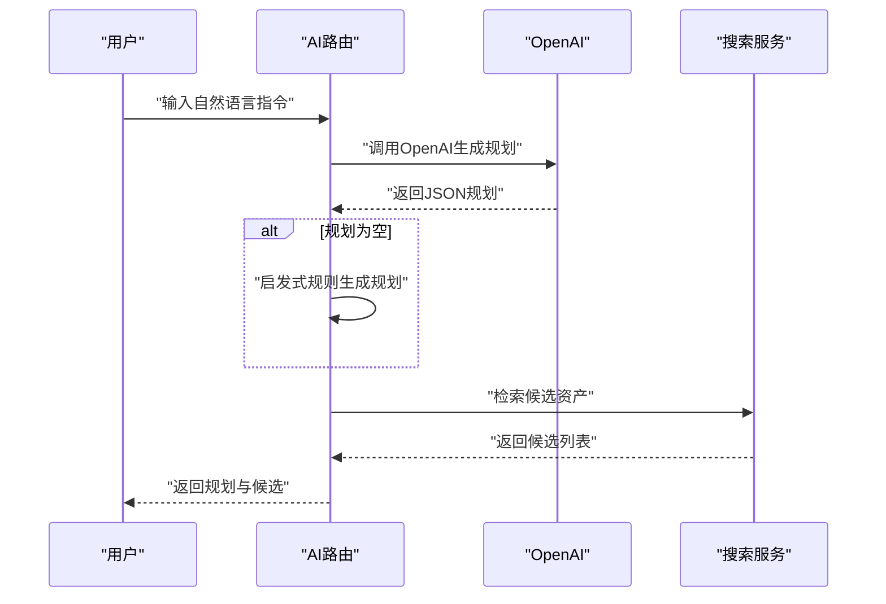
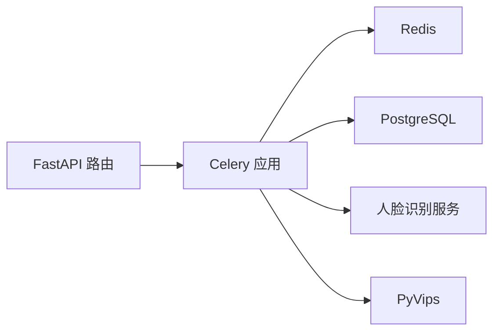

# AI异步处理机制

<cite>
**本文引用的文件**
- [celery_app.py](file://backend/app/celery_app.py)
- [tasks.py](file://backend/app/tasks.py)
- [config.py](file://backend/app/config.py)
- [main.py](file://backend/app/main.py)
- [ai_mirador.py](file://backend/app/routers/ai_mirador.py)
- [face_recognition.py](file://backend/app/services/face_recognition.py)
- [face_recognition_client.py](file://backend/app/services/face_recognition_client.py)
- [iiif_access.py](file://backend/app/services/iiif_access.py)
- [models.py](file://backend/app/models.py)
- [docker-compose.yml](file://docker-compose.yml)
- [test_ai_mirador.py](file://backend/tests/test_ai_mirador.py)
</cite>

## 目录
1. [引言](#引言)
2. [项目结构](#项目结构)
3. [核心组件](#核心组件)
4. [架构总览](#架构总览)
5. [详细组件分析](#详细组件分析)
6. [依赖分析](#依赖分析)
7. [性能考量](#性能考量)
8. [故障排查指南](#故障排查指南)
9. [结论](#结论)
10. [附录](#附录)

## 引言
本文件面向MDAMS原型项目的AI异步处理机制，围绕Celery任务队列展开，系统阐述任务定义、消息传递、队列管理、结果存储、任务生命周期、错误处理与重试、调度策略、性能监控与优化、最佳实践以及配置与调试指南。内容既覆盖代码级实现细节，也提供面向非专业读者的可读性说明。

## 项目结构
后端采用FastAPI应用，Celery作为异步任务执行器，Redis作为消息中间件与结果存储，PostgreSQL负责持久化数据。AI相关功能通过路由接口触发，任务在后台异步执行，并更新资产与记录的状态与元数据。

```mermaid
graph TB
subgraph "后端"
API["FastAPI 应用<br/>路由：/ai/*"]
CELERY_APP["Celery 应用<br/>broker=Redis, backend=Redis"]
WORKER["Celery Worker 进程"]
DB[("PostgreSQL 数据库")]
end
subgraph "外部服务"
REDIS["Redis"]
FR["人脸识别人工智能服务"]
end
API --> |"HTTP 请求"| CELERY_APP
CELERY_APP < --> REDIS
WORKER --> CELERY_APP
WORKER --> DB
WORKER --> FR
```

**图表来源**
- [docker-compose.yml:37-63](file://docker-compose.yml#L37-L63)
- [celery_app.py:5-15](file://backend/app/celery_app.py#L5-L15)
- [config.py:42-46](file://backend/app/config.py#L42-L46)

**章节来源**
- [main.py:64-86](file://backend/app/main.py#L64-L86)
- [docker-compose.yml:1-131](file://docker-compose.yml#L1-L131)

## 核心组件
- Celery应用与配置：定义broker与backend为Redis，注册任务模块，设置结果过期时间。
- 任务定义：包含IIIF访问衍生生成、PSB转大 TIFF衍生、人脸识别三项任务。
- 服务层：封装IIIF衍生生成、人脸识别客户端与响应归一化逻辑。
- 路由层：提供AI指令解释与资产检索接口，支持与Celery任务联动。
- 数据模型：资产与记录模型承载状态与元数据，供任务更新。

**章节来源**
- [celery_app.py:1-19](file://backend/app/celery_app.py#L1-L19)
- [tasks.py:151-262](file://backend/app/tasks.py#L151-L262)
- [iiif_access.py:182-259](file://backend/app/services/iiif_access.py#L182-L259)
- [face_recognition.py:48-140](file://backend/app/services/face_recognition.py#L48-L140)
- [face_recognition_client.py:91-134](file://backend/app/services/face_recognition_client.py#L91-L134)
- [ai_mirador.py:583-702](file://backend/app/routers/ai_mirador.py#L583-L702)
- [models.py:6-26](file://backend/app/models.py#L6-L26)

## 架构总览
AI异步处理以“请求-任务-执行-状态更新”为主线，前端或业务接口触发任务，Celery从Redis拉取任务执行，期间可能调用外部AI服务或进行图像处理，最终写回数据库并更新元数据。



**图表来源**
- [ai_mirador.py:583-688](file://backend/app/routers/ai_mirador.py#L583-L688)
- [tasks.py:151-262](file://backend/app/tasks.py#L151-L262)
- [face_recognition_client.py:91-134](file://backend/app/services/face_recognition_client.py#L91-L134)
- [iiif_access.py:230-259](file://backend/app/services/iiif_access.py#L230-L259)

## 详细组件分析

### Celery应用与任务注册
- 应用初始化：指定broker与backend均为Redis，include注册任务模块，设置结果过期时间。
- 任务模块：tasks.py中定义了三类任务，绑定到celery_app实例，具备名称与参数类型声明。
- Worker进程：通过命令行启动，指定并发度与日志级别；容器内默认并发为1。



**图表来源**
- [celery_app.py:5-15](file://backend/app/celery_app.py#L5-L15)
- [tasks.py:151-262](file://backend/app/tasks.py#L151-L262)
- [docker-compose.yml:41](file://docker-compose.yml#L41)

**章节来源**
- [celery_app.py:1-19](file://backend/app/celery_app.py#L1-L19)
- [docker-compose.yml:37-63](file://docker-compose.yml#L37-L63)

### 任务生命周期管理
- 任务创建：路由层或业务逻辑通过Celery发布任务，携带必要参数（如资产ID、源路径等）。
- 执行与状态：任务内部查询数据库，执行衍生生成或识别，过程中可能更新资产状态为“processing/ready/error”，并在元数据中写入技术信息。
- 结果存储：Redis作为backend，任务结果可被查询；同时数据库持久化状态与元数据。
- 完成通知：任务完成后，可通过轮询或回调机制告知调用方。



**图表来源**
- [tasks.py:151-262](file://backend/app/tasks.py#L151-L262)
- [models.py:6-26](file://backend/app/models.py#L6-L26)

**章节来源**
- [tasks.py:151-262](file://backend/app/tasks.py#L151-L262)
- [models.py:6-26](file://backend/app/models.py#L6-L26)

### 错误处理与重试机制
- 异常捕获：任务内使用try/except捕获异常，确保数据库事务提交与状态更新。
- 失败回退：当识别源文件不可用或识别服务异常时，写入失败状态与错误信息到元数据。
- 自动重试：当前未见显式重试装饰器配置；建议在生产环境为关键任务启用重试策略。
- 死信队列：当前未见死信队列配置；建议针对高优先级任务配置死信交换机与路由键。



**图表来源**
- [tasks.py:175-181](file://backend/app/tasks.py#L175-L181)
- [tasks.py:248-261](file://backend/app/tasks.py#L248-L261)

**章节来源**
- [tasks.py:175-181](file://backend/app/tasks.py#L175-L181)
- [tasks.py:248-261](file://backend/app/tasks.py#L248-L261)

### 任务调度策略
- 并发控制：容器内默认并发为1，可通过环境变量调整；低内存场景建议保持较低并发。
- 优先级队列：当前未见显式优先级配置；建议按任务类型或业务重要性设置队列与优先级。
- 资源调度：PyVips参数通过环境变量注入，可在资源受限环境中优化内存占用。
- 批量处理：可通过批量发布任务的方式提高吞吐，注意控制并发与资源上限。

**章节来源**
- [docker-compose.yml:41](file://docker-compose.yml#L41)
- [docker-compose.yml:11-13](file://docker-compose.yml#L11-L13)
- [config.py:42-46](file://backend/app/config.py#L42-L46)

### 性能监控与优化
- 任务执行时间：建议在任务入口与出口记录时间戳，结合日志或指标系统统计平均耗时与P95/P99。
- 队列长度监控：通过Redis键空间与队列统计指标观察积压情况。
- 并发控制：根据CPU/IO与内存使用率动态调整worker数量与每worker并发数。
- 资源利用率：PyVips参数调优可降低内存峰值；人脸识别服务超时与重试策略需平衡准确率与延迟。

**章节来源**
- [docker-compose.yml:11-13](file://docker-compose.yml#L11-L13)
- [face_recognition_client.py:56-88](file://backend/app/services/face_recognition_client.py#L56-L88)

### 任务定义与实现要点

#### IIIF访问衍生生成任务
- 功能：根据资产原始文件生成金字塔TIF，写入技术元数据并标记为就绪。
- 关键点：校验源文件存在性，生成输出路径，调用图像处理库写入文件，更新状态与消息。



**图表来源**
- [tasks.py:151-182](file://backend/app/tasks.py#L151-L182)
- [iiif_access.py:182-259](file://backend/app/services/iiif_access.py#L182-L259)

**章节来源**
- [tasks.py:151-182](file://backend/app/tasks.py#L151-L182)
- [iiif_access.py:182-259](file://backend/app/services/iiif_access.py#L182-L259)

#### PSB转大TIF任务
- 功能：委派给IIIF衍生任务，便于统一处理流程。
- 关键点：参数透传，简化调用链。

**章节来源**
- [tasks.py:184-186](file://backend/app/tasks.py#L184-L186)

#### 人脸识别任务
- 功能：根据记录与资产条件判断是否执行，调用识别服务，归一化结果并写入元数据。
- 关键点：支持本地/远程/自动三种提供者；阈值与超时可配置；异常时写入失败状态。



**图表来源**
- [tasks.py:189-262](file://backend/app/tasks.py#L189-L262)
- [face_recognition_client.py:91-134](file://backend/app/services/face_recognition_client.py#L91-L134)
- [face_recognition.py:86-140](file://backend/app/services/face_recognition.py#L86-L140)

**章节来源**
- [tasks.py:189-262](file://backend/app/tasks.py#L189-L262)
- [face_recognition_client.py:91-134](file://backend/app/services/face_recognition_client.py#L91-L134)
- [face_recognition.py:86-140](file://backend/app/services/face_recognition.py#L86-L140)

### AI指令解释与资产检索
- 指令解释：支持基于OpenAI的JSON格式规划与启发式规则，生成Mirador工具调用计划。
- 资产检索：根据可见性范围与IIIF就绪状态筛选候选，计算匹配分数并排序。
- 对话集成：可结合当前资产上下文与用户权限，提供对比模式与目标资产建议。



**图表来源**
- [ai_mirador.py:583-688](file://backend/app/routers/ai_mirador.py#L583-L688)
- [ai_mirador.py:691-702](file://backend/app/routers/ai_mirador.py#L691-L702)

**章节来源**
- [ai_mirador.py:583-688](file://backend/app/routers/ai_mirador.py#L583-L688)
- [ai_mirador.py:691-702](file://backend/app/routers/ai_mirador.py#L691-L702)

## 依赖分析
- Celery与Redis：任务队列与结果存储依赖Redis；broker与backend指向同一实例。
- 数据库：SQLAlchemy ORM连接PostgreSQL，资产与记录模型承载状态与元数据。
- 外部服务：人脸识别服务通过HTTP客户端调用，支持本地/远程两种模式。
- 图像处理：PyVips用于生成金字塔TIF，参数受环境变量影响。



**图表来源**
- [celery_app.py:5-15](file://backend/app/celery_app.py#L5-L15)
- [docker-compose.yml:65-128](file://docker-compose.yml#L65-L128)
- [face_recognition_client.py:56-88](file://backend/app/services/face_recognition_client.py#L56-L88)
- [iiif_access.py:187-199](file://backend/app/services/iiif_access.py#L187-L199)

**章节来源**
- [celery_app.py:5-15](file://backend/app/celery_app.py#L5-L15)
- [docker-compose.yml:65-128](file://docker-compose.yml#L65-L128)
- [face_recognition_client.py:56-88](file://backend/app/services/face_recognition_client.py#L56-L88)
- [iiif_access.py:187-199](file://backend/app/services/iiif_access.py#L187-L199)

## 性能考量
- 任务并发：根据CPU核数与内存容量设定worker数量与每worker并发，避免内存不足导致的OOM。
- I/O密集优化：PyVips参数调优可减少磁盘抖动与内存峰值；合理安排任务批大小。
- 网络与超时：人脸识别服务超时与重试策略需权衡准确率与响应时间。
- 监控指标：建议采集任务执行时延、队列长度、worker活跃度、Redis内存使用等指标。

[本节为通用指导，不直接分析具体文件]

## 故障排查指南
- 任务无响应：检查Redis连通性与broker/backend配置；确认worker进程正常运行。
- 识别失败：检查人脸识别服务地址、鉴权与超时设置；查看任务日志中的异常堆栈。
- IIIF生成失败：确认源文件路径存在且可读；检查磁盘空间与权限；验证PyVips版本与参数。
- 权限与可见性：资产检索需满足可见性范围与权限限制，测试用例验证了不同角色的可见性差异。

**章节来源**
- [docker-compose.yml:41](file://docker-compose.yml#L41)
- [face_recognition_client.py:56-88](file://backend/app/services/face_recognition_client.py#L56-L88)
- [iiif_access.py:187-199](file://backend/app/services/iiif_access.py#L187-L199)
- [test_ai_mirador.py:214-253](file://backend/tests/test_ai_mirador.py#L214-L253)

## 结论
MDAMS原型的AI异步处理以Celery为核心，结合Redis实现可靠的任务编排与结果存储，服务层封装了图像处理与人脸识别等AI能力。当前实现聚焦于任务执行与状态更新，建议在生产环境补充自动重试、优先级队列、死信队列与更完善的监控体系，以提升稳定性与可观测性。

[本节为总结性内容，不直接分析具体文件]

## 附录

### 任务配置与调试指南
- 环境变量
  - 数据库与Redis：DATABASE_URL、REDIS_URL
  - 上传目录：UPLOAD_DIR
  - 公共URL：API_PUBLIC_URL、CANTALOUPE_PUBLIC_URL
  - 人脸识别：FACE_RECOGNITION_ENABLED、FACE_RECOGNITION_PROVIDER、FACE_RECOGNITION_BASE_URL、FACE_RECOGNITION_TIMEOUT_SECONDS、FACE_RECOGNITION_THRESHOLD、FACE_RECOGNITION_MODEL_ROOT、FACE_RECOGNITION_MODEL_NAME、FACE_RECOGNITION_INDEX_DIR、FACE_RECOGNITION_STRICT_LOCAL_MODELS
  - PyVips优化：VIPS_DISC_THRESHOLD、VIPS_CONCURRENCY
- 启动方式
  - 后端：FastAPI应用监听端口
  - Celery Worker：容器内默认命令行启动，可调整并发与日志级别
- 调试建议
  - 在任务入口与出口添加日志，记录关键参数与耗时
  - 使用测试用例验证AI指令解释与资产检索行为
  - 通过Redis客户端检查队列状态与任务结果

**章节来源**
- [config.py:42-72](file://backend/app/config.py#L42-L72)
- [docker-compose.yml:8-29](file://docker-compose.yml#L8-L29)
- [docker-compose.yml:41](file://docker-compose.yml#L41)
- [test_ai_mirador.py:14-27](file://backend/tests/test_ai_mirador.py#L14-L27)