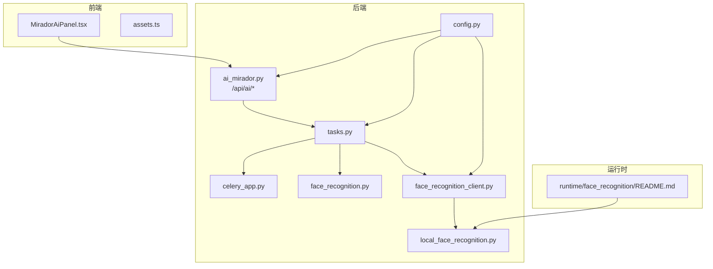
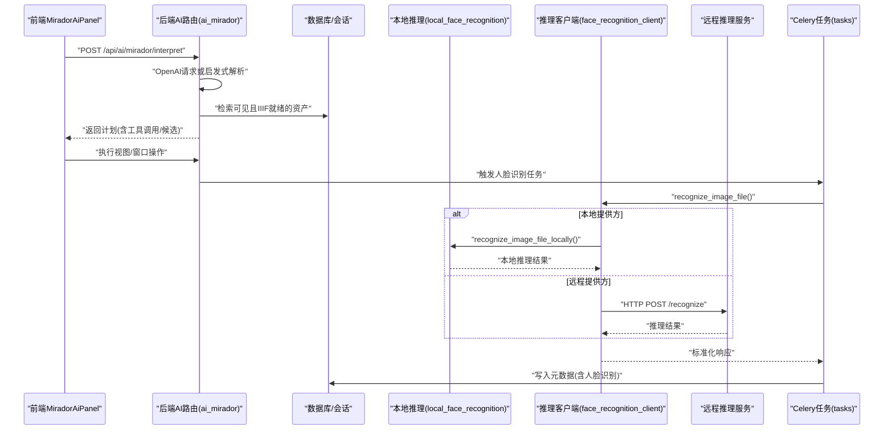
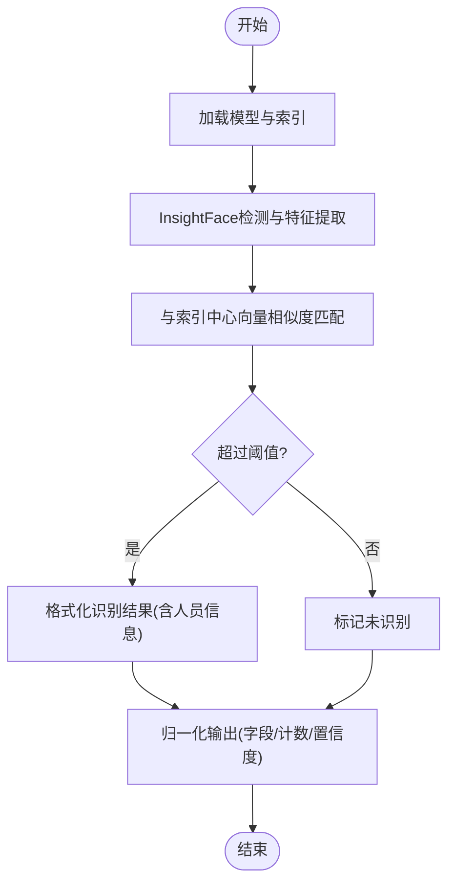
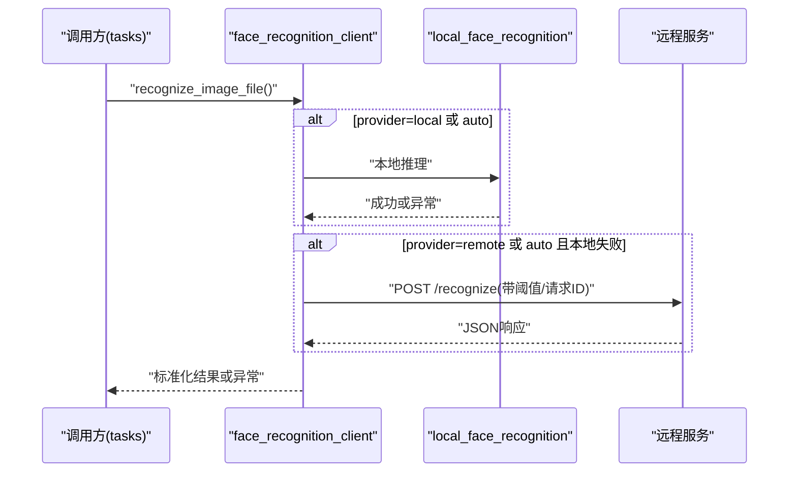
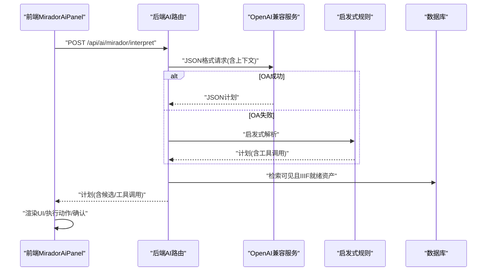
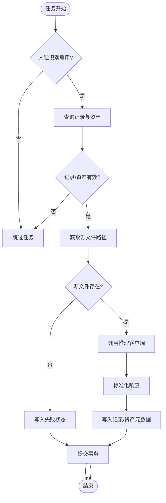
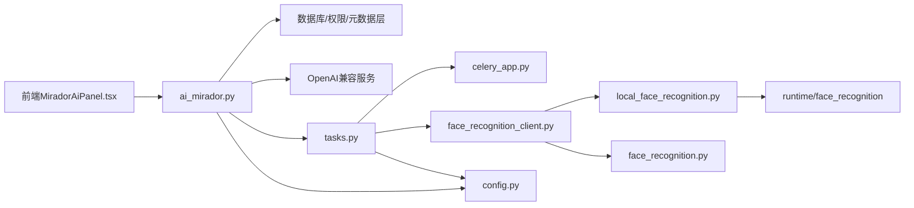

# AI智能处理系统

<cite>
**本文引用的文件**
- [face_recognition.py](file://backend/app/services/face_recognition.py)
- [local_face_recognition.py](file://backend/app/services/local_face_recognition.py)
- [face_recognition_client.py](file://backend/app/services/face_recognition_client.py)
- [ai_mirador.py](file://backend/app/routers/ai_mirador.py)
- [config.py](file://backend/app/config.py)
- [tasks.py](file://backend/app/tasks.py)
- [celery_app.py](file://backend/app/celery_app.py)
- [MiradorAiPanel.tsx](file://frontend/src/MiradorAiPanel.tsx)
- [assets.ts](file://frontend/src/types/assets.ts)
- [README.md](file://backend/runtime/face_recognition/README.md)
- [API_ROUTE_MAP.md](file://docs/02-架构设计/API_ROUTE_MAP.md)
- [AI_DEVELOPMENT_GUIDE.md](file://docs/01-总览/AI_DEVELOPMENT_GUIDE.md)
</cite>

## 目录
1. [简介](#简介)
2. [项目结构](#项目结构)
3. [核心组件](#核心组件)
4. [架构总览](#架构总览)
5. [详细组件分析](#详细组件分析)
6. [依赖分析](#依赖分析)
7. [性能考虑](#性能考虑)
8. [故障排查指南](#故障排查指南)
9. [结论](#结论)
10. [附录](#附录)

## 简介
本文件面向MDAMS原型项目的AI智能处理系统，聚焦两大能力：
- 面部识别：基于InsightFace框架的本地推理与远程服务对接，支持模型加载、人脸检测、特征提取、索引检索与结果归一化。
- AI辅助Mirador面板：自然语言解析为可执行计划，结合资产检索与Mirador视图/窗口控制，实现智能标注、自动标记、相似图像推荐与元数据提取。

系统同时提供本地与远程AI服务的集成方案、权限控制与访问限制、配置与管理、异步任务与错误处理、以及使用示例与最佳实践。

## 项目结构
AI相关能力分布在后端FastAPI服务、Celery异步任务、前端Mirador面板三部分，并通过API路由与类型定义进行协作。

**图表来源**
- [ai_mirador.py:1-702](file://backend/app/routers/ai_mirador.py#L1-L702)
- [tasks.py:1-262](file://backend/app/tasks.py#L1-L262)
- [celery_app.py:1-19](file://backend/app/celery_app.py#L1-L19)
- [face_recognition.py:1-140](file://backend/app/services/face_recognition.py#L1-L140)
- [local_face_recognition.py:1-346](file://backend/app/services/local_face_recognition.py#L1-L346)
- [face_recognition_client.py:1-134](file://backend/app/services/face_recognition_client.py#L1-L134)
- [config.py:1-72](file://backend/app/config.py#L1-L72)
- [MiradorAiPanel.tsx:1-948](file://frontend/src/MiradorAiPanel.tsx#L1-L948)
- [assets.ts:346-397](file://frontend/src/types/assets.ts#L346-L397)
- [README.md:1-44](file://backend/runtime/face_recognition/README.md#L1-L44)

**章节来源**
- [API_ROUTE_MAP.md:123-126](file://docs/02-架构设计/API_ROUTE_MAP.md#L123-L126)
- [AI_DEVELOPMENT_GUIDE.md:1-120](file://docs/01-总览/AI_DEVELOPMENT_GUIDE.md#L1-L120)

## 核心组件
- 面部识别服务
  - 本地推理：InsightFace + ONNX Runtime，支持CUDA优先、模型文件校验、索引中心向量化、相似度匹配与置信度转换。
  - 远程推理：HTTP客户端封装，支持多候选URL、超时与错误聚合。
  - 结果归一化：统一字段、去重人名、统计计数、附加图像尺寸。
- AI辅助Mirador
  - 自然语言解析：OpenAI兼容接口或启发式规则，输出标准化计划（含工具调用）。
  - 资产检索：基于元数据层的关键词匹配与排序，过滤可见性与IIIF就绪状态。
  - 视图/窗口控制：缩放、平移、重置、适配窗口、比较模式切换、打开/关闭比较窗口。
- 异步任务与配置
  - Celery任务：业务活动照片的人脸识别异步处理，失败回退与元数据落库。
  - 配置项：OpenAI/Moonshot兼容、人脸识别开关、提供方、阈值、模型路径、索引目录、严格模型校验等。

**章节来源**
- [face_recognition.py:48-140](file://backend/app/services/face_recognition.py#L48-L140)
- [local_face_recognition.py:103-346](file://backend/app/services/local_face_recognition.py#L103-L346)
- [face_recognition_client.py:16-134](file://backend/app/services/face_recognition_client.py#L16-L134)
- [ai_mirador.py:478-688](file://backend/app/routers/ai_mirador.py#L478-L688)
- [tasks.py:189-262](file://backend/app/tasks.py#L189-L262)
- [config.py:48-72](file://backend/app/config.py#L48-L72)

## 架构总览
AI智能处理系统采用“前端交互 + 后端API + 异步任务 + 本地/远程AI”的分层架构。前端Mirador面板通过自然语言输入触发后端AI解析，后端根据策略选择OpenAI或启发式规则生成计划；当涉及相似图像推荐时，后端执行资产检索并返回候选；当涉及人脸识别时，后端通过Celery异步任务调用本地或远程推理服务，最终将结果写入资产与记录的元数据层。

**图表来源**
- [ai_mirador.py:583-688](file://backend/app/routers/ai_mirador.py#L583-L688)
- [tasks.py:189-262](file://backend/app/tasks.py#L189-L262)
- [face_recognition_client.py:91-134](file://backend/app/services/face_recognition_client.py#L91-L134)
- [local_face_recognition.py:282-346](file://backend/app/services/local_face_recognition.py#L282-L346)

## 详细组件分析

### 面部识别：InsightFace集成与推理
- 模型加载与运行时
  - 通过InsightFace的FaceAnalysis初始化，优先使用CUDAExecutionProvider，否则回退CPU。
  - 严格模型校验：确保必需的ONNX模型文件存在，缺失时报错。
- 推理流程
  - 读取图像，调用get进行人脸检测与特征提取，返回每张人脸的嵌入向量、边界框、关键点等。
  - 加载人脸索引（meta.json + embeddings.pkl），计算聚类中心向量，与人脸特征向量做余弦相似度匹配。
  - 将最高分超过阈值的聚类作为识别结果，格式化人员信息（ID、姓名、头像URL等）。
- 结果归一化
  - 统一字段命名、清洗字符串、规范化数值、去重并保留顺序的人名、统计人脸数量与识别数量。
- 错误处理
  - 导入依赖缺失、图像加载失败、推理异常、索引文件损坏等均抛出自定义错误，便于上层捕获与降级。

**图表来源**
- [local_face_recognition.py:103-346](file://backend/app/services/local_face_recognition.py#L103-L346)
- [face_recognition.py:86-140](file://backend/app/services/face_recognition.py#L86-L140)

**章节来源**
- [local_face_recognition.py:79-101](file://backend/app/services/local_face_recognition.py#L79-L101)
- [local_face_recognition.py:103-147](file://backend/app/services/local_face_recognition.py#L103-L147)
- [local_face_recognition.py:205-279](file://backend/app/services/local_face_recognition.py#L205-L279)
- [local_face_recognition.py:282-346](file://backend/app/services/local_face_recognition.py#L282-L346)
- [face_recognition.py:48-140](file://backend/app/services/face_recognition.py#L48-L140)

### 人脸识别客户端与远程服务集成
- 提供方选择
  - 支持local、remote、auto三种策略：auto时优先尝试本地，失败则回退远程。
- 远程候选URL
  - 自动拼接多种常见路径，避免硬编码差异。
- 超时与错误聚合
  - 统一超时配置，逐个URL重试，聚合错误信息，最终抛出可读异常。
- 本地回退
  - 当remote失败且provider为auto时，记录错误并抛出汇总信息。

**图表来源**
- [face_recognition_client.py:91-134](file://backend/app/services/face_recognition_client.py#L91-L134)
- [local_face_recognition.py:282-346](file://backend/app/services/local_face_recognition.py#L282-L346)

**章节来源**
- [face_recognition_client.py:16-88](file://backend/app/services/face_recognition_client.py#L16-L88)
- [face_recognition_client.py:91-134](file://backend/app/services/face_recognition_client.py#L91-L134)

### AI辅助Mirador面板：自然语言到计划
- 输入与权限
  - 需具备image.view权限；携带当前资源上下文（标题、编号、Manifest URL等）。
- 解析策略
  - 优先调用OpenAI兼容接口（Moonshot/Kimi亦可），要求JSON输出；若失败则回退启发式规则。
  - 启发式规则覆盖缩放、平移、重置、适配、比较模式切换、相似图像查找等常见意图。
- 工具调用映射
  - 将计划动作映射为标准化工具调用（viewport缩放/平移/重置/适配、workspace模式切换、window打开/关闭、asset搜索等）。
- 资产检索
  - 基于元数据层文本扁平化与关键词匹配，过滤不可见与非IIIF就绪资产，按得分排序返回候选。
- 前端交互
  - 前端MiradorAiPanel接收计划，渲染操作按钮、候选列表与日志；支持确认执行、快捷操作与视口校验。

**图表来源**
- [ai_mirador.py:478-688](file://backend/app/routers/ai_mirador.py#L478-L688)
- [MiradorAiPanel.tsx:581-635](file://frontend/src/MiradorAiPanel.tsx#L581-L635)

**章节来源**
- [ai_mirador.py:583-688](file://backend/app/routers/ai_mirador.py#L583-L688)
- [MiradorAiPanel.tsx:525-635](file://frontend/src/MiradorAiPanel.tsx#L525-L635)
- [assets.ts:363-397](file://frontend/src/types/assets.ts#L363-L397)

### 异步任务与错误处理
- 任务入口
  - Celery应用绑定Redis作为Broker/Backend，任务模块包含人脸识别与IIIF派生生成等。
- 人脸识别任务
  - 仅对业务活动记录且当前资产有效时执行；从资产原始文件路径获取源图，调用推理客户端；标准化后写入记录与资产的元数据层；异常时写入失败状态。
- 失败回退
  - 本地推理异常、远程服务异常、源文件缺失等均记录失败状态并提交数据库。

**图表来源**
- [tasks.py:189-262](file://backend/app/tasks.py#L189-L262)
- [face_recognition_client.py:91-134](file://backend/app/services/face_recognition_client.py#L91-L134)
- [face_recognition.py:86-140](file://backend/app/services/face_recognition.py#L86-L140)

**章节来源**
- [celery_app.py:1-19](file://backend/app/celery_app.py#L1-L19)
- [tasks.py:189-262](file://backend/app/tasks.py#L189-L262)

### 权限控制与访问限制
- 身份与权限
  - AI解析接口要求image.view权限；资产可见性通过visibility_scope与collection_object_id进行校验。
- 资产可见性
  - 从资产元数据层提取visibility_scope与collection_object_id，结合用户权限判断是否可见。
- 前端鉴权
  - 前端MiradorAiPanel在请求头中携带Bearer Token，确保与后端认证一致。

**章节来源**
- [ai_mirador.py:278-286](file://backend/app/routers/ai_mirador.py#L278-L286)
- [MiradorAiPanel.tsx:185-188](file://frontend/src/MiradorAiPanel.tsx#L185-L188)

### 配置与管理
- OpenAI/Moonshot兼容
  - 支持OPENAI_*与MOONSHOT_*变量，保持命名一致性以便替换。
- 人脸识别配置
  - 开关、提供方、超时、阈值、模型根目录、模型名称、索引目录、严格模型校验等。
- 运行时布局
  - 本地推理所需模型与索引文件的目录结构与迁移说明。

**章节来源**
- [config.py:48-72](file://backend/app/config.py#L48-L72)
- [README.md:1-44](file://backend/runtime/face_recognition/README.md#L1-L44)

## 依赖分析
- 组件耦合
  - ai_mirador路由依赖数据库会话、权限模块、IIIF就绪检查与元数据层；与tasks解耦，通过Celery异步调用。
  - tasks依赖推理客户端与归一化服务，间接依赖本地推理实现。
  - 前端MiradorAiPanel依赖后端API与类型定义，不直接依赖后端实现细节。
- 外部依赖
  - OpenAI兼容服务（Moonshot/Kimi）、Redis（Celery）、InsightFace/ONNX Runtime、Cantaloupe IIIF服务。

**图表来源**
- [ai_mirador.py:1-702](file://backend/app/routers/ai_mirador.py#L1-L702)
- [tasks.py:1-262](file://backend/app/tasks.py#L1-L262)
- [face_recognition_client.py:1-134](file://backend/app/services/face_recognition_client.py#L1-L134)
- [local_face_recognition.py:1-346](file://backend/app/services/local_face_recognition.py#L1-L346)
- [face_recognition.py:1-140](file://backend/app/services/face_recognition.py#L1-L140)
- [config.py:1-72](file://backend/app/config.py#L1-L72)
- [celery_app.py:1-19](file://backend/app/celery_app.py#L1-L19)
- [README.md:1-44](file://backend/runtime/face_recognition/README.md#L1-L44)

**章节来源**
- [API_ROUTE_MAP.md:123-126](file://docs/02-架构设计/API_ROUTE_MAP.md#L123-L126)

## 性能考虑
- 本地推理优化
  - 优先CUDA执行提供程序，减少CPU开销；模型文件严格校验避免运行时失败。
  - 索引中心向量预计算，相似度匹配使用向量点积，复杂度与人脸数量线性相关。
- 远程推理
  - 多候选URL与统一超时，提升可用性；建议在网关层做健康检查与熔断。
- 异步处理
  - 人脸识别放入Celery队列，避免阻塞API；合理设置队列与并发。
- 前端交互
  - 视口动作执行后进行状态校验，避免UI与实际状态不一致。

[本节为通用指导，无需具体文件分析]

## 故障排查指南
- OpenAI请求失败
  - 检查OPENAI_API_KEY、OPENAI_BASE_URL、OPENAI_MODEL与超时配置；查看后端日志中的失败原因。
- 人脸识别失败
  - 本地：确认模型与索引文件完整、CUDA驱动可用；查看依赖导入错误与图像加载失败。
  - 远程：确认候选URL、超时与网络连通性；查看聚合错误信息。
- 资产不可见或无候选
  - 检查visibility_scope与collection_object_id；确认IIIF就绪状态；调整关键词或扩大候选数量。
- 前端无响应或UI不一致
  - 确认鉴权Token；检查视口校验逻辑与窗口数量；查看日志条目。

**章节来源**
- [ai_mirador.py:518-551](file://backend/app/routers/ai_mirador.py#L518-L551)
- [face_recognition_client.py:74-88](file://backend/app/services/face_recognition_client.py#L74-L88)
- [local_face_recognition.py:103-114](file://backend/app/services/local_face_recognition.py#L103-L114)
- [MiradorAiPanel.tsx:434-443](file://frontend/src/MiradorAiPanel.tsx#L434-L443)

## 结论
MDAMS的AI智能处理系统以清晰的分层架构实现了从自然语言到Mirador视图/窗口控制的闭环，同时提供了可插拔的人脸识别能力（本地/远程）。通过Celery异步任务与严格的权限控制，系统在保证用户体验的同时兼顾了稳定性与合规性。建议在生产环境中完善服务发现与熔断、细化指标监控与告警，并持续优化提示词与启发式规则以提升识别准确率。

[本节为总结性内容，无需具体文件分析]

## 附录

### API接口与使用示例
- AI解析接口
  - 方法与路径：POST /api/ai/mirador/interpret
  - 请求体：包含prompt与当前资源上下文（资源ID、标题、编号、Manifest URL、最大候选数等）
  - 返回：标准化计划（action、assistant_message、requires_confirmation、search_query、search_results、target_asset、compare_mode、pan_pixels、zoom_factor、tool_call）
  - 示例路径：[ai_mirador.py:583-688](file://backend/app/routers/ai_mirador.py#L583-L688)
- 资产检索接口
  - 方法与路径：GET /api/ai/assets/search?q=关键词&limit=N
  - 返回：搜索结果列表（asset_id、title、manifest_url、resource_id、object_number、filename、score、reasons）
  - 示例路径：[ai_mirador.py:691-702](file://backend/app/routers/ai_mirador.py#L691-L702)
- 前端调用示例
  - 发送自然语言指令并接收计划：[MiradorAiPanel.tsx:581-635](file://frontend/src/MiradorAiPanel.tsx#L581-L635)
  - 渲染候选列表与执行动作：[MiradorAiPanel.tsx:656-800](file://frontend/src/MiradorAiPanel.tsx#L656-L800)

**章节来源**
- [ai_mirador.py:583-702](file://backend/app/routers/ai_mirador.py#L583-L702)
- [MiradorAiPanel.tsx:581-800](file://frontend/src/MiradorAiPanel.tsx#L581-L800)

### 配置示例
- OpenAI/Moonshot
  - OPENAI_API_KEY、OPENAI_BASE_URL、OPENAI_MODEL、OPENAI_TIMEOUT_SECONDS
  - MOONSHOT_API_KEY、MOONSHOT_BASE_URL、MOONSHOT_MODEL
  - 示例路径：[config.py:48-58](file://backend/app/config.py#L48-L58)
- 人脸识别
  - FACE_RECOGNITION_ENABLED、FACE_RECOGNITION_PROVIDER、FACE_RECOGNITION_BASE_URL、FACE_RECOGNITION_TIMEOUT_SECONDS、FACE_RECOGNITION_THRESHOLD、FACE_RECOGNITION_MODEL_ROOT、FACE_RECOGNITION_MODEL_NAME、FACE_RECOGNITION_INDEX_DIR、FACE_RECOGNITION_STRICT_LOCAL_MODELS
  - 示例路径：[config.py:60-72](file://backend/app/config.py#L60-L72)
- 运行时布局
  - 模型与索引目录结构、迁移步骤
  - 示例路径：[README.md:6-36](file://backend/runtime/face_recognition/README.md#L6-L36)

**章节来源**
- [config.py:48-72](file://backend/app/config.py#L48-L72)
- [README.md:6-36](file://backend/runtime/face_recognition/README.md#L6-L36)

### 最佳实践
- 提示词工程：为OpenAI提供清晰的系统提示与工具调用约束，减少歧义。
- 启发式规则：针对常见意图建立稳定规则，降低对外部服务依赖。
- 异步化：将耗时任务放入Celery，配合重试与失败回退。
- 权限与隐私：严格校验资源可见性，避免泄露敏感元数据；必要时对识别结果进行脱敏处理。
- 监控与告警：记录AI解析与推理的关键指标，设置超时与失败阈值告警。

[本节为通用指导，无需具体文件分析]