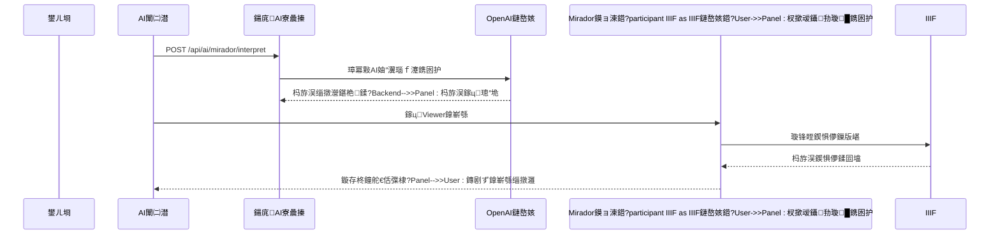
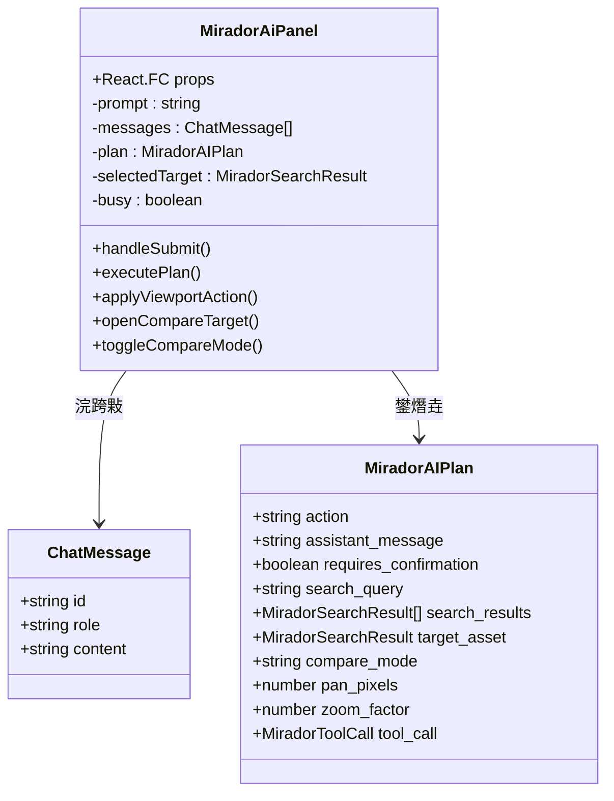
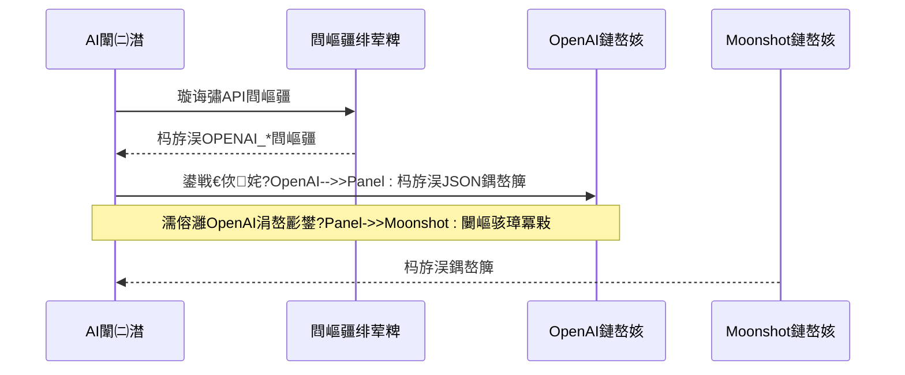
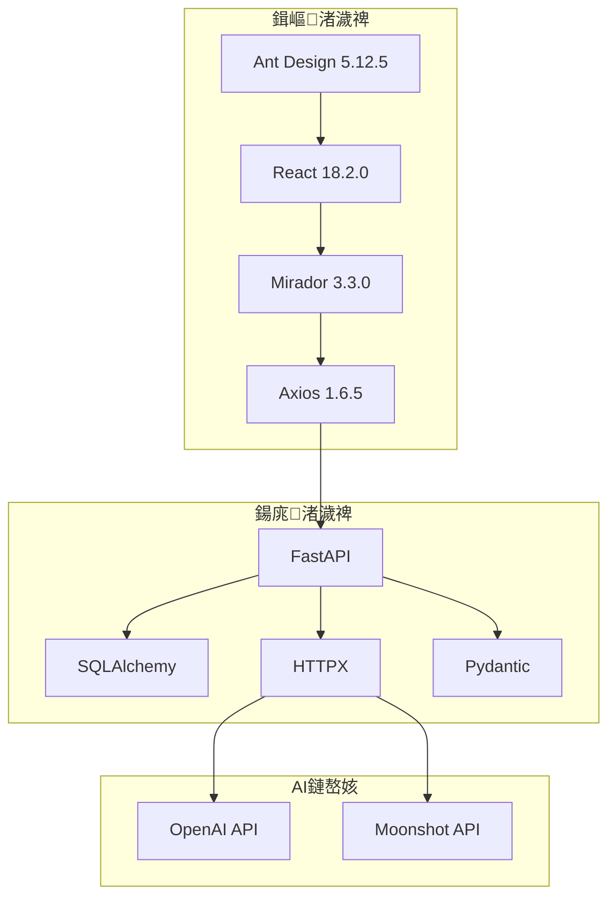

# AI杈呭姪Mirador闈㈡澘

<cite>
**鏈枃妗ｅ紩鐢ㄧ殑鏂囦欢**
- [MiradorAiPanel.tsx](file://frontend/src/MiradorAiPanel.tsx)
- [MiradorViewer.tsx](file://frontend/src/MiradorViewer.tsx)
- [assets.ts](file://frontend/src/types/assets.ts)
- [ai_mirador.py](file://backend/app/routers/ai_mirador.py)
- [config.py](file://backend/app/config.py)
- [metadata_layers.py](file://backend/app/services/metadata_layers.py)
- [API_ROUTE_MAP.md](file://docs/02-鏋舵瀯璁捐/API_ROUTE_MAP.md)
- [ENVIRONMENT_VARIABLES.md](file://docs/05-閮ㄧ讲涓庤繍缁?ENVIRONMENT_VARIABLES.md)
- [mirador-ai.spec.ts](file://frontend/tests/mirador-ai.spec.ts)
- [test_ai_mirador.py](file://backend/tests/test_ai_mirador.py)
</cite>

## 鐩綍
1. [绠€浠媇(#绠€浠?
2. [椤圭洰缁撴瀯](#椤圭洰缁撴瀯)
3. [鏍稿績缁勪欢](#鏍稿績缁勪欢)
4. [鏋舵瀯姒傝](#鏋舵瀯姒傝)
5. [璇︾粏缁勪欢鍒嗘瀽](#璇︾粏缁勪欢鍒嗘瀽)
6. [渚濊禆鍒嗘瀽](#渚濊禆鍒嗘瀽)
7. [鎬ц兘鑰冭檻](#鎬ц兘鑰冭檻)
8. [鏁呴殰鎺掗櫎鎸囧崡](#鏁呴殰鎺掗櫎鎸囧崡)
9. [缁撹](#缁撹)
10. [闄勫綍](#闄勫綍)

## 绠€浠?AI杈呭姪Mirador闈㈡澘鏄竴涓垱鏂扮殑鍥惧儚娴忚澧炲己绯荤粺锛屽皢鑷劧璇█澶勭悊涓嶪IIF鍥惧儚鏌ョ湅鍣ㄦ繁搴﹂泦鎴愩€傝绯荤粺閫氳繃AI鍔╂墜鐞嗚В鐢ㄦ埛鐨勮嚜鐒惰瑷€鎸囦护锛岃嚜鍔ㄦ墽琛岀缉鏀俱€佸钩绉汇€佸浘鍍忔瘮杈冪瓑澶嶆潅鎿嶄綔锛屽苟鎻愪緵鏅鸿兘鐨勭浉浼煎浘鍍忔悳绱㈠姛鑳姐€?
绯荤粺鐨勬牳蹇冧环鍊煎湪浜庯細
- **鑷劧璇█浜や簰**锛氱敤鎴峰彲浠ョ敤涓枃鎴栬嫳鏂囨弿杩板浘鍍忔搷浣滈渶姹?- **鏅鸿兘鍔ㄤ綔瑙勫垝**锛欰I灏嗚嚜鐒惰瑷€杞崲涓虹簿纭殑Viewer鎿嶄綔搴忓垪
- **澶氭ā鎬佹悳绱?*锛氬熀浜庡厓鏁版嵁鐨勬櫤鑳藉浘鍍忔绱㈠拰姣旇緝
- **瀹夊叏鍙帶**锛氬畬鏁寸殑鏉冮檺楠岃瘉鍜屾搷浣滅‘璁ゆ満鍒?
## 椤圭洰缁撴瀯
璇ラ」鐩噰鐢ㄥ墠鍚庣鍒嗙鏋舵瀯锛孉I杈呭姪鍔熻兘浣嶄簬MDAMS鍘熷瀷椤圭洰鐨勭壒瀹氬瓙绯荤粺涓細

```mermaid
graph TB
subgraph "鍓嶇搴旂敤"
A[MiradorViewer.tsx]
B[MiradorAiPanel.tsx]
C[types/assets.ts]
end
subgraph "鍚庣鏈嶅姟"
D[ai_mirador.py]
E[config.py]
F[metadata_layers.py]
end
subgraph "澶栭儴鏈嶅姟"
G[OpenAI/Moonshot API]
H[IIIF鏈嶅姟鍣╙
I[鏁版嵁搴揮
end
A --> B
B --> D
D --> E
D --> F
D --> I
B --> H
D --> G
```

**鍥捐〃鏉ユ簮**
- [MiradorViewer.tsx:64-399](file://frontend/src/MiradorViewer.tsx#L64-L399)
- [ai_mirador.py:20-702](file://backend/app/routers/ai_mirador.py#L20-L702)

**绔犺妭鏉ユ簮**
- [API_ROUTE_MAP.md:123-126](file://docs/02-鏋舵瀯璁捐/API_ROUTE_MAP.md#L123-L126)

## 鏍稿績缁勪欢
绯荤粺鐢变笁涓富瑕佺粍浠舵瀯鎴愶細

### 鍓嶇浜や簰灞?- **MiradorViewer**锛氭壙杞絀IIF鏌ョ湅鍣ㄧ殑涓诲鍣紝璐熻矗璧勬簮鍏冩暟鎹В鏋愬拰鏉冮檺澶勭悊
- **MiradorAiPanel**锛欰I鎺у埗闈㈡澘锛屾彁渚涜嚜鐒惰瑷€杈撳叆銆佹搷浣滄墽琛屽拰鐘舵€佸弽棣?- **绫诲瀷瀹氫箟**锛氬畬鏁寸殑TypeScript绫诲瀷绯荤粺锛岀‘淇濆墠鍚庣鏁版嵁涓€鑷存€?
### 鍚庣AI寮曟搸
- **AI鎸囦护瑙ｆ瀽鍣?*锛氬皢鑷劧璇█杞崲涓哄彲鎵ц鐨勬搷浣滆鍒?- **宸ュ叿璋冪敤绯荤粺**锛氭爣鍑嗗寲鐨勫伐鍏锋敞鍐岃〃锛屾敮鎸佸绉峍iewer鎿嶄綔
- **鎼滅储绠楁硶**锛氬熀浜庡厓鏁版嵁鐨勬櫤鑳藉浘鍍忓尮閰嶅拰鎺掑簭

### 闆嗘垚鏈嶅姟
- **OpenAI/Moonshot闆嗘垚**锛氭彁渚涘己澶х殑鑷劧璇█鐞嗚В鍜孞SON缁撴瀯鍖栬緭鍑?- **IIIF鍗忚鏀寔**锛氬畬鏁寸殑鍥惧儚璁块棶鍜岄瑙堝姛鑳?- **鏉冮檺鎺у埗绯荤粺**锛氬熀浜庣敤鎴疯鑹茬殑璧勬簮璁块棶楠岃瘉

**绔犺妭鏉ユ簮**
- [MiradorAiPanel.tsx:237-948](file://frontend/src/MiradorAiPanel.tsx#L237-L948)
- [ai_mirador.py:79-104](file://backend/app/routers/ai_mirador.py#L79-L104)

## 鏋舵瀯姒傝
绯荤粺閲囩敤鍒嗗眰鏋舵瀯璁捐锛岀‘淇濆悇缁勪欢闂寸殑鏉捐€﹀悎鍜岄珮鍐呰仛锛?


**鍥捐〃鏉ユ簮**
- [ai_mirador.py:583-688](file://backend/app/routers/ai_mirador.py#L583-L688)
- [MiradorAiPanel.tsx:581-635](file://frontend/src/MiradorAiPanel.tsx#L581-L635)

绯荤粺鐨勫叧閿壒鎬у寘鎷細
- **寮傛澶勭悊**锛欰I瑙ｆ瀽鍜屽浘鍍忓姞杞介噰鐢ㄥ紓姝ユā寮忥紝鎻愬崌鐢ㄦ埛浣撻獙
- **閿欒鎭㈠**锛氬畬鍠勭殑寮傚父澶勭悊鍜岄檷绾х瓥鐣?- **鐘舵€佸悓姝?*锛氬疄鏃剁洃鎺iewer鐘舵€佸彉鍖栵紝纭繚鎿嶄綔鍑嗙‘鎬?
## 璇︾粏缁勪欢鍒嗘瀽

### AI鎸囦护瑙ｆ瀽鍣?AI鎸囦护瑙ｆ瀽鍣ㄦ槸绯荤粺鐨勬牳蹇冿紝璐熻矗灏嗚嚜鐒惰瑷€杞崲涓哄彲鎵ц鐨勬搷浣滆鍒掞細

```mermaid
flowchart TD
A[鎺ユ敹鑷劧璇█鎸囦护] --> B[棰勫鐞嗗拰瑙勮寖鍖朷
B --> C{AI鍙敤?}
C --> |鏄瘄 D[璋冪敤OpenAI瑙ｆ瀽]
C --> |鍚 E[浣跨敤鍚彂寮忚鍒橾
D --> F[鎻愬彇JSON缁撴瀯]
E --> F
F --> G[楠岃瘉鍔ㄤ綔绫诲瀷]
G --> H[鏋勫缓鎵ц璁″垝]
H --> I[闄勫姞宸ュ叿璋冪敤淇℃伅]
I --> J[杩斿洖缁欏墠绔痌
```

**鍥捐〃鏉ユ簮**
- [ai_mirador.py:478-551](file://backend/app/routers/ai_mirador.py#L478-L551)
- [ai_mirador.py:559-580](file://backend/app/routers/ai_mirador.py#L559-L580)

#### 鍔ㄤ綔绫诲瀷鏀寔
绯荤粺鏀寔浠ヤ笅11绉嶆牳蹇冨姩浣滐細
- 瑙嗗浘鎺у埗锛歾oom_in, zoom_out, pan_left, pan_right, pan_up, pan_down, reset_view, fit_to_window
- 姣旇緝妯″紡锛歴witch_compare_mode, open_compare, close_compare
- 鎼滅储鍔熻兘锛歴earch_assets
- 绌烘搷浣滐細noop

#### 宸ュ叿璋冪敤鏍囧噯鍖?姣忎釜鍔ㄤ綔閮芥槧灏勫埌鏍囧噯鍖栫殑宸ュ叿璋冪敤锛屾敮鎸侊細
- mirador.viewport.zoom锛堢缉鏀炬帶鍒讹級
- mirador.viewport.pan锛堝钩绉绘帶鍒讹級
- asset.search锛堝浘鍍忔悳绱級
- mirador.window.open_compare锛堟墦寮€姣旇緝锛?
**绔犺妭鏉ユ簮**
- [ai_mirador.py:23-49](file://backend/app/routers/ai_mirador.py#L23-L49)
- [ai_mirador.py:124-177](file://backend/app/routers/ai_mirador.py#L124-L177)

### 鍓嶇AI闈㈡澘缁勪欢
AI闈㈡澘鎻愪緵鐩磋鐨勭敤鎴蜂氦浜掔晫闈細



**鍥捐〃鏉ユ簮**
- [MiradorAiPanel.tsx:49-54](file://frontend/src/MiradorAiPanel.tsx#L49-L54)
- [assets.ts:363-387](file://frontend/src/types/assets.ts#L363-L387)

#### 浜や簰璁捐鐗规€?- **瀵硅瘽寮忕晫闈?*锛氬疄鏃舵秷鎭褰曞拰鐘舵€佸弽棣?- **鏅鸿兘寤鸿**锛氬熀浜庡巻鍙叉搷浣滅殑蹇嵎鎸夐挳
- **纭娴佺▼**锛氶噸瑕佹搷浣滅殑浜屾纭鏈哄埗
- **瑙嗚鍙嶉**锛氭搷浣滅姸鎬佺殑瀹炴椂鍙鍖?
**绔犺妭鏉ユ簮**
- [MiradorAiPanel.tsx:658-800](file://frontend/src/MiradorAiPanel.tsx#L658-L800)

### 鎼滅储绠楁硶瀹炵幇
绯荤粺瀹炵幇浜嗛珮鏁堢殑鍥惧儚鎼滅储鍜屽尮閰嶇畻娉曪細

```mermaid
flowchart TD
A[鐢ㄦ埛鎼滅储鏌ヨ] --> B[鏂囨湰棰勫鐞哴
B --> C[鍏冩暟鎹彁鍙朷
C --> D[鍏抽敭璇嶅垎璇峕
D --> E[澶氬瓧娈靛尮閰峕
E --> F[鐩镐技搴﹁瘎鍒哴
F --> G[缁撴灉鎺掑簭]
G --> H[杩斿洖鍓峃涓粨鏋淽
subgraph "鍏冩暟鎹瓧娈?
I[鏍囬]
J[鏂囩墿鍙穄
K[鏂囦欢鍚峕
L[瀹屾暣鍏冩暟鎹甝
end
C --> I
C --> J
C --> K
C --> L
```

**鍥捐〃鏉ユ簮**
- [ai_mirador.py:338-368](file://backend/app/routers/ai_mirador.py#L338-L368)
- [ai_mirador.py:391-415](file://backend/app/routers/ai_mirador.py#L391-L415)

#### 鍏冩暟鎹鐞嗘祦绋?1. **鏍囬鎻愬彇**锛氫粠澶氬眰鍏冩暟鎹腑鎻愬彇鏈€鍚堥€傜殑鏍囬
2. **鍙鎬ф鏌?*锛氬熀浜庣敤鎴锋潈闄愯繃婊や笉鍙璧勬簮
3. **IIIF灏辩华妫€鏌?*锛氱‘淇濈洰鏍囧浘鍍忓凡鍑嗗濂借闂?4. **鐩镐技搴﹁绠?*锛氬熀浜庡叧閿瘝鍖归厤鍜岀簿纭尮閰嶈绠楀垎鏁?
**绔犺妭鏉ユ簮**
- [ai_mirador.py:308-336](file://backend/app/routers/ai_mirador.py#L308-L336)
- [ai_mirador.py:342-368](file://backend/app/routers/ai_mirador.py#L342-L368)

### OpenAI闆嗘垚鏂规
绯荤粺鎻愪緵浜嗙伒娲荤殑AI鏈嶅姟闆嗘垚锛?


**鍥捐〃鏉ユ簮**
- [ai_mirador.py:478-551](file://backend/app/routers/ai_mirador.py#L478-L551)
- [config.py:48-58](file://backend/app/config.py#L48-L58)

#### 閰嶇疆绠＄悊
绯荤粺鏀寔澶氱AI鏈嶅姟鎻愪緵鍟嗭細
- **OpenAI**锛氭爣鍑哋penAI API鍏煎
- **Moonshot**锛欿imi AI鏈嶅姟锛屽畬鍏ㄥ吋瀹筄penAI鎺ュ彛
- **鑷畾涔?*锛氭敮鎸佷换鎰廜penAI鍏煎鐨勬湇鍔?
**绔犺妭鏉ユ簮**
- [config.py:55-58](file://backend/app/config.py#L55-L58)
- [ENVIRONMENT_VARIABLES.md:35-43](file://docs/05-閮ㄧ讲涓庤繍缁?ENVIRONMENT_VARIABLES.md#L35-L43)

## 渚濊禆鍒嗘瀽
绯荤粺渚濊禆鍏崇郴娓呮櫚锛屽悇缁勪欢鑱岃矗鏄庣‘锛?


**鍥捐〃鏉ユ簮**
- [package.json:13-26](file://frontend/package.json#L13-L26)
- [ai_mirador.py:8-18](file://backend/app/routers/ai_mirador.py#L8-L18)

### 澶栭儴渚濊禆绠＄悊
- **鍓嶇鍖呯鐞?*锛氶€氳繃package.json缁熶竴绠＄悊
- **鍚庣渚濊禆**锛歳equirements.txt闆嗕腑绠＄悊
- **AI鏈嶅姟**锛氶€氳繃鐜鍙橀噺閰嶇疆锛屾敮鎸佺儹鍒囨崲

**绔犺妭鏉ユ簮**
- [package.json:1-42](file://frontend/package.json#L1-L42)

## 鎬ц兘鑰冭檻
绯荤粺鍦ㄥ涓眰闈㈣繘琛屼簡鎬ц兘浼樺寲锛?
### 鍓嶇鎬ц兘浼樺寲
- **鐘舵€佺紦瀛?*锛歏iewer鐘舵€佸揩鐓у噺灏戦噸澶嶈绠?- **寮傛娓叉煋**锛氶暱浠诲姟寮傛鎵ц锛屼繚鎸乁I鍝嶅簲
- **鏉′欢娓叉煋**锛氭牴鎹姸鎬佸姩鎬佹樉绀虹粍浠?- **浜嬩欢鑺傛祦**锛氶珮棰戞搷浣滅殑闃叉姈澶勭悊

### 鍚庣鎬ц兘浼樺寲
- **鏁版嵁搴撶储寮?*锛氶拡瀵规悳绱㈡煡璇㈢殑浼樺寲绱㈠紩
- **缂撳瓨绛栫暐**锛氬父鐢ㄥ厓鏁版嵁鐨勫唴瀛樼紦瀛?- **骞跺彂鎺у埗**锛欰I璇锋眰鐨勫苟鍙戦檺鍒?- **瓒呮椂绠＄悊**锛氶槻姝㈤暱鏃堕棿闃诲

### 缃戠粶鎬ц兘浼樺寲
- **CDN鍔犻€?*锛氶潤鎬佽祫婧怌DN鍒嗗彂
- **鍘嬬缉浼犺緭**锛欸zip鍘嬬缉鍑忓皯甯﹀
- **杩炴帴澶嶇敤**锛欻TTP/2杩炴帴姹?- **鎳掑姞杞?*锛氶潪鍏抽敭璧勬簮寤惰繜鍔犺浇

## 鏁呴殰鎺掗櫎鎸囧崡

### 甯歌闂鍙婅В鍐虫柟妗?
#### AI瑙ｆ瀽澶辫触
**鐥囩姸**锛氱敤鎴锋寚浠ゆ棤娉曡姝ｇ‘鐞嗚В
**鍘熷洜**锛?- OpenAI API瀵嗛挜鏈厤缃?- 缃戠粶杩炴帴寮傚父
- 妯″瀷鍝嶅簲鏍煎紡閿欒

**瑙ｅ喅姝ラ**锛?1. 妫€鏌ョ幆澧冨彉閲忛厤缃?2. 楠岃瘉缃戠粶杩炴帴
3. 鏌ョ湅鍚庣鏃ュ織
4. 闄嶇骇鍒板惎鍙戝紡妯″紡

#### 鍥惧儚鍔犺浇澶辫触
**鐥囩姸**锛欼IIF鍥惧儚鏃犳硶鏄剧ず
**鍘熷洜**锛?- 鏉冮檺涓嶈冻
- 璧勬簮涓嶅瓨鍦?- 鏈嶅姟鍣ㄩ厤缃敊璇?
**瑙ｅ喅姝ラ**锛?1. 楠岃瘉鐢ㄦ埛鏉冮檺
2. 妫€鏌ヨ祫婧愮姸鎬?3. 纭IIIF鏈嶅姟鍙敤
4. 鏌ョ湅璇︾粏閿欒淇℃伅

#### 姣旇緝妯″紡寮傚父
**鐥囩姸**锛氬浘鍍忔瘮杈冨姛鑳藉け鏁?**鍘熷洜**锛?- Viewer瀹炰緥鏈氨缁?- 绐楀彛鏁伴噺寮傚父
- 宸ヤ綔鍖虹姸鎬侀敊璇?
**瑙ｅ喅姝ラ**锛?1. 绛夊緟Viewer鍒濆鍖栧畬鎴?2. 妫€鏌ョ獥鍙ｆ暟閲?3. 閲嶆柊璁剧疆宸ヤ綔鍖烘ā寮?4. 閲嶈瘯姣旇緝鎿嶄綔

**绔犺妭鏉ユ簮**
- [mirador-ai.spec.ts:239-267](file://frontend/tests/mirador-ai.spec.ts#L239-L267)
- [test_ai_mirador.py:130-253](file://backend/tests/test_ai_mirador.py#L130-L253)

## 缁撹
AI杈呭姪Mirador闈㈡澘浠ｈ〃浜嗘暟瀛椾汉鏂囬鍩熺殑涓€涓噸瑕佸垱鏂帮紝瀹冩垚鍔熷湴灏嗗厛杩涚殑AI鎶€鏈笌涓撲笟鐨勫浘鍍忔祻瑙堝伐鍏风浉缁撳悎銆傜郴缁熺殑涓昏浼樺娍鍖呮嫭锛?
### 鎶€鏈垱鏂?- **鑷劧璇█鎺ュ彛**锛氬ぇ骞呴檷浣庝簡鍥惧儚鎿嶄綔鐨勬妧鏈棬妲?- **鏅鸿兘鎼滅储**锛氬熀浜庡厓鏁版嵁鐨勭簿鍑嗗浘鍍忓尮閰?- **鏍囧噯鍖栧伐鍏疯皟鐢?*锛氫负鏈潵鐨凪CP锛圡odel Context Protocol锛夊寲濂犲畾鍩虹

### 鐢ㄦ埛浣撻獙
- **鐩磋鏄撶敤**锛氱鍚堢敤鎴风洿瑙夌殑鎿嶄綔鏂瑰紡
- **鍗虫椂鍙嶉**锛氬疄鏃剁殑鐘舵€佹洿鏂板拰閿欒鎻愮ず
- **瀹夊叏鍙潬**锛氬畬鏁寸殑鏉冮檺楠岃瘉鍜屾搷浣滅‘璁?
### 鎵╁睍娼滃姏
- **妯″潡鍖栬璁?*锛氫究浜庡姛鑳芥墿灞曞拰鎶€鏈崌绾?- **鏍囧噯鍖栨帴鍙?*锛氭敮鎸佸绉岮I鏈嶅姟鎻愪緵鍟?- **MCP鍏煎**锛氫负鏈潵鐨勬妧鏈紨杩涢鐣欑┖闂?
璇ョ郴缁熶笉浠呮彁鍗囦簡鍥惧儚娴忚鐨勬晥鐜囧拰浣撻獙锛屾洿涓烘暟瀛楁枃鍖栭仐浜х殑鏁板瓧鍖栧睍绀哄拰鐮旂┒鎻愪緵浜嗗己鏈夊姏鐨勬妧鏈敮鎾戙€?
## 闄勫綍

### API鎺ュ彛鏂囨。

#### AI鎸囦护瑙ｆ瀽鎺ュ彛
- **URL**: `/api/ai/mirador/interpret`
- **鏂规硶**: POST
- **閴存潈**: 闇€瑕乣image.view`鏉冮檺
- **璇锋眰浣?*: MiradorAIRequest
- **鍝嶅簲**: MiradorAIPlan

#### 鍥惧儚鎼滅储鎺ュ彛
- **URL**: `/api/ai/assets/search`
- **鏂规硶**: GET
- **閴存潈**: 闇€瑕乣image.view`鏉冮檺
- **鍙傛暟**:
  - `q`: 鎼滅储鍏抽敭璇?  - `limit`: 缁撴灉鏁伴噺闄愬埗
- **鍝嶅簲**: MiradorSearchResult鏁扮粍

### 閰嶇疆绀轰緥

#### 鐜鍙橀噺閰嶇疆
```bash
# OpenAI/Moonshot閰嶇疆
OPENAI_API_KEY=your_api_key_here
OPENAI_BASE_URL=https://api.openai.com/v1
OPENAI_MODEL=gpt-4-turbo
OPENAI_TIMEOUT_SECONDS=30

# 搴旂敤绋嬪簭閰嶇疆
API_PUBLIC_URL=http://localhost:3000/api
CANTALOUPE_PUBLIC_URL=http://localhost:8182/iiif/2
```

#### 鍓嶇绫诲瀷瀹氫箟
绯荤粺鎻愪緵浜嗗畬鏁寸殑TypeScript绫诲瀷瀹氫箟锛岀‘淇濈被鍨嬪畨鍏細

- **MiradorAIRequest**: 鐢ㄦ埛杈撳叆鐨勬暟鎹粨鏋?- **MiradorAIPlan**: AI鐢熸垚鐨勬墽琛岃鍒?- **MiradorSearchResult**: 鎼滅储缁撴灉鐨勬暟鎹粨鏋?- **MiradorToolCall**: 鏍囧噯鍖栫殑宸ュ叿璋冪敤

**绔犺妭鏉ユ簮**
- [assets.ts:389-397](file://frontend/src/types/assets.ts#L389-L397)
- [ENVIRONMENT_VARIABLES.md:35-43](file://docs/05-閮ㄧ讲涓庤繍缁?ENVIRONMENT_VARIABLES.md#L35-L43)
