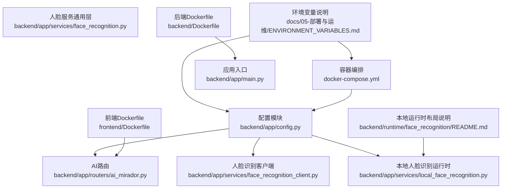
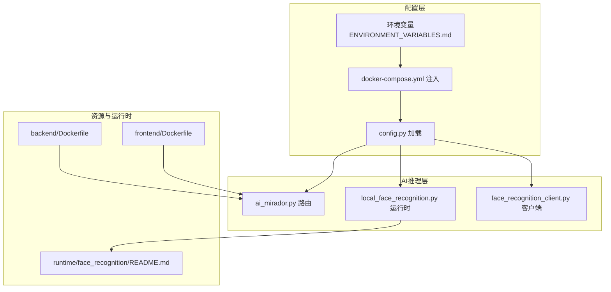
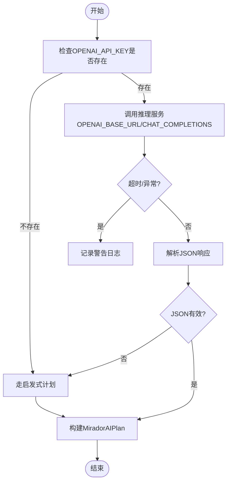
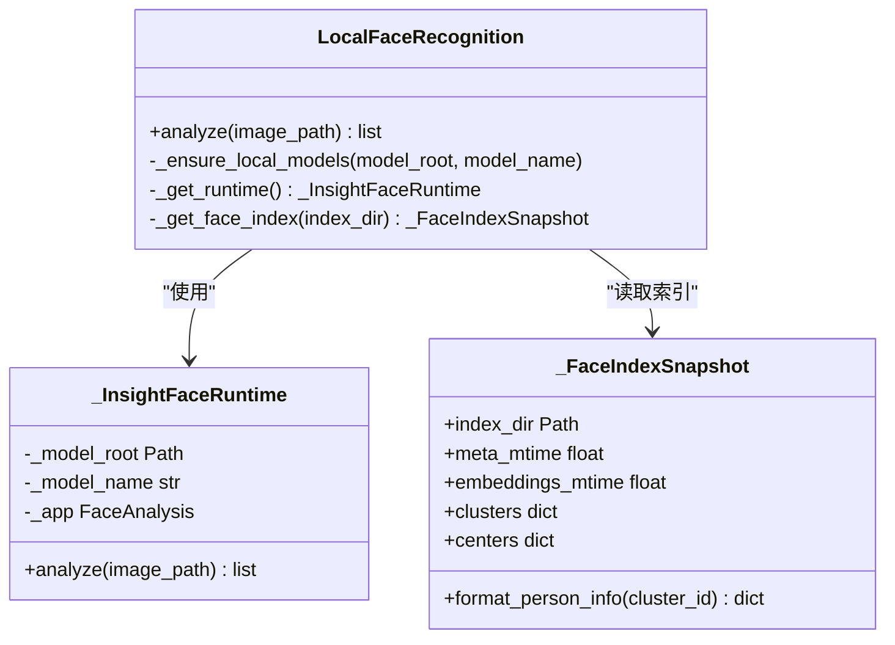
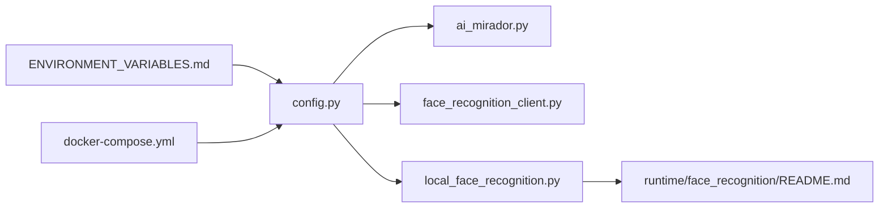

# AI配置管理

<cite>
**本文引用的文件**
- [backend/app/config.py](file://backend/app/config.py)
- [backend/app/routers/ai_mirador.py](file://backend/app/routers/ai_mirador.py)
- [backend/app/services/face_recognition.py](file://backend/app/services/face_recognition.py)
- [backend/app/services/local_face_recognition.py](file://backend/app/services/local_face_recognition.py)
- [backend/app/services/face_recognition_client.py](file://backend/app/services/face_recognition_client.py)
- [backend/runtime/face_recognition/README.md](file://backend/runtime/face_recognition/README.md)
- [docker-compose.yml](file://docker-compose.yml)
- [backend/Dockerfile](file://backend/Dockerfile)
- [frontend/Dockerfile](file://frontend/Dockerfile)
- [docs/05-部署与运维/ENVIRONMENT_VARIABLES.md](file://docs/05-部署与运维/ENVIRONMENT_VARIABLES.md)
- [backend/app/main.py](file://backend/app/main.py)
</cite>

## 目录
1. [简介](#简介)
2. [项目结构](#项目结构)
3. [核心组件](#核心组件)
4. [架构总览](#架构总览)
5. [详细组件分析](#详细组件分析)
6. [依赖分析](#依赖分析)
7. [性能考虑](#性能考虑)
8. [故障排查指南](#故障排查指南)
9. [结论](#结论)
10. [附录](#附录)

## 简介
本文件面向MDAMS原型项目的AI配置管理，系统化梳理AI功能的配置参数体系、环境变量、模型版本与资源管理、部署配置以及验证与测试方法。重点覆盖以下方面：
- AI推理参数与模型路径配置
- 环境变量与API密钥管理
- 模型版本与本地/远程识别运行时配置
- 资源与性能调优（内存、并发、GPU加速）
- 容器化与服务编排、网络与存储配置
- 配置验证、性能基准与故障注入测试
- 完整配置模板与示例文件指引

## 项目结构
围绕AI配置管理的关键文件与模块如下：
- 配置加载与环境变量：backend/app/config.py
- AI镜像浏览助手（Mirador）路由与推理流程：backend/app/routers/ai_mirador.py
- 人脸识别服务（通用归一化）：backend/app/services/face_recognition.py
- 本地人脸识别运行时与索引：backend/app/services/local_face_recognition.py
- 远程/自动人脸识别客户端：backend/app/services/face_recognition_client.py
- 本地人脸识别运行时布局与迁移说明：backend/runtime/face_recognition/README.md
- 容器编排与环境变量注入：docker-compose.yml
- 后端与前端容器构建：backend/Dockerfile、frontend/Dockerfile
- 环境变量说明文档：docs/05-部署与运维/ENVIRONMENT_VARIABLES.md
- 应用启动与数据库初始化：backend/app/main.py

**图表来源**
- [backend/app/config.py:1-72](file://backend/app/config.py#L1-L72)
- [backend/app/routers/ai_mirador.py:1-702](file://backend/app/routers/ai_mirador.py#L1-L702)
- [backend/app/services/face_recognition.py:1-140](file://backend/app/services/face_recognition.py#L1-L140)
- [backend/app/services/local_face_recognition.py:1-346](file://backend/app/services/local_face_recognition.py#L1-L346)
- [backend/app/services/face_recognition_client.py:1-134](file://backend/app/services/face_recognition_client.py#L1-L134)
- [backend/runtime/face_recognition/README.md:1-44](file://backend/runtime/face_recognition/README.md#L1-L44)
- [docker-compose.yml:1-131](file://docker-compose.yml#L1-L131)
- [backend/Dockerfile:1-52](file://backend/Dockerfile#L1-L52)
- [frontend/Dockerfile:1-28](file://frontend/Dockerfile#L1-L28)
- [docs/05-部署与运维/ENVIRONMENT_VARIABLES.md:1-86](file://docs/05-部署与运维/ENVIRONMENT_VARIABLES.md#L1-L86)
- [backend/app/main.py:1-86](file://backend/app/main.py#L1-L86)

**章节来源**
- [backend/app/config.py:1-72](file://backend/app/config.py#L1-L72)
- [backend/app/routers/ai_mirador.py:1-702](file://backend/app/routers/ai_mirador.py#L1-L702)
- [backend/app/services/face_recognition.py:1-140](file://backend/app/services/face_recognition.py#L1-L140)
- [backend/app/services/local_face_recognition.py:1-346](file://backend/app/services/local_face_recognition.py#L1-L346)
- [backend/app/services/face_recognition_client.py:1-134](file://backend/app/services/face_recognition_client.py#L1-L134)
- [backend/runtime/face_recognition/README.md:1-44](file://backend/runtime/face_recognition/README.md#L1-L44)
- [docker-compose.yml:1-131](file://docker-compose.yml#L1-L131)
- [backend/Dockerfile:1-52](file://backend/Dockerfile#L1-L52)
- [frontend/Dockerfile:1-28](file://frontend/Dockerfile#L1-L28)
- [docs/05-部署与运维/ENVIRONMENT_VARIABLES.md:1-86](file://docs/05-部署与运维/ENVIRONMENT_VARIABLES.md#L1-L86)
- [backend/app/main.py:1-86](file://backend/app/main.py#L1-L86)

## 核心组件
- 配置加载与环境变量
  - 支持从项目向外逐层查找最近的.env文件，按需注入环境变量，避免重复加载。
  - 关键AI相关变量：OPENAI_*（含MOONSHOT_*兼容）、FACE_RECOGNITION_*系列、API_PUBLIC_URL、CANTALOUPE_PUBLIC_URL等。
- AI镜像浏览助手（Mirador）
  - 将用户指令解析为Viewer操作计划（缩放、平移、搜索、对比等），支持OpenAI兼容接口与启发式回退。
  - 通过HTTP客户端调用推理服务，支持超时控制与错误记录。
- 人脸识别服务
  - 通用响应归一化与状态构建，统一输出格式。
  - 本地运行时：基于InsightFace ONNX模型与索引，支持缓存与GPU/CPU Provider选择。
  - 远程/自动客户端：根据配置在本地失败时自动降级到远程识别。

**章节来源**
- [backend/app/config.py:5-72](file://backend/app/config.py#L5-L72)
- [backend/app/routers/ai_mirador.py:478-551](file://backend/app/routers/ai_mirador.py#L478-L551)
- [backend/app/services/face_recognition.py:48-140](file://backend/app/services/face_recognition.py#L48-L140)
- [backend/app/services/local_face_recognition.py:103-203](file://backend/app/services/local_face_recognition.py#L103-L203)
- [backend/app/services/face_recognition_client.py:91-134](file://backend/app/services/face_recognition_client.py#L91-L134)

## 架构总览
AI配置管理贯穿“配置加载—推理调度—资源运行时—容器编排”全链路，形成如下闭环：

**图表来源**
- [docs/05-部署与运维/ENVIRONMENT_VARIABLES.md:1-86](file://docs/05-部署与运维/ENVIRONMENT_VARIABLES.md#L1-L86)
- [docker-compose.yml:1-131](file://docker-compose.yml#L1-L131)
- [backend/app/config.py:1-72](file://backend/app/config.py#L1-L72)
- [backend/app/routers/ai_mirador.py:1-702](file://backend/app/routers/ai_mirador.py#L1-L702)
- [backend/app/services/local_face_recognition.py:1-346](file://backend/app/services/local_face_recognition.py#L1-L346)
- [backend/app/services/face_recognition_client.py:1-134](file://backend/app/services/face_recognition_client.py#L1-L134)
- [backend/runtime/face_recognition/README.md:1-44](file://backend/runtime/face_recognition/README.md#L1-L44)
- [backend/Dockerfile:1-52](file://backend/Dockerfile#L1-L52)
- [frontend/Dockerfile:1-28](file://frontend/Dockerfile#L1-L28)

## 详细组件分析

### 配置参数体系与环境变量
- 数据库与中间件
  - DATABASE_URL、REDIS_URL
- 服务地址与公共URL
  - API_PUBLIC_URL、CANTALOUPE_PUBLIC_URL
- AI推理（OpenAI兼容/Moonshot）
  - OPENAI_API_KEY、OPENAI_BASE_URL、OPENAI_MODEL、OPENAI_TIMEOUT_SECONDS
  - MOONSHOT_API_KEY、MOONSHOT_BASE_URL、MOONSHOT_MODEL（自动回退到OPENAI_*）
- 人脸识别
  - FACE_RECOGNITION_ENABLED、FACE_RECOGNITION_PROVIDER（local/remote/auto）
  - FACE_RECOGNITION_BASE_URL、FACE_RECOGNITION_TIMEOUT_SECONDS
  - FACE_RECOGNITION_THRESHOLD、FACE_RECOGNITION_MODEL_ROOT、FACE_RECOGNITION_MODEL_NAME
  - FACE_RECOGNITION_INDEX_DIR、FACE_RECOGNITION_STRICT_LOCAL_MODELS
- 文件与图像处理
  - UPLOAD_DIR、VIPS_DISC_THRESHOLD、VIPS_CONCURRENCY、JAVA_OPTS
- 端口映射
  - FRONTEND_PORT、BACKEND_PORT、DB_PORT、REDIS_PORT、CANTALOUPE_PORT

**章节来源**
- [backend/app/config.py:42-72](file://backend/app/config.py#L42-L72)
- [docs/05-部署与运维/ENVIRONMENT_VARIABLES.md:10-86](file://docs/05-部署与运维/ENVIRONMENT_VARIABLES.md#L10-L86)
- [docker-compose.yml:8-29](file://docker-compose.yml#L8-L29)

### AI推理参数与模型路径配置
- 推理参数
  - OPENAI_MODEL：指定模型名称
  - OPENAI_TIMEOUT_SECONDS：请求超时秒数
  - OPENAI_BASE_URL：推理服务基础URL（Moonshot兼容）
  - OPENAI_API_KEY：API密钥（为空则跳过调用，走启发式）
- 模型路径与运行时
  - 人脸识别模型根目录与模型名：FACE_RECOGNITION_MODEL_ROOT、FACE_RECOGNITION_MODEL_NAME
  - 人脸识别索引目录：FACE_RECOGNITION_INDEX_DIR
  - 严格校验本地模型存在性：FACE_RECOGNITION_STRICT_LOCAL_MODELS
- 本地运行时特性
  - 自动选择CUDA或CPU Provider，预设检测尺寸与并发策略
  - 缓存运行时实例与索引快照，降低重复初始化开销

**图表来源**
- [backend/app/routers/ai_mirador.py:478-551](file://backend/app/routers/ai_mirador.py#L478-L551)
- [backend/app/routers/ai_mirador.py:559-581](file://backend/app/routers/ai_mirador.py#L559-L581)

**章节来源**
- [backend/app/routers/ai_mirador.py:478-551](file://backend/app/routers/ai_mirador.py#L478-L551)
- [backend/app/routers/ai_mirador.py:559-581](file://backend/app/routers/ai_mirador.py#L559-L581)

### 模型版本管理与运行时
- 本地人脸识别运行时
  - 模型目录结构与必需文件：det_10g.onnx、w600k_r50.onnx、1k3d68.onnx、2d106det.onnx、genderage.onnx
  - 索引文件：meta.json、embeddings.pkl
  - 运行时缓存：线程安全的全局缓存，按模型根目录、模型名与严格模式组合键缓存
- 版本与兼容性
  - 严格模式：启动时校验模型目录与文件完整性，缺失时报错
  - Provider选择：优先CUDA（可用时），否则回退CPU
- 迁移与回滚
  - README提供从旧版本迁移步骤；若需回滚，保持历史模型与索引目录不变，调整模型名或根目录即可

**图表来源**
- [backend/app/services/local_face_recognition.py:103-203](file://backend/app/services/local_face_recognition.py#L103-L203)
- [backend/app/services/local_face_recognition.py:205-279](file://backend/app/services/local_face_recognition.py#L205-L279)
- [backend/app/services/local_face_recognition.py:282-346](file://backend/app/services/local_face_recognition.py#L282-L346)

**章节来源**
- [backend/runtime/face_recognition/README.md:6-36](file://backend/runtime/face_recognition/README.md#L6-L36)
- [backend/app/services/local_face_recognition.py:79-101](file://backend/app/services/local_face_recognition.py#L79-L101)
- [backend/app/services/local_face_recognition.py:103-130](file://backend/app/services/local_face_recognition.py#L103-L130)

### 资源配置策略
- 内存与并发
  - VIPS_DISC_THRESHOLD、VIPS_CONCURRENCY：针对libvips在低内存环境下的磁盘阈值与并发控制
  - JAVA_OPTS：JVM堆大小与熵源优化（Cantaloupe）
- CPU/GPU加速
  - ONNX Runtime Provider自动选择：CUDAExecutionProvider优先，否则CPUExecutionProvider
- 缓存策略
  - 本地人脸识别运行时与索引快照缓存，减少重复初始化与IO

**章节来源**
- [docs/05-部署与运维/ENVIRONMENT_VARIABLES.md:57-64](file://docs/05-部署与运维/ENVIRONMENT_VARIABLES.md#L57-L64)
- [backend/Dockerfile:18-41](file://backend/Dockerfile#L18-L41)
- [backend/app/services/local_face_recognition.py:124-130](file://backend/app/services/local_face_recognition.py#L124-L130)
- [backend/app/services/local_face_recognition.py:173-203](file://backend/app/services/local_face_recognition.py#L173-L203)

### 部署配置
- 容器化
  - 后端：Python 3.12 Slim，安装libvips及相关工具，镜像内固定端口8000
  - 前端：Node构建+NGINX静态服务，镜像内固定端口80
- 服务编排
  - backend、celery_worker、redis、db、cantaloupe五服务
  - 环境变量通过docker-compose.yml注入，统一管理
- 网络与存储
  - 端口映射：FRONTEND_PORT、BACKEND_PORT、DB_PORT、REDIS_PORT、CANTALOUPE_PORT
  - 存储挂载：NAS直挂到/uploads与Cantaloupe图像目录

**章节来源**
- [backend/Dockerfile:1-52](file://backend/Dockerfile#L1-L52)
- [frontend/Dockerfile:1-28](file://frontend/Dockerfile#L1-L28)
- [docker-compose.yml:1-131](file://docker-compose.yml#L1-L131)

## 依赖分析
- 配置依赖
  - ai_mirador.py依赖config.py中的OPENAI_*与API_PUBLIC_URL
  - face_recognition_client.py依赖config.py中的FACE_RECOGNITION_*与超时设置
  - local_face_recognition.py依赖config.py中的FACE_RECOGNITION_*与模型/索引路径
- 运行时耦合
  - 本地运行时与索引快照之间存在强依赖（索引变更需触发缓存失效）
  - Provider选择与ONNX Runtime可用性相关

**图表来源**
- [backend/app/config.py:1-72](file://backend/app/config.py#L1-L72)
- [backend/app/routers/ai_mirador.py:13-14](file://backend/app/routers/ai_mirador.py#L13-L14)
- [backend/app/services/face_recognition_client.py:8-9](file://backend/app/services/face_recognition_client.py#L8-L9)
- [backend/app/services/local_face_recognition.py:11](file://backend/app/services/local_face_recognition.py#L11)
- [backend/runtime/face_recognition/README.md:1-44](file://backend/runtime/face_recognition/README.md#L1-L44)
- [docs/05-部署与运维/ENVIRONMENT_VARIABLES.md:1-86](file://docs/05-部署与运维/ENVIRONMENT_VARIABLES.md#L1-L86)
- [docker-compose.yml:1-131](file://docker-compose.yml#L1-L131)

**章节来源**
- [backend/app/config.py:1-72](file://backend/app/config.py#L1-L72)
- [backend/app/routers/ai_mirador.py:13-14](file://backend/app/routers/ai_mirador.py#L13-L14)
- [backend/app/services/face_recognition_client.py:8-9](file://backend/app/services/face_recognition_client.py#L8-L9)
- [backend/app/services/local_face_recognition.py:11](file://backend/app/services/local_face_recognition.py#L11)
- [backend/runtime/face_recognition/README.md:1-44](file://backend/runtime/face_recognition/README.md#L1-L44)
- [docs/05-部署与运维/ENVIRONMENT_VARIABLES.md:1-86](file://docs/05-部署与运维/ENVIRONMENT_VARIABLES.md#L1-L86)
- [docker-compose.yml:1-131](file://docker-compose.yml#L1-L131)

## 性能考虑
- 推理性能
  - 合理设置OPENAI_TIMEOUT_SECONDS，避免长时间阻塞
  - 在本地运行时启用CUDA（若可用）以提升推理速度
- 资源限制
  - 通过VIPS_DISC_THRESHOLD与VIPS_CONCURRENCY平衡内存占用
  - 适当增大JAVA_OPTS以提升Cantaloupe处理能力
- 缓存与并发
  - 利用本地运行时与索引快照缓存减少重复初始化
  - Celery Worker并发可通过命令行参数调节

[本节为通用指导，无需具体文件分析]

## 故障排查指南
- OpenAI兼容接口不可用
  - 现象：日志提示跳过推理或返回None
  - 处理：检查OPENAI_API_KEY是否配置；确认OPENAI_BASE_URL可达；适当提高OPENAI_TIMEOUT_SECONDS
- 人脸识别报错
  - 现象：LocalFaceRecognitionError或FaceRecognitionClientError
  - 处理：确认FACE_RECOGNITION_ENABLED与FACE_RECOGNITION_PROVIDER；检查模型目录与索引文件；必要时开启严格模式验证
- 远程识别失败
  - 现象：HTTP错误或无效JSON
  - 处理：检查FACE_RECOGNITION_BASE_URL；确认服务端点；查看超时与请求头
- 容器启动异常
  - 现象：ImageMagick策略限制或端口冲突
  - 处理：确认Dockerfile中策略修改与端口映射；检查宿主机卷权限

**章节来源**
- [backend/app/routers/ai_mirador.py:478-551](file://backend/app/routers/ai_mirador.py#L478-L551)
- [backend/app/services/local_face_recognition.py:79-101](file://backend/app/services/local_face_recognition.py#L79-L101)
- [backend/app/services/face_recognition_client.py:35-89](file://backend/app/services/face_recognition_client.py#L35-L89)
- [backend/Dockerfile:18-41](file://backend/Dockerfile#L18-L41)

## 结论
本文件系统化梳理了MDAMS原型项目的AI配置管理，涵盖配置参数、环境变量、模型版本与运行时、资源与性能调优、容器化与部署、以及验证与故障排查。建议在生产环境中：
- 明确区分OPENAI_API_KEY与MOONSHOT_*变量，确保回退逻辑生效
- 对人脸识别启用严格模式并定期校验模型与索引一致性
- 通过环境变量与docker-compose统一管理配置，避免硬编码
- 建立配置验证与性能基准测试流程，保障稳定性与可维护性

[本节为总结，无需具体文件分析]

## 附录
- 配置模板与示例文件
  - 环境变量说明：docs/05-部署与运维/ENVIRONMENT_VARIABLES.md
  - 容器编排：docker-compose.yml
  - 后端构建：backend/Dockerfile
  - 前端构建：frontend/Dockerfile
  - 人脸识别运行时布局与迁移：backend/runtime/face_recognition/README.md
- 关键实现参考
  - 配置加载与环境变量：backend/app/config.py
  - AI推理流程：backend/app/routers/ai_mirador.py
  - 人脸识别通用层：backend/app/services/face_recognition.py
  - 本地运行时与索引：backend/app/services/local_face_recognition.py
  - 远程/自动客户端：backend/app/services/face_recognition_client.py
  - 应用入口与数据库初始化：backend/app/main.py

**章节来源**
- [docs/05-部署与运维/ENVIRONMENT_VARIABLES.md:1-86](file://docs/05-部署与运维/ENVIRONMENT_VARIABLES.md#L1-L86)
- [docker-compose.yml:1-131](file://docker-compose.yml#L1-L131)
- [backend/Dockerfile:1-52](file://backend/Dockerfile#L1-L52)
- [frontend/Dockerfile:1-28](file://frontend/Dockerfile#L1-L28)
- [backend/runtime/face_recognition/README.md:1-44](file://backend/runtime/face_recognition/README.md#L1-L44)
- [backend/app/config.py:1-72](file://backend/app/config.py#L1-L72)
- [backend/app/routers/ai_mirador.py:1-702](file://backend/app/routers/ai_mirador.py#L1-L702)
- [backend/app/services/face_recognition.py:1-140](file://backend/app/services/face_recognition.py#L1-L140)
- [backend/app/services/local_face_recognition.py:1-346](file://backend/app/services/local_face_recognition.py#L1-L346)
- [backend/app/services/face_recognition_client.py:1-134](file://backend/app/services/face_recognition_client.py#L1-L134)
- [backend/app/main.py:1-86](file://backend/app/main.py#L1-L86)