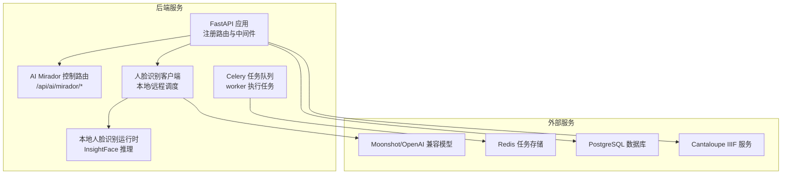
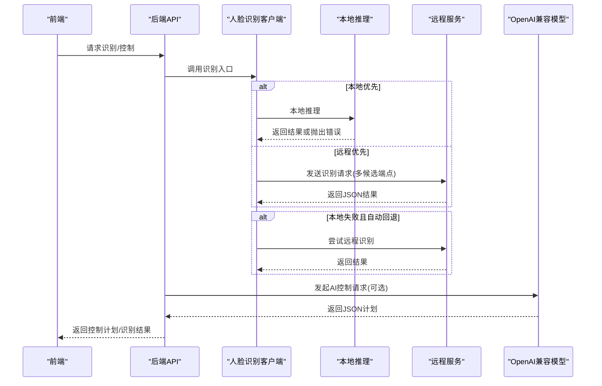
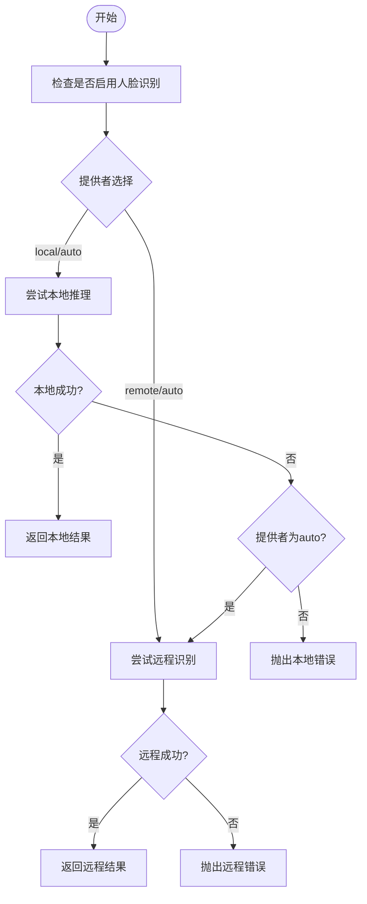
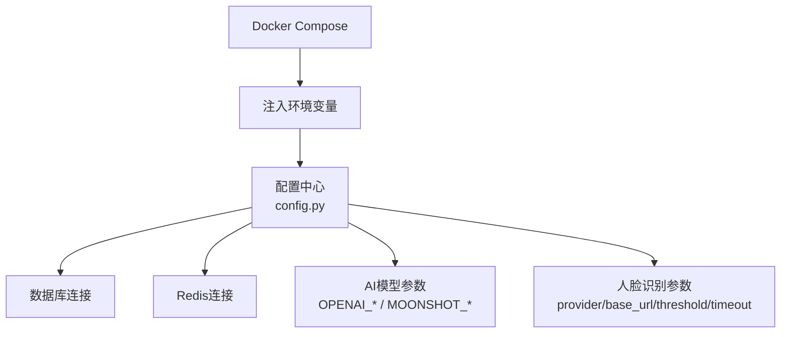
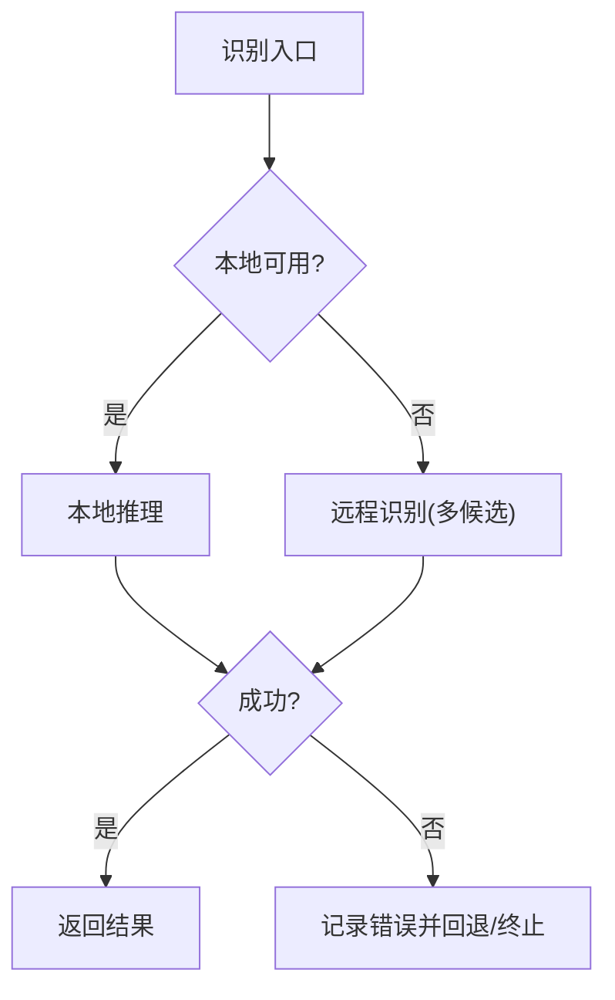
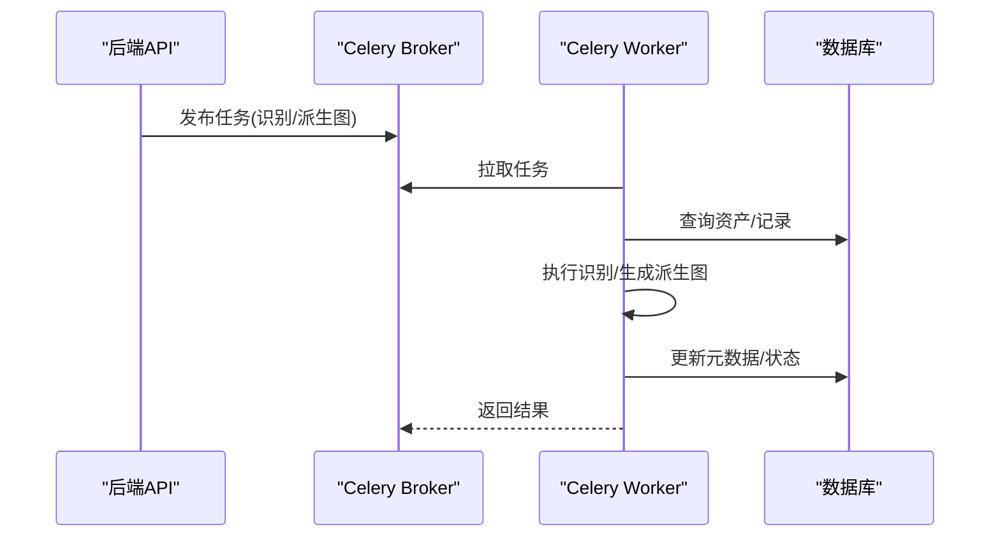
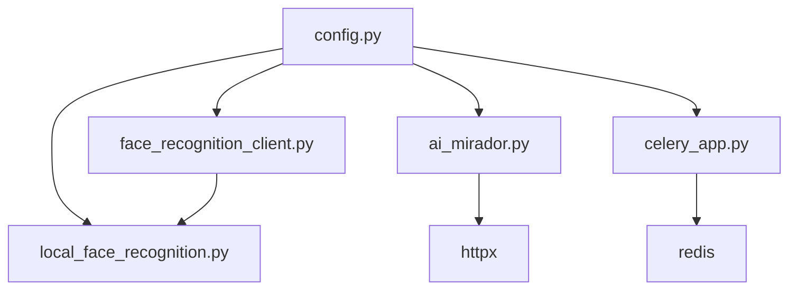

# 本地与远程服务集成

<cite>
**本文引用的文件**
- [backend/app/main.py](file://backend/app/main.py)
- [backend/app/config.py](file://backend/app/config.py)
- [backend/app/celery_app.py](file://backend/app/celery_app.py)
- [backend/app/services/face_recognition_client.py](file://backend/app/services/face_recognition_client.py)
- [backend/app/services/local_face_recognition.py](file://backend/app/services/local_face_recognition.py)
- [backend/app/services/face_recognition.py](file://backend/app/services/face_recognition.py)
- [backend/app/tasks.py](file://backend/app/tasks.py)
- [backend/app/routers/ai_mirador.py](file://backend/app/routers/ai_mirador.py)
- [backend/app/platform/registry.py](file://backend/app/platform/registry.py)
- [docker-compose.yml](file://docker-compose.yml)
- [docs/05-部署与运维/ENVIRONMENT_VARIABLES.md](file://docs/05-部署与运维/ENVIRONMENT_VARIABLES.md)
- [docs/05-部署与运维/TROUBLESHOOTING.md](file://docs/05-部署与运维/TROUBLESHOOTING.md)
</cite>

## 目录
1. [引言](#引言)
2. [项目结构](#项目结构)
3. [核心组件](#核心组件)
4. [架构总览](#架构总览)
5. [详细组件分析](#详细组件分析)
6. [依赖分析](#依赖分析)
7. [性能考量](#性能考量)
8. [故障排查指南](#故障排查指南)
9. [结论](#结论)
10. [附录](#附录)

## 引言
本文件面向MDAMS原型项目的本地与远程AI服务集成方案，围绕以下目标展开：服务发现与路由（本地优先、远程降级）、服务配置管理（环境变量、地址与超时）、容错与重试（异常处理、回退策略）、性能监控（响应时间、吞吐量、错误率、资源使用）、异步处理（Celery任务队列、消息传递、状态跟踪与恢复），并提供最佳实践与部署运维建议。

## 项目结构
后端采用FastAPI应用，统一注册各路由模块；AI相关能力集中在镜像记录与展示的业务流程中，包括：
- 本地人脸识别：基于InsightFace推理与索引检索
- 远程人脸识别：HTTP客户端封装，支持多候选端点
- AI Mirador控制：OpenAI兼容模型对话转工具调用，结合资产检索
- 异步任务：Celery队列执行IIIF派生图生成与人脸识别标注

图表来源
- [backend/app/main.py:64-86](file://backend/app/main.py#L64-L86)
- [backend/app/routers/ai_mirador.py:20-21](file://backend/app/routers/ai_mirador.py#L20-L21)
- [backend/app/services/face_recognition_client.py:91-134](file://backend/app/services/face_recognition_client.py#L91-L134)
- [backend/app/celery_app.py:5-15](file://backend/app/celery_app.py#L5-L15)

章节来源
- [backend/app/main.py:64-86](file://backend/app/main.py#L64-L86)
- [docker-compose.yml:1-131](file://docker-compose.yml#L1-L131)

## 核心组件
- 配置中心：集中读取环境变量，提供数据库、Redis、AI与人脸识别等参数
- 人脸识别客户端：根据配置选择本地或远程，自动回退，统一错误语义
- 本地人脸识别运行时：InsightFace推理、索引缓存、向量归一化与聚类中心计算
- AI Mirador控制：OpenAI兼容请求、JSON解析与工具调用映射、资产检索
- Celery任务：异步生成IIIF派生图、触发人脸识别标注、状态持久化

章节来源
- [backend/app/config.py:42-72](file://backend/app/config.py#L42-L72)
- [backend/app/services/face_recognition_client.py:91-134](file://backend/app/services/face_recognition_client.py#L91-L134)
- [backend/app/services/local_face_recognition.py:103-202](file://backend/app/services/local_face_recognition.py#L103-L202)
- [backend/app/routers/ai_mirador.py:478-552](file://backend/app/routers/ai_mirador.py#L478-L552)
- [backend/app/celery_app.py:5-15](file://backend/app/celery_app.py#L5-L15)

## 架构总览
本地与远程AI服务集成的关键路径如下：
- 人脸识别：客户端按配置选择本地或远程，本地失败时自动回退远程；远程支持多候选端点探测
- AI控制：后端向OpenAI兼容服务发起请求，解析JSON并映射为Mirador工具调用；若失败则退回启发式规划
- 异步处理：Celery worker消费任务，执行耗时操作并更新资产元数据

图表来源
- [backend/app/services/face_recognition_client.py:91-134](file://backend/app/services/face_recognition_client.py#L91-L134)
- [backend/app/services/local_face_recognition.py:282-345](file://backend/app/services/local_face_recognition.py#L282-L345)
- [backend/app/routers/ai_mirador.py:478-552](file://backend/app/routers/ai_mirador.py#L478-L552)

## 详细组件分析

### 服务发现与路由（本地优先、远程降级）
- 人脸识别客户端根据配置选择提供者：local、remote、auto
- auto模式下，优先尝试本地推理；本地失败时自动回退远程
- 远程识别支持多候选端点，依次尝试直至成功或全部失败
- 本地推理通过InsightFace运行时加载模型与索引，进行特征提取与聚类匹配

图表来源
- [backend/app/services/face_recognition_client.py:91-134](file://backend/app/services/face_recognition_client.py#L91-L134)
- [backend/app/services/local_face_recognition.py:282-345](file://backend/app/services/local_face_recognition.py#L282-L345)

章节来源
- [backend/app/services/face_recognition_client.py:16-88](file://backend/app/services/face_recognition_client.py#L16-L88)
- [backend/app/services/face_recognition_client.py:91-134](file://backend/app/services/face_recognition_client.py#L91-L134)
- [backend/app/services/local_face_recognition.py:282-345](file://backend/app/services/local_face_recognition.py#L282-L345)

### 服务配置管理
- 数据库与Redis：通过环境变量DATABASE_URL与REDIS_URL配置
- AI与人脸识别：OPENAI_*与MOONSHOT_*兼容变量、超时、阈值、模型与索引目录等
- 服务地址：API_PUBLIC_URL、CANTALOUPE_PUBLIC_URL用于生成公开链接
- Docker Compose：统一注入环境变量到backend与celery_worker

图表来源
- [backend/app/config.py:42-72](file://backend/app/config.py#L42-L72)
- [docker-compose.yml:8-30](file://docker-compose.yml#L8-L30)

章节来源
- [backend/app/config.py:42-72](file://backend/app/config.py#L42-L72)
- [docs/05-部署与运维/ENVIRONMENT_VARIABLES.md:10-86](file://docs/05-部署与运维/ENVIRONMENT_VARIABLES.md#L10-L86)
- [docker-compose.yml:8-30](file://docker-compose.yml#L8-L30)

### 容错处理与回退策略
- 人脸识别：本地推理异常时，auto模式自动回退远程；远程均失败则汇总错误信息
- AI控制：OpenAI兼容请求失败时退回启发式规划；搜索结果为空时提示或回退为普通搜索
- 任务执行：人脸识别任务捕获异常，写入失败状态并持久化元数据

图表来源
- [backend/app/services/face_recognition_client.py:91-134](file://backend/app/services/face_recognition_client.py#L91-L134)
- [backend/app/routers/ai_mirador.py:532-551](file://backend/app/routers/ai_mirador.py#L532-L551)
- [backend/app/tasks.py:236-261](file://backend/app/tasks.py#L236-L261)

章节来源
- [backend/app/services/face_recognition_client.py:91-134](file://backend/app/services/face_recognition_client.py#L91-L134)
- [backend/app/routers/ai_mirador.py:583-688](file://backend/app/routers/ai_mirador.py#L583-L688)
- [backend/app/tasks.py:236-261](file://backend/app/tasks.py#L236-L261)

### 性能监控方案
- 响应时间：AI控制请求使用超时参数限制；人脸识别远程请求设置超时
- 吞吐量：Celery并发与队列容量；后端FastAPI中间件与数据库连接池
- 错误率：人脸识别与AI控制的异常捕获与日志记录；任务失败状态写入
- 资源使用：libvips磁盘阈值与并发参数；Java堆参数；GPU/CPU执行提供者选择

章节来源
- [backend/app/routers/ai_mirador.py:525](file://backend/app/routers/ai_mirador.py#L525)
- [backend/app/services/face_recognition_client.py:66](file://backend/app/services/face_recognition_client.py#L66)
- [docker-compose.yml:11-13](file://docker-compose.yml#L11-L13)
- [docs/05-部署与运维/ENVIRONMENT_VARIABLES.md:61-63](file://docs/05-部署与运维/ENVIRONMENT_VARIABLES.md#L61-L63)

### 异步处理架构（Celery）
- 任务定义：人脸识别标注、IIIF派生图生成等
- 队列与存储：Redis作为broker与backend
- 执行：celery_worker消费任务，数据库事务与元数据更新
- 状态跟踪：任务绑定、异常捕获与失败状态落库

图表来源
- [backend/app/celery_app.py:5-15](file://backend/app/celery_app.py#L5-L15)
- [backend/app/tasks.py:189-261](file://backend/app/tasks.py#L189-L261)

章节来源
- [backend/app/celery_app.py:5-15](file://backend/app/celery_app.py#L5-L15)
- [backend/app/tasks.py:189-261](file://backend/app/tasks.py#L189-L261)

### 平台适配器注册（扩展性）
- 平台源适配器注册表用于扩展不同数据源的适配器，便于未来接入更多外部平台

章节来源
- [backend/app/platform/registry.py:8-24](file://backend/app/platform/registry.py#L8-L24)

## 依赖分析
- 配置依赖：所有AI与人脸识别参数由config.py集中提供
- 运行时依赖：人脸识别客户端依赖本地推理模块与HTTPX；AI控制依赖httpx与OpenAI兼容服务
- 任务依赖：Celery依赖Redis；任务执行依赖数据库会话与文件系统路径

图表来源
- [backend/app/config.py:42-72](file://backend/app/config.py#L42-L72)
- [backend/app/services/face_recognition_client.py:6](file://backend/app/services/face_recognition_client.py#L6)
- [backend/app/routers/ai_mirador.py:8](file://backend/app/routers/ai_mirador.py#L8)
- [backend/app/celery_app.py:3](file://backend/app/celery_app.py#L3)

章节来源
- [backend/app/config.py:42-72](file://backend/app/config.py#L42-L72)
- [backend/app/services/face_recognition_client.py:6](file://backend/app/services/face_recognition_client.py#L6)
- [backend/app/routers/ai_mirador.py:8](file://backend/app/routers/ai_mirador.py#L8)
- [backend/app/celery_app.py:3](file://backend/app/celery_app.py#L3)

## 性能考量
- 本地推理：InsightFace运行时按模型根目录、模型名与严格模式缓存；GPU优先(CUDAExecutionProvider)，否则CPU
- 远程识别：多候选端点轮询，超时可控；文件流式传输，避免内存峰值
- AI控制：OpenAI兼容请求带超时；JSON解析失败退回启发式
- 异步任务：Celery并发与结果过期；libvips参数优化内存与磁盘使用

章节来源
- [backend/app/services/local_face_recognition.py:103-129](file://backend/app/services/local_face_recognition.py#L103-L129)
- [backend/app/services/face_recognition_client.py:58-75](file://backend/app/services/face_recognition_client.py#L58-L75)
- [backend/app/routers/ai_mirador.py:525](file://backend/app/routers/ai_mirador.py#L525)
- [docker-compose.yml:11-13](file://docker-compose.yml#L11-L13)

## 故障排查指南
- 启动与健康：检查后端/数据库/Redis/Celery容器状态与日志
- 环境变量：核对DATABASE_URL、REDIS_URL、API_PUBLIC_URL、CANTALOUPE_PUBLIC_URL、AI与人脸识别相关变量
- 人脸识别：确认本地模型与索引目录、阈值与超时；远程端点可达
- IIIF与Mirador：确认CANTALOUPE_PUBLIC_URL与Nginx代理配置
- 权限与可见性：确保用户具备image.view权限与资源可见范围

章节来源
- [docs/05-部署与运维/TROUBLESHOOTING.md:16-84](file://docs/05-部署与运维/TROUBLESHOOTING.md#L16-L84)
- [docs/05-部署与运维/ENVIRONMENT_VARIABLES.md:10-86](file://docs/05-部署与运维/ENVIRONMENT_VARIABLES.md#L10-L86)

## 结论
本方案通过“本地优先、远程降级”的人脸识别策略与“OpenAI兼容+启发式回退”的AI控制路径，实现了稳定的服务集成；配合Celery异步任务与完善的配置管理，满足原型阶段的可维护性与可扩展性需求。建议在生产化过程中引入熔断器、重试与指数退避、指标采集与告警体系，并持续优化模型与索引规模。

## 附录
- 部署与运维：参考ENVIRONMENT_VARIABLES与TROUBLESHOOTING文档，结合docker-compose进行环境变量注入与服务编排

章节来源
- [docs/05-部署与运维/ENVIRONMENT_VARIABLES.md:10-86](file://docs/05-部署与运维/ENVIRONMENT_VARIABLES.md#L10-L86)
- [docs/05-部署与运维/TROUBLESHOOTING.md:16-84](file://docs/05-部署与运维/TROUBLESHOOTING.md#L16-L84)
- [docker-compose.yml:1-131](file://docker-compose.yml#L1-L131)