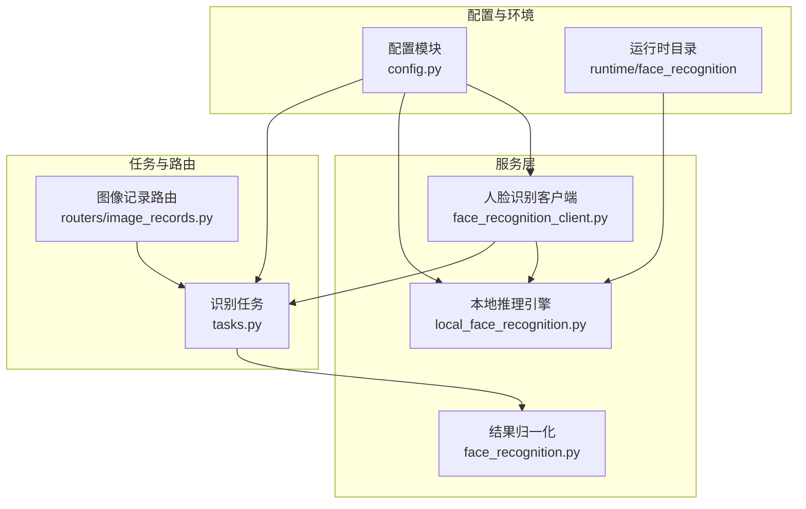
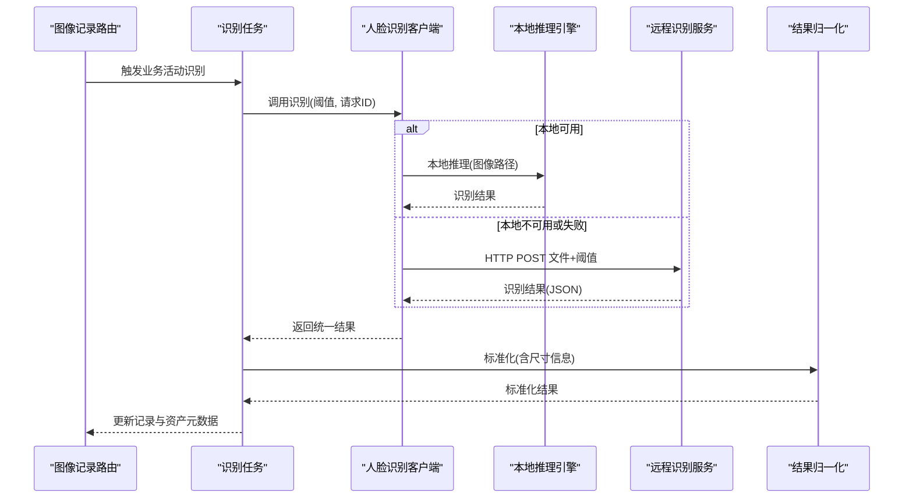
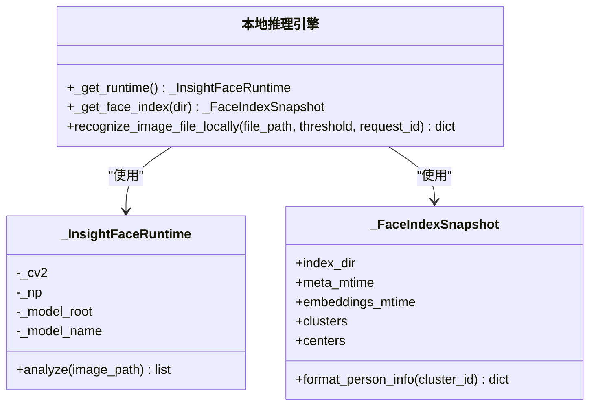
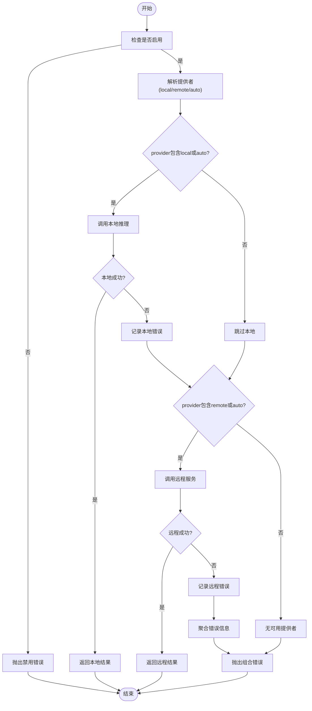
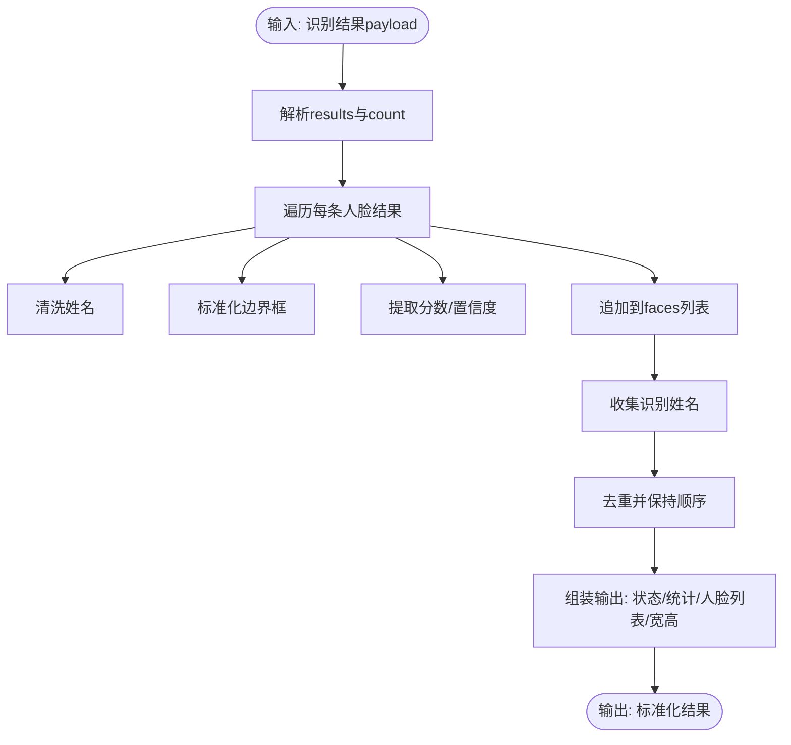
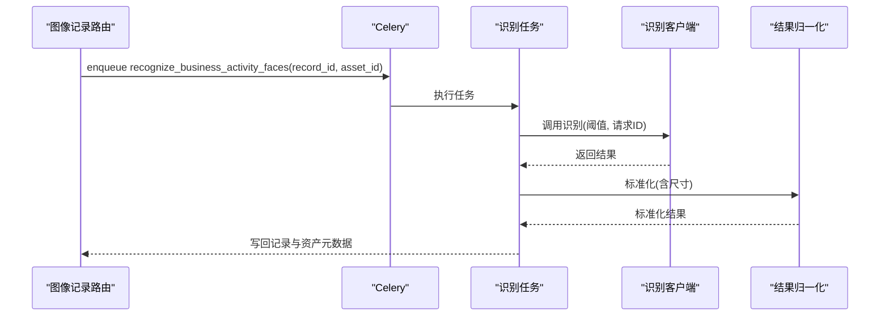
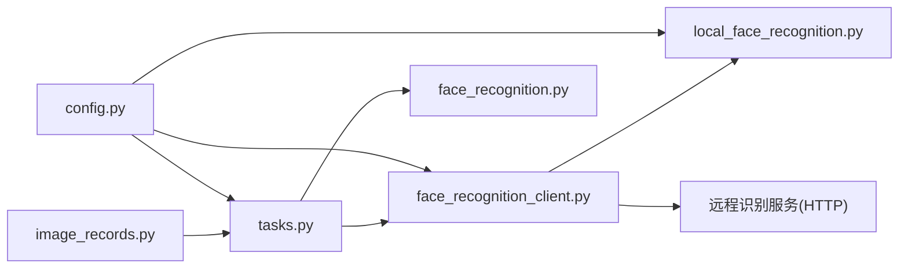

# 面部识别集成

<cite>
**本文引用的文件**
- [backend/app/services/local_face_recognition.py](file://backend/app/services/local_face_recognition.py)
- [backend/app/services/face_recognition_client.py](file://backend/app/services/face_recognition_client.py)
- [backend/app/services/face_recognition.py](file://backend/app/services/face_recognition.py)
- [backend/app/config.py](file://backend/app/config.py)
- [backend/app/tasks.py](file://backend/app/tasks.py)
- [backend/app/routers/image_records.py](file://backend/app/routers/image_records.py)
- [backend/runtime/face_recognition/README.md](file://backend/runtime/face_recognition/README.md)
- [backend/tests/test_face_recognition_client.py](file://backend/tests/test_face_recognition_client.py)
- [backend/tests/test_image_records-AuroraX.py](file://backend/tests/test_image_records-AuroraX.py)
</cite>

## 目录
1. [简介](#简介)
2. [项目结构](#项目结构)
3. [核心组件](#核心组件)
4. [架构总览](#架构总览)
5. [详细组件分析](#详细组件分析)
6. [依赖关系分析](#依赖关系分析)
7. [性能考量](#性能考量)
8. [故障排除指南](#故障排除指南)
9. [结论](#结论)
10. [附录](#附录)

## 简介
本文件面向MDAMS原型项目的面部识别功能，系统性阐述InsightFace框架的集成实现与运行机制，涵盖模型加载、人脸检测与特征提取、索引检索与相似度匹配、服务架构与内存优化、API与任务编排、以及在图像资产管理中的应用（人员识别、相似图像查找、元数据增强）。同时提供配置参数说明、使用示例与最佳实践、以及故障排除建议。

## 项目结构
面部识别相关代码主要分布在后端服务层与任务层，采用“客户端封装 + 本地推理 + 远程回退”的模式，配合Celery异步任务完成业务资产的自动识别与元数据增强。

图表来源
- [backend/app/config.py:60-71](file://backend/app/config.py#L60-L71)
- [backend/app/services/face_recognition_client.py:91-133](file://backend/app/services/face_recognition_client.py#L91-L133)
- [backend/app/services/local_face_recognition.py:103-202](file://backend/app/services/local_face_recognition.py#L103-L202)
- [backend/app/services/face_recognition.py:86-140](file://backend/app/services/face_recognition.py#L86-L140)
- [backend/app/tasks.py:189-262](file://backend/app/tasks.py#L189-L262)
- [backend/app/routers/image_records.py:969-972](file://backend/app/routers/image_records.py#L969-L972)

章节来源
- [backend/app/config.py:60-71](file://backend/app/config.py#L60-L71)
- [backend/runtime/face_recognition/README.md:1-44](file://backend/runtime/face_recognition/README.md#L1-L44)

## 核心组件
- 配置模块：集中管理面部识别开关、提供者选择、阈值、模型根目录、索引目录、严格模型校验等关键参数。
- 客户端封装：统一入口，支持本地推理与远程服务两种提供者；在“auto”模式下具备失败回退逻辑。
- 本地推理引擎：基于InsightFace ONNXRuntime，负责模型加载、人脸检测与特征向量提取、索引缓存与相似度匹配。
- 结果归一化：将不同来源的识别结果标准化为统一结构，便于上层业务消费。
- 任务与路由：通过Celery任务触发识别，结合图像记录路由在资产绑定完成后异步更新元数据。

章节来源
- [backend/app/services/face_recognition_client.py:91-133](file://backend/app/services/face_recognition_client.py#L91-L133)
- [backend/app/services/local_face_recognition.py:103-345](file://backend/app/services/local_face_recognition.py#L103-L345)
- [backend/app/services/face_recognition.py:86-140](file://backend/app/services/face_recognition.py#L86-L140)
- [backend/app/tasks.py:189-262](file://backend/app/tasks.py#L189-L262)
- [backend/app/routers/image_records.py:969-972](file://backend/app/routers/image_records.py#L969-L972)

## 架构总览
整体采用“本地优先、远程回退”的双栈架构。当本地推理可用时优先执行；若启用“auto”，则在本地失败时自动尝试远程服务。识别结果经归一化后写入图像记录与资产的raw_metadata中，并驱动业务字段（如主要人物）的更新。

图表来源
- [backend/app/routers/image_records.py:969-972](file://backend/app/routers/image_records.py#L969-L972)
- [backend/app/tasks.py:189-262](file://backend/app/tasks.py#L189-L262)
- [backend/app/services/face_recognition_client.py:91-133](file://backend/app/services/face_recognition_client.py#L91-L133)
- [backend/app/services/local_face_recognition.py:282-345](file://backend/app/services/local_face_recognition.py#L282-L345)

## 详细组件分析

### InsightFace集成与本地推理引擎
- 模型加载与运行时初始化
  - 使用ONNXRuntime与InsightFace的FaceAnalysis进行初始化，自动选择CUDA或CPU执行提供者。
  - 支持严格模型校验：仅在模型目录存在所需ONNX文件时才允许推理。
- 人脸检测与特征提取
  - 读取图像后调用分析器返回每张人脸的边界框、关键点与特征向量。
  - 对特征向量进行单位化以适配余弦相似度匹配。
- 索引与相似度匹配
  - 从索引目录加载meta.json与embeddings.pkl，构建聚类中心向量。
  - 对每张人脸特征向量与聚类中心做点积，得到相似度分数，超过阈值即判定为已识别。
- 缓存与并发安全
  - 全局运行时缓存与索引快照缓存，带时间戳校验，避免重复加载。
  - 使用线程锁保护全局缓存，确保多线程安全。

图表来源
- [backend/app/services/local_face_recognition.py:103-202](file://backend/app/services/local_face_recognition.py#L103-L202)
- [backend/app/services/local_face_recognition.py:205-279](file://backend/app/services/local_face_recognition.py#L205-L279)
- [backend/app/services/local_face_recognition.py:282-345](file://backend/app/services/local_face_recognition.py#L282-L345)

章节来源
- [backend/app/services/local_face_recognition.py:79-101](file://backend/app/services/local_face_recognition.py#L79-L101)
- [backend/app/services/local_face_recognition.py:103-129](file://backend/app/services/local_face_recognition.py#L103-L129)
- [backend/app/services/local_face_recognition.py:205-279](file://backend/app/services/local_face_recognition.py#L205-L279)
- [backend/app/services/local_face_recognition.py:282-345](file://backend/app/services/local_face_recognition.py#L282-L345)

### 人脸识别客户端与提供者切换
- 提供者策略
  - local：直接调用本地推理引擎。
  - remote：向远程识别服务发起HTTP POST请求，支持多种候选URL路径。
  - auto：优先本地，失败则回退远程。
- 错误处理
  - 将本地错误与远程错误分别捕获并汇总，最终抛出统一异常。
  - 当提供者不可用时给出明确提示。

图表来源
- [backend/app/services/face_recognition_client.py:91-133](file://backend/app/services/face_recognition_client.py#L91-L133)
- [backend/app/services/face_recognition_client.py:35-88](file://backend/app/services/face_recognition_client.py#L35-L88)

章节来源
- [backend/app/services/face_recognition_client.py:91-133](file://backend/app/services/face_recognition_client.py#L91-L133)
- [backend/tests/test_face_recognition_client.py:16-84](file://backend/tests/test_face_recognition_client.py#L16-L84)

### 结果归一化与元数据增强
- 归一化流程
  - 解析识别结果列表，清洗名称、边界框、置信度与分数。
  - 统计识别人数与去重后的姓名列表，补充图像宽高信息。
- 元数据增强
  - 任务将标准化结果写入记录与资产的raw_metadata，并根据识别到的姓名更新业务字段（如主要人物）。

图表来源
- [backend/app/services/face_recognition.py:86-140](file://backend/app/services/face_recognition.py#L86-L140)
- [backend/app/tasks.py:80-149](file://backend/app/tasks.py#L80-L149)

章节来源
- [backend/app/services/face_recognition.py:86-140](file://backend/app/services/face_recognition.py#L86-L140)
- [backend/app/tasks.py:80-149](file://backend/app/tasks.py#L80-L149)

### 任务与路由集成
- 业务触发
  - 在业务活动类型的图像记录确认绑定资产后，路由会异步排队识别任务。
- 任务执行
  - 任务读取源文件路径，调用识别客户端，标准化结果并写回记录与资产元数据。
- 测试验证
  - 测试覆盖了任务队列触发、识别结果注入、以及主要人物字段的更新。

图表来源
- [backend/app/routers/image_records.py:969-972](file://backend/app/routers/image_records.py#L969-L972)
- [backend/app/tasks.py:189-262](file://backend/app/tasks.py#L189-L262)
- [backend/tests/test_image_records-AuroraX.py:967-1055](file://backend/tests/test_image_records-AuroraX.py#L967-L1055)

章节来源
- [backend/app/routers/image_records.py:969-972](file://backend/app/routers/image_records.py#L969-L972)
- [backend/app/tasks.py:189-262](file://backend/app/tasks.py#L189-L262)
- [backend/tests/test_image_records-AuroraX.py:967-1055](file://backend/tests/test_image_records-AuroraX.py#L967-L1055)

## 依赖关系分析
- 外部依赖
  - InsightFace、ONNXRuntime、NumPy、OpenCV用于本地推理。
  - httpx用于远程识别服务通信。
- 内部依赖
  - 客户端依赖本地推理引擎与远程服务端点。
  - 任务依赖客户端与归一化模块，写回数据库与元数据层。
  - 路由依赖任务模块，触发识别并更新资产与记录元数据。

图表来源
- [backend/app/services/face_recognition_client.py:91-133](file://backend/app/services/face_recognition_client.py#L91-L133)
- [backend/app/services/local_face_recognition.py:282-345](file://backend/app/services/local_face_recognition.py#L282-L345)
- [backend/app/services/face_recognition.py:86-140](file://backend/app/services/face_recognition.py#L86-L140)
- [backend/app/tasks.py:189-262](file://backend/app/tasks.py#L189-L262)
- [backend/app/routers/image_records.py:969-972](file://backend/app/routers/image_records.py#L969-L972)
- [backend/app/config.py:60-71](file://backend/app/config.py#L60-L71)

章节来源
- [backend/app/services/face_recognition_client.py:91-133](file://backend/app/services/face_recognition_client.py#L91-L133)
- [backend/app/services/local_face_recognition.py:282-345](file://backend/app/services/local_face_recognition.py#L282-L345)
- [backend/app/services/face_recognition.py:86-140](file://backend/app/services/face_recognition.py#L86-L140)
- [backend/app/tasks.py:189-262](file://backend/app/tasks.py#L189-L262)
- [backend/app/routers/image_records.py:969-972](file://backend/app/routers/image_records.py#L969-L972)
- [backend/app/config.py:60-71](file://backend/app/config.py#L60-L71)

## 性能考量
- 模型与运行时
  - 启用CUDA执行提供者可显著提升推理速度；若无GPU则自动回退CPU。
  - 严格模型校验避免因缺失模型导致的反复失败与资源浪费。
- 缓存策略
  - 运行时与索引快照缓存减少重复初始化与文件读取开销；缓存键包含模型根目录、模型名与严格模式，确保变更后及时失效。
- 相似度计算
  - 特征向量单位化后使用点积作为相似度，计算简单高效；阈值可调以平衡召回与精度。
- 并发与线程安全
  - 使用线程锁保护全局缓存，避免竞态条件；建议在高并发场景下合理设置阈值与批处理策略。
- I/O与内存
  - 索引文件采用pickle序列化，注意内存占用与加载耗时；建议定期校验文件完整性与更新时间戳。

章节来源
- [backend/app/services/local_face_recognition.py:103-129](file://backend/app/services/local_face_recognition.py#L103-L129)
- [backend/app/services/local_face_recognition.py:173-202](file://backend/app/services/local_face_recognition.py#L173-L202)
- [backend/app/services/local_face_recognition.py:205-279](file://backend/app/services/local_face_recognition.py#L205-L279)
- [backend/app/services/local_face_recognition.py:316-336](file://backend/app/services/local_face_recognition.py#L316-L336)

## 故障排除指南
- 常见错误与定位
  - 本地推理依赖缺失：缺少NumPy、OpenCV、ONNXRuntime或InsightFace时会抛出本地错误。
  - 模型文件缺失：严格模式下若模型目录或ONNX文件不全，会提示缺失项。
  - 远程服务未配置：未设置远程基础URL时会提示未配置。
  - 识别源文件不存在：传入的图像路径无效或无法读取。
  - 提供者不可用：所有提供者均不可用时抛出组合错误。
- 排查步骤
  - 检查配置项：确保启用开关、提供者、阈值、模型根目录、索引目录、严格模式正确。
  - 校验模型与索引：确认模型目录包含所需ONNX文件，索引目录包含meta.json与embeddings.pkl。
  - 验证网络连通性：远程模式下确认服务可达与超时设置合理。
  - 查看任务日志：识别任务会打印跳过原因与错误信息，便于快速定位。
- 测试参考
  - 单元测试覆盖本地提供者分发、自动回退与错误传播行为，可作为回归测试依据。

章节来源
- [backend/app/services/face_recognition_client.py:12-13](file://backend/app/services/face_recognition_client.py#L12-L13)
- [backend/app/services/local_face_recognition.py:14-15](file://backend/app/services/local_face_recognition.py#L14-L15)
- [backend/app/services/local_face_recognition.py:79-101](file://backend/app/services/local_face_recognition.py#L79-L101)
- [backend/app/services/face_recognition_client.py:41-43](file://backend/app/services/face_recognition_client.py#L41-L43)
- [backend/app/services/face_recognition_client.py:100-101](file://backend/app/services/face_recognition_client.py#L100-L101)
- [backend/tests/test_face_recognition_client.py:67-84](file://backend/tests/test_face_recognition_client.py#L67-L84)

## 结论
MDAMS的面部识别集成以InsightFace为核心，结合本地推理与远程回退策略，实现了稳定高效的人员识别与元数据增强能力。通过严格的模型校验、缓存与并发控制、以及清晰的任务与路由编排，系统在保证性能的同时具备良好的可维护性与扩展性。建议在生产环境中合理设置阈值与提供者策略，并持续监控模型与索引文件的健康状态。

## 附录

### 配置参数说明
- 开关与提供者
  - FACE_RECOGNITION_ENABLED：启用/禁用面部识别功能。
  - FACE_RECOGNITION_PROVIDER：local、remote或auto。
- 远程服务
  - FACE_RECOGNITION_BASE_URL：远程识别服务基础URL。
  - FACE_RECOGNITION_TIMEOUT_SECONDS：远程请求超时秒数。
- 本地推理
  - FACE_RECOGNITION_THRESHOLD：相似度阈值。
  - FACE_RECOGNITION_MODEL_ROOT：模型根目录。
  - FACE_RECOGNITION_MODEL_NAME：模型名称（默认buffalo_l）。
  - FACE_RECOGNITION_INDEX_DIR：索引目录。
  - FACE_RECOGNITION_STRICT_LOCAL_MODELS：严格模型校验开关。

章节来源
- [backend/app/config.py:60-71](file://backend/app/config.py#L60-L71)
- [backend/runtime/face_recognition/README.md:29-36](file://backend/runtime/face_recognition/README.md#L29-L36)

### API与数据结构
- 识别请求
  - 本地：直接传入图像文件路径与可选阈值、请求ID。
  - 远程：POST文件与阈值参数至候选端点之一。
- 识别响应
  - 统一字段：状态、模式、文件名、请求ID、数量、结果列表。
  - 结果列表字段：人脸索引、边界框、关键点、识别标记、人员信息、分数、置信度。
  - 归一化后记录/资产元数据：包含识别统计、识别姓名列表、人脸明细等。

章节来源
- [backend/app/services/local_face_recognition.py:282-345](file://backend/app/services/local_face_recognition.py#L282-L345)
- [backend/app/services/face_recognition_client.py:35-88](file://backend/app/services/face_recognition_client.py#L35-L88)
- [backend/app/services/face_recognition.py:86-140](file://backend/app/services/face_recognition.py#L86-L140)

### 应用场景与最佳实践
- 场景
  - 业务活动照片：自动识别主要人物，增强记录与资产元数据。
  - 相似图像查找：基于特征向量与聚类中心进行近似检索（需额外实现）。
  - 元数据增强：自动填充主要人物、识别数量、识别姓名等。
- 最佳实践
  - 合理设置阈值：在召回与误检之间权衡，建议先小后大逐步调整。
  - 模型与索引维护：定期校验模型完整性与索引一致性，避免缓存陈旧。
  - 并发与限流：在高并发场景下限制同时识别任务数量，避免资源争用。
  - 日志与监控：记录任务执行状态与错误详情，便于问题追踪与性能优化。

章节来源
- [backend/app/tasks.py:189-262](file://backend/app/tasks.py#L189-L262)
- [backend/tests/test_image_records-AuroraX.py:967-1055](file://backend/tests/test_image_records-AuroraX.py#L967-L1055)