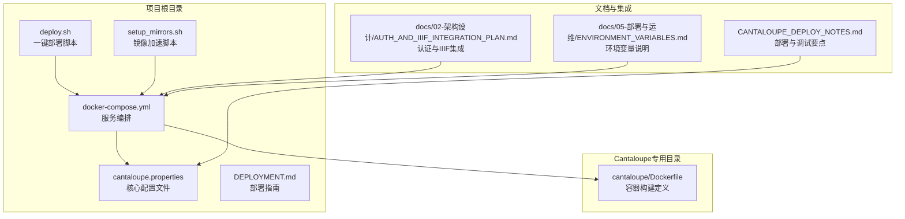
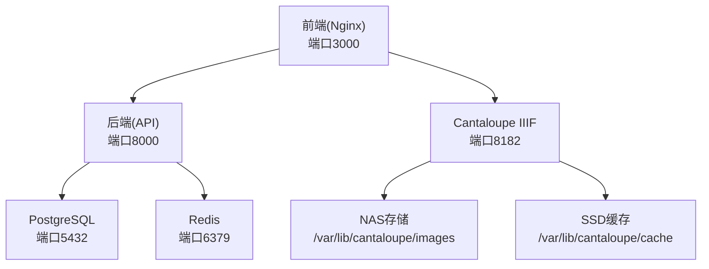
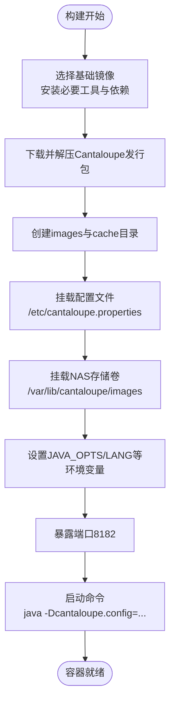
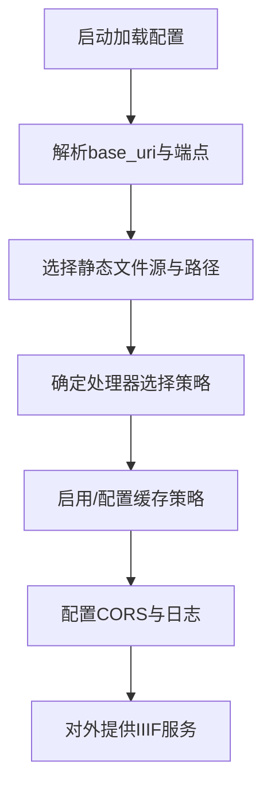
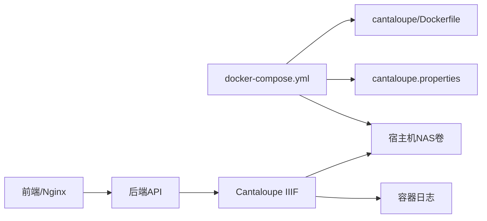

# Cantaloupe服务器配置

<cite>
**本文引用的文件**
- [cantaloupe.properties](file://cantaloupe.properties)
- [cantaloupe/Dockerfile](file://cantaloupe/Dockerfile)
- [CANTALOUPE_DEPLOY_NOTES.md](file://CANTALOUPE_DEPLOY_NOTES.md)
- [DEPLOYMENT.md](file://DEPLOYMENT.md)
- [docker-compose.yml](file://docker-compose.yml)
- [docs/05-部署与运维/ENVIRONMENT_VARIABLES.md](file://docs/05-部署与运维/ENVIRONMENT_VARIABLES.md)
- [docs/02-架构设计/AUTH_AND_IIIF_INTEGRATION_PLAN.md](file://docs/02-架构设计/AUTH_AND_IIIF_INTEGRATION_PLAN.md)
- [deploy.sh](file://deploy.sh)
- [setup_mirrors.sh](file://setup_mirrors.sh)
</cite>

## 目录
1. [简介](#简介)
2. [项目结构](#项目结构)
3. [核心组件](#核心组件)
4. [架构总览](#架构总览)
5. [详细组件分析](#详细组件分析)
6. [依赖分析](#依赖分析)
7. [性能考虑](#性能考虑)
8. [故障排查指南](#故障排查指南)
9. [结论](#结论)
10. [附录](#附录)

## 简介
本文件面向MDAMS原型项目的Cantaloupe IIIF图像服务器配置，系统性阐述安装与部署、Docker容器化、环境变量、端口映射、核心配置文件参数、文件存储后端、图像处理器选择与优化、缓存策略、监控与日志、以及生产环境最佳实践与性能调优建议。文档严格基于仓库中的实际配置文件与部署脚本进行分析与说明，帮助读者快速、安全地完成Cantaloupe在生产环境中的落地。

## 项目结构
围绕Cantaloupe的配置与部署，项目中涉及的关键文件与位置如下：
- 顶层配置与部署脚本：cantaloupe.properties、docker-compose.yml、DEPLOYMENT.md、deploy.sh、setup_mirrors.sh
- 专用构建目录：cantaloupe/Dockerfile
- 环境变量与集成说明：docs/05-部署与运维/ENVIRONMENT_VARIABLES.md、docs/02-架构设计/AUTH_AND_IIIF_INTEGRATION_PLAN.md
- 部署注意事项：CANTALOUPE_DEPLOY_NOTES.md

**图表来源**
- [docker-compose.yml:105-128](file://docker-compose.yml#L105-L128)
- [cantaloupe/Dockerfile:1-43](file://cantaloupe/Dockerfile#L1-L43)
- [cantaloupe.properties:1-162](file://cantaloupe.properties#L1-L162)
- [docs/05-部署与运维/ENVIRONMENT_VARIABLES.md:1-86](file://docs/05-部署与运维/ENVIRONMENT_VARIABLES.md#L1-L86)
- [docs/02-架构设计/AUTH_AND_IIIF_INTEGRATION_PLAN.md:1-142](file://docs/02-架构设计/AUTH_AND_IIIF_INTEGRATION_PLAN.md#L1-L142)
- [CANTALOUPE_DEPLOY_NOTES.md:1-108](file://CANTALOUPE_DEPLOY_NOTES.md#L1-L108)
- [DEPLOYMENT.md:1-90](file://DEPLOYMENT.md#L1-L90)
- [deploy.sh:1-38](file://deploy.sh#L1-L38)
- [setup_mirrors.sh:1-59](file://setup_mirrors.sh#L1-L59)

**章节来源**
- [docker-compose.yml:105-128](file://docker-compose.yml#L105-L128)
- [cantaloupe/Dockerfile:1-43](file://cantaloupe/Dockerfile#L1-L43)
- [cantaloupe.properties:1-162](file://cantaloupe.properties#L1-L162)
- [docs/05-部署与运维/ENVIRONMENT_VARIABLES.md:1-86](file://docs/05-部署与运维/ENVIRONMENT_VARIABLES.md#L1-L86)
- [docs/02-架构设计/AUTH_AND_IIIF_INTEGRATION_PLAN.md:1-142](file://docs/02-架构设计/AUTH_AND_IIIF_INTEGRATION_PLAN.md#L1-L142)
- [CANTALOUPE_DEPLOY_NOTES.md:1-108](file://CANTALOUPE_DEPLOY_NOTES.md#L1-L108)
- [DEPLOYMENT.md:1-90](file://DEPLOYMENT.md#L1-L90)
- [deploy.sh:1-38](file://deploy.sh#L1-L38)
- [setup_mirrors.sh:1-59](file://setup_mirrors.sh#L1-L59)

## 核心组件
- Docker容器化与镜像构建：通过cantaloupe/Dockerfile完成基础系统、字体库、GraphicsMagick、FFmpeg等依赖安装，并在容器内创建默认目录，暴露端口并以参数形式挂载配置文件。
- 服务编排与环境变量：docker-compose.yml定义cantaloupe服务，映射NAS存储卷、挂载配置文件、注入环境变量（如JAVA_OPTS、LANG、CANTALOUPE_CONFIG），并提供/dev/urandom以解决熵池问题。
- 核心配置文件：cantaloupe.properties集中管理URL编码、base_uri、静态文件源、处理器选择策略、缓存策略、CORS、日志级别与输出目标等。
- 部署与运维：DEPLOYMENT.md给出基础设施与访问路径、性能优化建议；CANTALOUPE_DEPLOY_NOTES.md聚焦启动卡死、反向代理路径重写、base_uri与ID解析、构建缓存陷阱等关键问题；ENVIRONMENT_VARIABLES.md明确各环境变量用途与默认值；AUTH_AND_IIIF_INTEGRATION_PLAN.md说明认证与IIIF访问控制现状与下一步方向。

**章节来源**
- [cantaloupe/Dockerfile:1-43](file://cantaloupe/Dockerfile#L1-L43)
- [docker-compose.yml:105-128](file://docker-compose.yml#L105-L128)
- [cantaloupe.properties:1-162](file://cantaloupe.properties#L1-L162)
- [DEPLOYMENT.md:1-90](file://DEPLOYMENT.md#L1-L90)
- [CANTALOUPE_DEPLOY_NOTES.md:1-108](file://CANTALOUPE_DEPLOY_NOTES.md#L1-L108)
- [docs/05-部署与运维/ENVIRONMENT_VARIABLES.md:1-86](file://docs/05-部署与运维/ENVIRONMENT_VARIABLES.md#L1-L86)
- [docs/02-架构设计/AUTH_AND_IIIF_INTEGRATION_PLAN.md:1-142](file://docs/02-架构设计/AUTH_AND_IIIF_INTEGRATION_PLAN.md#L1-L142)

## 架构总览
下图展示Cantaloupe在MDAMS原型中的部署架构：前端通过Nginx代理访问后端API，后端生成IIIF清单；前端再通过Nginx代理访问Cantaloupe IIIF服务，Cantaloupe从NAS挂载的原始图像目录读取并生成派生图像，缓存至本地SSD，最终返回给前端查看器（如Mirador）。

**图表来源**
- [docker-compose.yml:1-131](file://docker-compose.yml#L1-L131)
- [DEPLOYMENT.md:12-16](file://DEPLOYMENT.md#L12-L16)
- [docs/02-架构设计/AUTH_AND_IIIF_INTEGRATION_PLAN.md:61-72](file://docs/02-架构设计/AUTH_AND_IIIF_INTEGRATION_PLAN.md#L61-L72)

**章节来源**
- [docker-compose.yml:1-131](file://docker-compose.yml#L1-L131)
- [DEPLOYMENT.md:12-16](file://DEPLOYMENT.md#L12-L16)
- [docs/02-架构设计/AUTH_AND_IIIF_INTEGRATION_PLAN.md:61-72](file://docs/02-架构设计/AUTH_AND_IIIF_INTEGRATION_PLAN.md#L61-L72)

## 详细组件分析

### Docker容器化与部署
- 基础镜像与依赖：基于JRE镜像，替换apt源为国内镜像，安装unzip、curl、字体库、GraphicsMagick、FFmpeg等，下载并解压Cantaloupe发行包，创建images与cache目录。
- 端口与启动：暴露8182端口，通过JVM参数挂载配置文件路径启动。
- 卷与环境：容器内挂载NAS路径作为图像源，挂载cantaloupe.properties为运行时配置；注入JAVA_OPTS、LANG、LC_ALL等环境变量；挂载/dev/urandom以解决熵池问题。

**图表来源**
- [cantaloupe/Dockerfile:1-43](file://cantaloupe/Dockerfile#L1-L43)

**章节来源**
- [cantaloupe/Dockerfile:1-43](file://cantaloupe/Dockerfile#L1-L43)
- [docker-compose.yml:105-128](file://docker-compose.yml#L105-L128)

### 环境变量与端口映射
- 端口映射：CANTALOUPE_PORT默认8182，通过docker-compose.yml映射到宿主机端口；其他服务端口亦在该文件中定义。
- 关键环境变量：
  - CANTALOUPE_CONFIG：指向容器内配置文件路径
  - JAVA_OPTS：JVM参数，包含堆大小与熵池修正
  - LANG/ LC_ALL：确保UTF-8支持
  - HOST_MUSEUM_PATH：宿主机NAS挂载点，映射到容器内图像目录
- 服务访问：DEPLOYMENT.md列出各服务端口与访问URL，便于定位与验证。

**章节来源**
- [docker-compose.yml:114-127](file://docker-compose.yml#L114-L127)
- [docs/05-部署与运维/ENVIRONMENT_VARIABLES.md:65-74](file://docs/05-部署与运维/ENVIRONMENT_VARIABLES.md#L65-L74)
- [DEPLOYMENT.md:48-54](file://DEPLOYMENT.md#L48-L54)

### 核心配置文件：cantaloupe.properties
- URL编码与基础URI：设置URL编码为UTF-8，base_uri为根域名（含端口），避免与反向代理路径叠加导致重复。
- 静态文件源：启用FilesystemSource，映射图像目录路径，确保路径前缀正确处理。
- 查找策略：BasicLookupStrategy优先，extension留空以依赖精确文件名匹配。
- 处理器选择：采用AutomaticSelectionStrategy，按MIME类型偏好选择处理器；为JPEG优先GraphicsMagick，fallback为Java2d；禁用流式检索兼容性问题。
- 缓存策略：启用文件系统缓存（FilesystemCache），设置目录深度与名称长度；内存缓存可选开启。
- IIIF端点：启用IIIF 2.0端点，设置最小尺寸；CORS允许跨域访问，允许凭证与常用头部。
- 日志：HTTP服务启用，监听0.0.0.0:8182；应用日志与错误日志分别配置控制台输出级别与开关。

**图表来源**
- [cantaloupe.properties:10-162](file://cantaloupe.properties#L10-L162)

**章节来源**
- [cantaloupe.properties:1-162](file://cantaloupe.properties#L1-L162)

### 文件存储后端配置
- 本地文件系统：通过docker-compose.yml将宿主机NAS路径映射到容器内的/var/lib/cantaloupe/images，供FilesystemSource读取。
- 云存储/网络存储：建议在宿主机侧先完成NFS或其他网络存储挂载，再以卷的形式映射到容器，确保权限与稳定性。
- 路径一致性：确保base_uri与反向代理路径不重复叠加，避免生成错误的@id。

**章节来源**
- [docker-compose.yml:114-117](file://docker-compose.yml#L114-L117)
- [CANTALOUPE_DEPLOY_NOTES.md:30-76](file://CANTALOUPE_DEPLOY_NOTES.md#L30-L76)

### 图像处理器配置与优化
- 处理器选择策略：使用AutomaticSelectionStrategy，按MIME类型映射处理器，优先GraphicsMagick处理JPEG，fallback为Java2d。
- 兼容性与流式检索：为避免GraphicsMagick兼容问题，禁用流式检索策略；如需启用需确保处理器与配置兼容。
- 其他处理器：可按需扩展OpenJPEG、libvips等，结合后端libvips的磁盘阈值与并发参数进行整体优化。

**章节来源**
- [cantaloupe.properties:42-62](file://cantaloupe.properties#L42-L62)
- [DEPLOYMENT.md:60-65](file://DEPLOYMENT.md#L60-L65)

### 缓存策略配置
- 文件系统缓存：启用FilesystemCache，设置缓存目录、目录深度与名称长度；设置TTL以控制缓存生命周期。
- 内存缓存：可按需开启以提升高频访问性能，但在资源受限环境下建议关闭以节省内存。
- 生产建议：结合SSD缓存与合理的TTL，平衡I/O与命中率。

**章节来源**
- [cantaloupe.properties:103-132](file://cantaloupe.properties#L103-L132)
- [DEPLOYMENT.md:63-66](file://DEPLOYMENT.md#L63-L66)

### 监控与日志配置
- 日志级别：应用日志与错误日志分别设置DEBUG/WARN级别，便于开发与生产场景切换。
- 输出目标：建议仅启用控制台输出，避免容器环境文件I/O锁导致的阻塞。
- 访问与错误：通过容器日志与Nginx访问日志结合分析，定位502、路径重写等问题。

**章节来源**
- [cantaloupe.properties:149-162](file://cantaloupe.properties#L149-L162)
- [CANTALOUPE_DEPLOY_NOTES.md:13-27](file://CANTALOUPE_DEPLOY_NOTES.md#L13-L27)

### 认证与IIIF访问控制
- 当前状态：Manifest入口已受控，资产详情与列表入口已受控；但IIIF切片与info.json访问尚未完全统一到应用认证入口。
- 建议：逐步将Manifest中的图像服务id切换为后端受控代理路径，使切片与info.json也统一经过应用权限入口。

**章节来源**
- [docs/02-架构设计/AUTH_AND_IIIF_INTEGRATION_PLAN.md:42-96](file://docs/02-架构设计/AUTH_AND_IIIF_INTEGRATION_PLAN.md#L42-L96)

## 依赖分析
- 组件耦合：Cantaloupe依赖宿主机NAS存储卷与容器内配置文件；与后端服务通过Nginx代理协同工作；与前端通过统一代理访问。
- 外部依赖：Docker、Nginx、PostgreSQL、Redis；容器内依赖GraphicsMagick、FFmpeg等图像处理工具。
- 环境变量契约：后端通过环境变量提供公共URL，前端通过Nginx代理转发至Cantaloupe；Cantaloupe通过base_uri与Host头生成正确的@id。

**图表来源**
- [docker-compose.yml:105-128](file://docker-compose.yml#L105-L128)
- [cantaloupe/Dockerfile:1-43](file://cantaloupe/Dockerfile#L1-L43)
- [cantaloupe.properties:1-162](file://cantaloupe.properties#L1-L162)

**章节来源**
- [docker-compose.yml:105-128](file://docker-compose.yml#L105-L128)
- [cantaloupe/Dockerfile:1-43](file://cantaloupe/Dockerfile#L1-L43)
- [cantaloupe.properties:1-162](file://cantaloupe.properties#L1-L162)

## 性能考虑
- 内存控制：Cantaloupe使用JAVA_OPTS限制堆大小；禁用内存缓存，依赖SSD文件缓存，降低OOM风险。
- I/O优化：热数据（数据库、缩略图缓存）使用本地NVMe SSD；冷数据（PSB/TIFF大图）存放于NAS。
- 处理器与并发：后端libvips设置磁盘阈值与并发数，避免大图处理内存峰值；Cantaloupe处理器选择兼顾速度与兼容性。
- 端口与代理：通过Nginx统一代理，减少直接端口暴露带来的CORS与路径重写问题。

**章节来源**
- [DEPLOYMENT.md:55-72](file://DEPLOYMENT.md#L55-L72)
- [docs/05-部署与运维/ENVIRONMENT_VARIABLES.md:57-64](file://docs/05-部署与运维/ENVIRONMENT_VARIABLES.md#L57-L64)

## 故障排查指南
- 启动卡死：Java进程等待熵池导致阻塞；解决方案包括挂载/dev/urandom或在JVM参数中指定熵源。
- 反向代理路径问题：Nginx upstream解析失败、proxy_pass尾随斜杠陷阱、base_uri与Nginx路径叠加导致重复；应采用原样转发并显式设置base_uri为根域名。
- 构建缓存陷阱：Dockerfile中COPY指令被缓存，修改配置后需强制重建或破坏缓存层。
- 权限与日志：检查NAS挂载权限；在容器内验证配置文件内容；优先使用控制台日志避免文件I/O锁。
- 服务健康：通过docker compose logs查看后端与Cantaloupe日志，定位启动失败与大图预览卡顿原因。

**章节来源**
- [CANTALOUPE_DEPLOY_NOTES.md:5-108](file://CANTALOUPE_DEPLOY_NOTES.md#L5-L108)
- [DEPLOYMENT.md:73-90](file://DEPLOYMENT.md#L73-L90)

## 结论
本文件基于仓库中的实际配置与部署脚本，系统梳理了Cantaloupe在MDAMS原型项目中的安装、容器化、配置与运维要点。通过明确的环境变量契约、严格的base_uri与反向代理配置、合理的缓存与日志策略，以及与后端认证与IIIF访问控制的集成现状，能够帮助团队在生产环境中稳定、高效地提供IIIF图像服务。

## 附录

### A. 一键部署流程
- 确认Docker可用并创建本地数据目录
- 执行部署脚本，自动构建并启动所有容器
- 等待服务初始化后检查容器状态
- 通过访问列表验证服务可用性

**章节来源**
- [deploy.sh:1-38](file://deploy.sh#L1-L38)
- [DEPLOYMENT.md:17-45](file://DEPLOYMENT.md#L17-L45)

### B. 镜像加速配置
- 针对Docker镜像拉取缓慢的问题，可通过脚本配置多源镜像加速器并重启Docker服务。

**章节来源**
- [setup_mirrors.sh:1-59](file://setup_mirrors.sh#L1-L59)