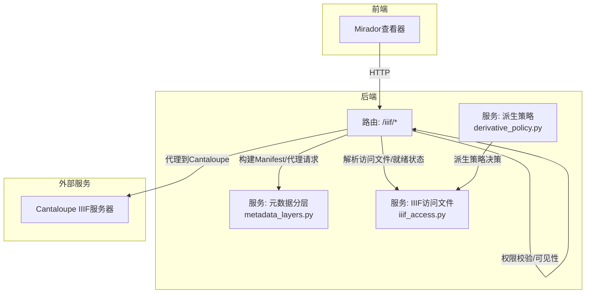
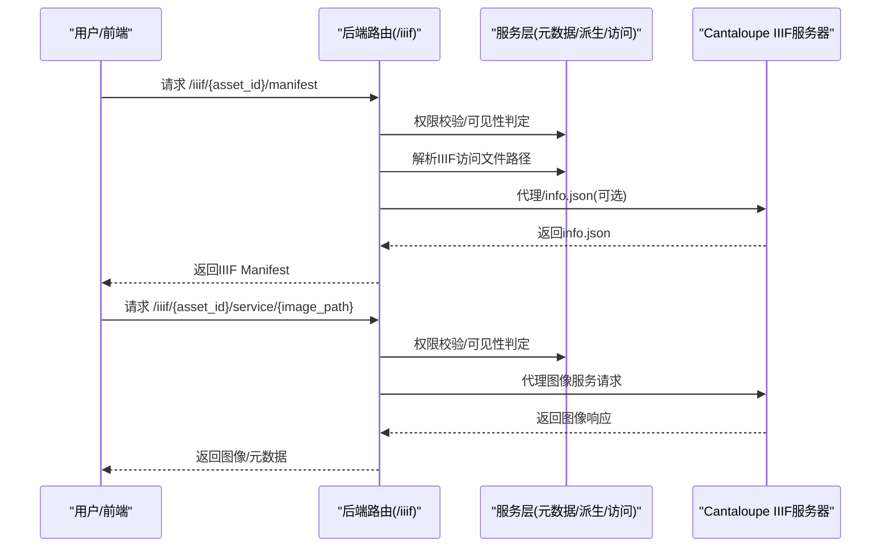
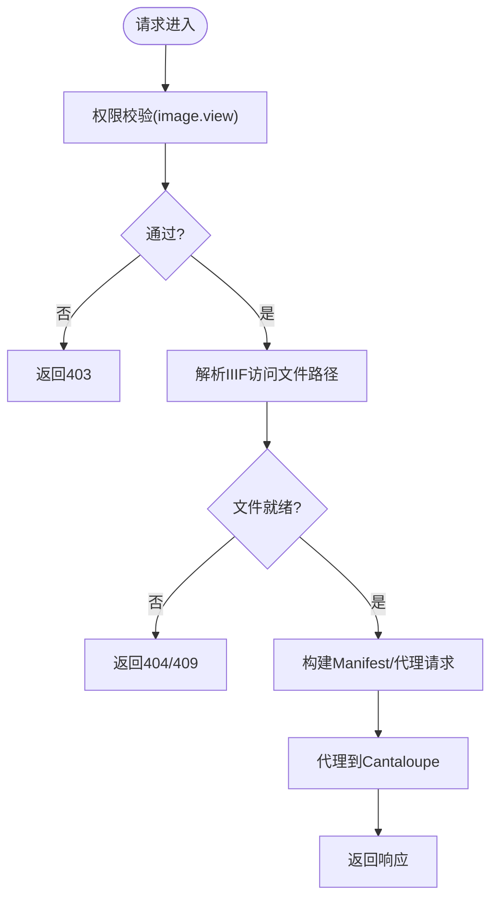
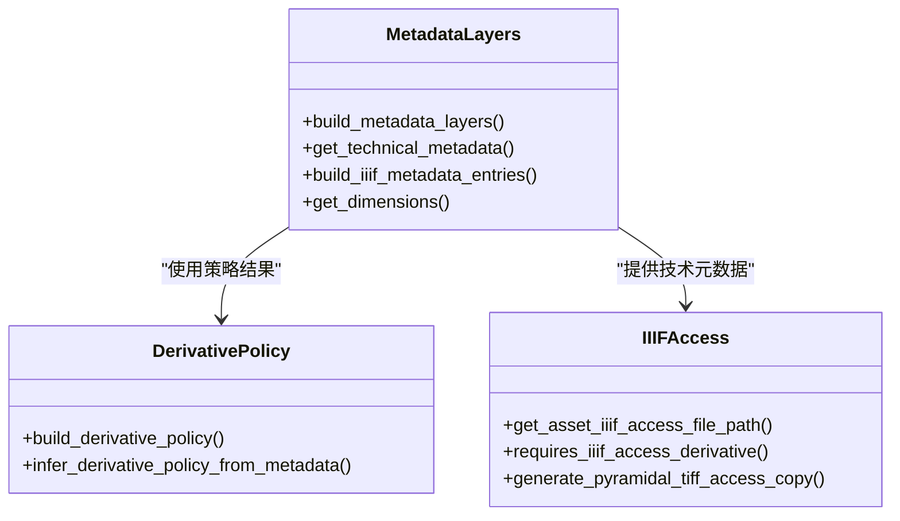
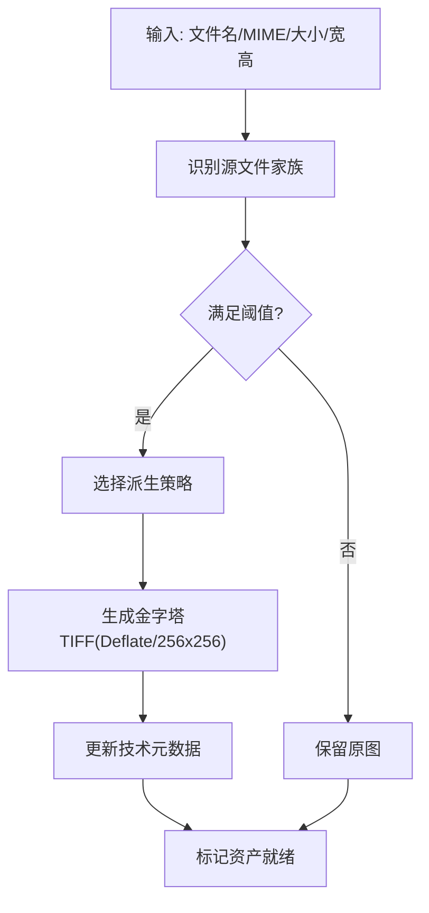
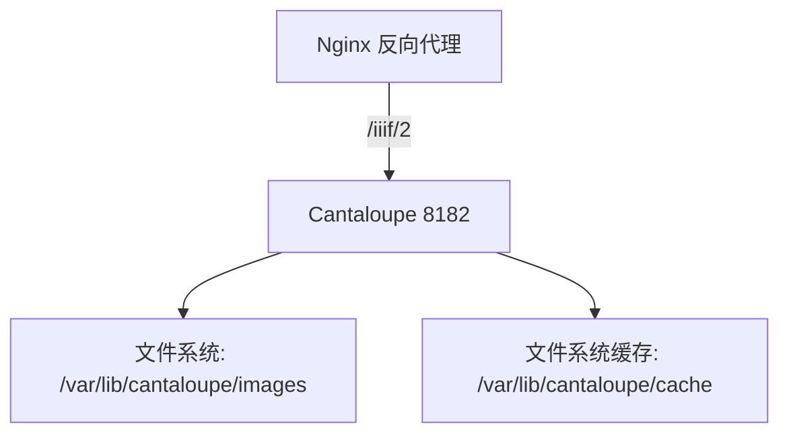
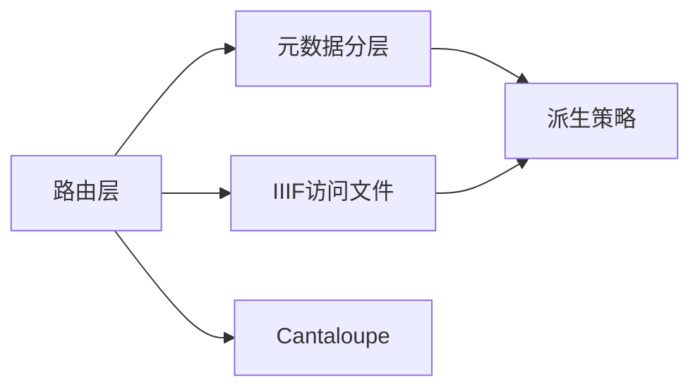

# IIIF图像服务集成

<cite>
**本文引用的文件**
- [backend/app/routers/iiif.py](file://backend/app/routers/iiif.py)
- [backend/app/services/iiif_access.py](file://backend/app/services/iiif_access.py)
- [backend/app/services/derivative_policy.py](file://backend/app/services/derivative_policy.py)
- [backend/app/services/metadata_layers.py](file://backend/app/services/metadata_layers.py)
- [docs/02-架构设计/AUTH_AND_IIIF_INTEGRATION_PLAN.md](file://docs/02-架构设计/AUTH_AND_IIIF_INTEGRATION_PLAN.md)
- [docs/04-实施方案/IMAGE_IIIF_ACCESS_FORMAT_PHASE1_PLAN.md](file://docs/04-实施方案/IMAGE_IIIF_ACCESS_FORMAT_PHASE1_PLAN.md)
- [docs/05-部署与运维/CANTALOUPE_DEPLOY_NOTES.md](file://docs/05-部署与运维/CANTALOUPE_DEPLOY_NOTES.md)
- [cantaloupe.properties](file://cantaloupe.properties)
- [docs/03-产品与流程/IMAGE_DERIVATIVE_POLICY.md](file://docs/03-产品与流程/IMAGE_DERIVATIVE_POLICY.md)
</cite>

## 目录
1. [简介](#简介)
2. [项目结构](#项目结构)
3. [核心组件](#核心组件)
4. [架构总览](#架构总览)
5. [详细组件分析](#详细组件分析)
6. [依赖分析](#依赖分析)
7. [性能考虑](#性能考虑)
8. [故障排查指南](#故障排查指南)
9. [结论](#结论)
10. [附录](#附录)

## 简介
本文件面向MDAMS原型项目的IIIF图像服务集成，系统性阐述IIIF Presentation API、Image API、认证与访问控制的实现与扩展，以及与Cantaloupe IIIF服务器的协同部署。文档覆盖图像访问策略（权限控制、访问限制、缓存与性能优化）、派生文件生成机制（多分辨率金字塔、格式转换、尺寸与质量控制）、图像元数据管理与暴露、IIIF清单生成与管理、以及最佳实践与性能优化建议。

## 项目结构
围绕IIIF集成的相关模块分布如下：
- 后端路由层：提供Manifest与图像服务代理接口，执行权限校验与可见性判定
- 服务层：
  - 元数据分层与字段映射
  - 派生文件策略与生成
  - IIIF访问文件路径解析与就绪状态判定
- 文档与配置：
  - 认证与IIIF访问控制整合规划
  - IIIF访问格式与派生策略实施计划
  - Cantaloupe部署与调试要点
  - 服务器配置文件

图表来源
- [backend/app/routers/iiif.py:138-303](file://backend/app/routers/iiif.py#L138-L303)
- [backend/app/services/metadata_layers.py:412-507](file://backend/app/services/metadata_layers.py#L412-L507)
- [backend/app/services/derivative_policy.py:72-141](file://backend/app/services/derivative_policy.py#L72-L141)
- [backend/app/services/iiif_access.py:115-184](file://backend/app/services/iiif_access.py#L115-L184)

章节来源
- [backend/app/routers/iiif.py:1-303](file://backend/app/routers/iiif.py#L1-L303)
- [backend/app/services/metadata_layers.py:1-636](file://backend/app/services/metadata_layers.py#L1-L636)
- [backend/app/services/derivative_policy.py:1-168](file://backend/app/services/derivative_policy.py#L1-L168)
- [backend/app/services/iiif_access.py:1-259](file://backend/app/services/iiif_access.py#L1-L259)

## 核心组件
- IIIF路由与权限控制
  - 提供Manifest与图像服务代理接口，统一进行应用级权限与可见性校验
  - 通过资产可见性范围与集合对象ID共同决定访问许可
- 元数据分层与字段映射
  - 将原始元数据归并为核心(Core)、管理(Management)、技术(Technical)、原始(raw_metadata)等分层
  - 提供字段别名与多语言标签，支撑IIIF清单元数据暴露
- 派生策略与生成
  - 基于源文件格式、大小、像素数等阈值，选择保留原图或生成IIIF访问派生文件
  - 生成BigTIFF金字塔瓦片文件，支持Deflate压缩与256×256瓦片
- IIIF访问文件解析与就绪状态
  - 优先解析技术元数据中的IIIF访问文件路径，必要时回退到原图
  - 通过状态与文件存在性判断，确定资产是否已就绪

章节来源
- [backend/app/routers/iiif.py:138-303](file://backend/app/routers/iiif.py#L138-L303)
- [backend/app/services/metadata_layers.py:412-635](file://backend/app/services/metadata_layers.py#L412-L635)
- [backend/app/services/derivative_policy.py:55-141](file://backend/app/services/derivative_policy.py#L55-L141)
- [backend/app/services/iiif_access.py:115-259](file://backend/app/services/iiif_access.py#L115-L259)

## 架构总览
本系统采用“后端统一鉴权+Cantaloupe图像服务”的架构模式：
- 前端通过后端路由访问IIIF资源，后端负责权限与可见性控制
- 后端根据资产元数据与策略，决定使用原图或派生文件作为图像服务源
- 图像服务请求由后端代理至Cantaloupe，后者提供IIIF Image API能力
- 清单与元数据由后端动态生成，确保与平台权限体系一致

图表来源
- [backend/app/routers/iiif.py:138-303](file://backend/app/routers/iiif.py#L138-L303)
- [backend/app/services/iiif_access.py:115-184](file://backend/app/services/iiif_access.py#L115-L184)
- [cantaloupe.properties:103-127](file://cantaloupe.properties#L103-L127)

## 详细组件分析

### 组件A：IIIF路由与权限控制
- 功能职责
  - 生成IIIF Presentation API 3.0清单，包含Canvas、Annotation与ImageService引用
  - 代理IIIF Image API请求，统一鉴权入口，必要时改写info.json中的@id
  - 基于资产可见性范围与集合对象ID进行访问控制
- 关键流程
  - 清单生成：解析技术元数据，计算Canvas尺寸，注入平台元数据与版权信息
  - 图像服务代理：校验请求文件名一致性，构造Cantaloupe服务URL，透传请求并设置缓存头
- 安全与合规
  - 所有访问均需具备image.view权限
  - 对owner_only等受限范围的资源，严格校验当前用户的collection_scope

图表来源
- [backend/app/routers/iiif.py:138-303](file://backend/app/routers/iiif.py#L138-L303)
- [backend/app/services/iiif_access.py:176-180](file://backend/app/services/iiif_access.py#L176-L180)

章节来源
- [backend/app/routers/iiif.py:138-303](file://backend/app/routers/iiif.py#L138-L303)

### 组件B：元数据分层与字段映射
- 分层结构
  - Core：资源ID、标题、状态、可见性范围、集合对象ID、画像标签等
  - Management：项目类型、摄影师、版权归属、拍摄时间、标签等
  - Technical：原始/访问文件路径、MIME类型、尺寸、派生规则、校验值等
  - Profile：按画像类型划分的特定字段集
- 字段别名与多语言
  - 支持中英文标签与多语言值渲染
  - 提供IIIF清单元数据条目构建函数，将分层字段映射为label/value结构
- 与清单的关系
  - 清单metadata部分直接来源于该分层体系，确保版权、来源、尺寸等信息一致暴露

图表来源
- [backend/app/services/metadata_layers.py:412-635](file://backend/app/services/metadata_layers.py#L412-L635)
- [backend/app/services/derivative_policy.py:72-141](file://backend/app/services/derivative_policy.py#L72-L141)
- [backend/app/services/iiif_access.py:45-200](file://backend/app/services/iiif_access.py#L45-L200)

章节来源
- [backend/app/services/metadata_layers.py:1-636](file://backend/app/services/metadata_layers.py#L1-L636)

### 组件C：派生策略与生成
- 策略决策
  - 源文件家族识别（PSB、TIFF、JPEG等）
  - 基于阈值（大小、像素数）选择派生策略：保留原图、生成金字塔TIFF、生成轻量访问JPEG
- 生成实现
  - 使用pyvips生成BigTIFF金字塔瓦片，Deflate压缩，256×256瓦片
  - 更新技术元数据，记录访问文件路径、MIME类型、尺寸、转换方法等
- 状态流转
  - 派生待生成/处理中/就绪，结合就绪状态影响清单与图像服务可用性

图表来源
- [backend/app/services/derivative_policy.py:55-141](file://backend/app/services/derivative_policy.py#L55-L141)
- [backend/app/services/iiif_access.py:187-200](file://backend/app/services/iiif_access.py#L187-L200)
- [backend/app/services/iiif_access.py:230-259](file://backend/app/services/iiif_access.py#L230-L259)

章节来源
- [backend/app/services/derivative_policy.py:1-168](file://backend/app/services/derivative_policy.py#L1-L168)
- [backend/app/services/iiif_access.py:1-259](file://backend/app/services/iiif_access.py#L1-L259)

### 组件D：Cantaloupe IIIF服务器配置与部署
- 关键配置点
  - base_uri：与反向代理路径保持一致，避免重复路径
  - FilesystemSource：映射派生文件存储路径，确保精确文件名匹配
  - 缓存策略：启用文件系统缓存，内存缓存按需启用
  - CORS：允许跨域访问，便于前端查看器加载
- 部署注意事项
  - 解决容器启动卡死（熵源与日志锁问题）
  - Nginx反向代理正确配置，避免路径重复与Host头传递
  - 配置变更后强制重建以绕过Docker构建缓存

图表来源
- [docs/05-部署与运维/CANTALOUPE_DEPLOY_NOTES.md:30-76](file://docs/05-部署与运维/CANTALOUPE_DEPLOY_NOTES.md#L30-L76)
- [cantaloupe.properties:10-41](file://cantaloupe.properties#L10-L41)
- [cantaloupe.properties:103-147](file://cantaloupe.properties#L103-L147)

章节来源
- [docs/05-部署与运维/CANTALOUPE_DEPLOY_NOTES.md:1-108](file://docs/05-部署与运维/CANTALOUPE_DEPLOY_NOTES.md#L1-L108)
- [cantaloupe.properties:1-162](file://cantaloupe.properties#L1-L162)

## 依赖分析
- 组件耦合
  - 路由层依赖服务层进行权限、可见性、元数据与派生文件解析
  - 元数据分层为策略与访问文件解析提供统一数据源
  - 派生策略驱动访问文件生成与状态更新
- 外部依赖
  - Cantaloupe IIIF服务器提供Image API能力
  - pyvips用于大图金字塔生成
- 潜在风险
  - 若Manifest中的图像服务ID未指向后端代理，可能导致鉴权缺口
  - 反向代理路径配置不当会导致502/404与重复路径问题

图表来源
- [backend/app/routers/iiif.py:14-20](file://backend/app/routers/iiif.py#L14-L20)
- [backend/app/services/metadata_layers.py:412-507](file://backend/app/services/metadata_layers.py#L412-L507)
- [backend/app/services/iiif_access.py:115-184](file://backend/app/services/iiif_access.py#L115-L184)
- [backend/app/services/derivative_policy.py:72-141](file://backend/app/services/derivative_policy.py#L72-L141)

章节来源
- [backend/app/routers/iiif.py:1-303](file://backend/app/routers/iiif.py#L1-L303)
- [backend/app/services/metadata_layers.py:1-636](file://backend/app/services/metadata_layers.py#L1-L636)
- [backend/app/services/iiif_access.py:1-259](file://backend/app/services/iiif_access.py#L1-L259)
- [backend/app/services/derivative_policy.py:1-168](file://backend/app/services/derivative_policy.py#L1-L168)

## 性能考虑
- 派生文件优化
  - BigTIFF + 瓦片 + 金字塔 + Deflate，显著提升大图缩放与局部读取性能
  - 256×256瓦片适配IIIF标准，兼顾内存占用与I/O效率
- 缓存策略
  - 启用文件系统缓存，合理设置TTL
  - 对info.json与图像响应设置合适的Cache-Control，减少重复请求
- 服务器与并发
  - 低内存环境下谨慎启用内存缓存，优先文件系统缓存
  - 通过STREAM检索策略避免将整图加载至堆内存
- 反向代理
  - Nginx原样转发，避免URI尾随斜杠陷阱
  - 正确传递Host头，确保Cantaloupe正确解析base_uri

章节来源
- [docs/04-实施方案/IMAGE_IIIF_ACCESS_FORMAT_PHASE1_PLAN.md:153-172](file://docs/04-实施方案/IMAGE_IIIF_ACCESS_FORMAT_PHASE1_PLAN.md#L153-L172)
- [cantaloupe.properties:103-127](file://cantaloupe.properties#L103-L127)
- [docs/05-部署与运维/CANTALOUPE_DEPLOY_NOTES.md:79-107](file://docs/05-部署与运维/CANTALOUPE_DEPLOY_NOTES.md#L79-L107)

## 故障排查指南
- 启动卡死
  - 挂载/dev/urandom到容器的/dev/random，或在JVM参数中指定熵源
  - 禁用文件日志，仅输出到控制台
- 502/404与路径重复
  - 确认Nginx上游主机名可解析，使用容器名并在同一网络
  - proxy_pass不带URI后缀，原样转发；传递$host（含端口）
  - base_uri设置为根域名，避免与Nginx路径重写叠加
- 配置未生效
  - 强制重建镜像或在Dockerfile中破坏缓存层
  - 进入容器检查配置文件内容

章节来源
- [docs/05-部署与运维/CANTALOUPE_DEPLOY_NOTES.md:5-107](file://docs/05-部署与运维/CANTALOUPE_DEPLOY_NOTES.md#L5-L107)
- [cantaloupe.properties:10-41](file://cantaloupe.properties#L10-L41)

## 结论
本项目在后端实现了完整的IIIF访问控制与清单生成能力，结合Cantaloupe提供稳定的图像服务。通过明确的派生策略与元数据分层，系统在权限一致性、性能与可维护性之间取得平衡。建议下一步将Manifest中的图像服务ID切换为后端受控代理路径，实现“清单受控、图像服务亦受控”的完整闭环。

## 附录

### IIIF集成最佳实践
- 清单与元数据
  - 使用元数据分层体系，确保版权、来源、尺寸等信息一致暴露
  - 清单metadata条目来自分层字段，避免手工维护
- 访问控制
  - 所有入口均需具备image.view权限
  - owner_only等受限范围严格校验collection_scope
- 派生文件
  - 大型TIFF/PSB必须生成金字塔TIFF；超大JPEG可生成轻量访问JPEG
  - 生成过程记录转换方法与技术元数据，便于审计与排障
- 服务器与部署
  - base_uri与反向代理路径保持一致，避免重复路径
  - 启用文件系统缓存，按需启用内存缓存
  - 强制重建以确保配置变更生效

章节来源
- [docs/02-架构设计/AUTH_AND_IIIF_INTEGRATION_PLAN.md:73-135](file://docs/02-架构设计/AUTH_AND_IIIF_INTEGRATION_PLAN.md#L73-L135)
- [docs/04-实施方案/IMAGE_IIIF_ACCESS_FORMAT_PHASE1_PLAN.md:26-172](file://docs/04-实施方案/IMAGE_IIIF_ACCESS_FORMAT_PHASE1_PLAN.md#L26-L172)
- [docs/03-产品与流程/IMAGE_DERIVATIVE_POLICY.md:1-26](file://docs/03-产品与流程/IMAGE_DERIVATIVE_POLICY.md#L1-L26)
- [docs/05-部署与运维/CANTALOUPE_DEPLOY_NOTES.md:102-107](file://docs/05-部署与运维/CANTALOUPE_DEPLOY_NOTES.md#L102-L107)