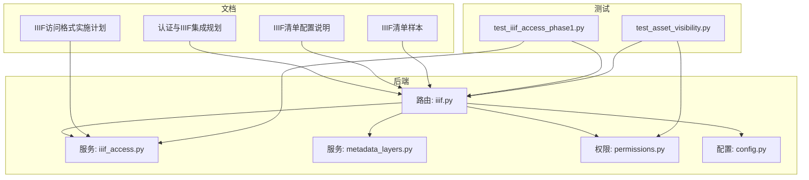
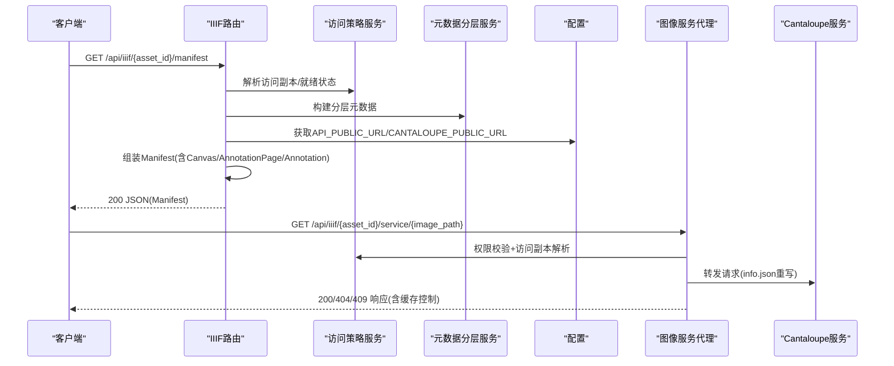
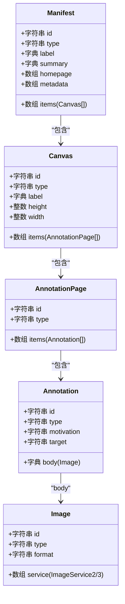
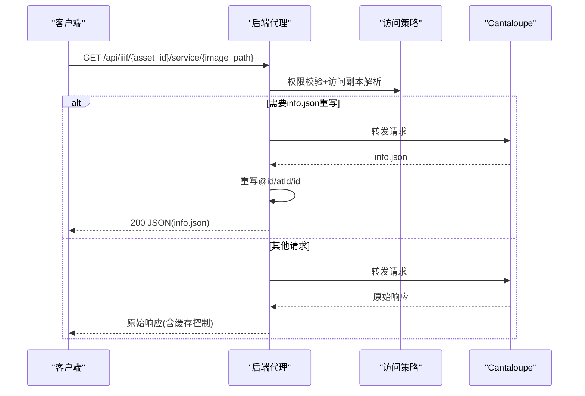
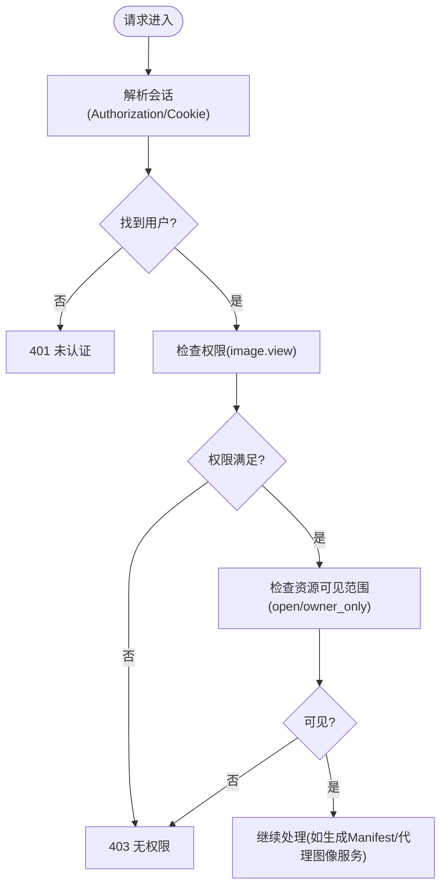
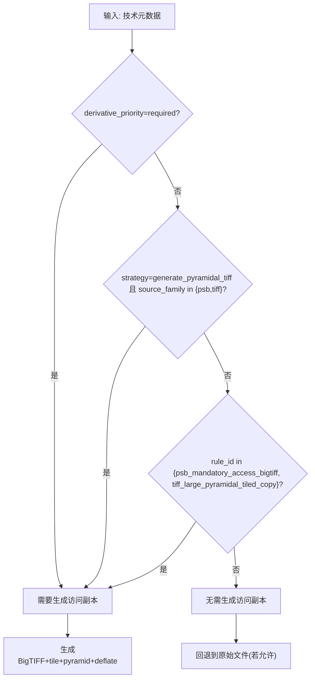
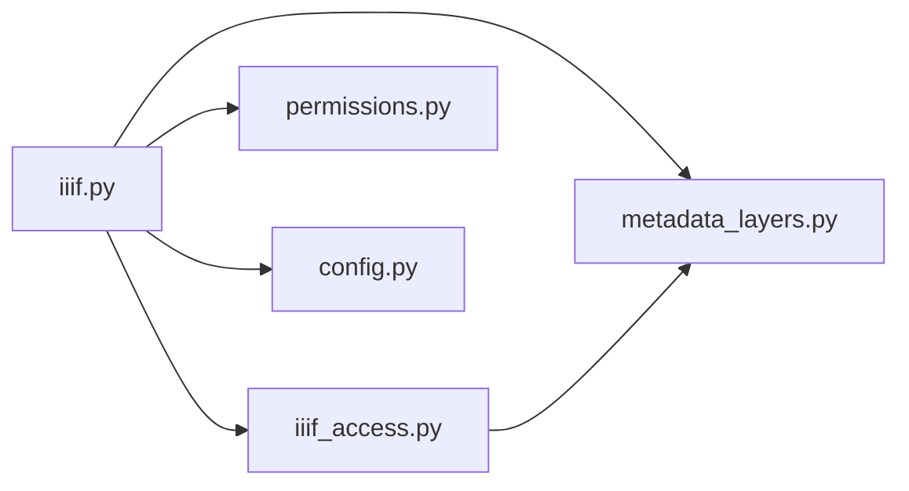

# IIIF标准实现

<cite>
**本文引用的文件**
- [backend/app/routers/iiif.py](file://backend/app/routers/iiif.py)
- [backend/app/services/iiif_access.py](file://backend/app/services/iiif_access.py)
- [backend/app/services/metadata_layers.py](file://backend/app/services/metadata_layers.py)
- [backend/app/permissions.py](file://backend/app/permissions.py)
- [backend/app/config.py](file://backend/app/config.py)
- [docs/02-架构设计/AUTH_AND_IIIF_INTEGRATION_PLAN.md](file://docs/02-架构设计/AUTH_AND_IIIF_INTEGRATION_PLAN.md)
- [docs/04-实施方案/IMAGE_IIIF_ACCESS_FORMAT_PHASE1_PLAN.md](file://docs/04-实施方案/IMAGE_IIIF_ACCESS_FORMAT_PHASE1_PLAN.md)
- [docs/08-研究/IIIF清单配置说明（IIIF_MANIFEST_PROFILE）.md](file://docs/08-研究/IIIF清单配置说明（IIIF_MANIFEST_PROFILE）.md)
- [docs/08-研究/IIIF清单样本（IIIF_MANIFEST_SAMPLE）.md](file://docs/08-研究/IIIF清单样本（IIIF_MANIFEST_SAMPLE）.md)
- [backend/tests/test_iiif_access_phase1.py](file://backend/tests/test_iiif_access_phase1.py)
- [backend/tests/test_asset_visibility.py](file://backend/tests/test_asset_visibility.py)
</cite>

## 目录
1. [简介](#简介)
2. [项目结构](#项目结构)
3. [核心组件](#核心组件)
4. [架构总览](#架构总览)
5. [详细组件分析](#详细组件分析)
6. [依赖分析](#依赖分析)
7. [性能考虑](#性能考虑)
8. [故障排查指南](#故障排查指南)
9. [结论](#结论)
10. [附录](#附录)

## 简介
本文件面向MDAMS原型项目的IIIF标准实现，系统梳理了Presentation API v3与Image API在后端的落地方式，以及与认证、权限、访问策略的集成现状与演进方向。重点覆盖：
- Presentation API v3：Manifest、Canvas、AnnotationPage、Annotation等核心结构的实现与输出
- Image API：图像服务代理、info.json重写、缓存控制、尺寸/缩放/裁剪/旋转/格式转换的调用链
- 认证与权限：登录状态检查、权限验证、会话管理、资源可见范围控制
- 扩展与定制：自定义元数据字段、派生策略、访问副本与原始文件的分离
- API端点映射与请求响应示例：HTTP方法、URL模式、参数规范、返回值格式
- 兼容性测试与验证方法：基于测试用例与前端查看器的验证路径

## 项目结构
围绕IIIF实现的核心代码与文档分布如下：
- 后端路由与服务
  - IIIF路由：`backend/app/routers/iiif.py`
  - IIIF访问策略与派生：`backend/app/services/iiif_access.py`
  - 元数据分层与字段映射：`backend/app/services/metadata_layers.py`
  - 权限与认证：`backend/app/permissions.py`
  - 配置：`backend/app/config.py`
- 文档与测试
  - 认证与IIIF集成规划：`docs/02-架构设计/AUTH_AND_IIIF_INTEGRATION_PLAN.md`
  - IIIF访问格式实施计划：`docs/04-实施方案/IMAGE_IIIF_ACCESS_FORMAT_PHASE1_PLAN.md`
  - IIIF清单配置说明：`docs/08-研究/IIIF清单配置说明（IIIF_MANIFEST_PROFILE）.md`
  - IIIF清单样本：`docs/08-研究/IIIF清单样本（IIIF_MANIFEST_SAMPLE）.md`
  - IIIF访问策略测试：`backend/tests/test_iiif_access_phase1.py`
  - 资源可见性测试：`backend/tests/test_asset_visibility.py`

图表来源
- [backend/app/routers/iiif.py:1-303](file://backend/app/routers/iiif.py#L1-L303)
- [backend/app/services/iiif_access.py:1-259](file://backend/app/services/iiif_access.py#L1-L259)
- [backend/app/services/metadata_layers.py:1-200](file://backend/app/services/metadata_layers.py#L1-L200)
- [backend/app/permissions.py:1-255](file://backend/app/permissions.py#L1-L255)
- [backend/app/config.py:1-72](file://backend/app/config.py#L1-L72)
- [docs/02-架构设计/AUTH_AND_IIIF_INTEGRATION_PLAN.md:1-142](file://docs/02-架构设计/AUTH_AND_IIIF_INTEGRATION_PLAN.md#L1-L142)
- [docs/04-实施方案/IMAGE_IIIF_ACCESS_FORMAT_PHASE1_PLAN.md:1-308](file://docs/04-实施方案/IMAGE_IIIF_ACCESS_FORMAT_PHASE1_PLAN.md#L1-L308)
- [docs/08-研究/IIIF清单配置说明（IIIF_MANIFEST_PROFILE）.md:1-196](file://docs/08-研究/IIIF清单配置说明（IIIF_MANIFEST_PROFILE）.md#L1-L196)
- [docs/08-研究/IIIF清单样本（IIIF_MANIFEST_SAMPLE）.md:19-141](file://docs/08-研究/IIIF清单样本（IIIF_MANIFEST_SAMPLE）.md#L19-L141)
- [backend/tests/test_iiif_access_phase1.py:1-174](file://backend/tests/test_iiif_access_phase1.py#L1-L174)
- [backend/tests/test_asset_visibility.py:104-123](file://backend/tests/test_asset_visibility.py#L104-L123)

章节来源
- [backend/app/routers/iiif.py:1-303](file://backend/app/routers/iiif.py#L1-L303)
- [backend/app/services/iiif_access.py:1-259](file://backend/app/services/iiif_access.py#L1-L259)
- [backend/app/services/metadata_layers.py:1-200](file://backend/app/services/metadata_layers.py#L1-L200)
- [backend/app/permissions.py:1-255](file://backend/app/permissions.py#L1-L255)
- [backend/app/config.py:1-72](file://backend/app/config.py#L1-L72)
- [docs/02-架构设计/AUTH_AND_IIIF_INTEGRATION_PLAN.md:1-142](file://docs/02-架构设计/AUTH_AND_IIIF_INTEGRATION_PLAN.md#L1-L142)
- [docs/04-实施方案/IMAGE_IIIF_ACCESS_FORMAT_PHASE1_PLAN.md:1-308](file://docs/04-实施方案/IMAGE_IIIF_ACCESS_FORMAT_PHASE1_PLAN.md#L1-L308)
- [docs/08-研究/IIIF清单配置说明（IIIF_MANIFEST_PROFILE）.md:1-196](file://docs/08-研究/IIIF清单配置说明（IIIF_MANIFEST_PROFILE）.md#L1-L196)
- [docs/08-研究/IIIF清单样本（IIIF_MANIFEST_SAMPLE）.md:19-141](file://docs/08-研究/IIIF清单样本（IIIF_MANIFEST_SAMPLE）.md#L19-L141)
- [backend/tests/test_iiif_access_phase1.py:1-174](file://backend/tests/test_iiif_access_phase1.py#L1-L174)
- [backend/tests/test_asset_visibility.py:104-123](file://backend/tests/test_asset_visibility.py#L104-L123)

## 核心组件
- IIIF路由与代理
  - Manifest端点：`/api/iiif/{asset_id}/manifest`
  - 图像服务代理端点：`/api/iiif/{asset_id}/service/{image_path:path}`
- 访问策略与派生
  - 访问副本解析、派生生成、就绪状态判定
- 元数据分层
  - core/management/technical/profile等分层字段与映射
- 权限与认证
  - 角色-权限映射、会话解析、资源可见范围判断
- 配置
  - API_PUBLIC_URL、CANTALOUPE_PUBLIC_URL等公共URL配置

章节来源
- [backend/app/routers/iiif.py:138-303](file://backend/app/routers/iiif.py#L138-L303)
- [backend/app/services/iiif_access.py:115-259](file://backend/app/services/iiif_access.py#L115-L259)
- [backend/app/services/metadata_layers.py:1-200](file://backend/app/services/metadata_layers.py#L1-L200)
- [backend/app/permissions.py:17-255](file://backend/app/permissions.py#L17-L255)
- [backend/app/config.py:42-46](file://backend/app/config.py#L42-L46)

## 架构总览
IIIF实现以“访问投影层”为核心，将内部资产对象投影为可访问的IIIF结构，并通过后端路由与服务完成权限校验、访问副本解析、图像服务代理与Manifest组装。

图表来源
- [backend/app/routers/iiif.py:138-303](file://backend/app/routers/iiif.py#L138-L303)
- [backend/app/services/iiif_access.py:115-259](file://backend/app/services/iiif_access.py#L115-L259)
- [backend/app/services/metadata_layers.py:1-200](file://backend/app/services/metadata_layers.py#L1-L200)
- [backend/app/config.py:42-46](file://backend/app/config.py#L42-L46)

## 详细组件分析

### IIIF Presentation API v3：Manifest与核心结构
- 端点与权限
  - 方法：GET
  - 路径：`/api/iiif/{asset_id}/manifest`
  - 权限：需要`image.view`；同时进行资源可见范围校验
- 结构组成
  - @context：固定为Presentation 3上下文
  - id：基于API_PUBLIC_URL生成
  - type：固定为Manifest
  - label/summary/homepage：基础元信息
  - metadata：系统字段+分层元数据映射
  - items：Canvas（单页）、AnnotationPage、Annotation（motivation=painting）
  - body.service：指向Cantaloupe图像服务（当前直接使用CANTALOUPE_PUBLIC_URL）
- 尺寸与就绪
  - 从分层元数据推断宽高，缺失时使用兜底值
  - 若派生副本未就绪且策略要求，则返回冲突状态

图表来源
- [backend/app/routers/iiif.py:181-254](file://backend/app/routers/iiif.py#L181-L254)

章节来源
- [backend/app/routers/iiif.py:138-254](file://backend/app/routers/iiif.py#L138-L254)
- [docs/08-研究/IIIF清单样本（IIIF_MANIFEST_SAMPLE）.md:19-141](file://docs/08-研究/IIIF清单样本（IIIF_MANIFEST_SAMPLE）.md#L19-L141)
- [docs/08-研究/IIIF清单配置说明（IIIF_MANIFEST_PROFILE）.md:69-128](file://docs/08-研究/IIIF清单配置说明（IIIF_MANIFEST_PROFILE）.md#L69-L128)

### IIIF Image API：图像服务与代理
- 端点与权限
  - 方法：GET
  - 路径：`/api/iiif/{asset_id}/service/{image_path:path}`
  - 权限：需要`image.view`；同时进行资源可见范围校验
- 代理与重写
  - 代理目标：Cantaloupe图像服务
  - 对info.json响应进行重写，将@id/atId/id统一为后端代理路径
  - 缓存控制：当资产处于就绪状态时设置no-store头
- 访问副本与就绪
  - 若派生副本未就绪且策略要求，则返回冲突状态

图表来源
- [backend/app/routers/iiif.py:257-303](file://backend/app/routers/iiif.py#L257-L303)
- [backend/app/services/iiif_access.py:176-179](file://backend/app/services/iiif_access.py#L176-L179)

章节来源
- [backend/app/routers/iiif.py:257-303](file://backend/app/routers/iiif.py#L257-L303)
- [backend/app/services/iiif_access.py:176-179](file://backend/app/services/iiif_access.py#L176-L179)

### 认证与权限：登录状态、会话管理与资源可见范围
- 登录与会话
  - 支持Bearer Token与Cookie两种方式解析当前用户
  - 未提供会话续期逻辑，需依赖前端携带有效Token
- 权限矩阵
  - 角色到权限映射，支持require_permission与require_any_permission
- 资源可见范围
  - 基于visibility_scope与collection_object_id，结合用户collection_scope判断
  - open/owner_only两种范围，owner_only需在责任范围内才可见

图表来源
- [backend/app/permissions.py:179-255](file://backend/app/permissions.py#L179-L255)
- [backend/app/routers/iiif.py:57-63](file://backend/app/routers/iiif.py#L57-L63)

章节来源
- [backend/app/permissions.py:17-255](file://backend/app/permissions.py#L17-L255)
- [backend/app/routers/iiif.py:57-63](file://backend/app/routers/iiif.py#L57-L63)
- [docs/02-架构设计/AUTH_AND_IIIF_INTEGRATION_PLAN.md:42-60](file://docs/02-架构设计/AUTH_AND_IIIF_INTEGRATION_PLAN.md#L42-L60)

### 访问策略与扩展：派生、元数据与访问副本
- 派生策略
  - 基于技术元数据推断是否需要生成IIIF访问副本
  - 必须生成的规则：特定规则ID、特定源格式、优先级为required
- 访问副本解析
  - 优先使用iiif_access_file_path；若不存在且允许回退则使用原始文件
  - 就绪状态：资产status为ready且存在访问副本
- 元数据分层
  - core/management/technical/profile四层，提供丰富的字段映射与标签
  - 技术元数据包含original与access副本的路径、MIME、尺寸、转换方法等
- 存储与输出
  - 推荐存储结构：originals与derivatives/iiif-access两层
  - 输出优先使用访问副本，下载与Bag导出均遵循此策略

图表来源
- [backend/app/services/iiif_access.py:45-56](file://backend/app/services/iiif_access.py#L45-L56)
- [backend/app/services/iiif_access.py:115-140](file://backend/app/services/iiif_access.py#L115-L140)
- [docs/04-实施方案/IMAGE_IIIF_ACCESS_FORMAT_PHASE1_PLAN.md:133-172](file://docs/04-实施方案/IMAGE_IIIF_ACCESS_FORMAT_PHASE1_PLAN.md#L133-L172)

章节来源
- [backend/app/services/iiif_access.py:45-140](file://backend/app/services/iiif_access.py#L45-L140)
- [backend/app/services/metadata_layers.py:1-200](file://backend/app/services/metadata_layers.py#L1-L200)
- [docs/04-实施方案/IMAGE_IIIF_ACCESS_FORMAT_PHASE1_PLAN.md:121-222](file://docs/04-实施方案/IMAGE_IIIF_ACCESS_FORMAT_PHASE1_PLAN.md#L121-L222)

### API端点映射与请求响应示例
- Manifest端点
  - 方法：GET
  - 路径：`/api/iiif/{asset_id}/manifest`
  - 权限：image.view
  - 成功响应：200 JSON(Manifest)
  - 异常：
    - 404：资产不存在或找不到访问副本
    - 403：无权限或资源不可见
    - 409：需要访问副本但尚未生成
- 图像服务代理端点
  - 方法：GET
  - 路径：`/api/iiif/{asset_id}/service/{image_path:path}`
  - 权限：image.view
  - 成功响应：200 JSON(info.json)或图像切片
  - 异常：404/403/409
- 参数与返回值
  - 路径参数：asset_id、image_path
  - 头部：Authorization: Bearer ... 或 Cookie: mdams.session=...
  - 返回值：JSON或二进制图像数据，info.json时设置id/atId/@id重写

章节来源
- [backend/app/routers/iiif.py:138-303](file://backend/app/routers/iiif.py#L138-L303)
- [backend/app/permissions.py:179-204](file://backend/app/permissions.py#L179-L204)
- [backend/app/services/iiif_access.py:176-179](file://backend/app/services/iiif_access.py#L176-L179)

## 依赖分析
- 组件耦合
  - IIIF路由依赖访问策略与元数据分层服务，耦合度适中
  - 权限模块独立，通过依赖注入在路由中使用
  - 配置模块集中管理公共URL，降低硬编码耦合
- 外部依赖
  - Cantaloupe作为图像服务上游
  - 测试中使用HTTP转发与本地文件模拟
- 潜在循环依赖
  - 当前未发现循环导入；服务间通过函数调用解耦

图表来源
- [backend/app/routers/iiif.py:14-18](file://backend/app/routers/iiif.py#L14-L18)
- [backend/app/services/iiif_access.py:9-11](file://backend/app/services/iiif_access.py#L9-L11)
- [backend/app/services/metadata_layers.py:7](file://backend/app/services/metadata_layers.py#L7)

章节来源
- [backend/app/routers/iiif.py:14-18](file://backend/app/routers/iiif.py#L14-L18)
- [backend/app/services/iiif_access.py:9-11](file://backend/app/services/iiif_access.py#L9-L11)
- [backend/app/services/metadata_layers.py:7](file://backend/app/services/metadata_layers.py#L7)

## 性能考虑
- 图像服务代理
  - 使用超时配置，避免上游阻塞
  - info.json重写仅在JSON类型时进行，减少不必要的解析
- 访问副本
  - BigTIFF+tile+pyramid+deflate组合提升大图缩放与分块读取性能
  - 优先使用访问副本而非原始文件，避免直接读取超大文件
- 缓存控制
  - 就绪状态下设置no-store，避免浏览器缓存可能的敏感内容

章节来源
- [backend/app/routers/iiif.py:22](file://backend/app/routers/iiif.py#L22)
- [backend/app/routers/iiif.py:285-302](file://backend/app/routers/iiif.py#L285-L302)
- [backend/app/services/iiif_access.py:187-199](file://backend/app/services/iiif_access.py#L187-L199)

## 故障排查指南
- Manifest返回403
  - 检查用户权限与资源可见范围；owner_only需在collection_scope内
  - 参考测试用例验证
- Manifest返回409
  - 派生副本未生成且策略要求必须生成
  - 参考测试用例触发后台任务生成
- 图像服务返回404
  - 访问副本路径不匹配或未就绪
  - 检查CANTALOUPE_PUBLIC_URL与API_PUBLIC_URL配置
- info.json重写异常
  - 确认上游返回为JSON且包含必要字段
  - 检查代理路径拼接与URL编码

章节来源
- [backend/tests/test_asset_visibility.py:104-123](file://backend/tests/test_asset_visibility.py#L104-L123)
- [backend/tests/test_iiif_access_phase1.py:127-146](file://backend/tests/test_iiif_access_phase1.py#L127-L146)
- [docs/02-架构设计/AUTH_AND_IIIF_INTEGRATION_PLAN.md:73-86](file://docs/02-架构设计/AUTH_AND_IIIF_INTEGRATION_PLAN.md#L73-L86)

## 结论
- 现状总结
  - 已完成面向单资产图像访问的最小IIIF Manifest输出层，具备动态生成、访问副本解析、图像服务集成、权限控制与查看器消费路径
  - 图像服务地址当前直接指向Cantaloupe，尚未完全统一到应用认证入口
- 风险与建议
  - 风险：页面受控而图像服务未完全收口可能导致权限不一致
  - 建议：将Manifest中的图像服务id切换为后端受控代理路径，统一info.json与切片访问的鉴权入口
- 下一步
  - 完善Manifest样本与capability矩阵
  - 增强兼容性验证（多查看器/工具）
  - 逐步收口图像服务访问，实现认证与IIIF服务的完全统一

章节来源
- [docs/08-研究/IIIF清单配置说明（IIIF_MANIFEST_PROFILE）.md:189-196](file://docs/08-研究/IIIF清单配置说明（IIIF_MANIFEST_PROFILE）.md#L189-L196)
- [docs/02-架构设计/AUTH_AND_IIIF_INTEGRATION_PLAN.md:97-135](file://docs/02-架构设计/AUTH_AND_IIIF_INTEGRATION_PLAN.md#L97-L135)

## 附录
- 相关文档
  - 认证与IIIF集成规划：[AUTH_AND_IIIF_INTEGRATION_PLAN.md](file://docs/02-架构设计/AUTH_AND_IIIF_INTEGRATION_PLAN.md)
  - IIIF访问格式实施计划：[IMAGE_IIIF_ACCESS_FORMAT_PHASE1_PLAN.md](file://docs/04-实施方案/IMAGE_IIIF_ACCESS_FORMAT_PHASE1_PLAN.md)
  - IIIF清单配置说明：[IIIF_MANIFEST_PROFILE.md](file://docs/08-研究/IIIF清单配置说明（IIIF_MANIFEST_PROFILE）.md)
  - IIIF清单样本：[IIIF_MANIFEST_SAMPLE.md](file://docs/08-研究/IIIF清单样本（IIIF_MANIFEST_SAMPLE）.md)
- 测试参考
  - IIIF访问策略测试：[test_iiif_access_phase1.py](file://backend/tests/test_iiif_access_phase1.py)
  - 资源可见性测试：[test_asset_visibility.py](file://backend/tests/test_asset_visibility.py)