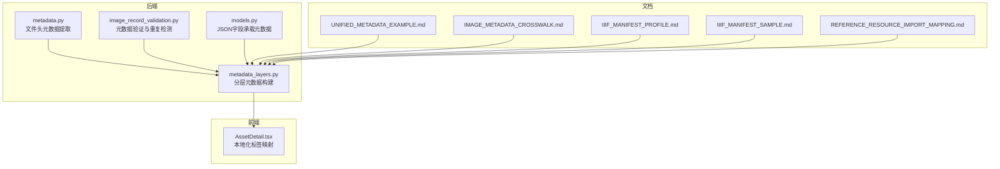
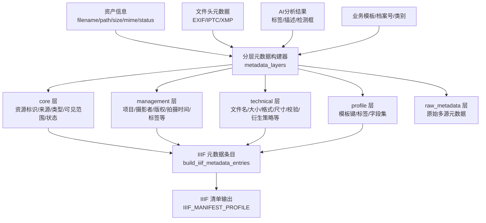
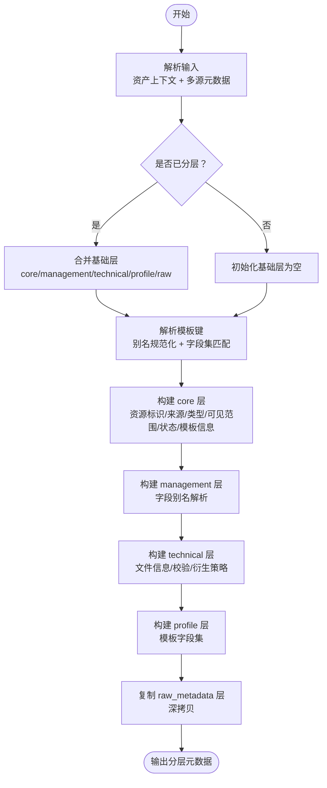
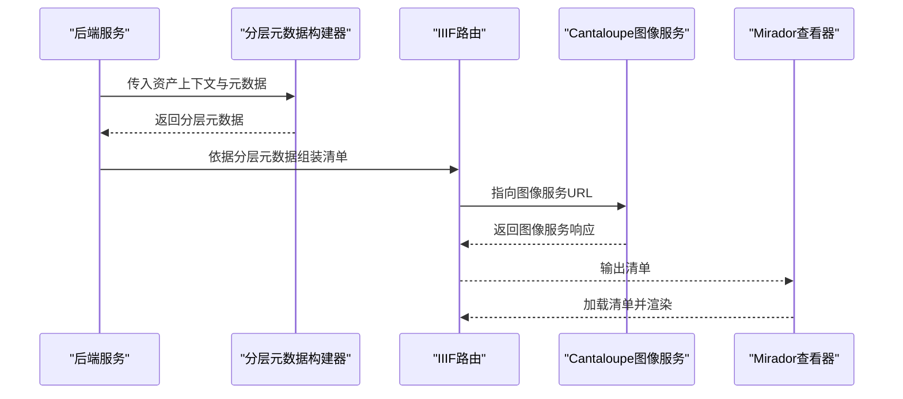
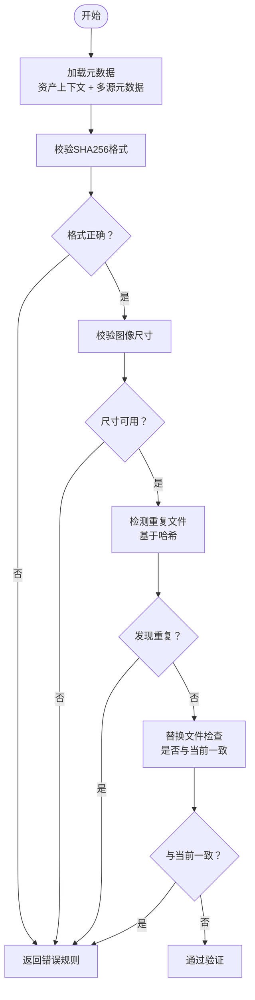
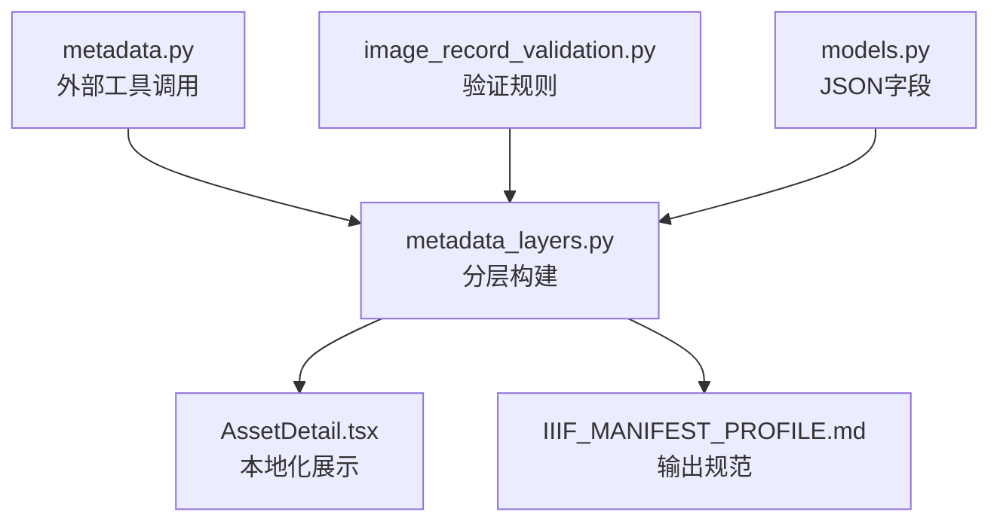

# 元数据管理

<cite>
**本文引用的文件**
- [metadata_layers.py](file://backend/app/services/metadata_layers.py)
- [metadata.py](file://backend/app/utils/metadata.py)
- [models.py](file://backend/app/models.py)
- [image_record_validation.py](file://backend/app/services/image_record_validation.py)
- [UNIFIED_METADATA_EXAMPLE.md](file://docs/06-参考资料/UNIFIED_METADATA_EXAMPLE.md)
- [IMAGE_METADATA_CROSSWALK.md](file://docs/08-研究/图像技术元数据映射（IMAGE_METADATA_CROSSWALK）.md)
- [IIIF_MANIFEST_PROFILE.md](file://docs/08-研究/IIIF清单配置说明（IIIF_MANIFEST_PROFILE）.md)
- [IIIF_MANIFEST_SAMPLE.md](file://docs/08-研究/IIIF清单样本（IIIF_MANIFEST_SAMPLE）.md)
- [REFERENCE_RESOURCE_IMPORT_MAPPING.md](file://docs/06-参考资料/REFERENCE_RESOURCE_IMPORT_MAPPING.md)
- [test_metadata_layers.py](file://backend/tests/test_metadata_layers.py)
- [AssetDetail.tsx](file://frontend/src/components/AssetDetail.tsx)
</cite>

## 目录
1. [简介](#简介)
2. [项目结构](#项目结构)
3. [核心组件](#核心组件)
4. [架构总览](#架构总览)
5. [详细组件分析](#详细组件分析)
6. [依赖分析](#依赖分析)
7. [性能考量](#性能考量)
8. [故障排查指南](#故障排查指南)
9. [结论](#结论)
10. [附录](#附录)

## 简介
本文件面向MDAMS原型项目的元数据管理，系统化阐述：
- IIIF元数据的标准映射与输出边界
- 元数据层架构（metadata_layers）的设计理念、数据结构与处理流程
- 元数据的动态生成机制（资产信息、文件头信息、AI分析结果等多源融合）
- 元数据的验证与清洗（格式校验、缺失值处理、重复数据检测）
- 元数据的国际化支持（多语言标签、本地化显示、文本编码）
- 元数据的版本控制与变更追踪（历史版本管理、变更日志、回滚机制）
- 元数据schema的设计与扩展方法

## 项目结构
围绕元数据管理的关键代码与文档分布如下：
- 后端服务层：metadata_layers负责分层元数据构建；metadata工具负责从文件头提取技术元数据；image_record_validation负责元数据验证与重复检测；models定义了JSON字段承载元数据的持久化结构。
- 前端展示层：AssetDetail组件负责将元数据字段映射为本地化标签。
- 文档资料：UNIFIED_METADATA_EXAMPLE、IMAGE_METADATA_CROSSWALK、IIIF_MANIFEST_PROFILE、IIIF_MANIFEST_SAMPLE、REFERENCE_RESOURCE_IMPORT_MAPPING等提供了跨标准映射与输出规范的参考。

图表来源
- [metadata_layers.py:1-636](file://backend/app/services/metadata_layers.py#L1-L636)
- [metadata.py:1-79](file://backend/app/utils/metadata.py#L1-L79)
- [image_record_validation.py:431-500](file://backend/app/services/image_record_validation.py#L431-L500)
- [models.py:1-307](file://backend/app/models.py#L1-L307)
- [AssetDetail.tsx:41-81](file://frontend/src/components/AssetDetail.tsx#L41-L81)
- [UNIFIED_METADATA_EXAMPLE.md:1-112](file://docs/06-参考资料/UNIFIED_METADATA_EXAMPLE.md#L1-L112)
- [IMAGE_METADATA_CROSSWALK.md:1-178](file://docs/08-研究/图像技术元数据映射（IMAGE_METADATA_CROSSWALK）.md#L1-L178)
- [IIIF_MANIFEST_PROFILE.md:1-196](file://docs/08-研究/IIIF清单配置说明（IIIF_MANIFEST_PROFILE）.md#L1-L196)
- [IIIF_MANIFEST_SAMPLE.md:19-141](file://docs/08-研究/IIIF清单样本（IIIF_MANIFEST_SAMPLE）.md#L19-L141)
- [REFERENCE_RESOURCE_IMPORT_MAPPING.md:47-89](file://docs/06-参考资料/REFERENCE_RESOURCE_IMPORT_MAPPING.md#L47-L89)

章节来源
- [metadata_layers.py:1-636](file://backend/app/services/metadata_layers.py#L1-L636)
- [metadata.py:1-79](file://backend/app/utils/metadata.py#L1-L79)
- [models.py:1-307](file://backend/app/models.py#L1-L307)
- [AssetDetail.tsx:41-81](file://frontend/src/components/AssetDetail.tsx#L41-L81)
- [UNIFIED_METADATA_EXAMPLE.md:1-112](file://docs/06-参考资料/UNIFIED_METADATA_EXAMPLE.md#L1-L112)
- [IMAGE_METADATA_CROSSWALK.md:1-178](file://docs/08-研究/图像技术元数据映射（IMAGE_METADATA_CROSSWALK）.md#L1-L178)
- [IIIF_MANIFEST_PROFILE.md:1-196](file://docs/08-研究/IIIF清单配置说明（IIIF_MANIFEST_PROFILE）.md#L1-L196)
- [IIIF_MANIFEST_SAMPLE.md:19-141](file://docs/08-研究/IIIF清单样本（IIIF_MANIFEST_SAMPLE）.md#L19-L141)
- [REFERENCE_RESOURCE_IMPORT_MAPPING.md:47-89](file://docs/06-参考资料/REFERENCE_RESOURCE_IMPORT_MAPPING.md#L47-L89)

## 核心组件
- 分层元数据构建器（metadata_layers）：将多源元数据按core/management/technical/profile/raw_metadata五个层次组织，支持字段别名解析、必填字段推断、衍生策略注入、校验值回填等。
- 文件头元数据提取器（metadata）：通过外部工具提取EXIF/IPTC/XMP等技术元数据，统一为JSON结构。
- 元数据验证与重复检测（image_record_validation）：对哈希、尺寸、重复文件等进行规则化校验。
- 数据模型（models）：以JSON字段承载元数据，确保跨子系统的统一存储与查询。
- 前端本地化展示（AssetDetail）：将字段键映射为中文标签，支持本地化显示。

章节来源
- [metadata_layers.py:412-507](file://backend/app/services/metadata_layers.py#L412-L507)
- [metadata.py:19-79](file://backend/app/utils/metadata.py#L19-L79)
- [image_record_validation.py:431-500](file://backend/app/services/image_record_validation.py#L431-L500)
- [models.py:6-26](file://backend/app/models.py#L6-L26)
- [AssetDetail.tsx:41-81](file://frontend/src/components/AssetDetail.tsx#L41-L81)

## 架构总览
元数据管理采用“分层+跨标准映射”的架构：
- 分层结构：core（平台核心）、management（共享管理元数据）、technical（技术元数据）、profile（模板化业务元数据）、raw_metadata（原始多源元数据）。
- 跨标准映射：与IIIF（访问/展示互操作）、NISO Z39.87（图像技术元数据）、PREMIS（事件模型）等标准建立最小可实施映射。
- 多源融合：资产信息、文件头信息、AI分析结果、业务模板等汇聚为统一分层元数据。

图表来源
- [metadata_layers.py:412-507](file://backend/app/services/metadata_layers.py#L412-L507)
- [metadata_layers.py:584-635](file://backend/app/services/metadata_layers.py#L584-L635)
- [IIIF_MANIFEST_PROFILE.md:69-128](file://docs/08-研究/IIIF清单配置说明（IIIF_MANIFEST_PROFILE）.md#L69-L128)

## 详细组件分析

### 分层元数据构建器（metadata_layers）
- 设计理念
  - 分层组织：将元数据按领域划分，避免“大杂烩”，便于跨标准映射与前端展示。
  - 字段别名与规范化：支持多语言/多来源字段别名，统一为标准键。
  - 模板化业务元数据：通过profile_key识别模板，自动填充模板字段集合。
  - 衍生策略注入：从技术元数据推断衍生策略，回填到technical层。
  - 校验值回填：当仅有fixity_sha256时自动回填checksum与算法。
- 数据结构
  - schema_version：版本号
  - core：资源标识、来源系统、资源类型、标题、状态、可见范围、收藏对象ID、模板键/标签等
  - management：项目/摄影者/版权/拍摄时间/标签等
  - technical：文件名/路径/大小/MIME/尺寸/校验/衍生策略/转换方法等
  - profile：模板键、标签、字段集
  - raw_metadata：原始多源元数据
- 处理流程
  - 输入：资产上下文与多源元数据
  - 解析：识别是否已分层，解析模板键与字段别名
  - 构建：按层构建，合并overlay，规范化标量值
  - 输出：统一分层元数据

图表来源
- [metadata_layers.py:412-507](file://backend/app/services/metadata_layers.py#L412-L507)
- [metadata_layers.py:293-318](file://backend/app/services/metadata_layers.py#L293-L318)
- [metadata_layers.py:320-357](file://backend/app/services/metadata_layers.py#L320-L357)
- [metadata_layers.py:359-401](file://backend/app/services/metadata_layers.py#L359-L401)
- [metadata_layers.py:407-409](file://backend/app/services/metadata_layers.py#L407-L409)
- [metadata_layers.py:498-507](file://backend/app/services/metadata_layers.py#L498-L507)

章节来源
- [metadata_layers.py:13-191](file://backend/app/services/metadata_layers.py#L13-L191)
- [metadata_layers.py:205-246](file://backend/app/services/metadata_layers.py#L205-L246)
- [metadata_layers.py:293-318](file://backend/app/services/metadata_layers.py#L293-L318)
- [metadata_layers.py:320-357](file://backend/app/services/metadata_layers.py#L320-L357)
- [metadata_layers.py:359-401](file://backend/app/services/metadata_layers.py#L359-L401)
- [metadata_layers.py:407-409](file://backend/app/services/metadata_layers.py#L407-L409)
- [metadata_layers.py:498-507](file://backend/app/services/metadata_layers.py#L498-L507)

### IIIF元数据映射与输出
- 映射规则
  - core/management/technical层字段映射到IIIF清单的metadata数组条目，采用英文标签与值。
  - profile层字段作为“模板标签/字段”组合输出。
  - 仅输出非空值，避免冗余。
- 输出边界
  - 当前为“面向单资产图像访问的最小IIIF清单输出层”，强调访问表示而非完整保存建模。
  - 与Cantaloupe图像服务集成，支持Mirador查看器消费。
- 示例与能力矩阵
  - 提供代表性清单样本，标注字段来源与当前状态。
  - 建议后续补充真实Manifest样本与capability matrix。

图表来源
- [metadata_layers.py:584-635](file://backend/app/services/metadata_layers.py#L584-L635)
- [IIIF_MANIFEST_PROFILE.md:153-164](file://docs/08-研究/IIIF清单配置说明（IIIF_MANIFEST_PROFILE）.md#L153-L164)
- [IIIF_MANIFEST_SAMPLE.md:19-141](file://docs/08-研究/IIIF清单样本（IIIF_MANIFEST_SAMPLE）.md#L19-L141)

章节来源
- [metadata_layers.py:584-635](file://backend/app/services/metadata_layers.py#L584-L635)
- [IIIF_MANIFEST_PROFILE.md:69-128](file://docs/08-研究/IIIF清单配置说明（IIIF_MANIFEST_PROFILE）.md#L69-L128)
- [IIIF_MANIFEST_SAMPLE.md:19-141](file://docs/08-研究/IIIF清单样本（IIIF_MANIFEST_SAMPLE）.md#L19-L141)

### 元数据动态生成机制
- 多源数据融合
  - 资产信息：文件名、路径、大小、MIME、状态、可见范围、收藏对象ID等。
  - 文件头信息：通过metadata工具提取EXIF/IPTC/XMP等，统一为JSON。
  - AI分析结果：标签、描述、检测框等，作为management/technical层字段来源。
  - 业务模板：通过模板键识别模板，自动填充模板字段集。
- 字段别名解析与规范化
  - 支持中英字段别名，统一为标准键，提升跨系统一致性。
- 衍生策略与校验值回填
  - 从技术元数据推断衍生策略，回填到technical层。
  - 当仅有fixity_sha256时自动回填checksum与算法。

章节来源
- [metadata.py:19-79](file://backend/app/utils/metadata.py#L19-L79)
- [metadata_layers.py:386-400](file://backend/app/services/metadata_layers.py#L386-L400)
- [metadata_layers.py:13-191](file://backend/app/services/metadata_layers.py#L13-L191)

### 元数据验证与清洗
- 数据格式验证
  - SHA256哈希格式校验，确保唯一性与完整性。
  - 图像尺寸校验，确保文件可读。
- 缺失值处理
  - 标题默认使用文件名，资源ID默认使用资产ID前缀。
  - 模板键默认为“其他”，避免空模板导致的展示问题。
- 重复数据检测
  - 基于哈希值检测重复文件，避免重复入库。
  - 替换文件与当前有效资产相同则拒绝，防止无效替换。
- 测试保障
  - 单元测试覆盖默认模板、业务活动模板、可移动文物模板等典型场景。

图表来源
- [image_record_validation.py:431-500](file://backend/app/services/image_record_validation.py#L431-L500)
- [test_metadata_layers.py:14-77](file://backend/tests/test_metadata_layers.py#L14-L77)

章节来源
- [image_record_validation.py:431-500](file://backend/app/services/image_record_validation.py#L431-L500)
- [test_metadata_layers.py:14-77](file://backend/tests/test_metadata_layers.py#L14-L77)

### 元数据国际化支持
- 多语言标签
  - IIIF清单输出采用英文标签与值，满足跨语言展示需求。
- 本地化显示
  - 前端AssetDetail组件将字段键映射为中文标签，支持本地化显示。
- 文本编码
  - 文件头元数据提取时强制UTF-8编码，避免乱码。

章节来源
- [metadata_layers.py:614-633](file://backend/app/services/metadata_layers.py#L614-L633)
- [AssetDetail.tsx:41-81](file://frontend/src/components/AssetDetail.tsx#L41-L81)
- [metadata.py:55-56](file://backend/app/utils/metadata.py#L55-L56)

### 元数据版本控制与变更追踪
- 版本号
  - 分层元数据包含schema_version字段，当前为2.0，便于追踪结构变化。
- 历史版本管理
  - 建议在数据库层面为每个资产维护元数据历史快照，以便审计与回溯。
- 变更日志
  - 建议在元数据更新时记录变更日志，包含变更字段、变更值、变更人、变更时间等。
- 回滚机制
  - 建议提供基于历史快照的回滚接口，支持按字段粒度或全量回滚。

章节来源
- [metadata_layers.py:9-11](file://backend/app/services/metadata_layers.py#L9-L11)
- [UNIFIED_METADATA_EXAMPLE.md:265-284](file://docs/06-参考资料/UNIFIED_METADATA_EXAMPLE.md#L265-L284)

### 元数据Schema设计与扩展
- 设计原则
  - 分层清晰：core/management/technical/profile/raw_metadata各司其职。
  - 字段别名：支持多语言/多来源别名，提升兼容性。
  - 模板化：通过模板键实现业务元数据的模块化与可扩展。
- 扩展方法
  - 新增字段：在对应层定义字段别名与默认值，确保向后兼容。
  - 新增模板：在模板定义中添加字段集，通过别名映射自动填充。
  - 跨标准映射：与IIIF/NISO/PREMIS等标准建立最小crosswalk，逐步完善。

章节来源
- [metadata_layers.py:13-191](file://backend/app/services/metadata_layers.py#L13-L191)
- [IMAGE_METADATA_CROSSWALK.md:108-178](file://docs/08-研究/图像技术元数据映射（IMAGE_METADATA_CROSSWALK）.md#L108-L178)
- [REFERENCE_RESOURCE_IMPORT_MAPPING.md:47-89](file://docs/06-参考资料/REFERENCE_RESOURCE_IMPORT_MAPPING.md#L47-L89)

## 依赖分析
- 组件耦合
  - metadata_layers依赖derivative_policy进行衍生策略推断，耦合度中等。
  - metadata_layers与models通过JSON字段承载元数据，解耦良好。
  - 前端AssetDetail依赖后端字段键，需保持键名稳定性。
- 外部依赖
  - 文件头元数据提取依赖外部工具，需保证工具可用性与编码一致性。
  - IIIF输出依赖Cantaloupe图像服务与Mirador查看器，需确保服务连通性。

图表来源
- [metadata.py:19-79](file://backend/app/utils/metadata.py#L19-L79)
- [metadata_layers.py:412-507](file://backend/app/services/metadata_layers.py#L412-L507)
- [image_record_validation.py:431-500](file://backend/app/services/image_record_validation.py#L431-L500)
- [models.py:6-26](file://backend/app/models.py#L6-L26)
- [AssetDetail.tsx:41-81](file://frontend/src/components/AssetDetail.tsx#L41-L81)
- [IIIF_MANIFEST_PROFILE.md:13-27](file://docs/08-研究/IIIF清单配置说明（IIIF_MANIFEST_PROFILE）.md#L13-L27)

章节来源
- [metadata_layers.py:1-7](file://backend/app/services/metadata_layers.py#L1-L7)
- [metadata.py:19-79](file://backend/app/utils/metadata.py#L19-L79)
- [models.py:6-26](file://backend/app/models.py#L6-L26)

## 性能考量
- 元数据提取
  - 文件头元数据提取为IO密集型操作，建议缓存常用文件的元数据结果，减少重复调用。
- 分层构建
  - 字段别名解析与合并操作为O(n)线性复杂度，建议在批量处理时并行化。
- IIIF输出
  - 清单组装与图像服务调用需考虑并发与超时设置，避免阻塞。

## 故障排查指南
- 文件头元数据提取失败
  - 检查外部工具是否安装且在PATH中，确认UTF-8编码输出。
- SHA256校验失败
  - 确认哈希计算方式与算法一致，检查文件完整性。
- 重复文件检测触发
  - 检查哈希值是否正确，确认是否为同一文件的不同版本。
- IIIF清单无法加载
  - 检查Cantaloupe服务连通性与权限控制，确认清单字段映射正确。

章节来源
- [metadata.py:30-79](file://backend/app/utils/metadata.py#L30-L79)
- [image_record_validation.py:431-500](file://backend/app/services/image_record_validation.py#L431-L500)
- [IIIF_MANIFEST_PROFILE.md:171-181](file://docs/08-研究/IIIF清单配置说明（IIIF_MANIFEST_PROFILE）.md#L171-L181)

## 结论
MDAMS原型项目的元数据管理以“分层+跨标准映射”为核心，实现了从多源数据到统一分层元数据的高效融合，并通过IIIF输出实现访问表示层的最小化能力。通过字段别名、模板化、衍生策略与校验回填等机制，系统在保证一致性的同时具备良好的扩展性。建议后续完善历史版本管理、变更日志与回滚机制，并持续优化跨标准映射与输出规范。

## 附录
- 统一元数据示例：提供顶层公共元数据与子系统元数据示例，便于数据库结构与接口设计。
- 图像技术元数据Crosswalk：与NISO Z39.87建立最小映射，明确必选/建议/扩展字段。
- IIIF清单配置说明与样本：界定当前最小Manifest Profile与输出边界，建议补充真实样本与capability matrix。

章节来源
- [UNIFIED_METADATA_EXAMPLE.md:1-112](file://docs/06-参考资料/UNIFIED_METADATA_EXAMPLE.md#L1-L112)
- [IMAGE_METADATA_CROSSWALK.md:108-178](file://docs/08-研究/图像技术元数据映射（IMAGE_METADATA_CROSSWALK）.md#L108-L178)
- [IIIF_MANIFEST_PROFILE.md:171-196](file://docs/08-研究/IIIF清单配置说明（IIIF_MANIFEST_PROFILE）.md#L171-L196)
- [IIIF_MANIFEST_SAMPLE.md:19-141](file://docs/08-研究/IIIF清单样本（IIIF_MANIFEST_SAMPLE）.md#L19-L141)