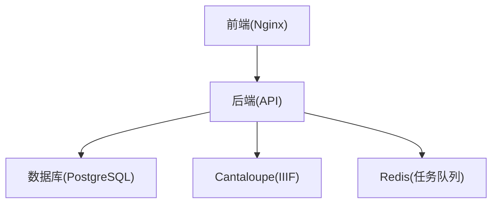
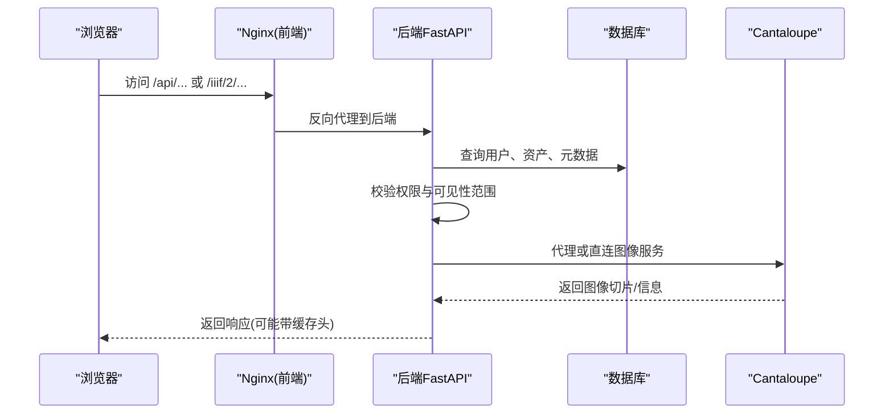
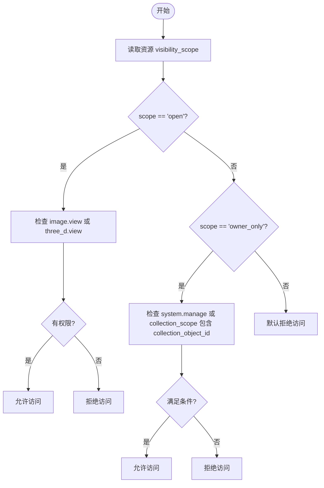
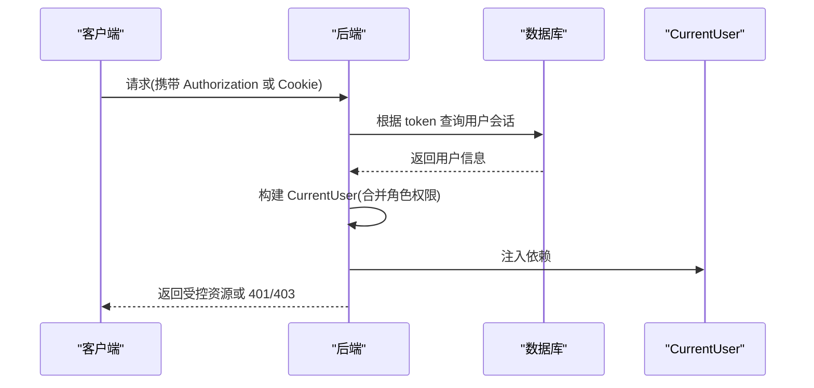
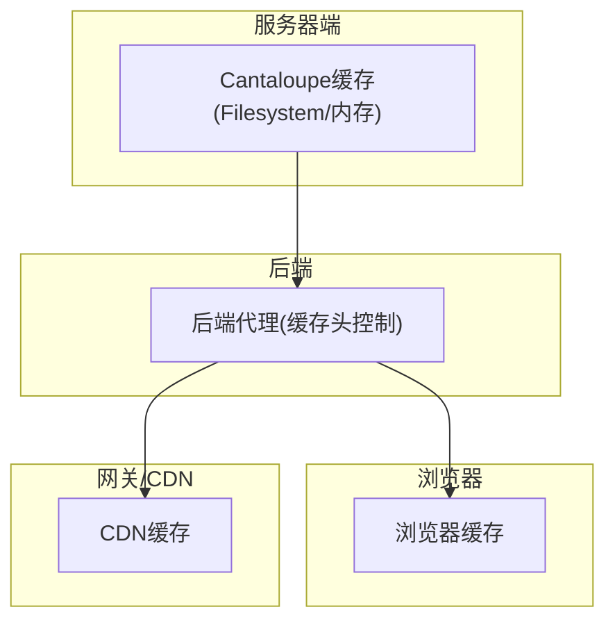
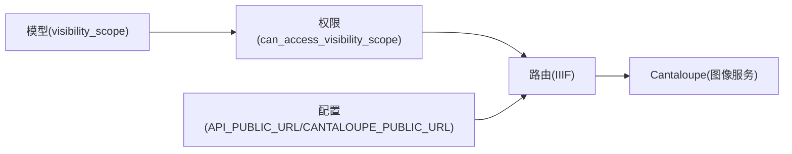

# 图像访问策略

<cite>
**本文引用的文件**
- [backend/app/models.py](file://backend/app/models.py)
- [backend/app/permissions.py](file://backend/app/permissions.py)
- [backend/app/services/image_record_validation.py](file://backend/app/services/image_record_validation.py)
- [backend/app/routers/image_records.py](file://backend/app/routers/image_records.py)
- [backend/app/services/iiif_access.py](file://backend/app/services/iiif_access.py)
- [backend/app/routers/iiif.py](file://backend/app/routers/iiif.py)
- [backend/app/config.py](file://backend/app/config.py)
- [backend/app/services/auth.py](file://backend/app/services/auth.py)
- [frontend/nginx.conf](file://frontend/nginx.conf)
- [cantaloupe.properties](file://cantaloupe.properties)
- [docs/02-架构设计/AUTH_AND_IIIF_INTEGRATION_PLAN.md](file://docs/02-架构设计/AUTH_AND_IIIF_INTEGRATION_PLAN.md)
- [docs/03-产品与流程/IMAGE_DERIVATIVE_POLICY.md](file://docs/03-产品与流程/IMAGE_DERIVATIVE_POLICY.md)
- [docs/05-部署与运维/ENVIRONMENT_VARIABLES.md](file://docs/05-部署与运维/ENVIRONMENT_VARIABLES.md)
</cite>

## 目录
1. [简介](#简介)
2. [项目结构](#项目结构)
3. [核心组件](#核心组件)
4. [架构总览](#架构总览)
5. [详细组件分析](#详细组件分析)
6. [依赖分析](#依赖分析)
7. [性能考虑](#性能考虑)
8. [故障排查指南](#故障排查指南)
9. [结论](#结论)
10. [附录](#附录)

## 简介
本文件面向 MDAMS 原型项目的图像访问策略，聚焦于“基于可见性范围的权限控制机制”。围绕 visibility_scope 字段的使用、权限验证流程、访问限制策略，以及 JWT 会话令牌处理、角色权限检查、菜单权限控制等，给出系统化的说明。同时覆盖图像访问的多层级缓存策略（CDN 缓存、浏览器缓存、服务器端缓存）、访问频率限制与防滥用措施（速率限制、IP 白名单、访问日志）、安全策略（CORS 配置、HTTPS 强制、XSS 防护、CSRF 保护）等，并提供配置示例与最佳实践建议。

## 项目结构
后端采用 FastAPI + SQLAlchemy，权限与认证集中在 permissions.py 与 services/auth.py；图像访问通过 IIIF 链路由后端路由与服务协调，结合 Cantaloupe 提供的图像服务。前端通过 Nginx 作为反向代理，统一暴露 /api 与 /iiif/2 两条路径。

**图表来源**
- [frontend/nginx.conf:1-33](file://frontend/nginx.conf#L1-L33)
- [backend/app/config.py:42-46](file://backend/app/config.py#L42-L46)

**章节来源**
- [frontend/nginx.conf:1-33](file://frontend/nginx.conf#L1-L33)
- [backend/app/config.py:42-46](file://backend/app/config.py#L42-L46)

## 核心组件
- 权限与角色体系：定义角色到权限映射，提供依赖注入的 CurrentUser，支持 require_permission 与 require_any_permission 的装饰器式权限校验。
- 可见性范围控制：通过 can_access_visibility_scope 结合 visibility_scope 与 collection_scope，判定资源对当前用户的可见性。
- IIIF 访问链路：后端生成 Manifest 并在访问切片时进行权限校验；图像服务地址目前由配置决定，建议逐步统一到受控代理路径。
- 缓存与派生：基于 IMAGE_DERIVATIVE_POLICY 的推荐策略，结合 IIIF 派生文件与 Cantaloupe 缓存，形成多层级缓存。
- 安全与部署：Nginx 代理、Cantaloupe CORS 配置、环境变量与部署文档支撑整体安全与性能。

**章节来源**
- [backend/app/permissions.py:17-94](file://backend/app/permissions.py#L17-L94)
- [backend/app/permissions.py:239-254](file://backend/app/permissions.py#L239-L254)
- [backend/app/routers/iiif.py:138-303](file://backend/app/routers/iiif.py#L138-L303)
- [docs/03-产品与流程/IMAGE_DERIVATIVE_POLICY.md:1-26](file://docs/03-产品与流程/IMAGE_DERIVATIVE_POLICY.md#L1-L26)
- [cantaloupe.properties:138-147](file://cantaloupe.properties#L138-L147)

## 架构总览
下图展示从浏览器到后端、再到 Cantaloupe 的完整访问链路，以及权限与可见性范围的判定位置。

**图表来源**
- [frontend/nginx.conf:10-31](file://frontend/nginx.conf#L10-L31)
- [backend/app/routers/iiif.py:257-303](file://backend/app/routers/iiif.py#L257-L303)
- [backend/app/permissions.py:239-254](file://backend/app/permissions.py#L239-L254)

## 详细组件分析

### 基于可见性范围的权限控制
- visibility_scope 字段：在资产与图像记录模型中均存在，支持 "open" 与 "owner_only" 两种策略。
- 可见性判定逻辑：
  - open：要求用户具备 image.view 或 three_d.view 权限之一；
  - owner_only：除 system.manage 特权外，需 collection_object_id 属于当前用户 collection_scope；
  - 该逻辑在 can_access_visibility_scope 中集中实现，贯穿路由与服务层。
- 路由层应用：IIIF 路由在生成 Manifest 与代理图像服务前调用 _assert_asset_visible，从而确保访问入口受控。

**图表来源**
- [backend/app/permissions.py:239-254](file://backend/app/permissions.py#L239-L254)
- [backend/app/routers/iiif.py:57-64](file://backend/app/routers/iiif.py#L57-L64)

**章节来源**
- [backend/app/models.py:14-16](file://backend/app/models.py#L14-L16)
- [backend/app/models.py:154-156](file://backend/app/models.py#L154-L156)
- [backend/app/permissions.py:239-254](file://backend/app/permissions.py#L239-L254)
- [backend/app/routers/iiif.py:57-64](file://backend/app/routers/iiif.py#L57-L64)

### 用户身份验证与授权机制
- 会话令牌：后端通过 session token 解析当前用户，支持 Authorization Bearer 与 Cookie(mdams.session) 两种方式。
- 角色与权限：通过 ROLE_PERMISSIONS 映射角色到权限集合，CurrentUser 统一承载用户标识、角色、权限与 collection_scope。
- 路由保护：require_permission 与 require_any_permission 装饰器在路由层强制执行权限校验。
- 菜单权限控制：前端根据用户权限裁剪菜单项，后端亦在接口层实施保护。

**图表来源**
- [backend/app/permissions.py:179-204](file://backend/app/permissions.py#L179-L204)
- [backend/app/services/auth.py:115-126](file://backend/app/services/auth.py#L115-L126)

**章节来源**
- [backend/app/permissions.py:17-94](file://backend/app/permissions.py#L17-L94)
- [backend/app/permissions.py:179-204](file://backend/app/permissions.py#L179-L204)
- [backend/app/services/auth.py:115-126](file://backend/app/services/auth.py#L115-L126)
- [docs/02-架构设计/AUTH_AND_IIIF_INTEGRATION_PLAN.md:16-41](file://docs/02-架构设计/AUTH_AND_IIIF_INTEGRATION_PLAN.md#L16-L41)

### 图像访问的缓存策略
- 服务器端缓存(Cantaloupe)：通过 filesystem cache 与内存缓存配置，提升 IIIF 切片读取性能；可按需调整 TTL。
- 浏览器缓存：后端在代理 IIIF 图像服务时设置 Cache-Control(no-store) 以避免缓存不稳定状态；生产环境可结合 ETag/Last-Modified 实现更精细缓存。
- CDN 缓存：建议在网关层引入 CDN 对静态资源与 IIIF 切片进行缓存，结合签名 URL 与过期时间控制访问。
- 派生文件：依据 IMAGE_DERIVATIVE_POLICY，对大尺寸 TIFF/PSB 生成金字塔瓦片派生文件，降低首次请求成本。

**图表来源**
- [cantaloupe.properties:112-116](file://cantaloupe.properties#L112-L116)
- [backend/app/routers/iiif.py:297-302](file://backend/app/routers/iiif.py#L297-L302)
- [docs/03-产品与流程/IMAGE_DERIVATIVE_POLICY.md:11-26](file://docs/03-产品与流程/IMAGE_DERIVATIVE_POLICY.md#L11-L26)

**章节来源**
- [cantaloupe.properties:112-116](file://cantaloupe.properties#L112-L116)
- [backend/app/routers/iiif.py:297-302](file://backend/app/routers/iiif.py#L297-L302)
- [docs/03-产品与流程/IMAGE_DERIVATIVE_POLICY.md:1-26](file://docs/03-产品与流程/IMAGE_DERIVATIVE_POLICY.md#L1-L26)

### 访问频率限制与防滥用措施
- 速率限制：建议在 Nginx 或网关层配置基于 IP 的限速规则，防止恶意爬取与高并发冲击。
- IP 白名单：对特定来源 IP 开放 /iiif/2 访问，减少不必要的暴露面。
- 访问日志：开启 Nginx 与后端访问日志，记录请求路径、用户标识、来源 IP、UA 等，便于审计与异常追踪。
- 会话与令牌：严格管理 session token 生命周期，超时后自动失效，降低长期有效令牌的风险。

**章节来源**
- [frontend/nginx.conf:10-31](file://frontend/nginx.conf#L10-L31)
- [backend/app/services/auth.py:102-112](file://backend/app/services/auth.py#L102-L112)

### 安全策略
- CORS 配置：Cantaloupe 已启用 CORS，允许跨域访问，满足前端查看器需求；建议在生产环境限定允许来源与凭证策略。
- HTTPS 强制：建议在 Nginx 层启用 HTTPS，将 HTTP 重定向至 HTTPS，保障传输安全。
- XSS 防护：后端渲染内容需进行输出编码；前端避免 innerHTML 动态拼接不受控数据。
- CSRF 保护：后端接口主要为无状态 API，建议在前端表单场景使用 SameSite Cookie 与 CSRF Token 双重防护。

**章节来源**
- [cantaloupe.properties:138-147](file://cantaloupe.properties#L138-L147)
- [frontend/nginx.conf:1-33](file://frontend/nginx.conf#L1-L33)

### 配置示例与最佳实践
- 环境变量：API_PUBLIC_URL 与 CANTALOUPE_PUBLIC_URL 用于生成公开链接与图像服务地址，建议本地开发保持一致的代理口径。
- 本地推荐值：API_PUBLIC_URL=http://localhost:3000/api，CANTALOUPE_PUBLIC_URL=http://localhost:3000/iiif/2。
- 逐步收口：将 Manifest 中的图像服务 id 切换为后端受控代理路径，使 IIIF 切片与 info.json 也统一经过应用权限入口。

**章节来源**
- [docs/05-部署与运维/ENVIRONMENT_VARIABLES.md:26-31](file://docs/05-部署与运维/ENVIRONMENT_VARIABLES.md#L26-L31)
- [docs/02-架构设计/AUTH_AND_IIIF_INTEGRATION_PLAN.md:101-114](file://docs/02-架构设计/AUTH_AND_IIIF_INTEGRATION_PLAN.md#L101-L114)
- [docs/02-架构设计/AUTH_AND_IIIF_INTEGRATION_PLAN.md:115-123](file://docs/02-架构设计/AUTH_AND_IIIF_INTEGRATION_PLAN.md#L115-L123)

## 依赖分析
- 模型层：Asset 与 ImageRecord 均包含 visibility_scope 字段，用于统一的可见性判定。
- 权限层：can_access_visibility_scope 依赖 CurrentUser 的权限与 collection_scope。
- IIIF 层：后端路由在访问 Manifest 与代理图像服务前进行权限校验；图像服务地址由配置决定，建议统一到受控代理路径。
- 配置层：API_PUBLIC_URL 与 CANTALOUPE_PUBLIC_URL 影响公开链接生成；CORS 由 Cantaloupe 配置控制。

**图表来源**
- [backend/app/models.py:14-16](file://backend/app/models.py#L14-L16)
- [backend/app/models.py:154-156](file://backend/app/models.py#L154-L156)
- [backend/app/permissions.py:239-254](file://backend/app/permissions.py#L239-L254)
- [backend/app/routers/iiif.py:138-303](file://backend/app/routers/iiif.py#L138-L303)
- [backend/app/config.py:45-46](file://backend/app/config.py#L45-L46)

**章节来源**
- [backend/app/models.py:14-16](file://backend/app/models.py#L14-L16)
- [backend/app/models.py:154-156](file://backend/app/models.py#L154-L156)
- [backend/app/permissions.py:239-254](file://backend/app/permissions.py#L239-L254)
- [backend/app/routers/iiif.py:138-303](file://backend/app/routers/iiif.py#L138-L303)
- [backend/app/config.py:45-46](file://backend/app/config.py#L45-L46)

## 性能考虑
- 派生文件生成：对大文件生成金字塔瓦片派生，显著降低首次请求与高分辨率缩放的成本。
- 缓存策略：合理设置 Cantaloupe 缓存 TTL 与内存缓存开关，平衡内存占用与命中率。
- 代理与网络：Nginx 作为统一入口，减少后端直连带来的负载压力；CDN 加速静态资源与切片。
- 会话与令牌：缩短会话有效期，降低无效令牌占用与重放风险。

**章节来源**
- [docs/03-产品与流程/IMAGE_DERIVATIVE_POLICY.md:11-26](file://docs/03-产品与流程/IMAGE_DERIVATIVE_POLICY.md#L11-L26)
- [cantaloupe.properties:112-116](file://cantaloupe.properties#L112-L116)
- [frontend/nginx.conf:10-31](file://frontend/nginx.conf#L10-L31)

## 故障排查指南
- Manifest 可见性错误：确认资源 visibility_scope 与当前用户权限、collection_scope 是否匹配。
- IIIF 切片不可访问：检查后端代理路径与图像服务地址配置，确保 API_PUBLIC_URL 与 CANTALOUPE_PUBLIC_URL 一致。
- CORS 问题：检查 Cantaloupe CORS 配置，必要时限制允许来源与凭证策略。
- 缓存异常：临时关闭 Cantaloupe 缓存或调整 TTL，定位缓存相关问题。
- 会话失效：确认 session token 是否过期，必要时重新登录。

**章节来源**
- [backend/app/routers/iiif.py:57-64](file://backend/app/routers/iiif.py#L57-L64)
- [backend/app/routers/iiif.py:138-303](file://backend/app/routers/iiif.py#L138-L303)
- [cantaloupe.properties:138-147](file://cantaloupe.properties#L138-L147)
- [backend/app/services/auth.py:115-126](file://backend/app/services/auth.py#L115-L126)

## 结论
MDAMS 在当前阶段已完成“Manifest 级别”的认证收口与资源可见性控制，但 IIIF 切片与 info.json 的访问尚未完全统一到应用认证入口。建议逐步将图像服务地址切换为后端受控代理路径，实现“Manifest 与切片统一受控”的完整闭环；同时完善速率限制、CDN 缓存与安全配置，确保在性能与安全之间取得平衡。

## 附录
- 相关文档与配置参考：
  - 认证与 IIIF 访问控制规划
  - 环境变量说明
  - 图像派生策略

**章节来源**
- [docs/02-架构设计/AUTH_AND_IIIF_INTEGRATION_PLAN.md:1-142](file://docs/02-架构设计/AUTH_AND_IIIF_INTEGRATION_PLAN.md#L1-L142)
- [docs/05-部署与运维/ENVIRONMENT_VARIABLES.md:1-86](file://docs/05-部署与运维/ENVIRONMENT_VARIABLES.md#L1-L86)
- [docs/03-产品与流程/IMAGE_DERIVATIVE_POLICY.md:1-26](file://docs/03-产品与流程/IMAGE_DERIVATIVE_POLICY.md#L1-L26)