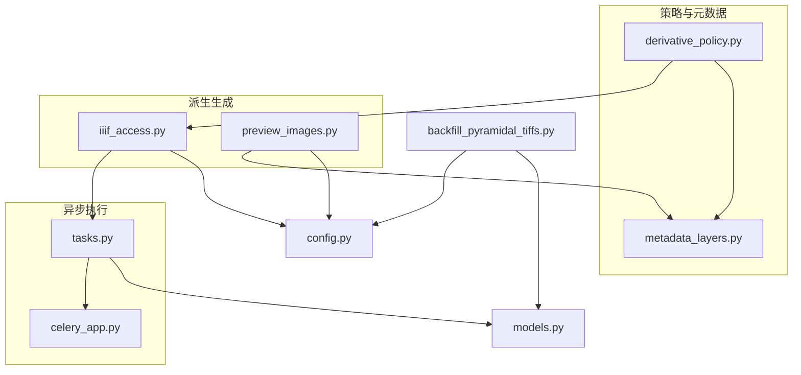
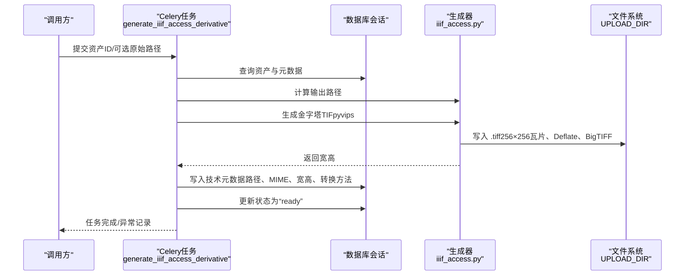
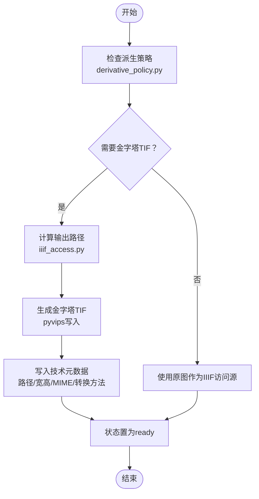
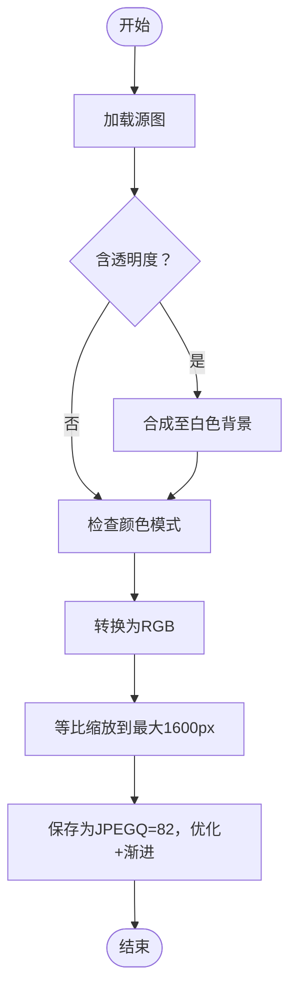
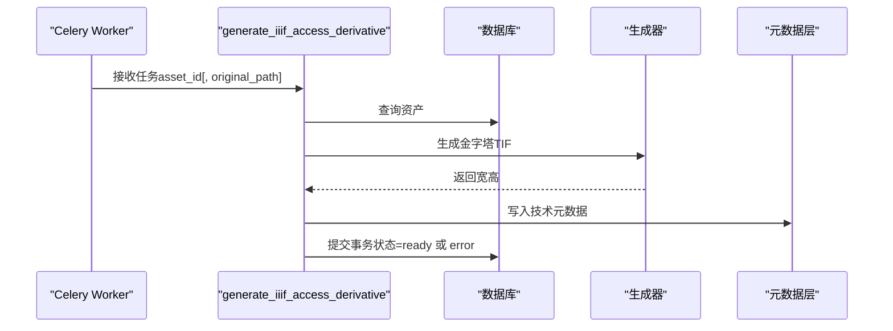
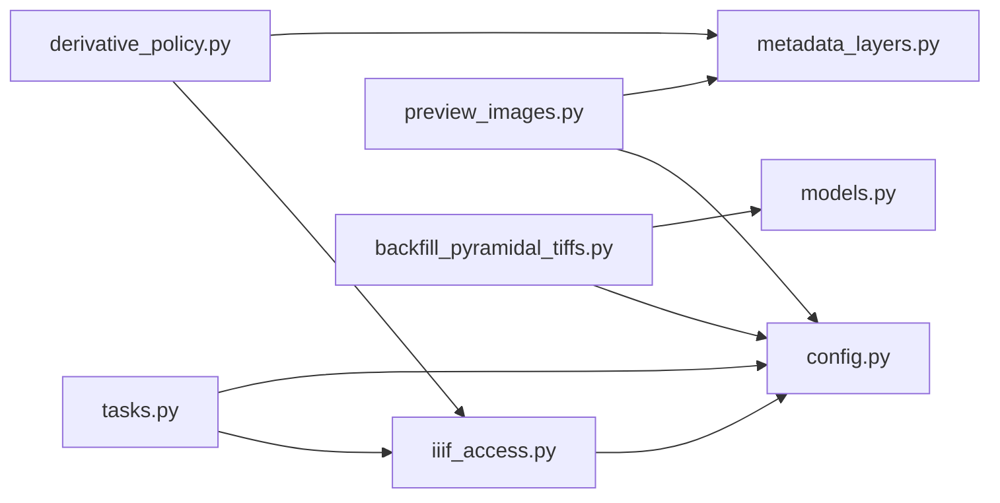

# 派生文件生成

<cite>
**本文引用的文件**
- [backend/app/services/derivative_policy.py](file://backend/app/services/derivative_policy.py)
- [backend/app/services/iiif_access.py](file://backend/app/services/iiif_access.py)
- [backend/app/services/preview_images.py](file://backend/app/services/preview_images.py)
- [backend/app/services/metadata_layers.py](file://backend/app/services/metadata_layers.py)
- [backend/app/tasks.py](file://backend/app/tasks.py)
- [backend/app/celery_app.py](file://backend/app/celery_app.py)
- [backend/app/config.py](file://backend/app/config.py)
- [backend/app/models.py](file://backend/app/models.py)
- [backend/scripts/backfill_pyramidal_tiffs.py](file://backend/scripts/backfill_pyramidal_tiffs.py)
- [docs/03-产品与流程/IMAGE_DERIVATIVE_POLICY.md](file://docs/03-产品与流程/IMAGE_DERIVATIVE_POLICY.md)
</cite>

## 目录
1. [简介](#简介)
2. [项目结构](#项目结构)
3. [核心组件](#核心组件)
4. [架构总览](#架构总览)
5. [详细组件分析](#详细组件分析)
6. [依赖分析](#依赖分析)
7. [性能考虑](#性能考虑)
8. [故障排查指南](#故障排查指南)
9. [结论](#结论)
10. [附录](#附录)

## 简介
本文件面向MDAMS原型项目的“派生文件生成”能力，系统性阐述多分辨率金字塔的生成机制、格式转换策略、尺寸调整算法、派生文件存储策略、异步生成流程、生命周期管理以及性能优化与监控建议。目标是帮助开发者与运营人员在不直接阅读源码的情况下，也能准确理解并维护该子系统。

## 项目结构
围绕派生文件生成的关键模块与脚本如下：
- 决策与策略：derivative_policy.py（根据来源格式、大小、像素数推导推荐策略）
- IIIF访问派生：iiif_access.py（生成金字塔TIF、输出路径、元数据写入、就绪判定）
- 预览图生成：preview_images.py（等比缩放、透明度处理、JPEG质量压缩）
- 元数据层：metadata_layers.py（统一技术元数据结构、字段定义、就绪判定辅助）
- 异步任务：tasks.py（Celery任务封装、错误标记、状态更新）
- 任务调度：celery_app.py（Redis队列、结果过期）
- 配置：config.py（上传目录、Redis、公共URL等）
- 数据模型：models.py（资产状态、处理消息、元数据JSON字段）
- 批量补建：backfill_pyramidal_tiffs.py（批量生成金字塔TIF、回填元数据）
- 政策文档：IMAGE_DERIVATIVE_POLICY.md（策略表与说明）

图表来源
- [backend/app/services/derivative_policy.py:72-141](file://backend/app/services/derivative_policy.py#L72-L141)
- [backend/app/services/iiif_access.py:182-259](file://backend/app/services/iiif_access.py#L182-L259)
- [backend/app/services/preview_images.py:23-104](file://backend/app/services/preview_images.py#L23-L104)
- [backend/app/tasks.py:151-182](file://backend/app/tasks.py#L151-L182)
- [backend/app/celery_app.py:5-15](file://backend/app/celery_app.py#L5-L15)
- [backend/app/config.py:42-46](file://backend/app/config.py#L42-L46)
- [backend/app/models.py:6-26](file://backend/app/models.py#L6-L26)
- [backend/scripts/backfill_pyramidal_tiffs.py:76-195](file://backend/scripts/backfill_pyramidal_tiffs.py#L76-L195)

章节来源
- [backend/app/services/derivative_policy.py:1-168](file://backend/app/services/derivative_policy.py#L1-L168)
- [backend/app/services/iiif_access.py:1-259](file://backend/app/services/iiif_access.py#L1-L259)
- [backend/app/services/preview_images.py:1-105](file://backend/app/services/preview_images.py#L1-L105)
- [backend/app/services/metadata_layers.py:1-200](file://backend/app/services/metadata_layers.py#L1-L200)
- [backend/app/tasks.py:1-262](file://backend/app/tasks.py#L1-L262)
- [backend/app/celery_app.py:1-19](file://backend/app/celery_app.py#L1-L19)
- [backend/app/config.py:1-72](file://backend/app/config.py#L1-L72)
- [backend/app/models.py:1-200](file://backend/app/models.py#L1-L200)
- [backend/scripts/backfill_pyramidal_tiffs.py:1-199](file://backend/scripts/backfill_pyramidal_tiffs.py#L1-L199)
- [docs/03-产品与流程/IMAGE_DERIVATIVE_POLICY.md:1-26](file://docs/03-产品与流程/IMAGE_DERIVATIVE_POLICY.md#L1-L26)

## 核心组件
- 派生策略决策器：基于文件名后缀、MIME类型、文件大小、宽高像素，给出“是否需要金字塔TIF”“是否需要访问级JPEG”“是否保留原图”等策略建议，并写入技术元数据。
- IIIF访问派生生成器：使用pyvips生成金字塔TIF（瓦片256×256、Deflate压缩、BigTIFF），记录输出路径、宽高、MIME类型、转换方法等元数据，驱动资产进入“就绪”状态。
- 预览图生成器：优先使用pyvips进行等比缩放与透明度处理，失败时回退到Pillow；统一输出JPEG，控制最大宽度与质量。
- 元数据层：统一的core/management/technical/raw_metadata分层结构，提供就绪判定、原始文件信息、派生文件信息等。
- 异步任务：Celery任务封装生成流程，异常时标记资产状态与错误信息，支持重试与结果过期。
- 批量补建：扫描历史资产，识别大体积TIFF/PSB候选，批量生成金字塔TIF并回填元数据。

章节来源
- [backend/app/services/derivative_policy.py:72-168](file://backend/app/services/derivative_policy.py#L72-L168)
- [backend/app/services/iiif_access.py:182-259](file://backend/app/services/iiif_access.py#L182-L259)
- [backend/app/services/preview_images.py:85-104](file://backend/app/services/preview_images.py#L85-L104)
- [backend/app/services/metadata_layers.py:48-86](file://backend/app/services/metadata_layers.py#L48-L86)
- [backend/app/tasks.py:151-182](file://backend/app/tasks.py#L151-L182)
- [backend/scripts/backfill_pyramidal_tiffs.py:76-195](file://backend/scripts/backfill_pyramidal_tiffs.py#L76-L195)

## 架构总览
下图展示从策略决策到异步生成、元数据写入与状态更新的全链路：

图表来源
- [backend/app/tasks.py:151-182](file://backend/app/tasks.py#L151-L182)
- [backend/app/services/iiif_access.py:182-259](file://backend/app/services/iiif_access.py#L182-L259)
- [backend/app/config.py:42-46](file://backend/app/config.py#L42-L46)

## 详细组件分析

### 多分辨率金字塔生成机制
- 生成入口与触发
  - 通过Celery任务触发，任务读取资产元数据，计算输出路径，调用生成器。
  - 生成器使用pyvips从源文件构建图像对象，按需写入金字塔TIF。
- 金字塔参数
  - 瓦片尺寸固定为256×256，压缩方式为Deflate，启用BigTIFF以支持超大文件。
  - 输出包含多级金字塔，便于IIIF服务端按需加载。
- 输出路径与命名
  - 输出路径位于上传根目录下的“derivatives/asset-{id}/iiif-access.pyramidal.tiff”，确保按资产隔离。
- 宽高回填
  - 生成完成后返回宽高，写入技术元数据，供前端与IIIF服务使用。

图表来源
- [backend/app/services/derivative_policy.py:72-141](file://backend/app/services/derivative_policy.py#L72-L141)
- [backend/app/services/iiif_access.py:182-259](file://backend/app/services/iiif_access.py#L182-L259)
- [backend/app/tasks.py:151-182](file://backend/app/tasks.py#L151-L182)

章节来源
- [backend/app/services/iiif_access.py:182-259](file://backend/app/services/iiif_access.py#L182-L259)
- [backend/app/tasks.py:151-182](file://backend/app/tasks.py#L151-L182)

### 金字塔层级计算与分辨率递减
- 层级计算
  - 由pyvips自动根据输入图像尺寸生成多级金字塔，保证每级尺寸为上一级的一半，直至达到1×1或更小。
- 分辨率递减
  - 金字塔的最高分辨率即为原图分辨率，逐级向下，满足不同缩放需求。
- 瓦片化与缓存
  - 256×256瓦片有利于IIIF服务端按需加载，减少内存占用与首屏延迟。

章节来源
- [backend/app/services/iiif_access.py:187-199](file://backend/app/services/iiif_access.py#L187-L199)

### 文件命名规则与路径组织
- 路径组织
  - 顶层目录：UPLOAD_DIR
  - 子目录：derivatives/asset-{asset_id}
  - 文件名：iiif-access.pyramidal.tiff
- 命名规范
  - 使用“asset-{id}”隔离不同资产，避免冲突
  - 文件名固定，便于前端与IIIF服务解析
- 版本管理
  - 采用技术元数据中的“conversion_method”记录转换来源，便于审计与回溯

章节来源
- [backend/app/services/iiif_access.py:182-184](file://backend/app/services/iiif_access.py#L182-L184)
- [backend/app/config.py:42-46](file://backend/app/config.py#L42-L46)

### 格式转换策略（JPEG、PNG、WEBP、TIFF）
- 策略依据
  - 来源格式家族（TIFF/PSB、JPEG、其他）与阈值（文件大小、像素数）决定是否生成金字塔TIF或访问级JPEG，或直接保留原图。
- 推荐策略
  - TIFF/PSB：大文件（≥50MB或≥25MP）建议生成金字塔TIF
  - JPEG：极大文件（≥120MB或≥60MP）可生成访问级JPEG，否则保留原图
  - 其他格式：默认保留原图
- 实际转换
  - 本仓库中IIIF访问派生统一生成金字塔TIF；预览图生成统一输出JPEG（PNG/WEBP等在预览阶段未见专门转换逻辑）

章节来源
- [backend/app/services/derivative_policy.py:72-141](file://backend/app/services/derivative_policy.py#L72-L141)
- [docs/03-产品与流程/IMAGE_DERIVATIVE_POLICY.md:11-26](file://docs/03-产品与流程/IMAGE_DERIVATIVE_POLICY.md#L11-L26)
- [backend/app/services/preview_images.py:71-82](file://backend/app/services/preview_images.py#L71-L82)

### 尺寸调整算法（等比缩放、最大尺寸限制、质量压缩）
- 等比缩放与最大尺寸限制
  - 预览图最大宽度为1600像素，按原图宽高比例缩放，确保不超过目标尺寸
- 透明度处理
  - 若源图为带Alpha通道或存在透明度信息，先合成至白色背景，再转为RGB
- 质量压缩
  - JPEG质量固定为82，开启优化与渐进式编码，兼顾体积与加载体验
- 回退策略
  - 优先使用pyvips；若失败则回退到Pillow处理

图表来源
- [backend/app/services/preview_images.py:71-82](file://backend/app/services/preview_images.py#L71-L82)
- [backend/app/services/preview_images.py:52-68](file://backend/app/services/preview_images.py#L52-L68)

章节来源
- [backend/app/services/preview_images.py:52-104](file://backend/app/services/preview_images.py#L52-L104)

### 派生文件存储策略
- 存储位置
  - 上传根目录下“derivatives/asset-{id}/iiif-access.pyramidal.tiff”
- 命名规范
  - 固定文件名，资产隔离目录
- 元数据写入
  - 技术元数据包含：原始文件路径/名称/大小/MIME、派生文件路径/名称/MIME、宽高、转换方法、阈值信息等
- 状态与消息
  - 成功：状态置为“ready”，处理消息提示可用
  - 失败：状态置为“error”，记录错误信息

章节来源
- [backend/app/services/iiif_access.py:182-259](file://backend/app/services/iiif_access.py#L182-L259)
- [backend/app/models.py:6-26](file://backend/app/models.py#L6-L26)

### 异步生成流程（Celery任务队列、状态跟踪、错误处理）
- 任务定义
  - generate_iiif_access_derivative：接收资产ID与可选原始路径，生成IIIF访问派生
  - convert_psb_to_bigtiff：委托上述任务
- 任务执行
  - 任务内查询资产、校验源文件、计算输出路径、调用生成器、写入元数据、提交事务
- 错误处理
  - 捕获异常，标记资产状态为“error”，写入错误信息，提交事务
- 状态跟踪
  - 任务结果存储于Redis（broker与backend相同），默认结果过期时间为3600秒

图表来源
- [backend/app/tasks.py:151-182](file://backend/app/tasks.py#L151-L182)
- [backend/app/celery_app.py:5-15](file://backend/app/celery_app.py#L5-L15)

章节来源
- [backend/app/tasks.py:151-182](file://backend/app/tasks.py#L151-L182)
- [backend/app/celery_app.py:1-19](file://backend/app/celery_app.py#L1-L19)

### 生命周期管理（生成触发、过期清理、空间回收）
- 触发条件
  - 策略决策为“生成金字塔TIF”或“生成访问级JPEG”时触发
  - 也可通过批量脚本扫描历史资产并生成
- 过期与清理
  - 任务结果默认过期（Redis），可通过配置调整
  - 未使用的派生文件可定期清理，但需确保不影响现有IIIF访问
- 空间回收
  - 生成成功后，原图仍保留；派生文件作为新的IIIF访问源
  - 可通过回填脚本统一替换资产文件指针并回填元数据

章节来源
- [backend/app/services/derivative_policy.py:72-141](file://backend/app/services/derivative_policy.py#L72-L141)
- [backend/scripts/backfill_pyramidal_tiffs.py:76-195](file://backend/scripts/backfill_pyramidal_tiffs.py#L76-L195)
- [backend/app/celery_app.py:13-15](file://backend/app/celery_app.py#L13-L15)

## 依赖分析
- 组件耦合
  - 任务依赖生成器与配置；生成器依赖配置中的上传目录；策略依赖元数据层字段
- 外部依赖
  - Redis用于Celery队列与结果存储
  - pyvips用于高性能图像处理
  - Pillow用于预览图回退路径
- 潜在循环依赖
  - 未发现直接循环导入；各模块职责清晰

图表来源
- [backend/app/tasks.py:1-262](file://backend/app/tasks.py#L1-L262)
- [backend/app/services/iiif_access.py:1-259](file://backend/app/services/iiif_access.py#L1-L259)
- [backend/app/services/derivative_policy.py:1-168](file://backend/app/services/derivative_policy.py#L1-L168)
- [backend/app/services/metadata_layers.py:1-200](file://backend/app/services/metadata_layers.py#L1-L200)
- [backend/app/services/preview_images.py:1-105](file://backend/app/services/preview_images.py#L1-L105)
- [backend/scripts/backfill_pyramidal_tiffs.py:1-199](file://backend/scripts/backfill_pyramidal_tiffs.py#L1-L199)
- [backend/app/config.py:1-72](file://backend/app/config.py#L1-L72)
- [backend/app/models.py:1-200](file://backend/app/models.py#L1-L200)

章节来源
- [backend/app/tasks.py:1-262](file://backend/app/tasks.py#L1-L262)
- [backend/app/services/iiif_access.py:1-259](file://backend/app/services/iiif_access.py#L1-L259)
- [backend/app/services/derivative_policy.py:1-168](file://backend/app/services/derivative_policy.py#L1-L168)
- [backend/app/services/metadata_layers.py:1-200](file://backend/app/services/metadata_layers.py#L1-L200)
- [backend/app/services/preview_images.py:1-105](file://backend/app/services/preview_images.py#L1-L105)
- [backend/scripts/backfill_pyramidal_tiffs.py:1-199](file://backend/scripts/backfill_pyramidal_tiffs.py#L1-L199)
- [backend/app/config.py:1-72](file://backend/app/config.py#L1-L72)
- [backend/app/models.py:1-200](file://backend/app/models.py#L1-L200)

## 性能考虑
- 生成性能
  - pyvips流水线式读取与写入，顺序访问，适合大图；Deflate压缩与瓦片化降低I/O与内存峰值
- 缩放与预览
  - 预览图最大宽度1600，JPEG质量82，兼顾体积与加载速度
- 并发与队列
  - Celery使用Redis，合理设置并发worker数量与队列长度，避免阻塞
- 监控指标建议
  - 任务执行时延、失败率、队列积压、生成耗时分布、磁盘使用率、Redis连接数
  - 资产状态变化速率、派生文件命中率（IIIF访问命中/未命中）

## 故障排查指南
- 常见问题
  - 源文件缺失：任务会抛出异常并标记为“error”，检查原始文件路径与存在性
  - pyvips生成失败：回退到Pillow；若仍失败，检查磁盘权限与内存
  - 预览图为空：确认源图可读、路径存在、输出目录可写
- 定位手段
  - 查看资产处理消息与技术元数据中的“error_message”“conversion_method”
  - 检查Redis队列与任务日志
- 修复建议
  - 补充缺失的原始文件或修正元数据
  - 调整任务并发或增加资源
  - 对历史资产运行批量补建脚本

章节来源
- [backend/app/tasks.py:23-44](file://backend/app/tasks.py#L23-L44)
- [backend/app/services/preview_images.py:96-102](file://backend/app/services/preview_images.py#L96-L102)

## 结论
本方案以“策略驱动+异步生成+元数据治理”的方式，实现了对大体积TIFF/PSB与超大JPEG的高效派生与稳定交付。金字塔TIF确保IIIF服务端的高性能访问，预览图保障Web前端的快速浏览体验。通过统一的元数据层与状态机，系统具备良好的可观测性与可维护性。建议结合监控指标持续优化生成参数与资源配额，确保在高并发场景下的稳定性与吞吐量。

## 附录
- 关键阈值参考
  - TIFF/PSB：文件大小≥50MB或像素数≥25MP
  - JPEG：文件大小≥120MB或像素数≥60MP
- 输出约定
  - IIIF访问派生：金字塔TIF（256×256瓦片、Deflate压缩、BigTIFF）
  - 预览图：JPEG（最大1600px，质量82）