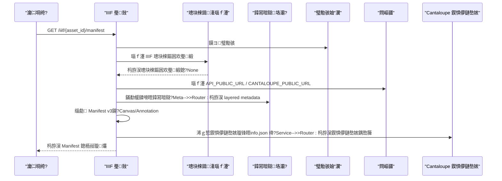
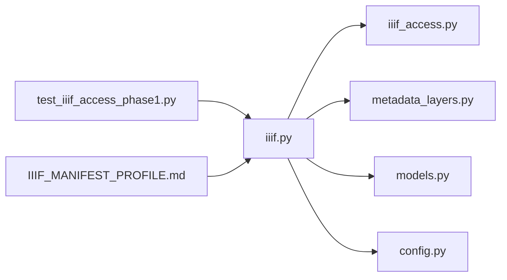

# 娓呭崟鐢熸垚

<cite>
**鏈枃寮曠敤鐨勬枃浠?*
- [backend/app/routers/iiif.py](file://backend/app/routers/iiif.py)
- [backend/app/services/iiif_access.py](file://backend/app/services/iiif_access.py)
- [backend/app/services/metadata_layers.py](file://backend/app/services/metadata_layers.py)
- [backend/app/models.py](file://backend/app/models.py)
- [backend/app/config.py](file://backend/app/config.py)
- [backend/scripts/generate_reference_manifests.py](file://backend/scripts/generate_reference_manifests.py)
- [docs/08-鐮旂┒/IIIF娓呭崟閰嶇疆璇存槑锛圛IIF_MANIFEST_PROFILE锛?md](file://docs/08-鐮旂┒/IIIF娓呭崟閰嶇疆璇存槑锛圛IIF_MANIFEST_PROFILE锛?md)
- [docs/08-鐮旂┒/IIIF娓呭崟鏍锋湰锛圛IIF_MANIFEST_SAMPLE锛?md](file://docs/08-鐮旂┒/IIIF娓呭崟鏍锋湰锛圛IIF_MANIFEST_SAMPLE锛?md)
- [backend/tests/test_iiif_access_phase1.py](file://backend/tests/test_iiif_access_phase1.py)
</cite>

## 鐩綍
1. [绠€浠媇(#绠€浠?
2. [椤圭洰缁撴瀯](#椤圭洰缁撴瀯)
3. [鏍稿績缁勪欢](#鏍稿績缁勪欢)
4. [鏋舵瀯鎬昏](#鏋舵瀯鎬昏)
5. [缁勪欢璇﹁В](#缁勪欢璇﹁В)
6. [渚濊禆鍏崇郴鍒嗘瀽](#渚濊禆鍏崇郴鍒嗘瀽)
7. [鎬ц兘鑰冮噺](#鎬ц兘鑰冮噺)
8. [鏁呴殰鎺掓煡鎸囧崡](#鏁呴殰鎺掓煡鎸囧崡)
9. [缁撹](#缁撹)
10. [闄勫綍](#闄勫綍)

## 绠€浠?鏈枃浠惰仛鐒?MDAMS 鍘熷瀷椤圭洰鐨?IIIF Manifest 娓呭崟鐢熸垚鑳藉姏锛岀郴缁熸⒊鐞嗗悗绔矾鐢便€佸厓鏁版嵁灞傘€佽闂壇鏈瓥鐣ヤ笌鍥惧儚鏈嶅姟浠ｇ悊鐨勫崗浣滄満鍒讹紝瑕嗙洊 Manifest v3 瑙勮寖鐨勫疄鐜拌鐐广€丆anvas/Annotation 鐨勬瀯寤烘柟寮忋€佺増鏈笌鏇存柊杈圭晫銆侀獙璇佷笌娴嬭瘯绛栫暐锛屼互鍙婄紦瀛樹笌鍒嗗彂寤鸿銆傜洰鏍囨槸甯姪璇昏€呭揩閫熺悊瑙ｂ€滀粠璧勪骇鍒版竻鍗曞啀鍒版煡鐪嬪櫒鈥濈殑瀹屾暣閾捐矾锛屽苟涓哄悗缁墿灞曪紙濡傛敞瑙ｇ敓鎬併€佸 Canvas/澶氬璞″彊浜嬶級鎻愪緵鍙傝€冦€?
## 椤圭洰缁撴瀯
涓庢竻鍗曠敓鎴愮洿鎺ョ浉鍏崇殑鍚庣妯″潡涓庢枃妗ｅ涓嬶細
- 璺敱灞傦細璐熻矗鎺ユ敹璇锋眰銆侀壌鏉冧笌 Manifest 鍔ㄦ€佺粍瑁?- 鏈嶅姟灞傦細璁块棶鍓湰瑙ｆ瀽銆佸厓鏁版嵁鍒嗗眰銆佸昂瀵告帹瀵笺€佹竻鍗曞厓鏁版嵁鏉＄洰鐢熸垚
- 鏁版嵁妯″瀷锛氳祫浜у疄浣撳強鍏剁姸鎬併€佸厓鏁版嵁瀛樺偍
- 閰嶇疆锛氬叕鍏?API 涓庡浘鍍忔湇鍔″湴鍧€瑙ｆ瀽
- 鍙傝€冩竻鍗曠敓鎴愯剼鏈細鎵归噺鐢熸垚鍙傝€冭祫婧愭竻鍗曪紙绂荤嚎/瀵煎叆闃舵锛?- 鏂囨。锛氭竻鍗曢厤缃鏄庝笌鏍锋湰锛岀晫瀹氬綋鍓嶇ǔ瀹氭敮鎸佽兘鍔涗笌杈圭晫
- 娴嬭瘯锛氭竻鍗曠敓鎴愩€佽闂壇鏈紭鍏堢瓥鐣ャ€?09 鍦烘櫙涓庡悗鍙版淳鐢熶换鍔?
```mermaid
graph TB
subgraph "鍚庣"
R["璺敱: iiif.py"]
S1["鏈嶅姟: iiif_access.py"]
S2["鏈嶅姟: metadata_layers.py"]
M["妯″瀷: models.py"]
C["閰嶇疆: config.py"]
end
subgraph "鍓嶇"
V["Mirador 鏌ョ湅鍣?]
end
subgraph "澶栭儴"
P["Cantaloupe 鍥惧儚鏈嶅姟"]
end
U["瀹㈡埛绔?] --> R
R --> S1
R --> S2
R --> M
R --> C
R --> P
V --> R
```

**鍥捐〃鏉ユ簮**
- [backend/app/routers/iiif.py:138-254](file://backend/app/routers/iiif.py#L138-L254)
- [backend/app/services/iiif_access.py:115-140](file://backend/app/services/iiif_access.py#L115-L140)
- [backend/app/services/metadata_layers.py:412-507](file://backend/app/services/metadata_layers.py#L412-L507)
- [backend/app/models.py:6-26](file://backend/app/models.py#L6-L26)
- [backend/app/config.py:42-46](file://backend/app/config.py#L42-L46)

**绔犺妭鏉ユ簮**
- [backend/app/routers/iiif.py:138-254](file://backend/app/routers/iiif.py#L138-L254)
- [backend/app/services/iiif_access.py:115-140](file://backend/app/services/iiif_access.py#L115-L140)
- [backend/app/services/metadata_layers.py:412-507](file://backend/app/services/metadata_layers.py#L412-L507)
- [backend/app/models.py:6-26](file://backend/app/models.py#L6-L26)
- [backend/app/config.py:42-46](file://backend/app/config.py#L42-L46)

## 鏍稿績缁勪欢
- 璺敱涓庢竻鍗曡閰嶏細鍔ㄦ€佺敓鎴?Manifest v3锛屽～鍏呬笂涓嬫枃銆佹爣璇嗐€佹爣绛俱€佹憳瑕併€佷富椤甸摼鎺ャ€佸厓鏁版嵁銆丆anvas/AnnotationPage/Annotation 缁撴瀯锛岀粦瀹?Cantaloupe 鍥惧儚鏈嶅姟銆?- 璁块棶鍓湰瑙ｆ瀽锛氫紭鍏堜娇鐢?IIIF access 鍓湰锛涜嫢鏃犲壇鏈笖婊¤冻绛栫暐鍒欏洖閫€鍒板師濮嬫枃浠讹紱鍚﹀垯杩斿洖 409銆?- 鍏冩暟鎹垎灞傦細灏?core/management/technical/profile/raw_metadata 鍒嗗眰锛屾寜闇€娓叉煋涓烘竻鍗曞厓鏁版嵁鏉＄洰銆?- 灏哄涓庢爣绛撅細浠?layered metadata 鎺ㄥ瀹介珮锛岀己澶辨椂浣跨敤鍏滃簳鍊硷紱鏍囩鏀寔澶氳瑷€鏈湴鍖栥€?- 閰嶇疆涓?URL 瑙ｆ瀽锛氫緷鎹?API_PUBLIC_URL銆丆ANTALOUPE_PUBLIC_URL 涓庤姹傚ご鑷姩鎷兼帴鍏叡鍦板潃銆?- 鍙傝€冩竻鍗曠敓鎴愯剼鏈細鎵归噺浠庡弬鑰冭祫婧愬寘鐢熸垚 SIP 灏辩华鐨勬竻鍗曟枃浠讹紝渚夸簬瀵煎叆涓庤川閲忚瘎浼般€?
**绔犺妭鏉ユ簮**
- [backend/app/routers/iiif.py:138-254](file://backend/app/routers/iiif.py#L138-L254)
- [backend/app/services/iiif_access.py:115-140](file://backend/app/services/iiif_access.py#L115-L140)
- [backend/app/services/metadata_layers.py:572-582](file://backend/app/services/metadata_layers.py#L572-L582)
- [backend/app/services/metadata_layers.py:584-635](file://backend/app/services/metadata_layers.py#L584-L635)
- [backend/app/config.py:42-46](file://backend/app/config.py#L42-L46)
- [backend/scripts/generate_reference_manifests.py:53-115](file://backend/scripts/generate_reference_manifests.py#L53-L115)

## 鏋舵瀯鎬昏
娓呭崟鐢熸垚鐨勭鍒扮娴佺▼濡備笅锛?


**鍥捐〃鏉ユ簮**
- [backend/app/routers/iiif.py:138-254](file://backend/app/routers/iiif.py#L138-L254)
- [backend/app/services/iiif_access.py:115-140](file://backend/app/services/iiif_access.py#L115-L140)
- [backend/app/services/metadata_layers.py:412-507](file://backend/app/services/metadata_layers.py#L412-L507)
- [backend/app/config.py:42-46](file://backend/app/config.py#L42-L46)

## 缁勪欢璇﹁В

### Manifest v3 鐢熸垚涓庡瓧娈靛鐞?- 涓婁笅鏂囦笌鏍囪瘑锛氬浐瀹氫娇鐢?Presentation 3 涓婁笅鏂囷紱Manifest/Canvas/AnnotationPage/Annotation 鐨?id 涓?type 鏄庣‘銆?- 鏍囩涓庢憳瑕侊細label/summary 鏀寔澶氳瑷€鏈湴鍖栵紱homepage 鎸囧悜璧勪骇璇︽儏椤甸潰銆?- 鍏冩暟鎹潯鐩細鍩虹绯荤粺瀛楁 + layered metadata 鏉＄洰缁熶竴娓叉煋涓烘竻鍗曞厓鏁版嵁銆?- Canvas/AnnotationPage/Annotation锛氬崟 Canvas 鍗曟敞瑙ｉ〉鍗曞浘鍍忔敞瑙ｏ紝motivation 涓?painting锛宼arget 鎸囧悜 Canvas锛宐ody.service 鎸囧悜 Cantaloupe銆?
```mermaid
flowchart TD
Start(["寮€濮?]) --> BuildLayers["鏋勫缓鍒嗗眰鍏冩暟鎹?]
BuildLayers --> ResolveSize["鎺ㄥ瀹介珮<br/>缂哄け鏃朵娇鐢ㄥ厹搴?]
ResolveSize --> BuildManifest["缁勮 Manifest v3"]
BuildManifest --> AddMetadata["杩藉姞绯荤粺涓庡垎灞傚厓鏁版嵁"]
AddMetadata --> AddCanvas["娣诲姞 Canvas"]
AddCanvas --> AddAnnotationPage["娣诲姞 AnnotationPage"]
AddAnnotationPage --> AddAnnotation["娣诲姞 Annotationpainting"]
AddAnnotation --> Done(["缁撴潫"])
```

**鍥捐〃鏉ユ簮**
- [backend/app/routers/iiif.py:161-254](file://backend/app/routers/iiif.py#L161-L254)
- [backend/app/services/metadata_layers.py:572-582](file://backend/app/services/metadata_layers.py#L572-L582)
- [backend/app/services/metadata_layers.py:584-635](file://backend/app/services/metadata_layers.py#L584-L635)

**绔犺妭鏉ユ簮**
- [backend/app/routers/iiif.py:138-254](file://backend/app/routers/iiif.py#L138-L254)
- [backend/app/services/metadata_layers.py:572-582](file://backend/app/services/metadata_layers.py#L572-L582)
- [backend/app/services/metadata_layers.py:584-635](file://backend/app/services/metadata_layers.py#L584-L635)

### Canvas 鍒涘缓涓庨厤缃?- 灏哄璁剧疆锛氫紭鍏堜粠 layered technical 瀹介珮瀛楁鎺ㄥ锛涜嫢缂哄け锛屼娇鐢ㄩ粯璁ゅ楂橈紙鍏滃簳锛夈€?- 鏍囩鏈湴鍖栵細Canvas.label 鏀寔澶氳瑷€鏁扮粍銆?- 娉ㄨВ椤电粍缁囷細Canvas.items 涓嬪寘鍚?AnnotationPage锛屽啀鍖呭惈 Annotation锛岀鍚堟煡鐪嬪櫒鍏煎缁撴瀯銆?
**绔犺妭鏉ユ簮**
- [backend/app/routers/iiif.py:174-249](file://backend/app/routers/iiif.py#L174-L249)
- [backend/app/services/metadata_layers.py:572-582](file://backend/app/services/metadata_layers.py#L572-L582)

### Annotation 鐢熸垚涓庣被鍨?- 鍥惧儚娉ㄨВ锛欰nnotation.body.type 涓?Image锛宐ody.id 鎸囧悜鍥惧儚鏈嶅姟璺緞锛宐ody.format 涓?image/jpeg銆?- 鍥惧儚鏈嶅姟锛歜ody.service 涓?ImageService2锛宲rofile 涓?level2銆?- 鍔ㄦ満涓庣洰鏍囷細motivation 涓?painting锛宼arget 鎸囧悜瀵瑰簲 Canvas銆?- 鏂囨湰/閾炬帴娉ㄨВ锛氬綋鍓嶅疄鐜版湭鍖呭惈鏂囨湰鎴栭摼鎺ユ敞瑙ｇ被鍨嬶紱濡傞渶鎵╁睍锛屽彲鍦?AnnotationPage 涓嬪鍔犵浉搴?Annotation銆?
**绔犺妭鏉ユ簮**
- [backend/app/routers/iiif.py:222-249](file://backend/app/routers/iiif.py#L222-L249)

### 鐗堟湰鎺у埗涓庢洿鏂版満鍒?- 褰撳墠瀹炵幇涓哄姩鎬佹竻鍗曡閰嶏紝鏈鐙珛鐨勨€滅増鏈彿鈥濆瓧娈垫垨澧為噺鏇存柊绛栫暐锛汳anifest 鐨勭ǔ瀹氭€х敱璺敱涓庢湇鍔″眰鐨勫浐瀹氶€昏緫淇濊瘉銆?- 璁块棶鍓湰绛栫暐涓庣姸鎬侊細閫氳繃璧勪骇鐘舵€佷笌 technical 瀛楁鍐冲畾鏄惁杩斿洖 409锛堟湭灏辩华锛夛紝浣撶幇鈥滃氨缁嵆鍙敤鈥濈殑鏇存柊杈圭晫銆?- 鍚庡彴娲剧敓浠诲姟锛氬綋婧愭枃浠舵弧瓒虫淳鐢熻鍒欐椂锛屽悗鍙颁换鍔＄敓鎴?pyramidal TIFF 璁块棶鍓湰骞舵洿鏂版妧鏈厓鏁版嵁锛岄殢鍚庢竻鍗曞彲鐩存帴寮曠敤璇ュ壇鏈€?
```mermaid
flowchart TD
A["璧勪骇鐘舵€?鎶€鏈厓鏁版嵁"] --> B{"鏄惁闇€瑕佽闂壇鏈紵"}
B -- 鍚?--> C["浣跨敤鍘熷鏂囦欢鍥為€€"]
B -- 鏄?--> D{"鍓湰鏄惁宸茬敓鎴愶紵"}
D -- 鏄?--> E["浣跨敤 IIIF access 鍓湰"]
D -- 鍚?--> F["杩斿洖 409鏈氨缁?]
C --> G["鐢熸垚娓呭崟鍙笅杞?瀵煎嚭"]
E --> G
```

**鍥捐〃鏉ユ簮**
- [backend/app/services/iiif_access.py:45-57](file://backend/app/services/iiif_access.py#L45-L57)
- [backend/app/services/iiif_access.py:115-140](file://backend/app/services/iiif_access.py#L115-L140)
- [backend/tests/test_iiif_access_phase1.py:127-146](file://backend/tests/test_iiif_access_phase1.py#L127-L146)

**绔犺妭鏉ユ簮**
- [backend/app/services/iiif_access.py:45-57](file://backend/app/services/iiif_access.py#L45-L57)
- [backend/app/services/iiif_access.py:115-140](file://backend/app/services/iiif_access.py#L115-L140)
- [backend/tests/test_iiif_access_phase1.py:127-146](file://backend/tests/test_iiif_access_phase1.py#L127-L146)

### 娓呭崟楠岃瘉涓庢祴璇?- JSON-LD 涓庝笂涓嬫枃锛氭竻鍗曚娇鐢ㄥ浐瀹?Presentation 3 涓婁笅鏂囷紝纭繚瑙ｆ瀽涓€鑷存€с€?- IIIF Validator锛氬缓璁湪 CI 涓泦鎴愬畼鏂?Validator锛岄拡瀵瑰綋鍓嶆渶灏?Profile锛堝崟璧勪骇鍗?Canvas锛夎繘琛岄獙璇併€?- 鍏煎鎬ф祴璇曪細鍓嶇 Mirador 宸插彲鐩存帴鍔犺浇娓呭崟骞惰鍙栧厓鏁版嵁锛岃〃鏄庡綋鍓嶈緭鍑哄凡杩涘叆鐪熷疄娑堣垂璺緞銆?- 鏉冮檺鍥炲綊锛氭祴璇曡鐩栭殣钘忚祫婧愬鏃犳潈闄愮敤鎴风殑 403 杩斿洖锛岀‘淇濇竻鍗曡緭鍑轰笉缁曡繃鏉冮檺銆?- 璁块棶鍓湰浼樺厛锛氭祴璇曡鐩栨竻鍗曚紭鍏堜娇鐢?IIIF access 鍓湰銆佷笅杞戒笌 SIP 瀵煎嚭鍧囧寘鍚師濮嬩笌鍓湰銆?
**绔犺妭鏉ユ簮**
- [docs/08-鐮旂┒/IIIF娓呭崟閰嶇疆璇存槑锛圛IIF_MANIFEST_PROFILE锛?md:13-27](file://docs/08-鐮旂┒/IIIF娓呭崟閰嶇疆璇存槑锛圛IIF_MANIFEST_PROFILE锛?md#L13-L27)
- [docs/08-鐮旂┒/IIIF娓呭崟鏍锋湰锛圛IIF_MANIFEST_SAMPLE锛?md:12-18](file://docs/08-鐮旂┒/IIIF娓呭崟鏍锋湰锛圛IIF_MANIFEST_SAMPLE锛?md#L12-L18)
- [backend/tests/test_iiif_access_phase1.py:92-125](file://backend/tests/test_iiif_access_phase1.py#L92-L125)
- [backend/tests/test_iiif_access_phase1.py:127-146](file://backend/tests/test_iiif_access_phase1.py#L127-L146)
- [backend/tests/test_iiif_access_phase1.py:148-174](file://backend/tests/test_iiif_access_phase1.py#L148-L174)

### 缂撳瓨涓庡垎鍙戠瓥鐣?- CDN/杈圭紭缂撳瓨锛氭竻鍗曚笌鍥惧儚鏈嶅姟鍝嶅簲鍙埄鐢?CDN 缂撳瓨锛涘缓璁 info.json 涓庡浘鍍忕摝鐗囪缃悎鐞嗙紦瀛樺ご銆?- 棰勭儹鏈哄埗锛氬鐑偣璧勪骇鐨?info.json 涓庨灞忕摝鐗囪繘琛岄鐑紝闄嶄綆棣栨鍔犺浇寤惰繜銆?- 浠ｇ悊灞傜紦瀛橈細鍚庣浠ｇ悊鍥惧儚鏈嶅姟鏃跺彲璁剧疆缂撳瓨鎺у埗澶达紝閬垮厤閲嶅涓婃父璇锋眰銆?- 鐗堟湰涓庡け鏁堬細褰撳墠娓呭崟鏈樉寮忕増鏈彿锛涘彲閫氳繃鍙樻洿娓呭崟 id 鎴栧紩鍏?ETag/Last-Modified 瀹炵幇缂撳瓨澶辨晥銆?
**绔犺妭鏉ユ簮**
- [backend/app/routers/iiif.py:285-302](file://backend/app/routers/iiif.py#L285-L302)

## 渚濊禆鍏崇郴鍒嗘瀽
- 璺敱渚濊禆鏈嶅姟灞傦細娓呭崟瑁呴厤渚濊禆璁块棶鍓湰瑙ｆ瀽涓庡厓鏁版嵁鍒嗗眰銆?- 鏈嶅姟灞備緷璧栭厤缃細URL 瑙ｆ瀽渚濊禆 API_PUBLIC_URL 涓?CANTALOUPE_PUBLIC_URL銆?- 鏈嶅姟灞備緷璧栨ā鍨嬶細璁块棶鍓湰瑙ｆ瀽渚濊禆璧勪骇鐘舵€佷笌鎶€鏈厓鏁版嵁銆?- 鏂囨。涓庢祴璇曪細鏂囨。鐣屽畾褰撳墠绋冲畾鑳藉姏锛屾祴璇曡鐩栧叧閿矾寰勪笌杈圭晫鏉′欢銆?


**鍥捐〃鏉ユ簮**
- [backend/app/routers/iiif.py:138-254](file://backend/app/routers/iiif.py#L138-L254)
- [backend/app/services/iiif_access.py:115-140](file://backend/app/services/iiif_access.py#L115-L140)
- [backend/app/services/metadata_layers.py:412-507](file://backend/app/services/metadata_layers.py#L412-L507)
- [backend/app/models.py:6-26](file://backend/app/models.py#L6-L26)
- [backend/app/config.py:42-46](file://backend/app/config.py#L42-L46)
- [backend/tests/test_iiif_access_phase1.py:92-125](file://backend/tests/test_iiif_access_phase1.py#L92-L125)
- [docs/08-鐮旂┒/IIIF娓呭崟閰嶇疆璇存槑锛圛IIF_MANIFEST_PROFILE锛?md:13-27](file://docs/08-鐮旂┒/IIIF娓呭崟閰嶇疆璇存槑锛圛IIF_MANIFEST_PROFILE锛?md#L13-L27)

**绔犺妭鏉ユ簮**
- [backend/app/routers/iiif.py:138-254](file://backend/app/routers/iiif.py#L138-L254)
- [backend/app/services/iiif_access.py:115-140](file://backend/app/services/iiif_access.py#L115-L140)
- [backend/app/services/metadata_layers.py:412-507](file://backend/app/services/metadata_layers.py#L412-L507)
- [backend/app/models.py:6-26](file://backend/app/models.py#L6-L26)
- [backend/app/config.py:42-46](file://backend/app/config.py#L42-L46)
- [backend/tests/test_iiif_access_phase1.py:92-125](file://backend/tests/test_iiif_access_phase1.py#L92-L125)
- [docs/08-鐮旂┒/IIIF娓呭崟閰嶇疆璇存槑锛圛IIF_MANIFEST_PROFILE锛?md:13-27](file://docs/08-鐮旂┒/IIIF娓呭崟閰嶇疆璇存槑锛圛IIF_MANIFEST_PROFILE锛?md#L13-L27)

## 鎬ц兘鑰冮噺
- 鍔ㄦ€佺粍瑁呮垚鏈細娓呭崟涓鸿繍琛屾椂缁勮锛屽缓璁楂橀璁块棶鐨勬竻鍗曡繘琛岀煭鏈熺紦瀛樸€?- 鍥惧儚鏈嶅姟浠ｇ悊锛氫唬鐞嗗眰璁剧疆鍚堢悊鐨勮秴鏃朵笌缂撳瓨澶达紝閬垮厤涓婃父鎶栧姩褰卞搷銆?- 灏哄涓庣摝鐗囷細浣跨敤 pyramidal TIFF 涓?256脳256 鐡︾墖锛屾彁鍗囩缉鏀句笌浜や簰鎬ц兘銆?- 鍚庡彴娲剧敓锛氬澶у浘閲囩敤鍚庡彴浠诲姟鐢熸垚璁块棶鍓湰锛岄伩鍏嶉樆濉炶姹傘€?
**绔犺妭鏉ユ簮**
- [backend/app/services/iiif_access.py:187-200](file://backend/app/services/iiif_access.py#L187-L200)
- [backend/app/routers/iiif.py:285-302](file://backend/app/routers/iiif.py#L285-L302)

## 鏁呴殰鎺掓煡鎸囧崡
- 409 鏈氨缁細褰撹祫浜х姸鎬侀潪 ready 鎴栫己灏?IIIF access 鍓湰涓旀弧瓒虫淳鐢熺瓥鐣ユ椂锛岃繑鍥?409銆傛鏌ヨ祫浜х姸鎬佷笌鎶€鏈厓鏁版嵁锛岀‘璁ゅ悗鍙版淳鐢熶换鍔℃槸鍚︽墽琛屻€?- 404 鏈壘鍒帮細褰撴棤娉曡В鏋愬埌璁块棶鏂囦欢璺緞涓斾笉婊¤冻鍥為€€鏉′欢鏃讹紝杩斿洖 404銆傛鏌ヨ闂壇鏈矾寰勪笌鏂囦欢鏄惁瀛樺湪銆?- 鏉冮檺闂锛氭棤鏉冮檺鐢ㄦ埛璁块棶闅愯棌璧勬簮杩斿洖 403銆傛牳瀵圭敤鎴锋潈闄愪笌璧勪骇鍙鎬ц寖鍥淬€?- 鍥惧儚鏈嶅姟寮傚父锛氫唬鐞嗗眰杩斿洖涓婃父閿欒鐮佷笌鍐呭绫诲瀷銆傛鏌?Cantaloupe 鏈嶅姟鐘舵€佷笌 info.json 閲嶅啓閫昏緫銆?
**绔犺妭鏉ユ簮**
- [backend/app/routers/iiif.py:111-136](file://backend/app/routers/iiif.py#L111-L136)
- [backend/app/routers/iiif.py:257-302](file://backend/app/routers/iiif.py#L257-L302)
- [backend/tests/test_iiif_access_phase1.py:127-146](file://backend/tests/test_iiif_access_phase1.py#L127-L146)

## 缁撹
MDAMS 鍘熷瀷宸插疄鐜伴潰鍚戝崟璧勪骇鍥惧儚璁块棶鐨勬渶灏?IIIF Manifest 杈撳嚭灞傦紝鍏峰鍔ㄦ€佹竻鍗曠敓鎴愩€佽闂壇鏈紭鍏堢瓥鐣ャ€佸浘鍍忔湇鍔￠泦鎴愪笌鏉冮檺鎺у埗锛屽苟閫氳繃鍓嶇鏌ョ湅鍣ㄥ畬鎴愮湡瀹炴秷璐硅矾寰勯獙璇併€傚綋鍓嶆湭瑕嗙洊澶嶆潅澶氬璞″彊浜嬩笌涓板瘜娉ㄨВ鐢熸€侊紝寤鸿鍦ㄧ幇鏈夊熀纭€涓婇€愭鎵╁睍 Canvas/Annotation 绫诲瀷涓庣増鏈寲绛栫暐锛屽悓鏃跺畬鍠?JSON-LD 楠岃瘉涓庡吋瀹规€ф祴璇曠煩闃点€?
## 闄勫綍
- 鍙傝€冩竻鍗曠敓鎴愯剼鏈細鐢ㄤ簬鎵归噺鐢熸垚鍙傝€冭祫婧愭竻鍗曪紝渚夸簬瀵煎叆涓庤川閲忚瘎浼般€?- 娓呭崟鏍锋湰涓庨厤缃鏄庯細鎻愪緵浠ｈ〃鎬?Manifest 鏍锋湰涓庡綋鍓嶇ǔ瀹氭敮鎸佽兘鍔涜鏄庯紝杈呭姪璁烘枃涓庢紨绀恒€?
**绔犺妭鏉ユ簮**
- [backend/scripts/generate_reference_manifests.py:53-115](file://backend/scripts/generate_reference_manifests.py#L53-L115)
- [docs/08-鐮旂┒/IIIF娓呭崟鏍锋湰锛圛IIF_MANIFEST_SAMPLE锛?md:12-18](file://docs/08-鐮旂┒/IIIF娓呭崟鏍锋湰锛圛IIF_MANIFEST_SAMPLE锛?md#L12-L18)
- [docs/08-鐮旂┒/IIIF娓呭崟閰嶇疆璇存槑锛圛IIF_MANIFEST_PROFILE锛?md:13-27](file://docs/08-鐮旂┒/IIIF娓呭崟閰嶇疆璇存槑锛圛IIF_MANIFEST_PROFILE锛?md#L13-L27)
