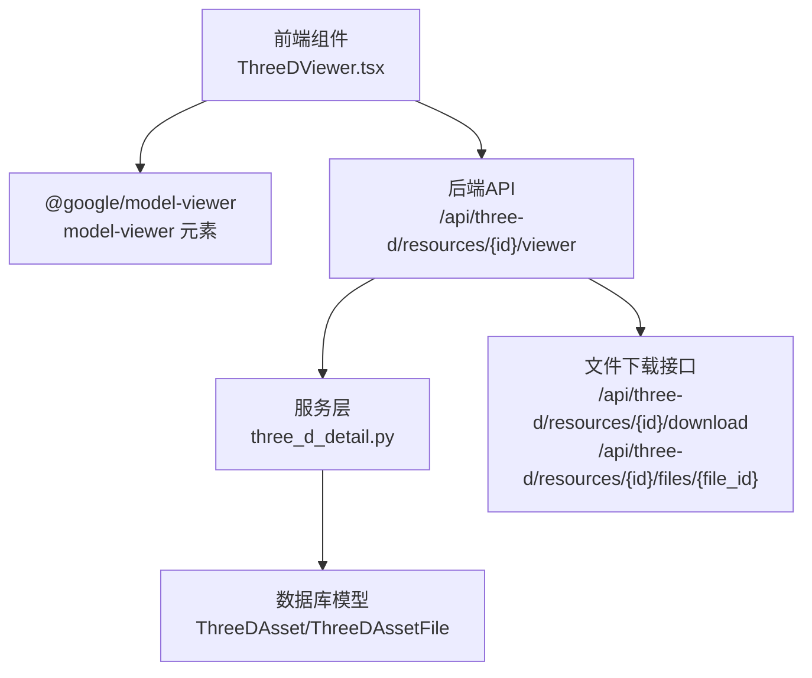
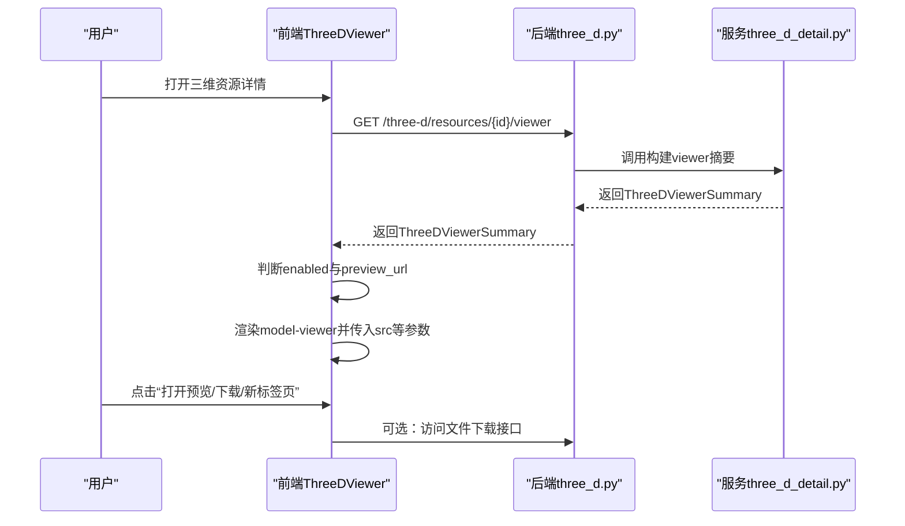
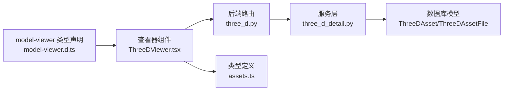

# Web查看器集成

<cite>
**本文引用的文件**
- [ThreeDViewer.tsx](file://frontend/src/components/ThreeDViewer.tsx)
- [model-viewer.d.ts](file://frontend/src/types/model-viewer.d.ts)
- [three_d.py](file://backend/app/routers/three_d.py)
- [three_d_detail.py](file://backend/app/services/three_d_detail.py)
- [assets.ts](file://frontend/src/types/assets.ts)
- [index.json](file://frontend/public/test-models/index.json)
- [cube.gltf](file://frontend/public/test-models/cube.gltf)
- [ThreeDManagement.tsx](file://frontend/src/components/ThreeDManagement.tsx)
</cite>

## 目录
1. [简介](#简介)
2. [项目结构](#项目结构)
3. [核心组件](#核心组件)
4. [架构总览](#架构总览)
5. [组件详解](#组件详解)
6. [依赖关系分析](#依赖关系分析)
7. [性能考量](#性能考量)
8. [故障排查指南](#故障排查指南)
9. [结论](#结论)
10. [附录](#附录)

## 简介
本文件面向MDAMS原型项目的Web查看器集成功能，聚焦于与@google/model-viewer的集成使用，涵盖查看器初始化、配置选项、渲染参数、交互功能、性能优化、状态管理、后端API集成、定制化选项以及最佳实践。文档以仓库现有实现为依据，结合前端组件与后端路由/服务层，给出可操作的配置建议与使用场景。

## 项目结构
Web查看器集成涉及前后端协作：
- 前端负责渲染与交互：通过model-viewer元素承载三维模型展示，配合UI卡片、按钮与描述信息。
- 后端负责数据与文件：提供三维资源详情、文件下载、Web预览状态判定与URL生成。

图表来源
- [ThreeDViewer.tsx:40-128](file://frontend/src/components/ThreeDViewer.tsx#L40-L128)
- [three_d.py:674-729](file://backend/app/routers/three_d.py#L674-L729)
- [three_d_detail.py:57-94](file://backend/app/services/three_d_detail.py#L57-L94)

章节来源
- [ThreeDViewer.tsx:1-129](file://frontend/src/components/ThreeDViewer.tsx#L1-L129)
- [three_d.py:38-742](file://backend/app/routers/three_d.py#L38-L742)
- [three_d_detail.py:1-201](file://backend/app/services/three_d_detail.py#L1-L201)

## 核心组件
- 前端查看器组件：负责渲染model-viewer元素、展示预览文件信息、提供打开预览、下载、新标签页打开等操作入口，并根据后端返回的viewer.enabled状态决定是否展示。
- 类型定义：为model-viewer元素在TSX中提供属性提示，确保src、alt、camera-controls、auto-rotate、interaction-prompt、shadow-intensity、exposure、environment-image、poster、loading等属性可用。
- 后端路由与服务：提供三维资源详情、viewer摘要、文件下载等接口；服务层根据资源状态与文件角色判断是否允许Web预览，并计算预览URL。

章节来源
- [ThreeDViewer.tsx:25-129](file://frontend/src/components/ThreeDViewer.tsx#L25-L129)
- [model-viewer.d.ts:1-18](file://frontend/src/types/model-viewer.d.ts#L1-L18)
- [three_d.py:664-729](file://backend/app/routers/three_d.py#L664-L729)
- [three_d_detail.py:57-94](file://backend/app/services/three_d_detail.py#L57-L94)
- [assets.ts:558-578](file://frontend/src/types/assets.ts#L558-L578)

## 架构总览
Web查看器的端到端流程如下：
- 前端调用后端“获取viewer摘要”接口，获得viewer.enabled、preview_file、preview_url等字段。
- 若enabled为true且存在preview_url，则在ThreeDViewer中渲染model-viewer元素，并传入src与若干渲染参数。
- 用户可选择打开预览、下载文件或在新标签页打开。

图表来源
- [three_d.py:674-686](file://backend/app/routers/three_d.py#L674-L686)
- [three_d_detail.py:57-94](file://backend/app/services/three_d_detail.py#L57-L94)
- [ThreeDViewer.tsx:56-66](file://frontend/src/components/ThreeDViewer.tsx#L56-L66)

## 组件详解

### ThreeDViewer 组件
- 功能要点
  - 接收viewer对象（来自后端viewer摘要），若为空则不渲染。
  - 解析preview_file与preview_url，计算是否可打开。
  - 渲染model-viewer元素，传入src、alt、camera-controls、auto-rotate、interaction-prompt、shadow-intensity、exposure、loading等属性。
  - 提供打开预览、下载、新标签页打开等操作按钮。
  - 在不可直接展示时显示警告提示，引导用户切换到可展示版本或下载文件。

- 关键渲染参数
  - src：预览URL
  - alt：模型替代文本
  - camera-controls：启用相机控制
  - auto-rotate：自动旋转
  - interaction-prompt：交互提示策略
  - shadow-intensity：阴影强度
  - exposure：曝光度
  - loading：加载策略
  - style：容器尺寸与背景色

- 交互与状态
  - enabled为true且存在preview_url时才渲染查看器。
  - 不可打开时显示警告，提示当前版本未标记为Web展示。

章节来源
- [ThreeDViewer.tsx:31-129](file://frontend/src/components/ThreeDViewer.tsx#L31-L129)

### model-viewer 类型声明
- 作用：为model-viewer元素在TypeScript/JSX中提供属性类型提示，避免运行时错误。
- 包含常用属性：src、alt、ar、camera-controls、auto-rotate、interaction-prompt、shadow-intensity、exposure、environment-image、poster、loading等。

章节来源
- [model-viewer.d.ts:1-18](file://frontend/src/types/model-viewer.d.ts#L1-L18)

### Viewer摘要与状态判定
- 后端服务层根据资源的is_web_preview与web_preview_status、文件角色（role）等条件，决定是否允许Web预览，并返回对应的preview_file与preview_url。
- 若资源未标记为可Web展示或缺少模型文件，则返回enabled=false及原因说明。

章节来源
- [three_d_detail.py:57-94](file://backend/app/services/three_d_detail.py#L57-L94)
- [three_d.py:674-686](file://backend/app/routers/three_d.py#L674-L686)

### 文件下载与访问
- 后端提供两类下载路径：
  - 整包下载：/api/three-d/resources/{id}/download
  - 单文件下载：/api/three-d/resources/{id}/files/{file_id}
- 前端ThreeDViewer中的“下载预览文件”按钮即跳转到单文件下载URL。

章节来源
- [three_d.py:689-729](file://backend/app/routers/three_d.py#L689-L729)
- [ThreeDViewer.tsx:82-89](file://frontend/src/components/ThreeDViewer.tsx#L82-L89)

### 测试模型与示例
- 前端提供测试模型目录与示例JSON，用于演示不同版本（原始版、Web展示版、高细节版）的切换与预览。
- 示例JSON中包含版本列表、角色、格式与URL，便于本地调试与演示。

章节来源
- [index.json:1-40](file://frontend/public/test-models/index.json#L1-L40)
- [cube.gltf:1-97](file://frontend/public/test-models/cube.gltf#L1-L97)
- [ThreeDManagement.tsx:88-92](file://frontend/src/components/ThreeDManagement.tsx#L88-L92)

## 依赖关系分析
- 前端ThreeDViewer依赖后端three_d.py提供的viewer摘要接口，以及assets.ts中ThreeDDetailResponse的viewer字段定义。
- 后端three_d.py依赖three_d_detail.py进行viewer摘要构建，后者再依赖数据库模型与文件记录。
- model-viewer类型声明为前端渲染提供类型安全。

图表来源
- [model-viewer.d.ts:1-18](file://frontend/src/types/model-viewer.d.ts#L1-L18)
- [ThreeDViewer.tsx:1-129](file://frontend/src/components/ThreeDViewer.tsx#L1-L129)
- [three_d.py:664-686](file://backend/app/routers/three_d.py#L664-L686)
- [three_d_detail.py:57-94](file://backend/app/services/three_d_detail.py#L57-L94)
- [assets.ts:558-578](file://frontend/src/types/assets.ts#L558-L578)

章节来源
- [assets.ts:558-578](file://frontend/src/types/assets.ts#L558-L578)
- [three_d.py:664-686](file://backend/app/routers/three_d.py#L664-L686)
- [three_d_detail.py:57-94](file://backend/app/services/three_d_detail.py#L57-L94)

## 性能考量
- 加载策略
  - 使用loading="eager"可提前加载模型，提升首帧体验；若希望节省带宽或延迟加载，可改为"lazy"。
- 渲染参数
  - exposure与shadow-intensity影响光照与阴影表现，适度调整可改善视觉质量与性能平衡。
- 文件格式与角色
  - Web预览通常要求模型文件角色为"model"，且web_preview_status为"ready"，确保文件体积与格式适合Web传输。
- 多版本与角色
  - 通过示例JSON可见，同一对象可有多个版本（如original、preview、detail），前端可据此选择合适的预览版本URL。

章节来源
- [ThreeDViewer.tsx:64](file://frontend/src/components/ThreeDViewer.tsx#L64)
- [three_d_detail.py:73-94](file://backend/app/services/three_d_detail.py#L73-L94)
- [index.json:8-38](file://frontend/public/test-models/index.json#L8-L38)

## 故障排查指南
- 无法打开Web预览
  - 检查viewer.enabled与reason，确认资源是否标记为可Web展示且具备模型文件。
  - 若reason提示“当前版本尚未标记为可Web展示”，需在后端更新web_preview_status或切换到可展示版本。
- 预览URL为空
  - 确认preview_file与preview_url是否正确生成；若为空，检查后端文件记录与下载URL构造逻辑。
- 下载失败
  - 使用后端下载接口验证文件是否存在与权限是否正确；单文件下载与整包下载路径需匹配资源状态。

章节来源
- [ThreeDViewer.tsx:115-123](file://frontend/src/components/ThreeDViewer.tsx#L115-L123)
- [three_d_detail.py:73-94](file://backend/app/services/three_d_detail.py#L73-L94)
- [three_d.py:689-729](file://backend/app/routers/three_d.py#L689-L729)

## 结论
MDAMS原型项目的Web查看器集成功基于@model-viewer与后端viewer摘要接口，实现了从资源状态判断到模型渲染与文件下载的完整闭环。通过合理的渲染参数与版本选择，可在保证用户体验的同时兼顾性能。后续可进一步引入LOD加载、环境贴图与交互提示策略等高级特性，以满足更复杂的展示需求。

## 附录

### 查看器配置示例（参数说明）
- src：模型预览URL
- alt：替代文本
- camera-controls：启用相机控制
- auto-rotate：自动旋转
- interaction-prompt：交互提示策略
- shadow-intensity：阴影强度
- exposure：曝光度
- loading：加载策略（eager/lazy）

章节来源
- [ThreeDViewer.tsx:56-66](file://frontend/src/components/ThreeDViewer.tsx#L56-L66)
- [model-viewer.d.ts:3-15](file://frontend/src/types/model-viewer.d.ts#L3-L15)

### 实际应用场景
- 展览与教育：通过Web预览快速展示三维文物模型，支持自动旋转与交互提示，便于教学与公众传播。
- 资产管理：在三维资源详情页中提供“打开预览/下载/新标签页打开”等操作，提升检索与利用效率。
- 版本对比：利用示例JSON中的多版本URL，切换不同细节级别的模型进行对比分析。

章节来源
- [index.json:8-38](file://frontend/public/test-models/index.json#L8-L38)
- [ThreeDManagement.tsx:540-552](file://frontend/src/components/ThreeDManagement.tsx#L540-L552)