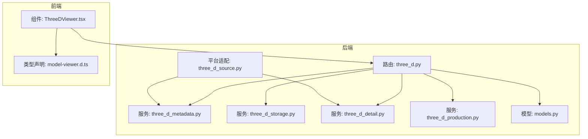
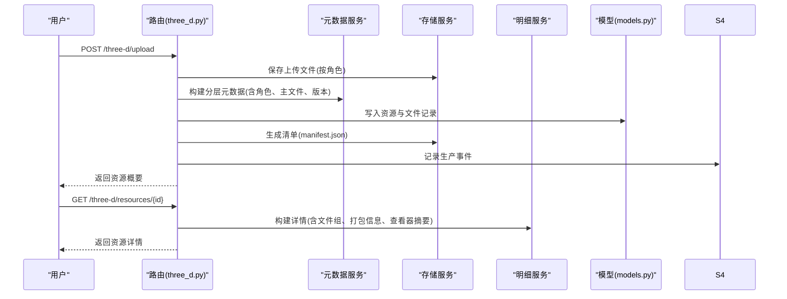
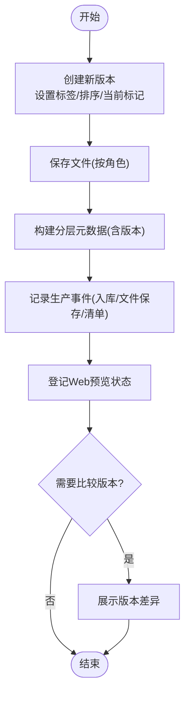
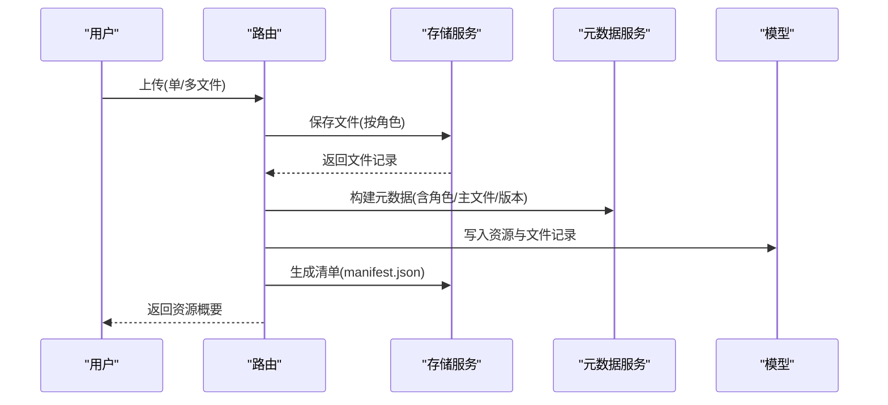
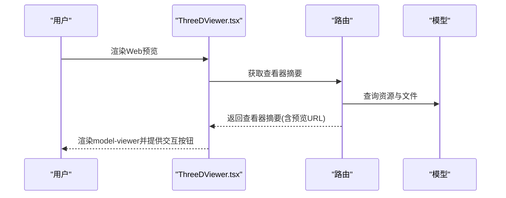
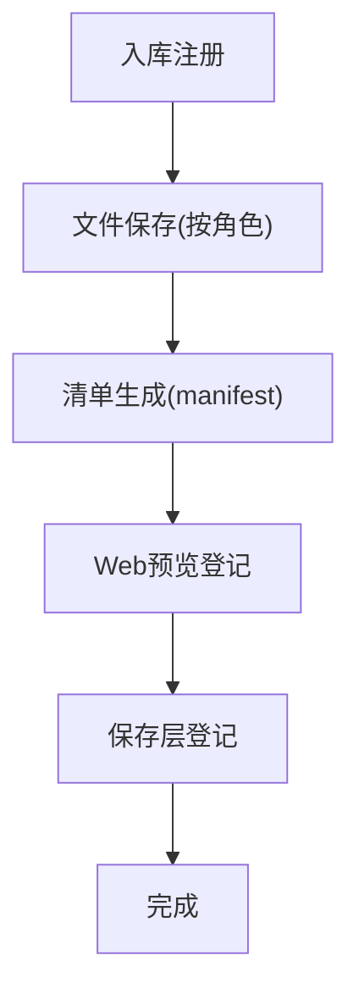
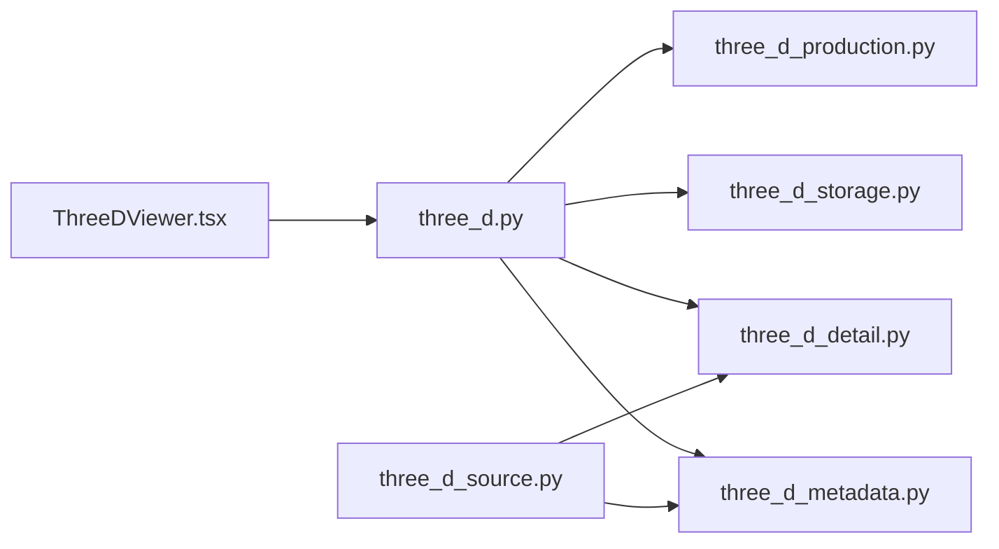

# 三维资源管理

<cite>
**本文引用的文件**
- [three_d_source.py](file://backend/app/platform/three_d_source.py)
- [three_d.py](file://backend/app/routers/three_d.py)
- [three_d_metadata.py](file://backend/app/services/three_d_metadata.py)
- [three_d_storage.py](file://backend/app/services/three_d_storage.py)
- [three_d_detail.py](file://backend/app/services/three_d_detail.py)
- [three_d_production.py](file://backend/app/services/three_d_production.py)
- [models.py](file://backend/app/models.py)
- [ThreeDViewer.tsx](file://frontend/src/components/ThreeDViewer.tsx)
- [model-viewer.d.ts](file://frontend/src/types/model-viewer.d.ts)
- [test_three_d_subsystem.py](file://backend/tests/test_three_d_subsystem.py)
- [API_ROUTE_MAP.md](file://docs/02-架构设计/API_ROUTE_MAP.md)
- [DATA_INGEST_ARCHITECTURE.md](file://docs/02-架构设计/DATA_INGEST_ARCHITECTURE.md)
</cite>

## 目录
1. [简介](#简介)
2. [项目结构](#项目结构)
3. [核心组件](#核心组件)
4. [架构总览](#架构总览)
5. [详细组件分析](#详细组件分析)
6. [依赖分析](#依赖分析)
7. [性能考虑](#性能考虑)
8. [故障排查指南](#故障排查指南)
9. [结论](#结论)
10. [附录](#附录)

## 简介
本文件面向MDAMS原型项目的三维资源管理子系统，系统性梳理三维对象的版本管理、多文件资源包上传与管理、角色区分与处理差异、Web查看器集成、生产链路管理、元数据管理以及预览展示功能，并提供API接口说明与使用示例路径，帮助开发者与非技术读者快速理解与使用三维资源管理能力。

## 项目结构
三维资源管理子系统由后端路由、服务层、模型与测试，以及前端查看器组成，遵循“路由-服务-模型-测试”的分层设计；同时通过平台适配器实现统一资源目录聚合。

图表来源
- [three_d.py:1-742](file://backend/app/routers/three_d.py#L1-L742)
- [three_d_metadata.py:1-360](file://backend/app/services/three_d_metadata.py#L1-L360)
- [three_d_storage.py:1-226](file://backend/app/services/three_d_storage.py#L1-L226)
- [three_d_detail.py:1-201](file://backend/app/services/three_d_detail.py#L1-L201)
- [three_d_production.py:1-95](file://backend/app/services/three_d_production.py#L1-L95)
- [models.py:215-307](file://backend/app/models.py#L215-L307)
- [three_d_source.py:1-224](file://backend/app/platform/three_d_source.py#L1-L224)
- [ThreeDViewer.tsx:1-129](file://frontend/src/components/ThreeDViewer.tsx#L1-L129)
- [model-viewer.d.ts:1-18](file://frontend/src/types/model-viewer.d.ts#L1-L18)

章节来源
- [API_ROUTE_MAP.md:105-114](file://docs/02-架构设计/API_ROUTE_MAP.md#L105-L114)
- [DATA_INGEST_ARCHITECTURE.md:15-86](file://docs/02-架构设计/DATA_INGEST_ARCHITECTURE.md#L15-L86)

## 核心组件
- 路由层：提供三维资源上传、列表、详情、下载、删除、Web查看器摘要等HTTP接口，负责参数解析、权限校验与响应序列化。
- 服务层：
  - 元数据服务：构建分层元数据（core/management/technical/profile/preservation/raw_metadata），解析资源类型与角色，汇总文件统计与主文件选择。
  - 存储服务：按角色归档上传文件、生成清单、打包下载、删除资源树。
  - 明细服务：将数据库记录转换为前端所需结构，含文件组、打包信息、生产记录、访问摘要、技术元数据与Web查看器摘要。
  - 生产记录服务：记录入库、处理、发布、保存等阶段事件，支撑生产链路追踪。
- 平台适配：将三维资源纳入统一资源目录，提供统一概览与详情。
- 前端查看器：基于model-viewer集成Web预览，支持打开、下载、新标签页跳转等操作。

章节来源
- [three_d.py:38-742](file://backend/app/routers/three_d.py#L38-L742)
- [three_d_metadata.py:228-360](file://backend/app/services/three_d_metadata.py#L228-L360)
- [three_d_storage.py:70-226](file://backend/app/services/three_d_storage.py#L70-L226)
- [three_d_detail.py:97-201](file://backend/app/services/three_d_detail.py#L97-L201)
- [three_d_production.py:11-95](file://backend/app/services/three_d_production.py#L11-L95)
- [three_d_source.py:56-224](file://backend/app/platform/three_d_source.py#L56-L224)
- [ThreeDViewer.tsx:31-129](file://frontend/src/components/ThreeDViewer.tsx#L31-L129)

## 架构总览
三维资源管理采用“资源包+版本化+角色化”的架构：
- 资源包：一个资源对象可包含多个版本，每个版本下挂模型、点云、倾斜摄影等文件。
- 版本管理：通过版本标签、排序、当前版本标记与Web展示状态共同控制。
- 角色区分：按文件用途分为模型、点云、倾斜摄影、贴图、辅助文件等，自动识别与人工指定结合。
- 元数据分层：core用于平台统一目录，technical用于文件与处理信息，profile用于对象语义，preservation用于长期保存，raw_metadata保留原始字段。
- 生产链路：记录入库、文件保存、清单生成、Web预览登记、保存层登记等事件，便于审计与回溯。
- Web查看器：通过model-viewer在浏览器内进行三维模型预览，支持交互与下载。

图表来源
- [three_d.py:371-636](file://backend/app/routers/three_d.py#L371-L636)
- [three_d_metadata.py:228-360](file://backend/app/services/three_d_metadata.py#L228-L360)
- [three_d_storage.py:178-226](file://backend/app/services/three_d_storage.py#L178-L226)
- [three_d_detail.py:97-201](file://backend/app/services/three_d_detail.py#L97-L201)
- [three_d_production.py:39-95](file://backend/app/services/three_d_production.py#L39-L95)
- [models.py:215-307](file://backend/app/models.py#L215-L307)

## 详细组件分析

### 版本管理机制
- 版本创建：上传时设置版本标签与排序，默认当前版本标记为true；生产记录中登记入库与文件保存事件。
- 版本切换：通过当前版本标记与排序字段控制展示顺序；平台适配器与统一详情中体现版本信息。
- 版本比较：通过版本标签与排序字段进行逻辑比较；前端展示当前版本与历史版本的差异。
- 版本合并：当前实现未提供直接的版本合并接口，建议通过重新上传新版本并在平台层进行版本对比与选择。

图表来源
- [three_d.py:486-636](file://backend/app/routers/three_d.py#L486-L636)
- [three_d_production.py:39-95](file://backend/app/services/three_d_production.py#L39-L95)
- [three_d_metadata.py:242-277](file://backend/app/services/three_d_metadata.py#L242-L277)

章节来源
- [three_d.py:486-636](file://backend/app/routers/three_d.py#L486-L636)
- [three_d_production.py:39-95](file://backend/app/services/three_d_production.py#L39-L95)
- [three_d_metadata.py:242-277](file://backend/app/services/three_d_metadata.py#L242-L277)

### 多文件资源包上传与管理
- 文件上传：支持单文件或多文件上传，按角色归档；自动去重与命名冲突处理。
- 文件关联：每个文件记录包含角色、实际文件名、路径、大小、MIME等；主文件优先选择模型/点云/倾斜摄影等。
- 依赖关系：资源对象与文件记录一对多；资源对象与藏品对象可建立关联。
- 完整性校验：当前未见显式的哈希校验流程，建议在生产链路中补充校验步骤。
- 版本控制：通过版本标签与排序字段控制版本；Web预览状态决定是否可展示。

图表来源
- [three_d.py:371-636](file://backend/app/routers/three_d.py#L371-L636)
- [three_d_storage.py:70-115](file://backend/app/services/three_d_storage.py#L70-L115)
- [three_d_metadata.py:228-360](file://backend/app/services/three_d_metadata.py#L228-L360)
- [models.py:215-274](file://backend/app/models.py#L215-L274)

章节来源
- [three_d.py:371-636](file://backend/app/routers/three_d.py#L371-L636)
- [three_d_storage.py:70-115](file://backend/app/services/three_d_storage.py#L70-L115)
- [three_d_metadata.py:228-360](file://backend/app/services/three_d_metadata.py#L228-L360)
- [models.py:215-274](file://backend/app/models.py#L215-L274)

### 三维模型的角色区分与处理差异
- 角色定义：模型、点云、倾斜摄影、贴图、辅助文件、其他；角色可由文件扩展名推断或人工指定。
- 处理差异：
  - 模型：作为Web预览首选；若资源包包含模型，且标记为可Web展示，则可直接预览。
  - 点云：侧重数量与坐标系、单位等技术元数据。
  - 倾斜摄影：侧重项目、采集者、采集时间等管理元数据。
- 主文件选择：优先模型/点云/倾斜摄影，其次贴图/辅助文件，最后其他。

章节来源
- [three_d_storage.py:26-61](file://backend/app/services/three_d_storage.py#L26-L61)
- [three_d_storage.py:118-126](file://backend/app/services/three_d_storage.py#L118-L126)
- [three_d_metadata.py:30-86](file://backend/app/services/three_d_metadata.py#L30-L86)

### Web查看器集成
- model-viewer集成：前端组件通过model-viewer标签加载预览URL，支持相机控制、自动旋转、阴影强度、曝光等参数。
- 预览条件：资源必须标记为可Web展示且状态为就绪，且存在模型文件作为候选。
- 交互功能：打开预览文件、下载预览文件、新标签页打开。
- 性能优化：预览URL直连后端文件或清单，避免不必要的中间层；前端组件提供加载策略与样式配置。

图表来源
- [ThreeDViewer.tsx:31-129](file://frontend/src/components/ThreeDViewer.tsx#L31-L129)
- [three_d_detail.py:57-95](file://backend/app/services/three_d_detail.py#L57-L95)
- [three_d.py:674-687](file://backend/app/routers/three_d.py#L674-L687)
- [model-viewer.d.ts:1-18](file://frontend/src/types/model-viewer.d.ts#L1-L18)

章节来源
- [ThreeDViewer.tsx:31-129](file://frontend/src/components/ThreeDViewer.tsx#L31-L129)
- [three_d_detail.py:57-95](file://backend/app/services/three_d_detail.py#L57-L95)
- [three_d.py:674-687](file://backend/app/routers/three_d.py#L674-L687)
- [model-viewer.d.ts:1-18](file://frontend/src/types/model-viewer.d.ts#L1-L18)

### 生产链路管理
- 入库登记：记录注册事件，描述入库完成。
- 文件保存：记录按角色保存文件事件，包含角色集合。
- 清单生成：记录清单生成事件，附带清单路径证据。
- Web预览登记：根据Web预览状态登记发布事件。
- 保存层登记：根据保存状态与存储层级登记保存事件。
- 事件审计：生产记录包含阶段、事件类型、状态、执行者、描述、证据与元数据，便于审计与回溯。

图表来源
- [three_d_production.py:39-95](file://backend/app/services/three_d_production.py#L39-L95)

章节来源
- [three_d_production.py:11-95](file://backend/app/services/three_d_production.py#L11-L95)

### 三维资源元数据管理
- 分层结构：core(平台统一目录)、management(管理元数据)、technical(技术元数据)、profile(对象语义)、preservation(保存)、raw_metadata(原始字段)。
- 字段覆盖：优先从传入元数据中提取，其次从原始元数据与各层字段别名中查找；日期标准化为ISO格式。
- 资源类型与角色：根据角色集合与文件扩展名推断资源类型；根据profile键与别名确定类型标签。
- 技术元数据：包含原始文件名、文件大小、格式、扩展名、顶点/面数、材质/贴图数、点数、LOD层级、坐标系、单位、包围盒、校验算法与值、入库方式等。

章节来源
- [three_d_metadata.py:228-360](file://backend/app/services/three_d_metadata.py#L228-L360)
- [three_d_storage.py:128-149](file://backend/app/services/three_d_storage.py#L128-L149)

### 预览与展示功能
- Web预览：当资源标记为可Web展示且存在模型文件时启用；否则提供候选文件与原因说明。
- 下载：单文件直连下载；多文件打包为ZIP下载。
- 交互：打开预览文件、下载预览文件、新标签页打开。

章节来源
- [three_d_detail.py:57-95](file://backend/app/services/three_d_detail.py#L57-L95)
- [three_d.py:689-728](file://backend/app/routers/three_d.py#L689-L728)
- [three_d.py:709-728](file://backend/app/routers/three_d.py#L709-L728)

## 依赖分析
- 路由依赖服务：上传流程依赖存储与元数据服务；详情与查看器摘要依赖明细服务；删除依赖存储服务清理资源树。
- 服务间耦合：元数据服务与存储服务相互配合，明细服务依赖两者输出；生产记录服务独立于业务流程，仅写入审计。
- 平台适配：平台适配器依赖元数据与明细服务，统一输出资源概览与详情。
- 前端依赖：查看器组件依赖路由提供的查看器摘要与预览URL。

图表来源
- [three_d.py:38-742](file://backend/app/routers/three_d.py#L38-L742)
- [three_d_metadata.py:1-360](file://backend/app/services/three_d_metadata.py#L1-L360)
- [three_d_storage.py:1-226](file://backend/app/services/three_d_storage.py#L1-L226)
- [three_d_detail.py:1-201](file://backend/app/services/three_d_detail.py#L1-L201)
- [three_d_production.py:1-95](file://backend/app/services/three_d_production.py#L1-L95)
- [three_d_source.py:1-224](file://backend/app/platform/three_d_source.py#L1-L224)
- [ThreeDViewer.tsx:1-129](file://frontend/src/components/ThreeDViewer.tsx#L1-L129)

章节来源
- [three_d.py:38-742](file://backend/app/routers/three_d.py#L38-L742)
- [three_d_source.py:192-224](file://backend/app/platform/three_d_source.py#L192-L224)

## 性能考虑
- 文件上传：采用分块读取与按角色目录存储，减少IO竞争；重复文件名自动重命名，避免覆盖。
- 清单生成：一次性写入JSON清单，避免多次磁盘IO；清单包含文件组与元数据，便于前端快速渲染。
- Web预览：预览URL直连后端文件或清单，减少中间层；前端组件提供加载策略与样式配置，提升用户体验。
- 生产记录：事件写入数据库，建议在高并发场景下对关键事件进行异步处理或批量写入。

## 故障排查指南
- 上传失败：检查至少上传一个文件；确认角色识别与主文件选择逻辑；查看生产记录中的错误事件。
- 无法预览：确认资源标记为可Web展示且状态为就绪；确认存在模型文件；检查查看器摘要返回的原因。
- 下载异常：单文件下载需确保文件路径存在；多文件下载需确认打包ZIP生成成功。
- 权限问题：确认用户具备three_d.view或three_d.edit权限；平台适配器会根据可见范围过滤资源。

章节来源
- [three_d.py:412-419](file://backend/app/routers/three_d.py#L412-L419)
- [three_d_detail.py:57-95](file://backend/app/services/three_d_detail.py#L57-L95)
- [three_d.py:689-728](file://backend/app/routers/three_d.py#L689-L728)
- [three_d_source.py:69-158](file://backend/app/platform/three_d_source.py#L69-L158)

## 结论
三维资源管理子系统以“资源包+版本化+角色化”为核心，结合分层元数据与生产链路记录，实现了从上传、存储、元数据构建、Web预览到下载的完整闭环。前端通过model-viewer提供直观的三维预览体验。建议后续在生产链路中补充完整性校验与版本合并能力，进一步提升系统的可靠性与可维护性。

## 附录

### API接口说明与使用示例
- 上传三维资源
  - 方法与路径：POST /three-d/upload
  - 功能：支持单文件或多文件上传，按角色归档，生成清单并登记生产事件
  - 示例路径：[上传接口实现:371-636](file://backend/app/routers/three_d.py#L371-L636)
- 列出三维资源
  - 方法与路径：GET /three-d/resources
  - 功能：按创建时间倒序列出资源，支持权限过滤
  - 示例路径：[列表接口实现:639-661](file://backend/app/routers/three_d.py#L639-L661)
- 获取三维资源详情
  - 方法与路径：GET /three-d/resources/{resource_id}
  - 功能：返回资源详情，包含文件组、打包信息、生产记录、技术元数据与查看器摘要
  - 示例路径：[详情接口实现:664-671](file://backend/app/routers/three_d.py#L664-L671)
- 获取Web查看器摘要
  - 方法与路径：GET /three-d/resources/{resource_id}/viewer
  - 功能：返回Web预览启用状态与预览URL
  - 示例路径：[查看器摘要实现:674-687](file://backend/app/routers/three_d.py#L674-L687)
- 下载三维资源
  - 方法与路径：GET /three-d/resources/{resource_id}/download
  - 功能：单文件直连下载；多文件打包ZIP下载
  - 示例路径：[下载接口实现:689-707](file://backend/app/routers/three_d.py#L689-L707)
- 下载三维资源文件
  - 方法与路径：GET /three-d/resources/{resource_id}/files/{file_id}
  - 功能：按文件ID下载具体文件
  - 示例路径：[文件下载实现:710-728](file://backend/app/routers/three_d.py#L710-L728)
- 删除三维资源
  - 方法与路径：DELETE /three-d/resources/{resource_id}
  - 功能：删除资源树与数据库记录
  - 示例路径：[删除接口实现:731-741](file://backend/app/routers/three_d.py#L731-L741)

章节来源
- [three_d.py:371-741](file://backend/app/routers/three_d.py#L371-L741)

### 使用示例
- 单文件三维模型上传与预览
  - 示例路径：[单文件上传测试:36-69](file://backend/tests/test_three_d_subsystem.py#L36-L69)
- 多文件资源包上传与打包下载
  - 示例路径：[资源包上传测试:72-103](file://backend/tests/test_three_d_subsystem.py#L72-L103)
- 藏品对象关联与版本切换
  - 示例路径：[关联上传与版本测试:106-134](file://backend/tests/test_three_d_subsystem.py#L106-L134)

章节来源
- [test_three_d_subsystem.py:36-134](file://backend/tests/test_three_d_subsystem.py#L36-L134)