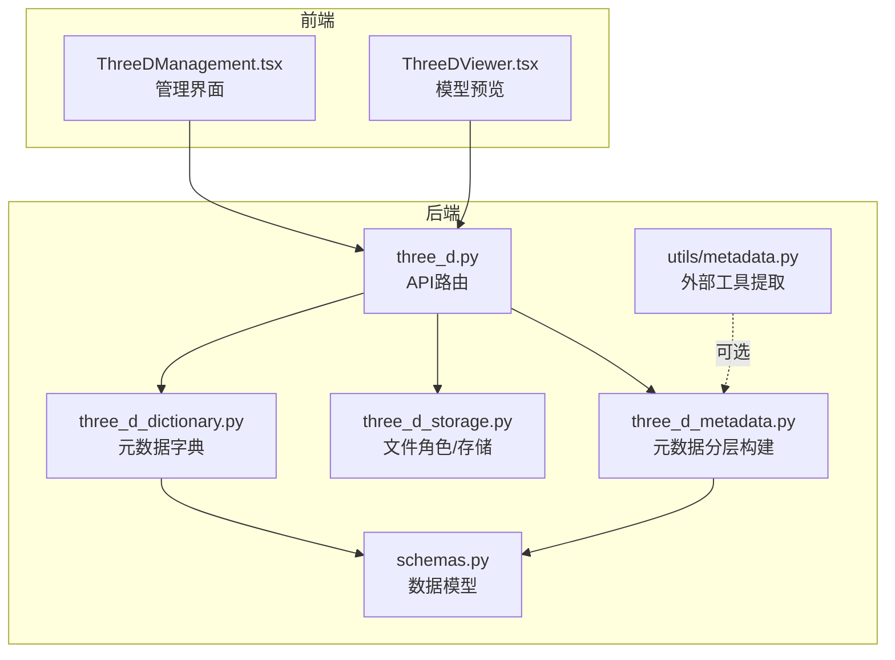
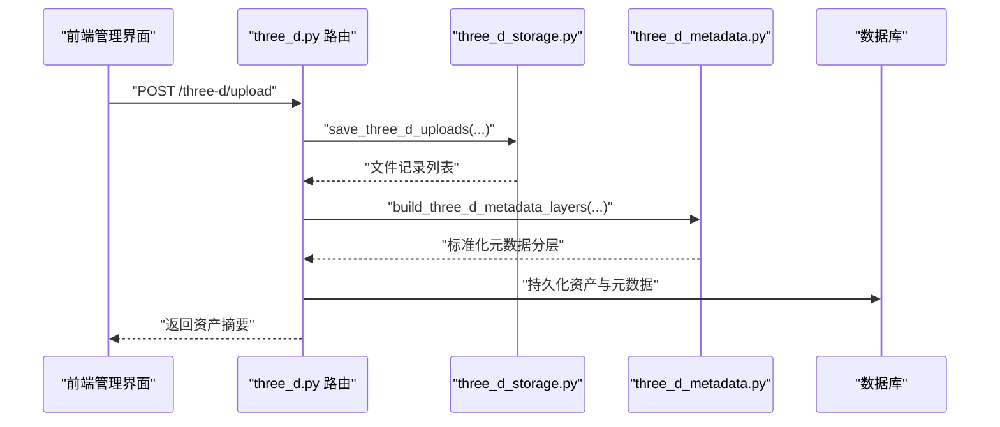
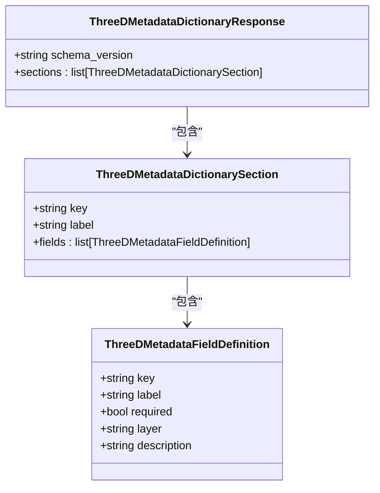
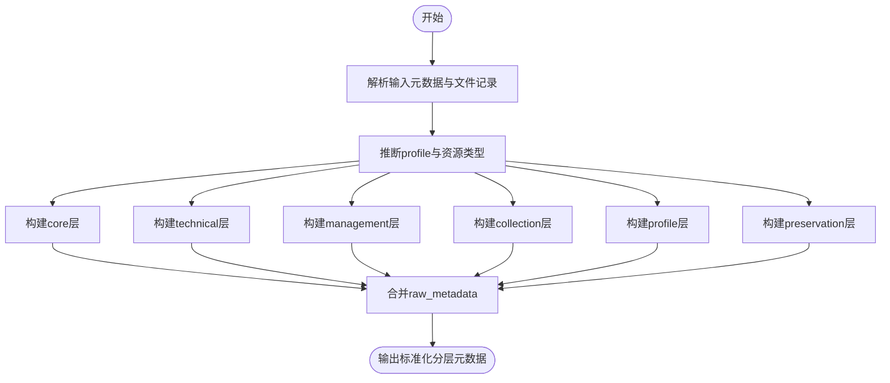
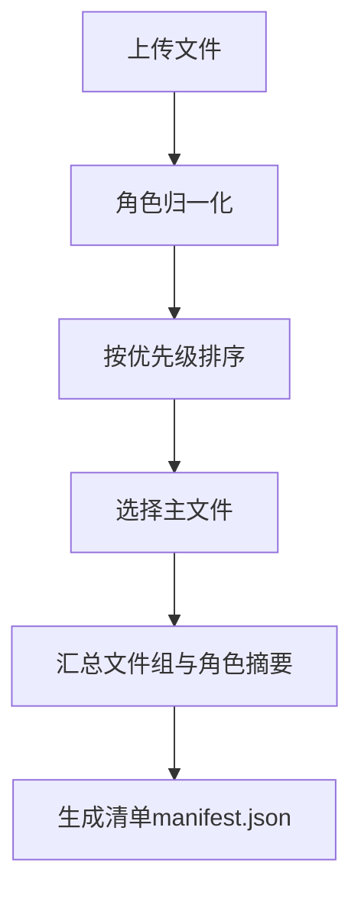
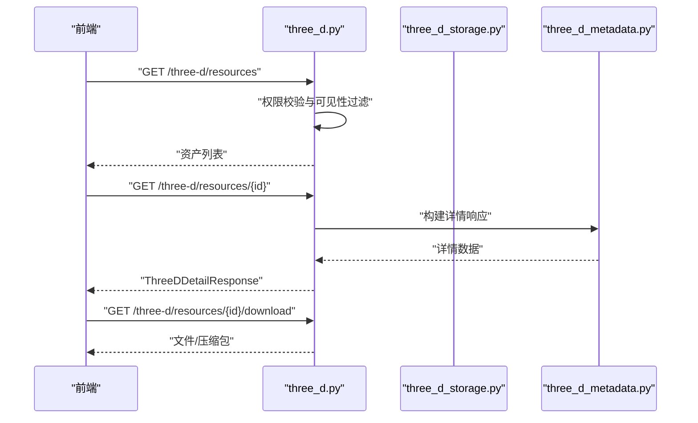
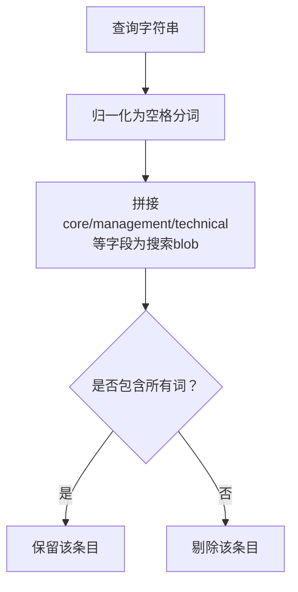
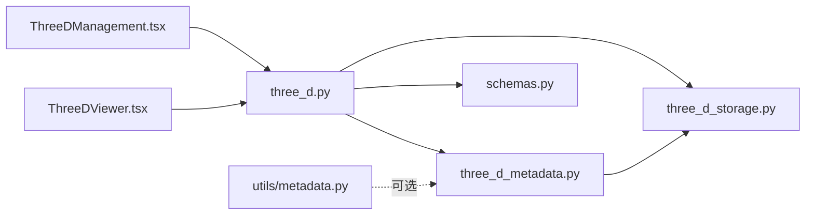

# 元数据管理

<cite>
**本文引用的文件**
- [backend/app/services/three_d_metadata.py](file://backend/app/services/three_d_metadata.py)
- [backend/app/services/three_d_dictionary.py](file://backend/app/services/three_d_dictionary.py)
- [backend/app/services/three_d_storage.py](file://backend/app/services/three_d_storage.py)
- [backend/app/routers/three_d.py](file://backend/app/routers/three_d.py)
- [backend/app/schemas.py](file://backend/app/schemas.py)
- [backend/app/utils/metadata.py](file://backend/app/utils/metadata.py)
- [frontend/src/components/ThreeDManagement.tsx](file://frontend/src/components/ThreeDManagement.tsx)
- [frontend/src/components/ThreeDViewer.tsx](file://frontend/src/components/ThreeDViewer.tsx)
- [docs/06-参考资料/UNIFIED_METADATA_EXAMPLE.md](file://docs/06-参考资料/UNIFIED_METADATA_EXAMPLE.md)
- [backend/tests/test_three_d_dictionary.py](file://backend/tests/test_three_d_dictionary.py)
</cite>

## 目录
1. [简介](#简介)
2. [项目结构](#项目结构)
3. [核心组件](#核心组件)
4. [架构总览](#架构总览)
5. [详细组件分析](#详细组件分析)
6. [依赖分析](#依赖分析)
7. [性能考虑](#性能考虑)
8. [故障排查指南](#故障排查指南)
9. [结论](#结论)
10. [附录](#附录)

## 简介
本文件面向MDAMS原型项目的三维资源元数据管理功能，系统性阐述三维资源的元数据结构、字典构建与维护、层次化组织、自动提取与手动编辑、标准化处理、搜索与过滤、最佳实践与配置示例。目标是帮助开发者与运营人员准确理解并高效使用三维元数据子系统。

## 项目结构
三维元数据相关的关键模块分布如下：
- 后端服务层
  - 元数据构建与分层：three_d_metadata.py
  - 元数据字典定义：three_d_dictionary.py
  - 文件角色与存储：three_d_storage.py
  - API路由与集成：three_d.py
  - 数据模型与响应：schemas.py
  - 外部工具元数据提取：utils/metadata.py
- 前端展示层
  - 三维资源管理界面：ThreeDManagement.tsx
  - 三维模型预览组件：ThreeDViewer.tsx
- 参考资料
  - 统一元数据示例：UNIFIED_METADATA_EXAMPLE.md
- 测试
  - 元数据字典契约测试：test_three_d_dictionary.py

**图表来源**
- [backend/app/routers/three_d.py:1-742](file://backend/app/routers/three_d.py#L1-L742)
- [backend/app/services/three_d_metadata.py:1-360](file://backend/app/services/three_d_metadata.py#L1-L360)
- [backend/app/services/three_d_dictionary.py:1-84](file://backend/app/services/three_d_dictionary.py#L1-L84)
- [backend/app/services/three_d_storage.py:1-226](file://backend/app/services/three_d_storage.py#L1-L226)
- [backend/app/schemas.py:571-652](file://backend/app/schemas.py#L571-L652)
- [backend/app/utils/metadata.py:1-79](file://backend/app/utils/metadata.py#L1-L79)
- [frontend/src/components/ThreeDManagement.tsx:1-1043](file://frontend/src/components/ThreeDManagement.tsx#L1-L1043)
- [frontend/src/components/ThreeDViewer.tsx:1-129](file://frontend/src/components/ThreeDViewer.tsx#L1-L129)

**章节来源**
- [backend/app/routers/three_d.py:1-742](file://backend/app/routers/three_d.py#L1-L742)
- [backend/app/services/three_d_metadata.py:1-360](file://backend/app/services/three_d_metadata.py#L1-L360)
- [backend/app/services/three_d_dictionary.py:1-84](file://backend/app/services/three_d_dictionary.py#L1-L84)
- [backend/app/services/three_d_storage.py:1-226](file://backend/app/services/three_d_storage.py#L1-L226)
- [backend/app/schemas.py:571-652](file://backend/app/schemas.py#L571-L652)
- [backend/app/utils/metadata.py:1-79](file://backend/app/utils/metadata.py#L1-L79)
- [frontend/src/components/ThreeDManagement.tsx:1-1043](file://frontend/src/components/ThreeDManagement.tsx#L1-L1043)
- [frontend/src/components/ThreeDViewer.tsx:1-129](file://frontend/src/components/ThreeDViewer.tsx#L1-L129)

## 核心组件
- 元数据分层构建器
  - 负责将输入元数据与文件记录整合为分层结构，包含core、technical、management、collection、profile、preservation等层，并输出标准化的schema版本。
  - 支持从文件记录推断资源类型与profile，合并用户输入与原始元数据，填充技术元数据字段（如文件大小、格式、坐标系、单位、校验值等）。
- 元数据字典
  - 定义三维元数据的字典结构，包含字段键、标签、是否必填、所属层级与描述，覆盖core、collection、technical、management、preservation、production六个section。
- 文件角色与存储
  - 规范文件角色（模型、点云、倾斜摄影、贴图、辅助、其他），提供角色归一化、主文件选择、文件汇总统计与清单生成。
- API路由
  - 提供上传、列表、详情、下载、删除等接口，集成元数据构建、文件落盘与清单生成，并负责权限与可见性控制。
- 数据模型
  - 定义ThreeDDetailResponse、ThreeDMetadataFieldDefinition、ThreeDMetadataDictionarySection等模型，支撑前后端一致的数据契约。
- 外部工具元数据提取
  - 封装ExifTool调用，抽取文件的结构化元数据，便于与系统内元数据融合。

**章节来源**
- [backend/app/services/three_d_metadata.py:228-360](file://backend/app/services/three_d_metadata.py#L228-L360)
- [backend/app/services/three_d_dictionary.py:10-84](file://backend/app/services/three_d_dictionary.py#L10-L84)
- [backend/app/services/three_d_storage.py:26-200](file://backend/app/services/three_d_storage.py#L26-L200)
- [backend/app/routers/three_d.py:371-636](file://backend/app/routers/three_d.py#L371-L636)
- [backend/app/schemas.py:571-652](file://backend/app/schemas.py#L571-L652)
- [backend/app/utils/metadata.py:19-79](file://backend/app/utils/metadata.py#L19-L79)

## 架构总览
三维元数据管理采用“上传即构建”的流水线：前端上传三维文件与手工元数据，后端解析文件角色、推断profile与资源类型，调用元数据分层构建器生成标准化分层元数据，落盘并生成清单，最终对外提供统一的详情与下载接口。

**图表来源**
- [backend/app/routers/three_d.py:371-636](file://backend/app/routers/three_d.py#L371-L636)
- [backend/app/services/three_d_storage.py:70-115](file://backend/app/services/three_d_storage.py#L70-L115)
- [backend/app/services/three_d_metadata.py:228-360](file://backend/app/services/three_d_metadata.py#L228-L360)

## 详细组件分析

### 元数据字典与字段定义
- 字典结构
  - schema_version：1.0
  - sections：core、collection、technical、management、preservation、production
- 字段特性
  - key：字段键
  - label：中文标签
  - required：是否必填
  - layer：所属层级
  - description：简要说明
- 字典契约测试
  - 确保sections顺序与关键字段存在，校验core层必填项与各层字段集合。

**图表来源**
- [backend/app/schemas.py:617-652](file://backend/app/schemas.py#L617-L652)
- [backend/app/services/three_d_dictionary.py:10-84](file://backend/app/services/three_d_dictionary.py#L10-L84)

**章节来源**
- [backend/app/services/three_d_dictionary.py:10-84](file://backend/app/services/three_d_dictionary.py#L10-L84)
- [backend/tests/test_three_d_dictionary.py:9-28](file://backend/tests/test_three_d_dictionary.py#L9-L28)

### 元数据分层与标准化
- 分层结构
  - core：核心标识与状态（标题、资源组、版本、Web预览开关与状态等）
  - technical：技术元数据（格式、尺寸、坐标系、单位、校验值、文件清单等）
  - management：管理元数据（项目、创建者、采集时间、标签等）
  - collection：藏品关联（藏品号、名称、类型、收藏单位等）
  - profile：按profile抽取的领域字段
  - preservation：保存元数据（存储层级、保存状态、说明）
  - raw_metadata：原始元数据快照
- 标准化策略
  - 统一schema版本（三维为1.1，通用元数据为2.0）
  - 日期统一ISO格式
  - 字段别名查找与规范化
  - 从文件记录汇总文件组、主文件、角色摘要

**图表来源**
- [backend/app/services/three_d_metadata.py:228-360](file://backend/app/services/three_d_metadata.py#L228-L360)

**章节来源**
- [backend/app/services/three_d_metadata.py:228-360](file://backend/app/services/three_d_metadata.py#L228-L360)

### 文件角色与存储组织
- 角色归一化与标签
  - 归一化模型、点云、倾斜摄影、贴图、辅助、其他等角色
- 主文件选择
  - 优先级：模型 > 点云 > 倾斜摄影 > 贴图 > 辅助 > 其他
- 文件汇总与清单
  - 统计各角色文件数量与总大小，生成角色摘要字符串
  - 生成资源包清单manifest.json，包含资源ID、标题、类型、文件数与文件明细

**图表来源**
- [backend/app/services/three_d_storage.py:26-200](file://backend/app/services/three_d_storage.py#L26-L200)

**章节来源**
- [backend/app/services/three_d_storage.py:26-200](file://backend/app/services/three_d_storage.py#L26-L200)

### API工作流与集成
- 上传流程
  - 解析上传文件，按角色分组保存
  - 推断profile与资源类型，构建元数据分层
  - 生成清单，更新资产状态与元数据
- 查询与展示
  - 列表：按可见性范围过滤
  - 详情：返回结构化文件、技术元数据、预览信息
  - 下载：单文件直下或打包下载
- 权限与可见性
  - 依据core层visibility_scope与用户权限决定可见性

**图表来源**
- [backend/app/routers/three_d.py:639-742](file://backend/app/routers/three_d.py#L639-L742)

**章节来源**
- [backend/app/routers/three_d.py:371-742](file://backend/app/routers/three_d.py#L371-L742)

### 前端交互与可视化
- 三维资源管理界面
  - 支持按模板类型（模型/点云/倾斜摄影/资源包/其他）选择
  - 表单字段覆盖核心、技术、管理、保存等元数据
  - 展示数字对象聚合、版本对比、Web预览状态与文件统计
- 三维模型预览
  - 使用model-viewer渲染GLB/GLTF等模型
  - 提供预览、下载与新标签页打开

**章节来源**
- [frontend/src/components/ThreeDManagement.tsx:555-1043](file://frontend/src/components/ThreeDManagement.tsx#L555-L1043)
- [frontend/src/components/ThreeDViewer.tsx:31-129](file://frontend/src/components/ThreeDViewer.tsx#L31-L129)

### 搜索与过滤
- 全文检索
  - 三维平台源在构建搜索索引时，将core、management、technical、collection、profile、preservation、raw_metadata等字段拼接为搜索blob，进行包含匹配
- 条件筛选
  - 支持按资源组、版本、Web预览状态、保存状态、文件角色摘要等维度筛选
- 高级查询
  - 可结合前端表单与后端路由参数实现复合条件查询

**图表来源**
- [backend/app/platform/three_d_source.py:110-135](file://backend/app/platform/three_d_source.py#L110-L135)

**章节来源**
- [backend/app/platform/three_d_source.py:110-135](file://backend/app/platform/three_d_source.py#L110-L135)

### 自动提取与手动编辑
- 自动提取
  - 可选使用ExifTool提取文件元数据，作为raw_metadata进入系统，便于与手工字段融合
- 手动编辑
  - 前端表单支持核心、技术、管理、保存等字段的手工填写
  - 上传时合并用户输入与自动提取结果，形成最终分层元数据

**章节来源**
- [backend/app/utils/metadata.py:19-79](file://backend/app/utils/metadata.py#L19-L79)
- [backend/app/routers/three_d.py:371-636](file://backend/app/routers/three_d.py#L371-L636)

### 标准化处理
- 字段映射
  - 通过别名表与查找函数，将不同来源字段映射到统一键
- 格式统一
  - 日期统一ISO格式，布尔与数值类型规范化
- 编码规范
  - 字段键小写下划线风格，标签中文，层级明确

**章节来源**
- [backend/app/services/three_d_metadata.py:107-161](file://backend/app/services/three_d_metadata.py#L107-L161)
- [backend/app/services/metadata_layers.py:209-217](file://backend/app/services/metadata_layers.py#L209-L217)

### 最佳实践
- 数据质量控制
  - 必填字段校验（如core层标题、资源组、Web预览状态等）
  - 技术元数据完整性（格式、文件大小、校验值、坐标系、单位）
- 版本管理
  - 使用资源组与版本号/序号区分同一对象的不同版本
  - 标记当前版本与Web预览版本
- 备份与恢复
  - 清单文件与文件目录结构化存储，删除时清理资源树
- 审核与溯源
  - 生产链路元数据（阶段、事件类型、状态、执行人、证据）便于审计

**章节来源**
- [backend/app/services/three_d_metadata.py:228-360](file://backend/app/services/three_d_metadata.py#L228-L360)
- [backend/app/routers/three_d.py:731-742](file://backend/app/routers/three_d.py#L731-L742)

### 配置示例与应用场景
- 配置示例
  - 三维元数据字典：见元数据字典章节
  - 统一元数据示例：参考统一元数据示例文档，理解跨系统ID、状态、URL等字段风格
- 应用场景
  - 三维资源入库：上传模型/点云/倾斜摄影文件，自动生成清单与分层元数据
  - 数字对象聚合：按资源组聚合多个版本，展示当前版本与可预览版本
  - Web预览：标记允许Web展示并生成预览文件，前端model-viewer渲染
  - 保存与归档：设置存储层级与保存状态，配合生产链路元数据追踪

**章节来源**
- [docs/06-参考资料/UNIFIED_METADATA_EXAMPLE.md:1-284](file://docs/06-参考资料/UNIFIED_METADATA_EXAMPLE.md#L1-L284)
- [frontend/src/components/ThreeDManagement.tsx:555-1043](file://frontend/src/components/ThreeDManagement.tsx#L555-L1043)
- [frontend/src/components/ThreeDViewer.tsx:31-129](file://frontend/src/components/ThreeDViewer.tsx#L31-L129)

## 依赖分析
- 组件耦合
  - three_d.py依赖three_d_metadata.py与three_d_storage.py，负责端到端流程编排
  - three_d_metadata.py依赖three_d_storage.py的文件汇总与角色信息
  - schemas.py为前后端契约，被路由与服务共同依赖
- 外部依赖
  - ExifTool用于外部元数据提取（可选）

**图表来源**
- [backend/app/routers/three_d.py:1-742](file://backend/app/routers/three_d.py#L1-L742)
- [backend/app/services/three_d_metadata.py:1-360](file://backend/app/services/three_d_metadata.py#L1-L360)
- [backend/app/services/three_d_storage.py:1-226](file://backend/app/services/three_d_storage.py#L1-L226)
- [backend/app/schemas.py:571-652](file://backend/app/schemas.py#L571-L652)
- [backend/app/utils/metadata.py:1-79](file://backend/app/utils/metadata.py#L1-L79)
- [frontend/src/components/ThreeDManagement.tsx:1-1043](file://frontend/src/components/ThreeDManagement.tsx#L1-L1043)
- [frontend/src/components/ThreeDViewer.tsx:1-129](file://frontend/src/components/ThreeDViewer.tsx#L1-L129)

**章节来源**
- [backend/app/routers/three_d.py:1-742](file://backend/app/routers/three_d.py#L1-L742)
- [backend/app/services/three_d_metadata.py:1-360](file://backend/app/services/three_d_metadata.py#L1-L360)
- [backend/app/services/three_d_storage.py:1-226](file://backend/app/services/three_d_storage.py#L1-L226)
- [backend/app/schemas.py:571-652](file://backend/app/schemas.py#L571-L652)
- [backend/app/utils/metadata.py:1-79](file://backend/app/utils/metadata.py#L1-L79)
- [frontend/src/components/ThreeDManagement.tsx:1-1043](file://frontend/src/components/ThreeDManagement.tsx#L1-L1043)
- [frontend/src/components/ThreeDViewer.tsx:1-129](file://frontend/src/components/ThreeDViewer.tsx#L1-L129)

## 性能考虑
- 文件读取与写入
  - 采用分块读取避免大文件内存压力
- 元数据构建
  - 字典查找与字段合并为O(n)遍历，注意避免重复计算
- 搜索效率
  - 建议在数据库侧建立索引字段（如资源组、版本号、Web预览状态、保存状态），减少全量扫描

## 故障排查指南
- 上传失败
  - 检查至少上传一个三维文件；确认文件角色归一化与主文件选择逻辑
- 预览不可用
  - 确认Web预览状态为“已就绪”，且存在可预览文件
- 元数据缺失
  - 核对必填字段（标题、资源组、Web预览状态等）是否填写
  - 如需外部元数据，检查ExifTool安装与路径

**章节来源**
- [backend/app/routers/three_d.py:412-419](file://backend/app/routers/three_d.py#L412-L419)
- [backend/app/utils/metadata.py:9-17](file://backend/app/utils/metadata.py#L9-L17)

## 结论
三维资源元数据管理通过清晰的字典定义、严格的分层构建、完善的文件组织与API集成，实现了从入库到展示的全链路标准化。结合自动提取与人工编辑，既保证了效率也兼顾了准确性。建议在生产环境中强化字段校验、版本治理与审计追踪，持续完善搜索与过滤能力，以满足长期运营与研究需求。

## 附录
- 统一元数据示例
  - 参考统一元数据示例文档，理解跨系统ID、状态、URL等字段风格，指导三维元数据与平台顶层元数据的对齐

**章节来源**
- [docs/06-参考资料/UNIFIED_METADATA_EXAMPLE.md:1-284](file://docs/06-参考资料/UNIFIED_METADATA_EXAMPLE.md#L1-L284)