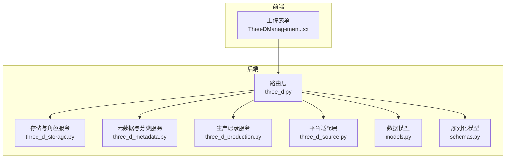
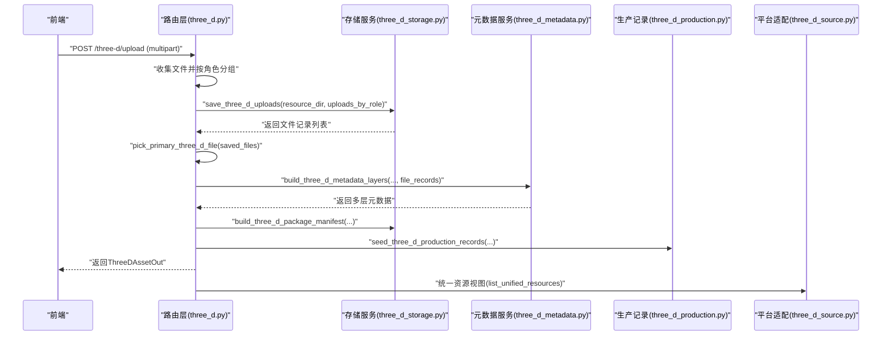
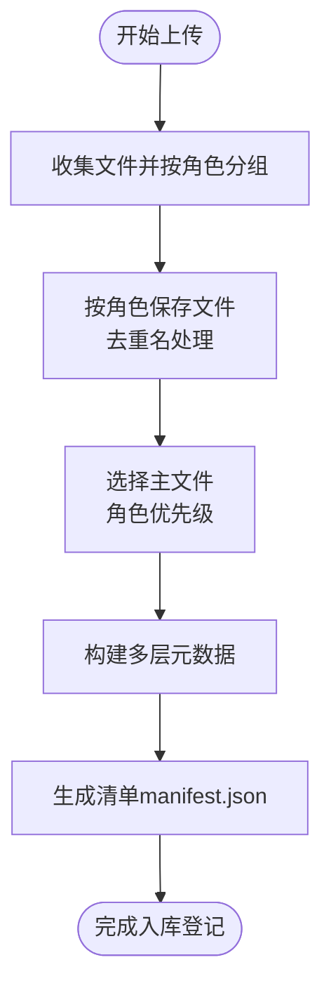
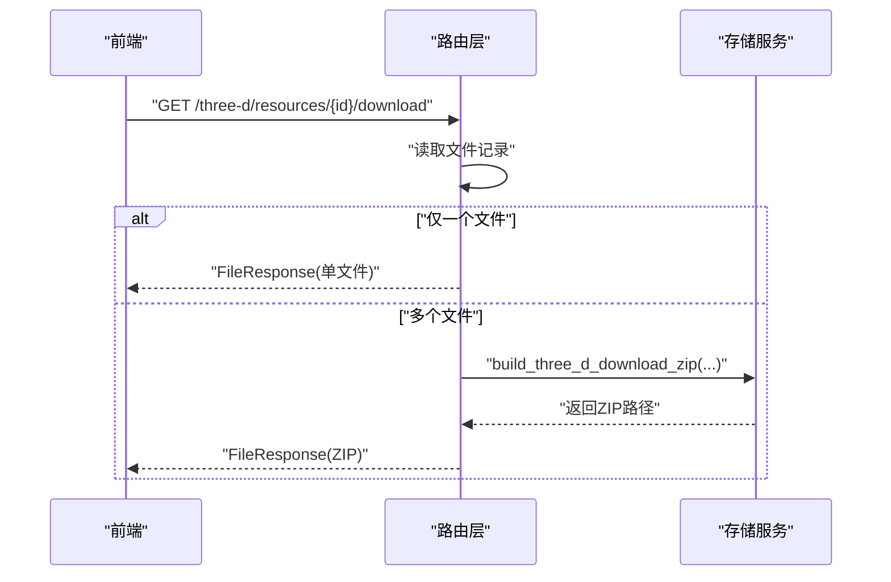
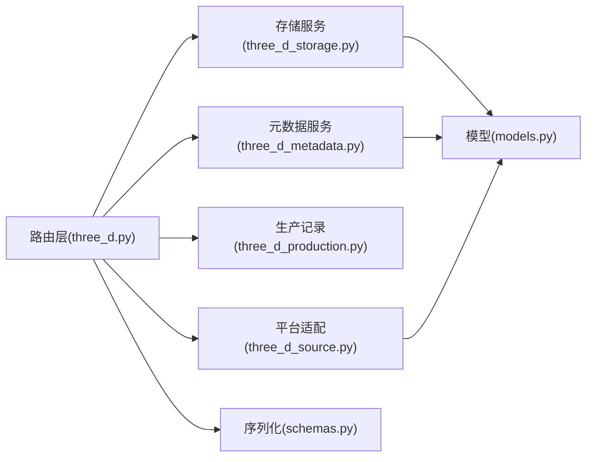

# 多文件资源包

<cite>
**本文引用的文件**
- [three_d.py](file://backend/app/routers/three_d.py)
- [three_d_storage.py](file://backend/app/services/three_d_storage.py)
- [three_d_metadata.py](file://backend/app/services/three_d_metadata.py)
- [three_d_production.py](file://backend/app/services/three_d_production.py)
- [three_d_source.py](file://backend/app/platform/three_d_source.py)
- [models.py](file://backend/app/models.py)
- [schemas.py](file://backend/app/schemas.py)
- [ThreeDManagement.tsx](file://frontend/src/components/ThreeDManagement.tsx)
- [assets.ts](file://frontend/src/types/assets.ts)
- [test_three_d_subsystem.py](file://backend/tests/test_three_d_subsystem.py)
</cite>

## 目录
1. [简介](#简介)
2. [项目结构](#项目结构)
3. [核心组件](#核心组件)
4. [架构总览](#架构总览)
5. [详细组件分析](#详细组件分析)
6. [依赖关系分析](#依赖关系分析)
7. [性能考量](#性能考量)
8. [故障排查指南](#故障排查指南)
9. [结论](#结论)
10. [附录](#附录)

## 简介
本文件面向MDAMS原型项目的“多文件资源包”功能，系统性阐述三维资源的多文件上传机制，覆盖模型文件（model_files）、点云文件（point_cloud_files）、倾斜摄影文件（oblique_files）等不同角色的文件处理；解释文件角色区分、文件关联机制、依赖关系管理（主文件选择、文件优先级、完整性校验）、下载与打包（ZIP压缩、文件清单生成、下载链接管理），并提供上传最佳实践与实际应用场景示例。

## 项目结构
围绕三维资源的多文件上传与管理，后端由路由层、服务层与平台适配层组成，前端提供上传表单与资源列表视图。关键模块如下：
- 后端路由层：负责接收多文件上传请求、解析参数、调用服务层并返回响应
- 服务层：负责文件保存、角色推断、主文件选择、清单构建、打包下载、生产记录
- 平台适配层：统一资源视图与搜索，将三维资源纳入平台目录
- 数据模型与序列化：定义数据库实体、响应结构与统一资源接口

图表来源
- [three_d.py:38-742](file://backend/app/routers/three_d.py#L38-L742)
- [three_d_storage.py:1-226](file://backend/app/services/three_d_storage.py#L1-L226)
- [three_d_metadata.py:1-360](file://backend/app/services/three_d_metadata.py#L1-L360)
- [three_d_production.py:1-95](file://backend/app/services/three_d_production.py#L1-L95)
- [three_d_source.py:1-224](file://backend/app/platform/three_d_source.py#L1-L224)
- [models.py:215-307](file://backend/app/models.py#L215-L307)
- [schemas.py:1-200](file://backend/app/schemas.py#L1-L200)

章节来源
- [three_d.py:38-742](file://backend/app/routers/three_d.py#L38-L742)
- [three_d_storage.py:1-226](file://backend/app/services/three_d_storage.py#L1-L226)
- [three_d_metadata.py:1-360](file://backend/app/services/three_d_metadata.py#L1-L360)
- [three_d_production.py:1-95](file://backend/app/services/three_d_production.py#L1-L95)
- [three_d_source.py:1-224](file://backend/app/platform/three_d_source.py#L1-L224)
- [models.py:215-307](file://backend/app/models.py#L215-L307)
- [schemas.py:1-200](file://backend/app/schemas.py#L1-L200)

## 核心组件
- 上传路由与参数收集：接收多文件上传，按角色分组，推断资源类型与档案类型，写入数据库并触发后续处理
- 存储与角色服务：按角色目录保存文件，去重命名，计算主文件，汇总文件统计
- 元数据与分类服务：根据文件角色、扩展名与字段信息推断档案类型，构建多层元数据
- 生产记录服务：记录入库、保存、清单生成、Web预览、保存层等阶段事件
- 平台适配层：统一资源视图，支持查询、筛选与详情展示
- 数据模型与序列化：定义三维资产、文件记录、生产记录等实体与输出结构

章节来源
- [three_d.py:371-636](file://backend/app/routers/three_d.py#L371-L636)
- [three_d_storage.py:70-125](file://backend/app/services/three_d_storage.py#L70-L125)
- [three_d_metadata.py:228-360](file://backend/app/services/three_d_metadata.py#L228-L360)
- [three_d_production.py:11-95](file://backend/app/services/three_d_production.py#L11-L95)
- [three_d_source.py:56-158](file://backend/app/platform/three_d_source.py#L56-L158)
- [models.py:215-307](file://backend/app/models.py#L215-L307)
- [schemas.py:113-144](file://backend/app/schemas.py#L113-L144)

## 架构总览
下图展示一次多文件资源包上传的关键流程：前端提交multipart表单，后端路由解析参数与文件，按角色保存文件，推断主文件与资源类型，构建元数据与清单，生成下载ZIP，记录生产事件，并返回统一资源视图。

图表来源
- [three_d.py:371-636](file://backend/app/routers/three_d.py#L371-L636)
- [three_d_storage.py:70-125](file://backend/app/services/three_d_storage.py#L70-L125)
- [three_d_metadata.py:228-360](file://backend/app/services/three_d_metadata.py#L228-L360)
- [three_d_production.py:39-95](file://backend/app/services/three_d_production.py#L39-L95)
- [three_d_source.py:70-158](file://backend/app/platform/three_d_source.py#L70-L158)

## 详细组件分析

### 文件角色与处理差异
- 角色定义与映射
  - 模型：glb/gltf/obj/fbx/stl/usdz
  - 点云：ply/las/laz/xyz/pts
  - 倾斜摄影：jpg/jpeg/png/tif/tiff/bmp
  - 贴图：texture/textures
  - 辅助文件：support/aux/auxiliary
  - 其他：other
- 角色推断规则
  - 显式传参：profile_key
  - 多角色：自动识别为“三维资源包”
  - 单角色：按角色确定资源类型
  - 扩展名：根据文件名扩展名推断
  - 字段：根据元数据字段推断
- 角色优先级与主文件选择
  - 主文件优先级：model > point_cloud > oblique_photo > texture > support > other
  - 若无主文件，则取第一个文件作为主文件

章节来源
- [three_d_storage.py:26-61](file://backend/app/services/three_d_storage.py#L26-L61)
- [three_d_storage.py:118-125](file://backend/app/services/three_d_storage.py#L118-L125)
- [three_d_metadata.py:172-226](file://backend/app/services/three_d_metadata.py#L172-L226)

### 文件上传与保存流程
- 参数收集
  - 支持单文件与多文件上传，分别映射到model_files、point_cloud_files、oblique_files
  - 若未提供任何文件，返回错误
- 角色分组与保存
  - 按固定顺序遍历角色，逐个保存到对应子目录
  - 文件名冲突时自动加序号后缀
  - 记录每个文件的角色、原始名、实际名、路径、大小、MIME类型、排序与是否主文件
- 主文件选择
  - 依据角色优先级选择主文件，若无匹配则取第一个文件
- 清单与元数据
  - 构建manifest.json，包含资源ID、标题、类型、文件数、文件清单与元数据层
  - 构建多层元数据（core/management/technical/profile/preservation/raw_metadata）

图表来源
- [three_d.py:412-636](file://backend/app/routers/three_d.py#L412-L636)
- [three_d_storage.py:70-125](file://backend/app/services/three_d_storage.py#L70-L125)
- [three_d_metadata.py:228-360](file://backend/app/services/three_d_metadata.py#L228-L360)

章节来源
- [three_d.py:412-636](file://backend/app/routers/three_d.py#L412-L636)
- [three_d_storage.py:70-125](file://backend/app/services/three_d_storage.py#L70-L125)

### 文件关联机制与资源包组织
- 资源组与版本
  - 资源组：用于将同一数字对象的多个版本或相关文件归组
  - 版本号与顺序：支持多版本管理，标记当前版本
- 文件清单与主文件
  - 清单包含所有文件的元信息，主文件用于Web预览与默认展示
  - 技术层记录文件数量、文件组统计、主文件角色与角色汇总
- 平台统一视图
  - 将三维资源纳入统一资源目录，支持按类型、状态、预览状态筛选

章节来源
- [three_d.py:486-636](file://backend/app/routers/three_d.py#L486-L636)
- [three_d_metadata.py:251-347](file://backend/app/services/three_d_metadata.py#L251-L347)
- [three_d_source.py:70-158](file://backend/app/platform/three_d_source.py#L70-L158)

### 依赖关系管理
- 主文件选择策略
  - 优先角色：model > point_cloud > oblique_photo > texture > support > other
  - 若存在is_primary标记且角色一致，则优先使用该文件
- 文件完整性与一致性
  - 保存时记录文件大小、MIME类型与路径
  - 清单与数据库记录保持一致，便于下载与预览
- Web预览与保存层
  - Web预览状态与保存状态在生产记录中登记，影响统一视图中的预览开关

章节来源
- [three_d_storage.py:118-125](file://backend/app/services/three_d_storage.py#L118-L125)
- [three_d_production.py:39-95](file://backend/app/services/three_d_production.py#L39-L95)

### 下载与打包
- 单文件下载
  - 若仅有一个文件，直接返回该文件
- 多文件打包下载
  - 生成ZIP，按角色/实际文件名组织
  - ZIP内文件路径形如“role/actual_filename”
- 清单与下载链接
  - 清单文件与下载链接在统一资源视图中暴露

图表来源
- [three_d.py:689-707](file://backend/app/routers/three_d.py#L689-L707)
- [three_d_storage.py:212-220](file://backend/app/services/three_d_storage.py#L212-L220)

章节来源
- [three_d.py:689-707](file://backend/app/routers/three_d.py#L689-L707)
- [three_d_storage.py:212-220](file://backend/app/services/three_d_storage.py#L212-L220)

### 前端上传与展示
- 上传表单
  - 分别选择模型、点云、倾斜摄影文件，支持多选
  - 表单字段涵盖标题、资源组、版本、Web预览、项目信息、藏品对象关联等
- 列表与详情
  - 按资源组聚合展示，支持查看版本详情、下载当前版、删除
  - 详情页展示文件清单、主文件、文件组统计与打包下载入口

章节来源
- [ThreeDManagement.tsx:213-248](file://frontend/src/components/ThreeDManagement.tsx#L213-L248)
- [ThreeDManagement.tsx:733-762](file://frontend/src/components/ThreeDManagement.tsx#L733-L762)
- [assets.ts:488-543](file://frontend/src/types/assets.ts#L488-L543)

## 依赖关系分析
- 路由层依赖存储、元数据、生产记录与平台适配服务
- 存储服务依赖角色映射与文件系统
- 元数据服务依赖角色映射与文件记录
- 平台适配层依赖统一资源接口与元数据层
- 数据模型支撑文件记录、资产与生产记录

图表来源
- [three_d.py:27-36](file://backend/app/routers/three_d.py#L27-L36)
- [three_d_storage.py:1-12](file://backend/app/services/three_d_storage.py#L1-L12)
- [three_d_metadata.py:7-8](file://backend/app/services/three_d_metadata.py#L7-L8)
- [three_d_production.py:6-9](file://backend/app/services/three_d_production.py#L6-L9)
- [three_d_source.py:8-13](file://backend/app/platform/three_d_source.py#L8-L13)
- [models.py:215-307](file://backend/app/models.py#L215-L307)
- [schemas.py:1-20](file://backend/app/schemas.py#L1-L20)

章节来源
- [three_d.py:27-36](file://backend/app/routers/three_d.py#L27-L36)
- [three_d_storage.py:1-12](file://backend/app/services/three_d_storage.py#L1-L12)
- [three_d_metadata.py:7-8](file://backend/app/services/three_d_metadata.py#L7-L8)
- [three_d_production.py:6-9](file://backend/app/services/three_d_production.py#L6-L9)
- [three_d_source.py:8-13](file://backend/app/platform/three_d_source.py#L8-L13)
- [models.py:215-307](file://backend/app/models.py#L215-L307)
- [schemas.py:1-20](file://backend/app/schemas.py#L1-L20)

## 性能考量
- 上传性能
  - 使用异步分块读取，避免大文件阻塞
  - 按角色顺序保存，减少IO竞争
- 存储与打包
  - ZIP压缩采用默认压缩级别，兼顾速度与体积
  - 清单与文件记录分离，便于快速查询与下载
- 查询与展示
  - 平台适配层支持按条件筛选与分页，降低前端压力

[本节为通用指导，无需特定文件引用]

## 故障排查指南
- 上传失败
  - 未提供任何文件：检查前端是否选择了至少一种文件
  - 文件保存失败：确认磁盘空间与权限，检查文件名冲突处理逻辑
- 下载异常
  - 单文件下载404：确认文件路径是否存在
  - 多文件ZIP为空：检查文件记录是否正确写入
- 预览不可用
  - Web预览状态非“ready”：检查生产记录与预览状态登记
- 角色识别错误
  - 扩展名不在支持列表：确认文件扩展名与角色映射
  - 多角色但未显式指定profile_key：系统会自动识别为“三维资源包”，可通过参数修正

章节来源
- [three_d.py:412-418](file://backend/app/routers/three_d.py#L412-L418)
- [three_d_storage.py:212-220](file://backend/app/services/three_d_storage.py#L212-L220)
- [three_d_production.py:39-95](file://backend/app/services/three_d_production.py#L39-L95)

## 结论
多文件资源包通过明确的角色划分、严格的主文件选择策略与完善的元数据/清单体系，实现了三维资源的高效入库、统一管理与便捷下载。前端上传表单与平台适配层进一步提升了用户体验与跨系统集成能力。建议在实际应用中结合业务需求合理设置版本与资源组，规范文件命名与扩展名，以获得更佳的系统表现与维护体验。

[本节为总结，无需特定文件引用]

## 附录

### 文件上传最佳实践
- 文件格式支持
  - 模型：glb/gltf/obj/fbx/stl/usdz
  - 点云：ply/las/laz/xyz/pts
  - 倾斜摄影：jpg/jpeg/png/tif/tiff/bmp
  - 辅助文件：zip等
- 大小限制与优化
  - 建议单文件不超过1GB，避免长时间上传与内存占用
  - 多文件打包下载时注意ZIP体积控制
- 上传流程优化
  - 前端预检：在上传前进行文件类型与大小校验
  - 后端幂等：利用去重名机制避免重复文件
  - 元数据补充：尽量提供标题、资源组、版本、项目信息等字段

章节来源
- [ThreeDManagement.tsx:733-762](file://frontend/src/components/ThreeDManagement.tsx#L733-L762)
- [three_d_storage.py:49-60](file://backend/app/services/three_d_storage.py#L49-L60)

### 实际应用场景示例
- 三维模型资源包
  - 包含glb模型文件与贴图，系统识别为“三维模型”，主文件为模型文件
- 点云资源包
  - 包含ply点云文件与纹理，系统识别为“点云”，主文件为点云文件
- 倾斜摄影资源包
  - 包含多张倾斜摄影图像与辅助文件，系统识别为“三维资源包”，主文件为模型或图像
- 藏品对象关联
  - 可通过collection_object_id或对象编号/名称关联到藏品对象，实现强关联管理

章节来源
- [test_three_d_subsystem.py:72-103](file://backend/tests/test_three_d_subsystem.py#L72-L103)
- [three_d.py:476-484](file://backend/app/routers/three_d.py#L476-L484)