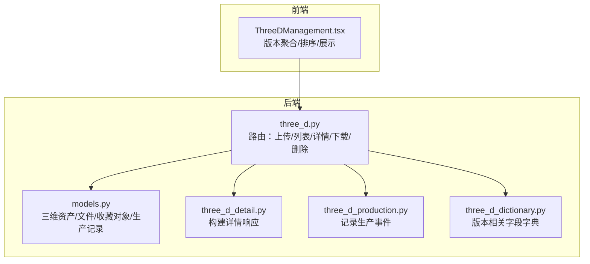
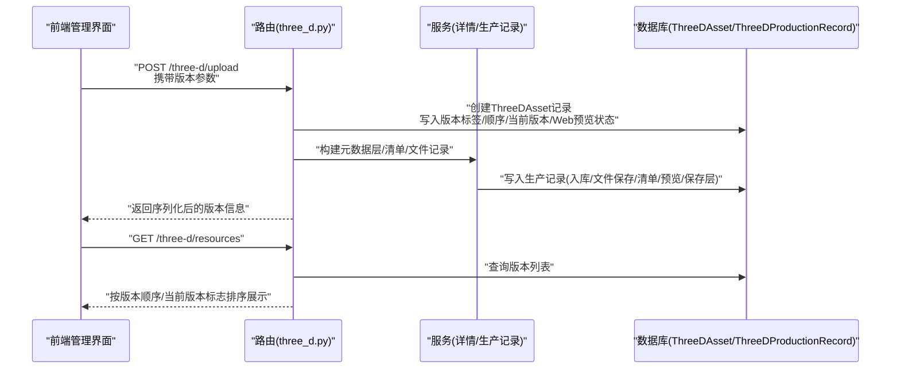
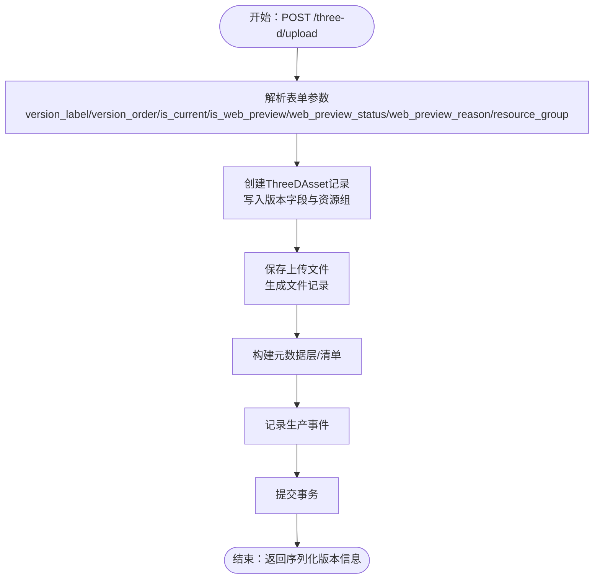
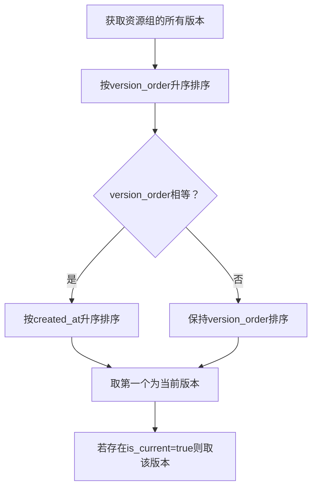
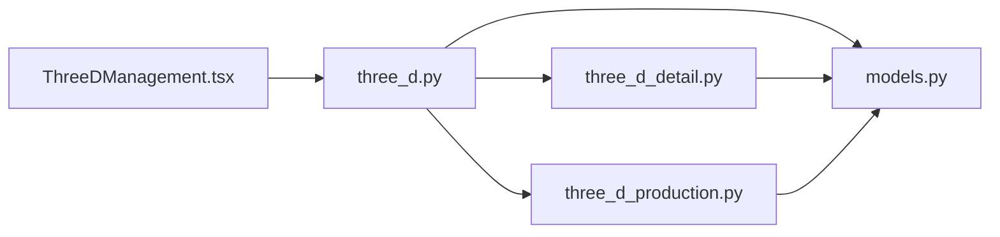

# 对象版本管理

<cite>
**本文引用的文件**
- [models.py](file://backend/app/models.py)
- [schemas.py](file://backend/app/schemas.py)
- [three_d.py](file://backend/app/routers/three_d.py)
- [three_d_detail.py](file://backend/app/services/three_d_detail.py)
- [three_d_production.py](file://backend/app/services/three_d_production.py)
- [three_d_dictionary.py](file://backend/app/services/three_d_dictionary.py)
- [test_three_d_subsystem.py](file://backend/tests/test_three_d_subsystem.py)
- [ThreeDManagement.tsx](file://frontend/src/components/ThreeDManagement.tsx)
</cite>

## 目录
1. [简介](#简介)
2. [项目结构](#项目结构)
3. [核心组件](#核心组件)
4. [架构总览](#架构总览)
5. [详细组件分析](#详细组件分析)
6. [依赖分析](#依赖分析)
7. [性能考虑](#性能考虑)
8. [故障排查指南](#故障排查指南)
9. [结论](#结论)
10. [附录](#附录)

## 简介
本文件面向MDAMS原型项目的三维对象版本管理功能，系统性阐述版本控制机制、版本创建流程、版本切换与当前版本标识、版本比较与历史追踪、版本合并与升级流程、最佳实践与命名规范，以及实际API调用示例与应用场景。文档基于仓库中现有的三层模型（数据库模型）、服务层（详情构建、生产记录、元数据字典）与路由层（上传、查询、下载、删除）进行深入分析，并结合前端管理界面的排序与展示逻辑，帮助读者全面理解三维对象版本管理的实现与使用。

## 项目结构
围绕三维对象版本管理的关键代码分布在以下模块：
- 数据模型层：定义三维资产、文件、收藏对象及生产记录等实体，包含版本相关字段（版本标签、版本顺序、当前版本标志、Web预览状态等）
- 服务层：负责构建三维详情响应、记录生产事件、生成元数据字典
- 路由层：提供三维资源的上传、列表、详情、下载、删除等API，接收表单参数并持久化版本信息
- 前端管理界面：按资源组聚合展示版本，支持排序、筛选与当前版本/Web预览版本的识别

图表来源
- [models.py:215-255](file://backend/app/models.py#L215-L255)
- [three_d.py:371-636](file://backend/app/routers/three_d.py#L371-L636)
- [three_d_detail.py:97-200](file://backend/app/services/three_d_detail.py#L97-L200)
- [three_d_production.py:39-95](file://backend/app/services/three_d_production.py#L39-L95)
- [three_d_dictionary.py:10-28](file://backend/app/services/three_d_dictionary.py#L10-L28)
- [ThreeDManagement.tsx:256-324](file://frontend/src/components/ThreeDManagement.tsx#L256-L324)

章节来源
- [models.py:215-255](file://backend/app/models.py#L215-L255)
- [three_d.py:371-636](file://backend/app/routers/three_d.py#L371-L636)
- [three_d_detail.py:97-200](file://backend/app/services/three_d_detail.py#L97-L200)
- [three_d_production.py:39-95](file://backend/app/services/three_d_production.py#L39-L95)
- [three_d_dictionary.py:10-28](file://backend/app/services/three_d_dictionary.py#L10-L28)
- [ThreeDManagement.tsx:256-324](file://frontend/src/components/ThreeDManagement.tsx#L256-L324)

## 核心组件
- 三维资产模型（ThreeDAsset）：包含版本标签、版本顺序、当前版本标志、Web预览相关字段、资源组等，用于标识同一数字对象的不同版本
- 三维详情服务（build_three_d_detail_response）：将资产、文件、收藏对象、生产记录、技术元数据等整合为统一的详情响应，包含版本信息
- 生产记录服务（seed_three_d_production_records）：在入库、文件保存、清单生成、Web预览登记、保存层登记等阶段记录事件
- 元数据字典（ThreeDMetadataDictionaryResponse）：定义版本相关字段（版本号、版本顺序、允许Web展示、Web展示状态等）及其描述
- 三维路由（upload_three_d_resource）：接收表单参数（版本标签、版本顺序、当前版本标志、Web预览状态等），创建版本并持久化

章节来源
- [models.py:215-255](file://backend/app/models.py#L215-L255)
- [three_d_detail.py:97-200](file://backend/app/services/three_d_detail.py#L97-L200)
- [three_d_production.py:39-95](file://backend/app/services/three_d_production.py#L39-L95)
- [three_d_dictionary.py:10-28](file://backend/app/services/three_d_dictionary.py#L10-L28)
- [three_d.py:371-636](file://backend/app/routers/three_d.py#L371-L636)

## 架构总览
三维对象版本管理贯穿“路由层-服务层-模型层”，形成从请求到持久化的闭环。前端通过API获取版本列表与详情，依据版本顺序与当前版本标志进行展示与排序。

图表来源
- [three_d.py:371-636](file://backend/app/routers/three_d.py#L371-L636)
- [three_d_detail.py:97-200](file://backend/app/services/three_d_detail.py#L97-L200)
- [three_d_production.py:39-95](file://backend/app/services/three_d_production.py#L39-L95)
- [models.py:215-255](file://backend/app/models.py#L215-L255)

## 详细组件分析

### 版本标签与版本顺序的设计理念
- 版本标签（version_label）：用于人类可读的版本标识，如“original”、“v1”、“v2”等，便于快速识别版本
- 版本顺序（version_order）：用于精确排序，确保版本在时间轴上的正确排列，支持同一批次内多版本的精细排序
- 设计要点：
  - version_label用于展示与检索友好性
  - version_order用于程序化排序与一致性
  - 两者共同保证“可读性+可排序性”的平衡

章节来源
- [three_d_dictionary.py:19-20](file://backend/app/services/three_d_dictionary.py#L19-L20)
- [models.py:229-230](file://backend/app/models.py#L229-L230)
- [three_d.py:390-391](file://backend/app/routers/three_d.py#L390-L391)

### 版本创建流程（表单参数与持久化）
- 表单参数（来自上传接口）：
  - version_label：版本标签
  - version_order：版本顺序
  - is_current：是否为当前版本
  - is_web_preview：是否允许Web展示
  - web_preview_status：Web展示状态（ready/pending/disabled）
  - web_preview_reason：Web展示原因
  - resource_group：资源组（同一数字对象的版本集合标识）
- 创建流程：
  - 路由接收参数，构造ThreeDAsset记录
  - 写入版本标签、版本顺序、当前版本标志、Web预览状态等
  - 保存文件记录、生成清单、构建元数据层
  - 记录生产事件（入库、文件保存、清单生成、Web预览登记、保存层登记）

图表来源
- [three_d.py:371-636](file://backend/app/routers/three_d.py#L371-L636)
- [three_d_production.py:39-95](file://backend/app/services/three_d_production.py#L39-L95)

章节来源
- [three_d.py:371-636](file://backend/app/routers/three_d.py#L371-L636)
- [three_d_production.py:39-95](file://backend/app/services/three_d_production.py#L39-L95)

### 版本切换机制（is_current标志）
- 当前版本由is_current标志标识，前端在聚合同一资源组的版本时，会优先选择is_current为真者作为当前版本
- 排序规则：
  - 首先按version_order升序
  - 若version_order相同，则按创建时间created_at升序
- 前端逻辑：
  - 对每个资源组内的版本进行排序
  - 优先取is_current为真的版本，否则取最新版本

图表来源
- [ThreeDManagement.tsx:297-304](file://frontend/src/components/ThreeDManagement.tsx#L297-L304)
- [models.py:230](file://backend/app/models.py#L230)

章节来源
- [ThreeDManagement.tsx:297-304](file://frontend/src/components/ThreeDManagement.tsx#L297-L304)
- [models.py:230](file://backend/app/models.py#L230)

### 版本比较与历史追踪
- 历史追踪：
  - 通过ThreeDProductionRecord记录关键事件（入库、文件保存、清单生成、Web预览登记、保存层登记），形成版本生命周期轨迹
- 版本比较：
  - 前端按version_order与created_at对版本进行排序，便于对比不同版本的差异
  - 详情页提供文件结构、技术元数据、Web预览状态等，辅助判断版本差异
- 注意：
  - 代码中未提供专门的“版本差异对比API”，版本差异分析主要依赖前端排序与详情页字段对比

章节来源
- [three_d_production.py:39-95](file://backend/app/services/three_d_production.py#L39-L95)
- [three_d_detail.py:97-200](file://backend/app/services/three_d_detail.py#L97-L200)
- [ThreeDManagement.tsx:297-304](file://frontend/src/components/ThreeDManagement.tsx#L297-L304)

### 版本合并与升级流程（继承关系与元数据传递）
- 资源组（resource_group）用于标识同一数字对象的版本集合，不同版本共享同一资源组，便于在UI层面进行版本聚合与对比
- 元数据传递：
  - 上传时将版本标签、版本顺序、当前版本标志、Web预览状态等写入ThreeDAsset
  - 详情构建时将这些字段纳入响应，供前端展示与排序
- 合并/升级：
  - 代码中未提供专门的“版本合并/升级API”，通常通过创建新版本（新版本号/新版本顺序）并设置is_current为真来实现“升级”
  - 前端在资源组内根据version_order与is_current选择当前版本

章节来源
- [models.py:220](file://backend/app/models.py#L220)
- [three_d.py:486-506](file://backend/app/routers/three_d.py#L486-L506)
- [three_d_detail.py:193-199](file://backend/app/services/three_d_detail.py#L193-L199)
- [ThreeDManagement.tsx:297-304](file://frontend/src/components/ThreeDManagement.tsx#L297-L304)

### 版本管理最佳实践
- 版本命名规范：
  - 使用语义化标签（如“original”、“v1”、“v2”等），避免使用无意义的数字或日期
  - 保持版本标签在资源组内的一致性与可读性
- 版本生命周期管理：
  - 仅保留必要的历史版本，避免版本过多导致管理复杂
  - 对不再使用的旧版本及时归档或清理
- 当前版本与Web预览：
  - 严格控制is_current与web_preview_status，确保当前版本具备正确的展示状态
  - 对于需要对外展示的版本，设置is_web_preview为真且web_preview_status为“ready”

章节来源
- [three_d_dictionary.py:19-22](file://backend/app/services/three_d_dictionary.py#L19-L22)
- [three_d.py:496-504](file://backend/app/routers/three_d.py#L496-L504)
- [ThreeDManagement.tsx:38-48](file://frontend/src/components/ThreeDManagement.tsx#L38-L48)

### API调用示例与应用场景
- 上传三维资源（创建新版本）
  - 方法：POST /three-d/upload
  - 参数：version_label、version_order、is_current、is_web_preview、web_preview_status、web_preview_reason、resource_group等
  - 应用场景：首次入库、版本升级、Web预览版本创建
- 获取版本列表
  - 方法：GET /three-d/resources
  - 应用场景：管理界面按资源组聚合展示版本，前端按version_order与is_current排序
- 获取版本详情
  - 方法：GET /three-d/resources/{resource_id}
  - 应用场景：查看版本文件结构、技术元数据、Web预览状态
- 下载版本文件
  - 方法：GET /three-d/resources/{resource_id}/download 或 GET /three-d/resources/{resource_id}/files/{file_id}
  - 应用场景：导出当前版本或特定文件
- 删除版本
  - 方法：DELETE /three-d/resources/{resource_id}
  - 应用场景：清理不再需要的历史版本

章节来源
- [three_d.py:371-636](file://backend/app/routers/three_d.py#L371-L636)
- [three_d.py:664-741](file://backend/app/routers/three_d.py#L664-L741)
- [test_three_d_subsystem.py:36-134](file://backend/tests/test_three_d_subsystem.py#L36-L134)

## 依赖分析
- 模型层依赖：ThreeDAsset包含版本相关字段，ThreeDProductionRecord记录版本生命周期事件
- 服务层依赖：详情服务依赖模型与文件记录，生产记录服务依赖模型与数据库会话
- 路由层依赖：上传路由依赖服务层与配置，查询路由依赖权限与模型查询
- 前端依赖：管理界面依赖路由返回的版本数据，按version_order与is_current进行排序与展示

图表来源
- [three_d.py:371-636](file://backend/app/routers/three_d.py#L371-L636)
- [three_d_detail.py:97-200](file://backend/app/services/three_d_detail.py#L97-L200)
- [three_d_production.py:39-95](file://backend/app/services/three_d_production.py#L39-L95)
- [models.py:215-255](file://backend/app/models.py#L215-L255)
- [ThreeDManagement.tsx:256-324](file://frontend/src/components/ThreeDManagement.tsx#L256-L324)

章节来源
- [three_d.py:371-636](file://backend/app/routers/three_d.py#L371-L636)
- [three_d_detail.py:97-200](file://backend/app/services/three_d_detail.py#L97-L200)
- [three_d_production.py:39-95](file://backend/app/services/three_d_production.py#L39-L95)
- [models.py:215-255](file://backend/app/models.py#L215-L255)
- [ThreeDManagement.tsx:256-324](file://frontend/src/components/ThreeDManagement.tsx#L256-L324)

## 性能考虑
- 版本排序与查询：
  - 建议在数据库层面为version_order与created_at建立索引，以提升排序与分页性能
- 文件存储与下载：
  - 多文件版本打包下载时注意I/O开销，建议在路由层对文件数量进行限制与缓存策略
- 生产事件记录：
  - 事件记录频率较高，建议批量提交与异步处理，避免阻塞主流程

## 故障排查指南
- 无法设置当前版本：
  - 检查is_current是否为真，version_order是否正确
  - 前端排序逻辑会优先取is_current为真者，否则取最新版本
- Web预览不可用：
  - 检查is_web_preview与web_preview_status是否为“ready”，文件角色是否包含模型文件
- 版本列表为空：
  - 检查资源组（resource_group）是否正确设置，确保同一数字对象的版本在同一资源组下
- 上传失败：
  - 检查上传文件是否符合角色要求（模型/点云/倾斜摄影），确认表单参数是否正确传入

章节来源
- [ThreeDManagement.tsx:297-304](file://frontend/src/components/ThreeDManagement.tsx#L297-L304)
- [three_d.py:496-504](file://backend/app/routers/three_d.py#L496-L504)
- [three_d_detail.py:182-199](file://backend/app/services/three_d_detail.py#L182-L199)

## 结论
MDAMS原型项目的三维对象版本管理以“资源组聚合+版本标签+版本顺序+当前版本标志+Web预览状态”为核心，实现了版本创建、切换、排序与展示的闭环。通过生产记录服务形成版本生命周期轨迹，前端按version_order与is_current进行排序与展示，满足了版本管理的基本需求。未来可在现有基础上补充版本差异对比与合并升级的专用API，进一步完善版本管理能力。

## 附录
- 版本字段字典（核心元数据）
  - 版本号：用于人类可读的版本标识
  - 版本顺序：用于精确排序
  - 允许Web展示：是否允许作为Web展示版本
  - Web展示状态：ready/pending/disabled
- 测试用例参考
  - 三维资源子系统与平台适配器测试，涵盖版本标签、Web预览状态、文件角色等关键字段

章节来源
- [three_d_dictionary.py:19-22](file://backend/app/services/three_d_dictionary.py#L19-L22)
- [test_three_d_subsystem.py:36-134](file://backend/tests/test_three_d_subsystem.py#L36-L134)