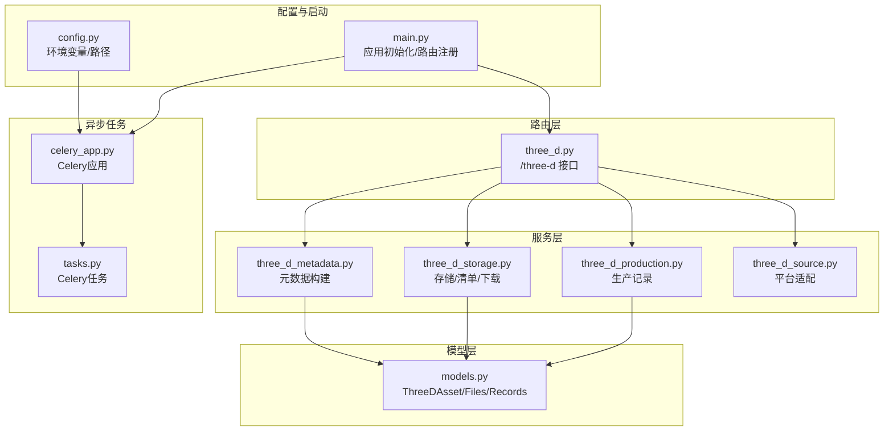
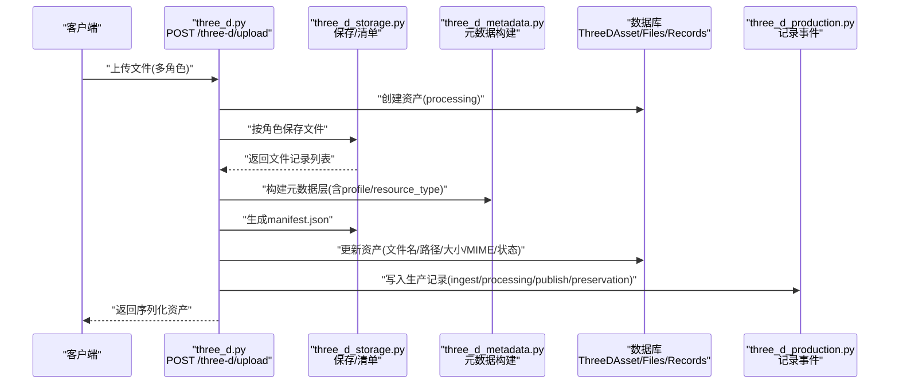
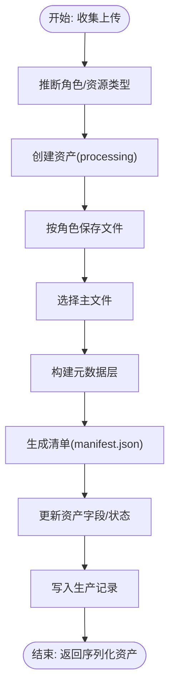
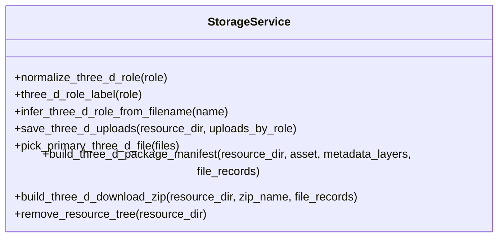
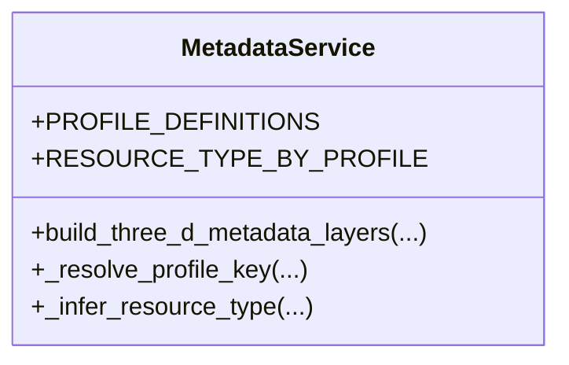
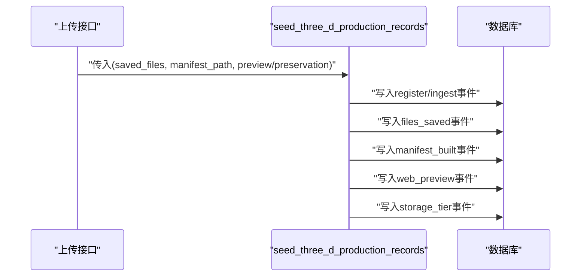
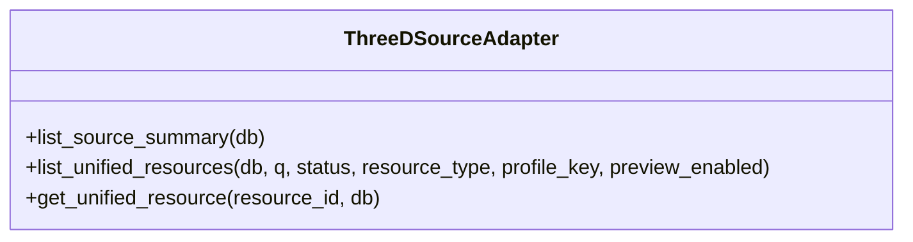
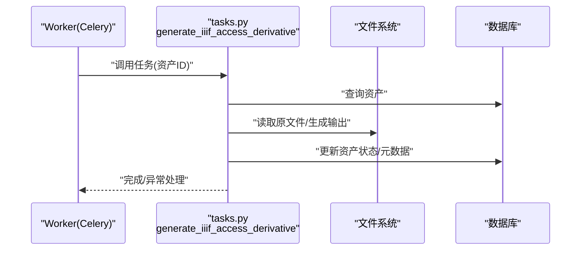
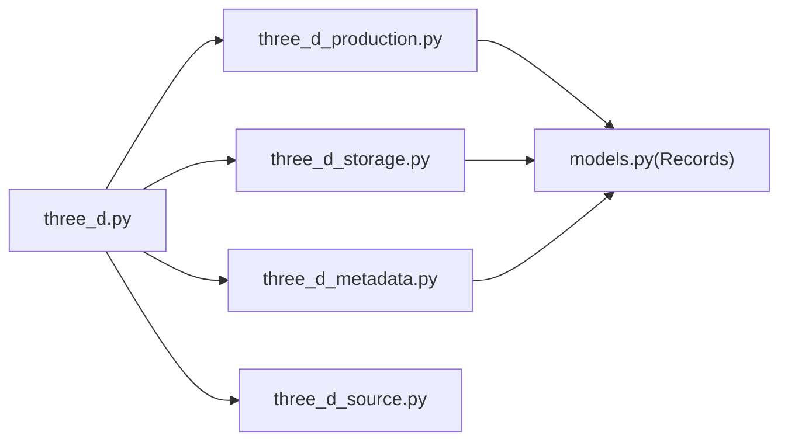
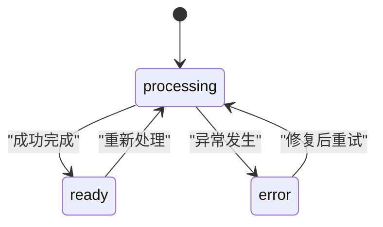

# 生产链路管理

<cite>
**本文引用的文件**
- [backend/app/routers/three_d.py](file://backend/app/routers/three_d.py)
- [backend/app/services/three_d_production.py](file://backend/app/services/three_d_production.py)
- [backend/app/services/three_d_storage.py](file://backend/app/services/three_d_storage.py)
- [backend/app/services/three_d_metadata.py](file://backend/app/services/three_d_metadata.py)
- [backend/app/platform/three_d_source.py](file://backend/app/platform/three_d_source.py)
- [backend/app/models.py](file://backend/app/models.py)
- [backend/app/celery_app.py](file://backend/app/celery_app.py)
- [backend/app/tasks.py](file://backend/app/tasks.py)
- [backend/app/config.py](file://backend/app/config.py)
- [backend/app/main.py](file://backend/app/main.py)
- [backend/tests/test_three_d_production.py](file://backend/tests/test_three_d_production.py)
</cite>

## 目录
1. [引言](#引言)
2. [项目结构](#项目结构)
3. [核心组件](#核心组件)
4. [架构总览](#架构总览)
5. [详细组件分析](#详细组件分析)
6. [依赖分析](#依赖分析)
7. [性能考虑](#性能考虑)
8. [故障排查指南](#故障排查指南)
9. [结论](#结论)
10. [附录](#附录)

## 引言
本文件面向MDAMS原型项目的三维资源生产链路管理，系统性阐述从“上传—入库—处理—发布—归档”的完整生产流程。重点覆盖以下方面：
- 三维资源处理流程：上传、角色分类、清单生成、元数据构建、状态流转与记录。
- 质量检查与合规性：文件完整性、角色推断、格式一致性、派生文件生成。
- 状态管理：processing、ready、error等状态的转换与监控。
- 异步任务：Celery任务在生产链路中的作用与实现。
- 缓存与存储：临时文件、清单、下载打包、清理策略。
- 监控与调试：日志、错误处理、性能观测与测试验证。

## 项目结构
后端采用FastAPI + SQLAlchemy，三维资源子系统位于backend/app下，核心模块包括：
- 路由层：/three-d接口负责上传、查询、下载、删除等入口。
- 服务层：存储、元数据、生产记录、平台适配等服务。
- 模型层：数据库实体定义，含三维资产、文件、集合对象、生产记录。
- 异步任务：Celery应用与任务定义，用于衍生文件生成等耗时操作。
- 配置与启动：环境变量、Redis连接、应用初始化。

**图表来源**
- [backend/app/routers/three_d.py:38-742](file://backend/app/routers/three_d.py#L38-L742)
- [backend/app/services/three_d_production.py:11-95](file://backend/app/services/three_d_production.py#L11-L95)
- [backend/app/services/three_d_storage.py:70-226](file://backend/app/services/three_d_storage.py#L70-L226)
- [backend/app/services/three_d_metadata.py:228-360](file://backend/app/services/three_d_metadata.py#L228-L360)
- [backend/app/platform/three_d_source.py:56-224](file://backend/app/platform/three_d_source.py#L56-L224)
- [backend/app/models.py:215-307](file://backend/app/models.py#L215-L307)
- [backend/app/celery_app.py:1-19](file://backend/app/celery_app.py#L1-L19)
- [backend/app/tasks.py:151-262](file://backend/app/tasks.py#L151-L262)
- [backend/app/config.py:42-46](file://backend/app/config.py#L42-L46)
- [backend/app/main.py:64-86](file://backend/app/main.py#L64-L86)

**章节来源**
- [backend/app/routers/three_d.py:38-742](file://backend/app/routers/three_d.py#L38-L742)
- [backend/app/main.py:64-86](file://backend/app/main.py#L64-L86)

## 核心组件
- 三维资产模型：承载资源基本信息、状态、版本、预览与保存信息。
- 文件模型：记录每个文件的角色、路径、大小、是否主文件等。
- 生产记录模型：记录生产链路各阶段事件，支持审计与监控。
- 存储服务：负责上传文件按角色落盘、清单生成、打包下载、树形清理。
- 元数据服务：根据文件与输入参数推断profile/resource_type，构建多层元数据。
- 平台适配：统一资源视图，支持检索、预览开关、详情链接等。
- 生产记录服务：在关键节点写入生产事件，确保可追溯。
- Celery任务：异步执行衍生文件生成等耗时任务。

**章节来源**
- [backend/app/models.py:215-307](file://backend/app/models.py#L215-L307)
- [backend/app/services/three_d_storage.py:70-226](file://backend/app/services/three_d_storage.py#L70-L226)
- [backend/app/services/three_d_metadata.py:228-360](file://backend/app/services/three_d_metadata.py#L228-L360)
- [backend/app/services/three_d_production.py:11-95](file://backend/app/services/three_d_production.py#L11-L95)
- [backend/app/platform/three_d_source.py:56-224](file://backend/app/platform/three_d_source.py#L56-L224)

## 架构总览
三维资源生产链路由“请求—处理—持久化—记录—返回”组成，关键流程如下：
- 上传接口接收多角色文件，创建资产并进入processing状态。
- 保存文件、推断主文件、构建元数据层、生成清单。
- 更新资产字段（文件名、路径、大小、MIME、状态），写入生产记录。
- 提供下载与查看接口；平台适配统一对外展示。

**图表来源**
- [backend/app/routers/three_d.py:371-636](file://backend/app/routers/three_d.py#L371-L636)
- [backend/app/services/three_d_storage.py:70-226](file://backend/app/services/three_d_storage.py#L70-L226)
- [backend/app/services/three_d_metadata.py:228-360](file://backend/app/services/three_d_metadata.py#L228-L360)
- [backend/app/services/three_d_production.py:11-95](file://backend/app/services/three_d_production.py#L11-L95)
- [backend/app/models.py:215-240](file://backend/app/models.py#L215-L240)

## 详细组件分析

### 上传与入库处理（/three-d/upload）
- 角色收集与推断：根据上传文件与profile_key推断资源类型与profile。
- 资产创建：设置初始状态processing、默认版本与预览标记。
- 文件保存：按角色目录落盘，避免重名冲突，记录实际文件名与大小。
- 主文件选择：优先模型/点云/倾斜摄影，否则取首个文件。
- 元数据构建：合并输入参数与文件信息，推断profile/resource_type。
- 清单生成：写入manifest.json，记录文件与元数据层。
- 数据库更新：更新资产字段与文件明细，写入生产记录。
- 返回序列化结果：包含核心、技术、收藏、保存等元数据层。

**图表来源**
- [backend/app/routers/three_d.py:371-636](file://backend/app/routers/three_d.py#L371-L636)
- [backend/app/services/three_d_storage.py:70-115](file://backend/app/services/three_d_storage.py#L70-L115)
- [backend/app/services/three_d_metadata.py:228-360](file://backend/app/services/three_d_metadata.py#L228-L360)
- [backend/app/services/three_d_production.py:11-95](file://backend/app/services/three_d_production.py#L11-L95)

**章节来源**
- [backend/app/routers/three_d.py:371-636](file://backend/app/routers/three_d.py#L371-L636)

### 存储与清单（three_d_storage）
- 角色标准化与标签：统一模型/点云/倾斜摄影/贴图/辅助/其他。
- 保存逻辑：按角色创建目录，循环写入，自动去重命名。
- 主文件选择：按优先级顺序挑选。
- 清单生成：将文件列表与元数据层写入JSON。
- 下载打包：将多文件按角色打包为ZIP。
- 资源树清理：删除资源目录及其内容。

**图表来源**
- [backend/app/services/three_d_storage.py:26-226](file://backend/app/services/three_d_storage.py#L26-L226)

**章节来源**
- [backend/app/services/three_d_storage.py:70-226](file://backend/app/services/three_d_storage.py#L70-L226)

### 元数据与Profile（three_d_metadata）
- Profile定义：模型、点云、倾斜摄影、资源包、其他，含字段与别名。
- 资源类型映射：根据角色或profile推断资源类型。
- 元数据分层：core、management、collection、technical、profile、preservation、raw_metadata。
- 字段解析：从多处位置查找字段值，统一归一化。
- 主文件与文件组：汇总文件数量与大小，生成角色摘要。

**图表来源**
- [backend/app/services/three_d_metadata.py:30-360](file://backend/app/services/three_d_metadata.py#L30-L360)

**章节来源**
- [backend/app/services/three_d_metadata.py:228-360](file://backend/app/services/three_d_metadata.py#L228-L360)

### 生产记录与状态（three_d_production）
- 事件记录：记录阶段(stage)、事件类型(event_type)、状态(status)、证据(evidence)、元信息(metadata_info)。
- 种子记录：在入库、保存文件、生成清单、发布预览、保存层登记等关键节点写入事件。
- 事件顺序：ingest → processing × 2 → publish → preservation，保证审计顺序。

**图表来源**
- [backend/app/services/three_d_production.py:11-95](file://backend/app/services/three_d_production.py#L11-L95)

**章节来源**
- [backend/app/services/three_d_production.py:11-95](file://backend/app/services/three_d_production.py#L11-L95)
- [backend/tests/test_three_d_production.py:10-50](file://backend/tests/test_three_d_production.py#L10-L50)

### 平台适配（three_d_source）
- 统一资源摘要：统计资源数量、健康度、最后同步时间。
- 资源列表：支持按状态、类型、profile过滤与全文检索。
- 资源详情：返回统一资源详情，包含预览启用判断与链接。
- 预览启用规则：结合core与资产状态综合判定。

**图表来源**
- [backend/app/platform/three_d_source.py:192-224](file://backend/app/platform/three_d_source.py#L192-L224)

**章节来源**
- [backend/app/platform/three_d_source.py:56-224](file://backend/app/platform/three_d_source.py#L56-L224)

### 异步任务与Celery（celery_app与tasks）
- Celery应用：使用Redis作为broker与backend，包含任务模块。
- 任务示例：生成IIIF访问衍生文件、PSB转大图、人脸识别等。
- 错误处理：捕获异常并标记资产错误状态，写入元数据层。

**图表来源**
- [backend/app/celery_app.py:1-19](file://backend/app/celery_app.py#L1-L19)
- [backend/app/tasks.py:151-182](file://backend/app/tasks.py#L151-L182)

**章节来源**
- [backend/app/celery_app.py:1-19](file://backend/app/celery_app.py#L1-L19)
- [backend/app/tasks.py:151-262](file://backend/app/tasks.py#L151-L262)

## 依赖分析
- 路由依赖服务：/three-d/upload直接依赖存储、元数据、生产记录与平台工具。
- 服务内聚：存储与清单、元数据构建、生产记录相互独立，职责清晰。
- 数据模型耦合：资产与文件、集合对象、生产记录通过外键关联。
- 异步解耦：衍生文件生成等耗时任务通过Celery异步执行，避免阻塞请求。

**图表来源**
- [backend/app/routers/three_d.py:27-36](file://backend/app/routers/three_d.py#L27-L36)
- [backend/app/services/three_d_production.py:8-36](file://backend/app/services/three_d_production.py#L8-L36)
- [backend/app/models.py:292-307](file://backend/app/models.py#L292-L307)

**章节来源**
- [backend/app/routers/three_d.py:27-36](file://backend/app/routers/three_d.py#L27-L36)
- [backend/app/models.py:215-307](file://backend/app/models.py#L215-L307)

## 性能考虑
- 上传写入：分角色目录落盘，避免单目录过大；使用分块读写降低内存占用。
- 清单与元数据：仅在关键节点生成与写入，避免重复计算；元数据层结构化便于检索。
- 下载打包：按需压缩，避免不必要的IO；ZIP压缩级别可按需调整。
- 异步任务：将耗时操作放入Celery队列，提升接口响应速度。
- 状态与索引：资产表与文件表建立必要索引，加速查询与排序。

## 故障排查指南
- 上传失败：检查上传目录权限、Redis连接、数据库连接；查看生产记录事件定位问题阶段。
- 清单缺失：确认清单生成函数被调用且路径正确；核对元数据层是否完整。
- 预览不可用：检查web_preview状态与is_web_preview标记；平台适配预览启用逻辑。
- 删除资源：确认资源树清理函数执行；检查文件是否存在。
- Celery任务异常：查看worker日志，确认任务签名与参数；检查Redis可用性。

**章节来源**
- [backend/app/routers/three_d.py:731-742](file://backend/app/routers/three_d.py#L731-L742)
- [backend/app/services/three_d_storage.py:223-226](file://backend/app/services/three_d_storage.py#L223-L226)
- [backend/app/platform/three_d_source.py:46-54](file://backend/app/platform/three_d_source.py#L46-L54)
- [backend/app/tasks.py:175-181](file://backend/app/tasks.py#L175-L181)

## 结论
三维资源生产链路以“上传—处理—记录—发布—归档”为主线，通过角色化存储、结构化元数据与生产记录，实现了可追溯、可监控、可扩展的流水线。异步任务进一步提升了系统吞吐与稳定性。建议在生产环境中强化日志与告警、完善质量检查与合规性规则，并持续优化存储与缓存策略。

## 附录

### 状态管理与转换
- processing：入库处理中，等待文件保存与元数据构建。
- ready：处理完成，可发布与预览。
- error：处理异常，记录错误信息于元数据层。

**图表来源**
- [backend/app/models.py:239-240](file://backend/app/models.py#L239-L240)
- [backend/app/routers/three_d.py:493-495](file://backend/app/routers/three_d.py#L493-L495)

### 质量检查流程
- 文件完整性：保存后统计文件大小与数量，校验清单一致性。
- 角色推断：基于扩展名与profile hint推断角色，避免混杂。
- 元数据一致性：字段存在性与类型校验，统一归一化。
- 预览与发布：预览状态与资源类型联动，确保清单与文件一致。

**章节来源**
- [backend/app/services/three_d_storage.py:118-126](file://backend/app/services/three_d_storage.py#L118-L126)
- [backend/app/services/three_d_metadata.py:172-215](file://backend/app/services/three_d_metadata.py#L172-L215)

### 缓存策略与存储管理
- 临时文件：上传期间按角色落盘，完成后生成清单与下载包。
- 长期存储：清单与文件路径持久化，支持按需下载。
- 清理机制：删除资源时递归删除资源树，避免残留。

**章节来源**
- [backend/app/services/three_d_storage.py:223-226](file://backend/app/services/three_d_storage.py#L223-L226)
- [backend/app/routers/three_d.py:731-742](file://backend/app/routers/three_d.py#L731-L742)

### 监控与调试方法
- 日志记录：Celery任务异常打印与数据库错误回写。
- 错误处理：统一错误状态与消息，便于前端提示。
- 性能监控：关注上传/下载/清单生成耗时，结合队列长度与worker负载。

**章节来源**
- [backend/app/tasks.py:175-181](file://backend/app/tasks.py#L175-L181)
- [backend/app/services/three_d_production.py:23-44](file://backend/app/services/three_d_production.py#L23-L44)

### 配置示例与环境变量
- 数据库与Redis：通过环境变量配置URL。
- 上传目录：指定本地或容器内上传根目录。
- API与Cantaloupe公开地址：用于生成外部可访问链接。

**章节来源**
- [backend/app/config.py:42-46](file://backend/app/config.py#L42-L46)

### 实际应用场景
- 三维模型入库：上传GLB/GLTF/OBJ等模型文件，自动生成清单与元数据，支持Web预览与下载。
- 点云数据处理：上传PLY/LAS等点云文件，记录点数、坐标系、单位等技术字段。
- 倾斜摄影包：上传多张倾斜摄影图像，生成资源包清单与角色摘要。
- 批量导入与导出：通过平台适配统一检索与导出，支持预览启用控制。

**章节来源**
- [backend/app/routers/three_d.py:371-742](file://backend/app/routers/three_d.py#L371-L742)
- [backend/app/platform/three_d_source.py:70-158](file://backend/app/platform/three_d_source.py#L70-L158)