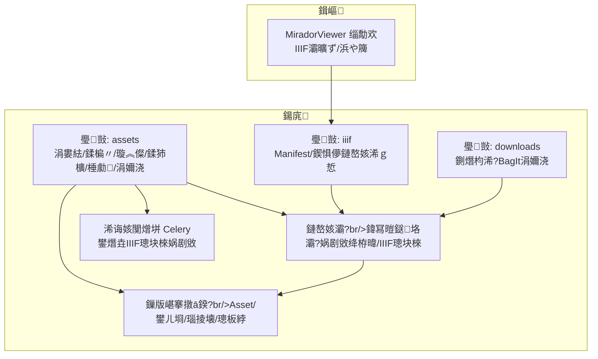
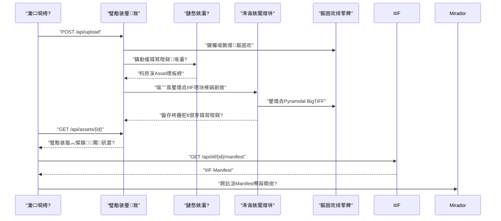
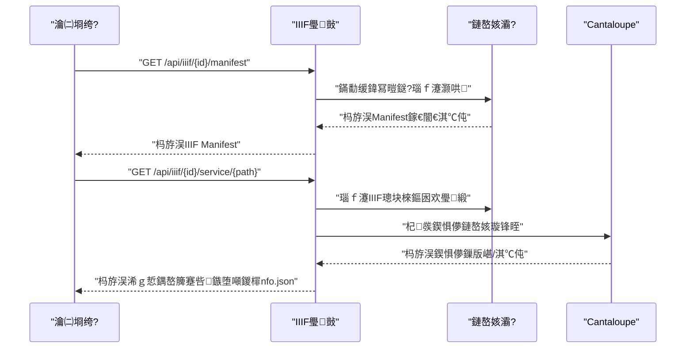
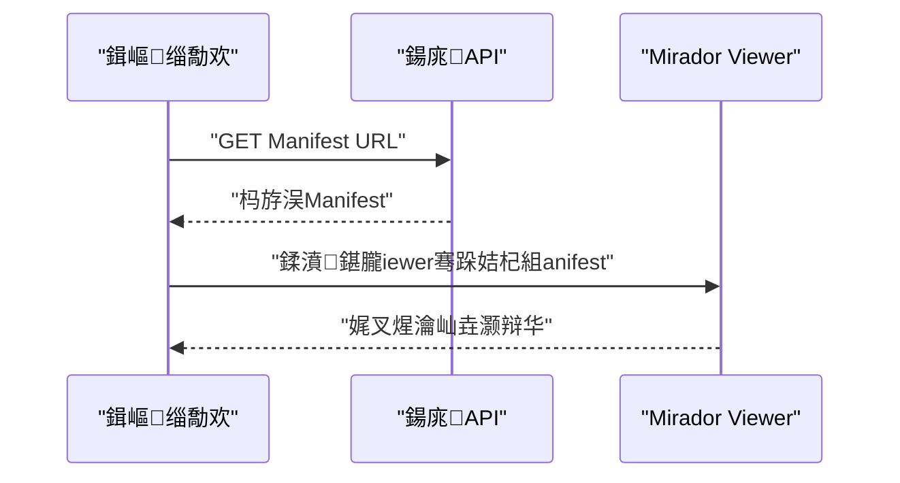

# 浜岀淮璧勪骇绠＄悊

<cite>
**鏈枃寮曠敤鐨勬枃浠?*
- [backend/app/routers/assets.py](file://backend/app/routers/assets.py)
- [backend/app/routers/iiif.py](file://backend/app/routers/iiif.py)
- [backend/app/routers/downloads.py](file://backend/app/routers/downloads.py)
- [backend/app/services/preview_images.py](file://backend/app/services/preview_images.py)
- [backend/app/services/derivative_policy.py](file://backend/app/services/derivative_policy.py)
- [backend/app/services/iiif_access.py](file://backend/app/services/iiif_access.py)
- [backend/app/services/metadata_layers.py](file://backend/app/services/metadata_layers.py)
- [backend/app/tasks.py](file://backend/app/tasks.py)
- [backend/app/models.py](file://backend/app/models.py)
- [backend/app/schemas.py](file://backend/app/schemas.py)
- [frontend/src/MiradorViewer.tsx](file://frontend/src/MiradorViewer.tsx)
- [frontend/src/types/mirador.d.ts](file://frontend/src/types/mirador.d.ts)
- [docs/02-鏋舵瀯璁捐/API_ROUTE_MAP.md](file://docs/02-鏋舵瀯璁捐/API_ROUTE_MAP.md)
- [docs/03-浜у搧涓庢祦绋?OBJECT_PROFILE_RULES.md](file://docs/03-浜у搧涓庢祦绋?OBJECT_PROFILE_RULES.md)
- [docs/04-瀹炴柦鏂规/IMAGE_IIIF_ACCESS_FORMAT_PHASE1_PLAN.md](file://docs/04-瀹炴柦鏂规/IMAGE_IIIF_ACCESS_FORMAT_PHASE1_PLAN.md)
</cite>

## 鐩綍
1. [绠€浠媇(#绠€浠?
2. [椤圭洰缁撴瀯](#椤圭洰缁撴瀯)
3. [鏍稿績缁勪欢](#鏍稿績缁勪欢)
4. [鏋舵瀯鎬昏](#鏋舵瀯鎬昏)
5. [璇︾粏缁勪欢鍒嗘瀽](#璇︾粏缁勪欢鍒嗘瀽)
6. [渚濊禆鍒嗘瀽](#渚濊禆鍒嗘瀽)
7. [鎬ц兘鑰冭檻](#鎬ц兘鑰冭檻)
8. [鏁呴殰鎺掗櫎鎸囧崡](#鏁呴殰鎺掗櫎鎸囧崡)
9. [缁撹](#缁撹)
10. [闄勫綍](#闄勫綍)

## 绠€浠?鏈枃浠堕潰鍚慚DAMS鍘熷瀷椤圭洰鐨勪簩缁磋祫浜х鐞嗗瓙绯荤粺锛岀郴缁熸€ч槓杩颁簩缁磋祫浜х殑鍏ㄧ敓鍛藉懆鏈熺鐞嗭細浠庝笂浼犮€佸瓨鍌ㄣ€佹淳鐢熸枃浠剁敓鎴愩€佹绱€佸睍绀哄埌涓嬭浇銆傞噸鐐硅鐩栦互涓嬫柟闈細
- 璧勪骇涓婁紶锛氭枃浠舵牸寮忎笌澶у皬銆佸苟鍙戝啓鍏ャ€佸厓鏁版嵁鏋勫缓銆佸彲瑙佹€т笌闆嗗悎瀵硅薄鍏宠仈
- 瀛樺偍绛栫暐锛氬師濮嬫枃浠朵笌IIIF璁块棶鏂囦欢鍒嗙銆佹淳鐢熸枃浠剁洰褰曠粨鏋勩€佸厓鏁版嵁鍒嗗眰
- 澶勭悊娴佺▼锛氶瑙堝浘鐢熸垚銆佹淳鐢熸枃浠跺垱寤猴紙Pyramidal BigTIFF锛夈€佸浘鍍忎紭鍖栦笌鏍煎紡杞崲
- 妫€绱笌灞曠ず锛欼IIF Manifest涓庡浘鍍忔湇鍔°€丮irador鏌ョ湅鍣ㄩ泦鎴愩€佺缉鏀句笌骞崇Щ
- 涓嬭浇锛氬師鏂囦欢涓嬭浇銆丅agIt鎵撳寘涓嬭浇
- API鎺ュ彛涓庝娇鐢ㄧず渚嬶細鍩轰簬鐜版湁璺敱涓庢湇鍔＄殑璋冪敤璇存槑

## 椤圭洰缁撴瀯
浜岀淮璧勪骇绠＄悊瀛愮郴缁熺敱鍚庣FastAPI璺敱銆佹湇鍔″眰銆佷换鍔￠槦鍒桟elery銆佹暟鎹簱妯″瀷涓庡墠绔疢irador鏌ョ湅鍣ㄥ叡鍚岀粍鎴愩€傚悗绔矾鐢卞垝鍒嗘竻鏅帮紝鍒嗗埆澶勭悊璧勪骇涓婁紶/鍒楄〃/璇︽儏/鍒犻櫎銆両IIF Manifest涓庡浘鍍忔湇鍔′唬鐞嗐€佷笅杞戒笌BagIt鎵撳寘锛涙湇鍔″眰璐熻矗鍏冩暟鎹垎灞傘€佹淳鐢熸枃浠剁瓥鐣ャ€両IIF璁块棶璺緞瑙ｆ瀽涓庢淳鐢熺敓鎴愶紱鍓嶇閫氳繃Mirador Viewer娑堣垂IIIF Manifest杩涜灞曠ず銆?


鍥捐〃鏉ユ簮
- [backend/app/routers/assets.py](file://backend/app/routers/assets.py)
- [backend/app/routers/iiif.py](file://backend/app/routers/iiif.py)
- [backend/app/routers/downloads.py](file://backend/app/routers/downloads.py)
- [backend/app/services/metadata_layers.py](file://backend/app/services/metadata_layers.py)
- [backend/app/services/iiif_access.py](file://backend/app/services/iiif_access.py)
- [backend/app/tasks.py](file://backend/app/tasks.py)
- [backend/app/models.py](file://backend/app/models.py)
- [frontend/src/MiradorViewer.tsx](file://frontend/src/MiradorViewer.tsx)

绔犺妭鏉ユ簮
- [docs/02-鏋舵瀯璁捐/API_ROUTE_MAP.md](file://docs/02-鏋舵瀯璁捐/API_ROUTE_MAP.md)

## 鏍稿績缁勪欢
- 璧勪骇璺敱锛坅ssets锛夛細鎻愪緵涓婁紶銆佸垪琛ㄣ€佽鎯呫€佸垹闄ゃ€侀瑙堝浘鑾峰彇銆佸師鏂囦欢涓嬭浇銆丅agIt鎵撳寘涓嬭浇绛夋帴鍙?- IIIF璺敱锛坕iif锛夛細鐢熸垚骞朵唬鐞咺IIF Manifest涓庡浘鍍忔湇鍔★紝鏀寔閴存潈涓庡彲瑙佹€ф帶鍒?- 涓嬭浇璺敱锛坉ownloads锛夛細鎻愪緵鍘熸枃浠朵笅杞戒笌BagIt鎵撳寘涓嬭浇
- 鏈嶅姟灞傦細
  - 鍏冩暟鎹垎灞傦紙metadata_layers锛夛細鏋勫缓core/management/technical/profile/raw_metadata浜斿眰鍏冩暟鎹?  - 娲剧敓绛栫暐锛坉erivative_policy锛夛細鏍规嵁鏂囦欢澶у皬涓庡儚绱犻槇鍊煎喅瀹氭槸鍚︾敓鎴怚IIF璁块棶娲剧敓
  - IIIF璁块棶锛坕iif_access锛夛細瑙ｆ瀽鍘熷涓庤闂枃浠惰矾寰勩€佺敓鎴怭yramidal BigTIFF銆佹爣璁拌祫浜х姸鎬?  - 棰勮鍥撅紙preview_images锛夛細鐢熸垚1600瀹絁PEG棰勮锛屾敮鎸乸yvips/Pillow鍙屾爤鍥為€€
- 浠诲姟闃熷垪锛坱asks锛夛細寮傛鐢熸垚IIIF璁块棶娲剧敓锛屽紓甯告椂鏍囪閿欒鐘舵€?- 鏁版嵁妯″瀷锛坢odels锛夛細Asset瀹炰綋鎵胯浇鏂囦欢璺緞銆丮IME銆佸彲瑙佹€с€侀泦鍚堝璞D銆佺姸鎬佷笌鍏冩暟鎹甁SON
- 鍓嶇锛圡iradorViewer锛夛細鍔犺浇IIIF Manifest骞跺湪Mirador涓覆鏌擄紝鏀寔缂╂斁涓庡钩绉?
绔犺妭鏉ユ簮
- [backend/app/routers/assets.py](file://backend/app/routers/assets.py)
- [backend/app/routers/iiif.py](file://backend/app/routers/iiif.py)
- [backend/app/routers/downloads.py](file://backend/app/routers/downloads.py)
- [backend/app/services/metadata_layers.py](file://backend/app/services/metadata_layers.py)
- [backend/app/services/derivative_policy.py](file://backend/app/services/derivative_policy.py)
- [backend/app/services/iiif_access.py](file://backend/app/services/iiif_access.py)
- [backend/app/services/preview_images.py](file://backend/app/services/preview_images.py)
- [backend/app/tasks.py](file://backend/app/tasks.py)
- [backend/app/models.py](file://backend/app/models.py)
- [frontend/src/MiradorViewer.tsx](file://frontend/src/MiradorViewer.tsx)

## 鏋舵瀯鎬昏
浜岀淮璧勪骇绠＄悊閲囩敤鈥滆矾鐢?鏈嶅姟-浠诲姟-瀛樺偍-灞曠ず鈥濈殑鍒嗗眰鏋舵瀯锛?- 璺敱灞傛帴鏀惰姹傚苟杩涜閴存潈涓庡弬鏁版牎楠?- 鏈嶅姟灞傝礋璐ｄ笟鍔￠€昏緫涓庡厓鏁版嵁/娲剧敓绛栫暐璁＄畻
- 浠诲姟闃熷垪寮傛鎵ц鑰楁椂鎿嶄綔锛堝鐢熸垚Pyramidal BigTIFF锛?- 瀛樺偍灞傚寘鍚師濮嬫枃浠朵笌娲剧敓鏂囦欢锛圛IIF璁块棶鏂囦欢銆侀瑙堝浘锛夛紝骞朵互鍏冩暟鎹尯鍒?- 灞曠ず灞傞€氳繃IIIF涓嶮irador瀹屾垚鍥惧儚娴忚浣撻獙



鍥捐〃鏉ユ簮
- [backend/app/routers/assets.py](file://backend/app/routers/assets.py)
- [backend/app/services/metadata_layers.py](file://backend/app/services/metadata_layers.py)
- [backend/app/services/iiif_access.py](file://backend/app/services/iiif_access.py)
- [backend/app/tasks.py](file://backend/app/tasks.py)
- [backend/app/routers/iiif.py](file://backend/app/routers/iiif.py)
- [frontend/src/MiradorViewer.tsx](file://frontend/src/MiradorViewer.tsx)

## 璇︾粏缁勪欢鍒嗘瀽

### 璧勪骇涓婁紶涓庡瓨鍌?- 鎺ュ彛琛屼负
  - 鏀寔澶氶儴鍒嗚〃鍗曚笂浼狅紝瀛楁鍖呮嫭鏂囦欢銆佸彲瑙佹€ц寖鍥淬€侀泦鍚堝璞D
  - 閲囩敤鍒嗗潡璇诲彇锛?4KB锛夊啓鍏ユ湰鍦颁笂浼犵洰褰曪紝閬垮厤涓€娆℃€у唴瀛樺崰鐢ㄨ繃楂?  - 瑙ｆ瀽鍥惧儚灏哄锛堝楂橈級锛屾瀯寤哄厓鏁版嵁鍒嗗眰锛屽寘鍚牳蹇冨瓧娈点€佹妧鏈瓧娈典笌娲剧敓绛栫暐
  - 鑻ュ瓨鍦ㄥ彲鐢ㄧ殑IIIF璁块棶鏂囦欢鍒欑洿鎺ユ爣璁颁负鈥滃氨缁€濓紝鍚﹀垯鏍囪涓衡€滃鐞嗕腑鈥濆苟寮傛鐢熸垚娲剧敓
- 瀛樺偍绛栫暐
  - 鍘熷鏂囦欢瀛樻斁浜嶶PLOAD_DIR锛屾淳鐢熸枃浠朵綅浜巇erivatives瀛愮洰褰?  - 鍏冩暟鎹腑鍖哄垎original_file_path涓巌iif_access_file_path锛岀‘淇滻IIF鍙鍙栬闂枃浠?- 鍙鎬т笌闆嗗悎瀵硅薄
  - 鍙鎬ц寖鍥翠笌闆嗗悎瀵硅薄ID鍙備笌鍚庣画鏉冮檺鍒ゅ畾涓庢绱㈣繃婊?
```mermaid
flowchart TD
Start(["寮€濮? 鎺ユ敹涓婁紶"]) --> Write["鍐欏叆鍘熷鏂囦欢<br/>鍒嗗潡璇诲彇"]
Write --> Parse["瑙ｆ瀽鍥惧儚灏哄"]
Parse --> BuildMeta["鏋勫缓鍏冩暟鎹垎灞?]
BuildMeta --> CheckAccess{"鏄惁瀛樺湪IIIF璁块棶鏂囦欢?"}
CheckAccess --> |鏄瘄 MarkReady["鏍囪涓哄氨缁?]
CheckAccess --> |鍚 MarkPending["鏍囪涓哄鐞嗕腑"]
MarkPending --> AsyncGen["寮傛鐢熸垚IIIF璁块棶娲剧敓"]
MarkReady --> End(["缁撴潫"])
AsyncGen --> End
```

鍥捐〃鏉ユ簮
- [backend/app/routers/assets.py](file://backend/app/routers/assets.py)
- [backend/app/services/iiif_access.py](file://backend/app/services/iiif_access.py)
- [backend/app/tasks.py](file://backend/app/tasks.py)

绔犺妭鏉ユ簮
- [backend/app/routers/assets.py](file://backend/app/routers/assets.py)
- [backend/app/services/metadata_layers.py](file://backend/app/services/metadata_layers.py)
- [backend/app/services/iiif_access.py](file://backend/app/services/iiif_access.py)
- [backend/app/tasks.py](file://backend/app/tasks.py)

### 娲剧敓绛栫暐涓庣敓鎴?- 娲剧敓绛栫暐
  - 鍩轰簬鏂囦欢MIME绫诲瀷/鎵╁睍鍚嶄笌鏂囦欢澶у皬銆佸儚绱犳暟闃堝€艰嚜鍔ㄩ€夋嫨绛栫暐
  - PSB寮哄埗鐢熸垚BigTIFF璁块棶鏂囦欢锛涘ぇ鍨婽IFF鐢熸垚閲戝瓧濉旂摝鐗嘊igTIFF锛涘ぇ鍨婮PEG鍙敓鎴愯交閲忚闂甁PEG
- 鐢熸垚娴佺▼
  - 浣跨敤pyvips鐢熸垚Pyramidal BigTIFF锛圖eflate鍘嬬缉銆?56脳256鐡︾墖銆丅igTIFF锛?  - 鏇存柊璧勪骇鍏冩暟鎹紙璁块棶鏂囦欢璺緞銆丮IME銆佸楂樸€佽浆鎹㈡柟娉曪級锛屽苟灏嗙姸鎬佺疆涓衡€滃氨缁€?- 閿欒澶勭悊
  - 寮傚父鏃舵爣璁拌祫浜х姸鎬佷负鈥渆rror鈥濓紝骞惰褰曢敊璇俊鎭?
```mermaid
flowchart TD
Policy["鎺ㄥ娲剧敓绛栫暐<br/>澶у皬/鍍忕礌闃堝€?MIME绫诲瀷"] --> NeedGen{"闇€瑕佺敓鎴愯闂淳鐢?"}
NeedGen --> |鍚 UseOriginal["榛樿浣跨敤鍘熷鏂囦欢浣滀负璁块棶婧?]
NeedGen --> |鏄瘄 Gen["鐢熸垚Pyramidal BigTIFF<br/>Deflate/鐡︾墖/閲戝瓧濉?BigTIFF"]
Gen --> UpdateMeta["鏇存柊鍏冩暟鎹笌鐘舵€?]
UseOriginal --> Ready["鏍囪灏辩华"]
UpdateMeta --> Ready
```

鍥捐〃鏉ユ簮
- [backend/app/services/derivative_policy.py](file://backend/app/services/derivative_policy.py)
- [backend/app/services/iiif_access.py](file://backend/app/services/iiif_access.py)
- [backend/app/tasks.py](file://backend/app/tasks.py)

绔犺妭鏉ユ簮
- [backend/app/services/derivative_policy.py](file://backend/app/services/derivative_policy.py)
- [backend/app/services/iiif_access.py](file://backend/app/services/iiif_access.py)
- [backend/app/tasks.py](file://backend/app/tasks.py)
- [docs/04-瀹炴柦鏂规/IMAGE_IIIF_ACCESS_FORMAT_PHASE1_PLAN.md](file://docs/04-瀹炴柦鏂规/IMAGE_IIIF_ACCESS_FORMAT_PHASE1_PLAN.md)

### 棰勮鍥剧敓鎴?- 鐢熸垚绛栫暐
  - 浼樺厛浠嶪IIF璁块棶鏂囦欢鐢熸垚锛涜嫢涓嶅瓨鍦ㄥ垯鍥為€€鍒板師濮嬫枃浠?  - 闄愬埗鏈€澶у搴?600鍍忕礌锛孞PEG璐ㄩ噺82锛屾敮鎸侀€忔槑鑳屾櫙鍚堟垚
  - 鍙屾爤鍥為€€锛氫紭鍏坧yvips锛屽け璐ュ洖閫€Pillow
- 瀛樺偍涓庣紦瀛?  - 棰勮鍥句綅浜嶶PLOAD_DIR/previews鐩綍锛屾枃浠跺悕鍖呭惈婧愭枃浠舵寚绾癸紝閬垮厤閲嶅鐢熸垚

```mermaid
flowchart TD
Src["纭畾棰勮婧?br/>IIIF璁块棶/棰勮/鍘熷"] --> Exists{"婧愭枃浠跺瓨鍦?"}
Exists --> |鍚 Fail["杩斿洖绌?]
Exists --> |鏄瘄 Gen["鐢熸垚棰勮鍥?br/>pyvips浼樺厛锛孭illow鍥為€€"]
Gen --> Save["淇濆瓨鑷抽瑙堢洰褰?]
Save --> Done["杩斿洖棰勮璺緞"]
```

鍥捐〃鏉ユ簮
- [backend/app/services/preview_images.py](file://backend/app/services/preview_images.py)

绔犺妭鏉ユ簮
- [backend/app/services/preview_images.py](file://backend/app/services/preview_images.py)

### IIIF Manifest涓庡浘鍍忔湇鍔?- Manifest鐢熸垚
  - 鏍规嵁璧勪骇涓庡厓鏁版嵁鏋勫缓IIIF Presentation 3.0 Manifest锛屽寘鍚獵anvas銆丄nnotation涓嶪mage鏈嶅姟
  - 鏈嶅姟URL鎸囧悜Cantaloupe鍥惧儚鏈嶅姟锛屾敮鎸乮nfo.json涓庣缉鏀捐鍓?- 鍥惧儚鏈嶅姟浠ｇ悊
  - 浠ｇ悊Cantaloupe鐨勫浘鍍忔湇鍔¤姹傦紝蹇呰鏃堕噸鍐檌nfo.json涓殑@id/atId/id涓哄悗绔唬鐞嗗湴鍧€
  - 鏍规嵁璧勪骇鐘舵€佽缃紦瀛樺ご锛屾湭灏辩华鏃剁鐢ㄧ紦瀛?- 鏉冮檺涓庡彲瑙佹€?  - 鍦ㄨ幏鍙朚anifest涓庡浘鍍忔湇鍔″墠杩涜鏉冮檺鏍￠獙涓庡彲瑙佹€ц寖鍥存鏌?


鍥捐〃鏉ユ簮
- [backend/app/routers/iiif.py](file://backend/app/routers/iiif.py)
- [backend/app/services/iiif_access.py](file://backend/app/services/iiif_access.py)
- [backend/app/services/metadata_layers.py](file://backend/app/services/metadata_layers.py)

绔犺妭鏉ユ簮
- [backend/app/routers/iiif.py](file://backend/app/routers/iiif.py)
- [backend/app/services/iiif_access.py](file://backend/app/services/iiif_access.py)
- [backend/app/services/metadata_layers.py](file://backend/app/services/metadata_layers.py)

### 涓嬭浇涓嶣agIt鎵撳寘
- 鍘熸枃浠朵笅杞?  - 鐩存帴杩斿洖鐗╃悊鏂囦欢锛屾枃浠跺悕涓哄疄闄呮枃浠跺悕
- BagIt鎵撳寘涓嬭浇
  - 鐢熸垚鍖呭惈鍘熷鏂囦欢涓庡彲閫塈IIF璁块棶鏂囦欢鐨凚agIt鍖咃紝鍖呭惈manifest-sha256.txt銆乥agit.txt銆乥ag-info.txt
  - 浣跨敤涓存椂鐩綍鐢熸垚ZIP鍚庤繑鍥烇紝骞舵竻鐞嗕复鏃舵枃浠?
```mermaid
flowchart TD
Req["璇锋眰涓嬭浇"] --> Mode{"涓嬭浇妯″紡"}
Mode --> |鍘熸枃浠秥 GetOrig["瀹氫綅鍘熷鏂囦欢璺緞"]
Mode --> |BagIt| MakeBag["鐢熸垚BagIt鍖?br/>manifest/bagit/bag-info"]
GetOrig --> Send["杩斿洖FileResponse"]
MakeBag --> Zip["鍘嬬缉涓篫IP"]
Zip --> Send
```

鍥捐〃鏉ユ簮
- [backend/app/routers/downloads.py](file://backend/app/routers/downloads.py)
- [backend/app/services/iiif_access.py](file://backend/app/services/iiif_access.py)

绔犺妭鏉ユ簮
- [backend/app/routers/downloads.py](file://backend/app/routers/downloads.py)

### 鍓嶇Mirador闆嗘垚
- 鍔犺浇娴佺▼
  - 閫氳繃HTTP GET鍔犺浇IIIF Manifest锛岃В鏋愬厓鏁版嵁锛堣祫浜D銆佽祫婧怚D銆佹爣棰樼瓑锛?  - 鍒濆鍖朚irador Viewer锛屽惎鐢ㄧ缉鏀句笌骞崇Щ鎺т欢
  - 棣栨娓叉煋鏃舵樉绀鸿繘搴︽潯涓庣粺璁′俊鎭紝棣栧紶鐡︾墖娓叉煋瀹屾垚鍚庢爣璁扳€滃氨缁€?- 閴存潈
  - 瀵?api涓?auth璺緞鑷姩闄勫姞Authorization澶达紙Bearer Token锛?


鍥捐〃鏉ユ簮
- [frontend/src/MiradorViewer.tsx](file://frontend/src/MiradorViewer.tsx)
- [frontend/src/types/mirador.d.ts](file://frontend/src/types/mirador.d.ts)

绔犺妭鏉ユ簮
- [frontend/src/MiradorViewer.tsx](file://frontend/src/MiradorViewer.tsx)
- [frontend/src/types/mirador.d.ts](file://frontend/src/types/mirador.d.ts)

## 渚濊禆鍒嗘瀽
- 璺敱鍒版湇鍔?  - 璧勪骇璺敱渚濊禆鍏冩暟鎹垎灞備笌IIIF璁块棶鏈嶅姟锛岃Е鍙慍elery浠诲姟
  - IIIF璺敱渚濊禆鍏冩暟鎹垎灞備笌IIIF璁块棶鏈嶅姟锛屼唬鐞咰antaloupe
  - 涓嬭浇璺敱渚濊禆IIIF璁块棶鏈嶅姟瑙ｆ瀽涓绘枃浠惰矾寰?- 鏈嶅姟鍒版ā鍨?  - 鎵€鏈夋湇鍔″潎璇诲啓Asset鍏冩暟鎹甁SON锛岄伒寰猚ore/management/technical/profile/raw_metadata鍒嗗眰
- 浠诲姟鍒版湇鍔?  - Celery浠诲姟璋冪敤IIIF璁块棶鏈嶅姟鐢熸垚Pyramidal BigTIFF骞舵洿鏂扮姸鎬?
```mermaid
graph LR
Assets["璧勪骇璺敱"] --> Meta["鍏冩暟鎹垎灞?]
Assets --> IIIFSvc["IIIF璁块棶"]
Assets --> Celery["Celery浠诲姟"]
IIIFRoute["IIIF璺敱"] --> Meta
IIIFRoute --> IIIFSvc
Downloads["涓嬭浇璺敱"] --> IIIFSvc
Celery --> IIIFSvc
Meta --> Models["鏁版嵁搴撴ā鍨?]
IIIFSvc --> Models
```

鍥捐〃鏉ユ簮
- [backend/app/routers/assets.py](file://backend/app/routers/assets.py)
- [backend/app/routers/iiif.py](file://backend/app/routers/iiif.py)
- [backend/app/routers/downloads.py](file://backend/app/routers/downloads.py)
- [backend/app/services/metadata_layers.py](file://backend/app/services/metadata_layers.py)
- [backend/app/services/iiif_access.py](file://backend/app/services/iiif_access.py)
- [backend/app/tasks.py](file://backend/app/tasks.py)
- [backend/app/models.py](file://backend/app/models.py)

绔犺妭鏉ユ簮
- [backend/app/models.py](file://backend/app/models.py)
- [backend/app/schemas.py](file://backend/app/schemas.py)

## 鎬ц兘鑰冭檻
- 涓婁紶涓庡苟鍙?  - 鍒嗗潡鍐欏叆闄嶄綆鍐呭瓨宄板€硷紱寤鸿鍦ㄧ綉鍏?鍙嶅悜浠ｇ悊灞傞檺鍒朵笂浼犲ぇ灏忎笌骞跺彂杩炴帴鏁?- 棰勮鍥?  - 闄愬埗鏈€澶у搴︿笌JPEG璐ㄩ噺锛屽吋椤惧姞杞介€熷害涓庢竻鏅板害
- IIIF娲剧敓
  - Pyramidal BigTIFF+Deflate+鐡︾墖+閲戝瓧濉旀樉钁楁彁鍗囧ぇ鍥剧缉鏀句笌骞崇Щ鎬ц兘
  - 寤鸿鍦–antaloupe渚у紑鍚紦瀛樹笌鍘嬬缉浼樺寲
- 浠诲姟闃熷垪
  - 寮傛鐢熸垚娲剧敓锛岄伩鍏嶉樆濉炰笂浼犳帴鍙ｏ紱鍚堢悊璁剧疆闃熷垪涓庡苟鍙戞秷璐硅€呮暟閲?
## 鏁呴殰鎺掗櫎鎸囧崡
- 涓婁紶鍚庢棤娉曠敓鎴愰瑙?  - 妫€鏌ユ簮鏂囦欢鏄惁瀛樺湪涓庡彲璇伙紱纭鍏冩暟鎹腑鍘熷鏂囦欢璺緞姝ｇ‘
- IIIF Manifest涓虹┖鎴?04
  - 纭璧勪骇鐘舵€佷负鈥滃氨缁€濓紱妫€鏌IIF璁块棶鏂囦欢璺緞鏄惁鏈夋晥
- Mirador鍔犺浇缂撴參
  - 澶у浘棣栨鍔犺浇闇€鐢熸垚info.json涓庣摝鐗囷紝灞炴甯哥幇璞★紱鍏虫敞缃戠粶涓嶤antaloupe鎬ц兘
- 涓嬭浇澶辫触
  - 纭鐗╃悊鏂囦欢瀛樺湪锛涙鏌ユ枃浠舵潈闄愪笌璺緞瑙ｆ瀽

绔犺妭鏉ユ簮
- [backend/app/services/preview_images.py](file://backend/app/services/preview_images.py)
- [backend/app/services/iiif_access.py](file://backend/app/services/iiif_access.py)
- [backend/app/routers/iiif.py](file://backend/app/routers/iiif.py)
- [backend/app/routers/downloads.py](file://backend/app/routers/downloads.py)

## 缁撹
浜岀淮璧勪骇绠＄悊瀛愮郴缁熼€氳繃娓呮櫚鐨勮矾鐢卞垎灞傘€佷弗璋ㄧ殑鍏冩暟鎹垎灞備笌娲剧敓绛栫暐銆佸彲闈犵殑寮傛浠诲姟闃熷垪浠ュ強涓嶮irador鐨処IIF闆嗘垚锛屽疄鐜颁簡浠庝笂浼犲埌灞曠ず鐨勫畬鏁撮棴鐜€傜郴缁熷湪淇濊瘉鎬ц兘涓庡彲缁存姢鎬х殑鍚屾椂锛岄鐣欎簡鎵╁睍绌洪棿锛堝澶氬彉浣撴淳鐢熴€佸喎鐑垎灞傜瓑锛変互閫傞厤鏈潵闇€姹傛紨杩涖€?
## 闄勫綍

### API鎺ュ彛璇存槑涓庝娇鐢ㄧず渚?- 璧勪骇涓婁紶
  - 鏂规硶涓庤矾寰勶細POST /api/upload
  - 琛ㄥ崟瀛楁锛歠ile锛堝繀濉級銆乿isibility_scope锛堝彲閫夛紝榛樿open锛夈€乧ollection_object_id锛堝彲閫夛級
  - 杩斿洖锛欰ssetOut
  - 绀轰緥锛氫娇鐢╩ultipart/form-data鎻愪氦鏂囦欢锛屾惡甯﹀彲瑙佹€т笌闆嗗悎瀵硅薄ID
- 鍒楀嚭璧勪骇
  - 鏂规硶涓庤矾寰勶細GET /api/assets
  - 鏌ヨ鍙傛暟锛歴kip锛堥粯璁?锛夈€乴imit锛堥粯璁?00锛?  - 杩斿洖锛欰ssetOut鏁扮粍
- 鑾峰彇璧勪骇璇︽儏
  - 鏂规硶涓庤矾寰勶細GET /api/assets/{asset_id}
  - 杩斿洖锛欰ssetDetailResponse
- 鍒犻櫎璧勪骇
  - 鏂规硶涓庤矾寰勶細DELETE /api/assets/{asset_id}
  - 杩斿洖锛歿"status":"success","message":...}
- 鑾峰彇棰勮鍥?  - 鏂规硶涓庤矾寰勶細GET /api/assets/{asset_id}/preview
  - 杩斿洖锛欽PEG鏂囦欢锛堝甫no-store缂撳瓨澶达級
- 鍘熸枃浠朵笅杞?  - 鏂规硶涓庤矾寰勶細GET /api/assets/{asset_id}/download
  - 杩斿洖锛氬師鏂囦欢
- BagIt鎵撳寘涓嬭浇
  - 鏂规硶涓庤矾寰勶細GET /api/assets/{asset_id}/download-bag
  - 杩斿洖锛歓IP鏂囦欢锛堝寘鍚玬anifest-sha256.txt銆乥agit.txt銆乥ag-info.txt锛?- 鑾峰彇IIIF Manifest
  - 鏂规硶涓庤矾寰勶細GET /api/iiif/{asset_id}/manifest
  - 杩斿洖锛欼IIF Presentation 3.0 Manifest
- 浠ｇ悊IIIF鍥惧儚鏈嶅姟
  - 鏂规硶涓庤矾寰勶細GET /api/iiif/{asset_id}/service/{image_path:path}
  - 杩斿洖锛欳antaloupe鍥惧儚鏈嶅姟鍝嶅簲锛堝繀瑕佹椂閲嶅啓info.json锛?
绔犺妭鏉ユ簮
- [docs/02-鏋舵瀯璁捐/API_ROUTE_MAP.md](file://docs/02-鏋舵瀯璁捐/API_ROUTE_MAP.md)
- [backend/app/routers/assets.py](file://backend/app/routers/assets.py)
- [backend/app/routers/iiif.py](file://backend/app/routers/iiif.py)
- [backend/app/routers/downloads.py](file://backend/app/routers/downloads.py)

### 鍏冩暟鎹垎灞備笌瀵硅薄Profile
- 鍏冩暟鎹垎灞?  - core锛氬钩鍙扮粺涓€瀛楁锛堣祫婧怚D銆佹爣棰樸€佺姸鎬併€佸彲瑙佹€с€侀泦鍚堝璞D銆乸rofile閿瓑锛?  - management锛氶噰缂栦笌娌荤悊瀛楁锛堥」鐩被鍨嬨€佹憚褰辫€呫€佹媿鎽勬椂闂淬€佹爣绛剧瓑锛?  - technical锛氭妧鏈奖鍍忓瓧娈碉紙鍘熷/璁块棶鏂囦欢璺緞銆丮IME銆佸昂瀵搞€佹牎楠屻€佽浆鎹㈡柟娉曘€佹淳鐢熺瓥鐣ョ瓑锛?  - profile锛氬璞¤涔夊瓧娈碉紙鎸夊叿浣損rofile瀹氫箟锛?  - raw_metadata锛氭潵婧愮郴缁熷師濮嬪瓧娈?- 瀵硅薄Profile璇嗗埆
  - 榛樿other锛涙娴嬪埌瀵硅薄瀛楁鍚庤繘鍏ュ叿浣損rofile锛堝鍙Щ鍔ㄦ枃鐗┿€佷笉鍙Щ鍔ㄦ枃鐗┿€佷笟鍔℃椿鍔ㄧ瓑锛?
绔犺妭鏉ユ簮
- [docs/03-浜у搧涓庢祦绋?OBJECT_PROFILE_RULES.md](file://docs/03-浜у搧涓庢祦绋?OBJECT_PROFILE_RULES.md)
- [backend/app/services/metadata_layers.py](file://backend/app/services/metadata_layers.py)
