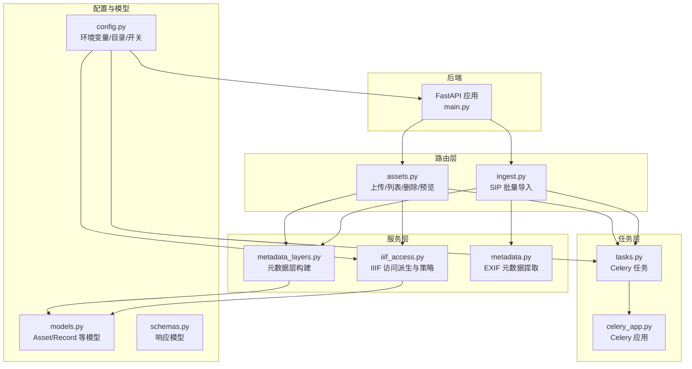
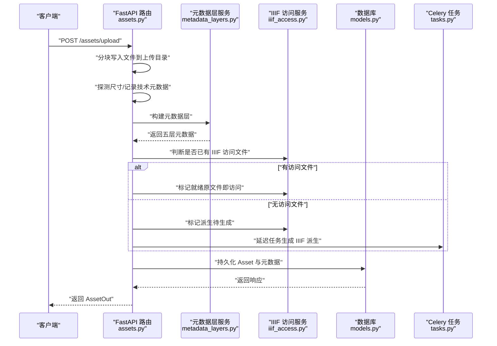
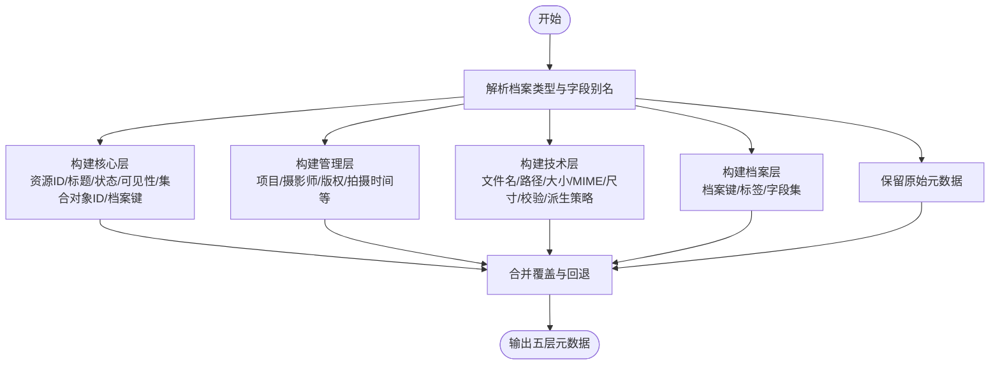
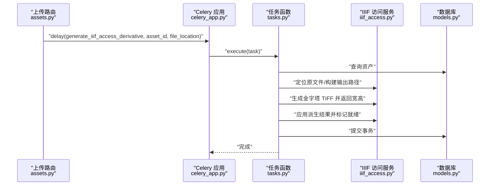
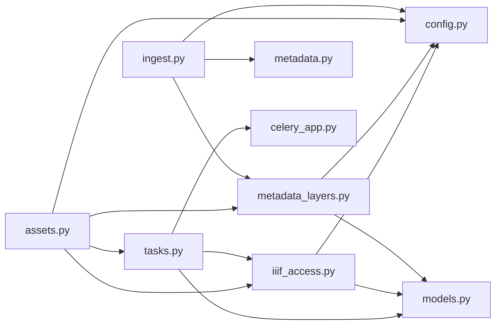

# 资产上传与处理

<cite>
**本文引用的文件**
- [main.py](file://backend/app/main.py)
- [assets.py](file://backend/app/routers/assets.py)
- [ingest.py](file://backend/app/routers/ingest.py)
- [metadata_layers.py](file://backend/app/services/metadata_layers.py)
- [iiif_access.py](file://backend/app/services/iiif_access.py)
- [tasks.py](file://backend/app/tasks.py)
- [celery_app.py](file://backend/app/celery_app.py)
- [metadata.py](file://backend/app/utils/metadata.py)
- [models.py](file://backend/app/models.py)
- [config.py](file://backend/app/config.py)
- [schemas.py](file://backend/app/schemas.py)
</cite>

## 目录
1. [简介](#简介)
2. [项目结构](#项目结构)
3. [核心组件](#核心组件)
4. [架构总览](#架构总览)
5. [详细组件分析](#详细组件分析)
6. [依赖关系分析](#依赖关系分析)
7. [性能考量](#性能考量)
8. [故障排查指南](#故障排查指南)
9. [结论](#结论)
10. [附录：API 参考与示例](#附录api-参考与示例)

## 简介
本文件面向二维资产管理的“资产上传与处理”模块，系统性阐述从文件接收、验证、存储到异步处理与元数据层构建的完整流程。重点覆盖以下方面：
- 上传接口参数与约束：文件大小、格式、可见性范围、集合对象ID绑定等
- 异步处理机制：Celery 任务队列、图像派生生成、状态跟踪
- 元数据层构建：原始元数据提取、技术元数据生成、核心元数据标准化
- 安全与性能：路径与权限校验、分块写入、哈希校验、批处理与缓存策略
- 实操：API 调用示例与常见错误处理

## 项目结构
围绕二维资产上传与处理的关键文件组织如下：
- 路由层：提供上传入口与列表/删除/预览等接口
- 服务层：元数据层构建、IIIF 访问派生存储与策略判定
- 任务层：Celery 异步任务，负责派生生成与后续处理
- 工具层：EXIF 元数据提取工具
- 配置与模型：运行时配置、数据库模型定义

图表来源
- [main.py:64-86](file://backend/app/main.py#L64-L86)
- [assets.py:24-292](file://backend/app/routers/assets.py#L24-L292)
- [ingest.py:22-184](file://backend/app/routers/ingest.py#L22-L184)
- [metadata_layers.py:412-507](file://backend/app/services/metadata_layers.py#L412-L507)
- [iiif_access.py:182-259](file://backend/app/services/iiif_access.py#L182-L259)
- [tasks.py:151-182](file://backend/app/tasks.py#L151-L182)
- [celery_app.py:5-15](file://backend/app/celery_app.py#L5-L15)
- [metadata.py:19-79](file://backend/app/utils/metadata.py#L19-L79)
- [config.py:42-72](file://backend/app/config.py#L42-L72)
- [models.py:6-26](file://backend/app/models.py#L6-L26)
- [schemas.py:7-21](file://backend/app/schemas.py#L7-L21)

章节来源
- [main.py:64-86](file://backend/app/main.py#L64-L86)
- [assets.py:24-292](file://backend/app/routers/assets.py#L24-L292)
- [ingest.py:22-184](file://backend/app/routers/ingest.py#L22-L184)

## 核心组件
- 上传路由与参数
  - 支持多部分表单上传，参数包括文件、可见性范围、集合对象ID
  - 参数归一化：可见性范围仅允许开放或仅限所有者；集合对象ID支持数字/字符串数字
- 文件接收与落盘
  - 分块读取写入，避免一次性加载大文件
  - 写入完成后探测尺寸并记录技术元数据
- 元数据层构建
  - 将原始元数据与来源元数据合并，生成核心/管理/技术/档案/原始五层结构
  - 依据资源类型与派生策略自动填充技术字段
- IIIF 访问派生与状态
  - 若存在可用的 IIIF 访问文件则直接标记就绪
  - 否则标记派生待生成，并异步触发 Celery 任务
- 异步处理
  - Celery 任务生成金字塔 TIFF 派生，更新技术元数据并标记就绪
  - 错误捕获并回写错误信息到元数据层

章节来源
- [assets.py:54-133](file://backend/app/routers/assets.py#L54-L133)
- [metadata_layers.py:412-507](file://backend/app/services/metadata_layers.py#L412-L507)
- [iiif_access.py:202-259](file://backend/app/services/iiif_access.py#L202-L259)
- [tasks.py:151-182](file://backend/app/tasks.py#L151-L182)

## 架构总览
下图展示上传与处理的端到端流程，涵盖同步接收、元数据构建、状态决策与异步派生产生。

图表来源
- [assets.py:54-133](file://backend/app/routers/assets.py#L54-L133)
- [metadata_layers.py:412-507](file://backend/app/services/metadata_layers.py#L412-L507)
- [iiif_access.py:202-259](file://backend/app/services/iiif_access.py#L202-L259)
- [tasks.py:151-182](file://backend/app/tasks.py#L151-L182)

## 详细组件分析

### 上传接口与参数
- 接口路径与方法
  - POST /assets/upload
- 请求体
  - multipart/form-data
  - 字段
    - file: UploadFile（必填）
    - visibility_scope: str（可选，默认 open；仅接受 open/owner_only）
    - collection_object_id: int（可选；支持数字/字符串数字）
- 响应
  - 返回 AssetOut（包含基础元数据与状态）

参数归一化逻辑要点
- 可见性范围：去除空白并转小写，非法值统一为 open
- 集合对象ID：支持布尔/整数/字符串数字，非法值归为 None

章节来源
- [assets.py:54-61](file://backend/app/routers/assets.py#L54-L61)
- [assets.py:32-51](file://backend/app/routers/assets.py#L32-L51)
- [schemas.py:7-21](file://backend/app/schemas.py#L7-L21)

### 文件接收、验证与存储
- 分块写入
  - 使用 64KB 块循环读取并写入目标路径
  - 写入完成后计算文件大小
- 尺寸探测
  - 使用图像库尝试打开文件以获取宽高
  - 失败时保留默认宽高为 0
- 存储位置
  - 目标目录来自配置 UPLOAD_DIR，按文件名创建路径并确保父目录存在

章节来源
- [assets.py:65-80](file://backend/app/routers/assets.py#L65-L80)

### 元数据层构建过程
- 输入
  - 资产基础信息（文件名/路径/大小/MIME/可见性/集合对象ID/状态/资源类型）
  - metadata（原始元数据）与 source_metadata（来源元数据）
- 输出
  - 五层元数据：core（核心）、management（管理）、technical（技术）、profile（档案）、raw_metadata（原始）
- 关键步骤
  - 解析档案类型（profile），合并各层字段
  - 技术层自动推导派生策略与派生阈值
  - 生成固定版本号与来源系统标识

图表来源
- [metadata_layers.py:412-507](file://backend/app/services/metadata_layers.py#L412-L507)
- [metadata_layers.py:320-356](file://backend/app/services/metadata_layers.py#L320-L356)
- [metadata_layers.py:403-405](file://backend/app/services/metadata_layers.py#L403-L405)
- [metadata_layers.py:359-401](file://backend/app/services/metadata_layers.py#L359-L401)
- [metadata_layers.py:407-409](file://backend/app/services/metadata_layers.py#L407-L409)

章节来源
- [metadata_layers.py:412-507](file://backend/app/services/metadata_layers.py#L412-L507)

### IIIF 访问派生与状态决策
- 判定逻辑
  - 若技术层明确要求生成或满足特定源文件家族与策略，则需要派生
  - 否则若无需派生且原文件存在，可直接作为访问文件
- 状态更新
  - 已有访问文件：标记就绪并写入提示信息
  - 需要派生：标记处理中并等待异步任务完成

章节来源
- [iiif_access.py:45-57](file://backend/app/services/iiif_access.py#L45-L57)
- [iiif_access.py:202-228](file://backend/app/services/iiif_access.py#L202-L228)

### 异步处理与任务调度
- 触发条件
  - 上传成功且状态为 processing 时，向 Celery 发送生成 IIIF 访问派生的任务
- 任务执行
  - 读取资产并定位原文件
  - 生成金字塔 TIFF 派生，写入目标路径并更新技术元数据
  - 标记资产就绪
- 错误处理
  - 捕获异常并写入错误信息到元数据层，同时标记错误状态

图表来源
- [assets.py:130-133](file://backend/app/routers/assets.py#L130-L133)
- [tasks.py:151-182](file://backend/app/tasks.py#L151-L182)
- [iiif_access.py:182-259](file://backend/app/services/iiif_access.py#L182-L259)
- [celery_app.py:5-15](file://backend/app/celery_app.py#L5-L15)

章节来源
- [tasks.py:151-182](file://backend/app/tasks.py#L151-L182)
- [celery_app.py:5-15](file://backend/app/celery_app.py#L5-L15)

### SIP 批量导入与校验
- 接口
  - POST /ingest/sip
- 请求体
  - file: UploadFile（二进制流）
  - manifest: JSON 字符串（包含客户端计算的 SHA256 与元数据）
- 校验流程
  - 服务端流式计算 SHA256 并与客户端提供的哈希比对
  - 成功后重命名临时文件为最终文件，失败则清理临时文件
- 元数据提取
  - 使用 EXIF 工具提取元数据，补充尺寸信息
  - 构建元数据层并持久化

章节来源
- [ingest.py:29-184](file://backend/app/routers/ingest.py#L29-L184)
- [metadata.py:19-79](file://backend/app/utils/metadata.py#L19-L79)

### 数据模型与可见性控制
- 资产模型
  - 包含文件名、路径、大小、MIME、可见性范围、集合对象ID、状态、资源类型、元数据JSON、关联记录等
- 可见性范围
  - 上传路由对可见性范围进行归一化
  - 查询与访问控制通过权限模块结合用户集合范围进行判定

章节来源
- [models.py:6-26](file://backend/app/models.py#L6-L26)
- [assets.py:32-51](file://backend/app/routers/assets.py#L32-L51)
- [assets.py:201-206](file://backend/app/routers/assets.py#L201-L206)

## 依赖关系分析
- 组件耦合
  - 路由层依赖服务层（元数据层、IIIF 访问）与任务层（Celery）
  - 任务层依赖配置与服务层，间接依赖数据库模型
- 外部依赖
  - Redis 作为 Celery 的消息与结果后端
  - PyVips 用于生成金字塔 TIFF
  - EXIF 工具用于元数据提取
- 潜在环依赖
  - 未发现直接循环导入；服务层与任务层通过函数调用解耦

图表来源
- [assets.py:14-22](file://backend/app/routers/assets.py#L14-L22)
- [ingest.py:13-20](file://backend/app/routers/ingest.py#L13-L20)
- [tasks.py:5-21](file://backend/app/tasks.py#L5-L21)
- [celery_app.py:5-15](file://backend/app/celery_app.py#L5-L15)
- [config.py:42-72](file://backend/app/config.py#L42-L72)
- [models.py:6-26](file://backend/app/models.py#L6-L26)

章节来源
- [assets.py:14-22](file://backend/app/routers/assets.py#L14-L22)
- [ingest.py:13-20](file://backend/app/routers/ingest.py#L13-L20)
- [tasks.py:5-21](file://backend/app/tasks.py#L5-L21)

## 性能考量
- 流式写入与分块读取
  - 上传与 SIP 导入均采用 64KB 分块写入，降低内存峰值
- 派生生成
  - 使用 PyVips 顺序访问与瓦片写入，生成金字塔 TIFF，适配 IIIF 渲染
- 缓存与索引
  - Celery 结果过期配置减少长期占用
- I/O 优化
  - 先写临时文件再重命名，避免并发冲突与不一致
- 元数据提取
  - EXIF 工具启用结构化输出，避免过大二进制数据导致内存压力

章节来源
- [assets.py:68-71](file://backend/app/routers/assets.py#L68-L71)
- [ingest.py:59-74](file://backend/app/routers/ingest.py#L59-L74)
- [iiif_access.py:187-199](file://backend/app/services/iiif_access.py#L187-L199)
- [celery_app.py:13-15](file://backend/app/celery_app.py#L13-L15)
- [metadata.py:40-56](file://backend/app/utils/metadata.py#L40-L56)

## 故障排查指南
- 上传失败
  - 检查上传目录权限与磁盘空间
  - 确认可见性范围与集合对象ID参数格式
- 派生未生成
  - 查看资产状态是否仍为 processing
  - 检查 Celery 是否正常运行与队列是否有积压
  - 核对 Redis 连接与任务日志
- 元数据缺失
  - 确认 EXIF 工具是否安装并可在 PATH 中找到
  - 检查 SIP 导入时的哈希校验是否通过
- 权限问题
  - 确保用户具备 image.upload/image.view 权限
  - 核对可见性范围与集合对象ID的访问控制

章节来源
- [tasks.py:175-181](file://backend/app/tasks.py#L175-L181)
- [metadata.py:32-34](file://backend/app/utils/metadata.py#L32-L34)
- [ingest.py:65-70](file://backend/app/routers/ingest.py#L65-L70)

## 结论
该模块通过清晰的路由、稳健的服务与可靠的异步任务，实现了从文件接收、元数据构建到 IIIF 访问派生的闭环处理。参数归一化、流式写入与哈希校验提升了健壮性；元数据层的标准化设计便于后续扩展与跨系统集成。建议在生产环境中配合完善的监控与告警体系，持续优化派生策略与缓存策略以提升吞吐与响应。

## 附录：API 参考与示例

### 上传接口
- 方法与路径
  - POST /assets/upload
- 表单字段
  - file: UploadFile（必填）
  - visibility_scope: str（可选，默认 open；仅接受 open/owner_only）
  - collection_object_id: int（可选；支持数字/字符串数字）
- 响应
  - 返回 AssetOut

章节来源
- [assets.py:54-133](file://backend/app/routers/assets.py#L54-L133)
- [schemas.py:7-21](file://backend/app/schemas.py#L7-L21)

### SIP 批量导入
- 方法与路径
  - POST /ingest/sip
- 表单字段
  - file: UploadFile（二进制流）
  - manifest: JSON 字符串（包含客户端计算的 SHA256 与元数据）
- 响应
  - 返回 IngestSipResponse（包含状态、消息、资产ID、校验结果与哈希）

章节来源
- [ingest.py:29-184](file://backend/app/routers/ingest.py#L29-L184)
- [schemas.py:179-184](file://backend/app/schemas.py#L179-L184)

### 删除资产与清理文件
- 方法与路径
  - DELETE /assets/{asset_id}
- 行为
  - 删除数据库记录并清理原文件、访问文件与预览文件等关联路径

章节来源
- [assets.py:222-251](file://backend/app/routers/assets.py#L222-L251)

### 获取资产详情与预览
- 方法与路径
  - GET /assets/{asset_id}
  - GET /assets/{asset_id}/preview
- 行为
  - 返回资产详情与预览图片（带缓存禁用头）

章节来源
- [assets.py:254-291](file://backend/app/routers/assets.py#L254-L291)

### 配置项与环境变量
- 关键配置
  - DATABASE_URL、REDIS_URL、UPLOAD_DIR、API_PUBLIC_URL、CANTALOUPE_PUBLIC_URL
  - 人脸识别相关开关与阈值
- 影响范围
  - 任务队列、文件存储路径、公开访问地址、功能开关

章节来源
- [config.py:42-72](file://backend/app/config.py#L42-L72)