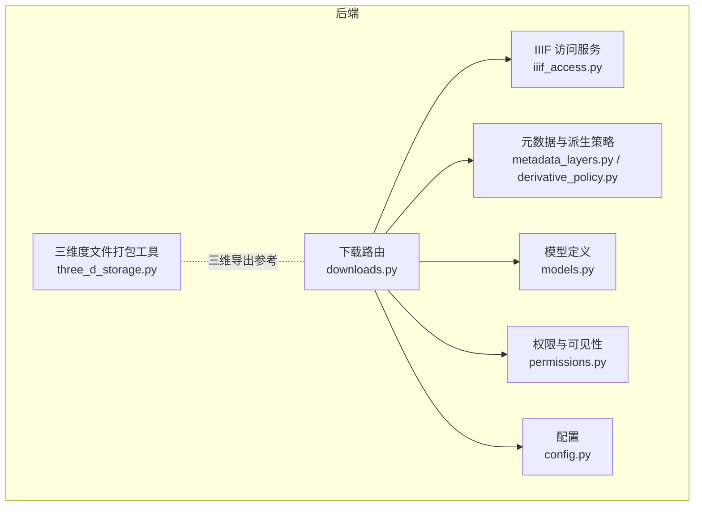
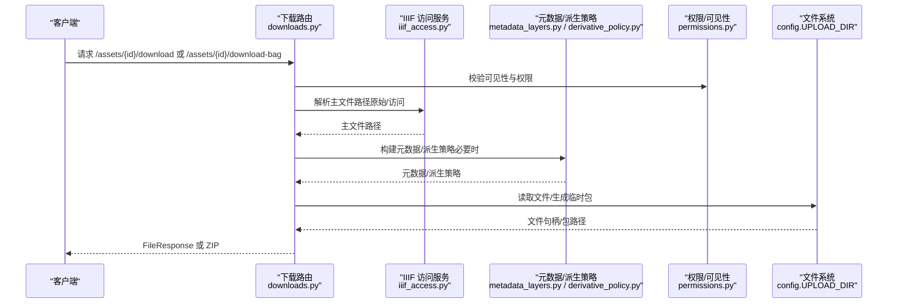
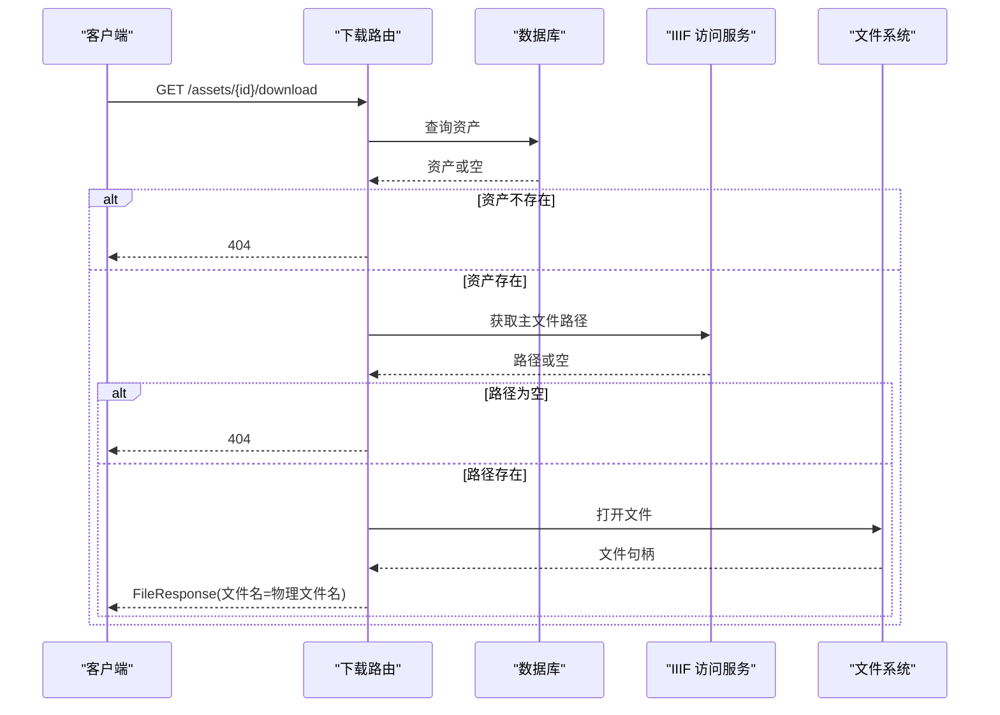
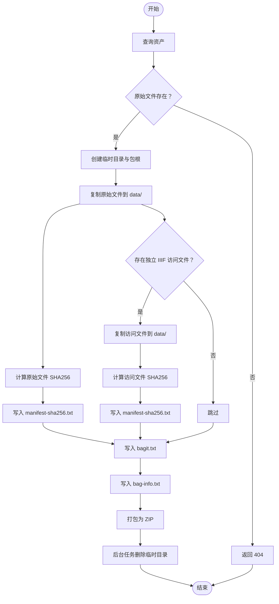
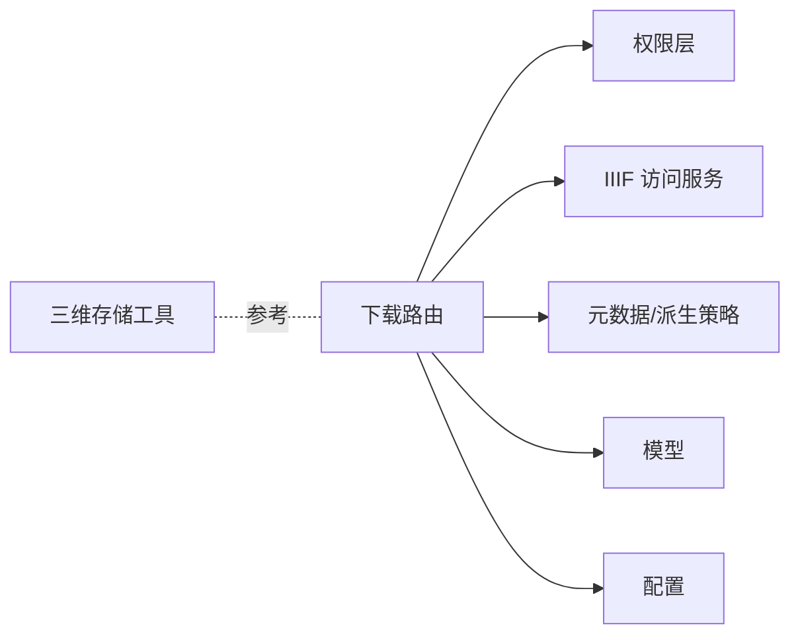

# 资产下载与导出

<cite>
**本文引用的文件**
- [backend/app/routers/downloads.py](file://backend/app/routers/downloads.py)
- [backend/app/services/iiif_access.py](file://backend/app/services/iiif_access.py)
- [backend/app/services/metadata_layers.py](file://backend/app/services/metadata_layers.py)
- [backend/app/services/derivative_policy.py](file://backend/app/services/derivative_policy.py)
- [backend/app/services/three_d_storage.py](file://backend/app/services/three_d_storage.py)
- [backend/app/models.py](file://backend/app/models.py)
- [backend/app/permissions.py](file://backend/app/permissions.py)
- [backend/app/config.py](file://backend/app/config.py)
- [backend/app/main.py](file://backend/app/main.py)
- [docs/08-研究/BagIt样本结构（BAGIT_SAMPLE_STRUCTURE）.md](file://docs/08-研究/BagIt样本结构（BAGIT_SAMPLE_STRUCTURE）.md)
- [docs/08-研究/长期保存SIP打包说明（BAGIT_SIP_PROFILE）.md](file://docs/08-研究/长期保存SIP打包说明（BAGIT_SIP_PROFILE）.md)
</cite>

## 目录
1. [简介](#简介)
2. [项目结构](#项目结构)
3. [核心组件](#核心组件)
4. [架构总览](#架构总览)
5. [详细组件分析](#详细组件分析)
6. [依赖分析](#依赖分析)
7. [性能考虑](#性能考虑)
8. [故障排查指南](#故障排查指南)
9. [结论](#结论)
10. [附录](#附录)

## 简介
本文件聚焦二维资产管理系统的“资产下载与导出”模块，覆盖以下主题：
- 原文件下载：直接文件下载、权限验证、下载链接生成
- BagIt 打包下载：打包流程、文件组织结构、元数据嵌入、完整性校验
- 批量下载：多文件选择、并发下载、进度跟踪、错误处理
- 导出格式支持：不同分辨率导出、格式转换、压缩选项
- 下载权限控制：可见性范围检查、用户权限验证、下载日志记录
- 下载接口 API 文档与使用示例
- 性能优化策略：CDN 集成、断点续传、带宽控制
- 下载配额管理与使用统计（现状与建议）

## 项目结构
与下载导出相关的关键文件与职责如下：
- 路由层：提供下载与导出接口，负责参数解析与响应返回
- 服务层：封装 IIIF 访问文件路径解析、元数据与派生策略、BagIt 打包逻辑
- 模型层：定义资产与用户实体，承载可见性范围、状态等字段
- 权限层：提供认证与授权、可见性范围判定
- 配置层：提供上传目录、公共 URL 等运行时参数
- 文档：BagIt 结构样例与 SIP 打包定位说明

图表来源
- [backend/app/routers/downloads.py:1-119](file://backend/app/routers/downloads.py#L1-L119)
- [backend/app/services/iiif_access.py:1-259](file://backend/app/services/iiif_access.py#L1-L259)
- [backend/app/services/metadata_layers.py:1-636](file://backend/app/services/metadata_layers.py#L1-L636)
- [backend/app/services/derivative_policy.py:1-168](file://backend/app/services/derivative_policy.py#L1-L168)
- [backend/app/services/three_d_storage.py:1-226](file://backend/app/services/three_d_storage.py#L1-L226)
- [backend/app/models.py:1-307](file://backend/app/models.py#L1-L307)
- [backend/app/permissions.py:1-255](file://backend/app/permissions.py#L1-L255)
- [backend/app/config.py:1-72](file://backend/app/config.py#L1-L72)

章节来源
- [backend/app/main.py:1-86](file://backend/app/main.py#L1-L86)
- [backend/app/routers/downloads.py:1-119](file://backend/app/routers/downloads.py#L1-L119)

## 核心组件
- 下载路由与控制器
  - 直接文件下载：根据资产 ID 获取主文件路径并返回文件响应
  - BagIt 打包下载：生成临时 BagIt 结构，写入 tag files 与 manifest，打包为 ZIP 并异步清理临时目录
- IIIF 访问文件路径解析
  - 解析原始文件与 IIIF 访问文件路径，支持回退到原始文件
- 元数据与派生策略
  - 构建分层元数据，推导派生策略（大文件生成金字塔 TIFF 访问副本）
- 权限与可见性
  - 基于用户角色与集合范围判断可见性与权限
- 配置与存储
  - 上传目录、公开 URL 等运行时参数

章节来源
- [backend/app/routers/downloads.py:39-119](file://backend/app/routers/downloads.py#L39-L119)
- [backend/app/services/iiif_access.py:103-154](file://backend/app/services/iiif_access.py#L103-L154)
- [backend/app/services/metadata_layers.py:412-507](file://backend/app/services/metadata_layers.py#L412-L507)
- [backend/app/services/derivative_policy.py:72-167](file://backend/app/services/derivative_policy.py#L72-L167)
- [backend/app/permissions.py:239-254](file://backend/app/permissions.py#L239-L254)
- [backend/app/config.py:42-46](file://backend/app/config.py#L42-L46)

## 架构总览
下载与导出模块的端到端流程如下：
- 客户端请求下载接口
- 路由层解析参数并调用服务层
- 服务层解析文件路径、构建元数据与派生策略
- 权限层校验可见性与权限
- 返回文件响应或打包后的 ZIP

图表来源
- [backend/app/routers/downloads.py:39-119](file://backend/app/routers/downloads.py#L39-L119)
- [backend/app/services/iiif_access.py:103-154](file://backend/app/services/iiif_access.py#L103-L154)
- [backend/app/services/metadata_layers.py:412-507](file://backend/app/services/metadata_layers.py#L412-L507)
- [backend/app/services/derivative_policy.py:72-167](file://backend/app/services/derivative_policy.py#L72-L167)
- [backend/app/permissions.py:239-254](file://backend/app/permissions.py#L239-L254)
- [backend/app/config.py:44-44](file://backend/app/config.py#L44-L44)

## 详细组件分析

### 直接文件下载
- 功能要点
  - 根据资产 ID 查询资产并获取主文件路径
  - 若主文件不存在，返回 404
  - 返回文件响应，文件名来自物理路径
- 权限与可见性
  - 通过权限层的可见性检查函数判断用户是否可访问该资产
- 错误处理
  - 资产不存在、物理文件不存在均返回 404
  - 其他异常返回 500

图表来源
- [backend/app/routers/downloads.py:39-48](file://backend/app/routers/downloads.py#L39-L48)
- [backend/app/services/iiif_access.py:143-154](file://backend/app/services/iiif_access.py#L143-L154)
- [backend/app/permissions.py:239-254](file://backend/app/permissions.py#L239-L254)

章节来源
- [backend/app/routers/downloads.py:39-48](file://backend/app/routers/downloads.py#L39-L48)
- [backend/app/services/iiif_access.py:143-154](file://backend/app/services/iiif_access.py#L143-L154)
- [backend/app/permissions.py:239-254](file://backend/app/permissions.py#L239-L254)

### BagIt 打包下载
- 功能要点
  - 生成临时目录与包根目录，创建 data 子目录
  - 复制原始文件到 data 目录，计算并记录其 SHA256
  - 若存在独立 IIIF 访问文件，复制到 data 目录并计算 SHA256
  - 写入 bagit.txt、bag-info.txt、manifest-sha256.txt
  - 将包目录打包为 ZIP 并异步删除临时目录
- 完整性校验
  - manifest-sha256.txt 记录每个 payload 文件的 SHA256
  - bag-info.txt 记录原始文件名与 IIIF 访问文件名等元信息
- 错误处理
  - 任何异常均清理临时目录并返回 500

图表来源
- [backend/app/routers/downloads.py:51-119](file://backend/app/routers/downloads.py#L51-L119)
- [backend/app/services/metadata_layers.py:563-569](file://backend/app/services/metadata_layers.py#L563-L569)

章节来源
- [backend/app/routers/downloads.py:51-119](file://backend/app/routers/downloads.py#L51-L119)
- [docs/08-研究/BagIt样本结构（BAGIT_SAMPLE_STRUCTURE）.md:1-88](file://docs/08-研究/BagIt样本结构（BAGIT_SAMPLE_STRUCTURE）.md#L1-L88)
- [docs/08-研究/长期保存SIP打包说明（BAGIT_SIP_PROFILE）.md:1-173](file://docs/08-研究/长期保存SIP打包说明（BAGIT_SIP_PROFILE）.md#L1-L173)

### 批量下载（现状与建议）
- 现状
  - 当前路由层未提供批量下载接口
  - 未见并发下载、进度跟踪与错误聚合的实现
- 建议
  - 扩展路由层，支持多资产 ID 列表
  - 引入队列与后台任务，按资产 ID 逐个生成 ZIP 并合并
  - 提供任务 ID 以便轮询进度
  - 对失败资产单独记录并汇总返回

章节来源
- [backend/app/routers/downloads.py:1-119](file://backend/app/routers/downloads.py#L1-L119)

### 导出格式支持
- 分辨率与格式转换
  - 通过派生策略自动识别大文件并生成金字塔 TIFF 访问副本
  - 访问层 MIME 类型默认为 TIFF，若回退到原始文件则使用原始 MIME
- 压缩选项
  - BagIt 打包使用 ZIP 压缩
  - 三维导出使用 ZIP 压缩（参考三维存储工具）

章节来源
- [backend/app/services/derivative_policy.py:72-167](file://backend/app/services/derivative_policy.py#L72-L167)
- [backend/app/services/iiif_access.py:157-173](file://backend/app/services/iiif_access.py#L157-L173)
- [backend/app/services/three_d_storage.py:212-220](file://backend/app/services/three_d_storage.py#L212-L220)

### 下载权限控制
- 可见性范围检查
  - open：任意拥有相应视图权限的用户可访问
  - owner_only：仅系统管理员或集合范围内的收藏对象可访问
- 权限验证
  - 通过权限依赖解析用户角色与权限集合
  - 缺少必要权限返回 403
- 下载日志记录
  - 当前未见专用下载审计日志；可在路由层扩展记录

章节来源
- [backend/app/permissions.py:239-254](file://backend/app/permissions.py#L239-L254)
- [backend/app/permissions.py:214-236](file://backend/app/permissions.py#L214-L236)

### 下载接口 API 文档与使用示例
- 直接文件下载
  - 方法与路径：GET /assets/{asset_id}/download
  - 参数：asset_id（路径参数）
  - 成功响应：FileResponse（Content-Disposition 为附件下载）
  - 错误响应：404（资产不存在或物理文件不存在）、500（内部错误）
- BagIt 打包下载
  - 方法与路径：GET /assets/{asset_id}/download-bag
  - 参数：asset_id（路径参数）
  - 成功响应：FileResponse（application/zip，文件名为 bag_{asset_id}.zip）
  - 错误响应：404（物理文件不存在）、500（打包失败）
- 使用示例（示意）
  - 直接下载：curl -OJ http://localhost:8000/api/assets/1/download
  - BagIt 下载：curl -OJ http://localhost:8000/api/assets/1/download-bag

章节来源
- [backend/app/routers/downloads.py:39-119](file://backend/app/routers/downloads.py#L39-L119)

## 依赖分析
- 组件耦合
  - 下载路由依赖权限层、IIIF 访问服务、元数据与派生策略、模型与配置
  - 三维存储工具与下载路由在“打包导出”方面可互为参考
- 外部依赖
  - 文件系统（上传目录）
  - 数据库（资产与用户信息）
  - 可选：Redis（用于后台任务，当前下载路由未使用）

图表来源
- [backend/app/routers/downloads.py:1-119](file://backend/app/routers/downloads.py#L1-L119)
- [backend/app/permissions.py:1-255](file://backend/app/permissions.py#L1-L255)
- [backend/app/services/iiif_access.py:1-259](file://backend/app/services/iiif_access.py#L1-L259)
- [backend/app/services/metadata_layers.py:1-636](file://backend/app/services/metadata_layers.py#L1-L636)
- [backend/app/services/three_d_storage.py:1-226](file://backend/app/services/three_d_storage.py#L1-L226)
- [backend/app/config.py:1-72](file://backend/app/config.py#L1-L72)

## 性能考虑
- CDN 集成
  - 通过配置项 API_PUBLIC_URL 与 CANTALOUPE_PUBLIC_URL 控制公开访问地址
  - 建议将静态文件托管至 CDN，减少后端压力
- 断点续传
  - 当前未实现断点续传；可引入 Range 请求与分块传输策略
- 带宽控制
  - 可在网关或反向代理层限制并发连接与速率
- 大文件处理
  - 通过派生策略生成金字塔 TIFF 访问副本，降低前端渲染压力
  - 打包下载采用 ZIP 压缩，建议在边缘节点缓存热点包

章节来源
- [backend/app/config.py:42-46](file://backend/app/config.py#L42-L46)
- [backend/app/services/derivative_policy.py:72-167](file://backend/app/services/derivative_policy.py#L72-L167)

## 故障排查指南
- 404：资产不存在或物理文件不存在
  - 检查资产 ID 是否正确，确认文件路径与上传目录配置
- 500：打包失败
  - 查看后端日志，确认临时目录权限与磁盘空间
- 权限不足
  - 确认用户角色与集合范围，检查可见性范围配置
- BagIt 结构异常
  - 确认 manifest-sha256.txt 与 bag-info.txt 内容是否完整
  - 核对 data/ 目录下文件是否齐全

章节来源
- [backend/app/routers/downloads.py:24-28](file://backend/app/routers/downloads.py#L24-L28)
- [backend/app/routers/downloads.py:116-118](file://backend/app/routers/downloads.py#L116-L118)
- [backend/app/permissions.py:239-254](file://backend/app/permissions.py#L239-L254)

## 结论
- 二维资产管理的下载与导出模块已实现两类核心能力：直接文件下载与 BagIt 打包下载
- 权限与可见性控制通过权限层与可见性范围检查实现
- 派生策略与 IIIF 访问文件路径解析保障了访问层与保存层的协同
- 批量下载、断点续传、配额管理与使用统计等功能尚未实现，建议在现有架构基础上扩展

## 附录
- BagIt 结构样例与 SIP 打包定位说明
  - 参考文档：[BagIt样本结构（BAGIT_SAMPLE_STRUCTURE）.md:1-88](file://docs/08-研究/BagIt样本结构（BAGIT_SAMPLE_STRUCTURE）.md#L1-L88)
  - 参考文档：[长期保存SIP打包说明（BAGIT_SIP_PROFILE）.md:1-173](file://docs/08-研究/长期保存SIP打包说明（BAGIT_SIP_PROFILE）.md#L1-L173)