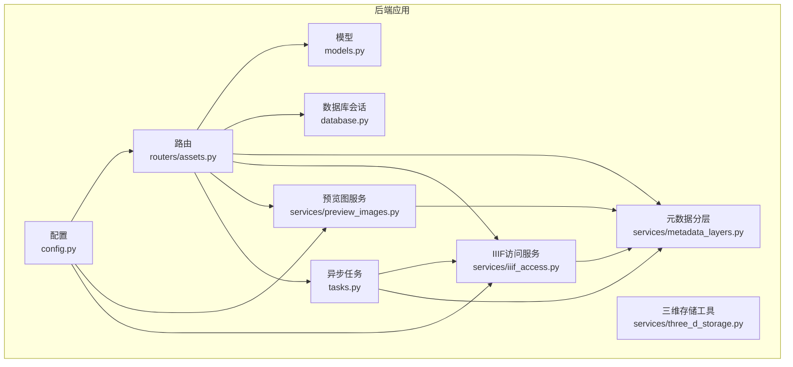
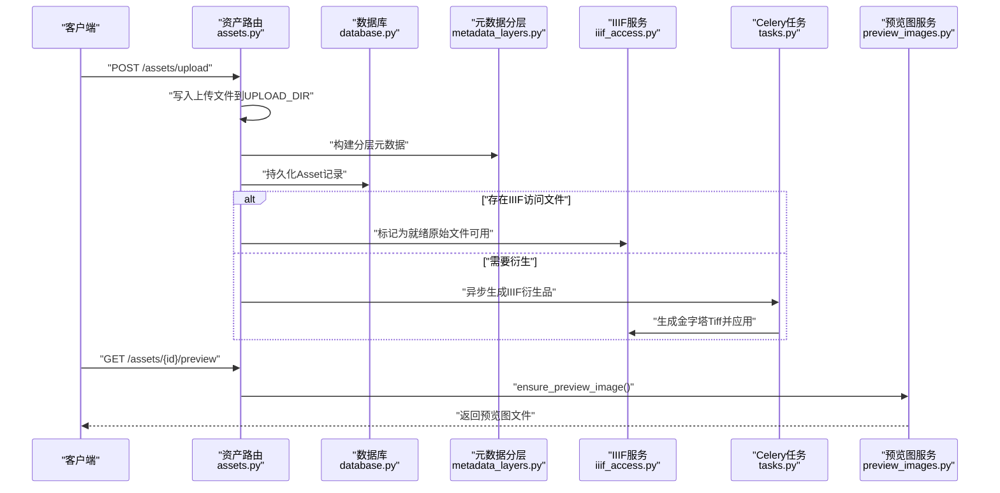
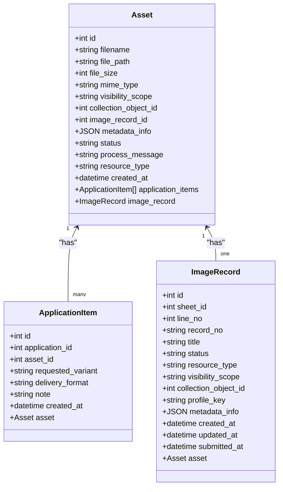
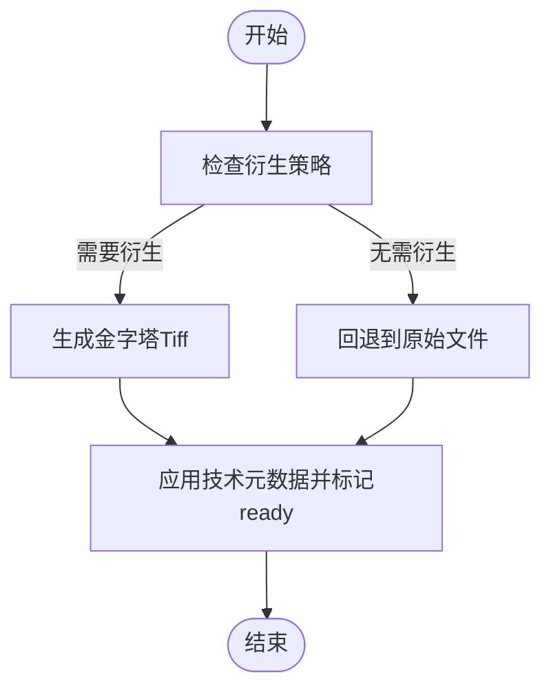
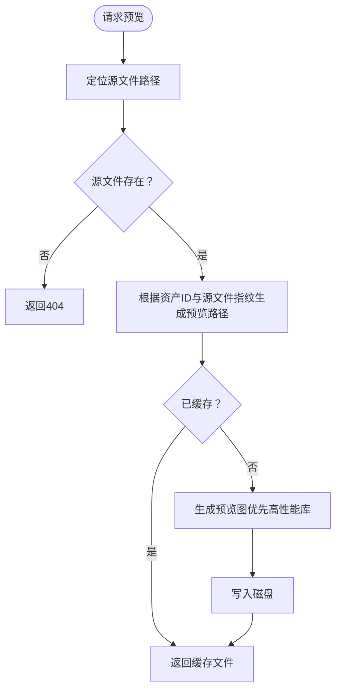
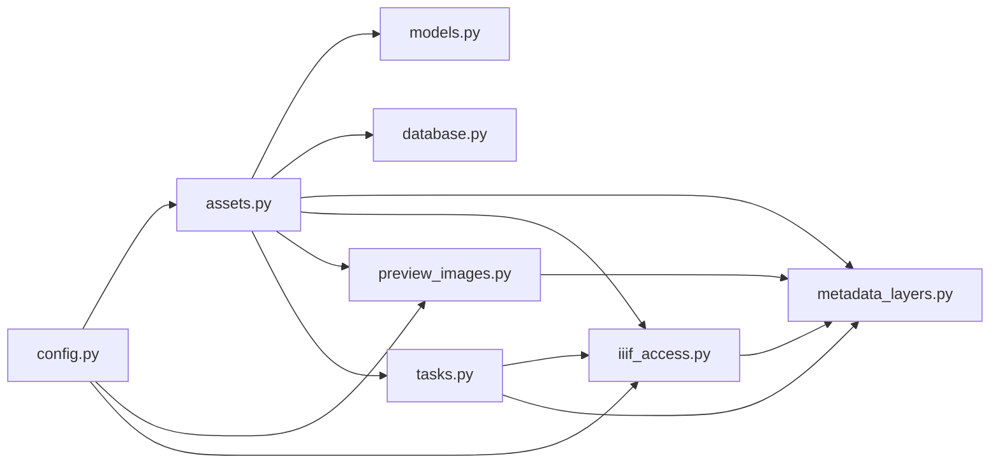

# 资产存储与索引

<cite>
**本文引用的文件**
- [models.py](file://backend/app/models.py)
- [assets.py](file://backend/app/routers/assets.py)
- [config.py](file://backend/app/config.py)
- [database.py](file://backend/app/database.py)
- [metadata_layers.py](file://backend/app/services/metadata_layers.py)
- [iiif_access.py](file://backend/app/services/iiif_access.py)
- [preview_images.py](file://backend/app/services/preview_images.py)
- [tasks.py](file://backend/app/tasks.py)
- [three_d_storage.py](file://backend/app/services/three_d_storage.py)
</cite>

## 目录
1. [简介](#简介)
2. [项目结构](#项目结构)
3. [核心组件](#核心组件)
4. [架构总览](#架构总览)
5. [详细组件分析](#详细组件分析)
6. [依赖关系分析](#依赖关系分析)
7. [性能考虑](#性能考虑)
8. [故障排查指南](#故障排查指南)
9. [结论](#结论)
10. [附录](#附录)

## 简介
本文件聚焦二维资产管理的“资产存储与索引”模块，系统性阐述资产在数据库中的存储结构、文件系统存储策略、索引机制、预览图生成与缓存、以及存储空间管理与清理机制。同时给出配置最佳实践与性能优化建议，帮助读者快速理解并安全高效地使用该模块。

## 项目结构
围绕资产存储与索引的关键代码分布在以下位置：
- 数据模型：backend/app/models.py
- 路由接口：backend/app/routers/assets.py
- 存储配置：backend/app/config.py
- 数据库会话：backend/app/database.py
- 元数据分层与解析：backend/app/services/metadata_layers.py
- IIIF访问衍生品生成与标记：backend/app/services/iiif_access.py
- 预览图生成与缓存：backend/app/services/preview_images.py
- 异步任务调度：backend/app/tasks.py
- 三维存储工具（对比参考）：backend/app/services/three_d_storage.py

图表来源
- [assets.py:1-292](file://backend/app/routers/assets.py#L1-L292)
- [models.py:1-307](file://backend/app/models.py#L1-L307)
- [config.py:1-72](file://backend/app/config.py#L1-L72)
- [database.py:1-17](file://backend/app/database.py#L1-L17)
- [metadata_layers.py:1-636](file://backend/app/services/metadata_layers.py#L1-L636)
- [iiif_access.py:1-259](file://backend/app/services/iiif_access.py#L1-L259)
- [preview_images.py:1-105](file://backend/app/services/preview_images.py#L1-L105)
- [tasks.py:1-262](file://backend/app/tasks.py#L1-L262)
- [three_d_storage.py:1-226](file://backend/app/services/three_d_storage.py#L1-L226)

章节来源
- [assets.py:1-292](file://backend/app/routers/assets.py#L1-L292)
- [models.py:1-307](file://backend/app/models.py#L1-L307)
- [config.py:1-72](file://backend/app/config.py#L1-L72)
- [database.py:1-17](file://backend/app/database.py#L1-L17)
- [metadata_layers.py:1-636](file://backend/app/services/metadata_layers.py#L1-L636)
- [iiif_access.py:1-259](file://backend/app/services/iiif_access.py#L1-L259)
- [preview_images.py:1-105](file://backend/app/services/preview_images.py#L1-L105)
- [tasks.py:1-262](file://backend/app/tasks.py#L1-L262)
- [three_d_storage.py:1-226](file://backend/app/services/three_d_storage.py#L1-L226)

## 核心组件
- 资产模型（Asset）：承载文件名、路径、大小、MIME类型、可见性范围、集合对象ID、关联记录ID、JSON元数据、状态、资源类型、创建时间等；并建立与应用条目、图像记录的双向关系。
- 文件系统存储策略：上传文件写入配置指定的上传目录；IIIF访问衍生品生成于“derivatives”子目录；预览图生成于“previews”子目录。
- 元数据分层：将资产元数据划分为core、management、technical、profile、raw_metadata等层次，统一构建与查询。
- IIIF访问衍生品：根据策略生成金字塔Tiff，作为IIIF访问源；若无需衍生则回退到原始文件。
- 预览图生成：优先使用高性能库生成缩略图，失败时回退到通用方案；基于源文件指纹缓存预览图路径。
- 异步任务：Celery任务负责生成IIIF访问衍生品，失败时标记错误并更新元数据。
- 删除与清理：删除资产时尝试清理原文件、IIIF访问文件、预览图等关联文件。

章节来源
- [models.py:6-26](file://backend/app/models.py#L6-L26)
- [assets.py:54-134](file://backend/app/routers/assets.py#L54-L134)
- [metadata_layers.py:412-508](file://backend/app/services/metadata_layers.py#L412-L508)
- [iiif_access.py:182-259](file://backend/app/services/iiif_access.py#L182-L259)
- [preview_images.py:23-105](file://backend/app/services/preview_images.py#L23-L105)
- [tasks.py:151-182](file://backend/app/tasks.py#L151-L182)

## 架构总览
下图展示从上传到生成预览、标记IIIF可用性的关键流程：

图表来源
- [assets.py:54-134](file://backend/app/routers/assets.py#L54-L134)
- [metadata_layers.py:412-508](file://backend/app/services/metadata_layers.py#L412-L508)
- [iiif_access.py:202-259](file://backend/app/services/iiif_access.py#L202-L259)
- [tasks.py:151-182](file://backend/app/tasks.py#L151-L182)
- [preview_images.py:85-105](file://backend/app/services/preview_images.py#L85-L105)

## 详细组件分析

### 资产模型与数据库索引
- 表与字段
  - 表名：assets
  - 关键字段：id（主键）、filename、file_path、file_size、mime_type、visibility_scope、collection_object_id、image_record_id（外键）、metadata_info（JSON）、status、process_message、resource_type、created_at
- 关系映射
  - 与ApplicationItem：一对多，反向为application_items
  - 与ImageRecord：一对一，反向为image_record
- 索引设计
  - 主键索引：id
  - 复合索引：filename、visibility_scope、collection_object_id、image_record_id
  - 字段索引：resource_type、status、created_at
- 查询与排序
  - 列表接口按创建时间与ID降序排列，结合可见性范围与集合对象ID进行过滤

图表来源
- [models.py:6-26](file://backend/app/models.py#L6-L26)
- [models.py:200-213](file://backend/app/models.py#L200-L213)
- [models.py:144-174](file://backend/app/models.py#L144-L174)

章节来源
- [models.py:6-26](file://backend/app/models.py#L6-L26)
- [models.py:200-213](file://backend/app/models.py#L200-L213)
- [models.py:144-174](file://backend/app/models.py#L144-L174)

### 文件系统存储策略
- 上传目录
  - 通过配置项UPLOAD_DIR确定根目录，默认值为“/app/uploads”
  - 上传文件直接写入该目录下的文件名路径
- 目录结构
  - derivatives：存放IIIF访问衍生品（金字塔Tiff）
  - previews：存放预览图（asset-{id}-fingerprint.preview.jpg）
- 文件命名规则
  - 预览图：以资产ID与源文件指纹拼接，确保缓存命中与失效
  - IIIF衍生品：按资产ID组织子目录，文件名为固定名称
- 权限管理
  - 上传接口提供调试端点列出目录内文件及其权限信息，便于运维核验
  - 删除资产时尝试清理相关文件，避免残留

章节来源
- [config.py:44](file://backend/app/config.py#L44)
- [assets.py:65-73](file://backend/app/routers/assets.py#L65-L73)
- [assets.py:136-159](file://backend/app/routers/assets.py#L136-L159)
- [assets.py:222-251](file://backend/app/routers/assets.py#L222-L251)
- [iiif_access.py:182-185](file://backend/app/services/iiif_access.py#L182-L185)
- [preview_images.py:23-28](file://backend/app/services/preview_images.py#L23-L28)

### 元数据分层与索引
- 分层结构
  - core：核心信息（资源ID、标题、状态、可见性范围、集合对象ID、资源类型、档案方案等）
  - management：共享管理元数据（项目类型、摄影者、版权归属、拍摄时间等）
  - technical：技术元数据（原始/访问文件路径、尺寸、格式、校验值、转换方法等）
  - profile：档案方案字段（按方案键聚合）
  - raw_metadata：原始元数据
- 索引与查询
  - visibility_scope、collection_object_id、image_record_id等字段用于过滤与关联
  - profile_key用于档案方案归类与必填字段校验
- 全文搜索支持
  - 本模块未内置全文检索索引；可通过在应用侧对management与profile字段进行模糊匹配或在数据库层面引入全文索引（如PostgreSQL的tsvector）实现扩展

章节来源
- [metadata_layers.py:412-508](file://backend/app/services/metadata_layers.py#L412-L508)
- [metadata_layers.py:320-357](file://backend/app/services/metadata_layers.py#L320-L357)
- [metadata_layers.py:403-410](file://backend/app/services/metadata_layers.py#L403-L410)
- [metadata_layers.py:48-86](file://backend/app/services/metadata_layers.py#L48-L86)

### IIIF访问衍生品生成与索引
- 生成策略
  - 若资产满足衍生条件，则生成金字塔Tiff（tile、bigtiff），作为IIIF访问源
  - 否则默认回退到原始文件作为IIIF访问源
- 标记与状态
  - 生成成功后更新技术元数据（文件路径、MIME类型、宽高、转换方法），并将状态置为“ready”
  - 生成失败时标记为“error”，并记录错误信息
- 时间戳索引
  - created_at用于列表排序与审计追踪

图表来源
- [iiif_access.py:45-57](file://backend/app/services/iiif_access.py#L45-L57)
- [iiif_access.py:187-200](file://backend/app/services/iiif_access.py#L187-L200)
- [iiif_access.py:230-259](file://backend/app/services/iiif_access.py#L230-L259)
- [tasks.py:151-182](file://backend/app/tasks.py#L151-L182)

章节来源
- [iiif_access.py:45-57](file://backend/app/services/iiif_access.py#L45-L57)
- [iiif_access.py:187-200](file://backend/app/services/iiif_access.py#L187-L200)
- [iiif_access.py:230-259](file://backend/app/services/iiif_access.py#L230-L259)
- [tasks.py:151-182](file://backend/app/tasks.py#L151-L182)

### 预览图生成与缓存
- 尺寸规格
  - 最大宽度限制，保证预览图尺寸合理
- 格式转换
  - 优先使用高性能库生成Jpeg，必要时回退到通用方案
  - 处理透明通道，确保输出为RGB
- 缓存策略
  - 基于源文件修改时间与大小生成指纹，拼接到文件名中，避免重复生成与缓存污染
- 访问接口
  - 提供预览图下载接口，设置禁用缓存响应头，确保每次请求都生成最新预览

图表来源
- [preview_images.py:23-28](file://backend/app/services/preview_images.py#L23-L28)
- [preview_images.py:85-105](file://backend/app/services/preview_images.py#L85-L105)
- [assets.py:268-291](file://backend/app/routers/assets.py#L268-L291)

章节来源
- [preview_images.py:23-28](file://backend/app/services/preview_images.py#L23-L28)
- [preview_images.py:52-83](file://backend/app/services/preview_images.py#L52-L83)
- [preview_images.py:85-105](file://backend/app/services/preview_images.py#L85-L105)
- [assets.py:268-291](file://backend/app/routers/assets.py#L268-L291)

### 存储空间管理与清理
- 删除流程
  - 删除资产时，尝试清理原文件、IIIF访问文件、预览图等
- 清理策略
  - 本模块未提供自动清理脚本；建议结合业务策略定期扫描并清理孤儿文件
- 存储配额
  - 本模块未内置配额控制；可在文件系统或容器层面实施配额限制

章节来源
- [assets.py:222-251](file://backend/app/routers/assets.py#L222-L251)

## 依赖关系分析
- 路由依赖模型与数据库会话
- 路由调用元数据分层与IIIF服务，触发Celery任务
- 预览图服务依赖配置与元数据分层，间接依赖IIIF访问文件路径
- Celery任务依赖数据库会话、元数据分层与IIIF服务

图表来源
- [assets.py:1-292](file://backend/app/routers/assets.py#L1-L292)
- [models.py:1-307](file://backend/app/models.py#L1-L307)
- [database.py:1-17](file://backend/app/database.py#L1-L17)
- [metadata_layers.py:1-636](file://backend/app/services/metadata_layers.py#L1-L636)
- [iiif_access.py:1-259](file://backend/app/services/iiif_access.py#L1-L259)
- [preview_images.py:1-105](file://backend/app/services/preview_images.py#L1-L105)
- [tasks.py:1-262](file://backend/app/tasks.py#L1-L262)
- [config.py:1-72](file://backend/app/config.py#L1-L72)

章节来源
- [assets.py:1-292](file://backend/app/routers/assets.py#L1-L292)
- [models.py:1-307](file://backend/app/models.py#L1-L307)
- [database.py:1-17](file://backend/app/database.py#L1-L17)
- [metadata_layers.py:1-636](file://backend/app/services/metadata_layers.py#L1-L636)
- [iiif_access.py:1-259](file://backend/app/services/iiif_access.py#L1-L259)
- [preview_images.py:1-105](file://backend/app/services/preview_images.py#L1-L105)
- [tasks.py:1-262](file://backend/app/tasks.py#L1-L262)
- [config.py:1-72](file://backend/app/config.py#L1-L72)

## 性能考虑
- 上传与读取
  - 使用分块读取写入，避免一次性加载大文件到内存
- 预览图生成
  - 优先使用高性能库；对透明通道进行扁平化处理，减少后续渲染开销
- IIIF衍生品
  - 生成金字塔Tiff，启用瓦片与压缩，提升大规模图像的流式访问性能
- 数据库查询
  - 对高频过滤字段建立索引；列表接口按时间倒序，配合分页参数控制结果集规模
- 缓存策略
  - 预览图基于源文件指纹缓存，避免重复生成；接口设置禁用缓存头，确保一致性

章节来源
- [assets.py:68-72](file://backend/app/routers/assets.py#L68-L72)
- [preview_images.py:52-83](file://backend/app/services/preview_images.py#L52-L83)
- [iiif_access.py:187-200](file://backend/app/services/iiif_access.py#L187-L200)
- [models.py:9-25](file://backend/app/models.py#L9-L25)

## 故障排查指南
- 预览图不可用
  - 确认源文件存在且可读；检查预览图生成函数返回路径；查看接口响应头是否禁用缓存
- IIIF访问失败
  - 检查衍生品生成任务日志；确认输出路径存在且MIME类型正确；核对资产状态是否为“ready”
- 删除资产后仍有文件残留
  - 确认删除接口清理逻辑覆盖了所有可能的文件路径；结合调试端点核查上传目录文件
- 元数据异常
  - 检查分层元数据构建逻辑；核对档案方案键与必填字段

章节来源
- [preview_images.py:85-105](file://backend/app/services/preview_images.py#L85-L105)
- [iiif_access.py:230-259](file://backend/app/services/iiif_access.py#L230-L259)
- [assets.py:222-251](file://backend/app/routers/assets.py#L222-L251)
- [metadata_layers.py:412-508](file://backend/app/services/metadata_layers.py#L412-L508)

## 结论
本模块通过清晰的数据模型、规范的文件系统布局、完善的元数据分层与异步衍生品生成机制，实现了二维资产的可靠存储与高效访问。预览图与IIIF金字塔Tiff的组合，兼顾了前端交互体验与大规模图像的流式渲染需求。建议在生产环境中结合业务策略完善自动清理与配额控制，并按需引入全文检索与地理信息索引以增强检索能力。

## 附录
- 配置项参考
  - DATABASE_URL：数据库连接串
  - REDIS_URL：Redis连接串
  - UPLOAD_DIR：上传根目录
  - API_PUBLIC_URL：API对外地址
  - CANTALOUPE_PUBLIC_URL：IIIF服务器地址
- 最佳实践
  - 为高频查询字段建立数据库索引
  - 使用分块上传与流式写入，降低内存占用
  - 定期清理孤儿文件，控制存储空间
  - 在网关或CDN层缓存IIIF与预览图，减轻后端压力

章节来源
- [config.py:42-46](file://backend/app/config.py#L42-L46)
- [config.py:1-72](file://backend/app/config.py#L1-L72)