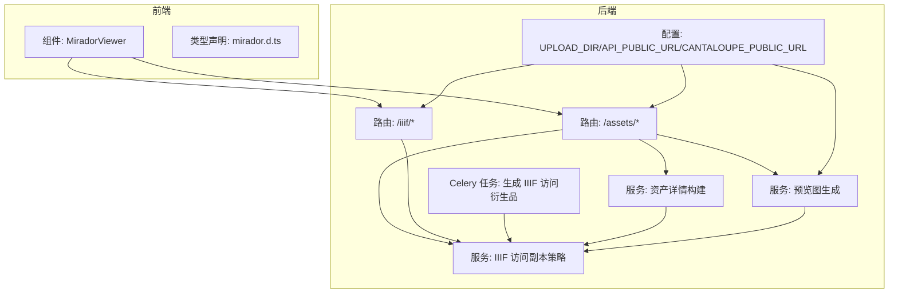
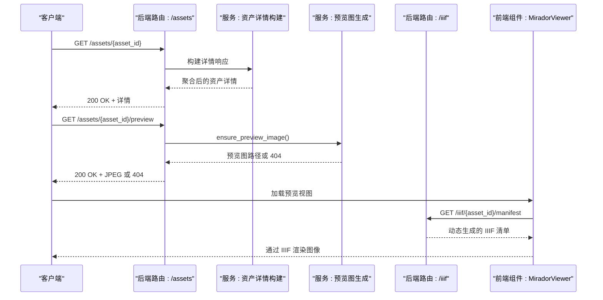
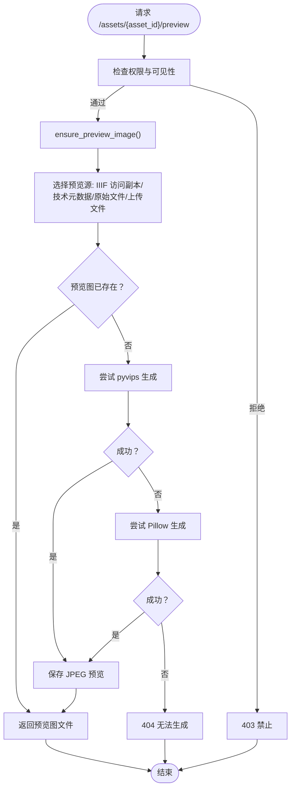
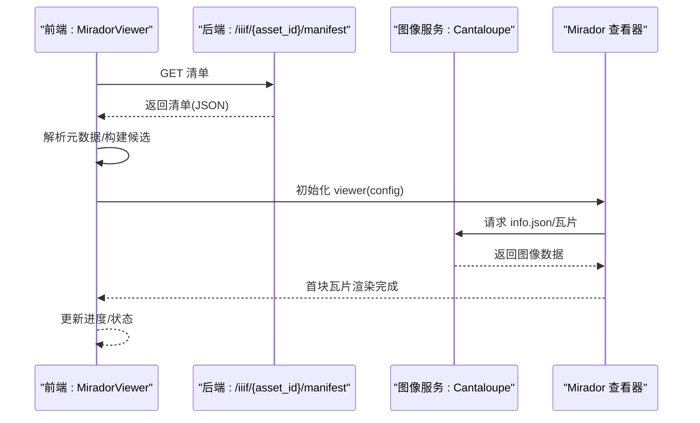
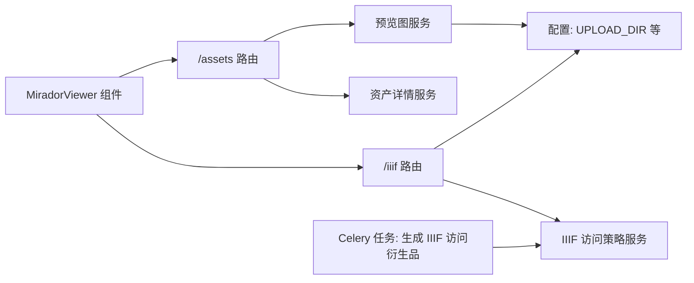

# 资产展示与预览

<cite>
**本文引用的文件**
- [backend/app/routers/assets.py](file://backend/app/routers/assets.py)
- [backend/app/services/asset_detail.py](file://backend/app/services/asset_detail.py)
- [backend/app/services/preview_images.py](file://backend/app/services/preview_images.py)
- [backend/app/routers/iiif.py](file://backend/app/routers/iiif.py)
- [backend/app/services/iiif_access.py](file://backend/app/services/iiif_access.py)
- [backend/app/schemas.py](file://backend/app/schemas.py)
- [backend/app/config.py](file://backend/app/config.py)
- [backend/app/tasks.py](file://backend/app/tasks.py)
- [frontend/src/MiradorViewer.tsx](file://frontend/src/MiradorViewer.tsx)
- [frontend/src/types/mirador.d.ts](file://frontend/src/types/mirador.d.ts)
- [docs/08-研究/IIIF清单配置说明（IIIF_MANIFEST_PROFILE）.md](file://docs/08-研究/IIIF清单配置说明（IIIF_MANIFEST_PROFILE）.md)
- [docs/08-研究/IIIF清单样本（IIIF_MANIFEST_SAMPLE）.md](file://docs/08-研究/IIIF清单样本（IIIF_MANIFEST_SAMPLE）.md)
</cite>

## 目录
1. [简介](#简介)
2. [项目结构](#项目结构)
3. [核心组件](#核心组件)
4. [架构总览](#架构总览)
5. [详细组件分析](#详细组件分析)
6. [依赖关系分析](#依赖关系分析)
7. [性能考量](#性能考量)
8. [故障排查指南](#故障排查指南)
9. [结论](#结论)
10. [附录](#附录)

## 简介
本文件聚焦二维资产管理的“资产展示与预览”模块，覆盖以下目标：
- 详述资产详情展示接口 GET /assets/{asset_id} 的实现、响应结构与数据来源
- 深入说明预览图生成与获取流程，包括尺寸规格、生成算法、缓存策略、质量控制
- 解释预览图获取接口 GET /assets/{asset_id}/preview 的行为、响应头与缓存控制
- 介绍 Mirador 图像查看器的集成方式、配置要点、交互能力与鉴权头传递
- 说明 IIIF 标准支持现状，包括图像服务集成、访问控制与权限验证
- 提供前端组件使用示例与集成指南
- 解释预览图生成时机与更新机制

## 项目结构
该模块横跨后端 FastAPI 路由与服务层、Celery 异步任务、以及前端 Mirador 查看器组件，形成“资产详情 + 预览图 + IIIF 清单 + 查看器”的闭环。

图表来源
- [backend/app/routers/assets.py:254-291](file://backend/app/routers/assets.py#L254-L291)
- [backend/app/routers/iiif.py:138-302](file://backend/app/routers/iiif.py#L138-L302)
- [backend/app/services/asset_detail.py:189-384](file://backend/app/services/asset_detail.py#L189-L384)
- [backend/app/services/preview_images.py:85-104](file://backend/app/services/preview_images.py#L85-L104)
- [backend/app/services/iiif_access.py:115-180](file://backend/app/services/iiif_access.py#L115-L180)
- [backend/app/tasks.py:151-181](file://backend/app/tasks.py#L151-L181)
- [backend/app/config.py:44-46](file://backend/app/config.py#L44-L46)
- [frontend/src/MiradorViewer.tsx:64-197](file://frontend/src/MiradorViewer.tsx#L64-L197)

章节来源
- [backend/app/routers/assets.py:254-291](file://backend/app/routers/assets.py#L254-L291)
- [backend/app/routers/iiif.py:138-302](file://backend/app/routers/iiif.py#L138-L302)
- [backend/app/services/asset_detail.py:189-384](file://backend/app/services/asset_detail.py#L189-L384)
- [backend/app/services/preview_images.py:85-104](file://backend/app/services/preview_images.py#L85-L104)
- [backend/app/services/iiif_access.py:115-180](file://backend/app/services/iiif_access.py#L115-L180)
- [backend/app/tasks.py:151-181](file://backend/app/tasks.py#L151-L181)
- [backend/app/config.py:44-46](file://backend/app/config.py#L44-L46)
- [frontend/src/MiradorViewer.tsx:64-197](file://frontend/src/MiradorViewer.tsx#L64-L197)

## 核心组件
- 资产详情接口：GET /assets/{asset_id} 返回聚合后的资产详情，包含访问路径、输出动作、生命周期与技术元数据等
- 预览图生成与获取：后端根据访问副本或原始文件生成 JPEG 预览，前端通过 /assets/{asset_id}/preview 获取
- IIIF 清单与图像服务：后端动态生成 IIIF Presentation 3 清单，前端通过 Mirador 加载并渲染
- 访问控制与权限：接口均受权限校验与可见性范围控制
- 异步生成：IIIF 访问衍生品通过 Celery 任务异步生成，提升上传体验

章节来源
- [backend/app/routers/assets.py:254-291](file://backend/app/routers/assets.py#L254-L291)
- [backend/app/services/asset_detail.py:189-384](file://backend/app/services/asset_detail.py#L189-L384)
- [backend/app/services/preview_images.py:85-104](file://backend/app/services/preview_images.py#L85-L104)
- [backend/app/routers/iiif.py:138-302](file://backend/app/routers/iiif.py#L138-L302)
- [backend/app/services/iiif_access.py:115-180](file://backend/app/services/iiif_access.py#L115-L180)
- [backend/app/tasks.py:151-181](file://backend/app/tasks.py#L151-L181)

## 架构总览
下图展示了从“资产详情”到“预览图获取”再到“Mirador 查看器”的端到端流程。

图表来源
- [backend/app/routers/assets.py:254-291](file://backend/app/routers/assets.py#L254-L291)
- [backend/app/services/asset_detail.py:189-384](file://backend/app/services/asset_detail.py#L189-L384)
- [backend/app/services/preview_images.py:85-104](file://backend/app/services/preview_images.py#L85-L104)
- [backend/app/routers/iiif.py:138-302](file://backend/app/routers/iiif.py#L138-L302)
- [frontend/src/MiradorViewer.tsx:200-271](file://frontend/src/MiradorViewer.tsx#L200-L271)

## 详细组件分析

### 资产详情展示：GET /assets/{asset_id}
- 权限与可见性：接口要求 image.view 权限，并根据资产的可见性范围与集合对象 ID 进行访问控制
- 数据来源：聚合核心元数据、技术元数据、生命周期事件、文件结构、访问路径与输出动作
- 关键字段：
  - 标识与标题、资源类型、可见性范围、集合对象 ID
  - 文件摘要、状态信息（含预览就绪标记）、生命周期与时间线
  - 结构：主文件、原始文件、衍生文件、打包说明
  - 访问路径：IIIF 清单、Mirador 预览链接、预览启用状态
  - 输出：下载当前文件、下载 BagIt 包
- 预览就绪：由 IIIF 就绪状态决定，用于前端控制预览可用性

章节来源
- [backend/app/routers/assets.py:254-265](file://backend/app/routers/assets.py#L254-L265)
- [backend/app/services/asset_detail.py:189-384](file://backend/app/services/asset_detail.py#L189-L384)
- [backend/app/schemas.py:121-144](file://backend/app/schemas.py#L121-L144)

### 预览图生成与获取
- 生成时机
  - 上传完成后，若存在 IIIF 访问副本则标记就绪；否则标记为派生品生成中并触发 Celery 任务
  - 预览图生成在首次请求 /assets/{asset_id}/preview 时按需生成
- 生成算法
  - 优先使用 pyvips：按最大宽度缩放，透明背景合并为 RGB，JPEG 编码（质量、优化、渐进）
  - 备选 Pillow：EXIF 方向纠正、透明度处理、缩略图生成、JPEG 保存
- 尺寸规格
  - 最大宽度：1600 像素
- 质量控制
  - JPEG 质量：82
  - 优化参数：strip、optimize_coding、interlace（pyvips），progressive（Pillow）
- 缓存策略
  - 预览图文件名包含源文件指纹（修改时间+大小），确保源文件变更时生成新文件
  - 若预览图已存在则直接返回
- 获取接口
  - GET /assets/{asset_id}/preview
  - 响应：image/jpeg，带 no-store、no-cache、must-revalidate、max-age=0 的缓存控制头
  - 403：无权限或不可见；404：预览图不可用

图表来源
- [backend/app/routers/assets.py:268-291](file://backend/app/routers/assets.py#L268-L291)
- [backend/app/services/preview_images.py:85-104](file://backend/app/services/preview_images.py#L85-L104)

章节来源
- [backend/app/routers/assets.py:268-291](file://backend/app/routers/assets.py#L268-L291)
- [backend/app/services/preview_images.py:12-15](file://backend/app/services/preview_images.py#L12-L15)
- [backend/app/services/preview_images.py:30-49](file://backend/app/services/preview_images.py#L30-L49)
- [backend/app/services/preview_images.py:52-68](file://backend/app/services/preview_images.py#L52-L68)
- [backend/app/services/preview_images.py:71-82](file://backend/app/services/preview_images.py#L71-L82)
- [backend/app/services/preview_images.py:85-104](file://backend/app/services/preview_images.py#L85-L104)

### IIIF 清单与图像服务集成
- 清单生成：GET /iiif/{asset_id}/manifest 动态组装 Presentation 3 清单，包含 Canvas、Annotation、ImageService2/3 服务条目
- 图像服务：后端代理到 Cantaloupe（默认 http://localhost:8182/iiif/2 或通过环境变量配置），并重写 info.json 的 @id/atId/id 为代理基址
- 公共 URL：API_PUBLIC_URL 与 CANTALOUPE_PUBLIC_URL 用于构造清单与服务地址
- 访问控制：接口同样受权限与可见性控制，隐藏资源返回 403
- 就绪状态：当资产状态为 ready 且存在有效的 IIIF 访问源时，视为预览就绪

章节来源
- [backend/app/routers/iiif.py:138-254](file://backend/app/routers/iiif.py#L138-L254)
- [backend/app/routers/iiif.py:257-302](file://backend/app/routers/iiif.py#L257-L302)
- [backend/app/services/iiif_access.py:176-179](file://backend/app/services/iiif_access.py#L176-L179)
- [backend/app/config.py:44-46](file://backend/app/config.py#L44-L46)

### Mirador 图像查看器集成
- 组件职责：加载 IIIF 清单、解析元数据、显示加载进度、提供“加入申请车”按钮、与查看器交互
- 配置要点：
  - 窗口配置：禁用关闭/全屏/最大化/顶部菜单/侧栏，默认单窗格视图
  - 缩放控件：开启
  - 请求预处理器：自动为 /api 与 /auth 路径附加 Authorization: Bearer Token
- 加载流程：
  - 先加载清单，提取元数据（Asset ID、Resource ID、Title、Object Number）
  - 初始化 Mirador 查看器，定时检测首块瓦片渲染完成，更新进度与状态
- 类型声明：mirador.d.ts 提供查看器引用类型，便于在组件中安全调用

图表来源
- [frontend/src/MiradorViewer.tsx:200-271](file://frontend/src/MiradorViewer.tsx#L200-L271)
- [frontend/src/MiradorViewer.tsx:110-150](file://frontend/src/MiradorViewer.tsx#L110-L150)
- [frontend/src/MiradorViewer.tsx:165-184](file://frontend/src/MiradorViewer.tsx#L165-L184)
- [backend/app/routers/iiif.py:257-302](file://backend/app/routers/iiif.py#L257-L302)

章节来源
- [frontend/src/MiradorViewer.tsx:64-197](file://frontend/src/MiradorViewer.tsx#L64-L197)
- [frontend/src/MiradorViewer.tsx:200-271](file://frontend/src/MiradorViewer.tsx#L200-L271)
- [frontend/src/types/mirador.d.ts:1-16](file://frontend/src/types/mirador.d.ts#L1-L16)

### IIIF 支持现状与权限验证
- 支持范围：动态清单生成、与 Cantaloupe 的图像服务集成、与 Mirador 的消费路径、权限边界
- 最小 Manifest Profile：面向单资产图像访问的最小 Presentation profile
- 权限验证：隐藏资源对无权限用户返回 403，确保 IIIF 输出不绕过权限控制
- 公共 URL：API_PUBLIC_URL 与 CANTALOUPE_PUBLIC_URL 可通过环境变量配置

章节来源
- [docs/08-研究/IIIF清单配置说明（IIIF_MANIFEST_PROFILE）.md:33-43](file://docs/08-研究/IIIF清单配置说明（IIIF_MANIFEST_PROFILE）.md#L33-L43)
- [docs/08-研究/IIIF清单配置说明（IIIF_MANIFEST_PROFILE）.md:92-111](file://docs/08-研究/IIIF清单配置说明（IIIF_MANIFEST_PROFILE）.md#L92-L111)
- [docs/08-研究/IIIF清单样本（IIIF_MANIFEST_SAMPLE）.md:19-106](file://docs/08-研究/IIIF清单样本（IIIF_MANIFEST_SAMPLE）.md#L19-L106)
- [backend/app/routers/iiif.py:138-139](file://backend/app/routers/iiif.py#L138-L139)
- [backend/app/routers/iiif.py:57-63](file://backend/app/routers/iiif.py#L57-L63)
- [backend/app/config.py:44-46](file://backend/app/config.py#L44-L46)

### 前端组件使用示例与集成指南
- 使用步骤
  - 准备清单 URL：来自资产详情中的 access_paths.mirador_preview.manifest_url 或 /iiif/{asset_id}/manifest
  - 在页面中引入 MiradorViewer 组件，传入 manifestId
  - 可选：提供 onAddToApplication 回调，将候选资源加入应用车
- 鉴权头：组件会在请求 /api 与 /auth 路径时自动附加 Authorization: Bearer Token
- 加载状态：组件内置加载阶段与进度条，首块瓦片渲染完成后进入 ready

章节来源
- [frontend/src/MiradorViewer.tsx:64-197](file://frontend/src/MiradorViewer.tsx#L64-L197)
- [frontend/src/MiradorViewer.tsx:200-271](file://frontend/src/MiradorViewer.tsx#L200-L271)

### 预览图生成时机与更新机制
- 上传即发：上传完成后若存在 IIIF 访问副本则立即标记就绪；否则标记为派生品生成中并异步生成
- 首次请求生成：GET /assets/{asset_id}/preview 时按需生成预览图
- 源文件指纹：预览图文件名包含源文件修改时间与大小，源文件变更将触发新预览图生成
- IIIF 就绪：资产状态为 ready 且存在有效访问源时，预览就绪标记为 true

章节来源
- [backend/app/routers/assets.py:121-133](file://backend/app/routers/assets.py#L121-L133)
- [backend/app/tasks.py:151-181](file://backend/app/tasks.py#L151-L181)
- [backend/app/services/preview_images.py:18-27](file://backend/app/services/preview_images.py#L18-L27)
- [backend/app/services/iiif_access.py:176-179](file://backend/app/services/iiif_access.py#L176-L179)

## 依赖关系分析
- 路由层依赖服务层：/assets 与 /iiif 路由分别委托给资产详情、预览图与 IIIF 访问策略服务
- 服务层依赖配置：预览图目录、公共 URL、图像服务地址均来自配置
- 异步任务依赖：Celery 任务负责生成 IIIF 访问衍生品，完成后更新资产状态与技术元数据
- 前端依赖后端：MiradorViewer 通过清单 URL 与后端交互，自动处理鉴权头

图表来源
- [backend/app/routers/assets.py:254-291](file://backend/app/routers/assets.py#L254-L291)
- [backend/app/routers/iiif.py:138-302](file://backend/app/routers/iiif.py#L138-L302)
- [backend/app/services/asset_detail.py:189-384](file://backend/app/services/asset_detail.py#L189-L384)
- [backend/app/services/preview_images.py:85-104](file://backend/app/services/preview_images.py#L85-L104)
- [backend/app/services/iiif_access.py:115-180](file://backend/app/services/iiif_access.py#L115-L180)
- [backend/app/tasks.py:151-181](file://backend/app/tasks.py#L151-L181)
- [backend/app/config.py:44-46](file://backend/app/config.py#L44-L46)
- [frontend/src/MiradorViewer.tsx:64-197](file://frontend/src/MiradorViewer.tsx#L64-L197)

章节来源
- [backend/app/routers/assets.py:254-291](file://backend/app/routers/assets.py#L254-L291)
- [backend/app/routers/iiif.py:138-302](file://backend/app/routers/iiif.py#L138-L302)
- [backend/app/services/asset_detail.py:189-384](file://backend/app/services/asset_detail.py#L189-L384)
- [backend/app/services/preview_images.py:85-104](file://backend/app/services/preview_images.py#L85-L104)
- [backend/app/services/iiif_access.py:115-180](file://backend/app/services/iiif_access.py#L115-L180)
- [backend/app/tasks.py:151-181](file://backend/app/tasks.py#L151-L181)
- [backend/app/config.py:44-46](file://backend/app/config.py#L44-L46)
- [frontend/src/MiradorViewer.tsx:64-197](file://frontend/src/MiradorViewer.tsx#L64-L197)

## 性能考量
- 预览图生成
  - 采用 pyvips 优先，具备更好的内存与吞吐表现；Pillow 作为降级方案
  - 最大宽度限制与 JPEG 参数优化，兼顾体积与清晰度
- IIIF 清单与图像服务
  - 清单为动态生成，避免静态文件维护成本
  - 图像服务代理到 Cantaloupe，利用其瓦片化与金字塔结构，支持大图高效渲染
- 异步生成
  - 上传后立即返回，后台异步生成 IIIF 访问衍生品，改善用户体验
- 缓存控制
  - 预览图按源文件指纹命名，变更即刷新；预览接口显式禁用缓存，保证一致性

[本节为通用性能讨论，无需特定文件来源]

## 故障排查指南
- 403 禁止访问
  - 检查用户权限与资产可见性范围；隐藏资源对无权限用户返回 403
- 404 预览图不可用
  - 确认是否存在有效的 IIIF 访问副本或原始文件；预览图生成失败时返回 404
- 预览图不更新
  - 源文件变更后预览图不会自动替换，需等待新生成；可通过删除旧预览图触发重新生成
- IIIF 清单加载失败
  - 检查 API_PUBLIC_URL 与 CANTALOUPE_PUBLIC_URL 配置；确认后端与图像服务可达
- 查看器加载缓慢
  - 首次加载会先请求低清预览，再生成 info.json 与瓦片；大图与 TIFF 通常较慢，属正常现象

章节来源
- [backend/app/routers/assets.py:268-291](file://backend/app/routers/assets.py#L268-L291)
- [backend/app/routers/iiif.py:57-63](file://backend/app/routers/iiif.py#L57-L63)
- [backend/app/services/preview_images.py:85-104](file://backend/app/services/preview_images.py#L85-L104)
- [backend/app/config.py:44-46](file://backend/app/config.py#L44-L46)
- [frontend/src/MiradorViewer.tsx:364-381](file://frontend/src/MiradorViewer.tsx#L364-L381)

## 结论
本模块通过“资产详情 + 预览图 + IIIF 清单 + Mirador 查看器”的组合，实现了二维资产的完整展示与预览能力。后端提供灵活的访问副本策略与异步生成机制，前端以 Mirador 为核心实现高质量图像浏览体验。IIIF 清单与图像服务集成确保了标准兼容与可扩展性，权限控制贯穿始终，保障数据安全。

[本节为总结性内容，无需特定文件来源]

## 附录

### API 定义与响应格式

- GET /assets/{asset_id}
  - 权限：image.view
  - 响应：AssetDetailResponse（包含文件结构、访问路径、输出动作、生命周期、技术元数据等）
  - 参考：[backend/app/routers/assets.py:254-265](file://backend/app/routers/assets.py#L254-L265)，[backend/app/services/asset_detail.py:189-384](file://backend/app/services/asset_detail.py#L189-L384)，[backend/app/schemas.py:121-144](file://backend/app/schemas.py#L121-L144)

- GET /assets/{asset_id}/preview
  - 权限：image.view
  - 响应：image/jpeg，带 no-store、no-cache、must-revalidate、max-age=0 缓存头
  - 参考：[backend/app/routers/assets.py:268-291](file://backend/app/routers/assets.py#L268-L291)，[backend/app/services/preview_images.py:85-104](file://backend/app/services/preview_images.py#L85-L104)

- GET /iiif/{asset_id}/manifest
  - 权限：image.view
  - 响应：IIIF Presentation 3 清单（动态生成）
  - 参考：[backend/app/routers/iiif.py:138-254](file://backend/app/routers/iiif.py#L138-L254)

- GET /iiif/{asset_id}/service/{image_path:path}
  - 权限：image.view
  - 响应：图像服务代理结果（info.json 重写 @id/atId/id）
  - 参考：[backend/app/routers/iiif.py:257-302](file://backend/app/routers/iiif.py#L257-L302)

### 预览图生成参数与策略
- 目录与命名：预览图位于 UPLOAD_DIR/previews，文件名包含源文件指纹
- 尺寸：最大宽度 1600 像素
- 质量：JPEG 质量 82，优化参数启用
- 生成顺序：pyvips → Pillow（降级）
- 缓存：按源文件指纹命名，变更即刷新

章节来源
- [backend/app/services/preview_images.py:12-15](file://backend/app/services/preview_images.py#L12-L15)
- [backend/app/services/preview_images.py:23-27](file://backend/app/services/preview_images.py#L23-L27)
- [backend/app/services/preview_images.py:52-68](file://backend/app/services/preview_images.py#L52-L68)
- [backend/app/services/preview_images.py:71-82](file://backend/app/services/preview_images.py#L71-L82)
- [backend/app/services/preview_images.py:85-104](file://backend/app/services/preview_images.py#L85-L104)

### IIIF 支持与配置
- 清单 Profile：面向单资产图像访问的最小 Presentation profile
- 公共 URL：API_PUBLIC_URL、CANTALOUPE_PUBLIC_URL
- 权限边界：隐藏资源对无权限用户返回 403
- 图像服务：代理到 Cantaloupe，info.json 的 @id/atId/id 重写为代理基址

章节来源
- [docs/08-研究/IIIF清单配置说明（IIIF_MANIFEST_PROFILE）.md:33-43](file://docs/08-研究/IIIF清单配置说明（IIIF_MANIFEST_PROFILE）.md#L33-L43)
- [docs/08-研究/IIIF清单配置说明（IIIF_MANIFEST_PROFILE）.md:92-111](file://docs/08-研究/IIIF清单配置说明（IIIF_MANIFEST_PROFILE）.md#L92-L111)
- [docs/08-研究/IIIF清单样本（IIIF_MANIFEST_SAMPLE）.md:19-106](file://docs/08-研究/IIIF清单样本（IIIF_MANIFEST_SAMPLE）.md#L19-L106)
- [backend/app/config.py:44-46](file://backend/app/config.py#L44-L46)
- [backend/app/routers/iiif.py:257-302](file://backend/app/routers/iiif.py#L257-L302)