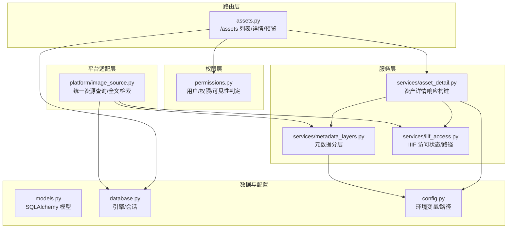
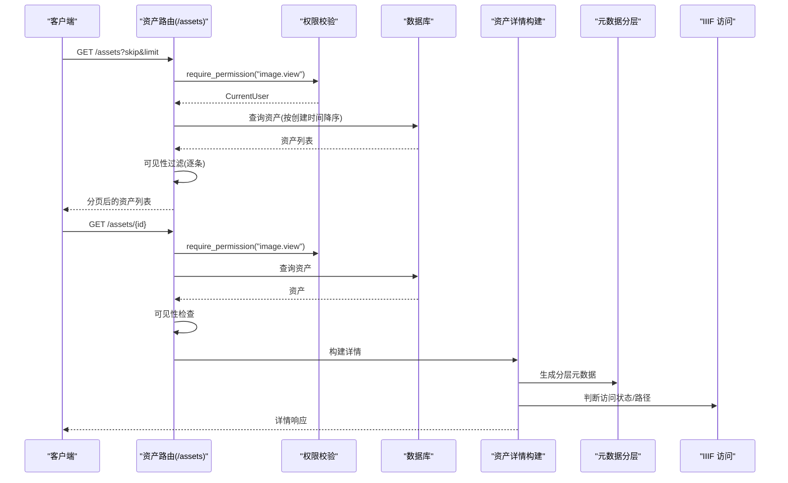
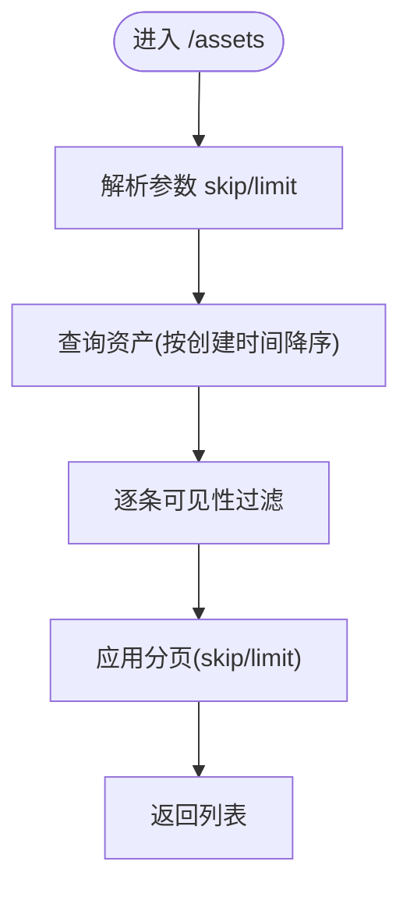
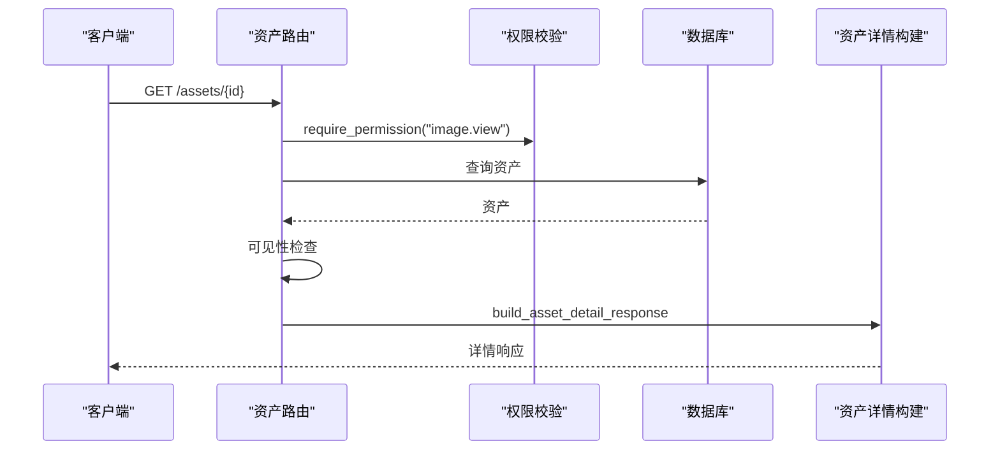
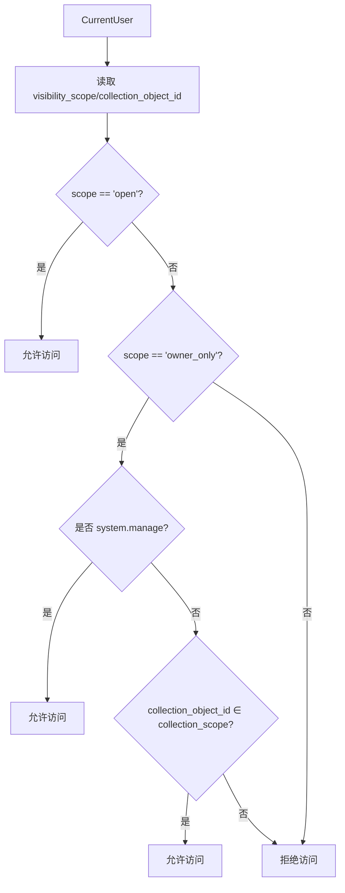
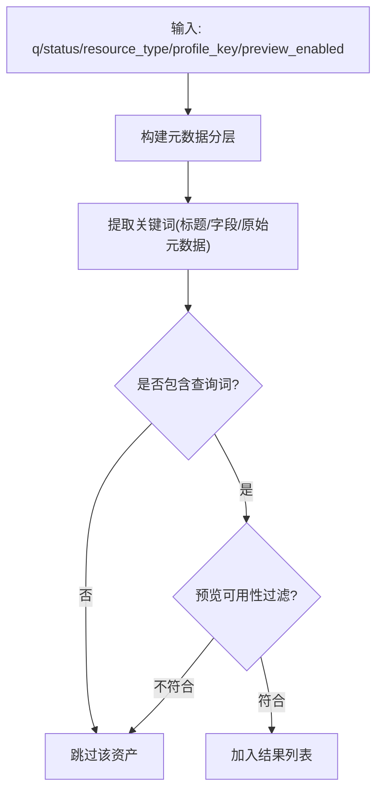
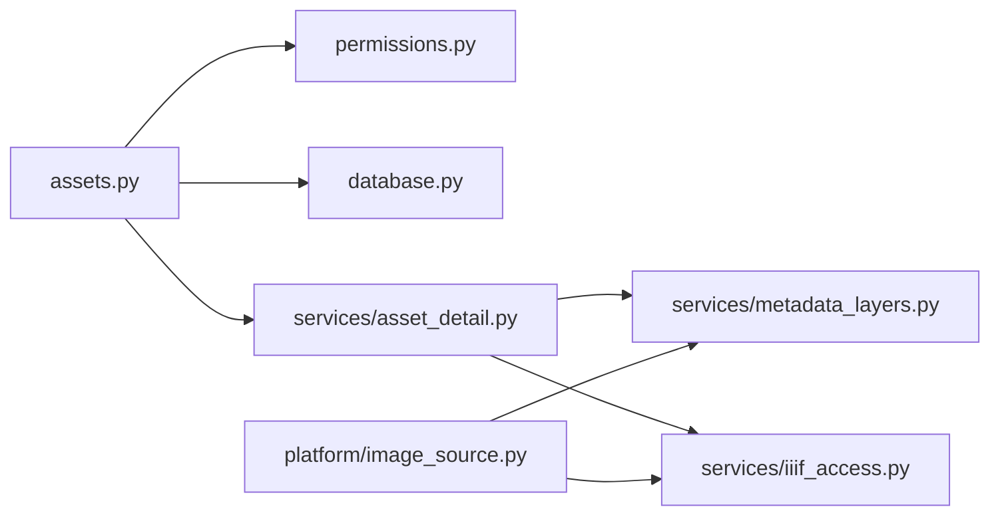

# 资产检索与查询

<cite>
**本文引用的文件**
- [backend/app/routers/assets.py](file://backend/app/routers/assets.py)
- [backend/app/models.py](file://backend/app/models.py)
- [backend/app/schemas.py](file://backend/app/schemas.py)
- [backend/app/permissions.py](file://backend/app/permissions.py)
- [backend/app/services/asset_detail.py](file://backend/app/services/asset_detail.py)
- [backend/app/services/metadata_layers.py](file://backend/app/services/metadata_layers.py)
- [backend/app/services/iiif_access.py](file://backend/app/services/iiif_access.py)
- [backend/app/platform/image_source.py](file://backend/app/platform/image_source.py)
- [backend/app/database.py](file://backend/app/database.py)
- [backend/app/config.py](file://backend/app/config.py)
- [backend/tests/test_asset_visibility.py](file://backend/tests/test_asset_visibility.py)
</cite>

## 目录
1. [简介](#简介)
2. [项目结构](#项目结构)
3. [核心组件](#核心组件)
4. [架构概览](#架构概览)
5. [详细组件分析](#详细组件分析)
6. [依赖关系分析](#依赖关系分析)
7. [性能考虑](#性能考虑)
8. [故障排查指南](#故障排查指南)
9. [结论](#结论)
10. [附录：API 使用示例与最佳实践](#附录api-使用示例与最佳实践)

## 简介
本文件面向二维资产管理系统的“资产检索与查询”模块，聚焦以下目标：
- 资产列表查询：分页、排序、过滤与可见性控制
- 权限控制：可见性范围检查、集合对象权限验证、用户角色访问控制
- 查询接口实现：GET /assets 的端点行为、参数与返回格式
- 高级查询：全文搜索、标签过滤、状态/资源类型过滤、预览可用性过滤
- 性能优化：索引使用、查询缓存、结果集优化
- 结果安全：权限验证与数据脱敏
- 实战示例与最佳实践

## 项目结构
围绕资产检索与查询的关键后端文件组织如下：
- 路由层：定义 /assets 列表与详情、预览等接口
- 权限层：用户上下文解析、角色与权限校验、可见性范围判定
- 服务层：资产详情构建、元数据分层、IIIF 访问路径与状态判断
- 平台适配层：统一资源查询（含全文检索）
- 数据模型与数据库：SQLAlchemy 模型与会话管理
- 配置与测试：运行时配置、单元/集成测试

图表来源
- [backend/app/routers/assets.py:24-292](file://backend/app/routers/assets.py#L24-L292)
- [backend/app/permissions.py:17-255](file://backend/app/permissions.py#L17-L255)
- [backend/app/services/asset_detail.py:189-385](file://backend/app/services/asset_detail.py#L189-L385)
- [backend/app/services/metadata_layers.py:412-541](file://backend/app/services/metadata_layers.py#L412-L541)
- [backend/app/services/iiif_access.py:115-180](file://backend/app/services/iiif_access.py#L115-L180)
- [backend/app/platform/image_source.py:50-151](file://backend/app/platform/image_source.py#L50-L151)
- [backend/app/models.py:6-26](file://backend/app/models.py#L6-L26)
- [backend/app/database.py:1-17](file://backend/app/database.py#L1-L17)
- [backend/app/config.py:42-46](file://backend/app/config.py#L42-L46)

章节来源
- [backend/app/routers/assets.py:24-292](file://backend/app/routers/assets.py#L24-L292)
- [backend/app/platform/image_source.py:50-151](file://backend/app/platform/image_source.py#L50-L151)

## 核心组件
- 资产模型与索引
  - 资产表包含 id、文件名、可见性范围、集合对象 ID、资源类型、状态、创建时间等字段，并在关键列建立索引以支持查询与排序。
- 权限与可见性
  - 用户上下文包含角色、权限集合与集合范围；可见性判定依据“公开/仅责任人”及集合范围。
- 元数据分层
  - 将原始元数据拆分为 core、management、technical、profile、raw_metadata 等层次，便于检索与展示。
- IIIF 访问状态
  - 通过技术元数据判断资产是否具备 IIIF 访问副本或原文件，用于预览可用性与下载路径选择。

章节来源
- [backend/app/models.py:6-26](file://backend/app/models.py#L6-L26)
- [backend/app/permissions.py:115-255](file://backend/app/permissions.py#L115-L255)
- [backend/app/services/metadata_layers.py:412-541](file://backend/app/services/metadata_layers.py#L412-L541)
- [backend/app/services/iiif_access.py:115-180](file://backend/app/services/iiif_access.py#L115-L180)

## 架构概览
资产检索与查询涉及多层协作：
- 路由层接收请求并注入权限依赖
- 权限层解析用户身份、角色与集合范围
- 服务层构建资产详情与元数据分层
- 平台适配层执行统一资源查询与全文检索
- 数据层负责 SQL 查询与排序

图表来源
- [backend/app/routers/assets.py:209-266](file://backend/app/routers/assets.py#L209-L266)
- [backend/app/permissions.py:214-236](file://backend/app/permissions.py#L214-L236)
- [backend/app/services/asset_detail.py:189-385](file://backend/app/services/asset_detail.py#L189-L385)
- [backend/app/services/metadata_layers.py:412-541](file://backend/app/services/metadata_layers.py#L412-L541)
- [backend/app/services/iiif_access.py:115-180](file://backend/app/services/iiif_access.py#L115-L180)

## 详细组件分析

### 资产列表查询（GET /assets）
- 功能概述
  - 支持分页(skip/limit)、默认按创建时间倒序、按可见性范围过滤后返回。
- 参数与默认值
  - skip: 默认 0
  - limit: 默认 100
- 排序规则
  - 按 created_at 降序，再按 id 降序，确保稳定排序。
- 过滤与可见性
  - 先全量加载，再在应用侧进行可见性过滤，避免直接暴露不可见资产。
- 返回格式
  - 返回 AssetOut 列表，字段包含基础信息与状态等。

图表来源
- [backend/app/routers/assets.py:209-219](file://backend/app/routers/assets.py#L209-L219)

章节来源
- [backend/app/routers/assets.py:209-219](file://backend/app/routers/assets.py#L209-L219)
- [backend/app/schemas.py:7-21](file://backend/app/schemas.py#L7-L21)

### 资产详情查询（GET /assets/{id}）
- 功能概述
  - 获取单个资产的完整详情，包含文件结构、生命周期、访问路径、输出链接等。
- 权限与可见性
  - 同样需要 image.view 权限，并进行可见性检查，否则返回 403。
- 返回格式
  - AssetDetailResponse，涵盖文件摘要、状态信息、生命周期、结构、技术与分层元数据、访问与输出等。

图表来源
- [backend/app/routers/assets.py:254-266](file://backend/app/routers/assets.py#L254-L266)
- [backend/app/services/asset_detail.py:189-385](file://backend/app/services/asset_detail.py#L189-L385)

章节来源
- [backend/app/routers/assets.py:254-266](file://backend/app/routers/assets.py#L254-L266)
- [backend/app/schemas.py:121-144](file://backend/app/schemas.py#L121-L144)

### 预览图片获取（GET /assets/{id}/preview）
- 功能概述
  - 生成并返回资产的预览图，若无则返回 404。
- 权限与可见性
  - 需要 image.view 权限且资产对当前用户可见。
- 缓存控制
  - 设置 no-store/no-cache/pragmano-cache 头，避免代理缓存。

章节来源
- [backend/app/routers/assets.py:268-291](file://backend/app/routers/assets.py#L268-L291)

### 权限控制与可见性范围
- 用户上下文
  - 从多种来源解析用户：Bearer Token、Cookie、兼容头；构建 CurrentUser，包含角色、权限集合与集合范围。
- 可见性判定
  - “公开”：具备 image.view 或 three_d.view 即可
  - “仅责任人”：需具备 system.manage 或 collection_object_id 在用户集合范围内
- 集合对象权限
  - 通过集合范围集合进行授权判断，避免越权访问。

图表来源
- [backend/app/permissions.py:239-255](file://backend/app/permissions.py#L239-L255)

章节来源
- [backend/app/permissions.py:179-255](file://backend/app/permissions.py#L179-L255)

### 元数据分层与统一资源查询
- 元数据分层
  - 将原始元数据归类为 core、management、technical、profile、raw_metadata 等层次，便于检索与展示。
- 统一资源查询
  - 支持全文检索、状态过滤、资源类型过滤、预览可用性过滤、档案类型过滤等，内部对资产进行元数据分层后拼接关键词进行匹配。

图表来源
- [backend/app/platform/image_source.py:69-151](file://backend/app/platform/image_source.py#L69-L151)
- [backend/app/services/metadata_layers.py:412-541](file://backend/app/services/metadata_layers.py#L412-L541)

章节来源
- [backend/app/platform/image_source.py:50-151](file://backend/app/platform/image_source.py#L50-L151)
- [backend/app/services/metadata_layers.py:412-541](file://backend/app/services/metadata_layers.py#L412-L541)

### IIIF 访问与预览可用性
- 访问状态判断
  - 仅当资产状态为 ready 且存在 IIIF 访问副本或原文件时，视为预览可用。
- 访问路径与 MIME 类型
  - 提供 IIIF 访问副本路径、原文件路径与 MIME 类型推断逻辑，用于前端预览与下载。

章节来源
- [backend/app/services/iiif_access.py:115-180](file://backend/app/services/iiif_access.py#L115-L180)
- [backend/app/services/asset_detail.py:189-385](file://backend/app/services/asset_detail.py#L189-L385)

## 依赖关系分析
- 路由依赖权限与数据库
  - /assets 列表与详情均依赖 require_permission 与 get_db
- 详情构建依赖元数据分层与 IIIF 服务
  - 详情响应中包含结构、生命周期、访问路径、输出链接等，均由服务层组合
- 平台统一查询依赖元数据分层与 IIIF 状态
  - 统一资源查询在内部同样调用元数据分层与预览可用性判断

图表来源
- [backend/app/routers/assets.py:1-24](file://backend/app/routers/assets.py#L1-L24)
- [backend/app/permissions.py:1-255](file://backend/app/permissions.py#L1-L255)
- [backend/app/services/asset_detail.py:1-385](file://backend/app/services/asset_detail.py#L1-L385)
- [backend/app/services/metadata_layers.py:1-636](file://backend/app/services/metadata_layers.py#L1-L636)
- [backend/app/services/iiif_access.py:1-259](file://backend/app/services/iiif_access.py#L1-L259)
- [backend/app/platform/image_source.py:1-228](file://backend/app/platform/image_source.py#L1-L228)
- [backend/app/database.py:1-17](file://backend/app/database.py#L1-L17)

章节来源
- [backend/app/routers/assets.py:1-24](file://backend/app/routers/assets.py#L1-L24)
- [backend/app/platform/image_source.py:1-228](file://backend/app/platform/image_source.py#L1-L228)

## 性能考虑
- 索引使用
  - 资产模型在关键列（如 visibility_scope、collection_object_id、resource_type、status、created_at 等）建立索引，有助于排序与过滤。
- 查询与排序
  - 列表接口默认按 created_at 降序、id 降序，减少随机访问成本。
- 应用侧过滤
  - 列表先全量加载再应用可见性过滤，适合中小规模数据；大规模数据建议在数据库层增加过滤条件。
- 缓存策略
  - 统一资源查询与元数据分层可结合 Redis 缓存热点数据（如元数据分层结果、预览可用性标记），降低重复计算。
- 结果集优化
  - 列表接口限制默认每页数量，避免一次性返回过多数据；详情接口按需返回必要字段，避免冗余传输。

章节来源
- [backend/app/models.py:9-25](file://backend/app/models.py#L9-L25)
- [backend/app/routers/assets.py:209-219](file://backend/app/routers/assets.py#L209-L219)
- [backend/app/config.py:42-46](file://backend/app/config.py#L42-L46)

## 故障排查指南
- 403 未授权
  - 检查用户是否具备 image.view 权限，以及资产可见性范围与集合范围是否匹配。
- 404 未找到
  - 资产不存在或预览图未生成；确认资产状态与文件路径。
- 可见性范围测试
  - 单元测试覆盖了“公开/仅责任人”与系统管理员的差异，可参考测试用例定位问题。

章节来源
- [backend/tests/test_asset_visibility.py:75-124](file://backend/tests/test_asset_visibility.py#L75-L124)
- [backend/app/routers/assets.py:263-264](file://backend/app/routers/assets.py#L263-L264)

## 结论
本模块通过清晰的路由、严格的权限与可见性控制、完善的元数据分层与 IIIF 访问状态判断，实现了稳定的资产检索与查询能力。对于大规模数据与高并发场景，建议在数据库层引入更多过滤条件与索引优化，并结合缓存策略进一步提升性能。

## 附录：API 使用示例与最佳实践
- GET /assets
  - 参数：skip（默认 0）、limit（默认 100）
  - 行为：按创建时间倒序返回资产列表，应用侧进行可见性过滤后再分页
  - 返回：AssetOut 列表
- GET /assets/{id}
  - 行为：返回资产详情（AssetDetailResponse）
  - 注意：需具备 image.view 权限且资产对当前用户可见
- GET /assets/{id}/preview
  - 行为：返回预览图文件
  - 注意：设置 no-store/no-cache/pragmano-cache 头
- 高级查询（统一资源）
  - 支持 q（全文检索）、status（状态）、resource_type（资源类型）、profile_key（档案类型）、preview_enabled（预览可用性）等过滤
  - 内部基于元数据分层构建关键词并匹配

最佳实践
- 列表查询优先使用分页参数，避免超大返回
- 对于高价值资产，尽量使用“仅责任人”可见性并正确维护集合范围
- 统一资源查询建议配合状态与类型过滤，减少无关匹配
- 前端应处理 403/404 场景并提示用户权限或资源缺失

章节来源
- [backend/app/routers/assets.py:209-291](file://backend/app/routers/assets.py#L209-L291)
- [backend/app/platform/image_source.py:50-151](file://backend/app/platform/image_source.py#L50-L151)
- [backend/app/schemas.py:7-21](file://backend/app/schemas.py#L7-L21)
- [backend/app/schemas.py:121-144](file://backend/app/schemas.py#L121-L144)