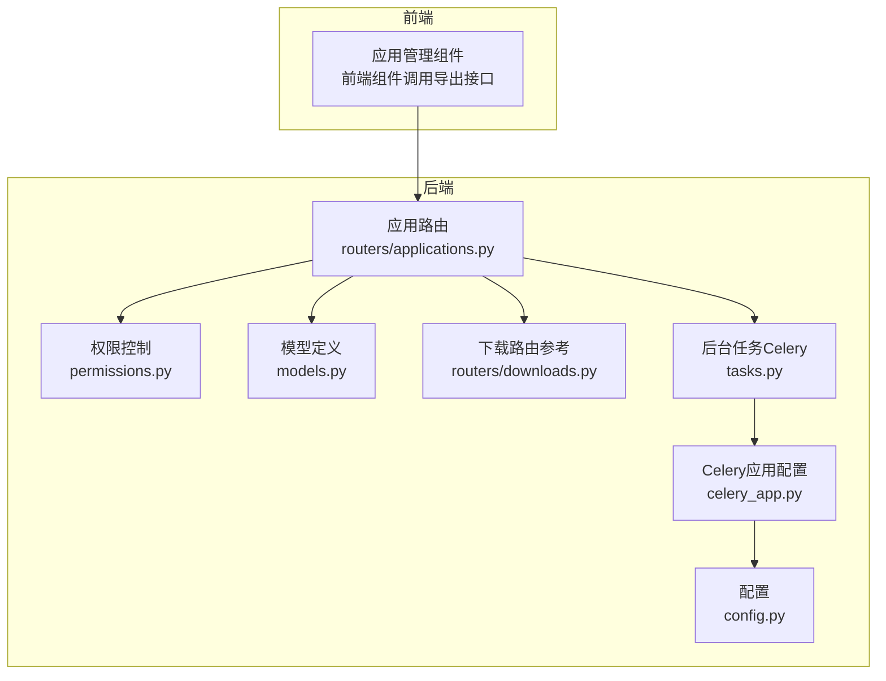
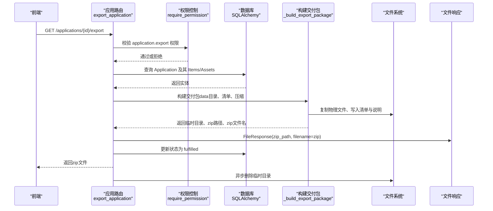
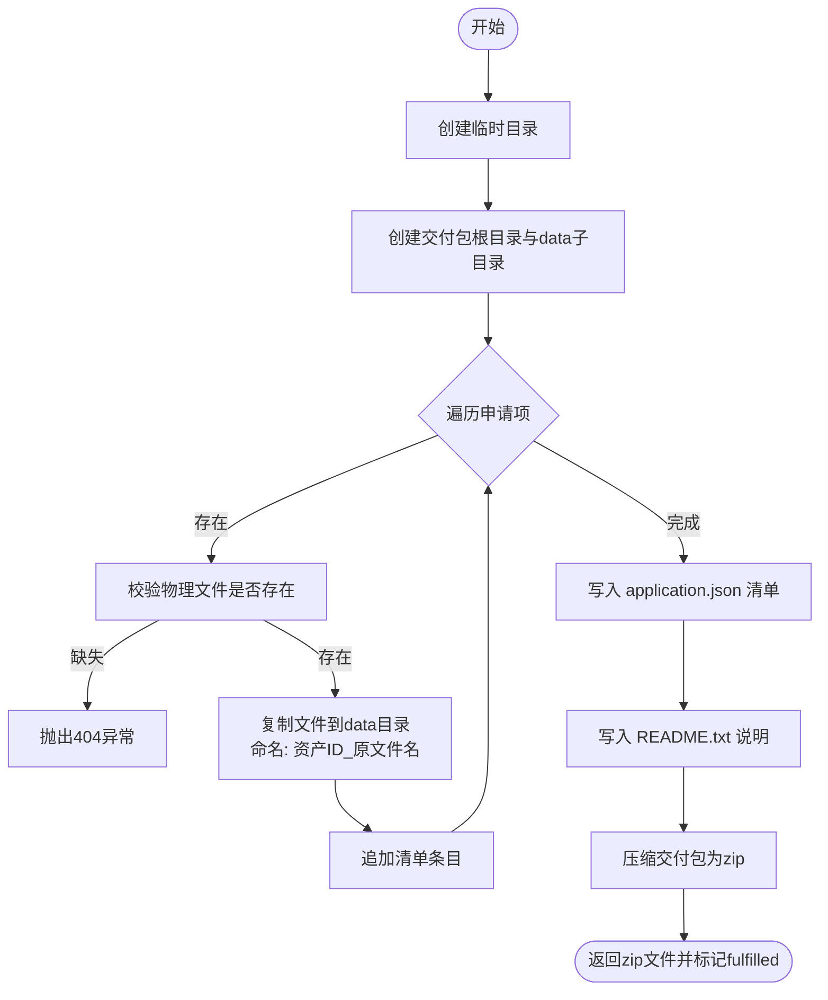
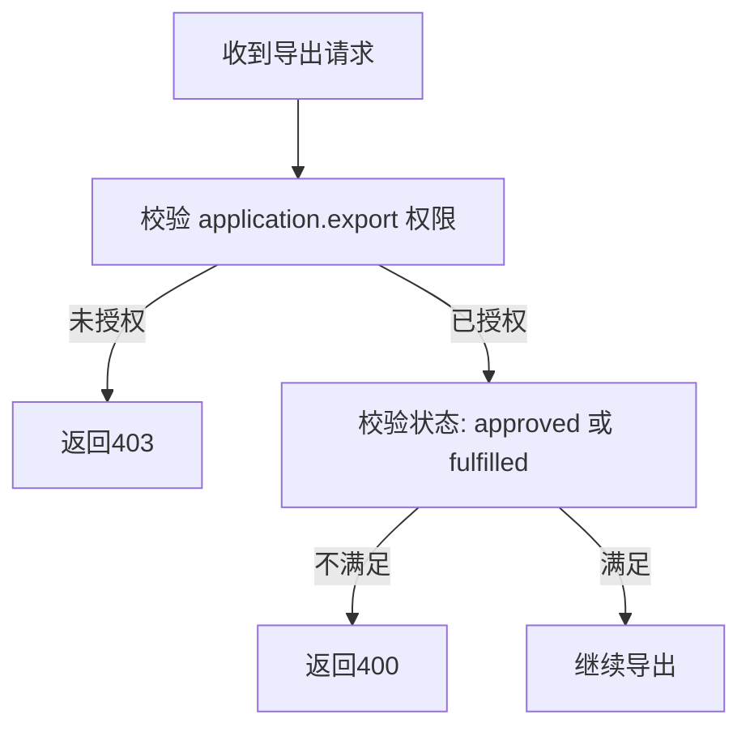
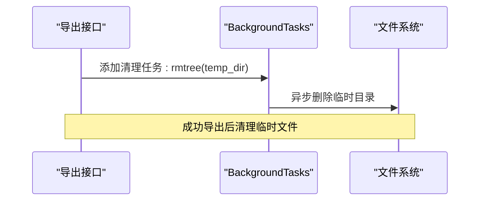
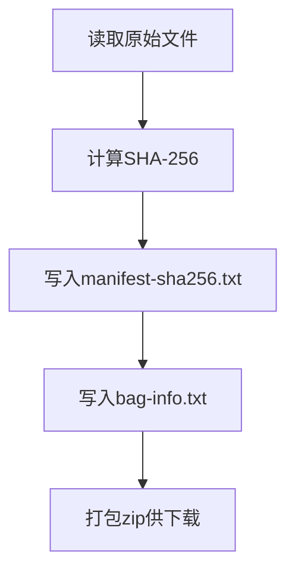
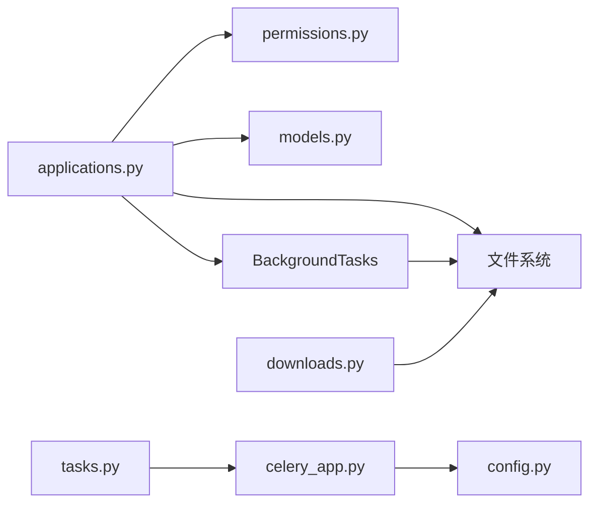

# 交付包导出

<cite>
**本文引用的文件**
- [applications.py](file://backend/app/routers/applications.py)
- [permissions.py](file://backend/app/permissions.py)
- [models.py](file://backend/app/models.py)
- [downloads.py](file://backend/app/routers/downloads.py)
- [tasks.py](file://backend/app/tasks.py)
- [celery_app.py](file://backend/app/celery_app.py)
- [config.py](file://backend/app/config.py)
- [test_applications.py](file://backend/tests/test_applications.py)
- [test_output_contracts.py](file://backend/tests/test_output_contracts.py)
</cite>

## 目录
1. [简介](#简介)
2. [项目结构](#项目结构)
3. [核心组件](#核心组件)
4. [架构总览](#架构总览)
5. [详细组件分析](#详细组件分析)
6. [依赖分析](#依赖分析)
7. [性能考虑](#性能考虑)
8. [故障排查指南](#故障排查指南)
9. [结论](#结论)
10. [附录](#附录)

## 简介
本文件面向MDAMS原型项目的交付包导出功能，系统性阐述交付包的生成流程、文件结构、内容构成、权限控制、后台任务处理、下载与传输、完整性校验以及性能优化与监控建议。目标是帮助开发者与运维人员准确理解并高效维护该功能。

## 项目结构
交付包导出功能主要由后端FastAPI路由与数据库模型组成，同时涉及权限控制与后台清理任务。前端侧在应用管理界面提供导出触发入口；测试用例覆盖导出状态变更与返回包体的基本契约。

**图表来源**
- [applications.py:235-253](file://backend/app/routers/applications.py#L235-L253)
- [permissions.py:43-50](file://backend/app/permissions.py#L43-L50)
- [models.py:176-213](file://backend/app/models.py#L176-L213)
- [downloads.py:51-118](file://backend/app/routers/downloads.py#L51-L118)
- [tasks.py:151-182](file://backend/app/tasks.py#L151-L182)
- [celery_app.py:1-18](file://backend/app/celery_app.py#L1-L18)
- [config.py:42-46](file://backend/app/config.py#L42-L46)

**章节来源**
- [applications.py:235-253](file://backend/app/routers/applications.py#L235-L253)
- [permissions.py:43-50](file://backend/app/permissions.py#L43-L50)
- [models.py:176-213](file://backend/app/models.py#L176-L213)
- [downloads.py:51-118](file://backend/app/routers/downloads.py#L51-L118)
- [tasks.py:151-182](file://backend/app/tasks.py#L151-L182)
- [celery_app.py:1-18](file://backend/app/celery_app.py#L1-L18)
- [config.py:42-46](file://backend/app/config.py#L42-L46)

## 核心组件
- 应用路由导出接口：负责接收导出请求、校验权限与状态、构建交付包、压缩并返回文件响应。
- 权限控制：基于角色与权限矩阵，限定“application.export”权限使用者。
- 数据模型：Application/ApplicationItem/Asset三者关联，承载导出清单与物理文件路径。
- 后台清理：通过BackgroundTasks异步删除临时目录，避免阻塞主线程。
- 参考实现：下载路由中的BagIt风格打包可作为交付包结构设计的参考。

**章节来源**
- [applications.py:235-253](file://backend/app/routers/applications.py#L235-L253)
- [permissions.py:43-50](file://backend/app/permissions.py#L43-L50)
- [models.py:176-213](file://backend/app/models.py#L176-L213)
- [downloads.py:51-118](file://backend/app/routers/downloads.py#L51-L118)

## 架构总览
下图展示一次交付包导出的关键交互：前端触发、后端鉴权与状态校验、构建交付包、压缩与返回、后台清理临时文件。

**图表来源**
- [applications.py:235-253](file://backend/app/routers/applications.py#L235-L253)
- [applications.py:70-129](file://backend/app/routers/applications.py#L70-L129)
- [permissions.py:214-223](file://backend/app/permissions.py#L214-L223)
- [models.py:176-213](file://backend/app/models.py#L176-L213)

## 详细组件分析

### 交付包生成流程
- 物理文件验证：遍历申请项，确认每个资产的物理文件存在且可访问，缺失则抛出未找到异常。
- 文件复制：将每个资产的原始文件复制到交付包data子目录，采用“资产ID_原文件名”的安全命名方式，避免同名冲突。
- 元数据提取与清单生成：生成application.json，包含申请人信息、用途、使用范围、状态、评审备注及每项资产的导出清单条目（含申请项ID、资产ID、请求变体、交付格式等）。
- 说明文件：生成README.txt，标注申请编号与交付说明。
- 压缩打包：递归遍历交付包根目录，按相对路径写入zip，形成最终交付包。
- 状态更新：导出完成后将应用状态置为“已交付”，并记录评审时间。

**图表来源**
- [applications.py:70-129](file://backend/app/routers/applications.py#L70-L129)

**章节来源**
- [applications.py:70-129](file://backend/app/routers/applications.py#L70-L129)

### 交付包文件结构设计
- 根目录：以申请编号命名的顶层目录，便于识别与归档。
- data子目录：存放所有被批准资产的物理文件副本，文件名统一为“资产ID_原文件名”，避免重名冲突。
- application.json：交付包的元数据清单，包含申请基本信息与每项资产的导出明细。
- README.txt：简要说明交付包内容与申请编号。

上述结构与命名策略直接来源于导出函数的实现逻辑。

**章节来源**
- [applications.py:70-129](file://backend/app/routers/applications.py#L70-L129)

### 交付包内容构成
- 被批准的资产文件：仅包含状态为“已批准”或“已履行”的申请项所对应的资产文件。
- 申请信息：application.json中包含申请人姓名、组织、联系方式、用途、使用范围、状态与评审备注。
- 物品清单：application.json中的items数组，逐项记录资产ID、请求变体、交付格式、备注等。
- 交付格式说明：README.txt对交付包内容进行简要说明。

以上内容均由导出函数在构建清单时写入。

**章节来源**
- [applications.py:99-119](file://backend/app/routers/applications.py#L99-L119)

### 权限控制机制
- 权限要求：仅具备“application.export”权限的用户可触发导出。
- 角色矩阵：系统管理员与应用评审员角色均包含该权限。
- 状态验证：仅当申请状态为“已批准”或“已履行”时允许导出，否则返回错误。
- 并发处理：当前实现未显式限制并发导出数量，建议结合业务场景在网关或队列层增加限流策略。

**图表来源**
- [applications.py:242-244](file://backend/app/routers/applications.py#L242-L244)
- [permissions.py:43-50](file://backend/app/permissions.py#L43-L50)

**章节来源**
- [applications.py:242-244](file://backend/app/routers/applications.py#L242-L244)
- [permissions.py:43-50](file://backend/app/permissions.py#L43-L50)

### 后台任务处理机制
- 临时文件管理：导出完成后通过BackgroundTasks异步删除临时目录，避免阻塞HTTP响应。
- 内存优化：导出过程采用分块读取与流式写入，减少内存峰值占用。
- 错误恢复：若导出过程中发生异常，应确保临时目录被清理；当前实现中，成功导出后会删除临时目录，异常路径已在下载路由中有类似清理逻辑可借鉴。

**图表来源**
- [applications.py:247](file://backend/app/routers/applications.py#L247)
- [downloads.py:117-118](file://backend/app/routers/downloads.py#L117-L118)

**章节来源**
- [applications.py:247](file://backend/app/routers/applications.py#L247)
- [downloads.py:117-118](file://backend/app/routers/downloads.py#L117-L118)

### 下载与传输
- 文件响应头设置：使用FileResponse返回zip文件，媒体类型为application/zip，文件名为“申请编号.zip”。
- 下载链接有效期：当前实现未内置过期控制；如需支持短期有效下载，可在路由层增加签名与过期时间参数。
- 大文件处理策略：导出采用分块读取与流式压缩，适合较大文件；建议结合Nginx/CDN进行断点续传与带宽限制。

**章节来源**
- [applications.py:253](file://backend/app/routers/applications.py#L253)

### 完整性检查与验证
- SHA-256固定值：下载路由提供了基于元数据或文件计算的SHA-256固定值，可作为交付包内文件完整性校验的参考模式。
- 建议在交付包中加入manifest-sha256.txt与bag-info.txt等清单文件，提升可验证性与长期保存兼容性。

**图表来源**
- [downloads.py:68-100](file://backend/app/routers/downloads.py#L68-L100)

**章节来源**
- [downloads.py:68-100](file://backend/app/routers/downloads.py#L68-L100)

### 性能优化与监控建议
- 性能优化
  - 并发导出：在网关或队列层限制同一用户/组织的并发导出数量，避免资源争用。
  - 压缩策略：根据资产类型选择合适的压缩级别，平衡压缩比与CPU开销。
  - 存储布局：将物理文件与临时目录置于高性能磁盘，减少IO瓶颈。
- 监控指标
  - 导出成功率与失败率
  - 导出耗时分布（构建、压缩、清理）
  - 磁盘空间与IO使用率
  - 内存峰值与GC频率
  - 导出任务排队时长与执行时长

[本节为通用建议，无需特定文件引用]

## 依赖分析
- 应用路由依赖权限模块进行权限校验，依赖数据库模型查询申请与资产信息，依赖文件系统进行复制与压缩。
- 后台任务依赖Celery应用配置，Celery连接Redis作为消息中间件与结果存储。
- 下载路由提供BagIt风格打包作为交付包结构设计的参考实现。

**图表来源**
- [applications.py:235-253](file://backend/app/routers/applications.py#L235-L253)
- [permissions.py:214-223](file://backend/app/permissions.py#L214-L223)
- [models.py:176-213](file://backend/app/models.py#L176-L213)
- [downloads.py:51-118](file://backend/app/routers/downloads.py#L51-L118)
- [tasks.py:151-182](file://backend/app/tasks.py#L151-L182)
- [celery_app.py:1-18](file://backend/app/celery_app.py#L1-L18)
- [config.py:42-46](file://backend/app/config.py#L42-L46)

**章节来源**
- [applications.py:235-253](file://backend/app/routers/applications.py#L235-L253)
- [permissions.py:214-223](file://backend/app/permissions.py#L214-L223)
- [models.py:176-213](file://backend/app/models.py#L176-L213)
- [downloads.py:51-118](file://backend/app/routers/downloads.py#L51-L118)
- [tasks.py:151-182](file://backend/app/tasks.py#L151-L182)
- [celery_app.py:1-18](file://backend/app/celery_app.py#L1-L18)
- [config.py:42-46](file://backend/app/config.py#L42-L46)

## 性能考虑
- IO与CPU平衡：导出过程涉及多次磁盘读写与压缩，建议在高并发场景下引入队列与限流，避免磁盘与CPU成为瓶颈。
- 内存优化：采用分块读取与流式写入，降低内存峰值；对于超大文件，可考虑分卷压缩或分批导出。
- 缓存与预热：对常用资产的访问路径进行缓存，减少重复查找与IO。

[本节为通用建议，无需特定文件引用]

## 故障排查指南
- 403权限不足：确认当前用户是否具备“application.export”权限。
- 400状态不符：仅“已批准”或“已履行”的申请可导出。
- 404物理文件缺失：检查资产的file_path是否正确且文件存在。
- 500打包异常：关注临时目录清理与异常回滚逻辑，确保失败时临时文件被清理。

**章节来源**
- [applications.py:242-244](file://backend/app/routers/applications.py#L242-L244)
- [applications.py:79-80](file://backend/app/routers/applications.py#L79-L80)
- [test_applications.py:86-129](file://backend/tests/test_applications.py#L86-L129)

## 结论
交付包导出功能通过严格的权限控制与状态校验，结合物理文件验证、清单生成与压缩打包，实现了可追溯、可交付的资产交付流程。配合后台清理与参考的BagIt打包思路，可进一步提升交付包的完整性与长期保存兼容性。建议在生产环境中完善并发控制、监控指标与下载有效期等机制，以保障稳定性与可运维性。

## 附录
- 测试契约参考：导出接口返回zip文件类型，且导出后申请状态应变为“已履行”。

**章节来源**
- [test_output_contracts.py:172-184](file://backend/tests/test_output_contracts.py#L172-L184)
- [test_applications.py:118-129](file://backend/tests/test_applications.py#L118-L129)