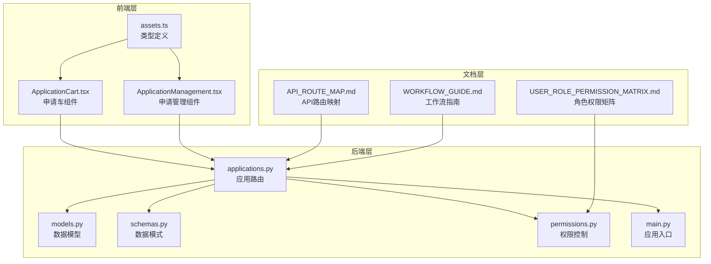
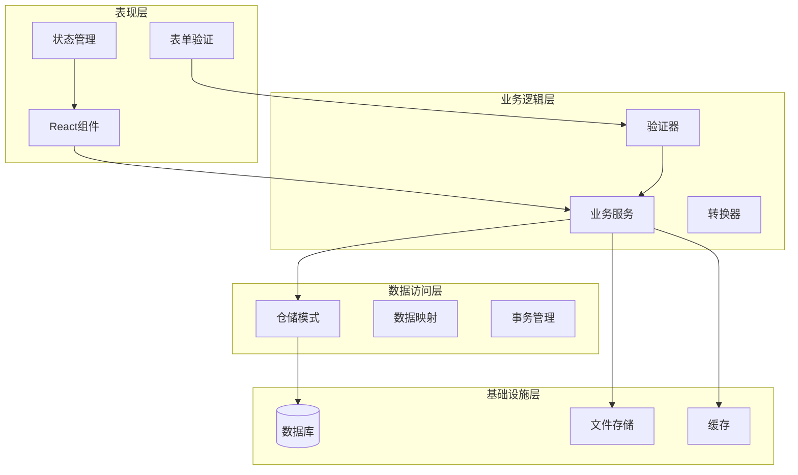
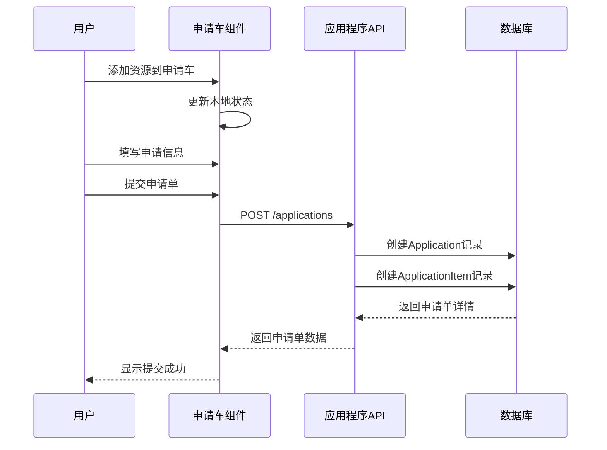
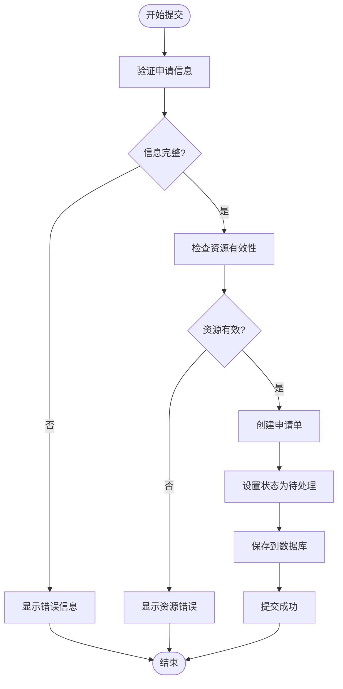
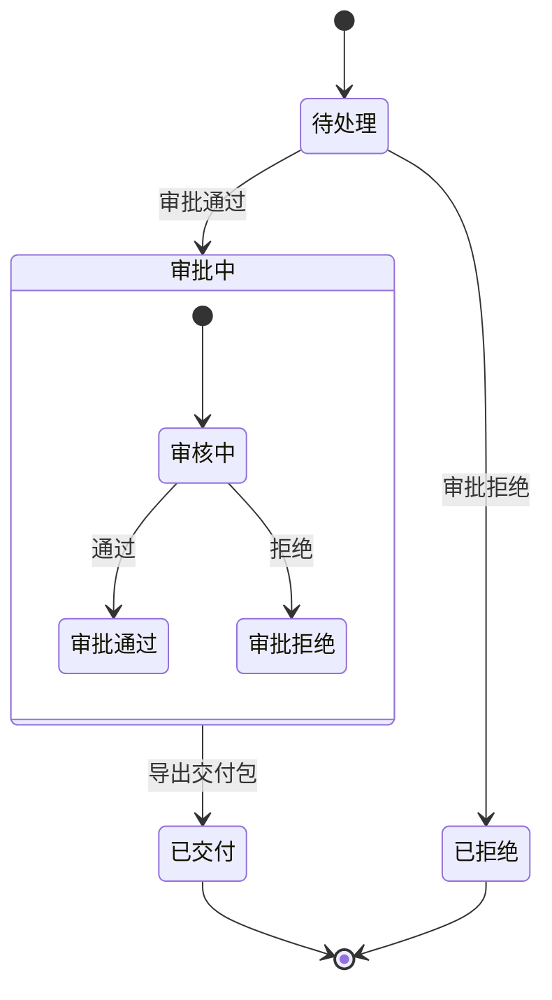
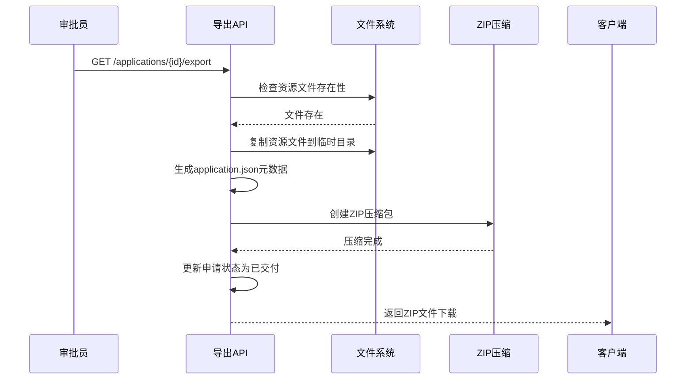
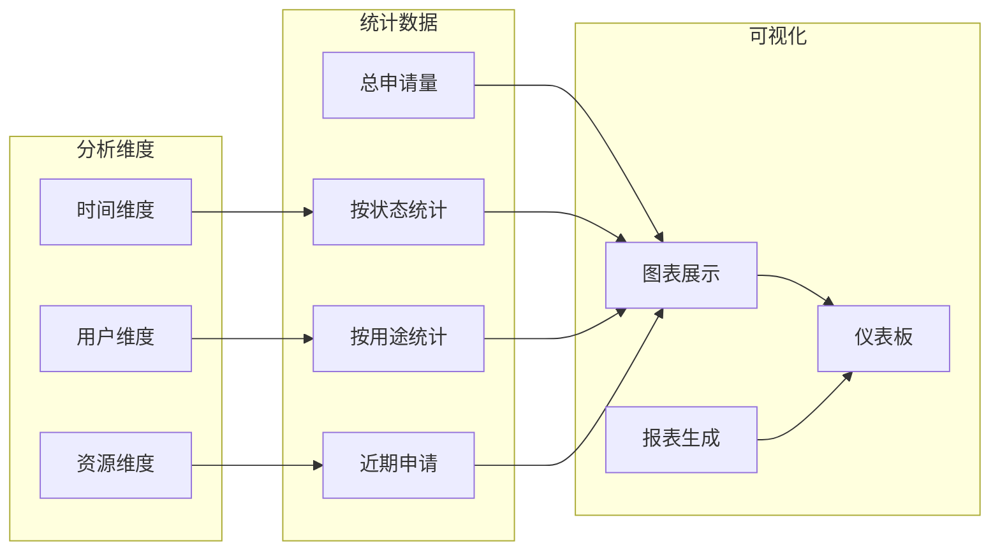
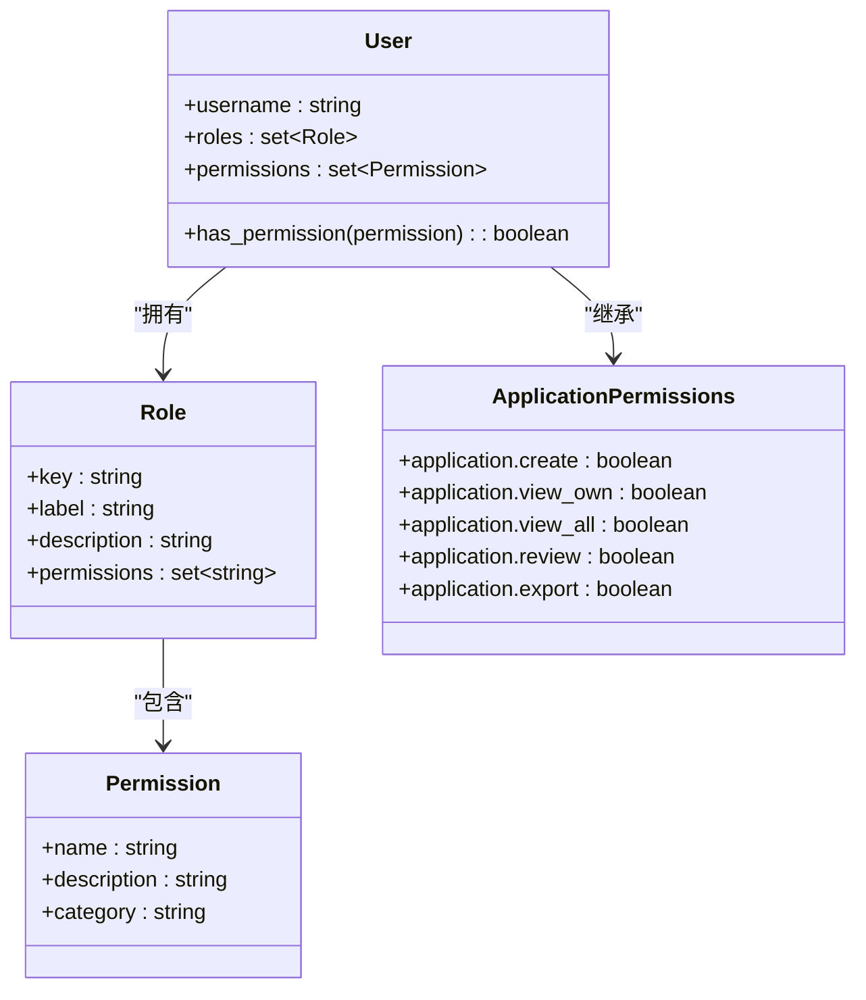
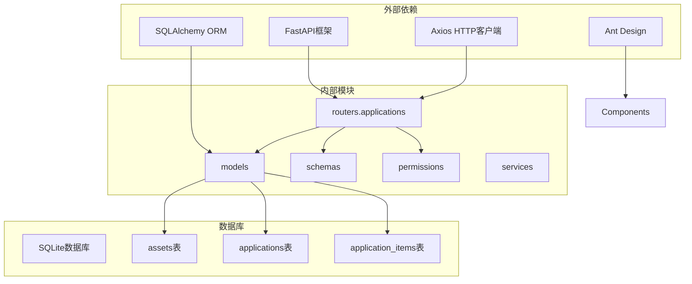

# 利用申请系统

<cite>
**本文档引用的文件**
- [applications.py](file://backend/app/routers/applications.py)
- [models.py](file://backend/app/models.py)
- [schemas.py](file://backend/app/schemas.py)
- [permissions.py](file://backend/app/permissions.py)
- [main.py](file://backend/app/main.py)
- [ApplicationCart.tsx](file://frontend/src/components/ApplicationCart.tsx)
- [ApplicationManagement.tsx](file://frontend/src/components/ApplicationManagement.tsx)
- [assets.ts](file://frontend/src/types/assets.ts)
- [API_ROUTE_MAP.md](file://docs/02-架构设计/API_ROUTE_MAP.md)
- [USER_ROLE_PERMISSION_MATRIX.md](file://docs/03-产品与流程/USER_ROLE_PERMISSION_MATRIX.md)
- [WORKFLOW_GUIDE.md](file://docs/03-产品与流程/WORKFLOW_GUIDE.md)
</cite>

## 目录
1. [简介](#简介)
2. [项目结构](#项目结构)
3. [核心组件](#核心组件)
4. [架构概览](#架构概览)
5. [详细组件分析](#详细组件分析)
6. [依赖分析](#依赖分析)
7. [性能考虑](#性能考虑)
8. [故障排除指南](#故障排除指南)
9. [结论](#结论)
10. [附录](#附录)

## 简介

MDAMS原型项目的利用申请系统是一个完整的资源利用申请、审批和交付管理平台。该系统支持用户浏览开放资源、将资源加入申请车、统一提交申请单、多级审批流程、以及最终的交付包导出。

系统采用前后端分离架构，后端基于FastAPI构建RESTful API，前端使用React + Ant Design实现用户界面。系统实现了完整的权限控制、状态管理和数据持久化功能。

## 项目结构

利用申请系统位于MDAMS原型项目的完整架构中，主要涉及以下模块：

**图表来源**
- [applications.py:1-254](file://backend/app/routers/applications.py#L1-L254)
- [models.py:176-213](file://backend/app/models.py#L176-L213)
- [schemas.py:377-450](file://backend/app/schemas.py#L377-L450)

**章节来源**
- [main.py:1-86](file://backend/app/main.py#L1-L86)
- [API_ROUTE_MAP.md:68-78](file://docs/02-架构设计/API_ROUTE_MAP.md#L68-L78)

## 核心组件

利用申请系统包含以下核心组件：

### 数据模型层
系统基于SQLAlchemy ORM构建，包含以下关键模型：
- **Application**: 申请单实体，存储申请人信息、用途说明、状态等
- **ApplicationItem**: 申请单项实体，关联具体资源和交付要求
- **Asset**: 资源实体，存储文件元数据和访问信息

### API路由层
提供完整的RESTful API接口：
- 申请单创建、查询、详情获取
- 审批操作（通过/拒绝）
- 交付包导出功能
- 申请单列表管理

### 前端组件层
- **ApplicationCart**: 申请车组件，支持资源添加、数量管理、备注填写
- **ApplicationManagement**: 申请管理组件，支持审批、批量操作、状态跟踪

**章节来源**
- [models.py:176-213](file://backend/app/models.py#L176-L213)
- [schemas.py:377-450](file://backend/app/schemas.py#L377-L450)
- [ApplicationCart.tsx:1-131](file://frontend/src/components/ApplicationCart.tsx#L1-L131)
- [ApplicationManagement.tsx:1-293](file://frontend/src/components/ApplicationManagement.tsx#L1-L293)

## 架构概览

利用申请系统采用分层架构设计，确保职责分离和可维护性：

**图表来源**
- [applications.py:132-254](file://backend/app/routers/applications.py#L132-L254)
- [permissions.py:17-94](file://backend/app/permissions.py#L17-L94)

系统架构特点：
- **前后端分离**: 前端React应用与后端FastAPI服务完全解耦
- **权限控制**: 基于角色的权限管理系统，支持细粒度访问控制
- **状态管理**: 完整的申请状态生命周期管理
- **数据一致性**: 基于SQLAlchemy的ORM数据模型保证数据完整性

## 详细组件分析

### 申请车管理功能

申请车功能允许用户将多个资源组合到一个申请单中进行统一处理：

**图表来源**
- [ApplicationCart.tsx:55-84](file://frontend/src/components/ApplicationCart.tsx#L55-L84)
- [applications.py:132-174](file://backend/app/routers/applications.py#L132-L174)

申请车功能特性：
- **资源添加**: 支持从资源列表或详情页添加到申请车
- **数量管理**: 每个资源的申请数量自动计算
- **备注填写**: 支持为每个资源添加特定备注
- **申请清理**: 支持移除不需要的申请项

**章节来源**
- [ApplicationCart.tsx:22-131](file://frontend/src/components/ApplicationCart.tsx#L22-L131)
- [assets.ts:163-171](file://frontend/src/types/assets.ts#L163-L171)

### 申请单提交流程

申请单提交流程包含完整的数据验证和状态管理：

**图表来源**
- [applications.py:138-148](file://backend/app/routers/applications.py#L138-L148)
- [applications.py:149-174](file://backend/app/routers/applications.py#L149-L174)

提交流程的关键步骤：
1. **申请人信息验证**: 姓名、机构、联系方式必填
2. **用途说明验证**: 申请目的和使用范围必须填写
3. **资源有效性检查**: 确保所有资源ID存在且有效
4. **状态初始化**: 设置申请单初始状态为"待处理"

**章节来源**
- [applications.py:132-174](file://backend/app/routers/applications.py#L132-L174)
- [schemas.py:384-391](file://backend/app/schemas.py#L384-L391)

### 审批流程设计

审批流程支持多级审批和权限控制：

**图表来源**
- [applications.py:203-232](file://backend/app/routers/applications.py#L203-L232)
- [permissions.py:43-50](file://backend/app/permissions.py#L43-L50)

审批流程特性：
- **权限控制**: 仅具有application.review权限的用户可进行审批
- **批量操作**: 支持批量审批多个申请单
- **审批意见**: 支持填写审批备注和意见
- **状态跟踪**: 实时更新申请状态和审批时间

**章节来源**
- [ApplicationManagement.tsx:64-86](file://frontend/src/components/ApplicationManagement.tsx#L64-L86)
- [USER_ROLE_PERMISSION_MATRIX.md:68-75](file://docs/03-产品与流程/USER_ROLE_PERMISSION_MATRIX.md#L68-L75)

### 申请状态管理

系统实现了完整的申请状态生命周期管理：

| 状态 | 中文标签 | 描述 | 权限要求 |
|------|----------|------|----------|
| submitted | 待处理 | 申请已提交，等待审批 | application.view_own |
| approved | 已通过 | 审批通过，可导出交付包 | application.export |
| rejected | 已拒绝 | 审批被拒绝 | application.view_all |
| fulfilled | 已交付 | 交付包已导出 | application.view_all |

状态流转规则：
- **待处理** → **已通过** 或 **已拒绝**（审批操作）
- **已通过** → **已交付**（导出操作）
- **已拒绝** → **结束**（不可逆状态）

**章节来源**
- [applications.py:31-37](file://backend/app/routers/applications.py#L31-L37)
- [ApplicationManagement.tsx:20-25](file://frontend/src/components/ApplicationManagement.tsx#L20-L25)

### 交付包导出功能

交付包导出功能提供了完整的资源交付解决方案：

**图表来源**
- [applications.py:235-254](file://backend/app/routers/applications.py#L235-L254)
- [applications.py:70-129](file://backend/app/routers/applications.py#L70-L129)

导出功能特性：
- **文件打包**: 自动复制资源文件到交付包
- **元数据提取**: 生成application.json描述文件
- **格式标准化**: 使用标准ZIP格式组织交付内容
- **状态更新**: 自动更新申请状态为"已交付"

**章节来源**
- [applications.py:70-129](file://backend/app/routers/applications.py#L70-L129)
- [applications.py:235-254](file://backend/app/routers/applications.py#L235-L254)

### 申请统计分析功能

系统提供了基础的申请统计和分析能力：

当前实现的功能：
- **申请量统计**: 按状态分类的申请单数量统计
- **状态分布**: 各种状态的申请单占比分析
- **时间趋势**: 申请活动的时间变化趋势
- **用途分析**: 不同用途类型的申请分布

**章节来源**
- [ApplicationManagement.tsx:55-62](file://frontend/src/components/ApplicationManagement.tsx#L55-L62)

### 权限配置和自定义能力

系统提供了灵活的权限配置和自定义能力：

**图表来源**
- [permissions.py:17-94](file://backend/app/permissions.py#L17-L94)
- [USER_ROLE_PERMISSION_MATRIX.md:68-75](file://docs/03-产品与流程/USER_ROLE_PERMISSION_MATRIX.md#L68-L75)

权限配置能力：
- **角色定义**: 支持自定义角色和权限组合
- **权限继承**: 子角色自动继承父角色权限
- **动态授权**: 运行时权限检查和验证
- **范围控制**: 支持集合范围和资源所有权控制

**章节来源**
- [permissions.py:102-152](file://backend/app/permissions.py#L102-L152)
- [USER_ROLE_PERMISSION_MATRIX.md:80-97](file://docs/03-产品与流程/USER_ROLE_PERMISSION_MATRIX.md#L80-L97)

## 依赖分析

利用申请系统的依赖关系清晰明确：

**图表来源**
- [main.py:75-86](file://backend/app/main.py#L75-L86)
- [models.py:6-26](file://backend/app/models.py#L6-L26)

依赖管理特点：
- **轻量级框架**: 使用FastAPI提供高性能API服务
- **ORM抽象**: SQLalchemy提供数据库抽象层
- **组件化设计**: 前端组件可独立开发和测试
- **模块化架构**: 清晰的模块边界和依赖关系

**章节来源**
- [main.py:1-86](file://backend/app/main.py#L1-L86)
- [models.py:1-307](file://backend/app/models.py#L1-L307)

## 性能考虑

利用申请系统在设计时充分考虑了性能优化：

### 数据库优化
- **索引策略**: 为常用查询字段建立适当索引
- **连接池**: 使用SQLAlchemy连接池提高数据库访问效率
- **查询优化**: 使用joinedload减少N+1查询问题

### 缓存策略
- **内存缓存**: 使用Python内置缓存机制
- **响应缓存**: 对静态数据启用HTTP缓存头
- **会话缓存**: 前端组件状态缓存

### 文件处理优化
- **异步处理**: 大文件导出使用后台任务
- **流式传输**: 支持大文件的流式下载
- **临时文件管理**: 自动清理临时文件

## 故障排除指南

### 常见问题及解决方案

**申请提交失败**
- 检查网络连接和API可达性
- 验证必填字段是否完整
- 确认资源ID是否存在

**审批权限不足**
- 确认用户角色是否包含application.review权限
- 检查用户是否登录状态正常
- 验证会话令牌是否有效

**交付包导出错误**
- 检查资源文件是否仍然存在
- 验证磁盘空间是否充足
- 确认ZIP压缩过程是否完成

**章节来源**
- [applications.py:65-67](file://backend/app/routers/applications.py#L65-L67)
- [permissions.py:214-236](file://backend/app/permissions.py#L214-L236)

## 结论

MDAMS原型项目的利用申请系统是一个功能完整、架构清晰的资源利用管理平台。系统实现了从资源浏览、申请提交、审批管理到交付导出的完整业务流程，具有以下优势：

**技术优势**
- 基于现代技术栈构建，具有良好的可维护性
- 完善的权限控制系统，支持细粒度访问控制
- 清晰的分层架构，便于扩展和修改

**业务价值**
- 简化了资源利用申请流程，提高了工作效率
- 提供了完整的审批和监管机制
- 支持批量操作和自动化处理

**扩展潜力**
- 模块化设计便于功能扩展
- 灵活的权限配置支持定制化需求
- 完善的API接口支持第三方集成

系统目前处于原型阶段，但仍具备生产环境部署的基本条件。建议在后续开发中重点关注用户体验优化、性能监控和安全加固等方面。

## 附录

### API接口说明

系统提供以下核心API接口：

| 接口 | 方法 | 描述 | 权限要求 |
|------|------|------|----------|
| /api/applications | POST | 创建新的申请单 | application.create |
| /api/applications | GET | 获取申请单列表 | application.view_all 或 application.view_own |
| /api/applications/{application_id} | GET | 获取申请单详情 | application.view_all 或 application.view_own |
| /api/applications/{application_id}/approve | POST | 审批通过申请单 | application.review |
| /api/applications/{application_id}/reject | POST | 拒绝申请单 | application.review |
| /api/applications/{application_id}/export | GET | 导出交付包 | application.export |

**章节来源**
- [API_ROUTE_MAP.md:68-78](file://docs/02-架构设计/API_ROUTE_MAP.md#L68-L78)

### 角色权限矩阵

系统支持以下关键角色：

| 角色 | 权限范围 | 主要职责 |
|------|----------|----------|
| resource_user | application.create, application.view_own | 提交资源利用申请 |
| application_reviewer | application.view_all, application.review, application.export | 审批和导出申请 |
| system_admin | 所有权限 | 系统管理和配置 |

**章节来源**
- [USER_ROLE_PERMISSION_MATRIX.md:16-28](file://docs/03-产品与流程/USER_ROLE_PERMISSION_MATRIX.md#L16-L28)