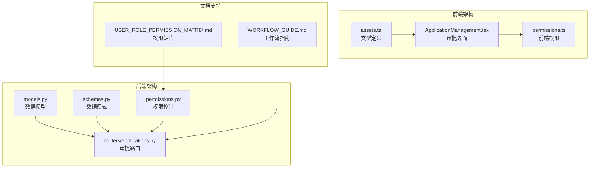
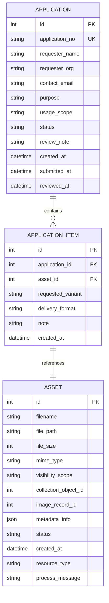
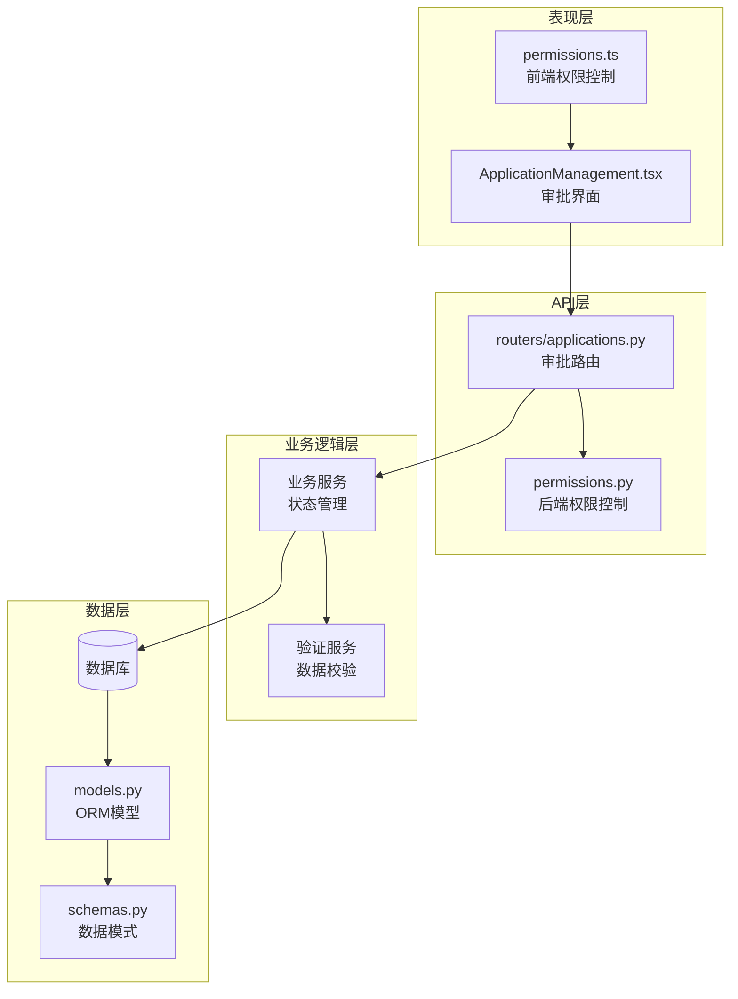
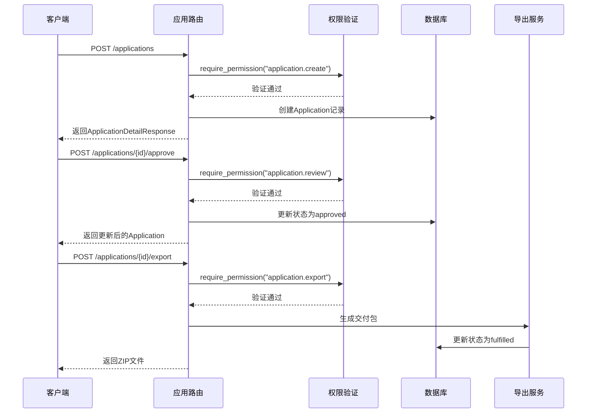
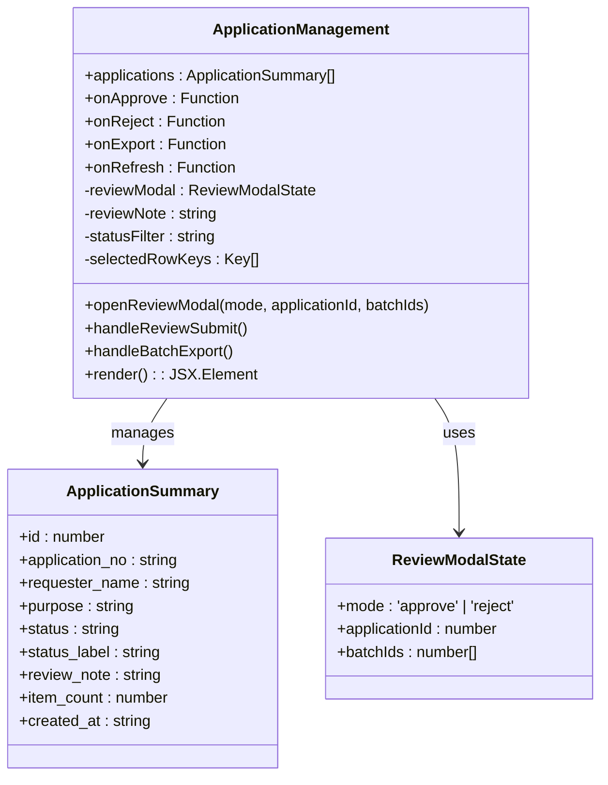
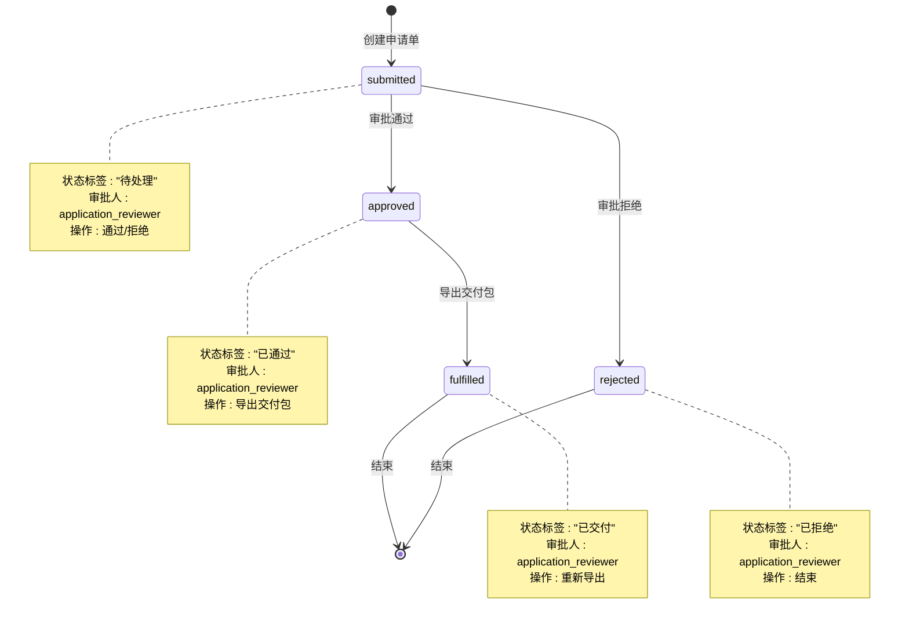
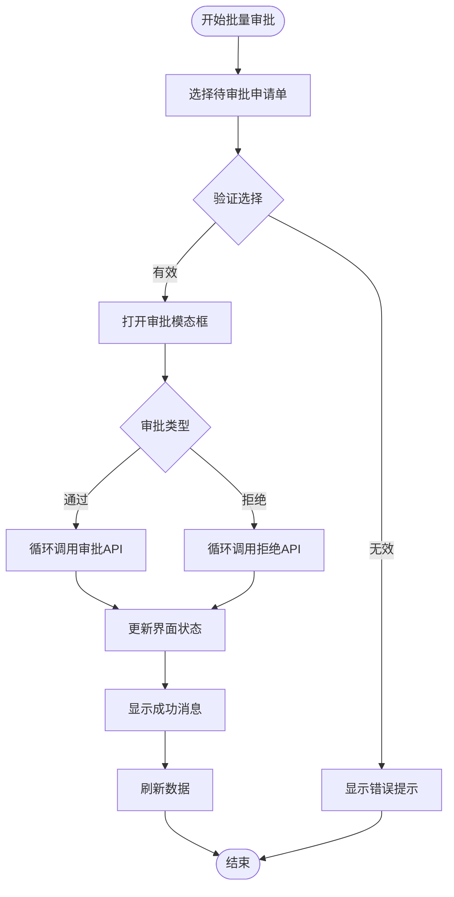
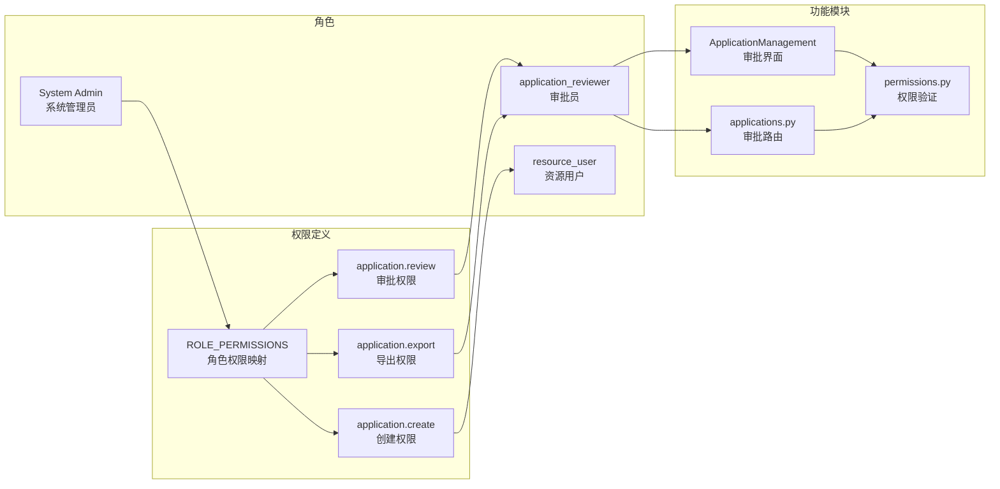
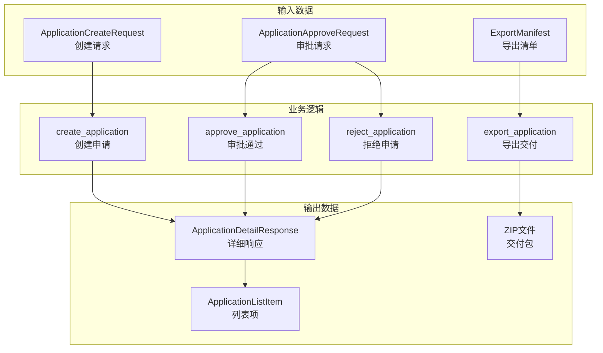

# 审批流程设计

<cite>
**本文档引用的文件**
- [applications.py](file://backend/app/routers/applications.py)
- [models.py](file://backend/app/models.py)
- [schemas.py](file://backend/app/schemas.py)
- [permissions.py](file://backend/app/permissions.py)
- [ApplicationManagement.tsx](file://frontend/src/components/ApplicationManagement.tsx)
- [permissions.ts](file://frontend/src/auth/permissions.ts)
- [assets.ts](file://frontend/src/types/assets.ts)
- [USER_ROLE_PERMISSION_MATRIX.md](file://docs/03-产品与流程/USER_ROLE_PERMISSION_MATRIX.md)
- [WORKFLOW_GUIDE.md](file://docs/03-产品与流程/WORKFLOW_GUIDE.md)
- [test_applications.py](file://backend/tests/test_applications.py)
</cite>

## 目录
1. [简介](#简介)
2. [项目结构概览](#项目结构概览)
3. [核心组件分析](#核心组件分析)
4. [架构概览](#架构概览)
5. [详细组件分析](#详细组件分析)
6. [依赖关系分析](#依赖关系分析)
7. [性能考虑](#性能考虑)
8. [故障排除指南](#故障排除指南)
9. [结论](#结论)

## 简介

MDAMS原型项目的审批流程设计是一个完整的多级审批机制，专注于二维文化资源的利用申请审批。该系统实现了从申请提交到审批通过或拒绝的完整生命周期管理，包括审批权限矩阵、审批人分配策略、审批顺序控制等核心功能。

系统采用前后端分离架构，后端基于FastAPI构建RESTful API，前端使用React+Ant Design实现用户界面。审批流程涵盖了权限控制、状态管理、批量操作、导出功能等多个方面，为博物馆和文化机构的数字资源管理提供了完整的解决方案。

## 项目结构概览

MDAMS原型项目采用模块化设计，审批流程相关的核心文件分布如下：

**图表来源**
- [models.py:176-213](file://backend/app/models.py#L176-L213)
- [applications.py:1-254](file://backend/app/routers/applications.py#L1-L254)
- [ApplicationManagement.tsx:1-293](file://frontend/src/components/ApplicationManagement.tsx#L1-L293)

**章节来源**
- [models.py:1-307](file://backend/app/models.py#L1-L307)
- [applications.py:1-254](file://backend/app/routers/applications.py#L1-L254)
- [ApplicationManagement.tsx:1-293](file://frontend/src/components/ApplicationManagement.tsx#L1-L293)

## 核心组件分析

### 数据模型设计

审批流程的核心数据模型包括Application、ApplicationItem和Asset三个实体，它们之间建立了清晰的关联关系：

**图表来源**
- [models.py:176-213](file://backend/app/models.py#L176-L213)

### 权限矩阵设计

系统实现了基于角色的权限控制（RBAC），为审批流程提供了细粒度的权限管理：

| 角色 | 权限集合 | 审批职责 |
|------|----------|----------|
| application_reviewer | application.view_all, application.review, application.export | 审批利用申请并导出交付包 |
| resource_user | application.create, application.view_own | 浏览开放资源并提交申请 |
| system_admin | 全部权限 | 系统管理与全局权限 |

**章节来源**
- [permissions.py:43-50](file://backend/app/permissions.py#L43-L50)
- [USER_ROLE_PERMISSION_MATRIX.md:25](file://docs/03-产品与流程/USER_ROLE_PERMISSION_MATRIX.md#L25-L28)

## 架构概览

审批流程采用分层架构设计，确保了系统的可维护性和扩展性：

**图表来源**
- [applications.py:132-254](file://backend/app/routers/applications.py#L132-L254)
- [permissions.py:214-237](file://backend/app/permissions.py#L214-L237)

## 详细组件分析

### 审批路由实现

审批路由提供了完整的CRUD操作和状态转换功能：

**图表来源**
- [applications.py:132-254](file://backend/app/routers/applications.py#L132-L254)

### 审批界面组件

前端审批界面提供了直观的操作体验和批量处理功能：

**图表来源**
- [ApplicationManagement.tsx:10-16](file://frontend/src/components/ApplicationManagement.tsx#L10-L16)
- [assets.ts:173-187](file://frontend/src/types/assets.ts#L173-L187)

### 状态流转机制

审批流程实现了严格的状态管理，确保每个申请单都遵循正确的处理顺序：

**图表来源**
- [applications.py:31-37](file://backend/app/routers/applications.py#L31-L37)
- [applications.py:203-232](file://backend/app/routers/applications.py#L203-L232)

### 批量审批功能

系统支持高效的批量审批操作，提高了审批效率：

**图表来源**
- [ApplicationManagement.tsx:69-86](file://frontend/src/components/ApplicationManagement.tsx#L69-L86)

**章节来源**
- [applications.py:203-232](file://backend/app/routers/applications.py#L203-L232)
- [ApplicationManagement.tsx:69-101](file://frontend/src/components/ApplicationManagement.tsx#L69-L101)

## 依赖关系分析

### 权限依赖关系

审批流程的权限控制贯穿整个系统，形成了清晰的依赖关系：

**图表来源**
- [permissions.py:17-94](file://backend/app/permissions.py#L17-L94)
- [ApplicationManagement.tsx:10-16](file://frontend/src/components/ApplicationManagement.tsx#L10-L16)

### 数据依赖关系

审批流程的数据流体现了清晰的层次结构：

**图表来源**
- [applications.py:132-254](file://backend/app/routers/applications.py#L132-L254)
- [schemas.py:384-449](file://backend/app/schemas.py#L384-L449)

**章节来源**
- [permissions.py:17-94](file://backend/app/permissions.py#L17-L94)
- [applications.py:132-254](file://backend/app/routers/applications.py#L132-L254)

## 性能考虑

### 数据库优化

审批流程在数据库层面采用了多种优化策略：

1. **索引优化**：在Application.status和Application.created_at字段上建立了索引，提高查询性能
2. **连接优化**：使用joinedload策略预加载Application.items和ApplicationItem.asset，减少N+1查询问题
3. **批量操作**：支持批量审批和批量导出，减少数据库往返次数

### 缓存策略

系统在适当的地方实现了缓存机制：

1. **权限缓存**：用户权限信息在会话期间缓存，避免重复计算
2. **静态资源缓存**：导出的交付包文件采用适当的缓存策略
3. **前端状态缓存**：审批界面的状态在内存中缓存，提升用户体验

### 异步处理

对于耗时操作，系统采用了异步处理机制：

1. **文件导出**：使用BackgroundTasks异步生成交付包，避免阻塞主线程
2. **批量操作**：批量审批和批量导出采用异步处理，提高系统吞吐量

## 故障排除指南

### 常见问题及解决方案

#### 权限相关问题

**问题**：用户无法访问审批功能
**原因**：缺少application.review权限
**解决方案**：
1. 检查用户是否具有application_reviewer角色
2. 验证ROLE_PERMISSIONS配置
3. 确认用户会话有效性

#### 数据一致性问题

**问题**：审批状态更新失败
**原因**：数据库事务冲突或并发访问
**解决方案**：
1. 实施乐观锁机制
2. 使用数据库事务确保原子性
3. 添加重试机制处理临时性错误

#### 文件导出问题

**问题**：导出交付包失败
**原因**：物理文件缺失或权限不足
**解决方案**：
1. 验证资产文件路径有效性
2. 检查文件系统权限
3. 实施文件完整性校验

**章节来源**
- [test_applications.py:86-129](file://backend/tests/test_applications.py#L86-L129)

## 结论

MDAMS原型项目的审批流程设计展现了现代Web应用的最佳实践，实现了以下关键特性：

### 设计优势

1. **清晰的权限分离**：基于角色的权限控制确保了审批流程的安全性
2. **完整的状态管理**：严格的四状态流转保证了业务逻辑的正确性
3. **高效的批量操作**：支持批量审批和批量导出，提升了工作效率
4. **良好的用户体验**：直观的界面设计和实时状态反馈
5. **可扩展的架构**：模块化设计便于功能扩展和维护

### 技术亮点

1. **前后端分离**：采用现代化的技术栈，提高了开发效率
2. **类型安全**：使用Pydantic和TypeScript确保数据完整性
3. **测试驱动**：完善的单元测试和集成测试保障了代码质量
4. **文档完善**：详细的文档和注释便于理解和维护

### 改进建议

1. **多级审批**：可以扩展支持多级审批流程
2. **审批人分配**：实现更灵活的审批人自动分配策略
3. **审计日志**：增强审批过程的审计和追踪功能
4. **移动端支持**：优化移动端的审批体验

该审批流程设计为博物馆和文化机构的数字资源管理提供了坚实的技术基础，其模块化和可扩展的特性使其能够适应不断变化的业务需求。