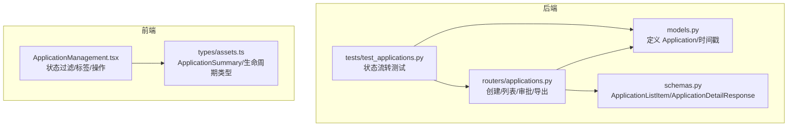
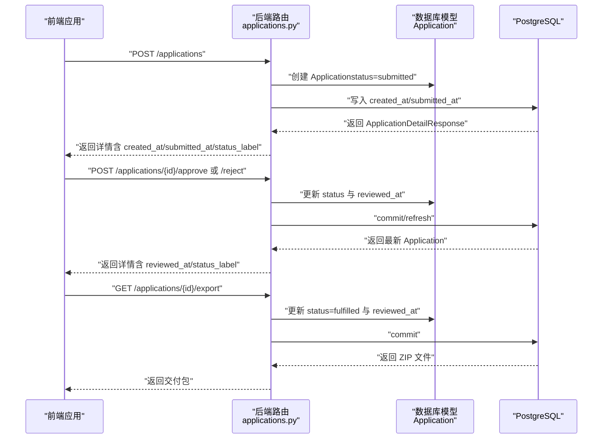
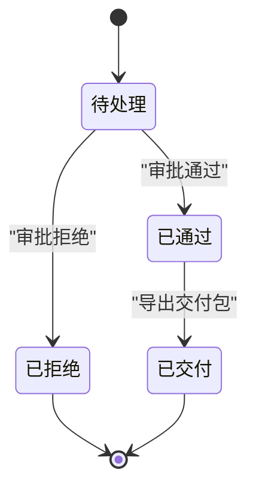
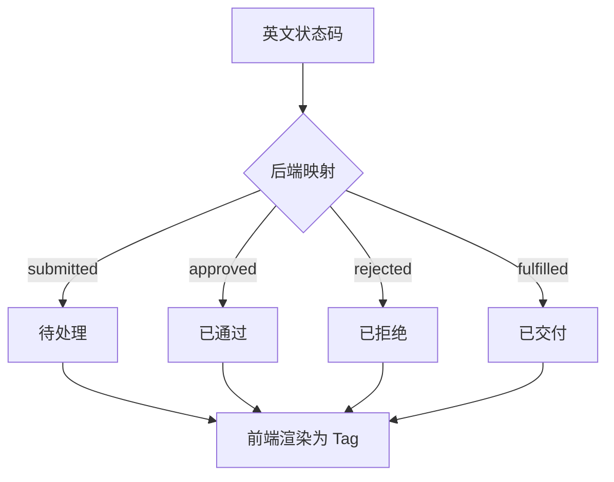
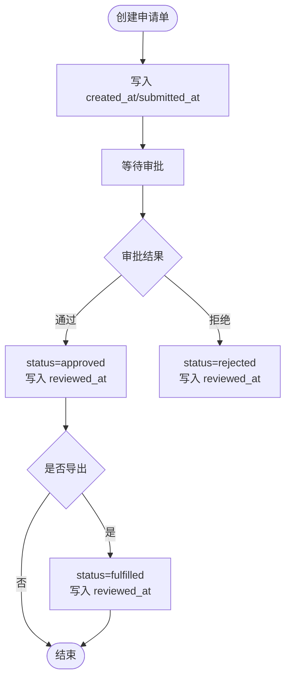
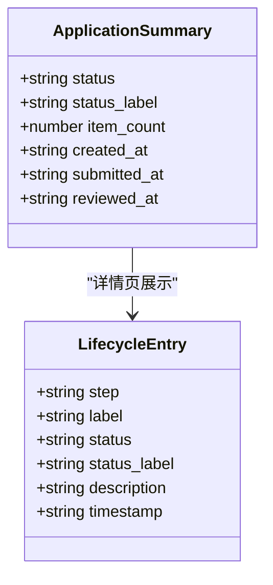
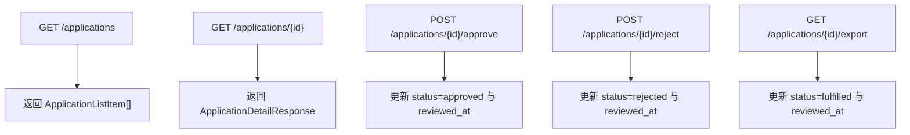
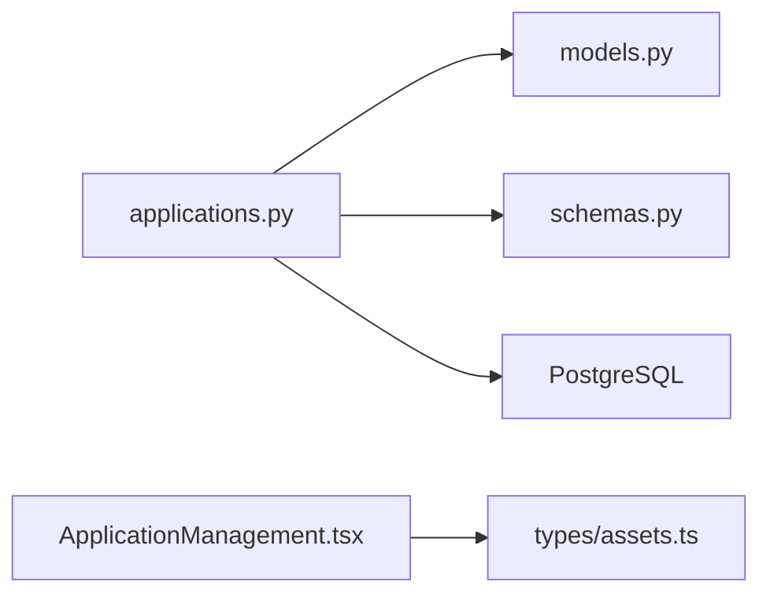

# 状态跟踪管理

<cite>
**本文引用的文件**
- [backend/app/models.py](file://backend/app/models.py)
- [backend/app/schemas.py](file://backend/app/schemas.py)
- [backend/app/routers/applications.py](file://backend/app/routers/applications.py)
- [frontend/src/components/ApplicationManagement.tsx](file://frontend/src/components/ApplicationManagement.tsx)
- [frontend/src/types/assets.ts](file://frontend/src/types/assets.ts)
- [backend/tests/test_applications.py](file://backend/tests/test_applications.py)
- [docs/02-架构设计/API_ROUTE_MAP.md](file://docs/02-架构设计/API_ROUTE_MAP.md)
</cite>

## 目录
1. [简介](#简介)
2. [项目结构](#项目结构)
3. [核心组件](#核心组件)
4. [架构总览](#架构总览)
5. [详细组件分析](#详细组件分析)
6. [依赖分析](#依赖分析)
7. [性能考虑](#性能考虑)
8. [故障排查指南](#故障排查指南)
9. [结论](#结论)
10. [附录](#附录)

## 简介
本文件面向MDAMS原型项目的状态跟踪管理功能，系统化阐述申请单（applications）的状态体系、本地化标签映射、时间戳管理、前端展示与交互、API接口、通知与推送机制现状、统计与异常处理策略。文档以“申请单”为主线，结合后端模型与路由、前端组件与类型定义，形成前后端协同的状态跟踪闭环。

## 项目结构
围绕状态跟踪的关键文件组织如下：
- 后端
  - 数据模型：定义申请单及其字段（状态、时间戳等）
  - 序列化模型：对外输出的申请单列表项与详情
  - 路由：申请单创建、列表、详情、审批、导出等接口
  - 测试：验证状态流转与时间戳更新
- 前端
  - 组件：申请单管理界面（过滤、状态标签、操作按钮）
  - 类型：申请单列表项、详情、生命周期与时间轴条目等

**图表来源**
- [backend/app/models.py:176-198](file://backend/app/models.py#L176-L198)
- [backend/app/schemas.py:418-450](file://backend/app/schemas.py#L418-L450)
- [backend/app/routers/applications.py:177-254](file://backend/app/routers/applications.py#L177-L254)
- [frontend/src/components/ApplicationManagement.tsx:10-217](file://frontend/src/components/ApplicationManagement.tsx#L10-L217)
- [frontend/src/types/assets.ts:173-187](file://frontend/src/types/assets.ts#L173-L187)

**章节来源**
- [backend/app/models.py:176-198](file://backend/app/models.py#L176-L198)
- [backend/app/schemas.py:418-450](file://backend/app/schemas.py#L418-L450)
- [backend/app/routers/applications.py:177-254](file://backend/app/routers/applications.py#L177-L254)
- [frontend/src/components/ApplicationManagement.tsx:10-217](file://frontend/src/components/ApplicationManagement.tsx#L10-L217)
- [frontend/src/types/assets.ts:173-187](file://frontend/src/types/assets.ts#L173-L187)

## 核心组件
- 申请单模型（Application）
  - 关键字段：application_no、requester_name、purpose、usage_scope、status、review_note、created_at、submitted_at、reviewed_at
  - 默认状态：创建时为“submitted”
  - 时间戳：created_at默认写入；submitted_at在创建时写入；reviewed_at在审批或导出时更新
- 申请单序列化
  - 列表项：包含status、status_label、item_count、created_at、submitted_at、reviewed_at
  - 详情：包含items明细及完整时间线
- 申请单路由
  - 创建：POST /applications
  - 列表：GET /applications
  - 详情：GET /applications/{application_id}
  - 审批：POST /applications/{application_id}/approve
  - 拒绝：POST /applications/{application_id}/reject
  - 导出：GET /applications/{application_id}/export（仅approved/fulfilled）
- 前端组件
  - 状态过滤：支持按submitted/approved/rejected/fulfilled筛选
  - 状态标签：颜色区分与本地化标签显示
  - 操作按钮：通过/拒绝、导出/重新导出
  - 列表字段：包含created_at、submitted_at、reviewed_at等

**章节来源**
- [backend/app/models.py:176-198](file://backend/app/models.py#L176-L198)
- [backend/app/schemas.py:418-450](file://backend/app/schemas.py#L418-L450)
- [backend/app/routers/applications.py:132-254](file://backend/app/routers/applications.py#L132-L254)
- [frontend/src/components/ApplicationManagement.tsx:20-217](file://frontend/src/components/ApplicationManagement.tsx#L20-L217)
- [frontend/src/types/assets.ts:173-187](file://frontend/src/types/assets.ts#L173-L187)

## 架构总览
申请单状态跟踪的端到端流程如下：

**图表来源**
- [backend/app/routers/applications.py:132-254](file://backend/app/routers/applications.py#L132-L254)
- [backend/app/models.py:176-198](file://backend/app/models.py#L176-L198)

**章节来源**
- [backend/app/routers/applications.py:132-254](file://backend/app/routers/applications.py#L132-L254)
- [backend/app/models.py:176-198](file://backend/app/models.py#L176-L198)

## 详细组件分析

### 申请单状态体系与转换条件
- 状态集合
  - submitted：待处理（创建即进入）
  - approved：已通过（审批通过）
  - rejected：已拒绝（审批拒绝）
  - fulfilled：已交付（导出后自动进入）
- 转换条件
  - submitted → approved：POST /applications/{id}/approve
  - submitted → rejected：POST /applications/{id}/reject
  - approved → fulfilled：GET /applications/{id}/export
  - rejected → fulfilled：不支持直接转换（需重新创建）

**图表来源**
- [backend/app/routers/applications.py:203-254](file://backend/app/routers/applications.py#L203-L254)

**章节来源**
- [backend/app/routers/applications.py:203-254](file://backend/app/routers/applications.py#L203-L254)

### 状态标签本地化处理
- 后端本地化映射
  - 内部函数将英文状态码映射为中文标签，用于列表项展示
- 前端状态标签
  - 使用颜色区分不同状态
  - 提供“全部/按状态”标签进行筛选

**图表来源**
- [backend/app/routers/applications.py:31-37](file://backend/app/routers/applications.py#L31-L37)
- [frontend/src/components/ApplicationManagement.tsx:20-25](file://frontend/src/components/ApplicationManagement.tsx#L20-L25)

**章节来源**
- [backend/app/routers/applications.py:31-37](file://backend/app/routers/applications.py#L31-L37)
- [frontend/src/components/ApplicationManagement.tsx:20-25](file://frontend/src/components/ApplicationManagement.tsx#L20-L25)

### 状态变更时间戳记录
- 关键时间点
  - created_at：创建时写入
  - submitted_at：创建时写入
  - reviewed_at：审批或导出时写入
- 后端写入逻辑
  - 审批：设置status与reviewed_at
  - 导出：设置status=fulfilled与reviewed_at
- 前端展示
  - 列表与详情均包含上述时间字段

**图表来源**
- [backend/app/models.py:186-190](file://backend/app/models.py#L186-L190)
- [backend/app/routers/applications.py:203-254](file://backend/app/routers/applications.py#L203-L254)

**章节来源**
- [backend/app/models.py:186-190](file://backend/app/models.py#L186-L190)
- [backend/app/routers/applications.py:203-254](file://backend/app/routers/applications.py#L203-L254)

### 前端实现（状态指示器、进度条、历史记录）
- 状态指示器
  - 颜色映射：submitted（蓝色）、approved（绿色）、rejected（红色）、fulfilled（紫色）
  - 标签渲染：列表项status_label来自后端映射
- 状态筛选
  - 支持按状态过滤，点击标签切换筛选
- 历史记录
  - 生命周期与时间轴条目类型定义，便于在详情页展示状态变迁与时间线
- 操作按钮
  - 审批：通过/拒绝
  - 导出：导出交付包或重新导出

**图表来源**
- [frontend/src/types/assets.ts:173-187](file://frontend/src/types/assets.ts#L173-L187)
- [frontend/src/types/assets.ts:210-218](file://frontend/src/types/assets.ts#L210-L218)

**章节来源**
- [frontend/src/components/ApplicationManagement.tsx:20-217](file://frontend/src/components/ApplicationManagement.tsx#L20-L217)
- [frontend/src/types/assets.ts:173-187](file://frontend/src/types/assets.ts#L173-L187)
- [frontend/src/types/assets.ts:210-218](file://frontend/src/types/assets.ts#L210-L218)

### API接口说明（按状态过滤、时间范围查询、申请人筛选）
- 路由总览
  - /applications：创建、列表、详情
  - /applications/{id}/approve：审批通过
  - /applications/{id}/reject：审批拒绝
  - /applications/{id}/export：导出交付包
- 查询与筛选
  - 列表接口返回ApplicationListItem，包含status、status_label、item_count、created_at、submitted_at、reviewed_at
  - 前端提供按状态过滤的UI控件
  - 时间范围与申请人筛选在当前实现中未暴露为后端查询参数；如需扩展，可在路由层增加查询参数并在SQL查询中拼接

**图表来源**
- [docs/02-架构设计/API_ROUTE_MAP.md:19](file://docs/02-架构设计/API_ROUTE_MAP.md#L19)
- [backend/app/routers/applications.py:177-254](file://backend/app/routers/applications.py#L177-L254)

**章节来源**
- [docs/02-架构设计/API_ROUTE_MAP.md:19](file://docs/02-架构设计/API_ROUTE_MAP.md#L19)
- [backend/app/routers/applications.py:177-254](file://backend/app/routers/applications.py#L177-L254)

### 状态变更通知机制
- 现状
  - 后端未实现邮件提醒、系统消息、状态更新推送等通知机制
  - 前端通过刷新与按钮操作驱动状态变更
- 建议
  - 在审批/导出成功后，通过后台任务触发邮件/站内信
  - 结合WebSocket或轮询实现状态变更推送

[本节为通用建议，不直接分析具体文件，故无“章节来源”]

### 状态跟踪的数据统计与趋势分析
- 当前实现
  - 前端提供按状态计数与筛选
  - 后端未提供聚合统计接口
- 建议
  - 新增统计接口：按状态分布、处理时效（submitted_at到reviewed_at）、趋势图表等
  - 可基于Application表的created_at与reviewed_at进行聚合

[本节为通用建议，不直接分析具体文件，故无“章节来源”]

### 异常处理与恢复机制
- 异常场景
  - 导出时状态非approved/fulfilled：返回错误
  - 物理文件缺失：导出过程中抛出错误
- 恢复建议
  - 对导出失败的任务进行重试与告警
  - 对状态异常的申请单提供“回退/重试”入口（需后端补充）

**章节来源**
- [backend/app/routers/applications.py:243-244](file://backend/app/routers/applications.py#L243-L244)
- [backend/app/routers/applications.py:79-80](file://backend/app/routers/applications.py#L79-L80)

## 依赖分析
- 组件耦合
  - 路由依赖模型与序列化，负责状态写入与时间戳更新
  - 前端依赖类型定义与后端接口，负责状态展示与交互
- 外部依赖
  - 数据库：PostgreSQL（通过SQLAlchemy ORM）
  - FastAPI：路由与响应模型
  - Ant Design：前端UI组件

**图表来源**
- [backend/app/routers/applications.py:14-21](file://backend/app/routers/applications.py#L14-L21)
- [backend/app/models.py:176-198](file://backend/app/models.py#L176-L198)
- [backend/app/schemas.py:418-450](file://backend/app/schemas.py#L418-L450)
- [frontend/src/components/ApplicationManagement.tsx:6](file://frontend/src/components/ApplicationManagement.tsx#L6)
- [frontend/src/types/assets.ts:173-187](file://frontend/src/types/assets.ts#L173-L187)

**章节来源**
- [backend/app/routers/applications.py:14-21](file://backend/app/routers/applications.py#L14-L21)
- [backend/app/models.py:176-198](file://backend/app/models.py#L176-L198)
- [backend/app/schemas.py:418-450](file://backend/app/schemas.py#L418-L450)
- [frontend/src/components/ApplicationManagement.tsx:6](file://frontend/src/components/ApplicationManagement.tsx#L6)
- [frontend/src/types/assets.ts:173-187](file://frontend/src/types/assets.ts#L173-L187)

## 性能考虑
- 数据库查询
  - 列表接口使用joinedload加载items，避免N+1查询
  - 排序按created_at与id降序，保证最新优先
- 导出性能
  - 导出过程在后台任务中执行，完成后清理临时目录
  - 建议对大文件导出增加分块压缩与并发控制

[本节为通用建议，不直接分析具体文件，故无“章节来源”]

## 故障排查指南
- 常见问题
  - 导出失败：检查物理文件是否存在与路径正确
  - 状态不可导出：确认申请单状态为approved或fulfilled
  - 审批后时间戳未更新：确认reviewed_at写入逻辑是否执行
- 测试验证
  - 单测覆盖创建、审批、导出全流程，可作为回归参考

**章节来源**
- [backend/tests/test_applications.py:31-128](file://backend/tests/test_applications.py#L31-L128)
- [backend/app/routers/applications.py:243-251](file://backend/app/routers/applications.py#L243-L251)

## 结论
MDAMS原型项目在申请单层面已实现清晰的状态体系与基本的前后端协同：后端负责状态与时间戳管理，前端负责状态可视化与交互。当前未内置通知与统计接口，建议后续补充通知与统计能力，以完善状态跟踪的闭环体验。

## 附录
- API路由总览（与申请单相关）
  - /applications：创建、列表、详情
  - /applications/{id}/approve：审批通过
  - /applications/{id}/reject：审批拒绝
  - /applications/{id}/export：导出交付包

**章节来源**
- [docs/02-架构设计/API_ROUTE_MAP.md:19](file://docs/02-架构设计/API_ROUTE_MAP.md#L19)