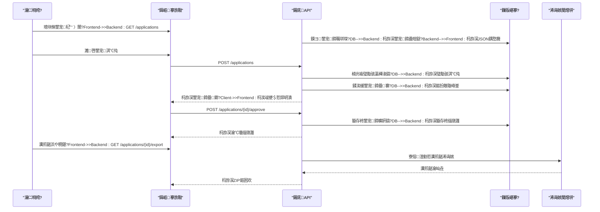
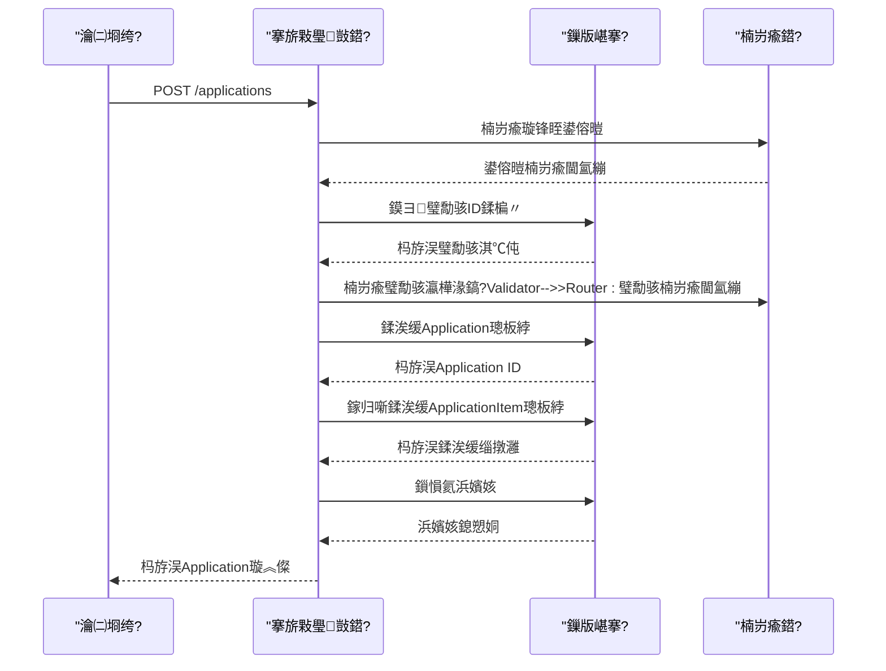
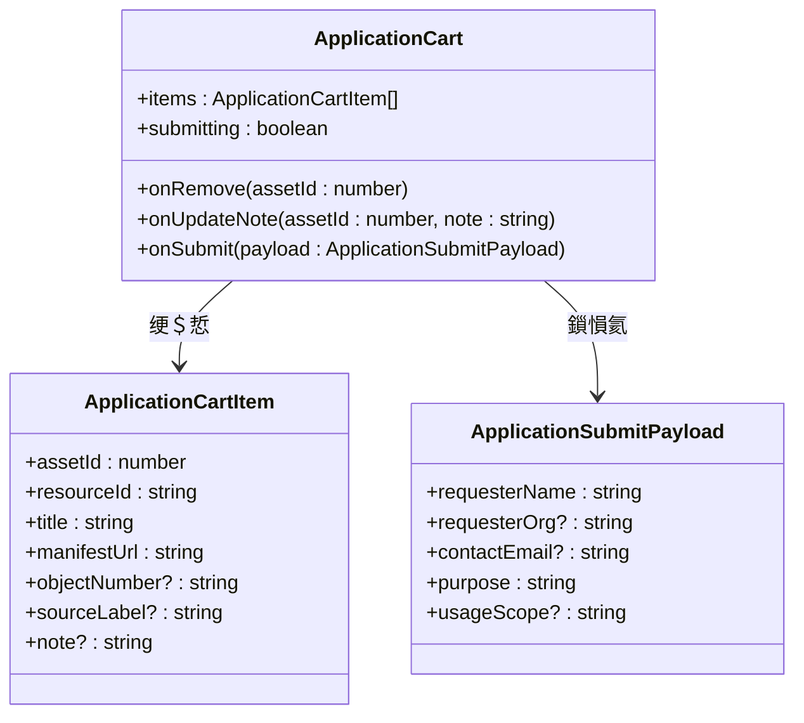
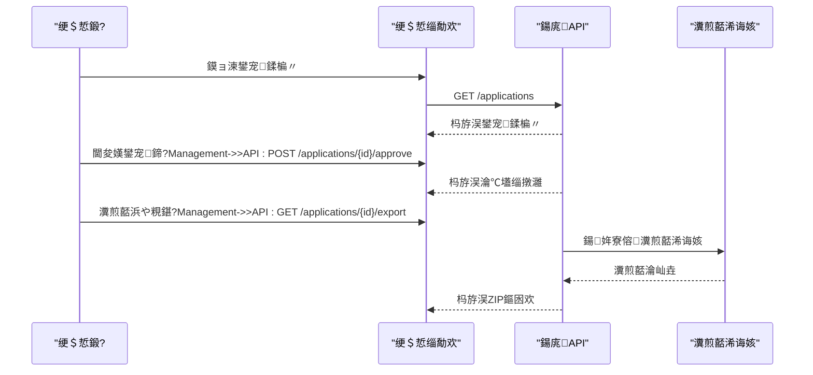

# 鐢宠鍗曟彁浜?
<cite>
**鏈枃妗ｅ紩鐢ㄧ殑鏂囦欢**
- [applications.py](file://backend/app/routers/applications.py)
- [models.py](file://backend/app/models.py)
- [schemas.py](file://backend/app/schemas.py)
- [permissions.py](file://backend/app/permissions.py)
- [ApplicationCart.tsx](file://frontend/src/components/ApplicationCart.tsx)
- [ApplicationManagement.tsx](file://frontend/src/components/ApplicationManagement.tsx)
- [assets.ts](file://frontend/src/types/assets.ts)
- [test_applications.py](file://backend/tests/test_applications.py)
- [celery_app.py](file://backend/app/celery_app.py)
- [tasks.py](file://backend/app/tasks.py)
</cite>

## 鐩綍
1. [绠€浠媇(#绠€浠?
2. [椤圭洰缁撴瀯](#椤圭洰缁撴瀯)
3. [鏍稿績缁勪欢](#鏍稿績缁勪欢)
4. [鏋舵瀯姒傝](#鏋舵瀯姒傝)
5. [璇︾粏缁勪欢鍒嗘瀽](#璇︾粏缁勪欢鍒嗘瀽)
6. [渚濊禆鍒嗘瀽](#渚濊禆鍒嗘瀽)
7. [鎬ц兘鑰冭檻](#鎬ц兘鑰冭檻)
8. [鏁呴殰鎺掗櫎鎸囧崡](#鏁呴殰鎺掗櫎鎸囧崡)
9. [缁撹](#缁撹)
10. [闄勫綍](#闄勫綍)

## 绠€浠?鏈枃浠惰缁嗕粙缁嶄簡MDAMS鍘熷瀷椤圭洰鐨勭敵璇峰崟鎻愪氦鍔熻兘銆傝鍔熻兘鍏佽鐢ㄦ埛鍒涘缓浜岀淮褰卞儚鍒╃敤鐢宠锛屽寘鎷敵璇蜂汉鍩烘湰淇℃伅濉啓銆佺粍缁囨満鏋勯€夋嫨銆佽仈绯绘柟寮忛厤缃€佺敵璇风敤閫旇鏄庛€佷娇鐢ㄨ寖鍥寸晫瀹氱瓑蹇呭～瀛楁銆傜郴缁熸敮鎸佺敵璇风墿鍝佹竻鍗曠殑鐢熸垚鍜岄獙璇佹満鍒讹紝鍖呮嫭璧勪骇ID楠岃瘉銆佺墿鍝佸瓨鍦ㄦ€ф鏌ャ€侀噸澶嶉」澶勭悊绛夈€傜敵璇峰崟鐘舵€佺鐞嗘兜鐩栦粠鑽夌鍒版彁浜ょ殑瀹屾暣鐢熷懡鍛ㄦ湡锛屽寘鎷姸鎬佽浆鎹㈣鍒欏拰鏉冮檺鎺у埗銆傜郴缁熼噰鐢ㄥ敮涓€缂栧彿鐢熸垚绠楁硶锛岀粨鍚堟椂闂存埑缂栫爜鍜岄殢鏈烘爣璇嗙缁勫悎銆傚墠绔彁渚涘畬鏁寸殑琛ㄥ崟瀹炵幇锛屽寘鎷瓧娈甸獙璇併€侀敊璇彁绀恒€佽嚜鍔ㄤ繚瀛樼瓑鍔熻兘銆傜郴缁熻繕鍖呭惈鐢宠鍗曟彁浜ゅ悗鐨勯€氱煡鏈哄埗鍜屽悗缁祦绋嬨€?
## 椤圭洰缁撴瀯
鐢宠鍗曟彁浜ゅ姛鑳芥秹鍙婂墠鍚庣鍗忓悓宸ヤ綔锛屼富瑕佸垎甯冨湪浠ヤ笅妯″潡涓細

```mermaid
graph TB
subgraph "鍚庣鏈嶅姟"
A[搴旂敤璺敱灞俔
B[鏁版嵁妯″瀷灞俔
C[鏉冮檺鎺у埗灞俔
D[搴忓垪鍖栧眰]
E[浠诲姟闃熷垪]
end
subgraph "鍓嶇鐣岄潰"
F[鐢宠杞︾粍浠禲
G[鐢宠绠＄悊缁勪欢]
H[绫诲瀷瀹氫箟]
end
subgraph "鏁版嵁搴?
I[搴旂敤琛╙
J[鐢宠鐗╁搧琛╙
K[璧勪骇琛╙
end
F --> A
G --> A
A --> B
A --> C
A --> D
A --> E
B --> I
B --> J
B --> K
```

**鍥捐〃鏉ユ簮**
- [applications.py:1-254](file://backend/app/routers/applications.py#L1-L254)
- [models.py:176-213](file://backend/app/models.py#L176-L213)
- [ApplicationCart.tsx:1-131](file://frontend/src/components/ApplicationCart.tsx#L1-L131)
- [ApplicationManagement.tsx:1-293](file://frontend/src/components/ApplicationManagement.tsx#L1-L293)

**绔犺妭鏉ユ簮**
- [applications.py:1-254](file://backend/app/routers/applications.py#L1-L254)
- [models.py:1-307](file://backend/app/models.py#L1-L307)
- [ApplicationCart.tsx:1-131](file://frontend/src/components/ApplicationCart.tsx#L1-L131)
- [ApplicationManagement.tsx:1-293](file://frontend/src/components/ApplicationManagement.tsx#L1-L293)

## 鏍稿績缁勪欢
鐢宠鍗曟彁浜ゅ姛鑳界敱澶氫釜鏍稿績缁勪欢鏋勬垚锛屾瘡涓粍浠惰礋璐ｇ壒瀹氱殑鍔熻兘棰嗗煙锛?
### 鍚庣鏍稿績缁勪欢
- **搴旂敤璺敱灞?*: 澶勭悊鐢宠鍗曠殑鍒涘缓銆佹煡璇€佸鎵瑰拰瀵煎嚭鎿嶄綔
- **鏁版嵁妯″瀷灞?*: 瀹氫箟Application銆丄pplicationItem鍜孉sset瀹炰綋鍙婂叾鍏崇郴
- **鏉冮檺鎺у埗灞?*: 瀹炴柦鍩轰簬瑙掕壊鐨勮闂帶鍒跺拰鏉冮檺楠岃瘉
- **搴忓垪鍖栧眰**: 瀹氫箟璇锋眰鍜屽搷搴旂殑鏁版嵁缁撴瀯

### 鍓嶇鏍稿績缁勪欢
- **鐢宠杞︾粍浠?*: 绠＄悊寰呮彁浜ょ殑鐢宠鐗╁搧鍜屽熀鏈俊鎭?- **鐢宠绠＄悊缁勪欢**: 鎻愪緵瀹℃壒鍜屽鍑哄姛鑳界殑绠＄悊鐣岄潰
- **绫诲瀷瀹氫箟**: 瀹氫箟鍓嶅悗绔氦浜掔殑鏁版嵁绫诲瀷

**绔犺妭鏉ユ簮**
- [applications.py:132-174](file://backend/app/routers/applications.py#L132-L174)
- [models.py:176-213](file://backend/app/models.py#L176-L213)
- [permissions.py:17-94](file://backend/app/permissions.py#L17-L94)
- [ApplicationCart.tsx:8-20](file://frontend/src/components/ApplicationCart.tsx#L8-L20)

## 鏋舵瀯姒傝
鐢宠鍗曟彁浜ゅ姛鑳介噰鐢ㄥ垎灞傛灦鏋勮璁★紝纭繚鑱岃矗鍒嗙鍜屽彲缁存姢鎬э細



**鍥捐〃鏉ユ簮**
- [applications.py:132-174](file://backend/app/routers/applications.py#L132-L174)
- [applications.py:203-253](file://backend/app/routers/applications.py#L203-L253)
- [celery_app.py:1-19](file://backend/app/celery_app.py#L1-L19)

## 璇︾粏缁勪欢鍒嗘瀽

### 搴旂敤璺敱灞傚垎鏋?搴旂敤璺敱灞傛槸鐢宠鍗曞姛鑳界殑鏍稿績鎺у埗鍣紝璐熻矗澶勭悊鎵€鏈変笌鐢宠鍗曠浉鍏崇殑HTTP璇锋眰銆?
#### 鍞竴缂栧彿鐢熸垚绠楁硶
绯荤粺閲囩敤鏃堕棿鎴?闅忔満鏍囪瘑绗︾殑缁勫悎鏂瑰紡鐢熸垚鍞竴缂栧彿锛?- 鏃堕棿鎴抽儴鍒嗭細绮剧‘鍒扮绾х殑鏃堕棿缂栫爜
- 闅忔満鏍囪瘑绗︼細6浣嶅崄鍏繘鍒堕殢鏈哄瓧绗︿覆
- 鏍煎紡瑙勮寖锛欰PP-YYYYMMDDHHMMSS-XXXXXX

```mermaid
flowchart TD
Start([寮€濮嬬敓鎴愮紪鍙穄) --> GetTime["鑾峰彇UTC鏃堕棿鎴?br/>鏍煎紡: YYYYMMDDHHMMSS"]
GetTime --> GenRandom["鐢熸垚6浣嶉殢鏈哄崄鍏繘鍒跺瓧绗︿覆"]
GenRandom --> Combine["缁勫悎鏍煎紡: APP-{timestamp}-{random}"]
Combine --> Validate["楠岃瘉缂栧彿鍞竴鎬?]
Validate --> Unique{"缂栧彿鍞竴?"}
Unique --> |鏄瘄 Return["杩斿洖鍞竴缂栧彿"]
Unique --> |鍚 Retry["閲嶆柊鐢熸垚闅忔満閮ㄥ垎"]
Retry --> GenRandom
```

**鍥捐〃鏉ユ簮**
- [applications.py:26-28](file://backend/app/routers/applications.py#L26-L28)

#### 鐢宠鍗曞垱寤烘祦绋?鐢宠鍗曞垱寤鸿繃绋嬪寘鍚弗鏍肩殑楠岃瘉鍜屽鐞嗘楠わ細



**鍥捐〃鏉ユ簮**
- [applications.py:132-174](file://backend/app/routers/applications.py#L132-L174)

#### 鐘舵€佺鐞嗘満鍒?鐢宠鍗曠姸鎬侀伒寰弗鏍肩殑鐢熷懡鍛ㄦ湡绠＄悊锛?
```mermaid
stateDiagram-v2
[*] --> 鑽夌
鑽夌 --> 寰呭鐞?: 鎻愪氦鐢宠
寰呭鐞?--> 宸查€氳繃 : 瀹℃壒閫氳繃
寰呭鐞?--> 宸叉嫆缁?: 瀹℃壒鎷掔粷
宸查€氳繃 --> 宸蹭氦浠?: 瀵煎嚭浜や粯鍖?宸蹭氦浠?--> [*]
note right of 鑽夌 : 浠呴檺鐢宠浜哄彲瑙?note right of 寰呭鐞?: 鍏ㄩ儴鐢ㄦ埛鍙
note right of 宸查€氳繃 : 鍙繘琛屽鍑?note right of 宸蹭氦浠?: 瀵煎嚭瀹屾垚
```

**鍥捐〃鏉ユ簮**
- [applications.py:31-37](file://backend/app/routers/applications.py#L31-L37)
- [applications.py:203-253](file://backend/app/routers/applications.py#L203-L253)

**绔犺妭鏉ユ簮**
- [applications.py:26-28](file://backend/app/routers/applications.py#L26-L28)
- [applications.py:132-174](file://backend/app/routers/applications.py#L132-L174)
- [applications.py:203-253](file://backend/app/routers/applications.py#L203-L253)

### 鏁版嵁妯″瀷鍒嗘瀽
鐢宠鍗曞姛鑳芥秹鍙婁笁涓牳蹇冩暟鎹ā鍨嬶紝瀹冧滑涔嬮棿寤虹珛浜嗘竻鏅扮殑鍏崇郴锛?
```mermaid
erDiagram
APPLICATION {
int id PK
string application_no UK
string requester_name
string requester_org
string contact_email
string purpose
string usage_scope
string status
string review_note
datetime created_at
datetime submitted_at
datetime reviewed_at
}
APPLICATION_ITEM {
int id PK
int application_id FK
int asset_id FK
string requested_variant
string delivery_format
string note
datetime created_at
}
ASSET {
int id PK
string filename
string file_path
int file_size
string mime_type
string visibility_scope
int collection_object_id
int image_record_id FK
json metadata_info
string status
datetime created_at
string resource_type
string process_message
}
APPLICATION ||--o{ APPLICATION_ITEM : 鍖呭惈
ASSET ||--o{ APPLICATION_ITEM : 琚敵璇?```

**鍥捐〃鏉ユ簮**
- [models.py:176-213](file://backend/app/models.py#L176-L213)

#### 瀛楁绾︽潫鍜岄獙璇佽鍒?- **鐢宠浜轰俊鎭?*: 濮撳悕涓哄繀濉瓧娈碉紝缁勭粐鏈烘瀯鍜岃仈绯绘柟寮忎负鍙€?- **鐢宠鐢ㄩ€?*: 蹇呴』鎻愪緵鏄庣‘鐨勪娇鐢ㄧ洰鐨勬弿杩?- **浣跨敤鑼冨洿**: 鏀寔鍐呴儴鐮旂┒銆佸澶栧嚭鐗堛€佸睍瑙堝睍绀虹瓑閫夐」
- **璧勪骇楠岃瘉**: 纭繚鐢宠鐨勮祫浜D鍦ㄦ暟鎹簱涓瓨鍦ㄤ笖鐘舵€佹甯?
**绔犺妭鏉ユ簮**
- [models.py:176-213](file://backend/app/models.py#L176-L213)
- [schemas.py:384-391](file://backend/app/schemas.py#L384-L391)

### 鏉冮檺鎺у埗鍒嗘瀽
绯荤粺閲囩敤鍩轰簬瑙掕壊鐨勬潈闄愭帶鍒舵ā鍨嬶紝纭繚鐢宠鍗曞姛鑳界殑瀹夊叏鎬э細

#### 瑙掕壊鏉冮檺鐭╅樀
```mermaid
graph LR
subgraph "鐢宠鐩稿叧瑙掕壊"
A[璧勬簮鐢ㄦ埛] --> B[application.create]
A --> C[application.view_own]
D[鐢宠瀹℃壒鍛榏 --> E[application.view_all]
D --> F[application.review]
D --> G[application.export]
H[绯荤粺绠＄悊鍛榏 --> I[system.manage]
H --> E
H --> F
H --> G
end
```

**鍥捐〃鏉ユ簮**
- [permissions.py:17-94](file://backend/app/permissions.py#L17-L94)

#### 鏉冮檺楠岃瘉娴佺▼
```mermaid
flowchart TD
Request[鏀跺埌璇锋眰] --> ParseAuth[瑙ｆ瀽璁よ瘉淇℃伅]
ParseAuth --> CheckPerm[妫€鏌ユ墍闇€鏉冮檺]
CheckPerm --> HasPerm{鏄惁鍏峰鏉冮檺?}
HasPerm --> |鏄瘄 ProcessReq[澶勭悊涓氬姟閫昏緫]
HasPerm --> |鍚 DenyAccess[鎷掔粷璁块棶]
ProcessReq --> ReturnResp[杩斿洖鍝嶅簲]
DenyAccess --> ReturnResp
```

**鍥捐〃鏉ユ簮**
- [permissions.py:214-236](file://backend/app/permissions.py#L214-L236)

**绔犺妭鏉ユ簮**
- [permissions.py:17-94](file://backend/app/permissions.py#L17-L94)
- [permissions.py:214-236](file://backend/app/permissions.py#L214-L236)

### 鍓嶇缁勪欢鍒嗘瀽

#### 鐢宠杞︾粍浠跺疄鐜?鐢宠杞︾粍浠舵彁渚涘畬鏁寸殑鐢宠鍗曞垱寤虹晫闈細



**鍥捐〃鏉ユ簮**
- [ApplicationCart.tsx:8-20](file://frontend/src/components/ApplicationCart.tsx#L8-L20)
- [assets.ts:163-171](file://frontend/src/types/assets.ts#L163-L171)

#### 琛ㄥ崟楠岃瘉鏈哄埗
鍓嶇琛ㄥ崟閲囩敤澶氬眰娆￠獙璇佺瓥鐣ワ細

```mermaid
flowchart TD
FormInit[琛ㄥ崟鍒濆鍖朷 --> FieldValidation[瀛楁绾ч獙璇乚
FieldValidation --> RequiredCheck{蹇呭～瀛楁妫€鏌
RequiredCheck --> |閫氳繃| FormatCheck[鏍煎紡楠岃瘉]
RequiredCheck --> |澶辫触| ShowError[鏄剧ず閿欒淇℃伅]
FormatCheck --> SubmitCheck[鎻愪氦鍓嶆渶缁堟鏌
SubmitCheck --> Valid{楠岃瘉閫氳繃?}
Valid --> |鏄瘄 SendRequest[鍙戦€佽姹俔
Valid --> |鍚 ShowError
ShowError --> WaitFix[绛夊緟鐢ㄦ埛淇]
WaitFix --> FieldValidation
SendRequest --> Loading[鏄剧ず鍔犺浇鐘舵€乚
Loading --> Response[鎺ユ敹鍝嶅簲]
```

**鍥捐〃鏉ユ簮**
- [ApplicationCart.tsx:66-84](file://frontend/src/components/ApplicationCart.tsx#L66-L84)

#### 鐢宠绠＄悊缁勪欢鍔熻兘
鐢宠绠＄悊缁勪欢鎻愪緵瀹℃壒鍜屽鍑哄姛鑳斤細



**鍥捐〃鏉ユ簮**
- [ApplicationManagement.tsx:103-175](file://frontend/src/components/ApplicationManagement.tsx#L103-L175)

**绔犺妭鏉ユ簮**
- [ApplicationCart.tsx:1-131](file://frontend/src/components/ApplicationCart.tsx#L1-131)
- [ApplicationManagement.tsx:1-293](file://frontend/src/components/ApplicationManagement.tsx#L1-293)
- [assets.ts:163-187](file://frontend/src/types/assets.ts#L163-L187)

### API璁捐瑙勮寖

#### 鐢宠鍗曞垱寤篈PI
| 灞炴€?| 绫诲瀷 | 蹇呭～ | 鎻忚堪 |
|------|------|------|------|
| requester_name | string | 鏄?| 鐢宠浜哄鍚?|
| requester_org | string | 鍚?| 鎵€灞炴満鏋?|
| contact_email | string | 鍚?| 鑱旂郴閭 |
| purpose | string | 鏄?| 鐢宠鐢ㄩ€?|
| usage_scope | string | 鍚?| 浣跨敤鑼冨洿 |
| items | ApplicationCreateItemRequest[] | 鏄?| 鐢宠鐗╁搧鍒楄〃 |

#### 鐢宠鐗╁搧璇锋眰浣?| 灞炴€?| 绫诲瀷 | 榛樿鍊?| 鎻忚堪 |
|------|------|--------|------|
| asset_id | number | - | 璧勪骇ID |
| requested_variant | string | "current" | 璇锋眰鐨勬枃浠跺彉浣?|
| delivery_format | string | "image" | 浜や粯鏍煎紡 |
| note | string | - | 鐢宠澶囨敞 |

#### 鍝嶅簲鏁版嵁缁撴瀯
```json
{
  "id": 1,
  "application_no": "APP-20260111123456-ABCDEF",
  "requester_name": "寮犱笁",
  "requester_org": "鏁呭鍗氱墿闄?,
  "contact_email": "zhangsan@example.com",
  "purpose": "瀛︽湳鐮旂┒",
  "usage_scope": "鍐呴儴鐮旂┒",
  "status": "submitted",
  "review_note": null,
  "created_at": "2026-01-11T12:34:56Z",
  "submitted_at": "2026-01-11T12:34:56Z",
  "reviewed_at": null,
  "items": [
    {
      "id": 1,
      "asset_id": 1001,
      "requested_variant": "current",
      "delivery_format": "image",
      "note": "楂樻竻鍥惧儚",
      "created_at": "2026-01-11T12:34:56Z",
      "asset": {
        "id": 1001,
        "filename": "image_001.jpg",
        "resource_type": "image_2d_cultural_object",
        "status": "ready"
      }
    }
  ]
}
```

**绔犺妭鏉ユ簮**
- [schemas.py:377-448](file://backend/app/schemas.py#L377-L448)

## 渚濊禆鍒嗘瀽

### 鍚庣渚濊禆鍏崇郴
```mermaid
graph TD
subgraph "搴旂敤灞?
A[applications.py]
B[models.py]
C[schemas.py]
D[permissions.py]
end
subgraph "鍩虹璁炬柦"
E[SQLAlchemy ORM]
F[FastAPI]
G[Celery]
H[Redis]
end
A --> B
A --> C
A --> D
A --> E
A --> F
A --> G
G --> H
B --> E
C --> F
```

**鍥捐〃鏉ユ簮**
- [applications.py:1-23](file://backend/app/routers/applications.py#L1-L23)
- [celery_app.py:1-19](file://backend/app/celery_app.py#L1-L19)

### 鍓嶇渚濊禆鍏崇郴
```mermaid
graph TD
subgraph "缁勪欢灞?
A[ApplicationCart.tsx]
B[ApplicationManagement.tsx]
end
subgraph "绫诲瀷瀹氫箟"
C[assets.ts]
end
subgraph "UI搴?
D[Ant Design]
E[React]
end
A --> C
B --> C
A --> D
B --> D
A --> E
B --> E
```

**鍥捐〃鏉ユ簮**
- [ApplicationCart.tsx:1-6](file://frontend/src/components/ApplicationCart.tsx#L1-L6)
- [ApplicationManagement.tsx:1-6](file://frontend/src/components/ApplicationManagement.tsx#L1-L6)

**绔犺妭鏉ユ簮**
- [applications.py:1-23](file://backend/app/routers/applications.py#L1-L23)
- [celery_app.py:1-19](file://backend/app/celery_app.py#L1-L19)
- [ApplicationCart.tsx:1-6](file://frontend/src/components/ApplicationCart.tsx#L1-L6)

## 鎬ц兘鑰冭檻
鐢宠鍗曟彁浜ゅ姛鑳藉湪璁捐鏃跺厖鍒嗚€冭檻浜嗘€ц兘浼樺寲锛?
### 鏁版嵁搴撲紭鍖?- **鎵归噺鎿嶄綔**: 鐢宠鍗曞垱寤洪噰鐢ㄦ壒閲忔彃鍏ュ噺灏戞暟鎹簱寰€杩?- **杩炴帴姹?*: 浣跨敤SQLAlchemy杩炴帴姹犳彁楂樺苟鍙戞€ц兘
- **绱㈠紩浼樺寲**: 鍏抽敭瀛楁寤虹珛閫傚綋绱㈠紩鎻愬崌鏌ヨ鏁堢巼

### 缂撳瓨绛栫暐
- **浠诲姟闃熷垪**: 瀵煎嚭绛夎€楁椂鎿嶄綔閫氳繃Celery寮傛澶勭悊
- **鏂囦欢缂撳瓨**: 鐢熸垚鐨勪氦浠樺寘涓存椂瀛樺偍鍦ㄥ唴瀛樹腑閬垮厤纾佺洏IO

### 鍓嶇鎬ц兘
- **铏氭嫙婊氬姩**: 澶у垪琛ㄩ噰鐢ㄨ櫄鎷熸粴鍔ㄦ彁鍗囨覆鏌撴€ц兘
- **鎳掑姞杞?*: 缁勪欢鎸夐渶鍔犺浇鍑忓皯鍒濆鍖呭ぇ灏?- **鐘舵€佺紦瀛?*: 琛ㄥ崟鐘舵€佹湰鍦扮紦瀛樻彁鍗囩敤鎴蜂綋楠?
## 鏁呴殰鎺掗櫎鎸囧崡

### 甯歌闂鍙婅В鍐虫柟妗?
#### 鐢宠鍗曞垱寤哄け璐?**闂鐥囩姸**: 鎻愪氦鐢宠鏃惰繑鍥?00閿欒
**鍙兘鍘熷洜**:
- 璧勪骇ID涓嶅瓨鍦ㄦ垨鐘舵€佸紓甯?- 蹇呭～瀛楁缂哄け
- 璧勪骇鏁伴噺瓒呰繃闄愬埗

**瑙ｅ喅姝ラ**:
1. 妫€鏌ヨ祫浜D鐨勬湁鏁堟€?2. 楠岃瘉蹇呭～瀛楁瀹屾暣鎬?3. 纭璧勪骇鐘舵€佷负"ready"

#### 鏉冮檺涓嶈冻閿欒
**闂鐥囩姸**: 杩斿洖403 Forbidden
**鍙兘鍘熷洜**:
- 鐢ㄦ埛鏈櫥褰曟垨浼氳瘽杩囨湡
- 瑙掕壊鏉冮檺涓嶈冻
- 璁块棶鑼冨洿瓒呭嚭鏉冮檺

**瑙ｅ喅姝ラ**:
1. 閲嶆柊鐧诲綍绯荤粺
2. 妫€鏌ョ敤鎴疯鑹查厤缃?3. 鑱旂郴绯荤粺绠＄悊鍛?
#### 瀵煎嚭鍔熻兘寮傚父
**闂鐥囩姸**: 瀵煎嚭浜や粯鍖呭け璐?**鍙兘鍘熷洜**:
- 璧勪骇鏂囦欢璺緞涓嶅瓨鍦?- 鏂囦欢鏉冮檺闂
- 纾佺洏绌洪棿涓嶈冻

**瑙ｅ喅姝ラ**:
1. 妫€鏌ヨ祫浜ф枃浠惰矾寰?2. 楠岃瘉鏂囦欢鏉冮檺璁剧疆
3. 娓呯悊纾佺洏绌洪棿

**绔犺妭鏉ユ簮**
- [applications.py:138-147](file://backend/app/routers/applications.py#L138-L147)
- [applications.py:243-244](file://backend/app/routers/applications.py#L243-L244)

## 缁撹
MDAMS鍘熷瀷椤圭洰鐨勭敵璇峰崟鎻愪氦鍔熻兘瀹炵幇浜嗗畬鏁寸殑鐢宠绠＄悊鐢熷懡鍛ㄦ湡锛屽寘鎷敵璇峰垱寤恒€佸鎵瑰鐞嗐€佺姸鎬佽窡韪拰浜や粯瀵煎嚭銆傜郴缁熼噰鐢ㄥ垎灞傛灦鏋勮璁★紝纭繚浜嗚壇濂界殑鍙淮鎶ゆ€у拰鎵╁睍鎬с€傚墠鍚庣鍗忓悓宸ヤ綔鎻愪緵浜嗗畬鏁寸殑鐢ㄦ埛浣撻獙锛屽寘鎷疄鏃堕獙璇併€佺姸鎬佸弽棣堝拰寮傛澶勭悊銆傛潈闄愭帶鍒剁郴缁熶繚闅滀簡鏁版嵁瀹夊叏锛岃€屼换鍔￠槦鍒楁満鍒跺垯鎻愬崌浜嗙郴缁熺殑鏁翠綋鎬ц兘銆傝鍔熻兘涓哄悗缁殑涓氬姟鎵╁睍濂犲畾浜嗗潥瀹炵殑鎶€鏈熀纭€銆?
## 闄勫綍

### 娴嬭瘯鐢ㄤ緥鍙傝€?绯荤粺鍖呭惈瀹屾暣鐨勫崟鍏冩祴璇曪紝瑕嗙洊涓昏鍔熻兘鍦烘櫙锛?
```python
# 娴嬭瘯鐢宠鍗曞垱寤?def test_create_and_list_applications(db_session):
    # 鍒涘缓娴嬭瘯璧勪骇
    asset = _create_asset(db_session, "apply-1.png")

    # 鍒涘缓鐢宠鍗?    created = applications_router.create_application(
        ApplicationCreateRequest(
            requester_name="Jing Sun",
            requester_org="Palace Museum",
            contact_email="bigheadhenry@gmail.com",
            purpose="鍑虹増閰嶅浘",
            usage_scope="鍐呴儴鐮旂┒",
            items=[ApplicationCreateItemRequest(asset_id=asset.id)]
        ),
        db=db_session,
    )

    # 楠岃瘉鍒涘缓缁撴灉
    assert created.application_no.startswith("APP-")
    assert created.status == "submitted"
    assert len(created.items) == 1
```

**绔犺妭鏉ユ簮**
- [test_applications.py:31-73](file://backend/tests/test_applications.py#L31-L73)
