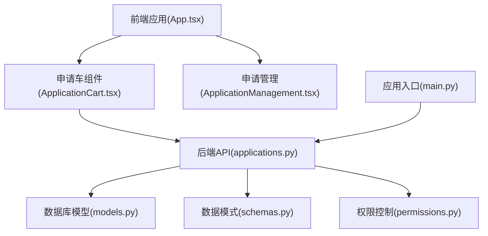
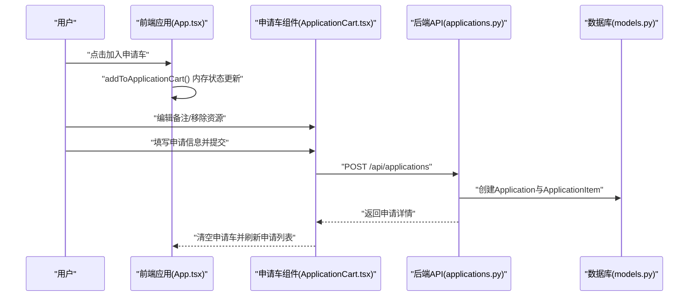
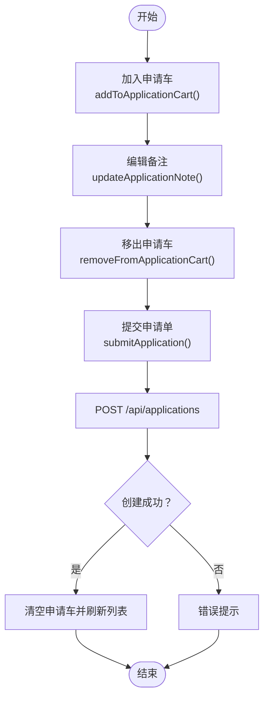
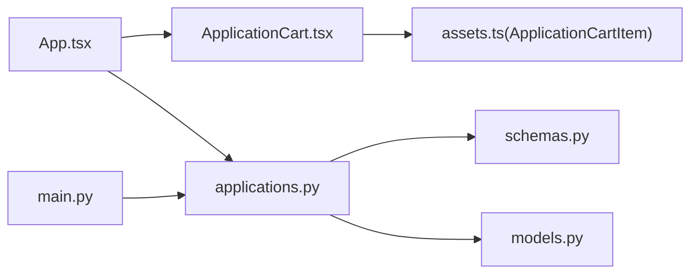

# 申请车管理

<cite>
**本文档引用的文件**
- [App.tsx](file://frontend/src/App.tsx)
- [ApplicationCart.tsx](file://frontend/src/components/ApplicationCart.tsx)
- [ApplicationManagement.tsx](file://frontend/src/components/ApplicationManagement.tsx)
- [assets.ts](file://frontend/src/types/assets.ts)
- [applications.py](file://backend/app/routers/applications.py)
- [schemas.py](file://backend/app/schemas.py)
- [models.py](file://backend/app/models.py)
- [permissions.py](file://backend/app/permissions.py)
- [main.py](file://backend/app/main.py)
- [test_applications.py](file://backend/tests/test_applications.py)
</cite>

## 目录
1. [简介](#简介)
2. [项目结构](#项目结构)
3. [核心组件](#核心组件)
4. [架构总览](#架构总览)
5. [详细组件分析](#详细组件分析)
6. [依赖分析](#依赖分析)
7. [性能考虑](#性能考虑)
8. [故障排查指南](#故障排查指南)
9. [结论](#结论)
10. [附录](#附录)

## 简介
本章节概述申请车管理功能的目标与范围：围绕“二维影像利用申请”场景，提供从资源加入申请车、统一编辑备注、到提交申请单并进入审批与交付导出的完整闭环。申请车本身作为“草稿区”，不直接参与审批与导出；审批与导出由“申请管理”模块负责。

## 项目结构
申请车功能涉及前后端协作：
- 前端：应用状态管理、申请车UI组件、表单校验与提交
- 后端：申请单创建、列表查询、审批、导出交付包
- 类型与模型：前端类型定义、后端Pydantic模型与数据库ORM模型
- 权限：基于角色的权限矩阵与依赖注入校验

图表来源
- [App.tsx:276-345](file://frontend/src/App.tsx#L276-L345)
- [ApplicationCart.tsx:1-130](file://frontend/src/components/ApplicationCart.tsx#L1-L130)
- [ApplicationManagement.tsx:1-293](file://frontend/src/components/ApplicationManagement.tsx#L1-L293)
- [applications.py:132-254](file://backend/app/routers/applications.py#L132-L254)
- [models.py:176-213](file://backend/app/models.py#L176-L213)
- [schemas.py:377-450](file://backend/app/schemas.py#L377-L450)
- [permissions.py:17-94](file://backend/app/permissions.py#L17-L94)
- [main.py:64-86](file://backend/app/main.py#L64-L86)

章节来源
- [App.tsx:276-345](file://frontend/src/App.tsx#L276-L345)
- [ApplicationCart.tsx:1-130](file://frontend/src/components/ApplicationCart.tsx#L1-L130)
- [ApplicationManagement.tsx:1-293](file://frontend/src/components/ApplicationManagement.tsx#L1-L293)
- [applications.py:132-254](file://backend/app/routers/applications.py#L132-L254)
- [models.py:176-213](file://backend/app/models.py#L176-L213)
- [schemas.py:377-450](file://backend/app/schemas.py#L377-L450)
- [permissions.py:17-94](file://backend/app/permissions.py#L17-L94)
- [main.py:64-86](file://backend/app/main.py#L64-L86)

## 核心组件
- 前端申请车组件：展示已选资源、编辑备注、提交申请单
- 前端应用状态：维护申请车内存状态、权限校验、调用后端API
- 后端申请路由：创建申请单、列表查询、审批、导出
- 数据模型与模式：Application、ApplicationItem、ApplicationCreateRequest等
- 权限矩阵：application.create、application.review、application.export等

章节来源
- [ApplicationCart.tsx:8-20](file://frontend/src/components/ApplicationCart.tsx#L8-L20)
- [App.tsx:276-345](file://frontend/src/App.tsx#L276-L345)
- [applications.py:132-254](file://backend/app/routers/applications.py#L132-L254)
- [schemas.py:377-450](file://backend/app/schemas.py#L377-L450)
- [models.py:176-213](file://backend/app/models.py#L176-L213)
- [permissions.py:43-67](file://backend/app/permissions.py#L43-L67)

## 架构总览
申请车生命周期从“资源加入申请车”到“提交申请单”，再到“审批与导出”。前端负责UI与交互，后端负责业务逻辑与数据持久化。

图表来源
- [App.tsx:276-345](file://frontend/src/App.tsx#L276-L345)
- [ApplicationCart.tsx:52-84](file://frontend/src/components/ApplicationCart.tsx#L52-L84)
- [applications.py:132-174](file://backend/app/routers/applications.py#L132-L174)
- [models.py:176-213](file://backend/app/models.py#L176-L213)

## 详细组件分析

### 前端申请车组件 ApplicationCart
- 功能要点
  - 空状态提示与占位
  - 申请信息表单（申请人、机构、邮箱、用途、使用范围）
  - 申请明细列表：资源标签、标题、Manifest链接、备注编辑、移出按钮
  - 提交按钮与加载态
- 表单校验
  - 申请人与用途必填
- 备注编辑
  - 受控输入框，回调onUpdateNote更新内存状态
- 提交流程
  - 触发表单提交，调用onSubmit，内部发起HTTP请求

章节来源
- [ApplicationCart.tsx:22-127](file://frontend/src/components/ApplicationCart.tsx#L22-L127)

### 前端应用状态与API调用 App.tsx
- 申请车状态管理
  - useState维护applicationCart数组
  - addToApplicationCart：去重加入、权限校验、成功提示
  - updateApplicationNote：按assetId更新备注
  - removeFromApplicationCart：按assetId移除
- 提交申请
  - submitApplication：权限校验、构造items数组（固定requested_variant与delivery_format）、提交后清空申请车并刷新申请列表
- 菜单徽章
  - 申请车数量显示在购物车菜单项

章节来源
- [App.tsx:276-345](file://frontend/src/App.tsx#L276-L345)

### 后端申请路由 applications.py
- 创建申请单
  - 校验至少包含一项
  - 校验资产存在
  - 构造Application与ApplicationItem并入库
  - 返回ApplicationDetailResponse
- 列表与详情
  - 支持按权限查看所有或仅自己
- 审批与拒绝
  - 更新状态与审批备注、时间戳
- 导出交付包
  - 仅approved或fulfilled可导出
  - 构建压缩包，标记fulfilled，异步清理临时目录

章节来源
- [applications.py:132-254](file://backend/app/routers/applications.py#L132-L254)

### 数据模型与模式
- Application
  - 主键、唯一号、申请人信息、目的、范围、状态、时间戳
  - 关联items集合
- ApplicationItem
  - 关联Application与Asset
  - 字段：requested_variant、delivery_format、note
- Pydantic模式
  - ApplicationCreateRequest/CreateItemRequest
  - ApplicationDetailResponse/ListItemResponse

章节来源
- [models.py:176-213](file://backend/app/models.py#L176-L213)
- [schemas.py:377-450](file://backend/app/schemas.py#L377-L450)

### 权限与角色
- 角色到权限映射
  - application.create：资源用户
  - application.review：申请评审员
  - application.export：申请导出员
- 依赖注入校验
  - require_permission与require_any_permission用于路由保护

章节来源
- [permissions.py:17-94](file://backend/app/permissions.py#L17-L94)

### 前端类型定义 assets.ts
- ApplicationCartItem
  - 包含assetId、resourceId、title、manifestUrl、objectNumber、sourceLabel、note
- ApplicationSummary
  - 申请单列表项字段

章节来源
- [assets.ts:163-187](file://frontend/src/types/assets.ts#L163-L187)

### API接口定义
- 创建申请单
  - 方法：POST
  - 路径：/api/applications
  - 请求体：ApplicationCreateRequest
  - 响应：ApplicationDetailResponse
- 列表申请单
  - 方法：GET
  - 路径：/api/applications
  - 响应：ApplicationListItem[]
- 获取申请单详情
  - 方法：GET
  - 路径：/api/applications/{application_id}
  - 响应：ApplicationDetailResponse
- 审批通过
  - 方法：POST
  - 路径：/api/applications/{application_id}/approve
  - 请求体：ApplicationApproveRequest
  - 响应：ApplicationDetailResponse
- 审批拒绝
  - 方法：POST
  - 路径：/api/applications/{application_id}/reject
  - 请求体：ApplicationApproveRequest
  - 响应：ApplicationDetailResponse
- 导出交付包
  - 方法：GET
  - 路径：/api/applications/{application_id}/export
  - 响应：application.zip文件

章节来源
- [applications.py:132-254](file://backend/app/routers/applications.py#L132-L254)
- [schemas.py:377-450](file://backend/app/schemas.py#L377-L450)

### 错误处理机制
- 前端
  - 权限不足时提示
  - 提交异常捕获与错误提示
- 后端
  - 400：缺少申请项、非批准状态不可导出
  - 404：资产缺失、申请单不存在、物理文件缺失
  - 403：权限不足
  - 200/201：成功响应

章节来源
- [App.tsx:314-342](file://frontend/src/App.tsx#L314-L342)
- [applications.py:138-147](file://backend/app/routers/applications.py#L138-L147)
- [applications.py:243-244](file://backend/app/routers/applications.py#L243-L244)

### 申请车生命周期流程

图表来源
- [App.tsx:276-345](file://frontend/src/App.tsx#L276-L345)
- [ApplicationCart.tsx:52-84](file://frontend/src/components/ApplicationCart.tsx#L52-L84)
- [applications.py:132-174](file://backend/app/routers/applications.py#L132-L174)

### 申请车与系统其他模块的集成
- 与资产查询的集成
  - 申请车中的资源来源于资产详情或统一资源详情，包含manifestUrl与访问路径
- 与权限验证的集成
  - 申请提交需具备application.create权限
  - 申请管理需具备application.review与application.export权限
- 与审批与导出的集成
  - 申请车仅负责草稿提交，审批与导出由申请管理组件负责

章节来源
- [App.tsx:276-345](file://frontend/src/App.tsx#L276-L345)
- [ApplicationManagement.tsx:1-293](file://frontend/src/components/ApplicationManagement.tsx#L1-L293)
- [permissions.py:43-67](file://backend/app/permissions.py#L43-L67)

## 依赖分析
- 前端
  - ApplicationCart依赖ApplicationCartItem类型
  - App.tsx依赖axios进行HTTP调用，并依赖权限变量canCreateApplications
- 后端
  - applications.py依赖SQLAlchemy模型与权限依赖注入
  - schemas.py提供请求/响应模型
  - main.py注册路由

图表来源
- [ApplicationCart.tsx:1-130](file://frontend/src/components/ApplicationCart.tsx#L1-L130)
- [assets.ts:163-171](file://frontend/src/types/assets.ts#L163-L171)
- [App.tsx:276-345](file://frontend/src/App.tsx#L276-L345)
- [applications.py:132-254](file://backend/app/routers/applications.py#L132-L254)
- [schemas.py:377-450](file://backend/app/schemas.py#L377-L450)
- [models.py:176-213](file://backend/app/models.py#L176-L213)
- [main.py:64-86](file://backend/app/main.py#L64-L86)

章节来源
- [ApplicationCart.tsx:1-130](file://frontend/src/components/ApplicationCart.tsx#L1-L130)
- [assets.ts:163-171](file://frontend/src/types/assets.ts#L163-L171)
- [App.tsx:276-345](file://frontend/src/App.tsx#L276-L345)
- [applications.py:132-254](file://backend/app/routers/applications.py#L132-L254)
- [schemas.py:377-450](file://backend/app/schemas.py#L377-L450)
- [models.py:176-213](file://backend/app/models.py#L176-L213)
- [main.py:64-86](file://backend/app/main.py#L64-L86)

## 性能考虑
- 前端
  - 申请车为内存状态，避免频繁网络请求
  - 表单受控组件减少重渲染
- 后端
  - 批量导出使用后台任务清理临时目录
  - 查询时使用joinedload优化N+1问题

## 故障排查指南
- 提交申请失败
  - 检查权限是否具备application.create
  - 确认申请项非空且资产存在
- 导出失败
  - 仅approved或fulfilled可导出
  - 物理文件是否存在
- 审批状态异常
  - 确认调用approve/reject接口且具备相应权限

章节来源
- [App.tsx:314-342](file://frontend/src/App.tsx#L314-L342)
- [applications.py:138-147](file://backend/app/routers/applications.py#L138-L147)
- [applications.py:243-244](file://backend/app/routers/applications.py#L243-L244)

## 结论
申请车管理以“草稿提交”为核心，结合前端UI与后端API，形成从资源加入到申请提交的高效流程。配合权限矩阵与申请管理模块，实现完整的申请生命周期闭环。

## 附录
- 测试参考
  - 后端测试覆盖创建、审批、导出的关键路径

章节来源
- [test_applications.py:31-129](file://backend/tests/test_applications.py#L31-L129)