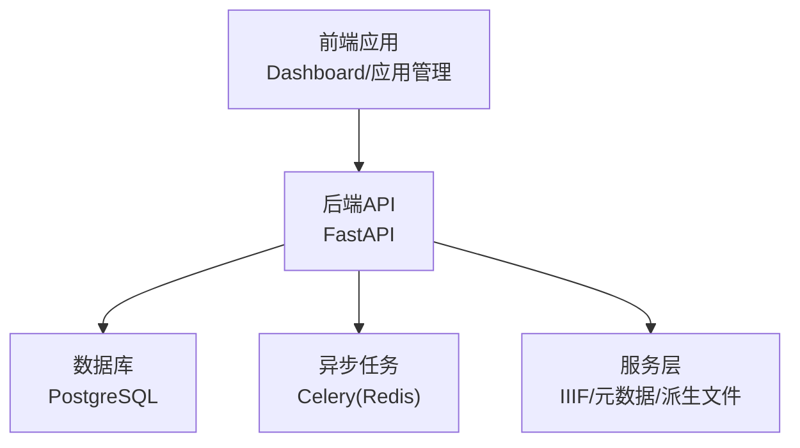
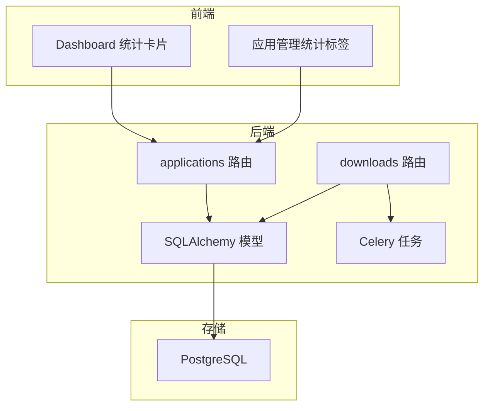
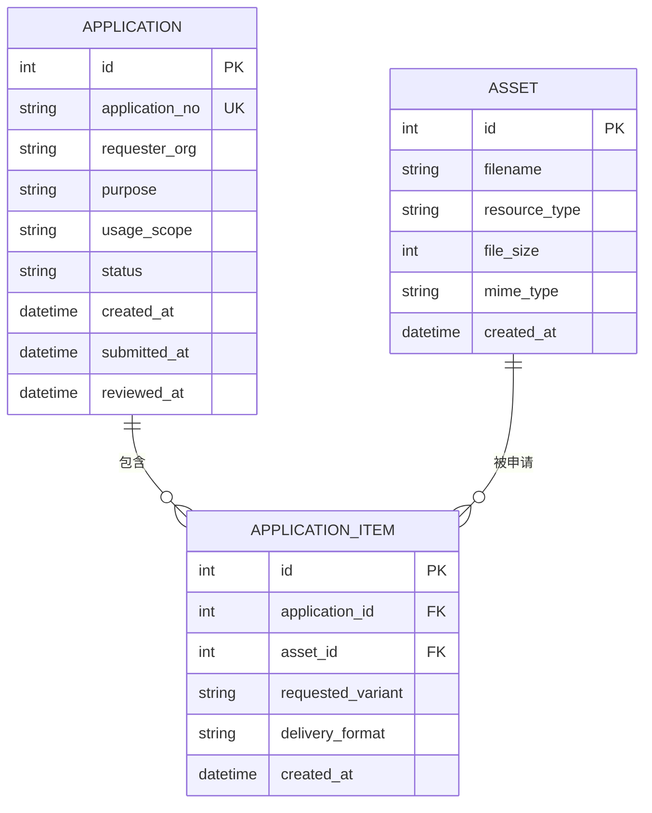
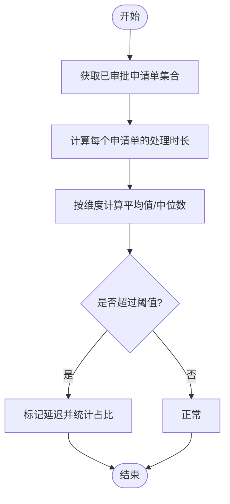
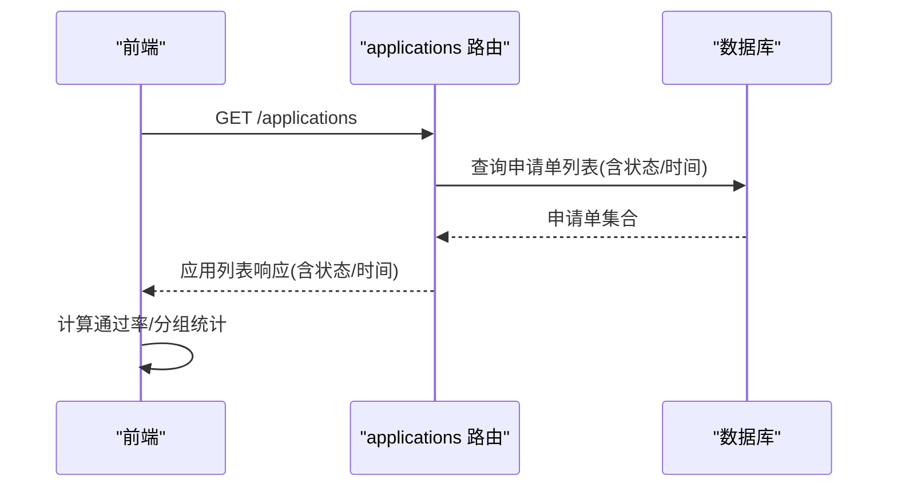
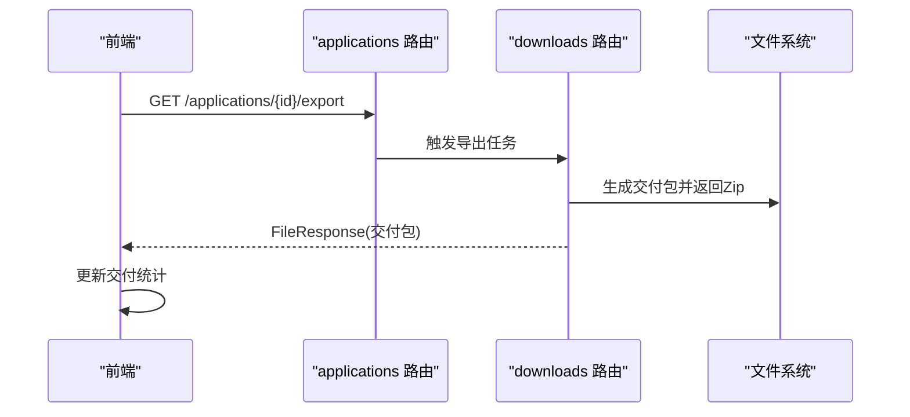
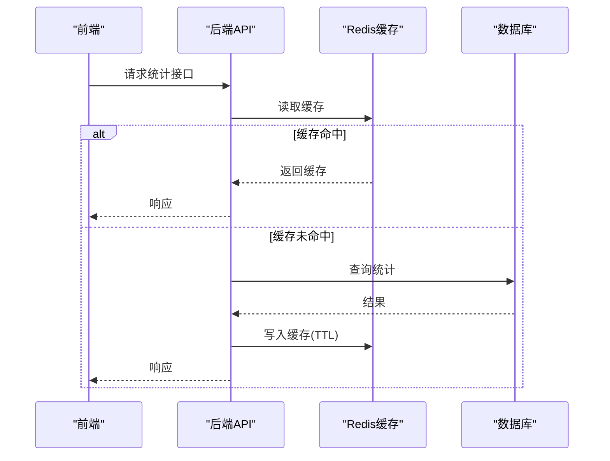
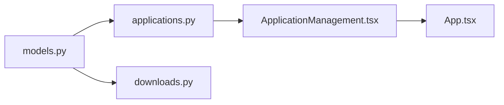

# 统计分析功能

<cite>
**本文引用的文件**
- [README.md](file://README.md)
- [API_ROUTE_MAP.md](file://docs/02-架构设计/API_ROUTE_MAP.md)
- [models.py](file://backend/app/models.py)
- [schemas.py](file://backend/app/schemas.py)
- [applications.py](file://backend/app/routers/applications.py)
- [downloads.py](file://backend/app/routers/downloads.py)
- [tasks.py](file://backend/app/tasks.py)
- [celery_app.py](file://backend/app/celery_app.py)
- [App.tsx](file://frontend/src/App.tsx)
- [ApplicationManagement.tsx](file://frontend/src/components/ApplicationManagement.tsx)
- [ThreeDManagement.tsx](file://frontend/src/components/ThreeDManagement.tsx)
- [dashboard.spec.ts](file://frontend/tests/dashboard.spec.ts)
</cite>

## 目录
1. [引言](#引言)
2. [项目结构](#项目结构)
3. [核心组件](#核心组件)
4. [架构总览](#架构总览)
5. [详细组件分析](#详细组件分析)
6. [依赖分析](#依赖分析)
7. [性能考虑](#性能考虑)
8. [故障排除指南](#故障排除指南)
9. [结论](#结论)
10. [附录](#附录)

## 引言
本文件面向MDAMS原型项目的统计分析功能，围绕“申请量统计分析”“审批时效分析”“申请成功率统计”“交付包统计”四大主题，结合现有后端数据模型与前端界面，给出可落地的统计指标定义、数据来源、可视化方案、实时更新机制与API接口设计建议。目标是帮助非技术读者理解统计口径与业务价值，同时为开发者提供实现路径与注意事项。

## 项目结构
- 后端采用FastAPI + SQLAlchemy，路由按功能域划分，其中“applications”“downloads”“three-d”等模块为统计分析提供数据基础。
- 前端使用React + Ant Design，Dashboard与应用管理界面已具备基础统计卡片与筛选能力，可作为统计面板的前端载体。

**章节来源**
- [README.md: 67–80:67-80](file://README.md#L67-L80)
- [API_ROUTE_MAP.md: 14–26:14-26](file://docs/02-架构设计/API_ROUTE_MAP.md#L14-L26)

## 核心组件
- 申请工作流（applications）：提供申请单生命周期数据（创建、审批、导出），是统计分析的核心数据源。
- 交付下载（downloads）：提供交付包导出与下载行为的证据，支撑交付包统计。
- 三维资源（three-d）：提供版本与文件数量等统计维度，可扩展为资产规模类统计。
- 前端Dashboard与应用管理：提供基础统计卡片与筛选交互，便于承载统计面板。

**章节来源**
- [applications.py: 177–254:177-254](file://backend/app/routers/applications.py#L177-L254)
- [downloads.py: 51–119:51-119](file://backend/app/routers/downloads.py#L51-L119)
- [models.py: 176–213:176-213](file://backend/app/models.py#L176-L213)
- [App.tsx: 552–603:552-603](file://frontend/src/App.tsx#L552-L603)
- [ApplicationManagement.tsx: 189–217:189-217](file://frontend/src/components/ApplicationManagement.tsx#L189-L217)

## 架构总览
统计分析的数据流自下而上：数据模型沉淀于数据库；API路由提供查询与导出；前端组件消费数据并渲染可视化；异步任务保障大体量导出与派生文件生成的后台处理。

**图表来源**
- [applications.py: 177–254:177-254](file://backend/app/routers/applications.py#L177-L254)
- [downloads.py: 51–119:51-119](file://backend/app/routers/downloads.py#L51-L119)
- [models.py: 1–307:1-307](file://backend/app/models.py#L1-L307)
- [tasks.py: 151–182:151-182](file://backend/app/tasks.py#L151-L182)

## 详细组件分析

### 申请量统计分析
- 时间维度趋势：基于申请单创建时间字段，按日/周/月聚合“已提交”“已通过”“已拒绝”“已交付”等状态的数量变化。
- 申请人组织分布：按申请单中的组织字段进行分组计数，输出Top N组织。
- 资产类型热门排行：按申请单关联的资产资源类型进行聚合，输出Top N类型。

**图表来源**
- [models.py: 176–213:176-213](file://backend/app/models.py#L176-L213)

**章节来源**
- [applications.py: 40–55:40-55](file://backend/app/routers/applications.py#L40-L55)
- [schemas.py: 418–449:418-449](file://backend/app/schemas.py#L418-L449)

### 审批时效分析
- 平均处理时间：已审批申请单的“审阅时间”与“提交时间”的差值，按天/小时统计平均值。
- 审批延迟预警：设定阈值（如超过N个工作日），标记超时申请单并统计占比。
- 部门间效率对比：若组织字段可区分部门，按部门分组比较平均处理时长与通过率。

**图表来源**
- [applications.py: 203–232:203-232](file://backend/app/routers/applications.py#L203-L232)
- [models.py: 186–190:186-190](file://backend/app/models.py#L186-L190)

**章节来源**
- [applications.py: 203–232:203-232](file://backend/app/routers/applications.py#L203-L232)
- [models.py: 186–190:186-190](file://backend/app/models.py#L186-L190)

### 申请成功率统计
- 整体通过率：已审批申请单中“已通过”占比。
- 按类型分类通过率：按用途/使用范围/资产类型分组，分别计算通过率。
- 申请人历史记录分析：按申请人组织/姓名统计其申请总量、通过率、平均处理时长等。

**图表来源**
- [applications.py: 177–189:177-189](file://backend/app/routers/applications.py#L177-L189)
- [schemas.py: 418–449:418-449](file://backend/app/schemas.py#L418-L449)

**章节来源**
- [applications.py: 177–189:177-189](file://backend/app/routers/applications.py#L177-L189)
- [schemas.py: 418–449:418-449](file://backend/app/schemas.py#L418-L449)

### 交付包统计
- 交付数量分析：统计“已交付”状态的申请单数量及环比/同比。
- 文件大小分布：统计交付包内文件大小的分布直方图（按区间分组）。
- 下载次数统计：结合交付导出接口调用记录（如未来埋点），统计下载频次与去重用户。

**图表来源**
- [applications.py: 235–254:235-254](file://backend/app/routers/applications.py#L235-L254)
- [downloads.py: 51–119:51-119](file://backend/app/routers/downloads.py#L51-L119)

**章节来源**
- [applications.py: 235–254:235-254](file://backend/app/routers/applications.py#L235-L254)
- [downloads.py: 51–119:51-119](file://backend/app/routers/downloads.py#L51-L119)

### 可视化图表实现方案
- 折线图：申请趋势（按日/周/月）。
- 柱状图：组织Top N、资产类型Top N。
- 饼图：状态分布（已提交/已通过/已拒绝/已交付）。
- 热力图：部门/类型组合的通过率矩阵。
- 仪表盘：平均处理时长、延迟率、交付数量等关键指标。

（本节为通用方案说明，不直接分析具体文件）

### 实时更新机制
- 前端轮询：Dashboard定时刷新，拉取最新统计数据。
- 增量更新：监听申请状态变更事件，局部更新统计卡片。
- 后台缓存：Redis缓存高频统计结果，降低数据库压力；设置TTL避免陈旧数据。
- 异步任务：导出包生成、派生文件转换等耗时任务通过Celery执行，完成后触发统计更新。

**图表来源**
- [celery_app.py: 1–18:1-18](file://backend/app/celery_app.py#L1-L18)
- [tasks.py: 151–182:151-182](file://backend/app/tasks.py#L151-L182)

**章节来源**
- [celery_app.py: 1–18:1-18](file://backend/app/celery_app.py#L1-L18)
- [tasks.py: 151–182:151-182](file://backend/app/tasks.py#L151-L182)

### 统计报表导出
- Excel/PDF：后端提供导出接口，返回结构化数据或报告文件。
- CSV：按日/周/月导出明细数据，便于二次分析。
- 报表模板：前端可集成报表引擎，按模板填充统计结果。

（本节为通用方案说明，不直接分析具体文件）

### 统计分析API接口设计
- GET /api/stat/applications/trend?granularity=daily&start=...&end=...
  - 返回申请趋势（按日/周/月）的状态分布序列
- GET /api/stat/applications/organization-top?limit=N
  - 返回组织Top N的申请数量
- GET /api/stat/applications/type-top?limit=N
  - 返回资产类型Top N的申请数量
- GET /api/stat/applications/throughput?start=...&end=...
  - 返回整体通过率与按类型/组织的分组通过率
- GET /api/stat/applications/efficiency?start=...&end=...
  - 返回平均处理时长、延迟率、部门对比
- GET /api/stat/applications/delivery?start=...&end=...
  - 返回交付数量、文件大小分布、下载次数
- GET /api/stat/applications/export?type=excel|pdf|csv
  - 导出指定格式的统计报表

（以上为接口设计建议，具体路径与参数可根据实际需求调整）

**章节来源**
- [applications.py: 177–254:177-254](file://backend/app/routers/applications.py#L177-L254)
- [downloads.py: 51–119:51-119](file://backend/app/routers/downloads.py#L51-L119)

### 结果解读与业务洞察
- 申请趋势：观察业务高峰与低谷，指导资源配置与人员排班。
- 组织分布：识别高价值客户与重点合作单位，制定差异化服务策略。
- 类型排行：聚焦热门资产类型，优化存储与访问策略。
- 审批时效：发现瓶颈环节，推动流程优化与自动化。
- 成功率与延迟：评估审批效率与质量，识别风险组织与高风险类型。
- 交付统计：衡量交付能力与用户满意度，优化交付流程与文件组织。

（本节为通用解读说明，不直接分析具体文件）

## 依赖分析
- 数据模型依赖：申请单、申请项、资产三者构成统计分析的基础关系。
- 路由依赖：applications与downloads路由提供统计所需的数据与导出能力。
- 前端依赖：Dashboard与应用管理组件承载统计展示与交互。

**图表来源**
- [models.py: 176–213:176-213](file://backend/app/models.py#L176-L213)
- [applications.py: 177–254:177-254](file://backend/app/routers/applications.py#L177-L254)
- [downloads.py: 51–119:51-119](file://backend/app/routers/downloads.py#L51-L119)
- [ApplicationManagement.tsx: 189–217:189-217](file://frontend/src/components/ApplicationManagement.tsx#L189-L217)
- [App.tsx: 552–603:552-603](file://frontend/src/App.tsx#L552-L603)

**章节来源**
- [models.py: 176–213:176-213](file://backend/app/models.py#L176-L213)
- [applications.py: 177–254:177-254](file://backend/app/routers/applications.py#L177-L254)
- [downloads.py: 51–119:51-119](file://backend/app/routers/downloads.py#L51-L119)
- [ApplicationManagement.tsx: 189–217:189-217](file://frontend/src/components/ApplicationManagement.tsx#L189-L217)
- [App.tsx: 552–603:552-603](file://frontend/src/App.tsx#L552-L603)

## 性能考虑
- 查询优化：对时间字段、状态字段建立索引，避免全表扫描。
- 分页与分组：统计接口采用分页与分组，限制单次返回数据量。
- 缓存策略：热点统计结果缓存，设置合理TTL；写少读多场景优先缓存。
- 异步导出：大体量交付包通过后台任务生成，避免阻塞请求。
- 前端渲染：使用虚拟滚动与懒加载，提升大数据量下的交互体验。

（本节为通用性能建议，不直接分析具体文件）

## 故障排除指南
- 申请单缺失：导出前校验申请单状态与资产文件是否存在，避免404。
- 导出失败：捕获异常并清理临时目录，返回友好错误信息。
- 时效异常：当审阅时间为空时，跳过该申请单或标记为“未完成”。

**章节来源**
- [applications.py: 242–254:242-254](file://backend/app/routers/applications.py#L242-L254)
- [downloads.py: 116–119:116-119](file://backend/app/routers/downloads.py#L116-L119)

## 结论
通过对现有数据模型与API的梳理，MDAMS原型已具备开展统计分析的良好基础。建议优先实现申请量、审批时效与成功率的可视化面板，并配套实时更新与导出能力。后续可扩展到交付包统计与三维资源统计，逐步完善业务洞察闭环。

## 附录
- 前端统计卡片参考：Dashboard中的统计卡片与应用管理的筛选标签，可作为统计面板的前端载体。
- 测试用例参考：前端测试中对统一资源目录的过滤逻辑，可借鉴为统计筛选的交互模式。

**章节来源**
- [App.tsx: 552–603:552-603](file://frontend/src/App.tsx#L552-L603)
- [ApplicationManagement.tsx: 189–217:189-217](file://frontend/src/components/ApplicationManagement.tsx#L189-L217)
- [dashboard.spec.ts: 638–664:638-664](file://frontend/tests/dashboard.spec.ts#L638-L664)