# 前端应用架构

<cite>
**本文档引用的文件**
- [package.json](file://frontend/package.json)
- [vite.config.ts](file://frontend/vite.config.ts)
- [tsconfig.json](file://frontend/tsconfig.json)
- [playwright.config.ts](file://frontend/playwright.config.ts)
- [.eslintrc.cjs](file://frontend/.eslintrc.cjs)
- [Dockerfile](file://frontend/Dockerfile)
- [nginx.conf](file://frontend/nginx.conf)
- [main.tsx](file://frontend/src/main.tsx)
- [App.tsx](file://frontend/src/App.tsx)
- [MiradorViewer.tsx](file://frontend/src/MiradorViewer.tsx)
- [MiradorAiPanel.tsx](file://frontend/src/MiradorAiPanel.tsx)
- [ApplicationManagement.tsx](file://frontend/src/components/ApplicationManagement.tsx)
- [assets.ts](file://frontend/src/types/assets.ts)
- [permissions.ts](file://frontend/src/auth/permissions.ts)
- [dashboard.spec.ts](file://frontend/tests/dashboard.spec.ts)
- [mirador-ai.spec.ts](file://frontend/tests/mirador-ai.spec.ts)
- [index.html](file://frontend/index.html)
</cite>

## 目录
1. [引言](#引言)
2. [项目结构](#项目结构)
3. [核心组件](#核心组件)
4. [架构概览](#架构概览)
5. [详细组件分析](#详细组件分析)
6. [依赖分析](#依赖分析)
7. [性能考虑](#性能考虑)
8. [故障排除指南](#故障排除指南)
9. [结论](#结论)
10. [附录](#附录)

## 引言

MDAMS原型项目的前端应用采用现代化的技术栈构建，基于React 18、TypeScript、Vite和Ant Design，旨在提供一个功能完整、性能优异的数字资产管理界面。该应用集成了IIIF图像展示、三维模型浏览、申请管理、统一资源目录等多个核心功能模块。

应用的核心设计理念包括：
- **模块化架构**：清晰的组件层次结构和职责分离
- **类型安全**：完整的TypeScript类型定义确保代码质量
- **性能优化**：智能的代码分割和资源优化策略
- **测试驱动**：完善的端到端测试覆盖关键业务流程
- **开发体验**：热重载、语法检查、代码格式化等现代化开发工具

## 项目结构

前端项目采用典型的React应用结构，主要目录组织如下：

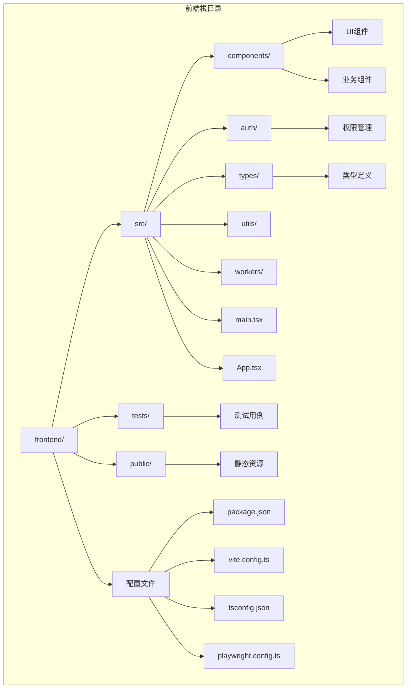

**图表来源**
- [package.json:1-42](file://frontend/package.json#L1-L42)
- [vite.config.ts:1-42](file://frontend/vite.config.ts#L1-L42)
- [tsconfig.json:1-23](file://frontend/tsconfig.json#L1-L23)

**章节来源**
- [package.json:1-42](file://frontend/package.json#L1-L42)
- [vite.config.ts:1-42](file://frontend/vite.config.ts#L1-L42)
- [tsconfig.json:1-23](file://frontend/tsconfig.json#L1-L23)

## 核心组件

### 技术栈概述

应用采用以下核心技术栈：

**前端框架与库**
- **React 18**：现代JavaScript库，提供组件化开发和虚拟DOM
- **TypeScript**：强类型语言，提升代码质量和开发体验
- **Ant Design**：企业级UI设计语言和React组件库
- **Axios**：HTTP客户端库，用于API通信
- **Mirador**：IIIF图像查看器，支持高级图像浏览功能

**构建工具与开发环境**
- **Vite**：快速的构建工具和开发服务器
- **ESLint**：代码质量检查工具
- **Playwright**：现代化的端到端测试框架

**章节来源**
- [package.json:13-26](file://frontend/package.json#L13-L26)
- [package.json:27-40](file://frontend/package.json#L27-L40)

### 应用入口与初始化

应用从`main.tsx`开始启动，使用React 18的严格模式包装整个应用：

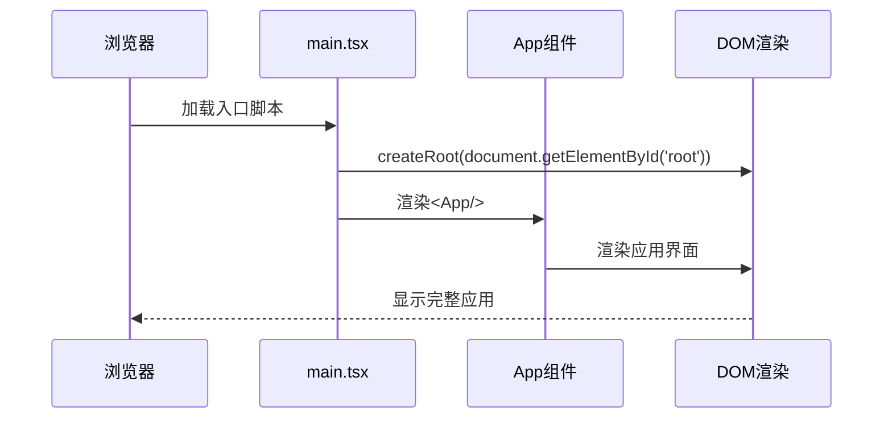

**图表来源**
- [main.tsx:1-11](file://frontend/src/main.tsx#L1-L11)

**章节来源**
- [main.tsx:1-11](file://frontend/src/main.tsx#L1-L11)
- [index.html:1-13](file://frontend/index.html#L1-L13)

## 架构概览

应用采用分层架构设计，各层职责明确：

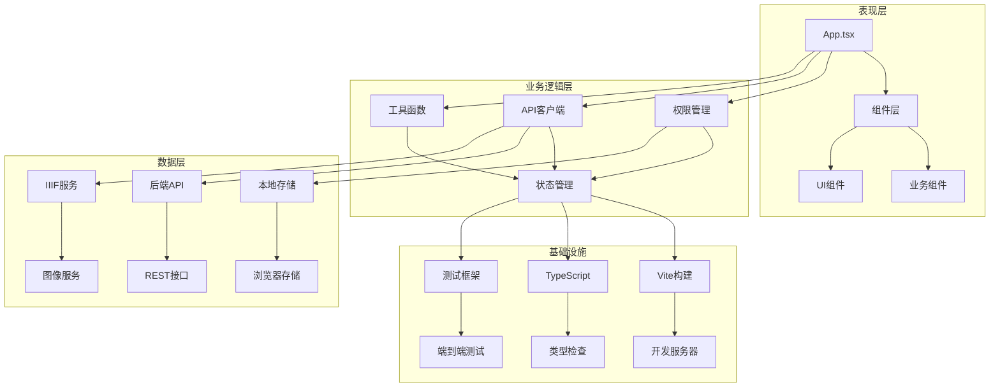

**图表来源**
- [App.tsx:1-905](file://frontend/src/App.tsx#L1-L905)
- [permissions.ts:1-111](file://frontend/src/auth/permissions.ts#L1-L111)
- [assets.ts:1-621](file://frontend/src/types/assets.ts#L1-L621)

### 组件层次结构

应用采用自上而下的组件层次结构：

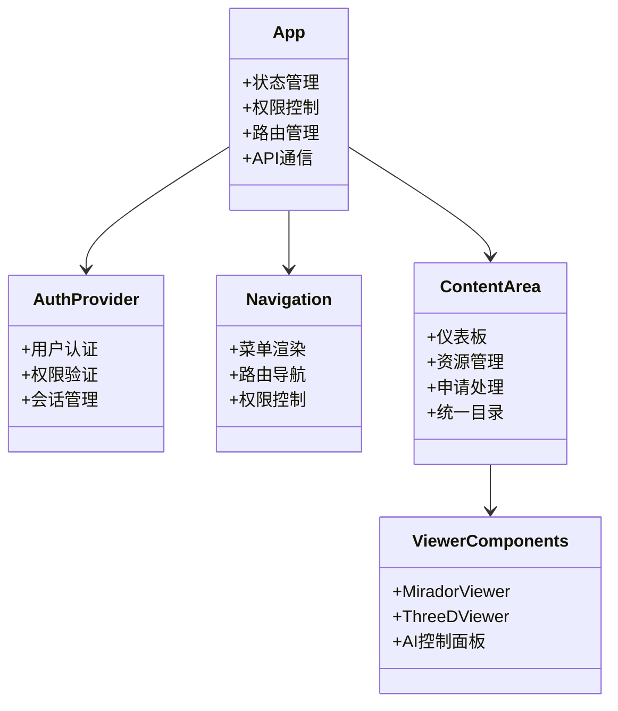

**图表来源**
- [App.tsx:100-905](file://frontend/src/App.tsx#L100-L905)
- [permissions.ts:96-111](file://frontend/src/auth/permissions.ts#L96-L111)

**章节来源**
- [App.tsx:1-905](file://frontend/src/App.tsx#L1-L905)

## 详细组件分析

### 主应用组件 (App.tsx)

主应用组件是整个应用的核心，负责全局状态管理和路由控制：

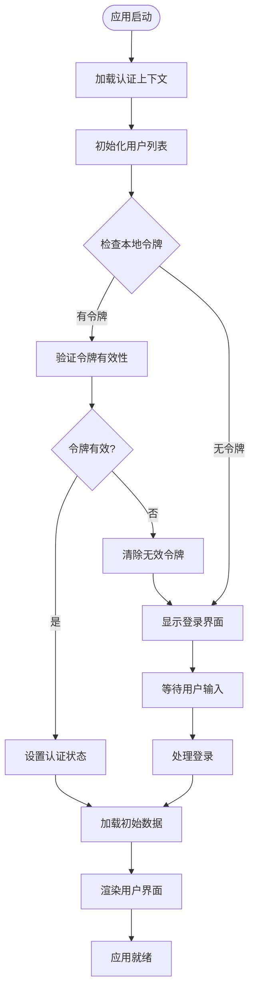

**图表来源**
- [App.tsx:183-205](file://frontend/src/App.tsx#L183-L205)

#### 权限管理系统

应用实现了细粒度的权限控制机制：

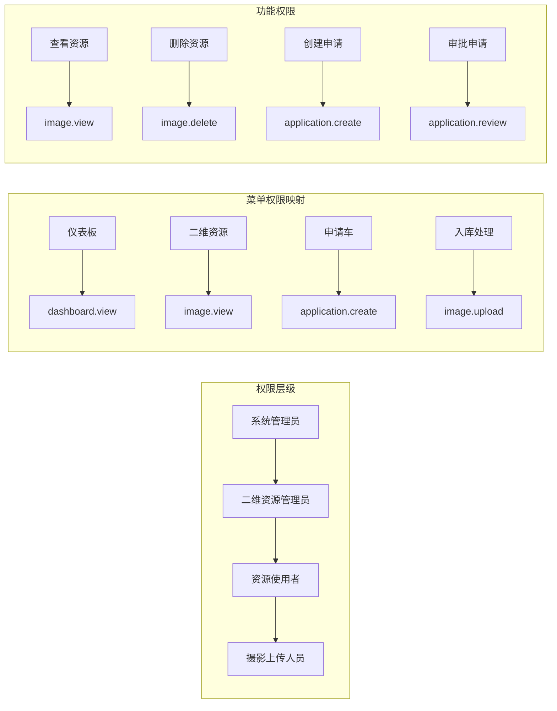

**图表来源**
- [permissions.ts:84-111](file://frontend/src/auth/permissions.ts#L84-L111)

**章节来源**
- [App.tsx:116-139](file://frontend/src/App.tsx#L116-L139)
- [permissions.ts:1-111](file://frontend/src/auth/permissions.ts#L1-L111)

### IIIF图像查看器 (MiradorViewer)

图像查看器组件集成了Mirador III，提供高级的图像浏览功能：

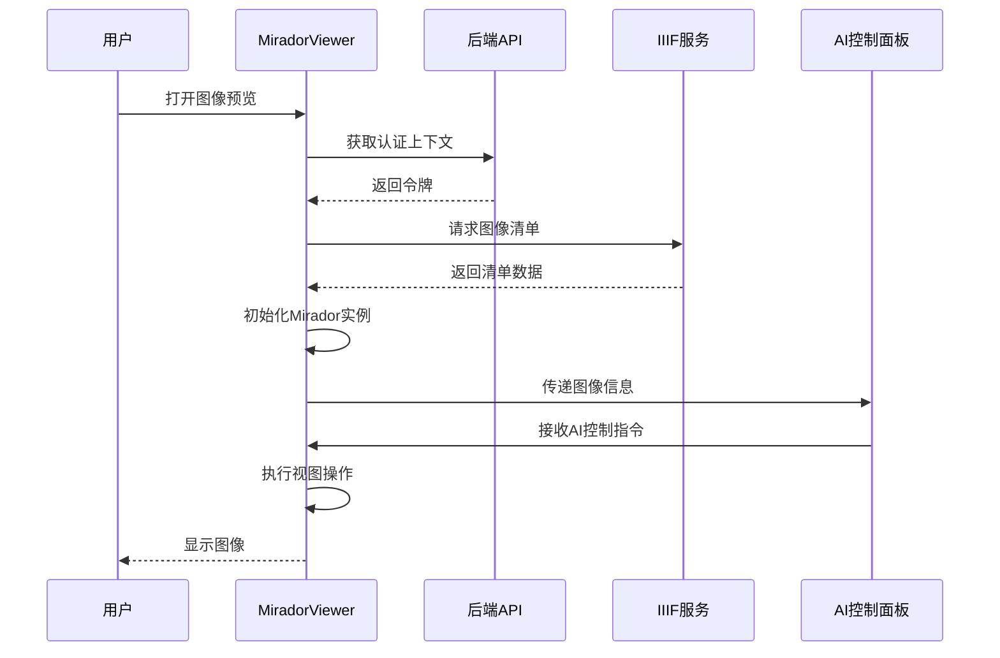

**图表来源**
- [MiradorViewer.tsx:64-197](file://frontend/src/MiradorViewer.tsx#L64-L197)

#### AI控制面板功能

AI控制面板提供了智能化的图像操作能力：

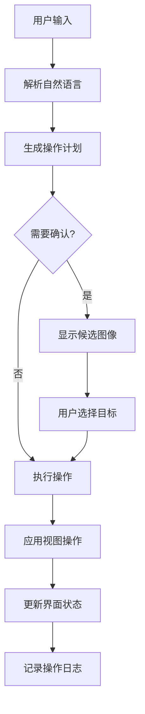

**图表来源**
- [MiradorAiPanel.tsx:525-579](file://frontend/src/MiradorAiPanel.tsx#L525-L579)

**章节来源**
- [MiradorViewer.tsx:1-399](file://frontend/src/MiradorViewer.tsx#L1-L399)
- [MiradorAiPanel.tsx:1-948](file://frontend/src/MiradorAiPanel.tsx#L1-L948)

### 申请管理系统

申请管理组件提供了完整的申请生命周期管理：

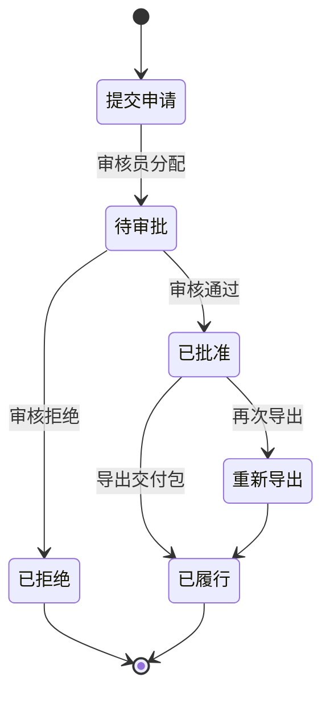

**图表来源**
- [ApplicationManagement.tsx:18-101](file://frontend/src/components/ApplicationManagement.tsx#L18-L101)

**章节来源**
- [ApplicationManagement.tsx:1-293](file://frontend/src/components/ApplicationManagement.tsx#L1-L293)

### 类型系统设计

应用使用TypeScript定义了完整的类型系统：

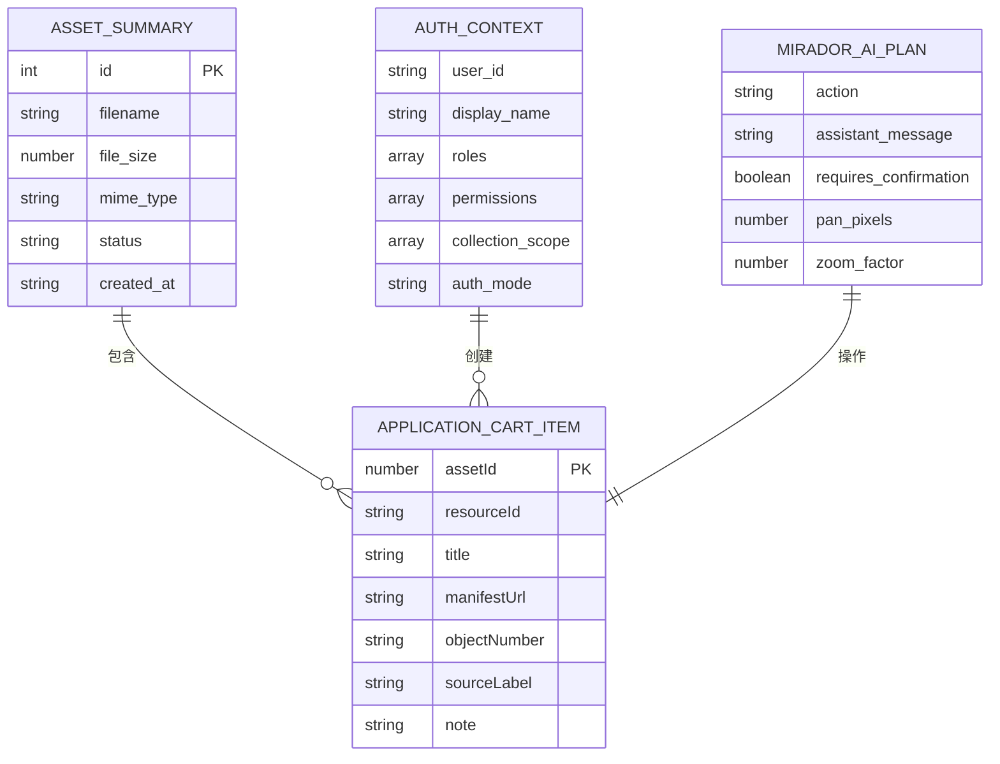

**图表来源**
- [assets.ts:1-621](file://frontend/src/types/assets.ts#L1-L621)

**章节来源**
- [assets.ts:1-621](file://frontend/src/types/assets.ts#L1-L621)

## 依赖分析

### 核心依赖关系

```mermaid
graph TB
subgraph "运行时依赖"
A[react@^18.2.0] --> B[react-dom@^18.2.0]
C[antd@^5.12.5] --> D[@ant-design/icons@^5.2.6]
E[mirador@^3.3.0] --> F[IIIF规范]
G[axios@^1.6.5] --> H[HTTP客户端]
I[three@^0.183.2] --> J[三维渲染]
K[@google/model-viewer@^4.2.0] --> L[WebXR模型]
end
subgraph "开发依赖"
M[vite@^5.0.8] --> N[构建工具]
O[typescript@^5.2.2] --> P[类型检查]
Q[eslint@^8.57.1] --> R[代码质量]
S[@playwright/test@^1.57.0] --> T[端到端测试]
end
subgraph "工具链"
U[@vitejs/plugin-react@^4.2.1] --> N
V[@types/react@^18.2.43] --> O
W[@types/node@^25.5.0] --> O
end
```

**图表来源**
- [package.json:13-40](file://frontend/package.json#L13-L40)

### 代码分割策略

应用采用智能的代码分割策略，优化加载性能：

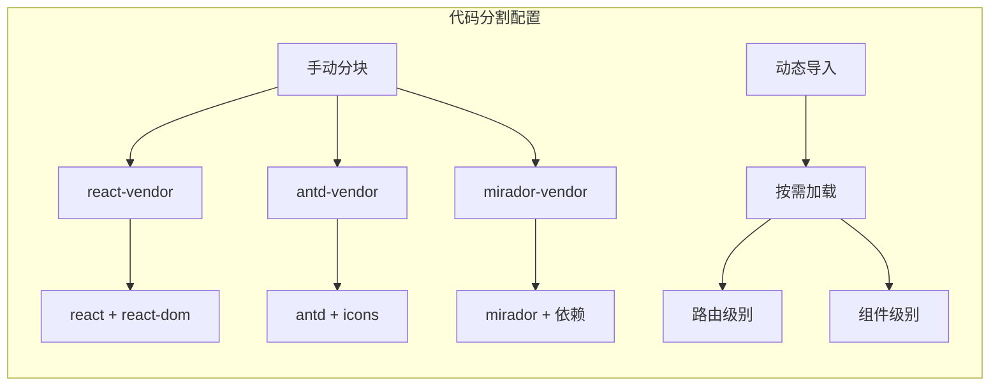

**图表来源**
- [vite.config.ts:14-19](file://frontend/vite.config.ts#L14-L19)

**章节来源**
- [package.json:1-42](file://frontend/package.json#L1-L42)
- [vite.config.ts:1-42](file://frontend/vite.config.ts#L1-L42)

## 性能考虑

### 构建优化

应用在构建过程中采用了多项性能优化措施：

**代码分割优化**
- 将大型依赖库独立打包，提高缓存效率
- 使用动态导入实现按需加载
- 优化chunk大小，避免内存问题

**资源优化**
- 禁用生产环境source map以减小包体积
- 设置合理的chunk大小警告阈值
- 优化第三方库的打包策略

**开发体验优化**
- 热重载支持，提升开发效率
- 即时错误反馈
- 智能类型检查

### 运行时性能

**内存管理**
- 针对低内存环境（N100处理器）优化
- 合理的组件卸载和清理
- 防止内存泄漏的监听器管理

**网络优化**
- API请求的超时和重试机制
- 缓存策略和版本控制
- 错误处理和降级方案

## 故障排除指南

### 常见问题诊断

**认证相关问题**
- 检查本地存储中的认证令牌
- 验证后端API的认证接口
- 确认跨域请求配置

**图像加载问题**
- 验证IIIF服务的可用性
- 检查图像服务的代理配置
- 确认图像格式支持

**构建问题**
- 检查Node.js版本兼容性
- 验证依赖安装完整性
- 确认Vite配置正确性

### 调试工具

**开发工具**
- 浏览器开发者工具
- React DevTools
- TypeScript类型检查

**测试工具**
- Playwright测试运行器
- 端到端测试调试
- 性能分析工具

**章节来源**
- [App.tsx:140-181](file://frontend/src/App.tsx#L140-L181)
- [MiradorViewer.tsx:55-62](file://frontend/src/MiradorViewer.tsx#L55-L62)

## 结论

MDAMS原型项目的前端应用架构展现了现代Web应用的最佳实践。通过精心设计的技术栈选择、清晰的架构分层、完善的类型系统和全面的测试策略，该应用为数字资产管理提供了强大而灵活的用户界面。

应用的主要优势包括：
- **技术先进性**：采用最新的React 18和TypeScript特性
- **用户体验**：丰富的交互功能和直观的操作界面
- **可维护性**：模块化的代码结构和清晰的职责分离
- **可扩展性**：灵活的架构设计支持功能扩展
- **可靠性**：完善的错误处理和测试覆盖

未来可以考虑的改进方向：
- 进一步优化性能指标
- 增加更多的自动化测试
- 探索新的UI组件库
- 实现更高级的缓存策略

## 附录

### 开发指南

**环境要求**
- Node.js 18+
- npm 8+

**开发命令**
- `npm run dev` - 启动开发服务器
- `npm run build` - 生产环境构建
- `npm run lint` - 代码质量检查
- `npm run test` - 运行测试套件

**配置文件说明**
- `vite.config.ts` - Vite构建配置
- `tsconfig.json` - TypeScript编译配置
- `playwright.config.ts` - 测试框架配置
- `.eslintrc.cjs` - 代码质量规则

**部署配置**
- Docker容器化支持
- Nginx反向代理配置
- 静态资源优化
- CDN集成准备

**章节来源**
- [package.json:6-12](file://frontend/package.json#L6-L12)
- [Dockerfile:1-28](file://frontend/Dockerfile#L1-L28)
- [nginx.conf:1-33](file://frontend/nginx.conf#L1-L33)