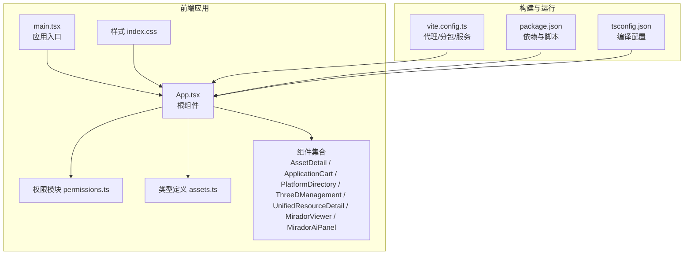
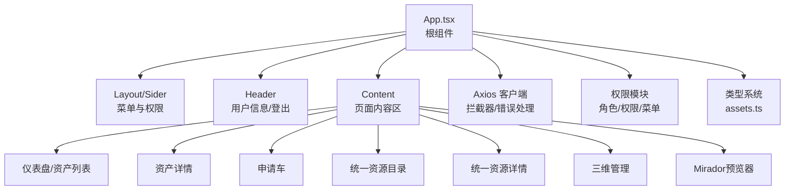
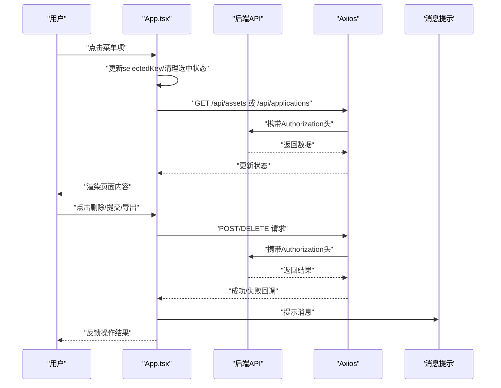
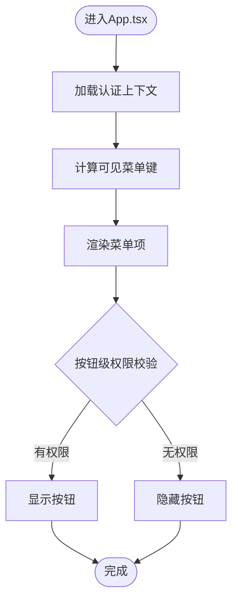
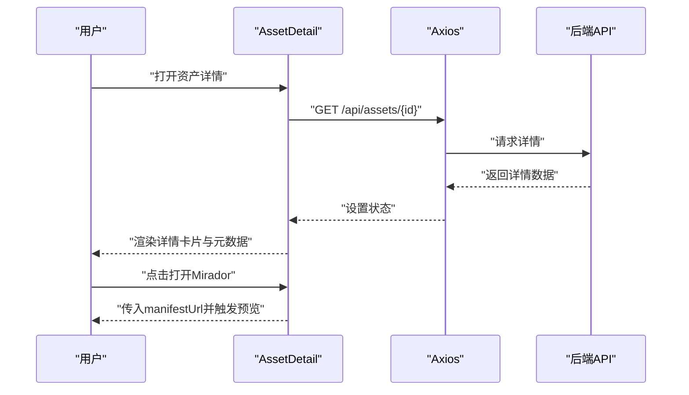
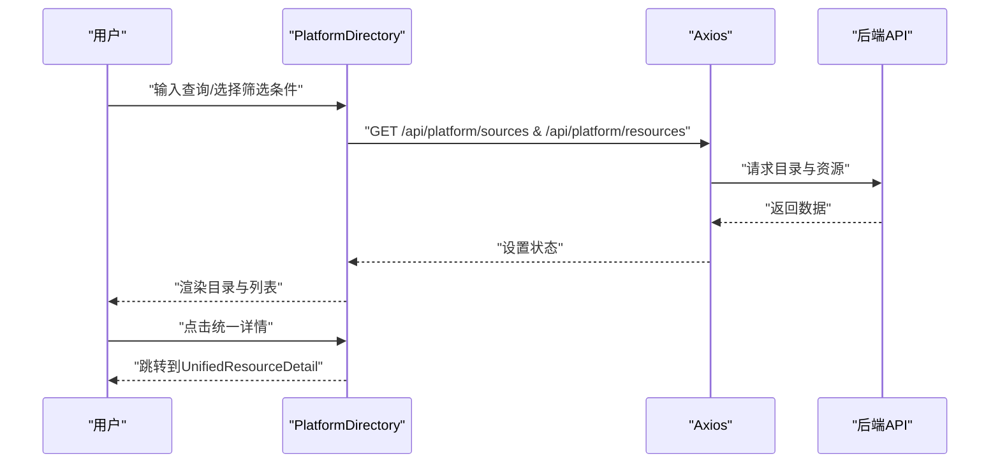
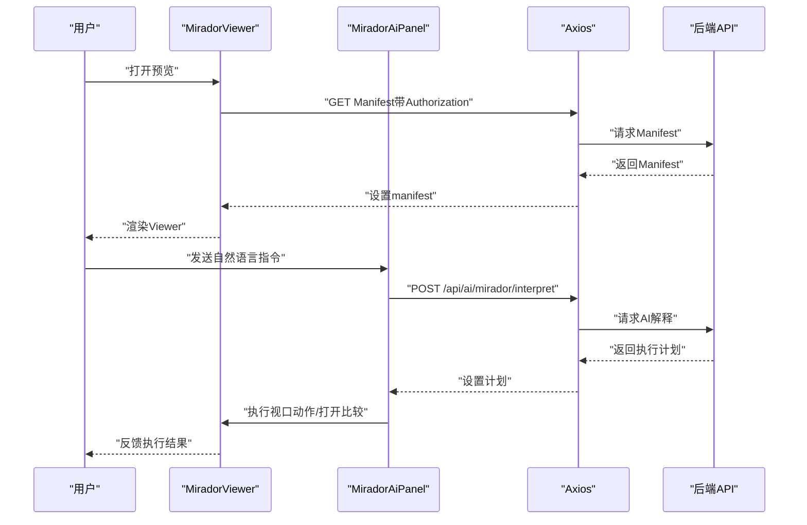
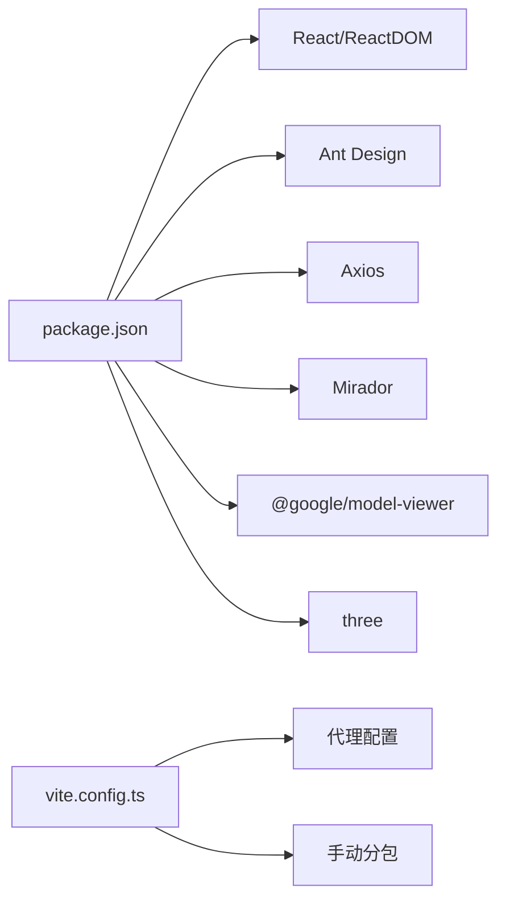

# 应用架构设计

<cite>
**本文引用的文件**
- [App.tsx](file://frontend/src/App.tsx)
- [main.tsx](file://frontend/src/main.tsx)
- [permissions.ts](file://frontend/src/auth/permissions.ts)
- [MiradorViewer.tsx](file://frontend/src/MiradorViewer.tsx)
- [MiradorAiPanel.tsx](file://frontend/src/MiradorAiPanel.tsx)
- [AssetDetail.tsx](file://frontend/src/components/AssetDetail.tsx)
- [ApplicationCart.tsx](file://frontend/src/components/ApplicationCart.tsx)
- [PlatformDirectory.tsx](file://frontend/src/components/PlatformDirectory.tsx)
- [ThreeDManagement.tsx](file://frontend/src/components/ThreeDManagement.tsx)
- [UnifiedResourceDetail.tsx](file://frontend/src/components/UnifiedResourceDetail.tsx)
- [assets.ts](file://frontend/src/types/assets.ts)
- [index.css](file://frontend/src/index.css)
- [package.json](file://frontend/package.json)
- [vite.config.ts](file://frontend/vite.config.ts)
- [tsconfig.json](file://frontend/tsconfig.json)
</cite>

## 目录
1. [简介](#简介)
2. [项目结构](#项目结构)
3. [核心组件](#核心组件)
4. [架构总览](#架构总览)
5. [详细组件分析](#详细组件分析)
6. [依赖分析](#依赖分析)
7. [性能考虑](#性能考虑)
8. [故障排查指南](#故障排查指南)
9. [结论](#结论)
10. [附录](#附录)

## 简介
本文件面向MDAMS原型项目的前端应用，围绕根组件App.tsx进行系统性架构设计说明，涵盖布局架构、状态管理、权限控制、路由与导航、API客户端设计、国际化与主题、响应式设计等关键方面。文档同时提供组件关系图与数据流图，帮助开发者快速理解整体设计与实现要点。

## 项目结构
前端采用Vite + React 18 + TypeScript构建，Ant Design作为UI基础库，Axios负责HTTP通信，Mirador用于IIIF图像浏览，Three.js生态组件用于三维资源展示。项目以功能域划分组件，权限与类型定义集中于独立模块，便于扩展与维护。

**图表来源**
- [main.tsx:1-11](file://frontend/src/main.tsx#L1-L11)
- [App.tsx:1-905](file://frontend/src/App.tsx#L1-L905)
- [permissions.ts:1-111](file://frontend/src/auth/permissions.ts#L1-L111)
- [assets.ts:1-621](file://frontend/src/types/assets.ts#L1-L621)
- [index.css:1-19](file://frontend/src/index.css#L1-L19)
- [vite.config.ts:1-42](file://frontend/vite.config.ts#L1-L42)
- [package.json:1-42](file://frontend/package.json#L1-L42)
- [tsconfig.json:1-23](file://frontend/tsconfig.json#L1-L23)

**章节来源**
- [main.tsx:1-11](file://frontend/src/main.tsx#L1-L11)
- [vite.config.ts:1-42](file://frontend/vite.config.ts#L1-L42)
- [package.json:1-42](file://frontend/package.json#L1-L42)
- [tsconfig.json:1-23](file://frontend/tsconfig.json#L1-L23)

## 核心组件
- 根组件App.tsx：负责全局布局、侧边菜单、头部用户信息、内容区渲染、权限控制、全局状态管理、API调用与自动刷新、消息提示等。
- 权限模块permissions.ts：定义角色、权限、菜单可见性规则、角色标签映射与菜单权限映射。
- 组件层：资产详情、申请车、统一资源目录、三维管理、Mirador查看器与AI控制台等，均通过Axios与后端交互。
- 类型系统assets.ts：统一定义资产、申请、资源、元数据、生命周期、技术元数据等接口，确保前后端契约一致。

**章节来源**
- [App.tsx:100-905](file://frontend/src/App.tsx#L100-L905)
- [permissions.ts:1-111](file://frontend/src/auth/permissions.ts#L1-L111)
- [assets.ts:1-621](file://frontend/src/types/assets.ts#L1-L621)

## 架构总览
应用采用“根组件驱动 + 组件分层”的架构模式：
- 布局：Ant Design Layout + Sider/Content/Header/Footer组合，左侧菜单根据权限动态渲染。
- 状态：全局状态集中在App.tsx，包含认证上下文、资产列表、申请车、应用列表、当前选中菜单项等；各功能组件内部维持局部状态。
- 权限：基于角色与权限矩阵，动态计算可见菜单与按钮级权限，贯穿菜单渲染与操作按钮显示。
- 导航：菜单点击切换内容区；部分页面支持返回逻辑；统一资源目录支持预览与详情跳转。
- 数据流：Axios统一发起HTTP请求，自动注入Authorization头；错误通过message提示；部分页面支持轮询刷新。
- 视图：二维图像使用Mirador Viewer集成IIIF；三维资源使用model-viewer或自研查看器；统一资源详情聚合多源信息。

**图表来源**
- [App.tsx:680-800](file://frontend/src/App.tsx#L680-L800)
- [permissions.ts:96-111](file://frontend/src/auth/permissions.ts#L96-L111)
- [assets.ts:220-286](file://frontend/src/types/assets.ts#L220-L286)

**章节来源**
- [App.tsx:680-800](file://frontend/src/App.tsx#L680-L800)

## 详细组件分析

### 根组件App.tsx：布局、状态与权限
- 布局架构
  - 使用Ant Design Layout，左侧Sider放置菜单；Header显示用户信息与登出；Content承载页面内容。
  - 菜单项根据可见菜单键过滤，首次进入自动修正选中项。
- 状态管理
  - 全局状态：认证上下文、资产列表、申请车、应用列表、当前Manifest、预览弹窗、加载状态等。
  - 局部状态：各功能组件内部状态，如表格、表单、对话框等。
  - 状态提升：申请车在App.tsx集中管理，提交时统一调用后端API。
- 权限控制
  - visibleMenuKeys由权限模块计算；按钮级权限通过can函数判断，如删除、提交、导出等。
  - 角色标签与认证模式在Header展示，便于审计与问题定位。
- API客户端
  - Axios默认注入Authorization头；登录成功写入localStorage；登出清除上下文与缓存。
  - 自动刷新：资产列表与处理中的任务每3秒轮询刷新。
- 错误处理
  - 统一使用Ant Design message提示；对Axios错误进行分类处理。
- 国际化与主题
  - Ant Design内置国际化；主题通过CSS变量与第三方样式覆盖实现。
- 响应式设计
  - Ant Design Grid与Flex布局；Sider支持断点折叠。

**图表来源**
- [App.tsx:213-263](file://frontend/src/App.tsx#L213-L263)
- [App.tsx:307-402](file://frontend/src/App.tsx#L307-L402)

**章节来源**
- [App.tsx:100-905](file://frontend/src/App.tsx#L100-L905)

### 权限模块permissions.ts：角色、权限与菜单
- 角色与权限
  - 角色枚举与权限枚举定义清晰，支持资源管理、申请、三维、平台等多个维度。
- 菜单权限映射
  - 菜单键到权限集合的映射，决定菜单是否可见。
- 工具函数
  - can：判断是否具备某权限。
  - getVisibleMenuKeys：计算可见菜单键。
  - getRoleLabels：角色标签本地化。

**图表来源**
- [permissions.ts:96-111](file://frontend/src/auth/permissions.ts#L96-L111)
- [App.tsx:116-139](file://frontend/src/App.tsx#L116-L139)

**章节来源**
- [permissions.ts:1-111](file://frontend/src/auth/permissions.ts#L1-L111)
- [App.tsx:116-139](file://frontend/src/App.tsx#L116-L139)

### 组件层：资产详情与申请车
- 资产详情AssetDetail
  - 加载资产详情、生命周期、处理时间线、文件结构、技术元数据、分层元数据、访问与输出。
  - 处理中状态定时轮询刷新；错误时友好提示。
- 申请车ApplicationCart
  - 申请信息表单与明细列表；支持备注编辑、移除、统一提交。
  - 提交时将申请车内容打包为后端申请对象。

**图表来源**
- [AssetDetail.tsx:194-488](file://frontend/src/components/AssetDetail.tsx#L194-L488)
- [App.tsx:728-741](file://frontend/src/App.tsx#L728-L741)

**章节来源**
- [AssetDetail.tsx:194-488](file://frontend/src/components/AssetDetail.tsx#L194-L488)
- [ApplicationCart.tsx:22-131](file://frontend/src/components/ApplicationCart.tsx#L22-L131)

### 组件层：统一资源目录与详情
- 平台目录PlatformDirectory
  - 支持多维筛选（状态、预览能力、资源类型、模板）、搜索、来源汇总、列表展示。
  - 提供预览、统一详情、来源详情入口。
- 统一资源详情UnifiedResourceDetail
  - 展示统一ID、来源、分类、状态、预览能力、下载链接、生命周期、结构与文件、技术元数据、相关推荐。

**图表来源**
- [PlatformDirectory.tsx:31-273](file://frontend/src/components/PlatformDirectory.tsx#L31-L273)
- [UnifiedResourceDetail.tsx:86-470](file://frontend/src/components/UnifiedResourceDetail.tsx#L86-L470)

**章节来源**
- [PlatformDirectory.tsx:31-273](file://frontend/src/components/PlatformDirectory.tsx#L31-L273)
- [UnifiedResourceDetail.tsx:86-470](file://frontend/src/components/UnifiedResourceDetail.tsx#L86-L470)

### 组件层：三维管理
- 三维管理ThreeDManagement
  - 数字对象聚合展示，版本展开；支持上传三维资源包、设置当前版本、Web预览状态、保存层级与归档状态。
  - 提供示例模型本地预览与下载入口。

**章节来源**
- [ThreeDManagement.tsx:142-1043](file://frontend/src/components/ThreeDManagement.tsx#L142-L1043)

### 组件层：Mirador查看器与AI控制台
- MiradorViewer
  - 加载IIIF Manifest，自动注入Authorization头；展示加载进度与状态；提供加入申请车按钮。
- MiradorAiPanel
  - 自然语言控制与快捷操作面板；支持缩放、平移、适配窗口、比较模式切换、搜索与打开比较等。
  - 与Mirador Viewer交互，执行视口动作并校验变更。

**图表来源**
- [MiradorViewer.tsx:64-271](file://frontend/src/MiradorViewer.tsx#L64-L271)
- [MiradorAiPanel.tsx:237-635](file://frontend/src/MiradorAiPanel.tsx#L237-L635)

**章节来源**
- [MiradorViewer.tsx:64-399](file://frontend/src/MiradorViewer.tsx#L64-L399)
- [MiradorAiPanel.tsx:237-948](file://frontend/src/MiradorAiPanel.tsx#L237-L948)

## 依赖分析
- 运行时依赖
  - React、React DOM、Ant Design、Axios、Mirador、@google/model-viewer、three等。
- 构建与开发依赖
  - Vite、TypeScript、ESLint、Playwright等。
- 代理与分包
  - Vite配置代理/api、/auth、/iiif到后端；手动分包优化vendor包体积。

**图表来源**
- [package.json:13-26](file://frontend/package.json#L13-L26)
- [vite.config.ts:22-40](file://frontend/vite.config.ts#L22-L40)

**章节来源**
- [package.json:1-42](file://frontend/package.json#L1-L42)
- [vite.config.ts:1-42](file://frontend/vite.config.ts#L1-L42)

## 性能考虑
- 分包策略：将react、antd、mirador等拆分为独立chunk，减少首屏体积与内存占用。
- 低内存环境优化：调整chunkSizeWarningLimit与禁用sourcemap，降低构建产物体积。
- 轮询刷新：仅在资产处理中或特定页面启用定时器，避免不必要的网络与渲染压力。
- 图像与三维资源：使用懒加载与本地示例模型，减少首屏负载。

**章节来源**
- [vite.config.ts:7-21](file://frontend/vite.config.ts#L7-L21)

## 故障排查指南
- 登录与认证
  - 若登录失败，检查后端认证接口与Authorization头注入；确认localStorage中token存在。
- 预览失败
  - 检查IIIF Manifest加载与鉴权头；确认MiradorViewer与MiradorAiPanel的加载阶段与进度。
- 权限不足
  - 确认权限模块返回的可见菜单与按钮级权限；核对角色与权限矩阵。
- 错误提示
  - 使用Ant Design message统一提示；关注控制台错误日志与网络请求状态码。

**章节来源**
- [App.tsx:404-417](file://frontend/src/App.tsx#L404-L417)
- [MiradorViewer.tsx:200-271](file://frontend/src/MiradorViewer.tsx#L200-L271)
- [MiradorAiPanel.tsx:581-635](file://frontend/src/MiradorAiPanel.tsx#L581-L635)

## 结论
App.tsx作为根组件，承担了布局、状态、权限、导航与API的关键职责，配合权限模块与类型系统，形成了清晰的前端架构。组件层围绕功能域划分，职责明确，通过Axios统一数据访问与错误处理，结合Mirador与Three.js生态，实现了丰富的媒体浏览与管理能力。建议持续完善国际化与主题体系、增强错误监控与埋点，进一步提升用户体验与可维护性。

## 附录
- 样式与主题
  - 全局样式位于index.css；针对Mirador预览模态框的尺寸与溢出进行了适配。
- 类型系统
  - assets.ts集中定义资产、申请、资源、元数据等接口，确保前后端契约一致。

**章节来源**
- [index.css:1-19](file://frontend/src/index.css#L1-L19)
- [assets.ts:1-621](file://frontend/src/types/assets.ts#L1-L621)