# 技术栈与配置

<cite>
**本文引用的文件列表**
- [package.json](file://frontend/package.json)
- [vite.config.ts](file://frontend/vite.config.ts)
- [tsconfig.json](file://frontend/tsconfig.json)
- [Dockerfile](file://frontend/Dockerfile)
- [nginx.conf](file://frontend/nginx.conf)
- [playwright.config.ts](file://frontend/playwright.config.ts)
- [.eslintrc.cjs](file://frontend/.eslintrc.cjs)
- [main.tsx](file://frontend/src/main.tsx)
- [App.tsx](file://frontend/src/App.tsx)
- [MiradorViewer.tsx](file://frontend/src/MiradorViewer.tsx)
- [ThreeDViewer.tsx](file://frontend/src/components/ThreeDViewer.tsx)
- [assets.ts](file://frontend/src/types/assets.ts)
- [dashboard.spec.ts](file://frontend/tests/dashboard.spec.ts)
</cite>

## 目录
1. [简介](#简介)
2. [项目结构](#项目结构)
3. [核心组件](#核心组件)
4. [架构总览](#架构总览)
5. [详细组件分析](#详细组件分析)
6. [依赖关系分析](#依赖关系分析)
7. [性能考量](#性能考量)
8. [故障排查指南](#故障排查指南)
9. [结论](#结论)
10. [附录](#附录)

## 简介
本文件面向MDAMS原型项目的前端技术栈与配置，围绕React 18、TypeScript、Vite、Ant Design等核心技术展开，系统性说明依赖管理、Vite配置、TypeScript配置、Docker容器化以及开发/生产差异化的配置策略，并结合实际源码路径给出最佳实践建议与可视化图示，帮助读者快速理解并高效维护前端工程。

## 项目结构
前端位于仓库的frontend目录，采用“模块化+按功能分层”的组织方式：
- 源码入口与根组件：src/main.tsx、src/App.tsx
- 视图组件：src/components、src/MiradorViewer.tsx、src/components/ThreeDViewer.tsx
- 类型定义：src/types/assets.ts
- 构建与运行：package.json、vite.config.ts、tsconfig.json
- 容器化：Dockerfile、nginx.conf
- 测试：tests、playwright.config.ts、.eslintrc.cjs

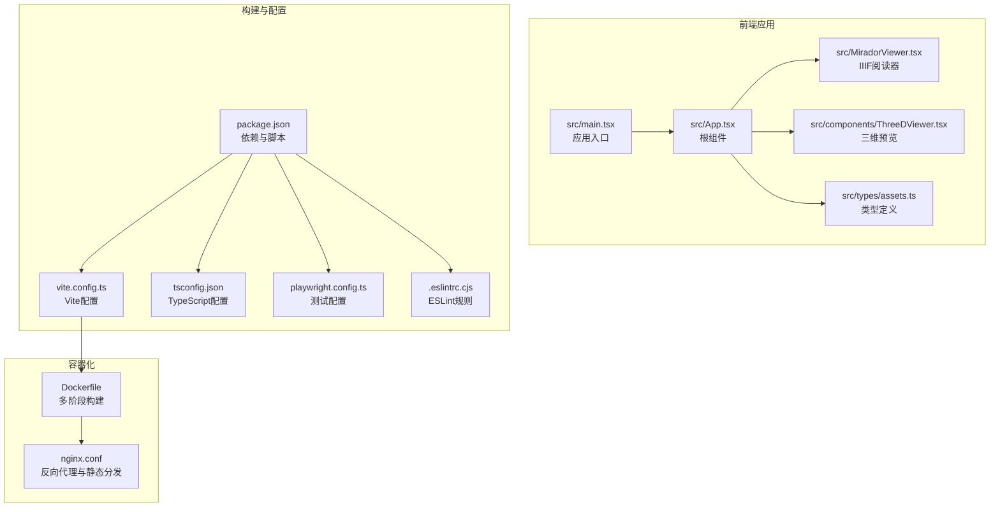

图表来源
- [main.tsx:1-11](file://frontend/src/main.tsx#L1-L11)
- [App.tsx:1-120](file://frontend/src/App.tsx#L1-L120)
- [MiradorViewer.tsx:1-60](file://frontend/src/MiradorViewer.tsx#L1-L60)
- [ThreeDViewer.tsx:1-40](file://frontend/src/components/ThreeDViewer.tsx#L1-L40)
- [assets.ts:1-60](file://frontend/src/types/assets.ts#L1-L60)
- [package.json:1-42](file://frontend/package.json#L1-L42)
- [vite.config.ts:1-42](file://frontend/vite.config.ts#L1-L42)
- [tsconfig.json:1-23](file://frontend/tsconfig.json#L1-L23)
- [playwright.config.ts:1-36](file://frontend/playwright.config.ts#L1-L36)
- [.eslintrc.cjs:1-21](file://frontend/.eslintrc.cjs#L1-L21)
- [Dockerfile:1-28](file://frontend/Dockerfile#L1-L28)
- [nginx.conf:1-33](file://frontend/nginx.conf#L1-L33)

章节来源
- [package.json:1-42](file://frontend/package.json#L1-L42)
- [vite.config.ts:1-42](file://frontend/vite.config.ts#L1-L42)
- [tsconfig.json:1-23](file://frontend/tsconfig.json#L1-L23)
- [Dockerfile:1-28](file://frontend/Dockerfile#L1-L28)
- [nginx.conf:1-33](file://frontend/nginx.conf#L1-L33)
- [playwright.config.ts:1-36](file://frontend/playwright.config.ts#L1-L36)
- [.eslintrc.cjs:1-21](file://frontend/.eslintrc.cjs#L1-L21)
- [main.tsx:1-11](file://frontend/src/main.tsx#L1-L11)
- [App.tsx:1-120](file://frontend/src/App.tsx#L1-L120)
- [MiradorViewer.tsx:1-60](file://frontend/src/MiradorViewer.tsx#L1-L60)
- [ThreeDViewer.tsx:1-40](file://frontend/src/components/ThreeDViewer.tsx#L1-L40)
- [assets.ts:1-60](file://frontend/src/types/assets.ts#L1-L60)

## 核心组件
- React 18：作为UI框架，负责组件化视图与状态管理；在入口文件中以StrictMode包裹，确保开发期发现潜在问题。
- Ant Design：提供丰富的UI组件与主题体系，广泛用于表格、表单、布局、消息提示等。
- Vite：作为构建工具与开发服务器，提供快速热更新与高效的打包输出。
- TypeScript：强类型保障，配合严格的编译选项与ESLint规则，提升代码质量与可维护性。
- Mirador：集成IIIF图像阅读器，支持大图浏览与AI交互面板。
- @google/model-viewer：三维模型Web预览，提供沉浸式交互体验。
- Playwright：端到端测试框架，覆盖菜单权限、资源目录、统一资源详情等关键场景。

章节来源
- [main.tsx:1-11](file://frontend/src/main.tsx#L1-L11)
- [App.tsx:1-120](file://frontend/src/App.tsx#L1-L120)
- [MiradorViewer.tsx:1-60](file://frontend/src/MiradorViewer.tsx#L1-L60)
- [ThreeDViewer.tsx:1-40](file://frontend/src/components/ThreeDViewer.tsx#L1-L40)
- [assets.ts:1-60](file://frontend/src/types/assets.ts#L1-L60)
- [package.json:13-26](file://frontend/package.json#L13-L26)
- [vite.config.ts:1-42](file://frontend/vite.config.ts#L1-L42)
- [tsconfig.json:1-23](file://frontend/tsconfig.json#L1-L23)
- [playwright.config.ts:1-36](file://frontend/playwright.config.ts#L1-L36)

## 架构总览
前端采用“浏览器直连后端API + 反向代理转发IIIF”的架构：
- 开发环境：Vite本地服务器，通过代理将/api、/auth、/iiif转发到后端与Cantaloupe。
- 生产环境：Nginx作为静态资源服务器与反向代理，将/api转发到后端，/iiif转发到Cantaloupe。
- 容器化：多阶段构建，首阶段安装依赖并构建，第二阶段用Nginx提供静态服务。

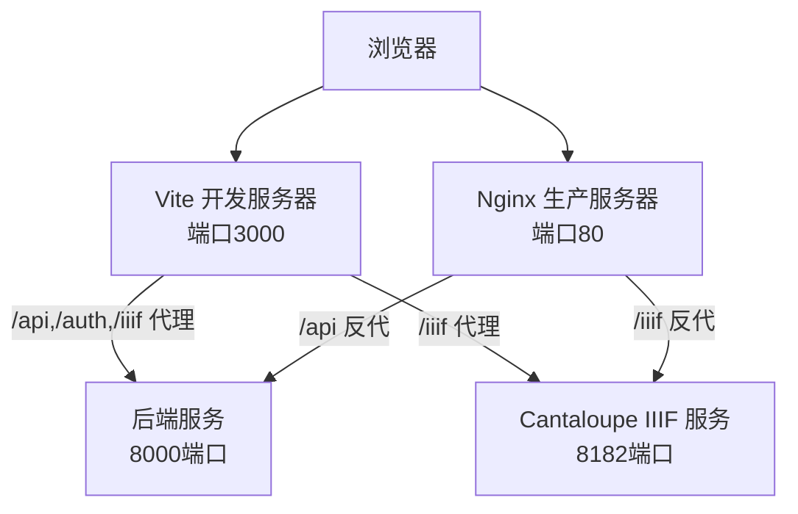

图表来源
- [vite.config.ts:22-40](file://frontend/vite.config.ts#L22-L40)
- [nginx.conf:10-31](file://frontend/nginx.conf#L10-L31)
- [Dockerfile:20-27](file://frontend/Dockerfile#L20-L27)

## 详细组件分析

### Vite 配置详解
- 插件：使用React插件以获得更快的HMR与TSX支持。
- 构建目标：ESNext，适配现代浏览器特性。
- 分包策略：手动拆分react-vendor、antd-vendor、mirador-vendor，优化缓存命中率与首屏加载。
- 构建警告阈值：增大chunkSizeWarningLimit，降低内存压力。
- Source Map：生产关闭，减少体积与泄露风险。
- 开发服务器：host开启，端口3000；代理/api、/auth、/iiif到后端与Cantaloupe，rewrite去除前缀，便于后端路由一致。

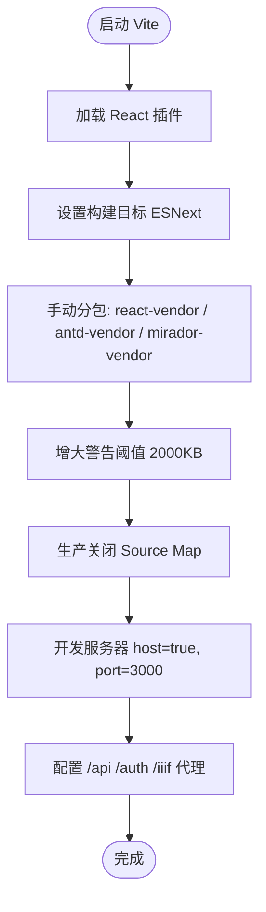

图表来源
- [vite.config.ts:5-41](file://frontend/vite.config.ts#L5-L41)

章节来源
- [vite.config.ts:1-42](file://frontend/vite.config.ts#L1-L42)

### TypeScript 配置详解
- 编译目标与模块：ES2020 + ESNext，配合Bundler解析器。
- 严格模式：开启严格检查，提升类型安全。
- JSX：使用react-jsx，结合React 18新特性。
- 类型声明：内置vite/client与playwright类型，避免全局污染。
- 包含范围：src、tests、vite.config.ts、playwright.config.ts。

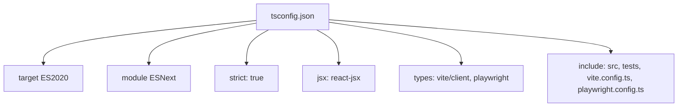

图表来源
- [tsconfig.json:2-18](file://frontend/tsconfig.json#L2-L18)

章节来源
- [tsconfig.json:1-23](file://frontend/tsconfig.json#L1-L23)

### 依赖管理与脚本
- 核心依赖：React 18、Ant Design、Mirador、@google/model-viewer、axios、three、exifr、utif等。
- 开发依赖：Vite、TypeScript、ESLint、Playwright、React相关插件与类型。
- 脚本命令：dev、build、lint、test、preview，分别对应开发、构建、代码检查、端到端测试与预览。

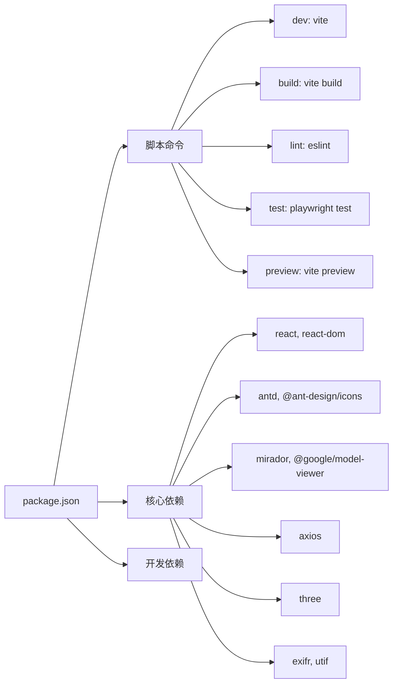

图表来源
- [package.json:6-40](file://frontend/package.json#L6-L40)

章节来源
- [package.json:1-42](file://frontend/package.json#L1-L42)

### 容器化与部署
- 多阶段构建：首阶段使用node:18-alpine，替换Alpine与NPM镜像源，安装依赖并构建；第二阶段使用nginx:alpine，复制dist与nginx.conf，暴露80端口。
- 内存优化：通过NODE_OPTIONS增大Node构建内存上限，缓解N100低内存环境下的OOM。
- 反向代理：Nginx将/api转发到后端8000，/iiif转发到Cantaloupe 8182，设置X-Forwarded-*头部，保证后端能正确识别来源与协议。

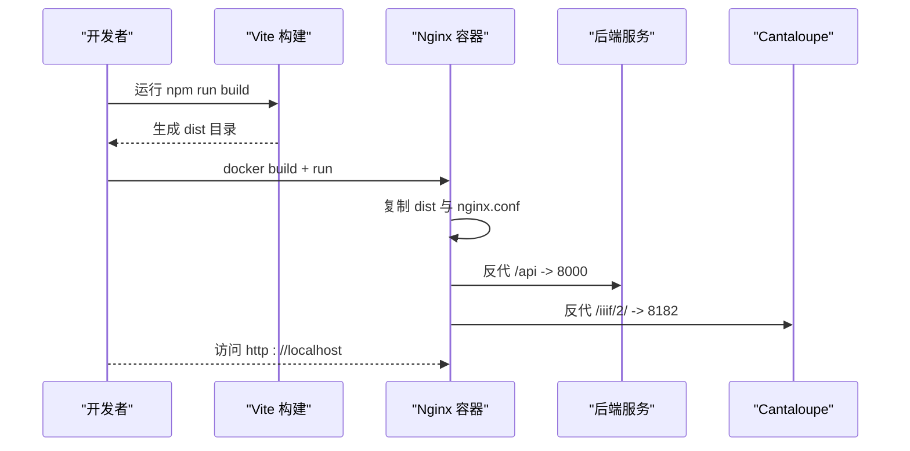

图表来源
- [Dockerfile:1-28](file://frontend/Dockerfile#L1-L28)
- [nginx.conf:1-33](file://frontend/nginx.conf#L1-L33)

章节来源
- [Dockerfile:1-28](file://frontend/Dockerfile#L1-L28)
- [nginx.conf:1-33](file://frontend/nginx.conf#L1-L33)

### 测试配置与最佳实践
- Playwright：支持多浏览器设备，自动启动本地开发服务器，HTML报告，CI下重用现有服务。
- 测试用例：覆盖仪表盘权限、统一资源目录、搜索、详情页等关键路径，模拟不同角色的可见菜单与数据过滤。
- ESLint：基于TypeScript ESLint与React Hooks规则，限制any使用与未使用变量，配合react-refresh规则。

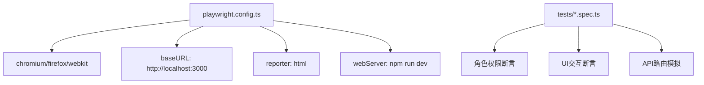

图表来源
- [playwright.config.ts:1-36](file://frontend/playwright.config.ts#L1-L36)
- [dashboard.spec.ts:1-120](file://frontend/tests/dashboard.spec.ts#L1-L120)

章节来源
- [playwright.config.ts:1-36](file://frontend/playwright.config.ts#L1-L36)
- [dashboard.spec.ts:1-120](file://frontend/tests/dashboard.spec.ts#L1-L120)

### 关键组件与数据流

#### 应用根组件与权限控制
- 根组件负责用户登录态、菜单可见性、权限判断与全局状态管理。
- 通过Axios默认头注入Authorization，实现与后端鉴权的一致性。
- 资源表格、申请车、统一资源目录等视图根据权限动态渲染。

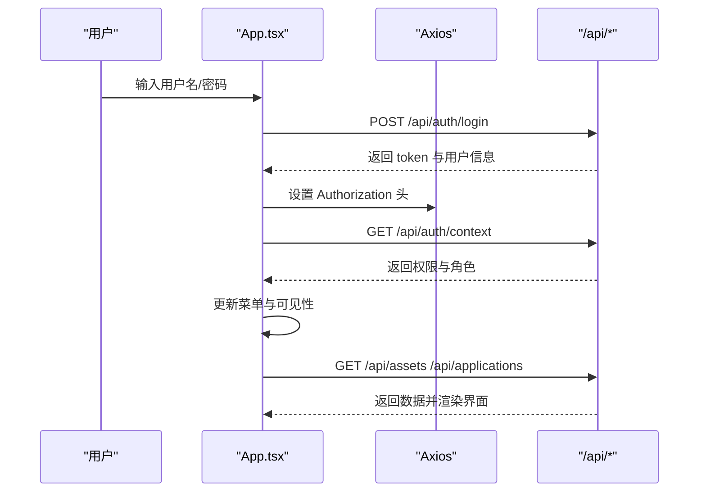

图表来源
- [App.tsx:140-205](file://frontend/src/App.tsx#L140-L205)
- [App.tsx:213-251](file://frontend/src/App.tsx#L213-L251)

章节来源
- [App.tsx:1-205](file://frontend/src/App.tsx#L1-L205)

#### IIIF 阅读器与AI交互
- MiradorViewer负责加载IIIF清单、注入鉴权头、统计加载阶段与进度。
- 支持将当前资源加入申请车，提供进度指示与错误处理。
- 与后端约定鉴权头仅对/api与/auth路径附加，避免泄露。

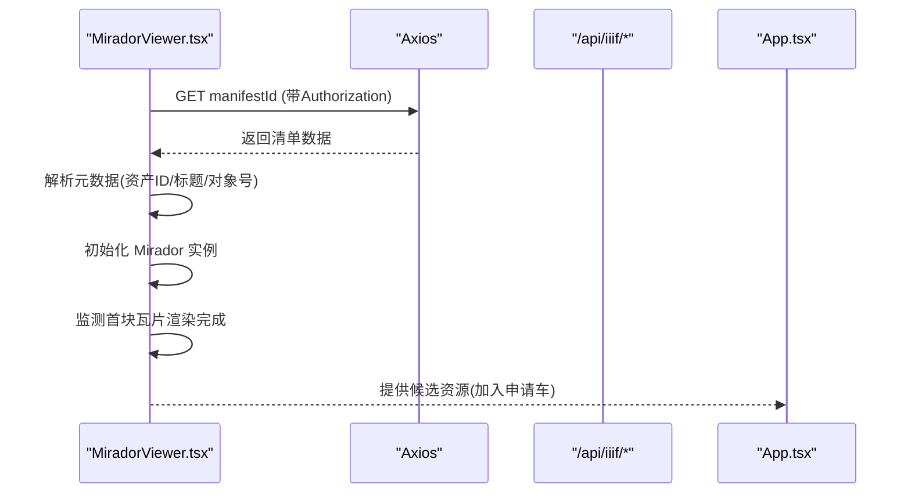

图表来源
- [MiradorViewer.tsx:98-197](file://frontend/src/MiradorViewer.tsx#L98-L197)
- [MiradorViewer.tsx:202-271](file://frontend/src/MiradorViewer.tsx#L202-L271)

章节来源
- [MiradorViewer.tsx:1-200](file://frontend/src/MiradorViewer.tsx#L1-L200)

#### 三维模型预览
- 使用@model-viewer进行WebGL预览，支持旋转、缩放、自动旋转等交互。
- 根据viewer.enabled与preview_url决定是否渲染预览区域与操作按钮。

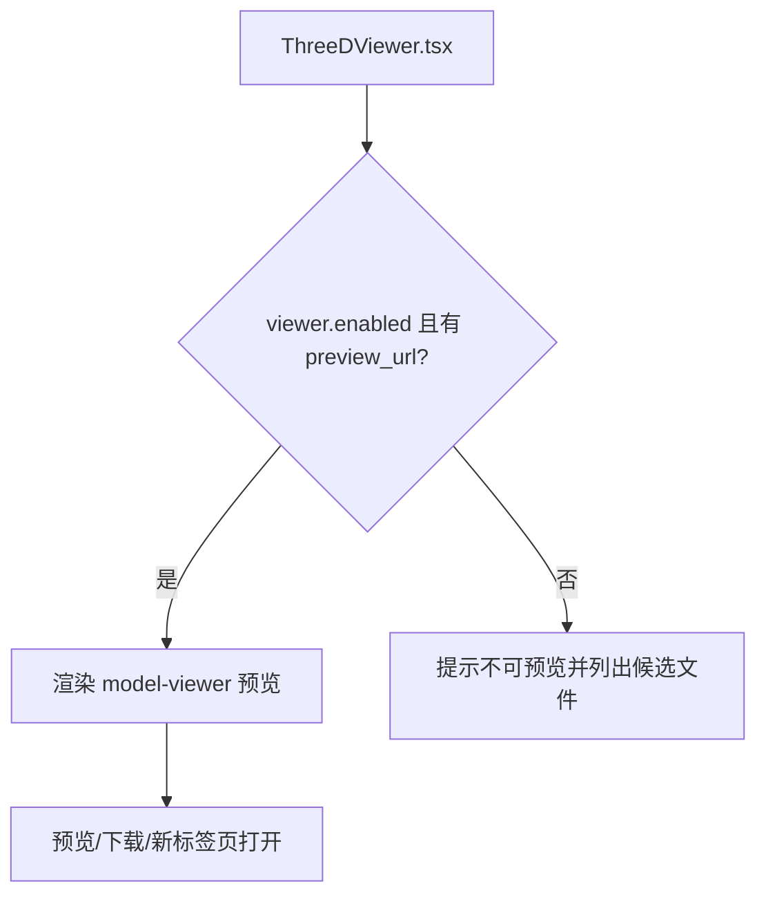

图表来源
- [ThreeDViewer.tsx:31-125](file://frontend/src/components/ThreeDViewer.tsx#L31-L125)

章节来源
- [ThreeDViewer.tsx:1-129](file://frontend/src/components/ThreeDViewer.tsx#L1-L129)

## 依赖关系分析
- 组件耦合：App.tsx作为顶层容器，向下传递权限与状态；MiradorViewer与ThreeDViewer作为独立视图组件，通过props与回调与父组件通信。
- 外部依赖：axios用于HTTP请求；Ant Design提供UI基础；Mirador与model-viewer分别承担IIIF与三维预览；TypeScript与ESLint保障类型与规范。
- 构建依赖：Vite负责开发与打包；Docker/Nginx负责生产部署。

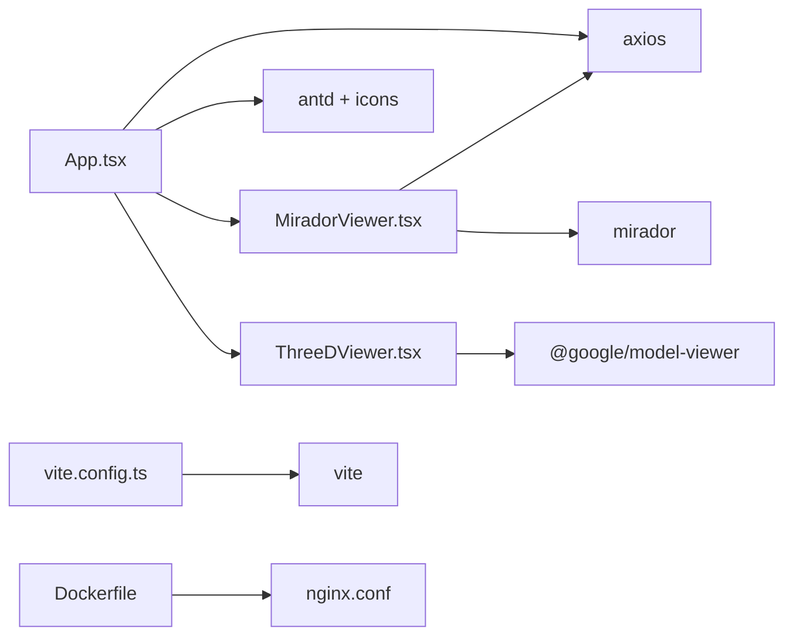

图表来源
- [App.tsx:1-120](file://frontend/src/App.tsx#L1-L120)
- [MiradorViewer.tsx:1-60](file://frontend/src/MiradorViewer.tsx#L1-L60)
- [ThreeDViewer.tsx:1-40](file://frontend/src/components/ThreeDViewer.tsx#L1-L40)
- [vite.config.ts:1-42](file://frontend/vite.config.ts#L1-L42)
- [Dockerfile:1-28](file://frontend/Dockerfile#L1-L28)
- [nginx.conf:1-33](file://frontend/nginx.conf#L1-L33)

章节来源
- [App.tsx:1-120](file://frontend/src/App.tsx#L1-L120)
- [MiradorViewer.tsx:1-60](file://frontend/src/MiradorViewer.tsx#L1-L60)
- [ThreeDViewer.tsx:1-40](file://frontend/src/components/ThreeDViewer.tsx#L1-L40)
- [vite.config.ts:1-42](file://frontend/vite.config.ts#L1-L42)
- [Dockerfile:1-28](file://frontend/Dockerfile#L1-L28)
- [nginx.conf:1-33](file://frontend/nginx.conf#L1-L33)

## 性能考量
- 构建优化：手动分包策略减少vendor包体积，提升缓存命中；ESNext目标充分利用现代浏览器特性。
- 内存与稳定性：Nginx阶段构建时复制dist与nginx.conf，避免重复安装；Node构建阶段通过NODE_OPTIONS提升内存上限，缓解低内存环境下的OOM。
- 开发体验：Vite代理/api、/auth、/iiif，减少跨域与路径复杂度；预览阶段进度与统计信息帮助定位性能瓶颈。
- 类型与规范：TypeScript严格模式与ESLint规则减少运行时错误与冗余代码。

章节来源
- [vite.config.ts:7-21](file://frontend/vite.config.ts#L7-L21)
- [Dockerfile:14-18](file://frontend/Dockerfile#L14-L18)
- [MiradorViewer.tsx:156-197](file://frontend/src/MiradorViewer.tsx#L156-L197)

## 故障排查指南
- 代理不通：确认Vite代理配置与后端端口一致；检查/api、/auth、/iiif路径是否匹配。
- 鉴权失败：确认localStorage中存在token，且Axios默认头已注入；检查后端鉴权接口返回与权限范围。
- 三维预览不可用：检查viewer.enabled与preview_url；确认Cantaloupe服务可达且端口正确。
- 构建失败：查看Dockerfile中镜像源替换与legacy-peer-deps参数；确认Node内存上限设置是否足够。
- 测试失败：使用Playwright HTML报告定位问题；在CI环境下注意webServer复用与baseURL配置。

章节来源
- [vite.config.ts:22-40](file://frontend/vite.config.ts#L22-L40)
- [App.tsx:140-148](file://frontend/src/App.tsx#L140-L148)
- [ThreeDViewer.tsx:31-125](file://frontend/src/components/ThreeDViewer.tsx#L31-L125)
- [Dockerfile:5-18](file://frontend/Dockerfile#L5-L18)
- [playwright.config.ts:30-35](file://frontend/playwright.config.ts#L30-L35)

## 结论
本前端工程以React 18为核心，结合Ant Design、Mirador、@google/model-viewer与TypeScript，形成现代化、可扩展的原型前端体系。通过Vite的高效构建与代理、严格的TypeScript配置、完善的Playwright测试与多阶段Docker/Nginx部署，实现了开发与生产的高一致性与可维护性。建议在后续迭代中持续完善类型定义、优化分包策略与缓存策略，并引入更多自动化测试场景。

## 附录
- 开发环境：npm run dev 启动Vite，访问 http://localhost:3000
- 生产构建：npm run build 生成dist，配合Dockerfile与nginx.conf部署
- 代码检查：npm run lint
- 端到端测试：npm run test，支持多浏览器与HTML报告