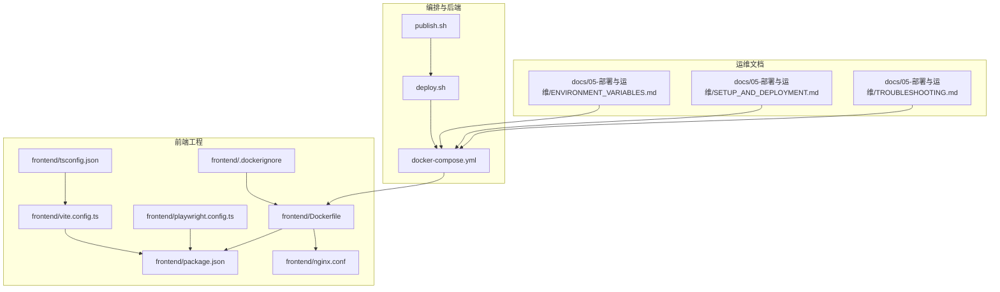
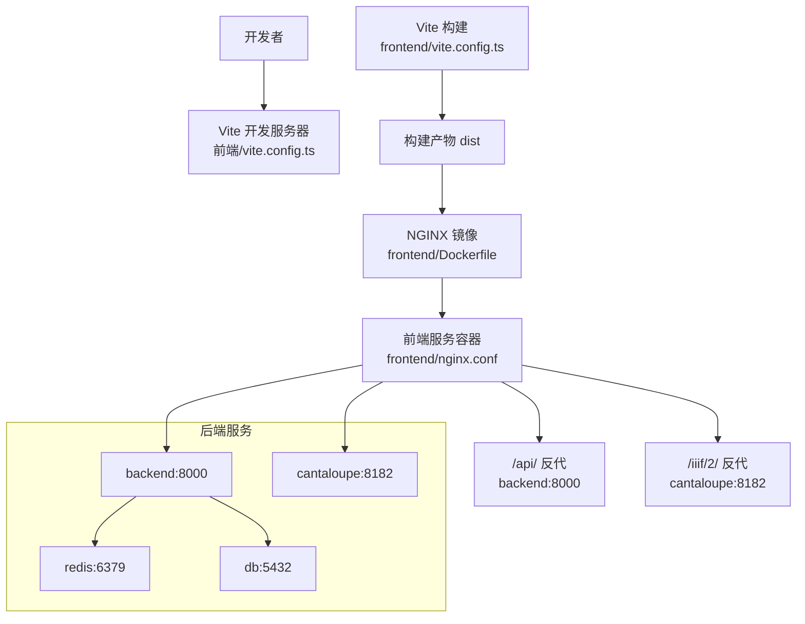
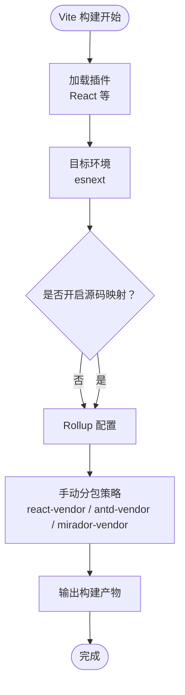
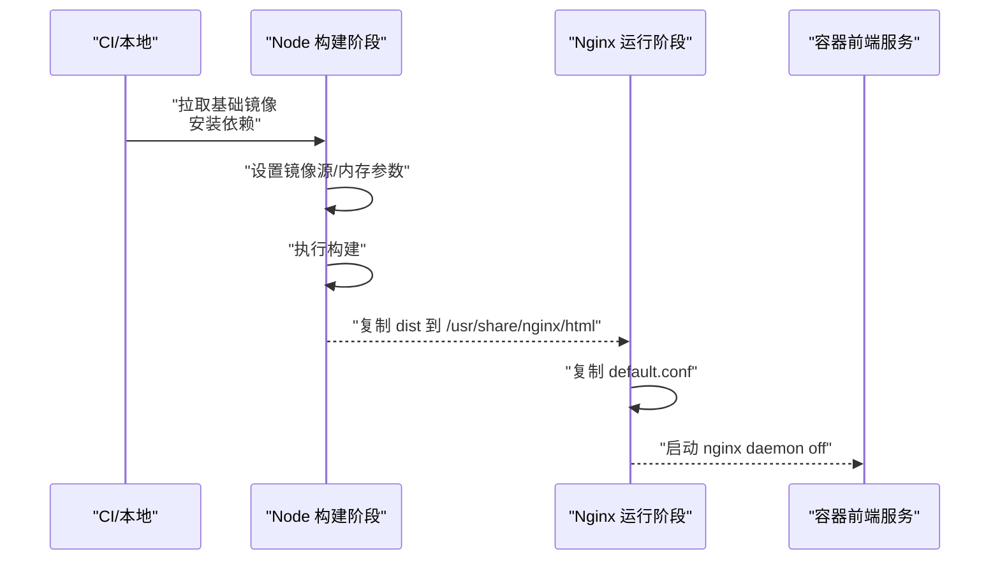
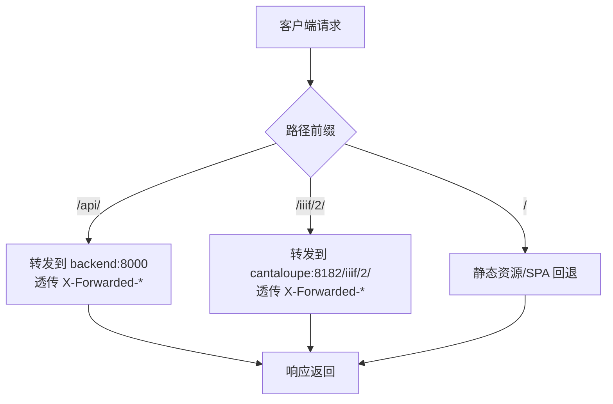
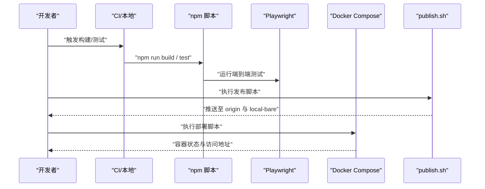
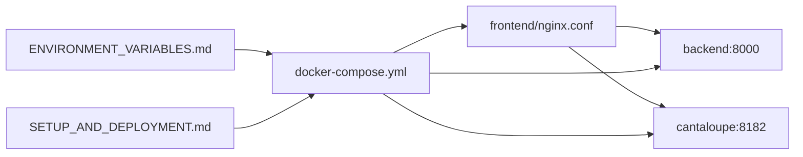

# 构建与部署

<cite>
**本文引用的文件**
- [frontend/vite.config.ts](file://frontend/vite.config.ts)
- [frontend/Dockerfile](file://frontend/Dockerfile)
- [frontend/nginx.conf](file://frontend/nginx.conf)
- [frontend/package.json](file://frontend/package.json)
- [frontend/playwright.config.ts](file://frontend/playwright.config.ts)
- [frontend/tsconfig.json](file://frontend/tsconfig.json)
- [frontend/.dockerignore](file://frontend/.dockerignore)
- [docker-compose.yml](file://docker-compose.yml)
- [deploy.sh](file://deploy.sh)
- [publish.sh](file://publish.sh)
- [docs/05-部署与运维/ENVIRONMENT_VARIABLES.md](file://docs/05-部署与运维/ENVIRONMENT_VARIABLES.md)
- [docs/05-部署与运维/SETUP_AND_DEPLOYMENT.md](file://docs/05-部署与运维/SETUP_AND_DEPLOYMENT.md)
- [docs/05-部署与运维/TROUBLESHOOTING.md](file://docs/05-部署与运维/TROUBLESHOOTING.md)
</cite>

## 目录
1. [简介](#简介)
2. [项目结构](#项目结构)
3. [核心组件](#核心组件)
4. [架构总览](#架构总览)
5. [详细组件分析](#详细组件分析)
6. [依赖分析](#依赖分析)
7. [性能考虑](#性能考虑)
8. [故障排除指南](#故障排除指南)
9. [结论](#结论)
10. [附录](#附录)

## 简介
本文件面向MDAMS原型项目的前端构建与部署，围绕Vite构建配置、Docker容器化、Nginx反向代理、环境变量管理、CI/CD集成、性能优化、监控与日志、故障排除与回滚等主题，提供系统化说明与实操指引。文档严格基于仓库现有配置文件进行分析与总结，确保读者能够快速理解并落地实施。

## 项目结构
前端相关构建与部署涉及的关键文件分布如下：
- 构建工具与配置：Vite、TypeScript、ESLint、Playwright
- 容器化：前端Dockerfile、Nginx配置、Compose编排
- 部署脚本：一键部署与发布脚本
- 环境变量与部署文档：环境变量说明、部署与运维文档

图表来源
- [frontend/vite.config.ts:1-42](file://frontend/vite.config.ts#L1-L42)
- [frontend/package.json:1-42](file://frontend/package.json#L1-L42)
- [frontend/tsconfig.json:1-23](file://frontend/tsconfig.json#L1-L23)
- [frontend/playwright.config.ts:1-36](file://frontend/playwright.config.ts#L1-L36)
- [frontend/Dockerfile:1-28](file://frontend/Dockerfile#L1-L28)
- [frontend/nginx.conf:1-33](file://frontend/nginx.conf#L1-L33)
- [frontend/.dockerignore:1-5](file://frontend/.dockerignore#L1-L5)
- [docker-compose.yml:1-131](file://docker-compose.yml#L1-L131)
- [deploy.sh:1-38](file://deploy.sh#L1-L38)
- [publish.sh:1-19](file://publish.sh#L1-L19)
- [docs/05-部署与运维/ENVIRONMENT_VARIABLES.md:1-86](file://docs/05-部署与运维/ENVIRONMENT_VARIABLES.md#L1-L86)
- [docs/05-部署与运维/SETUP_AND_DEPLOYMENT.md:1-253](file://docs/05-部署与运维/SETUP_AND_DEPLOYMENT.md#L1-L253)
- [docs/05-部署与运维/TROUBLESHOOTING.md:1-242](file://docs/05-部署与运维/TROUBLESHOOTING.md#L1-L242)

章节来源
- [frontend/vite.config.ts:1-42](file://frontend/vite.config.ts#L1-L42)
- [frontend/Dockerfile:1-28](file://frontend/Dockerfile#L1-L28)
- [frontend/nginx.conf:1-33](file://frontend/nginx.conf#L1-L33)
- [frontend/package.json:1-42](file://frontend/package.json#L1-L42)
- [frontend/playwright.config.ts:1-36](file://frontend/playwright.config.ts#L1-L36)
- [frontend/tsconfig.json:1-23](file://frontend/tsconfig.json#L1-L23)
- [frontend/.dockerignore:1-5](file://frontend/.dockerignore#L1-L5)
- [docker-compose.yml:1-131](file://docker-compose.yml#L1-L131)
- [deploy.sh:1-38](file://deploy.sh#L1-L38)
- [publish.sh:1-19](file://publish.sh#L1-L19)
- [docs/05-部署与运维/ENVIRONMENT_VARIABLES.md:1-86](file://docs/05-部署与运维/ENVIRONMENT_VARIABLES.md#L1-L86)
- [docs/05-部署与运维/SETUP_AND_DEPLOYMENT.md:1-253](file://docs/05-部署与运维/SETUP_AND_DEPLOYMENT.md#L1-L253)
- [docs/05-部署与运维/TROUBLESHOOTING.md:1-242](file://docs/05-部署与运维/TROUBLESHOOTING.md#L1-L242)

## 核心组件
- Vite构建配置：定义插件、目标环境、产物体积警告阈值、源码映射开关、Rollup分包策略、开发服务器与代理规则。
- Dockerfile（前端）：双阶段构建（Node构建+NGINX运行）、镜像源优化、内存限制、构建产物复制与Nginx配置注入。
- Nginx配置：静态资源服务、SPA回退、API与IIIF反向代理、请求头透传与路径前缀设置。
- 编排与环境：docker-compose集中声明服务、端口、环境变量、卷挂载；部署脚本自动化启动；发布脚本推送分支与裸仓。
- 测试与类型：Playwright端到端测试配置；TypeScript严格模式与模块解析策略；ESLint规则与报告策略。

章节来源
- [frontend/vite.config.ts:1-42](file://frontend/vite.config.ts#L1-L42)
- [frontend/Dockerfile:1-28](file://frontend/Dockerfile#L1-L28)
- [frontend/nginx.conf:1-33](file://frontend/nginx.conf#L1-L33)
- [frontend/package.json:1-42](file://frontend/package.json#L1-L42)
- [frontend/playwright.config.ts:1-36](file://frontend/playwright.config.ts#L1-L36)
- [frontend/tsconfig.json:1-23](file://frontend/tsconfig.json#L1-L23)
- [docker-compose.yml:1-131](file://docker-compose.yml#L1-L131)
- [deploy.sh:1-38](file://deploy.sh#L1-L38)
- [publish.sh:1-19](file://publish.sh#L1-L19)

## 架构总览
前端构建与部署采用“Vite构建 + Docker镜像 + Nginx反向代理”的组合，配合docker-compose统一编排后端服务（FastAPI、Redis、PostgreSQL、Cantaloupe），形成完整的开发与生产部署闭环。

图表来源
- [frontend/vite.config.ts:1-42](file://frontend/vite.config.ts#L1-L42)
- [frontend/Dockerfile:1-28](file://frontend/Dockerfile#L1-L28)
- [frontend/nginx.conf:1-33](file://frontend/nginx.conf#L1-L33)
- [docker-compose.yml:1-131](file://docker-compose.yml#L1-L131)

## 详细组件分析

### Vite 构建配置
- 插件与目标：启用React插件，目标为现代浏览器特性集，适配低内存设备。
- 体积与源码映射：提升产物体积警告阈值，生产构建关闭源码映射以减小体积。
- 代码分割：通过Rollup手动分包策略，将React、Ant Design、Mirador等第三方库拆分为独立vendor块，提升缓存命中率。
- 开发服务器：开放主机访问、端口绑定、API/Auth/IIIF三类路径代理至后端与Cantaloupe，便于联调。

图表来源
- [frontend/vite.config.ts:1-42](file://frontend/vite.config.ts#L1-L42)

章节来源
- [frontend/vite.config.ts:1-42](file://frontend/vite.config.ts#L1-L42)

### Dockerfile（前端镜像）
- 双阶段构建：第一阶段使用Alpine Node进行依赖安装与构建，第二阶段使用Alpine Nginx提供运行时。
- 镜像源优化：替换Alpine与NPM镜像源，加速依赖下载。
- 内存与类型检查：设置Node最大堆大小，减少构建期类型检查开销。
- 运行时：将构建产物复制到Nginx默认站点目录，并注入Nginx配置文件。

图表来源
- [frontend/Dockerfile:1-28](file://frontend/Dockerfile#L1-L28)
- [frontend/nginx.conf:1-33](file://frontend/nginx.conf#L1-L33)

章节来源
- [frontend/Dockerfile:1-28](file://frontend/Dockerfile#L1-L28)
- [frontend/nginx.conf:1-33](file://frontend/nginx.conf#L1-L33)

### Nginx 反向代理配置
- 静态资源与SPA回退：根路径提供静态文件，使用try_files回退至index.html，支持前端路由。
- API反向代理：/api/前缀转发至后端服务，透传必要请求头，设置X-Forwarded-Prefix以便后端生成正确URL。
- IIIF反向代理：/iiif/2/前缀转发至Cantaloupe，同样透传请求头并设置X-Forwarded-Prefix。
- 安全与兼容：设置client_max_body_size为0以允许大文件上传；统一使用X-Forwarded-*头保证后端可观测性。

图表来源
- [frontend/nginx.conf:1-33](file://frontend/nginx.conf#L1-L33)

章节来源
- [frontend/nginx.conf:1-33](file://frontend/nginx.conf#L1-L33)

### 环境变量管理
- 数据库与缓存：PostgreSQL用户/密码/库名、连接串、Redis连接串。
- 浏览器可访问地址：API_PUBLIC_URL、CANTALOUPE_PUBLIC_URL，用于后端生成公开链接与前端代理。
- 文件路径：HOST_MUSEUM_PATH（宿主机）、UPLOAD_DIR（容器内）。
- 图像处理：VIPS_DISC_THRESHOLD、VIPS_CONCURRENCY、JAVA_OPTS（Cantaloupe JVM）。
- 端口：FRONTEND_PORT、BACKEND_PORT、DB_PORT、REDIS_PORT、CANTALOUPE_PORT。
- 使用建议：优先修改.env；浏览器访问以3000端口代理为准；不改动容器内固定路径。

章节来源
- [docs/05-部署与运维/ENVIRONMENT_VARIABLES.md:1-86](file://docs/05-部署与运维/ENVIRONMENT_VARIABLES.md#L1-L86)
- [docker-compose.yml:1-131](file://docker-compose.yml#L1-L131)
- [docs/05-部署与运维/SETUP_AND_DEPLOYMENT.md:1-253](file://docs/05-部署与运维/SETUP_AND_DEPLOYMENT.md#L1-L253)

### CI/CD 集成
- 自动化构建与测试：前端脚本定义了dev/build/lint/test命令；Playwright在CI环境下启用重试与并行策略。
- 发布流程：发布脚本将当前分支推送到GitHub与本地裸仓，便于后续自动化部署。
- 一键部署：部署脚本检查Docker、创建数据目录、以分离模式构建并启动服务，等待初始化后输出服务状态与访问地址。

图表来源
- [frontend/package.json:1-42](file://frontend/package.json#L1-L42)
- [frontend/playwright.config.ts:1-36](file://frontend/playwright.config.ts#L1-L36)
- [publish.sh:1-19](file://publish.sh#L1-L19)
- [deploy.sh:1-38](file://deploy.sh#L1-L38)

章节来源
- [frontend/package.json:1-42](file://frontend/package.json#L1-L42)
- [frontend/playwright.config.ts:1-36](file://frontend/playwright.config.ts#L1-L36)
- [publish.sh:1-19](file://publish.sh#L1-L19)
- [deploy.sh:1-38](file://deploy.sh#L1-L38)

### 类型与测试配置
- TypeScript：严格模式、ESNext模块解析、Bundler解析器、跳过库类型检查、JSX策略等，确保类型安全与构建效率。
- Playwright：多浏览器项目、重试策略、首次失败追踪、本地WebServer自动启动，便于CI与本地联调。

章节来源
- [frontend/tsconfig.json:1-23](file://frontend/tsconfig.json#L1-L23)
- [frontend/playwright.config.ts:1-36](file://frontend/playwright.config.ts#L1-L36)

## 依赖分析
- 组件耦合：前端Nginx配置与后端服务（FastAPI、Cantaloupe）通过反向代理耦合；docker-compose统一编排，降低跨服务协调成本。
- 外部依赖：Node/NPM镜像源、Alpine APK镜像源、PostgreSQL/Redis/Cantaloupe官方镜像。
- 环境变量契约：API_PUBLIC_URL与CANTALOUPE_PUBLIC_URL决定后端生成链接与前端代理路径，必须与Nginx前缀保持一致。

图表来源
- [frontend/nginx.conf:1-33](file://frontend/nginx.conf#L1-L33)
- [docker-compose.yml:1-131](file://docker-compose.yml#L1-L131)
- [docs/05-部署与运维/ENVIRONMENT_VARIABLES.md:1-86](file://docs/05-部署与运维/ENVIRONMENT_VARIABLES.md#L1-L86)
- [docs/05-部署与运维/SETUP_AND_DEPLOYMENT.md:1-253](file://docs/05-部署与运维/SETUP_AND_DEPLOYMENT.md#L1-L253)

章节来源
- [frontend/nginx.conf:1-33](file://frontend/nginx.conf#L1-L33)
- [docker-compose.yml:1-131](file://docker-compose.yml#L1-L131)
- [docs/05-部署与运维/ENVIRONMENT_VARIABLES.md:1-86](file://docs/05-部署与运维/ENVIRONMENT_VARIABLES.md#L1-L86)
- [docs/05-部署与运维/SETUP_AND_DEPLOYMENT.md:1-253](file://docs/05-部署与运维/SETUP_AND_DEPLOYMENT.md#L1-L253)

## 性能考虑
- 代码分割：通过手动分包策略将核心第三方库拆分为独立chunk，提升浏览器缓存命中率与首屏加载速度。
- 资源体积：提升产物体积警告阈值，避免在大型chunk上产生噪音；生产构建关闭源码映射，减少产物体积。
- 构建内存：在构建阶段设置Node最大堆大小，缓解低内存设备上的OOM风险。
- 镜像源优化：替换Alpine与NPM镜像源，缩短依赖下载时间，提高CI稳定性。
- 反向代理：统一通过Nginx代理API与IIIF，减少跨域与直接端口暴露带来的额外握手成本。

章节来源
- [frontend/vite.config.ts:1-42](file://frontend/vite.config.ts#L1-L42)
- [frontend/Dockerfile:1-28](file://frontend/Dockerfile#L1-L28)
- [frontend/nginx.conf:1-33](file://frontend/nginx.conf#L1-L33)

## 故障排除指南
- 启动类问题：优先检查前端容器状态、端口占用、compose服务状态；查看对应容器日志定位异常。
- 后端健康与就绪：访问健康检查与就绪检查端点，核对数据库与Redis连接串。
- 数据库连接：确认数据库容器运行、凭据与连接串、主机名是否为db。
- Redis与Worker：确认Redis服务、连接串、Worker日志。
- 资源与挂载：确认宿主机目录存在且可写、映射路径正确、上传目录可访问。
- IIIF与Mirador：确认CANTALOUPE_PUBLIC_URL、Nginx /iiif/2/代理、Cantaloupe容器状态。
- 登录与权限：确认用户存在、默认密码、Token有效性、权限上下文刷新。
- 三维与申请导出：确认用户角色与权限、资源可见性、申请车内容与审批流程。

章节来源
- [docs/05-部署与运维/TROUBLESHOOTING.md:1-242](file://docs/05-部署与运维/TROUBLESHOOTING.md#L1-L242)
- [frontend/nginx.conf:1-33](file://frontend/nginx.conf#L1-L33)
- [docker-compose.yml:1-131](file://docker-compose.yml#L1-L131)

## 结论
本方案以Vite为核心构建工具，结合Docker与Nginx实现稳定的前端交付与代理；通过docker-compose统一编排后端服务，辅以明确的环境变量契约与部署文档，形成可重复、可扩展的多环境部署基线。配合CI脚本与端到端测试，可在保障质量的同时提升交付效率。

## 附录
- 多环境最佳实践
  - 开发环境：使用Vite开发服务器与代理，快速迭代；仅调整.env与少量编排参数。
  - 测试环境：复用docker-compose，设置独立测试数据库连接串；CI中启用重试与并行测试。
  - 生产环境：使用前端镜像与Nginx，统一通过反向代理暴露API与IIIF；严格控制镜像源与网络出口。
- 安全考虑
  - 避免直接暴露后端与Cantaloupe端口，统一由Nginx代理并设置X-Forwarded-*头。
  - 控制镜像源可信度，必要时在私有镜像仓库中缓存基础镜像。
  - 限制容器资源配额，避免资源争用影响整体稳定性。
- 回滚策略
  - 通过版本化的镜像标签与Compose编排，快速切换到上一个稳定版本。
  - 在CI中保留最近几个版本的镜像，便于一键回滚。
  - 对于配置变更，优先通过环境变量回滚，减少对镜像的依赖。