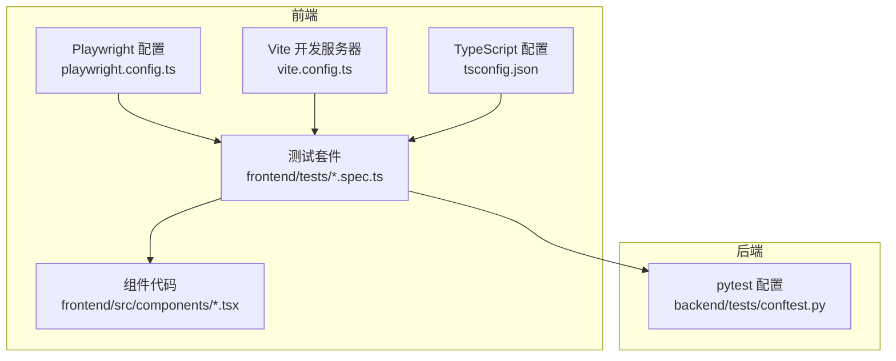
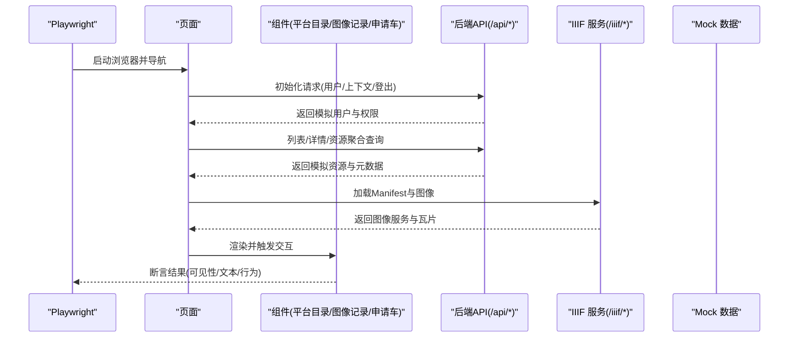
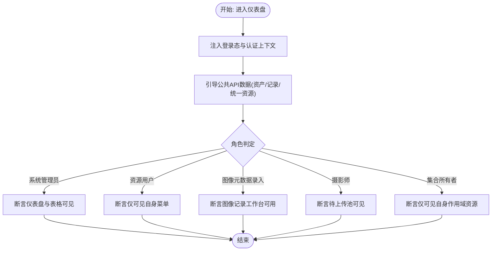
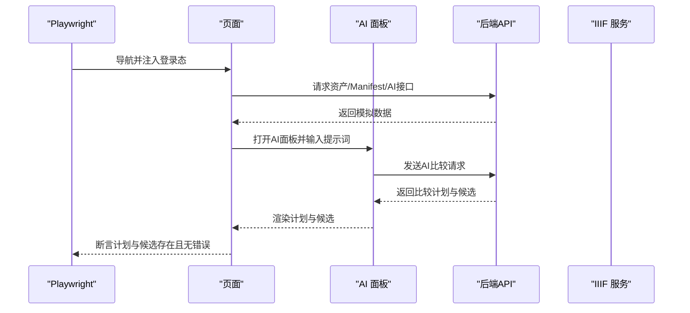
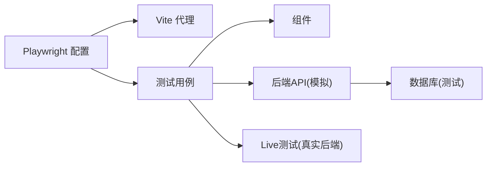

# 测试策略

<cite>
**本文引用的文件**
- [playwright.config.ts](file://frontend/playwright.config.ts)
- [package.json](file://frontend/package.json)
- [vite.config.ts](file://frontend/vite.config.ts)
- [tsconfig.json](file://frontend/tsconfig.json)
- [dashboard.spec.ts](file://frontend/tests/dashboard.spec.ts)
- [mirador-ai.spec.ts](file://frontend/tests/mirador-ai.spec.ts)
- [mirador-ai-live.spec.ts](file://frontend/tests/mirador-ai-live.spec.ts)
- [ApplicationCart.tsx](file://frontend/src/components/ApplicationCart.tsx)
- [ImageRecordDetail.tsx](file://frontend/src/components/ImageRecordDetail.tsx)
- [PlatformDirectory.tsx](file://frontend/src/components/PlatformDirectory.tsx)
- [TESTING_STRATEGY.md](file://docs/01-总览/TESTING_STRATEGY.md)
- [conftest.py](file://backend/tests/conftest.py)
</cite>

## 目录
1. [引言](#引言)
2. [项目结构](#项目结构)
3. [核心组件](#核心组件)
4. [架构总览](#架构总览)
5. [详细组件分析](#详细组件分析)
6. [依赖分析](#依赖分析)
7. [性能考虑](#性能考虑)
8. [故障排查指南](#故障排查指南)
9. [结论](#结论)
10. [附录](#附录)

## 引言
本文件面向MDAMS原型项目的前端测试策略，系统化阐述测试金字塔与分层策略（单元测试、集成测试、端到端测试），并结合仓库中现有的Playwright测试配置与用例，给出组件测试方法、API测试策略、覆盖率与报告、持续集成中的执行方式、最佳实践与调试技巧。文档同时强调以“问题尽早暴露”为核心原则，确保新功能至少补一个契约或集成测试，缺陷修复必须补回归测试。

## 项目结构
前端测试位于frontend/tests目录，采用Playwright进行端到端测试；Playwright配置集中于frontend/playwright.config.ts；Vite开发服务器代理/api、/auth、/iiif到后端；TypeScript配置启用Playwright类型支持；测试策略文档位于docs/01-总览/TESTING_STRATEGY.md，明确当前分层与推荐执行顺序。

图表来源
- [playwright.config.ts:1-36](file://frontend/playwright.config.ts#L1-L36)
- [vite.config.ts:1-42](file://frontend/vite.config.ts#L1-L42)
- [tsconfig.json:1-23](file://frontend/tsconfig.json#L1-L23)
- [conftest.py:1-112](file://backend/tests/conftest.py#L1-L112)

章节来源
- [playwright.config.ts:1-36](file://frontend/playwright.config.ts#L1-L36)
- [vite.config.ts:1-42](file://frontend/vite.config.ts#L1-L42)
- [tsconfig.json:1-23](file://frontend/tsconfig.json#L1-L23)
- [TESTING_STRATEGY.md:1-192](file://docs/01-总览/TESTING_STRATEGY.md#L1-L192)

## 核心组件
- Playwright测试框架与配置：负责端到端回归、多浏览器项目、自动WebServer启动、重试与追踪。
- Vite开发服务器与代理：本地开发时将/api、/auth、/iiif转发至后端，便于测试访问真实接口。
- TypeScript类型：启用Playwright类型，提升测试脚本的类型安全。
- 组件测试：通过Playwright对关键UI组件进行交互验证（如平台目录、图像记录详情、申请车）。
- API测试策略：通过page.route拦截后端API，注入模拟数据，覆盖不同角色与场景。

章节来源
- [playwright.config.ts:1-36](file://frontend/playwright.config.ts#L1-L36)
- [vite.config.ts:22-41](file://frontend/vite.config.ts#L22-L41)
- [tsconfig.json:18-18](file://frontend/tsconfig.json#L18-L18)
- [dashboard.spec.ts:291-311](file://frontend/tests/dashboard.spec.ts#L291-L311)
- [mirador-ai.spec.ts:108-237](file://frontend/tests/mirador-ai.spec.ts#L108-L237)

## 架构总览
下图展示了前端测试从Playwright到组件再到后端API的整体调用链，以及测试数据注入的关键节点。

图表来源
- [dashboard.spec.ts:291-311](file://frontend/tests/dashboard.spec.ts#L291-L311)
- [dashboard.spec.ts:313-657](file://frontend/tests/dashboard.spec.ts#L313-L657)
- [mirador-ai.spec.ts:108-237](file://frontend/tests/mirador-ai.spec.ts#L108-L237)
- [vite.config.ts:25-39](file://frontend/vite.config.ts#L25-L39)

## 详细组件分析

### Playwright配置与运行
- 测试目录与并行：testDir指向tests，fullyParallel开启并行，CI环境下启用forbidOnly与重试。
- 报告与追踪：HTML报告，首次重试时开启trace，便于定位失败原因。
- 多浏览器项目：chromium、firefox、webkit三项目标，覆盖桌面端主流浏览器。
- WebServer：本地开发命令启动Vite，端口3000，复用已有进程避免CI重复启动。

章节来源
- [playwright.config.ts:3-36](file://frontend/playwright.config.ts#L3-L36)
- [package.json:6-12](file://frontend/package.json#L6-L12)

### Dashboard权限与角色回归
- 登录态注入：通过localStorage注入令牌，拦截用户列表、认证上下文与登出接口，模拟不同角色。
- 公共API引导：统一注入资产、图像记录、统一资源聚合等数据，按角色过滤可见项。
- 场景覆盖：系统管理员仪表盘、菜单可见性、统一平台目录、搜索、详情页、不同角色可见范围、摄影师待上传池、集合所有者作用域等。

图表来源
- [dashboard.spec.ts:291-311](file://frontend/tests/dashboard.spec.ts#L291-L311)
- [dashboard.spec.ts:313-657](file://frontend/tests/dashboard.spec.ts#L313-L657)
- [dashboard.spec.ts:659-762](file://frontend/tests/dashboard.spec.ts#L659-L762)

章节来源
- [dashboard.spec.ts:1-764](file://frontend/tests/dashboard.spec.ts#L1-L764)

### Mirador AI面板与比较规划
- 登录态与数据注入：与Dashboard类似，注入用户、资产、IIIF Manifest与AI比较接口响应。
- 行为验证：打开AI面板、发送提示词、展示候选比较、确认后打开比较视图，断言无错误状态。
- Live模式：通过环境变量开关，连接真实后端与AI服务，验证端到端链路。

图表来源
- [mirador-ai.spec.ts:108-237](file://frontend/tests/mirador-ai.spec.ts#L108-L237)
- [mirador-ai-live.spec.ts:6-55](file://frontend/tests/mirador-ai-live.spec.ts#L6-L55)

章节来源
- [mirador-ai.spec.ts:1-267](file://frontend/tests/mirador-ai.spec.ts#L1-L267)
- [mirador-ai-live.spec.ts:1-56](file://frontend/tests/mirador-ai-live.spec.ts#L1-L56)

### 组件测试方法与要点
- 平台目录组件PlatformDirectory：包含搜索、筛选、加载、表格渲染、预览/详情按钮等交互；测试通过data-testid选择器定位元素，断言可见性与行为。
- 图像记录详情组件ImageRecordDetail：包含状态标签、描述信息、上传与匹配流程、确认绑定/替换等；测试关注必填字段提示、上传分析卡片、警告与重复检测提示。
- 申请车组件ApplicationCart：包含表单校验、列表渲染、备注编辑、移除与提交等；测试关注必填项校验、提交后表单重置。

章节来源
- [PlatformDirectory.tsx:155-270](file://frontend/src/components/PlatformDirectory.tsx#L155-L270)
- [ImageRecordDetail.tsx:42-258](file://frontend/src/components/ImageRecordDetail.tsx#L42-L258)
- [ApplicationCart.tsx:22-130](file://frontend/src/components/ApplicationCart.tsx#L22-L130)

### API测试策略
- Mock服务与网络拦截：通过page.route拦截后端API与IIIF服务，返回固定JSON或二进制响应，覆盖不同角色、状态与查询条件。
- 响应模拟：包括资产列表、统一资源聚合、图像记录详情、IIIF info.json与瓦片、AI比较计划等。
- Live测试：通过环境变量启用真实后端，使用request.post登录获取token，注入localStorage后进行端到端验证。

章节来源
- [dashboard.spec.ts:313-657](file://frontend/tests/dashboard.spec.ts#L313-L657)
- [mirador-ai.spec.ts:129-178](file://frontend/tests/mirador-ai.spec.ts#L129-L178)
- [mirador-ai-live.spec.ts:10-20](file://frontend/tests/mirador-ai-live.spec.ts#L10-L20)

## 依赖分析
- Playwright与Vite：Playwright配置依赖Vite开发服务器，代理/api、/auth、/iiif到后端；tsconfig启用Playwright类型。
- 测试与后端：前端测试通过page.route模拟后端API，减少对真实数据库与文件系统的耦合；后端pytest通过conftest.py统一数据库准备与清理。
- 组件与测试：组件通过data-testid暴露断言锚点，降低选择器脆弱性；测试用例聚焦关键流程与角色差异。

图表来源
- [playwright.config.ts:30-35](file://frontend/playwright.config.ts#L30-L35)
- [vite.config.ts:25-39](file://frontend/vite.config.ts#L25-L39)
- [tsconfig.json:18-18](file://frontend/tsconfig.json#L18-L18)
- [conftest.py:77-112](file://backend/tests/conftest.py#L77-L112)

章节来源
- [playwright.config.ts:1-36](file://frontend/playwright.config.ts#L1-L36)
- [vite.config.ts:1-42](file://frontend/vite.config.ts#L1-L42)
- [tsconfig.json:1-23](file://frontend/tsconfig.json#L1-L23)
- [conftest.py:1-112](file://backend/tests/conftest.py#L1-L112)

## 性能考虑
- 并行与重试：CI环境启用并行与重试，提高失败恢复效率；本地开发关闭workers以简化调试。
- WebServer复用：CI下复用现有进程，避免重复启动Vite带来的额外开销。
- 截图与追踪：trace仅在首次重试开启，平衡诊断能力与性能成本。
- 构建优化：Vite按依赖拆分chunk，减少首屏加载与内存占用。

章节来源
- [playwright.config.ts:5-8](file://frontend/playwright.config.ts#L5-L8)
- [playwright.config.ts:30-35](file://frontend/playwright.config.ts#L30-L35)
- [vite.config.ts:14-21](file://frontend/vite.config.ts#L14-L21)

## 故障排查指南
- 测试失败定位
  - 查看HTML报告与trace文件，定位首次重试时的交互步骤。
  - 检查page.route拦截是否正确返回预期数据，尤其是动态查询参数与角色过滤。
- 网络与代理
  - 确认Vite代理配置正确，/api、/auth、/iiif是否转发到后端。
  - 若使用Live模式，检查环境变量与真实后端连通性。
- 角色与权限
  - 确保bootstrap阶段注入的认证上下文与期望角色一致，避免因权限不足导致元素不可见。
- 组件交互
  - 使用data-testid选择器进行断言，避免依赖不稳定的选择器文本或样式。
  - 对异步操作增加合理超时与断言，如AI面板的确认按钮启用状态。

章节来源
- [playwright.config.ts:9-13](file://frontend/playwright.config.ts#L9-L13)
- [vite.config.ts:25-39](file://frontend/vite.config.ts#L25-L39)
- [mirador-ai-live.spec.ts:3-5](file://frontend/tests/mirador-ai-live.spec.ts#L3-L5)

## 结论
本项目前端测试以Playwright为核心，结合组件级断言与API模拟，覆盖登录态、菜单可见性、统一平台目录与详情、图像记录工作台、角色差异等关键路径。配合后端pytest与数据库准备脚手架，形成前后端协同的分层测试体系。建议持续完善测试标签与目录分层、补充更多三维与申请审批异常路径，确保测试与文档命令同步校验。

## 附录

### 测试金字塔与分层策略
- 单元测试：组件内部逻辑与工具函数（建议使用React Testing Library或Jest，结合data-testid断言）。
- 集成测试：组件与外部API交互（建议通过page.route模拟后端，验证数据流与状态变化）。
- 端到端测试：跨页面流程与角色差异（建议使用Playwright，覆盖登录、菜单、目录、详情、AI面板等）。

章节来源
- [TESTING_STRATEGY.md:17-44](file://docs/01-总览/TESTING_STRATEGY.md#L17-L44)

### Playwright测试最佳实践
- 命名规范：测试用例描述清晰表达前置条件与期望结果。
- 断言策略：优先使用data-testid与语义化选择器，避免脆弱选择器。
- 测试数据管理：集中定义模拟数据与bootstrap函数，按角色与场景拆分。
- 异步测试：对异步操作设置合理超时，使用expect().toBeVisible({ timeout })等。
- 截图与追踪：CI上启用trace，本地开发根据需要开启，便于回溯失败步骤。

章节来源
- [dashboard.spec.ts:291-311](file://frontend/tests/dashboard.spec.ts#L291-L311)
- [mirador-ai.spec.ts:108-237](file://frontend/tests/mirador-ai.spec.ts#L108-L237)

### API测试与Mock策略
- Mock服务：通过page.route拦截后端API，返回固定JSON或二进制响应，覆盖不同状态与查询条件。
- 网络拦截：针对/api、/auth、/iiif等路径进行拦截，确保测试独立于真实后端。
- 响应模拟：包括资产、统一资源、图像记录、IIIF服务、AI比较等。

章节来源
- [dashboard.spec.ts:313-657](file://frontend/tests/dashboard.spec.ts#L313-L657)
- [mirador-ai.spec.ts:129-178](file://frontend/tests/mirador-ai.spec.ts#L129-L178)

### 持续集成中的测试执行
- 执行顺序：后端pytest → 前端lint → 前端build → 前端test。
- 并行与重试：CI启用并行与重试，提升稳定性。
- 质量门禁：建议在CI中引入HTML报告与trace归档，失败时阻断合并。

章节来源
- [TESTING_STRATEGY.md:78-96](file://docs/01-总览/TESTING_STRATEGY.md#L78-L96)
- [playwright.config.ts:5-8](file://frontend/playwright.config.ts#L5-L8)

### 测试覆盖率与报告
- 报告格式：HTML报告用于CI与本地查看。
- 覆盖率：建议在后端pytest中启用覆盖率（如pytest-cov），前端可通过Vitest或Playwright内置覆盖率工具扩展（若后续引入）。

章节来源
- [playwright.config.ts:9](file://frontend/playwright.config.ts#L9)
- [TESTING_STRATEGY.md:174-182](file://docs/01-总览/TESTING_STRATEGY.md#L174-L182)