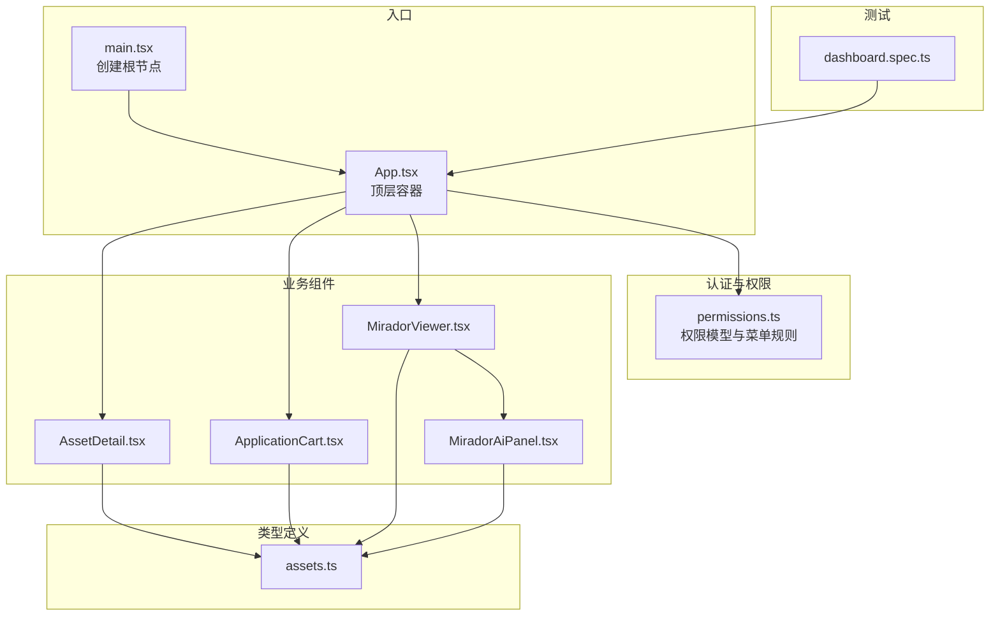
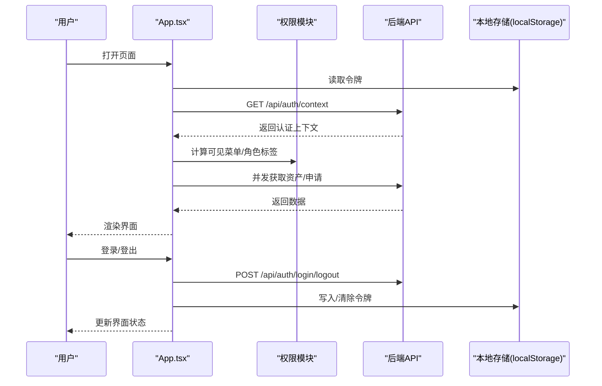
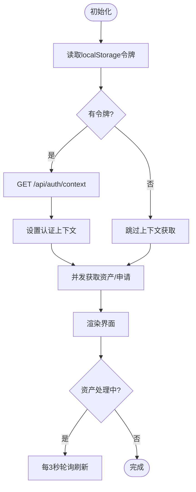
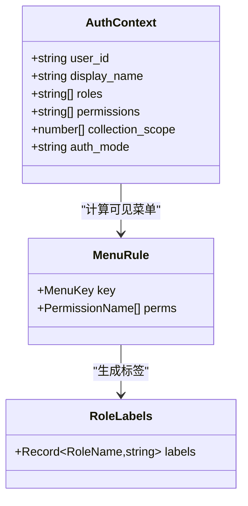
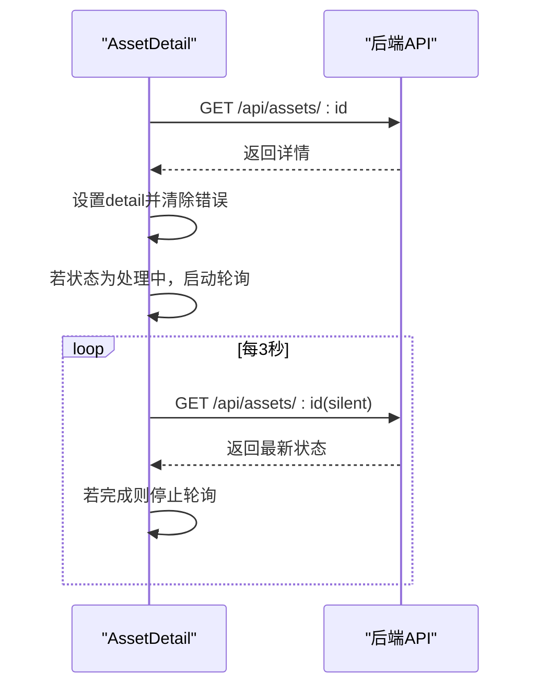
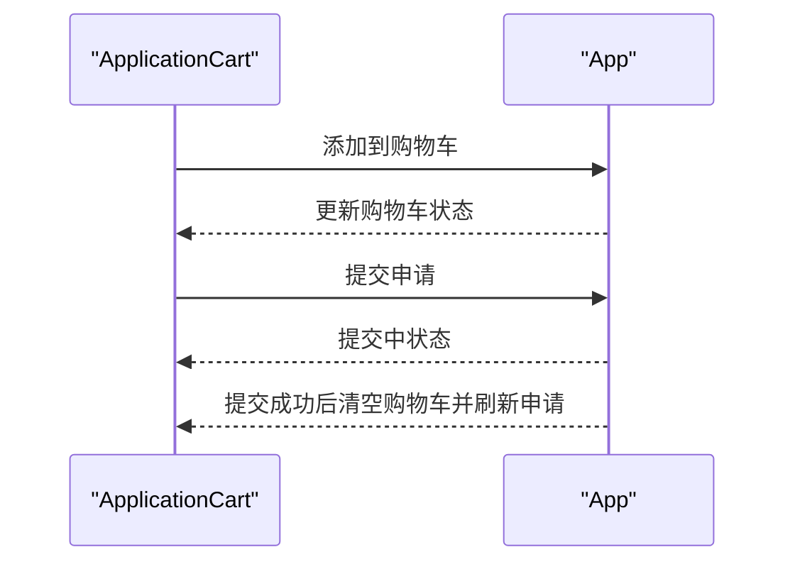
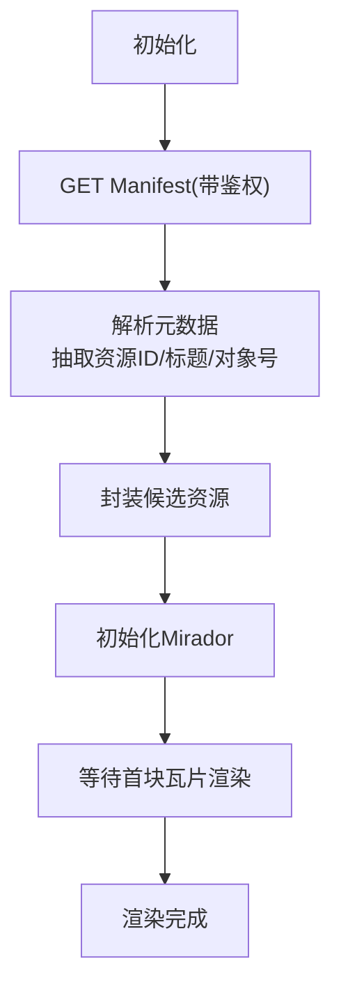
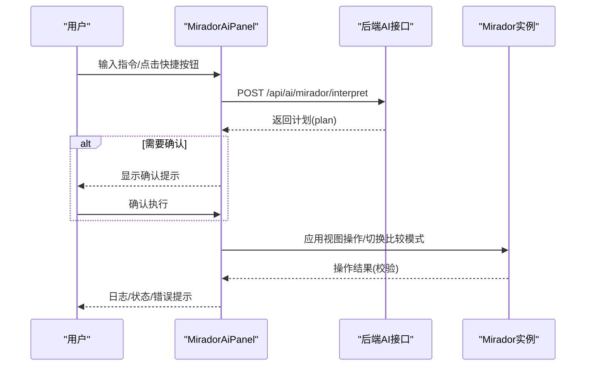
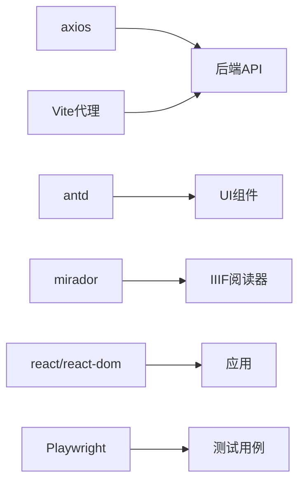

# 状态管理

<cite>
**本文引用的文件**
- [App.tsx](file://frontend/src/App.tsx)
- [main.tsx](file://frontend/src/main.tsx)
- [permissions.ts](file://frontend/src/auth/permissions.ts)
- [MiradorAiPanel.tsx](file://frontend/src/MiradorAiPanel.tsx)
- [MiradorViewer.tsx](file://frontend/src/MiradorViewer.tsx)
- [ApplicationCart.tsx](file://frontend/src/components/ApplicationCart.tsx)
- [AssetDetail.tsx](file://frontend/src/components/AssetDetail.tsx)
- [assets.ts](file://frontend/src/types/assets.ts)
- [dashboard.spec.ts](file://frontend/tests/dashboard.spec.ts)
- [package.json](file://frontend/package.json)
- [vite.config.ts](file://frontend/vite.config.ts)
</cite>

## 目录
1. [简介](#简介)
2. [项目结构](#项目结构)
3. [核心组件](#核心组件)
4. [架构总览](#架构总览)
5. [详细组件分析](#详细组件分析)
6. [依赖分析](#依赖分析)
7. [性能考量](#性能考量)
8. [故障排查指南](#故障排查指南)
9. [结论](#结论)
10. [附录](#附录)

## 简介
本文件面向MDAMS原型项目的前端状态管理，系统性梳理React Hook在项目中的使用模式、全局状态设计、状态提升与下沉、状态持久化策略、异步状态处理、最佳实践、调试技巧与测试策略。文档以代码为依据，结合可视化图表帮助不同背景读者理解状态在UI、业务与后端之间的流转。

## 项目结构
前端采用Vite + React 18 + Ant Design，组件按功能模块划分，状态集中在顶层容器组件与业务组件中，配合Axios进行HTTP请求，使用localStorage进行轻量持久化。

图表来源
- [main.tsx:1-11](file://frontend/src/main.tsx#L1-L11)
- [App.tsx:1-905](file://frontend/src/App.tsx#L1-L905)
- [permissions.ts:1-111](file://frontend/src/auth/permissions.ts#L1-L111)
- [AssetDetail.tsx:1-488](file://frontend/src/components/AssetDetail.tsx#L1-L488)
- [ApplicationCart.tsx:1-131](file://frontend/src/components/ApplicationCart.tsx#L1-L131)
- [MiradorViewer.tsx:1-399](file://frontend/src/MiradorViewer.tsx#L1-L399)
- [MiradorAiPanel.tsx:1-948](file://frontend/src/MiradorAiPanel.tsx#L1-L948)
- [assets.ts:1-621](file://frontend/src/types/assets.ts#L1-L621)
- [dashboard.spec.ts:1-764](file://frontend/tests/dashboard.spec.ts#L1-L764)

章节来源
- [main.tsx:1-11](file://frontend/src/main.tsx#L1-L11)
- [vite.config.ts:1-42](file://frontend/vite.config.ts#L1-L42)

## 核心组件
- 顶层容器App：集中管理认证上下文、菜单可见性、资产与申请数据、加载与错误状态、应用购物车等。
- 权限模块permissions：定义角色、权限、菜单可见性规则与标签映射。
- 业务组件：
  - AssetDetail：资源详情加载、错误与加载态、轮询处理中状态。
  - ApplicationCart：申请购物车的增删改与提交。
  - MiradorViewer：IIIF预览器加载与进度、鉴权头注入、候选资源封装。
  - MiradorAiPanel：AI控制台状态、计划执行、日志与错误提示。
- 类型assets：统一定义业务数据结构，便于跨组件共享。

章节来源
- [App.tsx:100-418](file://frontend/src/App.tsx#L100-L418)
- [permissions.ts:1-111](file://frontend/src/auth/permissions.ts#L1-L111)
- [AssetDetail.tsx:194-228](file://frontend/src/components/AssetDetail.tsx#L194-L228)
- [ApplicationCart.tsx:22-131](file://frontend/src/components/ApplicationCart.tsx#L22-L131)
- [MiradorViewer.tsx:64-271](file://frontend/src/MiradorViewer.tsx#L64-L271)
- [MiradorAiPanel.tsx:237-635](file://frontend/src/MiradorAiPanel.tsx#L237-L635)
- [assets.ts:1-621](file://frontend/src/types/assets.ts#L1-L621)

## 架构总览
前端状态自顶向下分发，顶层负责全局状态与副作用；业务组件负责局部状态与交互；类型定义贯穿全链路保证一致性；测试通过路由桩拦截模拟后端响应，覆盖权限与菜单可见性。

图表来源
- [App.tsx:183-205](file://frontend/src/App.tsx#L183-L205)
- [App.tsx:160-181](file://frontend/src/App.tsx#L160-L181)
- [App.tsx:213-251](file://frontend/src/App.tsx#L213-L251)
- [permissions.ts:100-110](file://frontend/src/auth/permissions.ts#L100-L110)

## 详细组件分析

### App.tsx：顶层状态与副作用
- 全局状态
  - 认证上下文与令牌：用于鉴权头注入与登录态维护。
  - 资产列表与加载态：驱动表格渲染与加载指示。
  - 申请与购物车：申请列表、提交中状态与购物车条目。
  - 菜单与导航：当前选中项、可见菜单键集合。
  - 预览与Manifest：IIIF预览弹窗与Manifest地址。
- Hook使用模式
  - useState：声明所有UI与业务状态。
  - useMemo：计算可见菜单键、角色标签、权限判断结果，避免重复计算。
  - useCallback：封装异步函数与回调，确保依赖稳定，减少子组件重渲染。
  - useEffect：初始化令牌与上下文、拉取用户列表、定时刷新处理中资产、菜单可见性约束。
- 异步状态管理
  - 加载态：每个异步请求包裹loading布尔值，避免并发冲突。
  - 错误态：捕获异常并设置错误消息，统一通过消息提示反馈。
  - 成功态：成功后更新状态并触发UI刷新。
- 状态持久化
  - localStorage：持久化认证令牌，页面刷新后自动恢复登录态。
- 状态提升与下沉
  - 将“购物车”、“申请提交”等跨组件共享逻辑提升至App，通过props传递给子组件，实现状态下沉。
- 与后端集成
  - Axios默认头注入Bearer Token，确保受保护接口可用。
  - 并发请求：资产与申请同时拉取，提升首屏体验。

图表来源
- [App.tsx:183-205](file://frontend/src/App.tsx#L183-L205)
- [App.tsx:247-263](file://frontend/src/App.tsx#L247-L263)
- [App.tsx:213-251](file://frontend/src/App.tsx#L213-L251)

章节来源
- [App.tsx:100-418](file://frontend/src/App.tsx#L100-L418)

### 权限模块 permissions.ts：权限与菜单规则
- 角色与权限枚举：统一定义角色与权限常量，便于类型安全与IDE提示。
- 菜单权限映射：将菜单键映射到所需权限集合，动态计算可见菜单。
- 角色标签：将内部角色键映射为中文标签，用于UI展示。
- 使用方式：App通过权限上下文计算可见菜单键与角色标签，决定菜单渲染与按钮可用性。

图表来源
- [permissions.ts:56-110](file://frontend/src/auth/permissions.ts#L56-L110)

章节来源
- [permissions.ts:1-111](file://frontend/src/auth/permissions.ts#L1-L111)

### AssetDetail.tsx：资源详情的异步状态
- 状态
  - detail：资源详情对象。
  - loading/error：加载与错误状态。
- Hook使用
  - useState：声明detail、loading、error。
  - useEffect：首次加载与处理中资产定时轮询。
  - useMemo：计算预览启用与Manifest URL，避免重复计算。
- 异步状态
  - 加载：静默加载与非静默加载区分，避免UI闪烁。
  - 错误：捕获Axios错误并提取后端错误信息，统一提示。
  - 成功：设置detail并清理错误。
- 与App协作
  - 通过onPreview回调将Manifest传回父级，触发预览弹窗。

图表来源
- [AssetDetail.tsx:199-228](file://frontend/src/components/AssetDetail.tsx#L199-L228)

章节来源
- [AssetDetail.tsx:194-228](file://frontend/src/components/AssetDetail.tsx#L194-L228)

### ApplicationCart.tsx：购物车与申请提交
- 状态
  - items：购物车条目数组。
  - submitting：提交中状态。
- 行为
  - 增删改：通过回调更新购物车，支持备注编辑。
  - 提交：收集表单数据，调用父级提交函数，提交后清空购物车并刷新申请列表。
- 与App协作
  - 由App提供addToApplicationCart、updateApplicationNote、removeFromApplicationCart、submitApplication等回调，实现状态下沉。

图表来源
- [ApplicationCart.tsx:22-131](file://frontend/src/components/ApplicationCart.tsx#L22-L131)
- [App.tsx:276-345](file://frontend/src/App.tsx#L276-L345)

章节来源
- [ApplicationCart.tsx:22-131](file://frontend/src/components/ApplicationCart.tsx#L22-L131)
- [App.tsx:276-345](file://frontend/src/App.tsx#L276-L345)

### MiradorViewer.tsx：IIIF预览器与加载进度
- 状态
  - manifest：IIIF清单对象。
  - previewStage/progress/elapsed：加载阶段、进度、耗时。
  - applicationCandidate：候选资源信息，供加入申请车。
- Hook使用
  - useState/useEffect：初始化加载、注入鉴权头、监听渲染完成。
  - useMemo：生成阶段标签与状态标签。
- 与后端集成
  - 通过请求预处理器注入Authorization头，确保访问受保护的IIIF资源。
  - 加载清单元数据，抽取资源ID、标题、对象号等，封装为候选资源。
- 与AI面板协作
  - 将候选资源与API引用传递给MiradorAiPanel，实现跨组件状态共享。

图表来源
- [MiradorViewer.tsx:199-271](file://frontend/src/MiradorViewer.tsx#L199-L271)
- [MiradorViewer.tsx:104-197](file://frontend/src/MiradorViewer.tsx#L104-L197)

章节来源
- [MiradorViewer.tsx:64-271](file://frontend/src/MiradorViewer.tsx#L64-L271)

### MiradorAiPanel.tsx：AI控制台与计划执行
- 状态
  - prompt/messages/logEntries/plan：聊天记录、日志、当前计划。
  - selectedTarget：当前选中的候选目标。
  - busy/errorMessage/statusMessage：执行中、错误、状态提示。
- Hook使用
  - useState/useMemo：声明与缓存当前候选信息。
  - useCallback：封装计划执行、快捷操作、确认执行等动作。
- 计划执行流程
  - 解析AI返回的计划，必要时等待用户确认。
  - 执行视图操作（缩放、平移、适配、比较模式切换），并进行结果校验。
  - 记录日志与错误，向用户反馈。
- 与Viewer协作
  - 通过viewerApiRef与Mirador实例交互，确保操作生效。

图表来源
- [MiradorAiPanel.tsx:581-635](file://frontend/src/MiradorAiPanel.tsx#L581-L635)
- [MiradorAiPanel.tsx:525-579](file://frontend/src/MiradorAiPanel.tsx#L525-L579)

章节来源
- [MiradorAiPanel.tsx:237-635](file://frontend/src/MiradorAiPanel.tsx#L237-L635)

## 依赖分析
- 外部依赖
  - axios：统一HTTP客户端，支持默认头注入与拦截器扩展。
  - antd：UI组件库，提供消息、表格、表单等状态承载组件。
  - mirador：IIIF阅读器，需要鉴权头与Manifest加载。
  - react/react-dom：React生态。
- 代理与环境
  - Vite代理将/api、/auth、/iiif转发到后端服务，便于本地联调。
- 测试依赖
  - Playwright：端到端测试，通过路由桩模拟后端响应，覆盖权限与菜单可见性。

图表来源
- [package.json:13-26](file://frontend/package.json#L13-L26)
- [vite.config.ts:22-40](file://frontend/vite.config.ts#L22-L40)
- [dashboard.spec.ts:291-311](file://frontend/tests/dashboard.spec.ts#L291-L311)

章节来源
- [package.json:1-42](file://frontend/package.json#L1-L42)
- [vite.config.ts:1-42](file://frontend/vite.config.ts#L1-L42)
- [dashboard.spec.ts:291-311](file://frontend/tests/dashboard.spec.ts#L291-L311)

## 性能考量
- Hook优化
  - useMemo：对计算结果稳定的派生数据进行缓存，如可见菜单键、角色标签、候选资源信息。
  - useCallback：对回调函数进行稳定化，减少子组件重渲染。
  - useEffect：合理安排副作用顺序与清理逻辑，避免重复订阅与内存泄漏。
- 数据获取策略
  - 并发请求：资产与申请并行拉取，缩短首屏时间。
  - 轮询策略：仅在处理中资产存在时启动轮询，完成后清理，降低无效请求。
- UI渲染
  - 表格与列表：使用静态列定义与memo化渲染，减少不必要的重渲染。
  - 进度与加载：通过阶段与进度条反馈，避免长时间空白。
- 依赖拆分
  - Vite配置按第三方库拆分chunk，优化首屏加载与缓存命中。

章节来源
- [App.tsx:116-139](file://frontend/src/App.tsx#L116-L139)
- [App.tsx:247-263](file://frontend/src/App.tsx#L247-L263)
- [MiradorViewer.tsx:104-197](file://frontend/src/MiradorViewer.tsx#L104-L197)
- [vite.config.ts:7-21](file://frontend/vite.config.ts#L7-L21)

## 故障排查指南
- 登录与令牌
  - 现象：页面刷新后未保持登录。
  - 排查：检查localStorage中是否存在令牌键，确认初始化流程是否正确写入与读取。
  - 相关实现：令牌键常量、初始化读取、登录写入、登出清除。
- 权限与菜单
  - 现象：某些菜单不可见或按钮不可用。
  - 排查：核对权限上下文中的permissions与菜单规则映射，确认可见菜单计算逻辑。
- IIIF预览
  - 现象：预览加载缓慢或失败。
  - 排查：检查鉴权头是否注入、Manifest URL是否正确、代理是否正常转发。
- AI控制台
  - 现象：视图操作无效或提示边界。
  - 排查：确认viewerApiRef是否就绪、操作是否被原生控件接管、边界动作的校验逻辑。

章节来源
- [App.tsx:183-205](file://frontend/src/App.tsx#L183-L205)
- [permissions.ts:96-110](file://frontend/src/auth/permissions.ts#L96-L110)
- [MiradorViewer.tsx:132-149](file://frontend/src/MiradorViewer.tsx#L132-L149)
- [MiradorAiPanel.tsx:291-297](file://frontend/src/MiradorAiPanel.tsx#L291-L297)

## 结论
MDAMS前端采用以React Hook为核心的轻量状态管理策略：顶层容器集中管理全局状态与副作用，业务组件负责局部状态与交互，类型定义贯穿全链路保障一致性。通过localStorage实现轻量持久化，Axios统一处理鉴权与请求，配合useMemo/useCallback优化性能。测试通过Playwright路由桩覆盖权限与菜单可见性，确保状态与UI行为符合预期。

## 附录

### 状态管理最佳实践清单
- 状态结构设计
  - 将UI状态与业务状态分离，避免混杂。
  - 使用类型定义统一数据结构，减少不一致。
- 状态更新策略
  - 优先使用不可变更新，避免直接修改引用。
  - 在批量更新时合并状态，减少多次重渲染。
- Hook使用建议
  - useMemo/useCallback用于昂贵计算与回调稳定化。
  - useEffect中明确依赖数组，及时清理副作用。
- 异步状态处理
  - 为每个异步操作提供独立的loading/error标志位。
  - 对于轮询，仅在必要时启动并在组件卸载时清理。
- 调试与测试
  - 使用浏览器开发者工具观察组件树与状态变化。
  - 通过Playwright断言关键UI元素与菜单可见性，覆盖多角色场景。

### 调试技巧与工具
- React DevTools：查看组件层级、Hook状态与渲染次数。
- 浏览器网络面板：检查请求头（Authorization）、响应状态与延迟。
- Playwright：端到端断言，覆盖登录、权限、菜单与业务流程。

### 测试策略与验证方法
- 端到端测试
  - 通过路由桩模拟不同权限上下文，断言菜单可见性与页面行为。
  - 验证资源列表、详情页、申请流程、AI控制台等关键路径。
- 权限矩阵
  - 覆盖系统管理员、资源使用者、馆藏责任人、摄影上传人员等角色。
- 状态验证
  - 断言购物车数量、申请列表长度、加载与错误提示、预览器状态。

章节来源
- [dashboard.spec.ts:291-311](file://frontend/tests/dashboard.spec.ts#L291-L311)
- [dashboard.spec.ts:659-762](file://frontend/tests/dashboard.spec.ts#L659-L762)