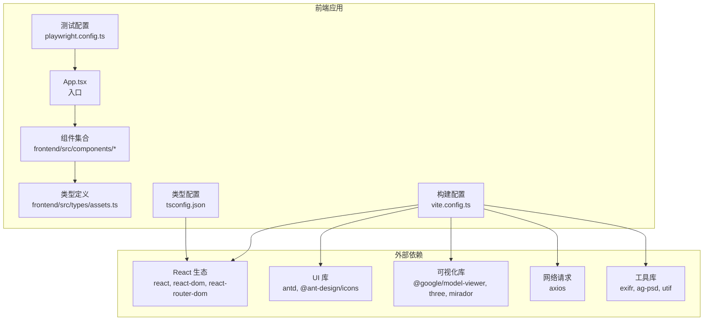
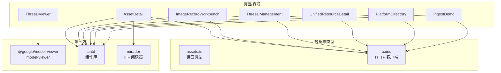
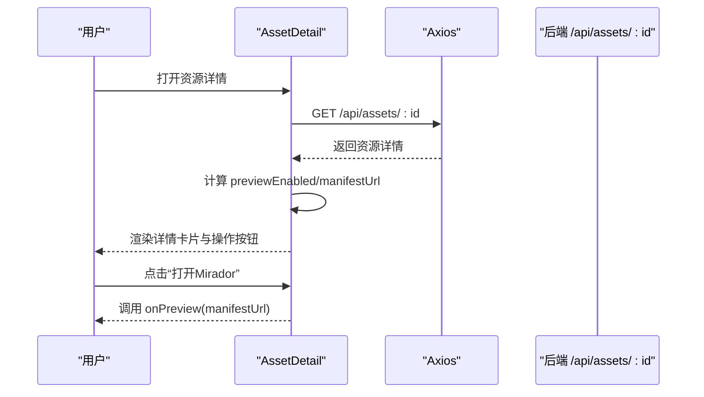
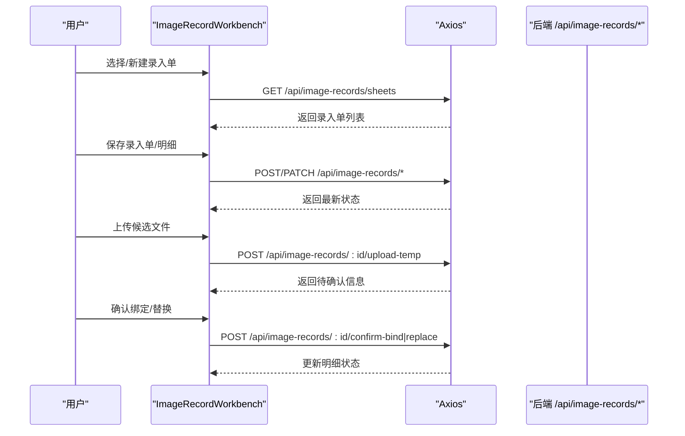
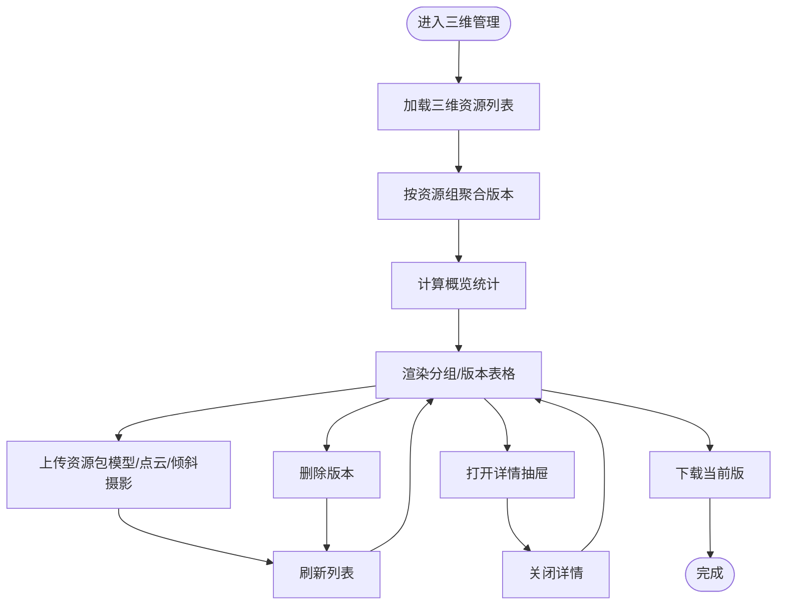
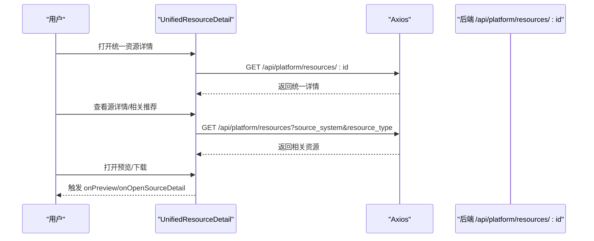
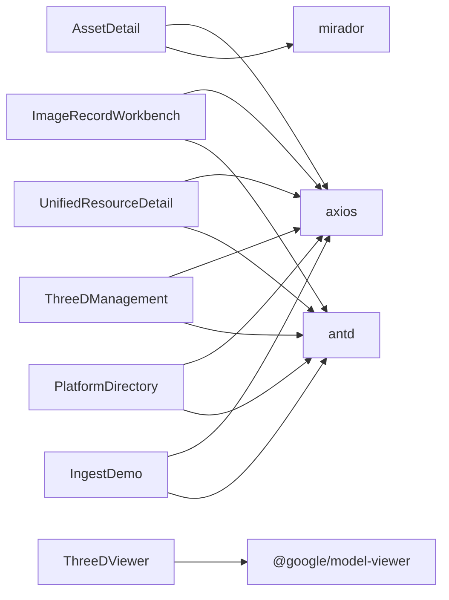

# 组件系统

<cite>
**本文引用的文件**
- [AssetDetail.tsx](file://frontend/src/components/AssetDetail.tsx)
- [ImageRecordWorkbench.tsx](file://frontend/src/components/ImageRecordWorkbench.tsx)
- [ThreeDManagement.tsx](file://frontend/src/components/ThreeDManagement.tsx)
- [UnifiedResourceDetail.tsx](file://frontend/src/components/UnifiedResourceDetail.tsx)
- [ImageRecordDetail.tsx](file://frontend/src/components/ImageRecordDetail.tsx)
- [ImageRecordForm.tsx](file://frontend/src/components/ImageRecordForm.tsx)
- [ImageRecordList.tsx](file://frontend/src/components/ImageRecordList.tsx)
- [ApplicationCart.tsx](file://frontend/src/components/ApplicationCart.tsx)
- [PlatformDirectory.tsx](file://frontend/src/components/PlatformDirectory.tsx)
- [IngestDemo.tsx](file://frontend/src/components/IngestDemo.tsx)
- [ThreeDViewer.tsx](file://frontend/src/components/ThreeDViewer.tsx)
- [assets.ts](file://frontend/src/types/assets.ts)
- [package.json](file://frontend/package.json)
- [vite.config.ts](file://frontend/vite.config.ts)
- [tsconfig.json](file://frontend/tsconfig.json)
- [playwright.config.ts](file://frontend/playwright.config.ts)
</cite>

## 目录
1. [简介](#简介)
2. [项目结构](#项目结构)
3. [核心组件](#核心组件)
4. [架构总览](#架构总览)
5. [组件详细分析](#组件详细分析)
6. [依赖关系分析](#依赖关系分析)
7. [性能考量](#性能考量)
8. [故障排查指南](#故障排查指南)
9. [结论](#结论)
10. [附录](#附录)

## 简介
本文件面向MDAMS原型项目的前端组件系统，系统性梳理可复用UI组件的设计原则与实现模式，重点覆盖以下关键组件：AssetDetail、ImageRecordWorkbench、ThreeDManagement、UnifiedResourceDetail，并扩展到与其密切相关的配套组件如ImageRecordDetail、ImageRecordForm、ImageRecordList、ApplicationCart、PlatformDirectory、IngestDemo、ThreeDViewer。文档从接口设计、事件处理、状态管理、组件间通信、样式与主题、可测试性、使用示例与最佳实践、开发规范与发布流程等方面进行全面阐述。

## 项目结构
前端采用Vite + React + TypeScript + Ant Design构建，组件集中于frontend/src/components目录，类型定义位于frontend/src/types，测试基于Playwright。构建配置对第三方库进行手动分包优化，开发服务器通过代理转发/api、/auth、/iiif请求到后端。

图表来源
- [vite.config.ts:1-42](file://frontend/vite.config.ts#L1-L42)
- [package.json:1-42](file://frontend/package.json#L1-L42)
- [tsconfig.json:1-23](file://frontend/tsconfig.json#L1-L23)

章节来源
- [vite.config.ts:1-42](file://frontend/vite.config.ts#L1-L42)
- [package.json:1-42](file://frontend/package.json#L1-L42)
- [tsconfig.json:1-23](file://frontend/tsconfig.json#L1-L23)

## 核心组件
本节概述四大关键组件及其职责边界与典型用法。

- AssetDetail：面向单一资源的详情页，负责拉取并渲染资源基础信息、生命周期、处理时间线、文件结构、技术元数据、分层元数据、访问与输出等，提供“打开Mirador”“查看Manifest”“下载当前文件/BagIt”等操作。
- ImageRecordWorkbench：面向影像采集与录入的批处理工作台，支持录入单（Sheet）与明细（Item）的创建、编辑、提交、退回、上传候选文件、匹配资产等全流程。
- ThreeDManagement：三维资源管理与预览，支持上传多类型三维文件（模型、点云、倾斜摄影）、版本聚合、Web预览、下载、删除、对象概览统计等。
- UnifiedResourceDetail：统一资源目录下的资源详情，聚合平台层摘要与源系统的结构信息，提供预览、下载、查看源详情、相关推荐等功能。

章节来源
- [AssetDetail.tsx:1-488](file://frontend/src/components/AssetDetail.tsx#L1-L488)
- [ImageRecordWorkbench.tsx:1-800](file://frontend/src/components/ImageRecordWorkbench.tsx#L1-L800)
- [ThreeDManagement.tsx:1-800](file://frontend/src/components/ThreeDManagement.tsx#L1-L800)
- [UnifiedResourceDetail.tsx:1-470](file://frontend/src/components/UnifiedResourceDetail.tsx#L1-L470)

## 架构总览
组件系统围绕“数据驱动 + 事件驱动”的模式组织，通过Ant Design的表单、表格、抽屉、卡片等容器组件承载UI，Axios发起HTTP请求，React Hooks管理状态与副作用，Web Worker承担CPU密集型任务（如哈希计算、元数据提取），ThreeDViewer集成model-viewer进行Web端三维预览。

图表来源
- [AssetDetail.tsx:1-488](file://frontend/src/components/AssetDetail.tsx#L1-L488)
- [ImageRecordWorkbench.tsx:1-800](file://frontend/src/components/ImageRecordWorkbench.tsx#L1-L800)
- [ThreeDManagement.tsx:1-800](file://frontend/src/components/ThreeDManagement.tsx#L1-L800)
- [UnifiedResourceDetail.tsx:1-470](file://frontend/src/components/UnifiedResourceDetail.tsx#L1-L470)
- [PlatformDirectory.tsx:1-273](file://frontend/src/components/PlatformDirectory.tsx#L1-L273)
- [IngestDemo.tsx:1-395](file://frontend/src/components/IngestDemo.tsx#L1-L395)
- [ThreeDViewer.tsx:1-129](file://frontend/src/components/ThreeDViewer.tsx#L1-L129)
- [assets.ts:1-621](file://frontend/src/types/assets.ts#L1-L621)

## 组件详细分析

### AssetDetail 组件
- 功能定位：资源详情页，聚合资源基础信息、生命周期、处理时间线、文件结构、技术元数据、分层元数据、访问与输出。
- Props 接口：接收 assetId、onBack、onPreview 等回调；内部通过Axios拉取 /api/assets/{id}。
- 状态管理：loading/error/detail；对“处理中”状态定时轮询刷新；计算 previewEnabled/manifestUrl。
- 事件处理：打开Mirador、查看IIIF Manifest、下载当前文件/BagIt。
- 数据渲染：使用Descriptions/List/Card等AntD组件；metadataLabelMap统一标签显示；formatBytes格式化文件大小。
- 错误处理：捕获Axios错误并展示友好提示；支持重试逻辑。

图表来源
- [AssetDetail.tsx:194-250](file://frontend/src/components/AssetDetail.tsx#L194-L250)
- [AssetDetail.tsx:443-482](file://frontend/src/components/AssetDetail.tsx#L443-L482)

章节来源
- [AssetDetail.tsx:16-132](file://frontend/src/components/AssetDetail.tsx#L16-L132)
- [AssetDetail.tsx:194-250](file://frontend/src/components/AssetDetail.tsx#L194-L250)
- [AssetDetail.tsx:230-237](file://frontend/src/components/AssetDetail.tsx#L230-L237)
- [AssetDetail.tsx:443-482](file://frontend/src/components/AssetDetail.tsx#L443-L482)

### ImageRecordWorkbench 组件
- 功能定位：影像采集与录入的批处理工作台，支持录入单与明细的创建、编辑、提交、退回、上传候选文件、匹配资产等。
- Props 接口：authContext、availableUsers；内部维护sheet/item列表、表单状态、权限控制、加载状态等。
- 状态管理：sheets、selectedSheet、selectedItem、loading/submitting/uploading/actionLoading等；通过useMemo派生表单初始值与字段集。
- 事件处理：新建/保存录入单、新建/保存明细、提交/退回、上传临时文件、确认绑定/替换、文物号查询等。
- 数据渲染：左侧录入单列表、中部录入单头信息表单、右侧明细列表与表格；根据权限动态启用按钮。
- 错误处理：统一使用message提示；对缺失必填项给出明确提示。

图表来源
- [ImageRecordWorkbench.tsx:235-354](file://frontend/src/components/ImageRecordWorkbench.tsx#L235-L354)
- [ImageRecordWorkbench.tsx:420-520](file://frontend/src/components/ImageRecordWorkbench.tsx#L420-L520)
- [ImageRecordWorkbench.tsx:558-593](file://frontend/src/components/ImageRecordWorkbench.tsx#L558-L593)

章节来源
- [ImageRecordWorkbench.tsx:197-201](file://frontend/src/components/ImageRecordWorkbench.tsx#L197-L201)
- [ImageRecordWorkbench.tsx:235-354](file://frontend/src/components/ImageRecordWorkbench.tsx#L235-L354)
- [ImageRecordWorkbench.tsx:420-520](file://frontend/src/components/ImageRecordWorkbench.tsx#L420-L520)
- [ImageRecordWorkbench.tsx:558-593](file://frontend/src/components/ImageRecordWorkbench.tsx#L558-L593)

### ThreeDManagement 组件
- 功能定位：三维资源管理与预览，支持上传多类型三维文件、版本聚合、Web预览、下载、删除、对象概览统计。
- Props 接口：无显式props；内部通过Axios拉取 /api/three-d/resources 与 /api/three-d/collection-objects。
- 状态管理：items/groupedItems/overview/detailOpen/detailLoading等；useMemo对版本排序与聚合。
- 事件处理：上传资源包（多文件类型）、删除、打开详情、下载当前版、刷新列表。
- 数据渲染：分组展示数字对象、版本列表、Web预览状态、保存层与归档状态；提供测试模型示例。
- 错误处理：统一message提示；对上传/删除/详情加载失败进行反馈。

图表来源
- [ThreeDManagement.tsx:142-197](file://frontend/src/components/ThreeDManagement.tsx#L142-L197)
- [ThreeDManagement.tsx:256-324](file://frontend/src/components/ThreeDManagement.tsx#L256-L324)
- [ThreeDManagement.tsx:445-519](file://frontend/src/components/ThreeDManagement.tsx#L445-L519)

章节来源
- [ThreeDManagement.tsx:142-197](file://frontend/src/components/ThreeDManagement.tsx#L142-L197)
- [ThreeDManagement.tsx:256-324](file://frontend/src/components/ThreeDManagement.tsx#L256-L324)
- [ThreeDManagement.tsx:445-519](file://frontend/src/components/ThreeDManagement.tsx#L445-L519)

### UnifiedResourceDetail 组件
- 功能定位：统一资源目录下的资源详情，聚合平台层摘要与源系统的结构信息，提供预览、下载、查看源详情、相关推荐。
- Props 接口：resourceId、onBack、onPreview、onOpenSourceDetail、onOpenUnifiedResourceDetail。
- 状态管理：loading/error/detail/relatedResources/relatedLoading；useMemo派生previewEnabled/manifestUrl。
- 事件处理：打开预览、查看Manifest、下载原文件/BagIt、查看源详情、打开统一详情。
- 数据渲染：网格布局预览区与信息区；生命周期、结构与文件、技术元数据、相关推荐卡片。
- 错误处理：加载失败提示；相关推荐为空时友好提示。

图表来源
- [UnifiedResourceDetail.tsx:86-153](file://frontend/src/components/UnifiedResourceDetail.tsx#L86-L153)
- [UnifiedResourceDetail.tsx:124-153](file://frontend/src/components/UnifiedResourceDetail.tsx#L124-L153)
- [UnifiedResourceDetail.tsx:306-351](file://frontend/src/components/UnifiedResourceDetail.tsx#L306-L351)

章节来源
- [UnifiedResourceDetail.tsx:32-68](file://frontend/src/components/UnifiedResourceDetail.tsx#L32-L68)
- [UnifiedResourceDetail.tsx:86-153](file://frontend/src/components/UnifiedResourceDetail.tsx#L86-L153)
- [UnifiedResourceDetail.tsx:306-351](file://frontend/src/components/UnifiedResourceDetail.tsx#L306-L351)

### 配套组件与模式
- ImageRecordDetail：用于展示单条影像记录的详情卡片，包含状态标签、上传与匹配区域、管理元数据与Profile元数据等。
- ImageRecordForm：用于新建/编辑影像记录的表单，支持根据Profile动态渲染字段、保存草稿、提交验证等。
- ImageRecordList：用于展示影像记录列表，支持搜索、筛选、刷新、打开详情等。
- ApplicationCart：用于二维影像利用申请的“购物车”模式，支持批量提交申请、备注编辑、移除等。
- PlatformDirectory：统一资源目录，支持多维筛选、来源汇总、统一资源列表、预览与跳转。
- IngestDemo：客户端入库演示，使用Web Worker进行哈希与元数据提取，再上传SIP包进行服务端校验。
- ThreeDViewer：封装model-viewer的三维预览组件，支持打开预览文件、下载、新标签页打开等。

章节来源
- [ImageRecordDetail.tsx:14-30](file://frontend/src/components/ImageRecordDetail.tsx#L14-L30)
- [ImageRecordDetail.tsx:42-58](file://frontend/src/components/ImageRecordDetail.tsx#L42-L58)
- [ImageRecordForm.tsx:56-62](file://frontend/src/components/ImageRecordForm.tsx#L56-L62)
- [ImageRecordForm.tsx:81-102](file://frontend/src/components/ImageRecordForm.tsx#L81-L102)
- [ImageRecordList.tsx:16-28](file://frontend/src/components/ImageRecordList.tsx#L16-L28)
- [ImageRecordList.tsx:104-128](file://frontend/src/components/ImageRecordList.tsx#L104-L128)
- [ApplicationCart.tsx:8-20](file://frontend/src/components/ApplicationCart.tsx#L8-L20)
- [ApplicationCart.tsx:22-127](file://frontend/src/components/ApplicationCart.tsx#L22-L127)
- [PlatformDirectory.tsx:25-35](file://frontend/src/components/PlatformDirectory.tsx#L25-L35)
- [PlatformDirectory.tsx:31-76](file://frontend/src/components/PlatformDirectory.tsx#L31-L76)
- [IngestDemo.tsx:13-18](file://frontend/src/components/IngestDemo.tsx#L13-L18)
- [IngestDemo.tsx:18-63](file://frontend/src/components/IngestDemo.tsx#L18-L63)
- [ThreeDViewer.tsx:25-29](file://frontend/src/components/ThreeDViewer.tsx#L25-L29)
- [ThreeDViewer.tsx:31-125](file://frontend/src/components/ThreeDViewer.tsx#L31-L125)

## 依赖关系分析
- 组件间依赖：各组件通过Axios与后端API交互；部分组件（如AssetDetail、UnifiedResourceDetail）依赖Mirador进行IIIF预览；ThreeDManagement与ThreeDViewer组合使用model-viewer；IngestDemo使用Web Worker与文件检查工具。
- 外部依赖：React生态、Ant Design、@google/model-viewer、three、mirador、axios、exifr、ag-psd、utif等。
- 构建优化：vite配置对react、antd、mirador进行manualChunks拆分，降低首屏体积与重复打包。

图表来源
- [AssetDetail.tsx:1-12](file://frontend/src/components/AssetDetail.tsx#L1-L12)
- [UnifiedResourceDetail.tsx:1-28](file://frontend/src/components/UnifiedResourceDetail.tsx#L1-L28)
- [ImageRecordWorkbench.tsx:1-27](file://frontend/src/components/ImageRecordWorkbench.tsx#L1-L27)
- [ThreeDManagement.tsx:1-26](file://frontend/src/components/ThreeDManagement.tsx#L1-L26)
- [PlatformDirectory.tsx:1-5](file://frontend/src/components/PlatformDirectory.tsx#L1-L5)
- [IngestDemo.tsx:1-8](file://frontend/src/components/IngestDemo.tsx#L1-L8)
- [ThreeDViewer.tsx:1-5](file://frontend/src/components/ThreeDViewer.tsx#L1-L5)
- [vite.config.ts:14-19](file://frontend/vite.config.ts#L14-L19)

章节来源
- [vite.config.ts:14-19](file://frontend/vite.config.ts#L14-L19)

## 性能考量
- 分包策略：通过manualChunks将react、antd、mirador分别打包，避免重复依赖与缓存失效。
- 内存与体积：chunkSizeWarningLimit提升至2MB，适配低内存环境；生产构建关闭sourcemap以减小体积。
- 异步加载：组件内使用useMemo优化渲染与计算；对长列表采用分页与懒加载策略。
- 事件节流：对高频搜索/筛选场景建议在父组件层做防抖处理（当前组件内已具备基础防抖能力）。
- 传输优化：对大文件上传采用FormData分块策略（IngestDemo中对元数据进行清洗与截断，避免超长字符串导致的传输问题）。

章节来源
- [vite.config.ts:7-21](file://frontend/vite.config.ts#L7-L21)
- [IngestDemo.tsx:65-101](file://frontend/src/components/IngestDemo.tsx#L65-L101)

## 故障排查指南
- 加载失败：组件内对Axios错误进行捕获，优先读取后端返回的detail字段，若不存在则回退为通用错误消息。
- 网络代理：开发环境通过vite.proxy将/api、/auth、/iiif转发至后端，若出现跨域或404，检查代理配置与后端服务状态。
- 测试运行：Playwright配置支持多浏览器并行，可通过trace定位问题；CI环境限制并发与重试次数。
- 三维预览：ThreeDViewer依赖model-viewer，若预览不可用，检查viewer.enabled与preview_url；必要时切换到可展示版本。
- 录入工作台：对缺失必填项（如项目名称、影像类别、Profile必填字段）进行明确提示，提交前务必完成校验。

章节来源
- [AssetDetail.tsx:205-217](file://frontend/src/components/AssetDetail.tsx#L205-L217)
- [ImageRecordWorkbench.tsx:521-540](file://frontend/src/components/ImageRecordWorkbench.tsx#L521-L540)
- [playwright.config.ts:1-36](file://frontend/playwright.config.ts#L1-L36)
- [vite.config.ts:22-40](file://frontend/vite.config.ts#L22-L40)
- [ThreeDViewer.tsx:31-125](file://frontend/src/components/ThreeDViewer.tsx#L31-L125)

## 结论
MDAMS前端组件系统以可复用、数据驱动为核心设计理念，通过清晰的Props接口、完善的事件处理与状态管理、合理的组件分层与通信机制，有效支撑了资源详情、影像录入、三维管理与统一目录等关键业务场景。配合构建优化与测试体系，整体具备良好的可维护性与扩展性。建议在后续迭代中进一步完善类型约束、增加单元测试覆盖率，并沉淀组件使用规范与最佳实践。

## 附录

### 组件Props与事件接口速览
- AssetDetail
  - Props: assetId, onBack(), onPreview?(manifestUrl)
  - 事件: 打开Mirador、查看Manifest、下载当前文件/BagIt
- ImageRecordWorkbench
  - Props: authContext, availableUsers
  - 事件: 新建/保存录入单、新建/保存明细、提交/退回、上传候选文件、确认绑定/替换
- ThreeDManagement
  - Props: 无
  - 事件: 上传资源包、删除、打开详情、下载当前版、刷新列表
- UnifiedResourceDetail
  - Props: resourceId, onBack(), onPreview?(), onOpenSourceDetail?(), onOpenUnifiedResourceDetail?()
  - 事件: 打开预览、查看Manifest、下载原文件/BagIt、查看源详情
- ImageRecordDetail/Form/List
  - Props: 详见文件内接口定义
- ApplicationCart
  - Props: items[], onRemove(), onUpdateNote(), onSubmit(), submitting?
- PlatformDirectory
  - Props: onPreview(), onOpenAssetDetail?(), onOpenUnifiedResourceDetail?()
- IngestDemo
  - Props: onViewManifest?(), onOpenAssetDetail?()
- ThreeDViewer
  - Props: viewer, title?, onOpenPreview?()

章节来源
- [AssetDetail.tsx:16-20](file://frontend/src/components/AssetDetail.tsx#L16-L20)
- [ImageRecordWorkbench.tsx:197-200](file://frontend/src/components/ImageRecordWorkbench.tsx#L197-L200)
- [ThreeDManagement.tsx:142](file://frontend/src/components/ThreeDManagement.tsx#L142)
- [UnifiedResourceDetail.tsx:32-38](file://frontend/src/components/UnifiedResourceDetail.tsx#L32-L38)
- [ImageRecordDetail.tsx:14-30](file://frontend/src/components/ImageRecordDetail.tsx#L14-L30)
- [ImageRecordForm.tsx:56-62](file://frontend/src/components/ImageRecordForm.tsx#L56-L62)
- [ImageRecordList.tsx:16-28](file://frontend/src/components/ImageRecordList.tsx#L16-L28)
- [ApplicationCart.tsx:8-20](file://frontend/src/components/ApplicationCart.tsx#L8-L20)
- [PlatformDirectory.tsx:25-35](file://frontend/src/components/PlatformDirectory.tsx#L25-L35)
- [IngestDemo.tsx:13-18](file://frontend/src/components/IngestDemo.tsx#L13-L18)
- [ThreeDViewer.tsx:25-29](file://frontend/src/components/ThreeDViewer.tsx#L25-L29)

### 组件间通信机制
- 父子组件通信：通过Props传递数据与回调（如onPreview/onOpenSourceDetail/onOpenUnifiedResourceDetail），子组件触发事件由父组件处理。
- 兄弟组件通信：通过路由参数或全局状态（当前实现中主要通过路由跳转与回调函数传递）。
- 跨层级通信：通过顶层App或路由容器注入上下文（如authContext），在需要时向下传递。

章节来源
- [ImageRecordWorkbench.tsx:235-354](file://frontend/src/components/ImageRecordWorkbench.tsx#L235-L354)
- [UnifiedResourceDetail.tsx:86-92](file://frontend/src/components/UnifiedResourceDetail.tsx#L86-L92)
- [PlatformDirectory.tsx:31-76](file://frontend/src/components/PlatformDirectory.tsx#L31-L76)

### 样式设计与主题
- 使用Ant Design组件库，遵循其默认主题与样式规范。
- 通过Card、Descriptions、List、Table等容器组件实现信息分层与视觉引导。
- 三维预览使用model-viewer的内置样式，背景与尺寸通过内联样式控制。

章节来源
- [ThreeDViewer.tsx:55-66](file://frontend/src/components/ThreeDViewer.tsx#L55-L66)

### 可测试性设计
- 单元测试：建议针对纯函数与Hook逻辑编写测试（如metadataLabelMap、formatBytes、getWebPreviewStatusLabel等）。
- 快照测试：对稳定UI结构进行快照对比，防止回归。
- 交互测试：Playwright配置支持多浏览器，建议为关键流程（如上传、预览、下载）编写端到端测试脚本。
- 测试运行：npm test执行Playwright测试，支持HTML报告与重试策略。

章节来源
- [playwright.config.ts:1-36](file://frontend/playwright.config.ts#L1-L36)
- [package.json:10](file://frontend/package.json#L10)

### 使用示例与最佳实践
- 资源详情页：在路由中传入assetId，调用onPreview打开Mirador；下载当前文件/BagIt时注意URL有效性。
- 录入工作台：先创建录入单，再逐条创建明细；提交前确保必填字段齐全；上传候选文件后及时确认绑定/替换。
- 三维管理：上传前选择正确的模板类型与版本信息；Web预览状态需标记为“已就绪”方可在线预览。
- 统一目录：通过多维筛选快速定位资源；预览能力与状态双维度判断是否可在线预览。
- 客户端入库：大文件与含图层文件需谨慎处理，建议在上传前进行文件层检查与用户确认。

章节来源
- [AssetDetail.tsx:443-482](file://frontend/src/components/AssetDetail.tsx#L443-L482)
- [ImageRecordWorkbench.tsx:558-593](file://frontend/src/components/ImageRecordWorkbench.tsx#L558-L593)
- [ThreeDManagement.tsx:213-248](file://frontend/src/components/ThreeDManagement.tsx#L213-L248)
- [PlatformDirectory.tsx:155-269](file://frontend/src/components/PlatformDirectory.tsx#L155-L269)
- [IngestDemo.tsx:166-221](file://frontend/src/components/IngestDemo.tsx#L166-L221)

### 开发规范与发布流程
- 代码规范：ESLint + TypeScript严格模式，开启React Hooks规则与React刷新规则。
- 构建与发布：Vite构建，生产环境关闭sourcemap；通过manualChunks优化第三方库分包。
- 代理与联调：开发服务器代理/api、/auth、/iiif到后端，便于前后端联调。
- 测试：Playwright多浏览器并行测试，支持CI环境重试与报告。

章节来源
- [tsconfig.json:1-23](file://frontend/tsconfig.json#L1-L23)
- [vite.config.ts:1-42](file://frontend/vite.config.ts#L1-L42)
- [playwright.config.ts:1-36](file://frontend/playwright.config.ts#L1-L36)