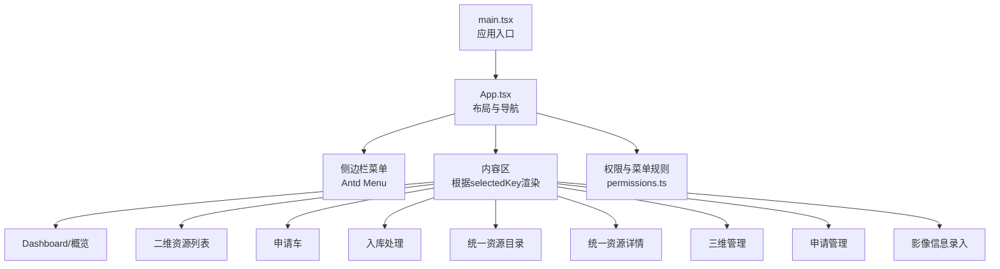
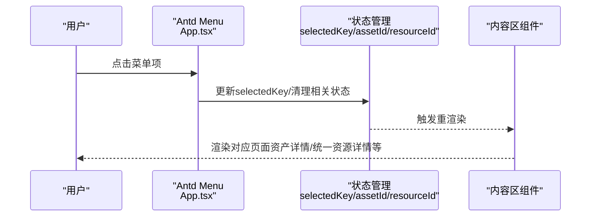
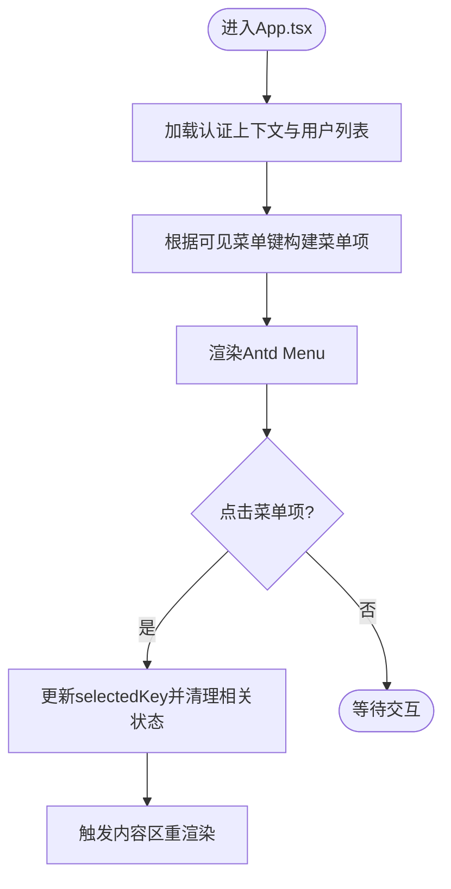
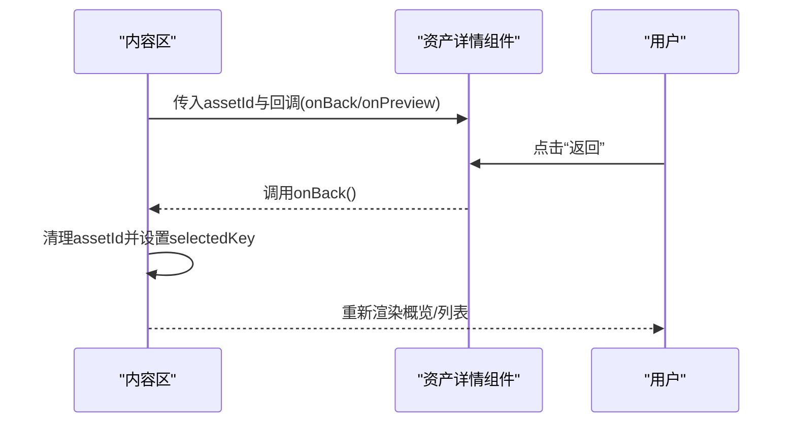
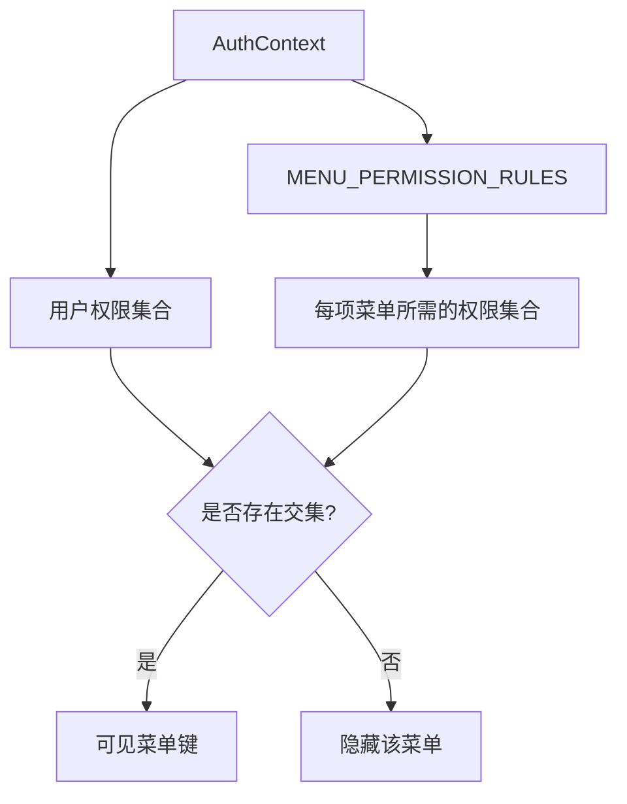
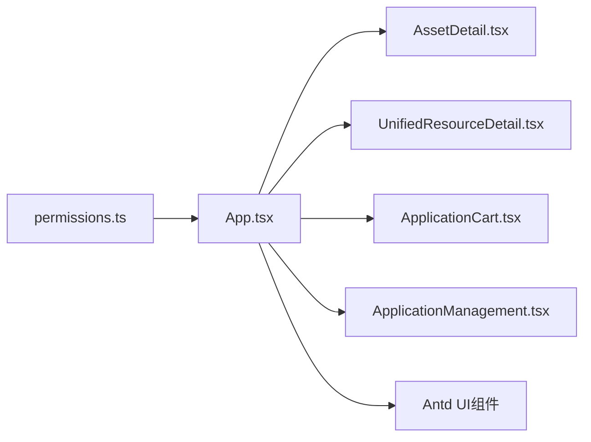

# 路由与导航

<cite>
**本文引用的文件**
- [frontend/src/App.tsx](file://frontend/src/App.tsx)
- [frontend/src/main.tsx](file://frontend/src/main.tsx)
- [frontend/src/auth/permissions.ts](file://frontend/src/auth/permissions.ts)
- [frontend/src/components/AssetDetail.tsx](file://frontend/src/components/AssetDetail.tsx)
- [frontend/src/components/UnifiedResourceDetail.tsx](file://frontend/src/components/UnifiedResourceDetail.tsx)
- [frontend/src/components/ApplicationCart.tsx](file://frontend/src/components/ApplicationCart.tsx)
- [frontend/src/components/ApplicationManagement.tsx](file://frontend/src/components/ApplicationManagement.tsx)
</cite>

## 目录
1. [简介](#简介)
2. [项目结构](#项目结构)
3. [核心组件](#核心组件)
4. [架构总览](#架构总览)
5. [详细组件分析](#详细组件分析)
6. [依赖分析](#依赖分析)
7. [性能考虑](#性能考虑)
8. [故障排查指南](#故障排查指南)
9. [结论](#结论)
10. [附录](#附录)

## 简介
本文件面向MDAMS原型项目的前端路由与导航体系，聚焦以下目标：
- 全面介绍React Router在本项目中的配置与使用现状（当前以应用级状态驱动的“伪路由”为主）
- 详述菜单导航系统：侧边栏菜单、面包屑与页面标题的实现思路
- 解析页面间数据传递与状态保持：状态变量、回调函数、以及基于URL的参数传递
- 权限控制与导航的关系：菜单渲染、访问控制与路由守卫的实现方式
- 页面懒加载与代码分割策略：当前采用的组件式拆分与可扩展方向
- 历史记录管理：前进/后退、浏览器导航与书签支持
- 导航体验优化：加载指示、错误处理与用户体验建议
- 测试策略与调试方法：结合现有组件与权限模块进行验证

## 项目结构
前端采用Vite + React + Ant Design，入口位于main.tsx，根组件App.tsx负责布局、菜单与内容区渲染。权限与导航相关逻辑集中在App.tsx与auth/permissions.ts中；各业务页面以组件形式组织，通过状态切换实现“伪路由”。

图表来源
- [frontend/src/main.tsx:1-11](file://frontend/src/main.tsx#L1-L11)
- [frontend/src/App.tsx:100-800](file://frontend/src/App.tsx#L100-L800)
- [frontend/src/auth/permissions.ts:1-111](file://frontend/src/auth/permissions.ts#L1-L111)

章节来源
- [frontend/src/main.tsx:1-11](file://frontend/src/main.tsx#L1-L11)
- [frontend/src/App.tsx:100-800](file://frontend/src/App.tsx#L100-L800)
- [frontend/src/auth/permissions.ts:1-111](file://frontend/src/auth/permissions.ts#L1-L111)

## 核心组件
- 应用根组件App.tsx：负责全局状态、菜单渲染、内容区切换、权限判断与页面标题/面包屑的呈现策略
- 权限模块permissions.ts：定义菜单键、角色、权限、菜单可见性规则与权限判定函数
- 业务组件：资产详情、统一资源详情、申请车、申请管理等，均通过App.tsx的状态驱动进行渲染与交互

章节来源
- [frontend/src/App.tsx:100-800](file://frontend/src/App.tsx#L100-L800)
- [frontend/src/auth/permissions.ts:1-111](file://frontend/src/auth/permissions.ts#L1-L111)

## 架构总览
本项目当前未直接使用React Router进行URL层面的路由切换，而是通过应用状态selectedKey与若干业务状态（如assetId、unifiedResourceId）驱动UI渲染。菜单点击触发状态变更，内容区根据状态条件渲染对应页面组件。

图表来源
- [frontend/src/App.tsx:688-702](file://frontend/src/App.tsx#L688-L702)
- [frontend/src/App.tsx:726-800](file://frontend/src/App.tsx#L726-L800)

章节来源
- [frontend/src/App.tsx:688-702](file://frontend/src/App.tsx#L688-L702)
- [frontend/src/App.tsx:726-800](file://frontend/src/App.tsx#L726-L800)

## 详细组件分析

### 侧边栏菜单与权限控制
- 菜单项定义与图标、标签：在App.tsx中构建menuItems，过滤掉不可见菜单键
- 可见菜单键计算：基于权限模块的getVisibleMenuKeys与MENU_PERMISSION_RULES
- 菜单点击行为：onClick中更新selectedKey，并在非对应页面时清理相关状态（如离开详情页时清空assetId或resourceId）

图表来源
- [frontend/src/App.tsx:116-119](file://frontend/src/App.tsx#L116-L119)
- [frontend/src/App.tsx:526-550](file://frontend/src/App.tsx#L526-L550)
- [frontend/src/App.tsx:688-702](file://frontend/src/App.tsx#L688-L702)

章节来源
- [frontend/src/App.tsx:116-119](file://frontend/src/App.tsx#L116-L119)
- [frontend/src/App.tsx:526-550](file://frontend/src/App.tsx#L526-L550)
- [frontend/src/App.tsx:688-702](file://frontend/src/App.tsx#L688-L702)
- [frontend/src/auth/permissions.ts:84-102](file://frontend/src/auth/permissions.ts#L84-L102)

### 内容区渲染与页面切换
- 通过selectedKey与特定业务状态（assetId、unifiedResourceId）决定渲染哪个页面
- 不同页面通过回调函数（onBack、onPreview、onOpenSourceDetail等）与父组件通信，实现“伪导航”
- 示例：资产详情与统一资源详情组件均接收onBack/onPreview等回调，用于返回上一页或打开预览

图表来源
- [frontend/src/App.tsx:728-741](file://frontend/src/App.tsx#L728-L741)
- [frontend/src/components/AssetDetail.tsx:16-20](file://frontend/src/components/AssetDetail.tsx#L16-L20)

章节来源
- [frontend/src/App.tsx:728-741](file://frontend/src/App.tsx#L728-L741)
- [frontend/src/components/AssetDetail.tsx:16-20](file://frontend/src/components/AssetDetail.tsx#L16-L20)

### 页面间数据传递与状态保持
- 路由参数：当前未使用URL参数
- 查询参数：当前未使用查询参数
- 状态传递：通过props（如assetId、resourceId）与回调函数（onBack/onPreview）实现
- 典型场景：
  - 从列表跳转到资产详情：传递assetId，详情页通过onBack回到列表
  - 从统一资源目录跳转到统一资源详情：传递resourceId，详情页通过onBack回到目录
  - 从详情页打开预览：传递manifestUrl，父组件设置currentManifest并显示预览弹窗

章节来源
- [frontend/src/App.tsx:728-763](file://frontend/src/App.tsx#L728-L763)
- [frontend/src/components/AssetDetail.tsx:194-218](file://frontend/src/components/AssetDetail.tsx#L194-L218)
- [frontend/src/components/UnifiedResourceDetail.tsx:86-118](file://frontend/src/components/UnifiedResourceDetail.tsx#L86-L118)

### 权限控制与菜单渲染
- 菜单可见性：getVisibleMenuKeys根据MENU_PERMISSION_RULES与用户权限集合计算
- 权限判定：can函数判断用户是否具备某项权限
- 菜单渲染：visibleMenuKeys过滤menuItems，确保用户只能看到其有权限访问的菜单

图表来源
- [frontend/src/auth/permissions.ts:84-102](file://frontend/src/auth/permissions.ts#L84-L102)
- [frontend/src/auth/permissions.ts:104-106](file://frontend/src/auth/permissions.ts#L104-L106)

章节来源
- [frontend/src/auth/permissions.ts:84-102](file://frontend/src/auth/permissions.ts#L84-L102)
- [frontend/src/auth/permissions.ts:104-106](file://frontend/src/auth/permissions.ts#L104-L106)

### 页面懒加载与代码分割策略
- 当前策略：通过组件式拆分（如AssetDetail、UnifiedResourceDetail等）实现按需加载，组件被调用时才渲染
- 可扩展方向：引入React.lazy与Suspense，对大型页面组件进行动态导入；对高频访问页面进行预加载
- 错误边界：可在App.tsx或页面组件内增加错误边界组件，捕获并展示加载失败信息

章节来源
- [frontend/src/components/AssetDetail.tsx:194-218](file://frontend/src/components/AssetDetail.tsx#L194-L218)
- [frontend/src/components/UnifiedResourceDetail.tsx:86-118](file://frontend/src/components/UnifiedResourceDetail.tsx#L86-L118)

### 历史记录管理
- 前进/后退：当前通过状态回退（onBack）实现，未使用浏览器历史API
- 浏览器导航：未绑定URL，无法直接通过浏览器前进/后退按钮跳转
- 书签支持：未提供URL书签，无法直接通过URL分享页面
- 建议：若需URL级导航，可在现有状态基础上引入React Router，将selectedKey映射到URL路径，并在页面组件中读取路由参数

章节来源
- [frontend/src/App.tsx:728-763](file://frontend/src/App.tsx#L728-L763)

### 导航体验优化
- 加载指示：资产详情与统一资源详情组件在加载时显示Spin提示
- 错误处理：组件内部捕获错误并展示Alert，同时提供返回按钮
- 用户体验：菜单项带徽标（如申请车数量）、按钮禁用态（如预览不可用时禁用按钮）、清晰的操作反馈（消息提示）

章节来源
- [frontend/src/components/AssetDetail.tsx:194-250](file://frontend/src/components/AssetDetail.tsx#L194-L250)
- [frontend/src/components/UnifiedResourceDetail.tsx:86-178](file://frontend/src/components/UnifiedResourceDetail.tsx#L86-L178)
- [frontend/src/App.tsx:534-538](file://frontend/src/App.tsx#L534-L538)

## 依赖分析
- App.tsx依赖权限模块permissions.ts进行菜单可见性与权限判定
- 业务组件（资产详情、统一资源详情等）依赖App.tsx提供的回调函数与状态
- Ant Design组件（Menu、Card、Table等）用于界面与交互

图表来源
- [frontend/src/auth/permissions.ts:1-111](file://frontend/src/auth/permissions.ts#L1-L111)
- [frontend/src/App.tsx:100-800](file://frontend/src/App.tsx#L100-L800)
- [frontend/src/components/AssetDetail.tsx:1-488](file://frontend/src/components/AssetDetail.tsx#L1-L488)
- [frontend/src/components/UnifiedResourceDetail.tsx:1-470](file://frontend/src/components/UnifiedResourceDetail.tsx#L1-L470)
- [frontend/src/components/ApplicationCart.tsx:1-131](file://frontend/src/components/ApplicationCart.tsx#L1-L131)
- [frontend/src/components/ApplicationManagement.tsx:1-293](file://frontend/src/components/ApplicationManagement.tsx#L1-L293)

章节来源
- [frontend/src/auth/permissions.ts:1-111](file://frontend/src/auth/permissions.ts#L1-L111)
- [frontend/src/App.tsx:100-800](file://frontend/src/App.tsx#L100-L800)

## 性能考虑
- 组件渲染：通过selectedKey与业务状态精确控制渲染范围，避免不必要的重渲染
- 数据加载：在详情组件中对处理中资源进行轮询刷新，注意轮询频率与清理
- 资源预览：通过预览URL懒加载图片，减少初始渲染压力
- 代码分割：建议对大型页面组件进行动态导入，提升首屏性能

## 故障排查指南
- 登录与认证：若本地存储token无效，应用会清除token并重置状态；检查后端认证接口与响应
- 权限问题：若菜单为空，检查权限模块中的MENU_PERMISSION_RULES与用户权限集合
- 详情加载失败：查看详情组件的错误分支，确认后端接口返回与网络状态
- 预览不可用：检查资源状态与manifestUrl生成逻辑

章节来源
- [frontend/src/App.tsx:183-205](file://frontend/src/App.tsx#L183-L205)
- [frontend/src/auth/permissions.ts:96-102](file://frontend/src/auth/permissions.ts#L96-L102)
- [frontend/src/components/AssetDetail.tsx:199-222](file://frontend/src/components/AssetDetail.tsx#L199-L222)
- [frontend/src/components/UnifiedResourceDetail.tsx:99-122](file://frontend/src/components/UnifiedResourceDetail.tsx#L99-L122)

## 结论
本项目当前采用“应用状态驱动”的导航模式，配合权限模块实现菜单可见性与访问控制。该模式简单直观，适合原型快速迭代；若未来需要更严格的URL级导航、浏览器历史管理与书签支持，建议引入React Router并对现有状态切换逻辑进行适配。

## 附录
- 测试策略建议：
  - 单元测试：针对权限模块的can与getVisibleMenuKeys进行断言
  - 组件测试：对详情组件的加载、错误与预览分支进行快照与交互测试
  - 端到端测试：模拟菜单点击、返回、预览等关键流程
- 调试方法：
  - 使用React DevTools观察组件重渲染与状态变化
  - 在App.tsx中添加日志，跟踪selectedKey与业务状态的流转
  - 对权限相关逻辑进行断点调试，确保菜单可见性符合预期