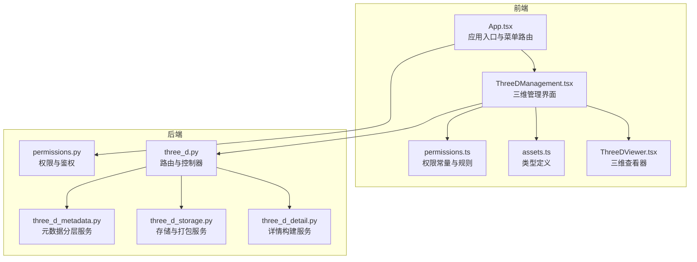
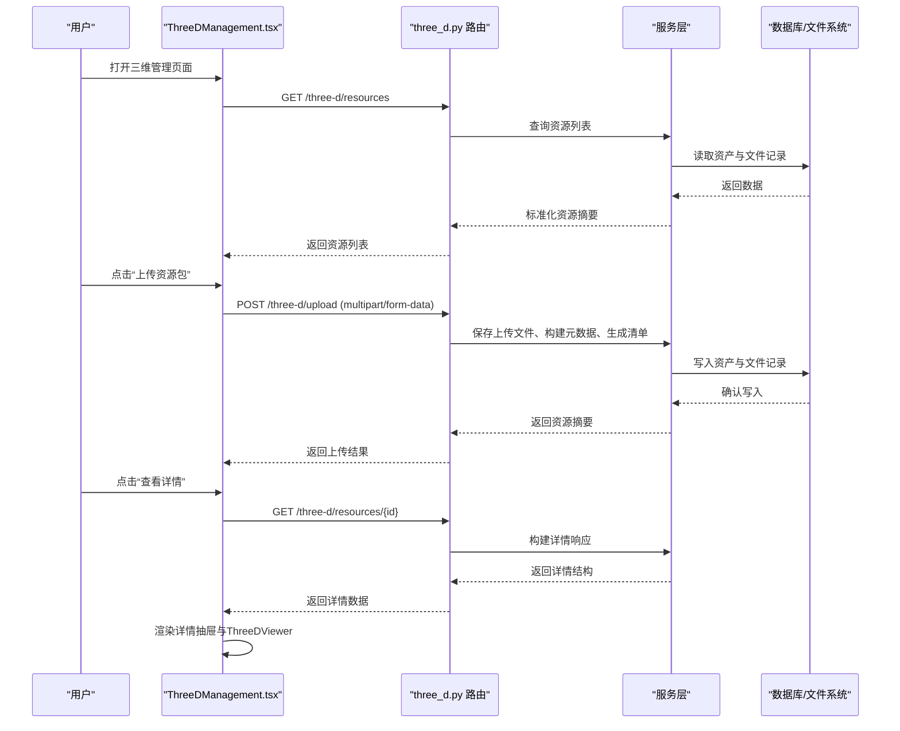
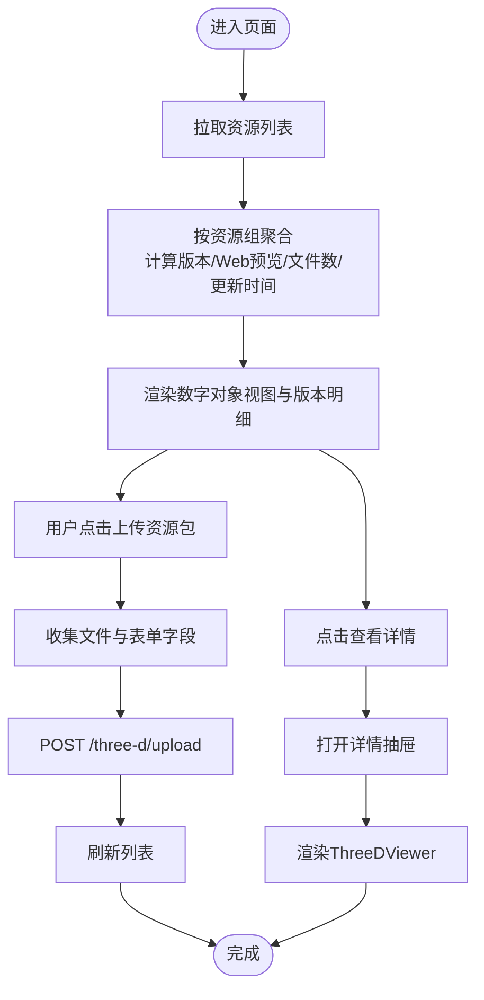
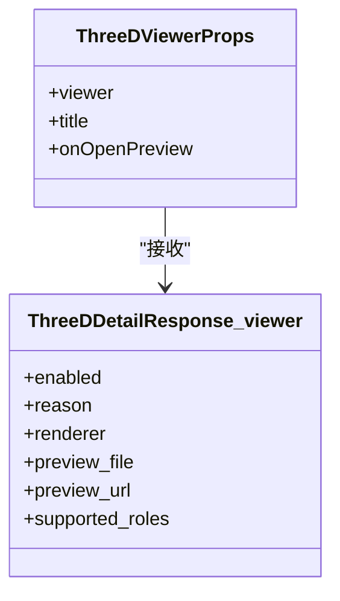
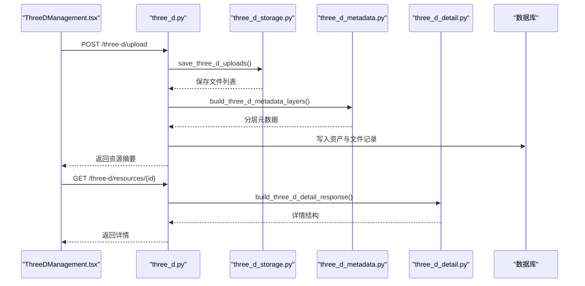
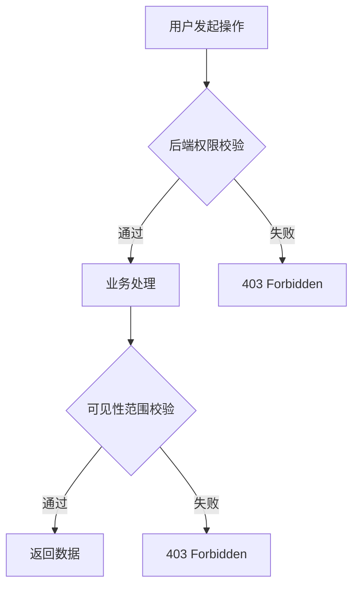
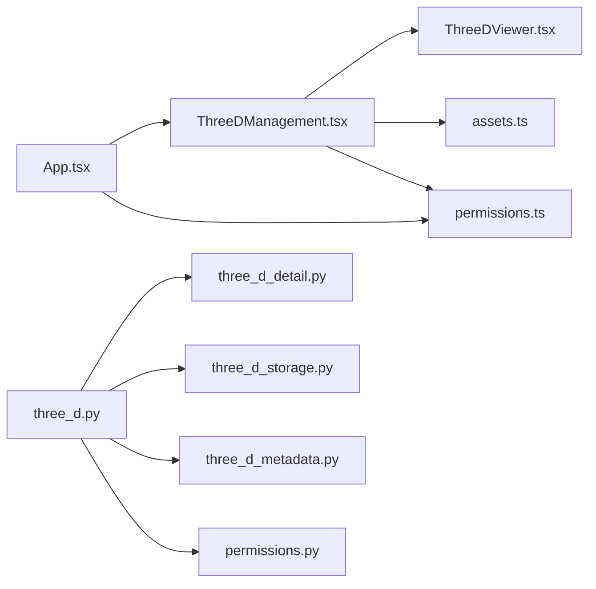

# 三维管理组件

<cite>
**本文引用的文件**
- [ThreeDManagement.tsx](file://frontend/src/components/ThreeDManagement.tsx)
- [ThreeDViewer.tsx](file://frontend/src/components/ThreeDViewer.tsx)
- [assets.ts](file://frontend/src/types/assets.ts)
- [permissions.ts](file://frontend/src/auth/permissions.ts)
- [App.tsx](file://frontend/src/App.tsx)
- [three_d.py](file://backend/app/routers/three_d.py)
- [three_d_detail.py](file://backend/app/services/three_d_detail.py)
- [three_d_storage.py](file://backend/app/services/three_d_storage.py)
- [three_d_metadata.py](file://backend/app/services/three_d_metadata.py)
- [permissions.py](file://backend/app/permissions.py)
</cite>

## 目录
1. [简介](#简介)
2. [项目结构](#项目结构)
3. [核心组件](#核心组件)
4. [架构总览](#架构总览)
5. [详细组件分析](#详细组件分析)
6. [依赖分析](#依赖分析)
7. [性能考虑](#性能考虑)
8. [故障排查指南](#故障排查指南)
9. [结论](#结论)
10. [附录](#附录)

## 简介
本文件面向三维管理组件（ThreeDManagement）进行系统化文档说明，涵盖组件设计与实现、三维资源管理界面、操作流程与状态控制、与三维查看器（ThreeDViewer）的集成与数据传递、上传/编辑/删除/预览等操作实现、权限控制与安全机制、响应式设计与跨浏览器兼容性、与后端API的交互方式以及最佳实践与性能优化建议。目标读者既包括前端开发者，也包括对三维资源管理业务流程感兴趣的非技术用户。

## 项目结构
三维管理组件位于前端工程的组件目录下，配合类型定义、权限模块、以及后端路由与服务层共同构成完整的三维资源管理子系统。整体采用前后端分离架构，前端使用React + Ant Design，后端使用FastAPI + SQLAlchemy。

图表来源
- [ThreeDManagement.tsx:1-1043](file://frontend/src/components/ThreeDManagement.tsx#L1-L1043)
- [ThreeDViewer.tsx:1-129](file://frontend/src/components/ThreeDViewer.tsx#L1-L129)
- [assets.ts:431-621](file://frontend/src/types/assets.ts#L431-L621)
- [permissions.ts:1-111](file://frontend/src/auth/permissions.ts#L1-L111)
- [App.tsx:1-905](file://frontend/src/App.tsx#L1-L905)
- [three_d.py:1-742](file://backend/app/routers/three_d.py#L1-L742)
- [three_d_detail.py:1-201](file://backend/app/services/three_d_detail.py#L1-L201)
- [three_d_storage.py:1-226](file://backend/app/services/three_d_storage.py#L1-L226)
- [three_d_metadata.py:1-360](file://backend/app/services/three_d_metadata.py#L1-L360)
- [permissions.py:1-255](file://backend/app/permissions.py#L1-L255)

章节来源
- [ThreeDManagement.tsx:1-1043](file://frontend/src/components/ThreeDManagement.tsx#L1-L1043)
- [App.tsx:1-905](file://frontend/src/App.tsx#L1-L905)

## 核心组件
- 三维管理界面（ThreeDManagement）
  - 负责三维资源列表展示、分组聚合、版本管理、上传表单、下载与删除操作、详情抽屉展示、测试模型预览。
  - 关键功能：资源列表聚合、版本排序与筛选、Web预览状态判断、上传多类型文件（模型/点云/倾斜摄影）、下载资源包、删除资源。
- 三维查看器（ThreeDViewer）
  - 基于model-viewer的Web预览组件，负责渲染三维模型、显示预览文件信息、提供下载与新窗口打开链接。
  - 关键功能：根据viewer状态决定是否启用预览、渲染model-viewer、展示预览文件与下载链接。
- 类型定义（assets.ts）
  - 定义三维资源的摘要、详情、文件记录、Viewer摘要等接口，确保前后端数据契约一致。
- 权限模块（permissions.ts）
  - 定义角色与权限常量、菜单访问规则、权限判断工具函数，支撑前端菜单与按钮级别的权限控制。
- 应用入口（App.tsx）
  - 提供全局菜单路由、认证上下文、权限判断与页面渲染逻辑，承载三维管理菜单项。

章节来源
- [ThreeDManagement.tsx:142-1043](file://frontend/src/components/ThreeDManagement.tsx#L142-L1043)
- [ThreeDViewer.tsx:31-129](file://frontend/src/components/ThreeDViewer.tsx#L31-L129)
- [assets.ts:431-621](file://frontend/src/types/assets.ts#L431-L621)
- [permissions.ts:16-111](file://frontend/src/auth/permissions.ts#L16-L111)
- [App.tsx:100-905](file://frontend/src/App.tsx#L100-L905)

## 架构总览
三维管理组件的前后端交互遵循REST风格，前端通过HTTP请求调用后端路由，后端路由将请求委派给服务层，服务层负责元数据构建、文件存储与打包、生产记录生成等，最终返回标准化的数据结构给前端渲染。

图表来源
- [three_d.py:371-742](file://backend/app/routers/three_d.py#L371-L742)
- [three_d_detail.py:97-201](file://backend/app/services/three_d_detail.py#L97-L201)
- [three_d_storage.py:70-115](file://backend/app/services/three_d_storage.py#L70-L115)
- [three_d_metadata.py:228-360](file://backend/app/services/three_d_metadata.py#L228-L360)
- [ThreeDManagement.tsx:172-254](file://frontend/src/components/ThreeDManagement.tsx#L172-L254)

章节来源
- [three_d.py:371-742](file://backend/app/routers/three_d.py#L371-L742)
- [three_d_detail.py:97-201](file://backend/app/services/three_d_detail.py#L97-L201)
- [three_d_storage.py:70-115](file://backend/app/services/three_d_storage.py#L70-L115)
- [three_d_metadata.py:228-360](file://backend/app/services/three_d_metadata.py#L228-L360)
- [ThreeDManagement.tsx:172-254](file://frontend/src/components/ThreeDManagement.tsx#L172-L254)

## 详细组件分析

### 三维管理界面（ThreeDManagement）
- 数据结构与状态
  - 使用React状态管理资源列表、加载状态、上传状态、选中的文件集合、详情抽屉状态与详情数据。
  - 通过分组聚合（groupedItems）将同组资源合并，计算版本数量、Web预览版本、文件总数、更新时间等汇总指标。
- 列表与表格
  - 数字对象视图：以资源组为行，展开版本明细；版本视图：展示每个版本的Web预览状态、标题、主文件、文件数、状态与操作。
  - 概览卡片：统计对象数、版本总数、可展示对象数、文件总数。
- 表单与上传
  - 支持多类型文件上传：模型、点云、倾斜摄影图像；同时支持表单字段（版本、模板类型、项目、创建者、保存层级、保存状态等）。
  - 上传流程：收集文件与表单字段，构造FormData，POST到后端；上传成功后刷新列表。
- 详情抽屉
  - 展示资源标题、版本、Web预览状态、模板类型、资源类型、状态、关联藏品对象、保存层级/状态/说明、构成摘要、Viewer预览、图像预览、文件构成、技术元数据、生产链、分层元数据与下载资源包。
- 测试模型
  - 提供示例模型切换，使用本地构建的Viewer配置进行预览。

图表来源
- [ThreeDManagement.tsx:172-254](file://frontend/src/components/ThreeDManagement.tsx#L172-L254)
- [ThreeDManagement.tsx:256-324](file://frontend/src/components/ThreeDManagement.tsx#L256-L324)
- [ThreeDManagement.tsx:555-774](file://frontend/src/components/ThreeDManagement.tsx#L555-L774)
- [ThreeDManagement.tsx:871-1037](file://frontend/src/components/ThreeDManagement.tsx#L871-L1037)

章节来源
- [ThreeDManagement.tsx:142-1043](file://frontend/src/components/ThreeDManagement.tsx#L142-L1043)

### 三维查看器（ThreeDViewer）
- 功能要点
  - 根据viewer.enabled与preview_url决定是否启用预览；若不可用则提示原因并展示候选文件。
  - 使用model-viewer渲染三维模型，支持自动旋转、交互提示、阴影强度、曝光等参数。
  - 提供打开预览文件、下载预览文件、新标签页打开等操作。
- 数据来源
  - viewer来自后端ThreeDDetailResponse的viewer字段，包含enabled、reason、renderer、preview_file、preview_url、supported_roles等。

图表来源
- [ThreeDViewer.tsx:25-29](file://frontend/src/components/ThreeDViewer.tsx#L25-L29)
- [assets.ts:558-578](file://frontend/src/types/assets.ts#L558-L578)

章节来源
- [ThreeDViewer.tsx:31-129](file://frontend/src/components/ThreeDViewer.tsx#L31-L129)
- [assets.ts:558-578](file://frontend/src/types/assets.ts#L558-L578)

### 后端路由与服务（three_d.py、three_d_detail.py、three_d_storage.py、three_d_metadata.py）
- 资源上传
  - 接收多类型文件（模型/点云/倾斜摄影），按角色归类保存到资源目录下的files子目录，并生成主文件与清单文件。
  - 根据上传文件推断模板类型与资源类型，构建分层元数据（core/management/technical/profile/preservation/raw_metadata）。
  - 生成生产记录（seed_three_d_production_records），标记Web预览状态，写入数据库。
- 资源列表与详情
  - 列表：按创建时间倒序返回资源摘要，结合可见性范围过滤。
  - 详情：构建结构化详情（文件、分组、打包信息、Viewer摘要、技术元数据、分层元数据、生产记录、输出链接等）。
- 文件下载
  - 单文件：直接返回文件；
  - 多文件：打包为ZIP后返回。
- 存储与打包
  - 保存文件时去重命名，避免覆盖；
  - 按角色分组统计文件数量与大小；
  - 生成manifest.json作为资源包清单。

图表来源
- [three_d.py:371-636](file://backend/app/routers/three_d.py#L371-L636)
- [three_d_storage.py:70-115](file://backend/app/services/three_d_storage.py#L70-L115)
- [three_d_metadata.py:228-360](file://backend/app/services/three_d_metadata.py#L228-L360)
- [three_d_detail.py:97-201](file://backend/app/services/three_d_detail.py#L97-L201)

章节来源
- [three_d.py:371-742](file://backend/app/routers/three_d.py#L371-L742)
- [three_d_storage.py:70-226](file://backend/app/services/three_d_storage.py#L70-L226)
- [three_d_metadata.py:228-360](file://backend/app/services/three_d_metadata.py#L228-L360)
- [three_d_detail.py:97-201](file://backend/app/services/three_d_detail.py#L97-L201)

### 权限控制与安全机制
- 前端权限
  - 通过权限常量与菜单访问规则控制菜单项显示与按钮可用性；在App.tsx中基于权限判断渲染不同页面与操作按钮。
- 后端权限
  - 通过require_permission装饰器校验用户权限（如three_d.view、three_d.upload、three_d.edit）；结合可见性范围（visibility_scope）与馆藏责任范围（collection_scope）进行访问控制。
- 安全措施
  - 上传文件按角色分类保存，避免混杂；
  - 下载接口仅返回存在且可访问的文件；
  - 删除接口清理资源树，防止残留文件。

图表来源
- [permissions.py:214-236](file://backend/app/permissions.py#L214-L236)
- [permissions.py:239-254](file://backend/app/permissions.py#L239-L254)
- [three_d.py:639-661](file://backend/app/routers/three_d.py#L639-L661)

章节来源
- [permissions.ts:16-111](file://frontend/src/auth/permissions.ts#L16-L111)
- [permissions.py:17-94](file://backend/app/permissions.py#L17-L94)
- [permissions.py:214-254](file://backend/app/permissions.py#L214-L254)
- [three_d.py:639-661](file://backend/app/routers/three_d.py#L639-L661)

### 响应式设计与跨浏览器兼容性
- 响应式布局
  - 使用Ant Design的Grid与Layout组件，列宽随屏幕尺寸自适应；卡片与表格在小屏设备上保持良好可读性。
- 兼容性
  - model-viewer为Web组件，需确保目标浏览器支持Web Components与WebGL；在不支持的环境中，ThreeDViewer会降级为提示信息。
  - 上传与下载使用原生HTML与浏览器API，具备较好的跨浏览器兼容性。

章节来源
- [ThreeDManagement.tsx:523-848](file://frontend/src/components/ThreeDManagement.tsx#L523-L848)
- [ThreeDViewer.tsx:54-66](file://frontend/src/components/ThreeDViewer.tsx#L54-L66)

### 与后端API的交互方式
- 资源列表：GET /three-d/resources
- 详情：GET /three-d/resources/{id}
- Viewer摘要：GET /three-d/resources/{id}/viewer
- 上传：POST /three-d/upload（multipart/form-data）
- 下载：GET /three-d/resources/{id}/download 或 /three-d/resources/{id}/files/{file_id}
- 删除：DELETE /three-d/resources/{id}

章节来源
- [three_d.py:639-742](file://backend/app/routers/three_d.py#L639-L742)
- [ThreeDManagement.tsx:172-254](file://frontend/src/components/ThreeDManagement.tsx#L172-L254)

## 依赖分析
- 组件耦合
  - ThreeDManagement依赖ThreeDViewer进行预览渲染；依赖assets.ts中的类型定义保证数据一致性。
  - App.tsx通过权限模块控制菜单与页面渲染，间接影响ThreeDManagement的可见性。
- 后端服务依赖
  - three_d.py依赖three_d_detail.py、three_d_storage.py、three_d_metadata.py与权限模块，形成清晰的服务层职责划分。
- 外部依赖
  - model-viewer用于Web预览；Ant Design提供UI组件；Axios用于HTTP通信。

图表来源
- [ThreeDManagement.tsx:1-28](file://frontend/src/components/ThreeDManagement.tsx#L1-L28)
- [ThreeDViewer.tsx:1-6](file://frontend/src/components/ThreeDViewer.tsx#L1-L6)
- [assets.ts:431-621](file://frontend/src/types/assets.ts#L431-L621)
- [permissions.ts:1-111](file://frontend/src/auth/permissions.ts#L1-L111)
- [App.tsx:1-905](file://frontend/src/App.tsx#L1-L905)
- [three_d.py:1-38](file://backend/app/routers/three_d.py#L1-L38)
- [three_d_detail.py:1-23](file://backend/app/services/three_d_detail.py#L1-L23)
- [three_d_storage.py:1-12](file://backend/app/services/three_d_storage.py#L1-L12)
- [three_d_metadata.py:1-8](file://backend/app/services/three_d_metadata.py#L1-L8)
- [permissions.py:1-12](file://backend/app/permissions.py#L1-L12)

章节来源
- [ThreeDManagement.tsx:1-28](file://frontend/src/components/ThreeDManagement.tsx#L1-L28)
- [three_d.py:1-38](file://backend/app/routers/three_d.py#L1-L38)

## 性能考虑
- 列表渲染优化
  - 使用虚拟滚动与分页（limit）减少一次性渲染的节点数量；对版本展开使用受控展开，避免不必要的重渲染。
- 文件上传
  - 采用FormData分块读取与写入，避免大文件内存峰值过高；上传完成后立即刷新列表，减少重复请求。
- 预览与下载
  - 预览URL优先使用后端生成的直链；下载时根据文件数量选择单文件直返或打包ZIP，避免不必要的IO。
- 元数据构建
  - 将元数据分层（core/management/technical/profile/preservation/raw_metadata）便于缓存与增量更新；对文件角色与主文件选择采用固定顺序，提升稳定性。

[本节为通用指导，无需特定文件引用]

## 故障排查指南
- 上传失败
  - 检查是否选择了至少一种三维文件类型；确认网络连接与后端服务状态；查看后端错误日志定位具体原因。
- 无法预览
  - 确认资源版本已标记为Web预览且状态为“已就绪”；检查Viewer摘要中的reason字段；尝试切换到可展示版本。
- 下载异常
  - 若资源包含多个文件，确认后端已生成ZIP；检查文件路径是否存在；对于单文件资源，确认文件存在且可访问。
- 权限不足
  - 确认当前用户具备three_d.view/three_d.upload/three_d.edit权限；若涉及可见性范围，确认collection_scope是否包含相关馆藏对象。

章节来源
- [three_d.py:689-742](file://backend/app/routers/three_d.py#L689-L742)
- [three_d_detail.py:57-94](file://backend/app/services/three_d_detail.py#L57-L94)
- [permissions.py:214-236](file://backend/app/permissions.py#L214-L236)

## 结论
三维管理组件通过清晰的前后端分工、完善的权限控制与元数据分层、稳定的文件存储与打包机制，实现了从资源上传、版本管理、Web预览到下载与删除的完整闭环。组件在用户体验与安全性之间取得平衡，具备良好的可维护性与扩展性。建议在后续迭代中进一步引入缓存策略、批量操作与更细粒度的权限控制，以提升大规模场景下的性能与灵活性。

[本节为总结性内容，无需特定文件引用]

## 附录
- 最佳实践
  - 上传前对文件类型与大小进行前端校验，减少无效请求；
  - 对版本管理采用明确的版本号与顺序字段，便于追溯；
  - 在详情抽屉中提供“下载资源包”与“打开预览文件”快捷入口；
  - 对敏感操作（删除）增加二次确认弹窗。
- 性能优化建议
  - 列表分页与虚拟滚动；
  - 预览URL缓存与懒加载；
  - 元数据分层缓存与增量更新；
  - ZIP打包异步生成与进度反馈。

[本节为通用指导，无需特定文件引用]