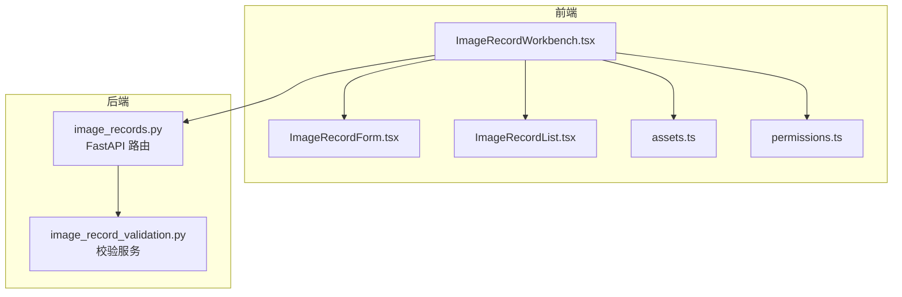
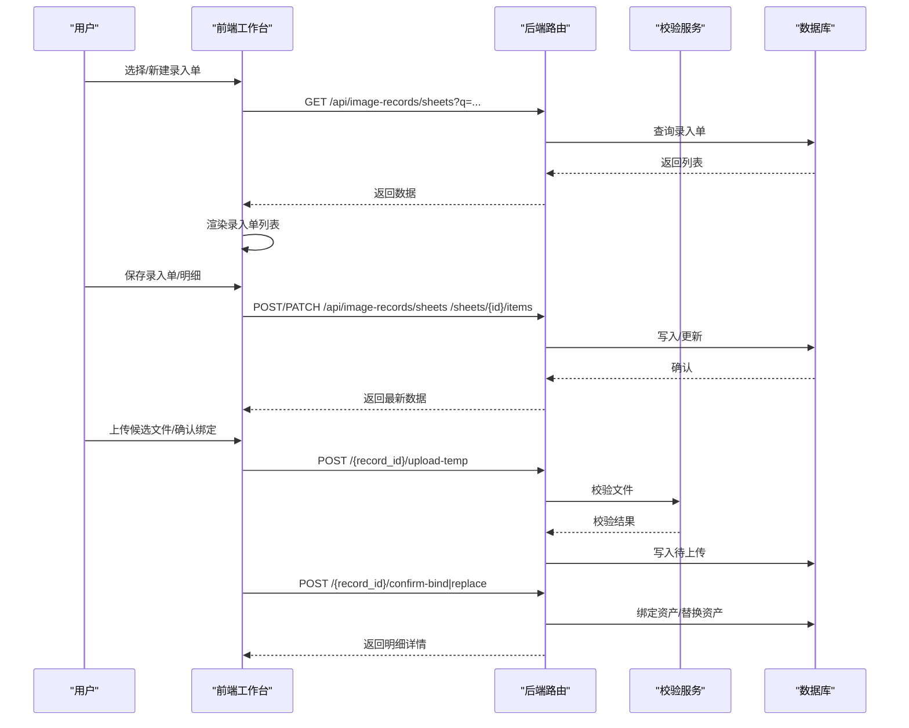
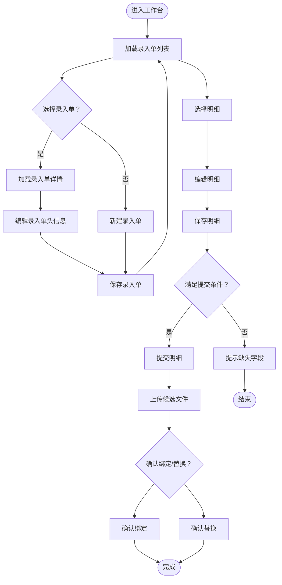
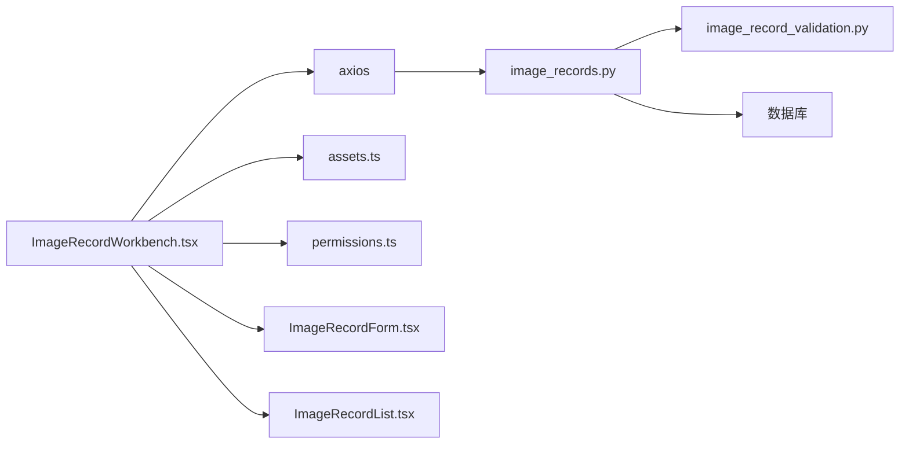

# 图像记录工作台

<cite>
**本文引用的文件**
- [ImageRecordWorkbench.tsx](file://frontend/src/components/ImageRecordWorkbench.tsx)
- [ImageRecordForm.tsx](file://frontend/src/components/ImageRecordForm.tsx)
- [ImageRecordList.tsx](file://frontend/src/components/ImageRecordList.tsx)
- [assets.ts](file://frontend/src/types/assets.ts)
- [permissions.ts](file://frontend/src/auth/permissions.ts)
- [image_records.py](file://backend/app/routers/image_records.py)
- [image_record_validation.py](file://backend/app/services/image_record_validation.py)
- [IMAGE_RECORD_WORKBENCH_GUIDE.md](file://docs/03-产品与流程/IMAGE_RECORD_WORKBENCH_GUIDE.md)
- [USER_ROLE_PERMISSION_MATRIX.md](file://docs/03-产品与流程/USER_ROLE_PERMISSION_MATRIX.md)
</cite>

## 目录
1. [简介](#简介)
2. [项目结构](#项目结构)
3. [核心组件](#核心组件)
4. [架构总览](#架构总览)
5. [详细组件分析](#详细组件分析)
6. [依赖关系分析](#依赖关系分析)
7. [性能考量](#性能考量)
8. [故障排查指南](#故障排查指南)
9. [结论](#结论)
10. [附录](#附录)

## 简介
图像记录工作台是一个面向“先建记录、后传文件”流程的前端工作台，服务于两类用户角色：元数据录入人员与摄影上传人员。工作台通过分屏布局将“录入单列表”“录入单头信息”“明细列表”“明细编辑区”整合在一个界面中，配合后端 API 实现从草稿、提交、待上传、文件绑定与替换的完整闭环。工作台还集成文物号查询、人脸识别结果展示、文件上传与绑定确认等能力，确保数据完整性与合规性。

## 项目结构
- 前端位于 frontend/src/components，包含工作台主体组件与子组件：
  - ImageRecordWorkbench.tsx：工作台主容器，负责布局、状态管理、数据流与权限控制
  - ImageRecordForm.tsx：独立的明细表单组件（可复用）
  - ImageRecordList.tsx：独立的列表组件（可复用）
- 类型定义位于 frontend/src/types/assets.ts，统一描述前后端交互的数据结构
- 权限模型位于 frontend/src/auth/permissions.ts，定义角色、权限与菜单可见性
- 后端位于 backend/app/routers/image_records.py，提供工作台所需的所有 API
- 数据校验与规则位于 backend/app/services/image_record_validation.py

图表来源
- [ImageRecordWorkbench.tsx:1-1214](file://frontend/src/components/ImageRecordWorkbench.tsx#L1-L1214)
- [image_records.py:1-1608](file://backend/app/routers/image_records.py#L1-L1608)
- [image_record_validation.py:1-563](file://backend/app/services/image_record_validation.py#L1-L563)
- [assets.ts:1-621](file://frontend/src/types/assets.ts#L1-L621)
- [permissions.ts:1-111](file://frontend/src/auth/permissions.ts#L1-L111)

章节来源
- [ImageRecordWorkbench.tsx:1-1214](file://frontend/src/components/ImageRecordWorkbench.tsx#L1-L1214)
- [image_records.py:1-1608](file://backend/app/routers/image_records.py#L1-L1608)

## 核心组件
- ImageRecordWorkbench.tsx：工作台主组件，承担布局、状态管理、数据流与权限控制
- ImageRecordForm.tsx：明细表单组件，支持草稿保存与提交前校验
- ImageRecordList.tsx：列表组件，支持搜索、筛选与操作按钮
- 类型定义 assets.ts：统一前后端数据结构，包括明细、录入单、验证结果、待上传文件等
- 权限模型 permissions.ts：定义角色、权限与菜单可见性

章节来源
- [ImageRecordWorkbench.tsx:1-1214](file://frontend/src/components/ImageRecordWorkbench.tsx#L1-L1214)
- [ImageRecordForm.tsx:1-246](file://frontend/src/components/ImageRecordForm.tsx#L1-L246)
- [ImageRecordList.tsx:1-173](file://frontend/src/components/ImageRecordList.tsx#L1-L173)
- [assets.ts:1-621](file://frontend/src/types/assets.ts#L1-L621)
- [permissions.ts:1-111](file://frontend/src/auth/permissions.ts#L1-L111)

## 架构总览
工作台采用“前端单页应用 + 后端 REST API”的架构。前端通过 axios 发起请求，后端通过 FastAPI 路由暴露接口，服务层提供校验与业务规则，数据库层持久化数据。

图表来源
- [image_records.py:1110-1608](file://backend/app/routers/image_records.py#L1110-L1608)
- [image_record_validation.py:163-563](file://backend/app/services/image_record_validation.py#L163-L563)
- [ImageRecordWorkbench.tsx:293-593](file://frontend/src/components/ImageRecordWorkbench.tsx#L293-L593)

## 详细组件分析

### ImageRecordWorkbench.tsx：工作台主容器
- 布局设计
  - 左侧：录入单列表 + 搜索框
  - 中部：录入单头信息表单（含项目类型、影像类型、摄影师等）
  - 右上：明细列表（表格）
  - 右下：明细编辑区（表单+操作按钮+人脸识别结果）
- 状态管理
  - 录入单列表、详情、明细列表、明细详情、搜索关键词、加载状态、权限开关等
  - 使用 Form 实例管理表单字段与校验
- 数据流
  - 加载录入单列表：GET /api/image-records/sheets?q=...
  - 加载录入单详情：GET /api/image-records/sheets/{id}
  - 保存录入单：POST/PATCH /api/image-records/sheets
  - 创建/保存明细：POST/PATCH /api/image-records/sheets/{id}/items 或 /{record_id}
  - 提交明细：POST /{record_id}/submit
  - 退回明细：POST /{record_id}/return
  - 上传候选文件：POST /{record_id}/upload-temp
  - 确认绑定/替换：POST /{record_id}/confirm-bind|replace
  - 文物号查询：GET /api/image-records/artifact-lookup
  - 前端样本：GET /api/image-records/artifact-samples
- 权限控制
  - 通过 authContext.permissions 判断是否可创建/编辑/提交/退回/上传/匹配
  - 不同权限显示不同的按钮与禁用状态
- 用户体验
  - 表单布局清晰，必填字段高亮提示
  - 列表支持搜索与状态筛选
  - 上传后展示待确认文件与警告信息
  - 人脸识别结果可视化展示

图表来源
- [ImageRecordWorkbench.tsx:293-593](file://frontend/src/components/ImageRecordWorkbench.tsx#L293-L593)
- [image_records.py:1110-1608](file://backend/app/routers/image_records.py#L1110-L1608)

章节来源
- [ImageRecordWorkbench.tsx:1-1214](file://frontend/src/components/ImageRecordWorkbench.tsx#L1-L1214)

### ImageRecordForm.tsx：明细表单组件
- 功能
  - 支持草稿保存与提交前校验
  - Profile 字段根据 profile_key 动态渲染
  - 管理信息与可见范围、关联对象等字段
- 交互
  - 通过 onSave 回调返回标准化的保存负载
  - 与父组件共享可用摄影师列表

章节来源
- [ImageRecordForm.tsx:1-246](file://frontend/src/components/ImageRecordForm.tsx#L1-L246)
- [assets.ts:84-95](file://frontend/src/types/assets.ts#L84-L95)

### ImageRecordList.tsx：列表组件
- 功能
  - 支持搜索、状态筛选、刷新与新建按钮
  - 展示记录号、标题、Profile、项目、对象号、状态、摄影师、当前资产等
- 交互
  - 通过回调函数与父组件通信，触发打开详情、刷新等操作

章节来源
- [ImageRecordList.tsx:1-173](file://frontend/src/components/ImageRecordList.tsx#L1-L173)
- [assets.ts:50-76](file://frontend/src/types/assets.ts#L50-L76)

### 类型定义：assets.ts
- 关键类型
  - ImageRecordSummary/DetailResponse：明细列表与详情
  - ImageIngestSheetSummary/DetailResponse：录入单列表与详情
  - ImageRecordSavePayload：保存明细的负载
  - ImageRecordPendingUpload：待上传文件信息
  - ImageRecordValidationState：提交前校验状态
  - CulturalObjectLookupResponse/SampleListResponse：文物号查询与样本
  - FaceRecognitionMetadata：人脸识别结果
- 作用
  - 统一前后端数据结构，保证类型安全与可维护性

章节来源
- [assets.ts:1-621](file://frontend/src/types/assets.ts#L1-L621)

### 权限模型：permissions.ts
- 角色与权限
  - image_metadata_entry：可创建/编辑/提交/退回图像记录
  - image_photographer_upload：可查看待上传记录、上传文件、匹配资产
  - system_admin：系统管理员
- 菜单入口
  - 菜单9（图像记录工作台）需要 image.record.list 或 image.record.view_ready_for_upload 权限

章节来源
- [permissions.ts:1-111](file://frontend/src/auth/permissions.ts#L1-L111)
- [USER_ROLE_PERMISSION_MATRIX.md:1-194](file://docs/03-产品与流程/USER_ROLE_PERMISSION_MATRIX.md#L1-L194)

## 依赖关系分析

图表来源
- [ImageRecordWorkbench.tsx:1-1214](file://frontend/src/components/ImageRecordWorkbench.tsx#L1-L1214)
- [image_records.py:1-1608](file://backend/app/routers/image_records.py#L1-L1608)
- [image_record_validation.py:1-563](file://backend/app/services/image_record_validation.py#L1-L563)
- [assets.ts:1-621](file://frontend/src/types/assets.ts#L1-L621)
- [permissions.ts:1-111](file://frontend/src/auth/permissions.ts#L1-L111)

章节来源
- [ImageRecordWorkbench.tsx:1-1214](file://frontend/src/components/ImageRecordWorkbench.tsx#L1-L1214)
- [image_records.py:1-1608](file://backend/app/routers/image_records.py#L1-L1608)

## 性能考量
- 前端
  - 使用分页与懒加载减少一次性渲染压力
  - 表单字段按需渲染（如 Profile 字段），避免不必要的 DOM 更新
  - 使用防抖/节流优化搜索与查询
- 后端
  - 列表查询支持分页与条件过滤
  - 校验服务对文件大小、扩展名、维度、哈希等进行快速判定，减少无效绑定
  - 上传临时文件与绑定确认分离，降低阻塞

[本节为通用指导，无需特定文件引用]

## 故障排查指南
- 提交失败
  - 现象：提交时报错，提示缺失字段
  - 排查：查看明细 validation.missing_labels，补齐必填字段
  - 参考：后端校验规则与字段映射
- 上传失败
  - 现象：上传候选文件报错
  - 排查：确认文件扩展名、尺寸、哈希是否符合要求；检查临时文件是否过期
- 绑定/替换失败
  - 现象：确认绑定/替换时报错
  - 排查：确认 token 是否有效、文件是否仍存在、是否满足替换条件
- 权限不足
  - 现象：按钮不可用或访问被拒绝
  - 排查：确认当前用户角色与权限，菜单入口是否满足 image.record.list 或 image.record.view_ready_for_upload

章节来源
- [image_record_validation.py:163-563](file://backend/app/services/image_record_validation.py#L163-L563)
- [image_records.py:1393-1608](file://backend/app/routers/image_records.py#L1393-L1608)
- [IMAGE_RECORD_WORKBENCH_GUIDE.md:1-115](file://docs/03-产品与流程/IMAGE_RECORD_WORKBENCH_GUIDE.md#L1-L115)

## 结论
图像记录工作台通过清晰的布局与完善的权限控制，实现了“先建记录、后传文件”的高效工作流。前端组件职责明确、数据结构统一，后端 API 提供了严格的校验与安全保障。结合文档与权限矩阵，可进一步完善批量操作、更细粒度的指派与状态机，提升整体用户体验与可维护性。

[本节为总结，无需特定文件引用]

## 附录

### API 一览（后端）
- 列表与详情
  - GET /api/image-records/sheets
  - GET /api/image-records/sheets/{sheet_id}
  - GET /api/image-records/{record_id}
- 创建与更新
  - POST /api/image-records/sheets
  - PATCH /api/image-records/sheets/{sheet_id}
  - POST /api/image-records/sheets/{sheet_id}/items
  - PATCH /api/image-records/sheets/items/{record_id}
  - POST /api/image-records
  - PATCH /api/image-records/{record_id}
- 行为与文件
  - POST /api/image-records/{record_id}/submit
  - POST /api/image-records/{record_id}/return
  - POST /api/image-records/{record_id}/upload-temp
  - POST /api/image-records/{record_id}/confirm-bind
  - POST /api/image-records/{record_id}/confirm-replace
- 查询与样本
  - GET /api/image-records/artifact-lookup
  - GET /api/image-records/artifact-samples

章节来源
- [image_records.py:1110-1608](file://backend/app/routers/image_records.py#L1110-L1608)

### 角色与权限矩阵
- image_metadata_entry：可创建/编辑/提交/退回图像记录
- image_photographer_upload：可查看待上传记录、上传文件、匹配资产
- system_admin：系统管理员

章节来源
- [USER_ROLE_PERMISSION_MATRIX.md:1-194](file://docs/03-产品与流程/USER_ROLE_PERMISSION_MATRIX.md#L1-L194)