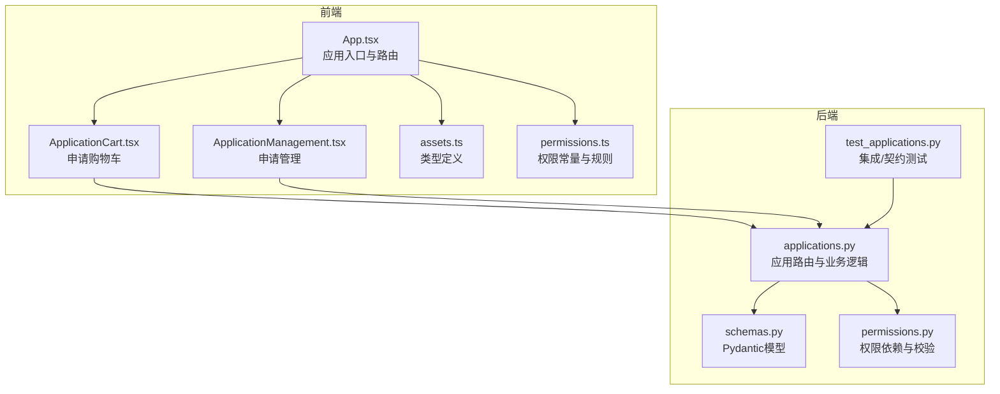
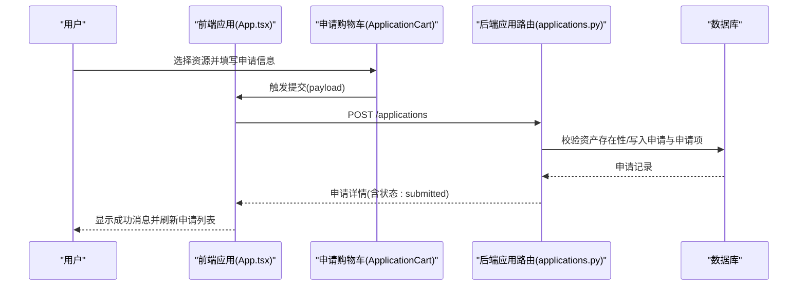
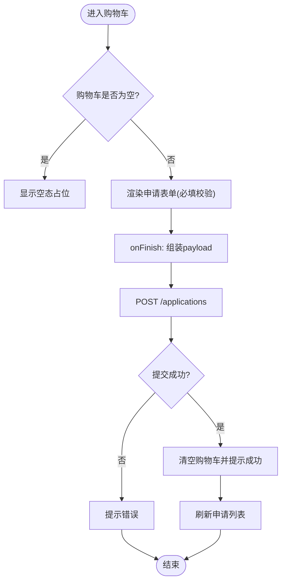
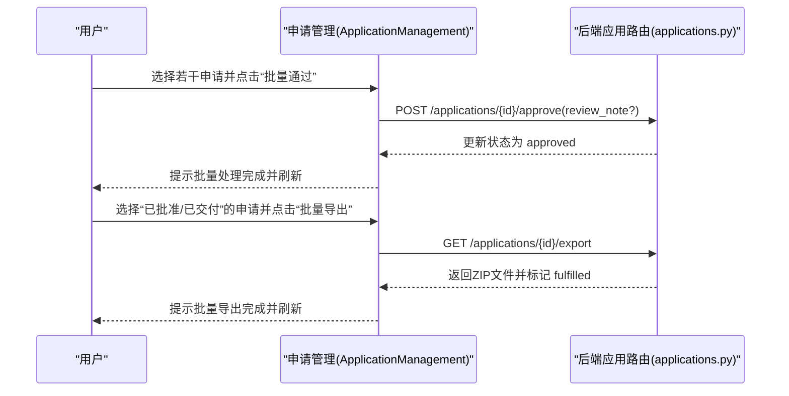
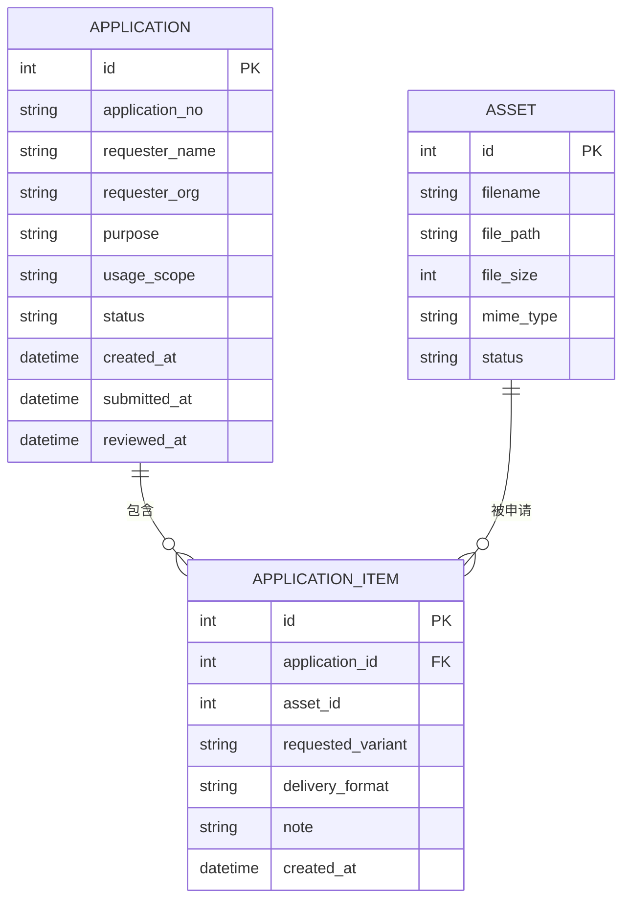
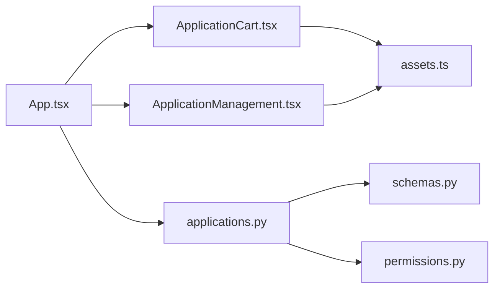

# 应用管理组件

<cite>
**本文档引用的文件**
- [ApplicationCart.tsx](file://frontend/src/components/ApplicationCart.tsx)
- [ApplicationManagement.tsx](file://frontend/src/components/ApplicationManagement.tsx)
- [assets.ts](file://frontend/src/types/assets.ts)
- [App.tsx](file://frontend/src/App.tsx)
- [permissions.ts](file://frontend/src/auth/permissions.ts)
- [applications.py](file://backend/app/routers/applications.py)
- [schemas.py](file://backend/app/schemas.py)
- [permissions.py](file://backend/app/permissions.py)
- [test_applications.py](file://backend/tests/test_applications.py)
</cite>

## 目录
1. [简介](#简介)
2. [项目结构](#项目结构)
3. [核心组件](#核心组件)
4. [架构总览](#架构总览)
5. [详细组件分析](#详细组件分析)
6. [依赖分析](#依赖分析)
7. [性能考虑](#性能考虑)
8. [故障排查指南](#故障排查指南)
9. [结论](#结论)
10. [附录](#附录)

## 简介
本文件面向“应用管理组件”，聚焦于前端两个核心模块：申请购物车（ApplicationCart）与申请管理（ApplicationManagement）。文档从设计与实现角度，系统阐述以下主题：
- 申请购物车如何收集用户选中的资源、维护申请备注、校验必填字段并统一提交为申请单；
- 申请管理如何呈现申请列表、支持批量筛选与状态统计、执行审批与导出交付包；
- 组件间的数据传递与状态同步机制（购物车状态由应用页共享，审批与导出通过后端API驱动）；
- 表单验证、数据绑定与用户交互细节；
- 权限控制与安全机制；
- 与后端API的交互方式与数据格式；
- 最佳实践与用户体验优化建议。

## 项目结构
前端采用组件化架构，应用管理相关代码位于 frontend/src/components 与 frontend/src/types/assets 中；后端在 backend/app/routers 与 backend/app/schemas 中提供REST接口与数据模型。

图表来源
- [App.tsx:100-402](file://frontend/src/App.tsx#L100-L402)
- [ApplicationCart.tsx:1-131](file://frontend/src/components/ApplicationCart.tsx#L1-L131)
- [ApplicationManagement.tsx:1-293](file://frontend/src/components/ApplicationManagement.tsx#L1-L293)
- [assets.ts:163-187](file://frontend/src/types/assets.ts#L163-L187)
- [applications.py:132-254](file://backend/app/routers/applications.py#L132-L254)
- [schemas.py:384-448](file://backend/app/schemas.py#L384-L448)
- [permissions.py:17-94](file://backend/app/permissions.py#L17-L94)

章节来源
- [App.tsx:100-402](file://frontend/src/App.tsx#L100-L402)
- [ApplicationCart.tsx:1-131](file://frontend/src/components/ApplicationCart.tsx#L1-L131)
- [ApplicationManagement.tsx:1-293](file://frontend/src/components/ApplicationManagement.tsx#L1-L293)
- [assets.ts:163-187](file://frontend/src/types/assets.ts#L163-L187)
- [applications.py:132-254](file://backend/app/routers/applications.py#L132-L254)
- [schemas.py:384-448](file://backend/app/schemas.py#L384-L448)
- [permissions.py:17-94](file://backend/app/permissions.py#L17-L94)

## 核心组件
- 申请购物车（ApplicationCart）
  - 负责收集用户选中的资源项（资产ID、资源ID、标题、清单URL、可选编号/来源标签），支持为每项填写备注；
  - 提供统一表单收集申请人信息与用途说明，并进行必填校验；
  - 将购物车内的资源与表单信息打包为后端申请创建请求体，提交后清空购物车并刷新申请列表。
- 申请管理（ApplicationManagement）
  - 展示申请列表，包含申请编号、申请人、用途、状态、审批备注、条目数量、提交时间等；
  - 支持按状态过滤与计数、多选勾选、批量通过/拒绝、批量导出；
  - 提供单个申请的通过/拒绝与导出按钮，导出时触发后端交付包生成并自动标记为“已交付”。

章节来源
- [ApplicationCart.tsx:8-20](file://frontend/src/components/ApplicationCart.tsx#L8-L20)
- [ApplicationManagement.tsx:10-16](file://frontend/src/components/ApplicationManagement.tsx#L10-L16)
- [assets.ts:163-187](file://frontend/src/types/assets.ts#L163-L187)

## 架构总览
前后端通过REST API交互，前端负责UI与状态管理，后端负责业务逻辑与持久化。权限通过会话令牌与角色授权控制。

图表来源
- [App.tsx:307-345](file://frontend/src/App.tsx#L307-L345)
- [ApplicationCart.tsx:52-84](file://frontend/src/components/ApplicationCart.tsx#L52-L84)
- [applications.py:132-174](file://backend/app/routers/applications.py#L132-L174)

章节来源
- [App.tsx:307-345](file://frontend/src/App.tsx#L307-L345)
- [ApplicationCart.tsx:52-84](file://frontend/src/components/ApplicationCart.tsx#L52-L84)
- [applications.py:132-174](file://backend/app/routers/applications.py#L132-L174)

## 详细组件分析

### 申请购物车（ApplicationCart）
- 数据结构
  - 资产项：包含资产ID、资源ID、标题、清单URL、可选编号与来源标签；
  - 备注：每项可独立填写用途/分辨率/交付说明等备注；
  - 表单字段：申请人、所属机构、联系邮箱、申请用途、使用范围（用途必填）。
- 表单验证与交互
  - 使用Ant Design表单组件，对申请人与用途进行必填校验；
  - 输入框支持文本域，便于描述复杂用途；
  - 提交后重置表单，保持连续操作体验。
- 与后端交互
  - 将购物车内的资产项转换为后端创建请求体，包含每个资产的变体与交付格式（当前固定为“current”与“image”），以及备注；
  - 成功后清空购物车并刷新申请列表。

图表来源
- [ApplicationCart.tsx:22-84](file://frontend/src/components/ApplicationCart.tsx#L22-L84)
- [App.tsx:307-345](file://frontend/src/App.tsx#L307-L345)

章节来源
- [ApplicationCart.tsx:8-20](file://frontend/src/components/ApplicationCart.tsx#L8-L20)
- [ApplicationCart.tsx:52-84](file://frontend/src/components/ApplicationCart.tsx#L52-L84)
- [App.tsx:307-345](file://frontend/src/App.tsx#L307-L345)

### 申请管理（ApplicationManagement）
- 列表与筛选
  - 展示申请编号、申请人/机构、用途、状态标签、审批备注、条目数、提交时间；
  - 支持按状态过滤与计数，顶部状态标签点击切换过滤条件；
  - 支持全选/反选，配合批量操作按钮。
- 审批与导出
  - 待审批状态显示“通过/拒绝”按钮，弹窗填写审批说明；
  - 已批准或已交付状态显示“导出交付包/重新导出”按钮；
  - 批量通过/拒绝与批量导出，分别对选中项逐一调用后端接口。
- 状态流转
  - 通过/拒绝更新状态与审批时间戳；
  - 导出触发后台打包任务，完成后标记为“已交付”。

图表来源
- [ApplicationManagement.tsx:64-101](file://frontend/src/components/ApplicationManagement.tsx#L64-L101)
- [ApplicationManagement.tsx:157-173](file://frontend/src/components/ApplicationManagement.tsx#L157-L173)
- [applications.py:203-232](file://backend/app/routers/applications.py#L203-L232)
- [applications.py:235-253](file://backend/app/routers/applications.py#L235-L253)

章节来源
- [ApplicationManagement.tsx:10-16](file://frontend/src/components/ApplicationManagement.tsx#L10-L16)
- [ApplicationManagement.tsx:43-62](file://frontend/src/components/ApplicationManagement.tsx#L43-L62)
- [ApplicationManagement.tsx:64-101](file://frontend/src/components/ApplicationManagement.tsx#L64-L101)
- [ApplicationManagement.tsx:157-173](file://frontend/src/components/ApplicationManagement.tsx#L157-L173)
- [applications.py:203-232](file://backend/app/routers/applications.py#L203-L232)
- [applications.py:235-253](file://backend/app/routers/applications.py#L235-L253)

### 类型与数据模型
- 前端类型
  - 申请购物车项：ApplicationCartItem，用于购物车UI与提交payload组装；
  - 申请汇总：ApplicationSummary，用于管理界面展示与状态统计。
- 后端模型
  - 创建请求体：ApplicationCreateRequest，包含申请人信息与资产项数组；
  - 审批请求体：ApplicationApproveRequest，包含审批说明；
  - 列表/详情响应：ApplicationListItem/ApplicationDetailResponse，包含状态标签与时间戳等。

图表来源
- [assets.ts:163-187](file://frontend/src/types/assets.ts#L163-L187)
- [schemas.py:384-448](file://backend/app/schemas.py#L384-L448)
- [applications.py:149-174](file://backend/app/routers/applications.py#L149-L174)

章节来源
- [assets.ts:163-187](file://frontend/src/types/assets.ts#L163-L187)
- [schemas.py:384-448](file://backend/app/schemas.py#L384-L448)
- [applications.py:149-174](file://backend/app/routers/applications.py#L149-L174)

## 依赖分析
- 前端依赖
  - ApplicationCart 依赖 ApplicationCartItem 类型与 Ant Design 表单组件；
  - ApplicationManagement 依赖 ApplicationSummary 类型、Ant Design 表格与模态框；
  - App.tsx 作为入口，协调购物车状态、权限判断与API调用。
- 后端依赖
  - applications.py 依赖 SQLAlchemy 模型与权限依赖 require_permission；
  - schemas.py 定义请求/响应模型，确保前后端数据契约一致。

图表来源
- [App.tsx:100-402](file://frontend/src/App.tsx#L100-L402)
- [ApplicationCart.tsx:1-131](file://frontend/src/components/ApplicationCart.tsx#L1-L131)
- [ApplicationManagement.tsx:1-293](file://frontend/src/components/ApplicationManagement.tsx#L1-L293)
- [assets.ts:163-187](file://frontend/src/types/assets.ts#L163-L187)
- [applications.py:132-254](file://backend/app/routers/applications.py#L132-L254)
- [schemas.py:384-448](file://backend/app/schemas.py#L384-L448)
- [permissions.py:17-94](file://backend/app/permissions.py#L17-L94)

章节来源
- [App.tsx:100-402](file://frontend/src/App.tsx#L100-L402)
- [ApplicationCart.tsx:1-131](file://frontend/src/components/ApplicationCart.tsx#L1-L131)
- [ApplicationManagement.tsx:1-293](file://frontend/src/components/ApplicationManagement.tsx#L1-L293)
- [assets.ts:163-187](file://frontend/src/types/assets.ts#L163-L187)
- [applications.py:132-254](file://backend/app/routers/applications.py#L132-L254)
- [schemas.py:384-448](file://backend/app/schemas.py#L384-L448)
- [permissions.py:17-94](file://backend/app/permissions.py#L17-L94)

## 性能考虑
- 前端
  - 购物车状态在应用级共享，避免重复渲染；提交后清空购物车减少内存占用；
  - 表单仅在提交时触发校验，降低无效渲染成本。
- 后端
  - 列表查询按时间倒序分页，避免一次性加载过多数据；
  - 导出采用后台任务清理临时目录，避免阻塞请求线程。

## 故障排查指南
- 提交申请失败
  - 检查购物车是否为空（后端要求至少一项）；
  - 确认资产ID是否存在（不存在会返回404）。
- 审批/导出失败
  - 确认当前状态是否允许操作（仅“已批准/已交付”可导出，“待处理”可审批）；
  - 查看后端日志定位权限不足或状态不匹配问题。
- 权限相关
  - 前端根据权限规则隐藏/显示菜单与按钮；
  - 后端通过 require_permission 与 require_any_permission 进行严格校验。

章节来源
- [applications.py:138-147](file://backend/app/routers/applications.py#L138-L147)
- [applications.py:243-244](file://backend/app/routers/applications.py#L243-L244)
- [permissions.ts:84-94](file://frontend/src/auth/permissions.ts#L84-L94)
- [permissions.py:214-236](file://backend/app/permissions.py#L214-L236)

## 结论
申请购物车与申请管理组件通过清晰的职责划分与严格的权限控制，实现了从资源选择、申请提交到审批与交付的完整闭环。前端负责交互与状态管理，后端提供稳定的数据契约与安全校验。建议在实际部署中结合测试用例持续验证流程正确性，并根据用户反馈优化表单提示与批量操作体验。

## 附录

### API定义与数据格式
- 创建申请
  - 方法与路径：POST /applications
  - 请求体：ApplicationCreateRequest（申请人信息 + 资产项数组）
  - 响应体：ApplicationDetailResponse（含状态：submitted）
- 获取申请列表
  - 方法与路径：GET /applications
  - 响应体：ApplicationListItem 数组
- 获取单个申请
  - 方法与路径：GET /applications/{application_id}
  - 响应体：ApplicationDetailResponse
- 审批申请
  - 方法与路径：POST /applications/{application_id}/approve
  - 请求体：ApplicationApproveRequest（review_note 可选）
  - 响应体：ApplicationDetailResponse（状态：approved）
- 拒绝申请
  - 方法与路径：POST /applications/{application_id}/reject
  - 请求体：ApplicationApproveRequest（review_note 可选）
  - 响应体：ApplicationDetailResponse（状态：rejected）
- 导出交付包
  - 方法与路径：GET /applications/{application_id}/export
  - 响应：application/zip 文件（下载），状态标记为 fulfilled

章节来源
- [applications.py:132-254](file://backend/app/routers/applications.py#L132-L254)
- [schemas.py:384-448](file://backend/app/schemas.py#L384-L448)

### 权限矩阵与菜单可见性
- 前端菜单可见性基于权限集合，如“申请车”（application.create）、“申请管理”（application.review / application.export / application.view_all）等；
- 后端角色到权限映射覆盖申请相关能力，系统管理员拥有最高权限。

章节来源
- [permissions.ts:84-94](file://frontend/src/auth/permissions.ts#L84-L94)
- [permissions.py:17-94](file://backend/app/permissions.py#L17-L94)

### 测试参考
- 集成/契约测试覆盖创建、审批与导出的关键流程，可作为回归测试基线。

章节来源
- [test_applications.py:31-129](file://backend/tests/test_applications.py#L31-L129)