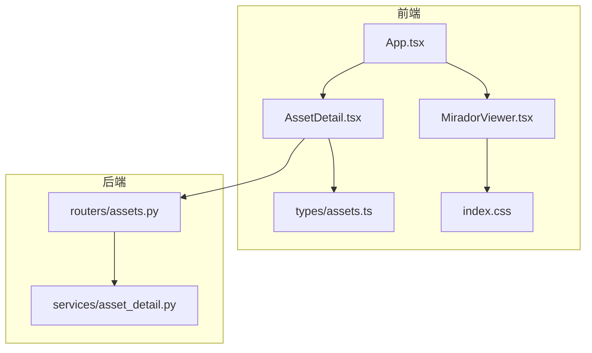
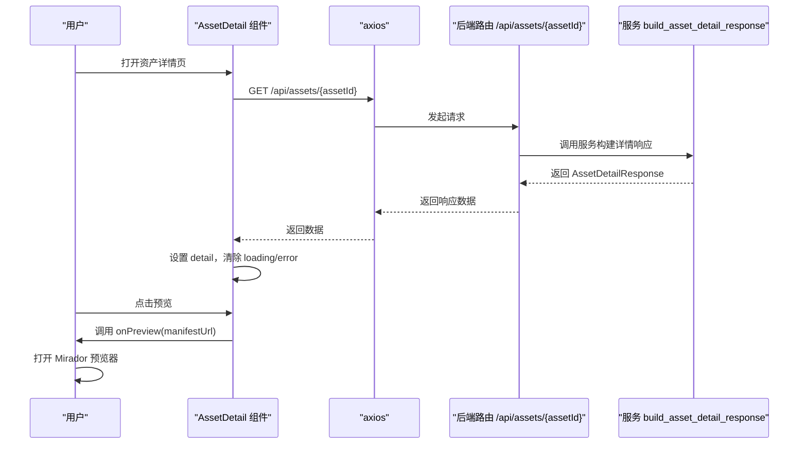
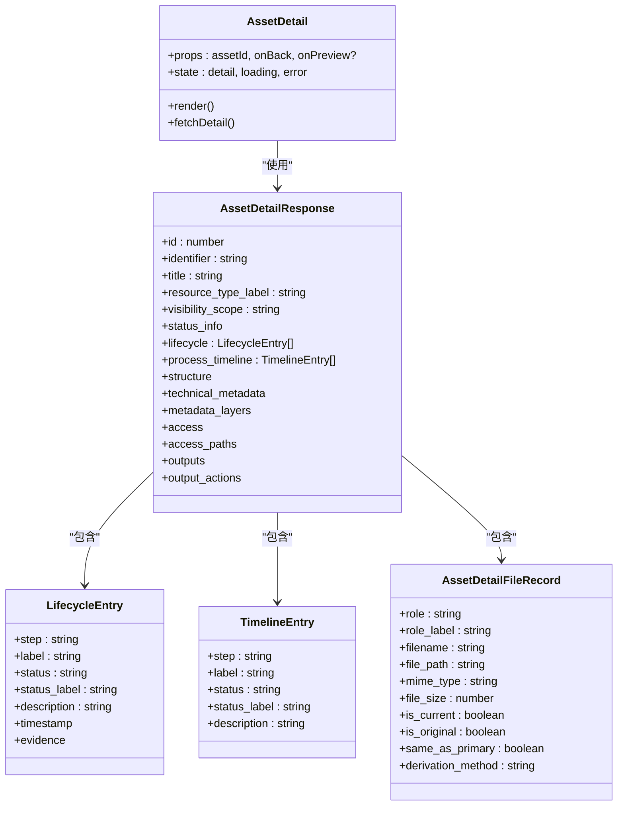

# 资产详情组件

<cite>
**本文引用的文件**
- [AssetDetail.tsx](file://frontend/src/components/AssetDetail.tsx)
- [assets.ts](file://frontend/src/types/assets.ts)
- [assets.py](file://backend/app/routers/assets.py)
- [asset_detail.py](file://backend/app/services/asset_detail.py)
- [App.tsx](file://frontend/src/App.tsx)
- [MiradorViewer.tsx](file://frontend/src/MiradorViewer.tsx)
- [index.css](file://frontend/src/index.css)
</cite>

## 目录
1. [简介](#简介)
2. [项目结构](#项目结构)
3. [核心组件](#核心组件)
4. [架构概览](#架构概览)
5. [详细组件分析](#详细组件分析)
6. [依赖关系分析](#依赖关系分析)
7. [性能考量](#性能考量)
8. [故障排查指南](#故障排查指南)
9. [结论](#结论)
10. [附录](#附录)

## 简介
本文件为资产详情组件（AssetDetail）的深度技术文档，面向前端工程师与产品/运营用户，系统性阐述组件的设计理念、数据结构、渲染逻辑、交互行为与错误处理策略，并提供最佳实践与性能优化建议。组件用于展示单个资源的完整信息，包括基本信息、生命周期事件、处理时间线、文件结构、技术元数据、分层元数据以及访问与输出能力；同时支持返回、预览（Mirador）、查看 IIIF Manifest、下载当前文件与 BagIt 包等操作。

## 项目结构
- 前端组件位于 frontend/src/components/AssetDetail.tsx，负责 UI 渲染与用户交互。
- 类型定义位于 frontend/src/types/assets.ts，确保前后端数据契约一致。
- 后端路由与服务位于 backend/app/routers/assets.py 与 backend/app/services/asset_detail.py，负责构建资产详情响应。
- 应用入口 App.tsx 中集成 AssetDetail 并与 Mirador 预览器联动。
- MiradorViewer.tsx 实现 IIIF 预览器的加载与状态反馈。

图表来源
- [AssetDetail.tsx:1-488](file://frontend/src/components/AssetDetail.tsx#L1-L488)
- [assets.ts:220-286](file://frontend/src/types/assets.ts#L220-L286)
- [assets.py:254-266](file://backend/app/routers/assets.py#L254-L266)
- [asset_detail.py:189-384](file://backend/app/services/asset_detail.py#L189-L384)
- [App.tsx:728-740](file://frontend/src/App.tsx#L728-L740)
- [MiradorViewer.tsx:64-399](file://frontend/src/MiradorViewer.tsx#L64-L399)
- [index.css:8-18](file://frontend/src/index.css#L8-L18)

章节来源
- [AssetDetail.tsx:1-488](file://frontend/src/components/AssetDetail.tsx#L1-L488)
- [assets.ts:220-286](file://frontend/src/types/assets.ts#L220-L286)
- [assets.py:254-266](file://backend/app/routers/assets.py#L254-L266)
- [asset_detail.py:189-384](file://backend/app/services/asset_detail.py#L189-L384)
- [App.tsx:728-740](file://frontend/src/App.tsx#L728-L740)
- [MiradorViewer.tsx:64-399](file://frontend/src/MiradorViewer.tsx#L64-L399)
- [index.css:8-18](file://frontend/src/index.css#L8-L18)

## 核心组件
- 组件职责
  - 展示资源基础信息（标题、统一标识、资源类型、可见范围、馆藏对象 ID、状态、创建时间）。
  - 展示生命周期事件与处理时间线。
  - 展示文件结构（主文件、原始文件、衍生文件、打包信息）。
  - 展示技术元数据（宽高、SHA256、入库/转换方式、原始文件路径、错误信息等）。
  - 展示分层元数据（核心、共享管理、技术影像、类型专属、原始元数据）。
  - 提供访问与输出能力（Mirador 预览、查看 IIIF Manifest、下载当前文件、下载 BagIt 包）。
- 组件 Props
  - assetId: number —— 资产 ID，用于发起详情请求。
  - onBack: () => void —— 返回回调，通常回到列表或统一资源详情。
  - onPreview?: (manifestUrl: string) => void —— 预览回调，传入 IIIF Manifest URL。
- 组件状态
  - detail: AssetDetailResponse | null —— 完整资产详情数据。
  - loading: boolean —— 加载中状态。
  - error: string | null —— 错误消息。
- 关键渲染函数
  - renderMetadataValue(value: unknown): 将任意值格式化为可读字符串。
  - renderMetadataSection(section?: Record<string, unknown>): 渲染元数据分组。
  - renderFileRecord(record: AssetDetailFileRecord, fallbackTitle: string): 渲染文件记录卡片。
  - renderLifecycleItem(item: LifecycleEntry): 渲染生命周期条目。
- 颜色映射
  - statusColorMap: 将状态码映射为标签颜色（ready、processing、error）。
  - timelineColorMap: 将时间线状态映射为标签颜色（done、pending、error）。

章节来源
- [AssetDetail.tsx:16-32](file://frontend/src/components/AssetDetail.tsx#L16-L32)
- [AssetDetail.tsx:194-197](file://frontend/src/components/AssetDetail.tsx#L194-L197)
- [AssetDetail.tsx:134-156](file://frontend/src/components/AssetDetail.tsx#L134-L156)
- [AssetDetail.tsx:158-178](file://frontend/src/components/AssetDetail.tsx#L158-L178)
- [AssetDetail.tsx:180-192](file://frontend/src/components/AssetDetail.tsx#L180-L192)
- [AssetDetail.tsx:22-32](file://frontend/src/components/AssetDetail.tsx#L22-L32)

## 架构概览
组件采用“请求-渲染-交互”的典型前端模式：
- 数据获取：通过 axios 请求后端 /api/assets/{assetId} 获取 AssetDetailResponse。
- 状态管理：本地 useState 管理 detail、loading、error；useEffect 在首次挂载时触发请求；当资源处于 processing 时，每 3 秒轮询刷新。
- 渲染：按模块化卡片组织展示（基本信息、生命周期、时间线、文件结构、技术元数据、分层元数据、访问与输出）。
- 交互：返回、预览（Mirador）、查看 Manifest、下载文件/包。

图表来源
- [AssetDetail.tsx:199-218](file://frontend/src/components/AssetDetail.tsx#L199-L218)
- [assets.py:254-266](file://backend/app/routers/assets.py#L254-L266)
- [asset_detail.py:189-384](file://backend/app/services/asset_detail.py#L189-L384)
- [App.tsx:736-739](file://frontend/src/App.tsx#L736-L739)

## 详细组件分析

### Props 接口与状态管理
- Props
  - assetId: number —— 资产唯一标识。
  - onBack: () => void —— 返回上一页。
  - onPreview?: (manifestUrl: string) => void —— 预览回调，传入 IIIF Manifest URL。
- 状态
  - detail: 初始为 null，成功后填充完整详情。
  - loading: 初为 true，请求完成后变为 false。
  - error: 初为 null，失败时设置错误消息。

章节来源
- [AssetDetail.tsx:16-20](file://frontend/src/components/AssetDetail.tsx#L16-L20)
- [AssetDetail.tsx:194-197](file://frontend/src/components/AssetDetail.tsx#L194-L197)

### 数据获取与处理逻辑
- 请求策略
  - 首次挂载即调用 fetchDetail。
  - 若 detail.status 为 processing，则每 3 秒静默轮询一次，避免阻塞用户交互。
- 错误处理
  - axios 异常时解析响应体中的 detail 字段作为错误消息；若无则显示通用失败提示。
- 数据结构
  - 使用类型定义 AssetDetailResponse，包含基础信息、状态信息、生命周期、处理时间线、文件结构、技术元数据、分层元数据、访问与输出等字段。

章节来源
- [AssetDetail.tsx:199-218](file://frontend/src/components/AssetDetail.tsx#L199-L218)
- [AssetDetail.tsx:220-228](file://frontend/src/components/AssetDetail.tsx#L220-L228)
- [assets.ts:220-286](file://frontend/src/types/assets.ts#L220-L286)

### 渲染函数详解
- renderMetadataValue
  - 处理空值、布尔、数组、对象等类型，统一转为可读字符串；数组以逗号连接，对象序列化为 JSON。
- renderMetadataSection
  - 将元数据对象映射为 Descriptions 表格，键通过 metadataLabelMap 映射为中文标签。
- renderFileRecord
  - 渲染文件记录卡片，包含文件角色、文件名、实际文件、MIME 类型、文件大小、文件路径、版本/原始标记、回退标题、衍生方式等。
- renderLifecycleItem
  - 渲染生命周期条目，包含标签、状态标签、描述、时间戳与证据。

章节来源
- [AssetDetail.tsx:134-156](file://frontend/src/components/AssetDetail.tsx#L134-L156)
- [AssetDetail.tsx:158-178](file://frontend/src/components/AssetDetail.tsx#L158-L178)
- [AssetDetail.tsx:180-192](file://frontend/src/components/AssetDetail.tsx#L180-L192)
- [AssetDetail.tsx:41-132](file://frontend/src/components/AssetDetail.tsx#L41-L132)

### 状态映射与颜色配置
- statusColorMap
  - ready → green；processing → blue；error → red。
- timelineColorMap
  - done → green；pending → blue；error → red。
- 使用场景
  - 资源状态标签与处理时间线状态标签均基于上述映射着色，提升可读性。

章节来源
- [AssetDetail.tsx:22-32](file://frontend/src/components/AssetDetail.tsx#L22-L32)

### 交互功能
- 返回按钮
  - 点击触发 onBack 回调，返回上一页。
- 预览功能
  - 通过 onPreview(manifestUrl) 打开预览；若未启用预览或无 Manifest URL，则禁用。
  - App.tsx 中将预览状态切换为可见，并传入当前 Manifest URL。
- 查看 IIIF Manifest
  - 点击在新窗口打开 manifest URL。
- 下载功能
  - 下载当前文件：根据 output_actions.download_current_file.url 执行跳转。
  - 下载 BagIt 包：根据 output_actions.download_bag.url 执行跳转。
- 文件大小格式化
  - formatBytes 将字节数格式化为人类可读的字符串（字节、KB、MB）。

章节来源
- [AssetDetail.tsx:273-290](file://frontend/src/components/AssetDetail.tsx#L273-L290)
- [AssetDetail.tsx:443-481](file://frontend/src/components/AssetDetail.tsx#L443-L481)
- [App.tsx:736-739](file://frontend/src/App.tsx#L736-L739)
- [AssetDetail.tsx:34-39](file://frontend/src/components/AssetDetail.tsx#L34-L39)

### 数据展示模块
- 基本信息
  - 标题、统一标识（支持复制）、资源类型、可见范围、馆藏对象 ID、状态（含颜色标签）、创建时间。
- 生命周期事件
  - 列表展示各阶段事件，包含标签、状态、描述、时间戳与证据。
- 处理时间线
  - 展示各步骤的标签、状态、描述；无时间线时提示“暂无处理时间线”。
- 文件结构
  - 主文件、原始文件、衍生文件分别渲染；衍生文件为空时提示“暂无衍生文件”。
  - 打包信息：基于 packaging 字段展示 BagIt 支持状态与说明。
- 技术元数据
  - 宽度、高度、SHA256（支持复制与代码样式）、入库方式、转换方式、原始文件路径、错误信息。
- 分层元数据
  - 结构版本与模板信息提示；按核心、共享管理、技术影像、类型专属、原始元数据分区块渲染。
- 访问与输出
  - Manifest 地址（支持复制）、预览状态、下载当前文件、下载 BagIt 包。

章节来源
- [AssetDetail.tsx:293-421](file://frontend/src/components/AssetDetail.tsx#L293-L421)
- [AssetDetail.tsx:423-482](file://frontend/src/components/AssetDetail.tsx#L423-L482)

### 后端数据构建与 API 对接
- 后端路由
  - GET /api/assets/{asset_id} 返回 AssetDetailResponse。
- 服务构建
  - build_asset_detail_response 负责组装：
    - 文件结构：主文件、原始文件、衍生文件（区分访问副本与预览图）。
    - 生命周期与处理时间线：基于资产状态与技术元数据推导。
    - 访问与输出：生成 Manifest URL、下载链接、预览可用性。
- 类型契约
  - 前端 types/assets.ts 的 AssetDetailResponse 与后端响应严格对齐。

章节来源
- [assets.py:254-266](file://backend/app/routers/assets.py#L254-L266)
- [asset_detail.py:189-384](file://backend/app/services/asset_detail.py#L189-L384)
- [assets.ts:220-286](file://frontend/src/types/assets.ts#L220-L286)

### 预览与 Mirador 集成
- 预览启用条件
  - 通过 access_paths.preview_enabled 或 access.preview_enabled 判断。
- 预览触发
  - AssetDetail 中点击“打开 Mirador”按钮，调用 onPreview(manifestUrl)。
- 预览器实现
  - MiradorViewer 负责加载 IIIF Manifest、初始化 Viewer、跟踪加载阶段与进度、首块瓦片渲染完成后的就绪状态。
  - 预览器样式通过 index.css 控制模态框尺寸与布局。

章节来源
- [AssetDetail.tsx:230-237](file://frontend/src/components/AssetDetail.tsx#L230-L237)
- [App.tsx:736-739](file://frontend/src/App.tsx#L736-L739)
- [MiradorViewer.tsx:64-399](file://frontend/src/MiradorViewer.tsx#L64-L399)
- [index.css:8-18](file://frontend/src/index.css#L8-L18)

## 依赖关系分析
- 组件依赖
  - axios：发起 HTTP 请求。
  - Ant Design：Card、Descriptions、List、Space、Spin、Tag、Typography、Button、Alert、Divider。
  - Ant Design Icons：ArrowLeftOutlined、DownloadOutlined、EyeOutlined、LinkOutlined。
  - 类型定义：assets.ts 中的 AssetDetailResponse、AssetDetailFileRecord、AssetTechnicalMetadata、AssetMetadataLayers、LifecycleEntry、TimelineEntry。
- 组件耦合
  - 与 App.tsx 的 onPreview/onBack 回调耦合，实现页面级导航与预览弹窗控制。
  - 与 MiradorViewer.tsx 的预览交互耦合，通过 manifest URL 传递。

图表来源
- [AssetDetail.tsx:194-485](file://frontend/src/components/AssetDetail.tsx#L194-L485)
- [assets.ts:220-313](file://frontend/src/types/assets.ts#L220-L313)

章节来源
- [AssetDetail.tsx:1-14](file://frontend/src/components/AssetDetail.tsx#L1-L14)
- [assets.ts:220-313](file://frontend/src/types/assets.ts#L220-L313)

## 性能考量
- 请求与轮询
  - 首次加载与静默轮询分离，避免阻塞 UI；仅在 processing 状态下进行轮询，减少不必要的网络请求。
- 渲染优化
  - 使用 useMemo 缓存 previewEnabled 与 manifestUrl，避免重复计算。
  - renderMetadataSection 与 renderFileRecord 仅在必要时重新渲染。
- 资源加载
  - 技术元数据与分层元数据按需渲染，避免一次性渲染大量数据导致卡顿。
- 预览体验
  - MiradorViewer 通过阶段性状态与进度条反馈加载过程，提升感知性能。

章节来源
- [AssetDetail.tsx:220-228](file://frontend/src/components/AssetDetail.tsx#L220-L228)
- [AssetDetail.tsx:230-237](file://frontend/src/components/AssetDetail.tsx#L230-L237)
- [MiradorViewer.tsx:64-197](file://frontend/src/MiradorViewer.tsx#L64-L197)

## 故障排查指南
- 加载失败
  - 现象：出现错误提示与返回按钮。
  - 排查：检查后端 /api/assets/{assetId} 是否可达；确认权限与可见性范围；查看浏览器网络面板与后端日志。
- 预览不可用
  - 现象：预览按钮禁用或点击无效。
  - 排查：确认 access_paths.preview_enabled 或 access.preview_enabled 为 true；检查 manifest URL 是否有效；验证 MiradorViewer 加载状态。
- 下载链接无效
  - 现象：下载按钮禁用或点击无响应。
  - 排查：确认 output_actions.download_current_file 或 download_bag.url 存在；检查后端输出路由与权限。
- 处理中资源长时间未更新
  - 现象：状态仍为 processing。
  - 排查：确认后端任务队列与衍生图生成流程；检查日志与数据库状态变更。

章节来源
- [AssetDetail.tsx:241-250](file://frontend/src/components/AssetDetail.tsx#L241-L250)
- [AssetDetail.tsx:443-481](file://frontend/src/components/AssetDetail.tsx#L443-L481)
- [assets.py:254-266](file://backend/app/routers/assets.py#L254-L266)

## 结论
AssetDetail 组件通过清晰的模块化渲染、完善的错误与加载状态管理、与后端服务的强类型契约以及与 Mirador 预览器的无缝集成，提供了完整的资产详情展示与交互体验。遵循本文的最佳实践与性能建议，可在保证用户体验的同时提升系统的稳定性与可维护性。

## 附录
- 最佳实践
  - 保持 props 与状态最小化，避免不必要的重渲染。
  - 使用 useMemo/memo 缓存昂贵计算与渲染结果。
  - 对用户输入与外部数据进行严格校验与容错处理。
  - 在复杂列表渲染中使用虚拟滚动或分页策略。
- 性能优化建议
  - 对大型分层元数据采用懒加载或折叠展示。
  - 对图片/文件大小等数值进行格式化缓存。
  - 合理设置轮询间隔与超时时间，避免频繁请求。
  - 预览器加载阶段采用骨架屏与进度条提升感知性能。