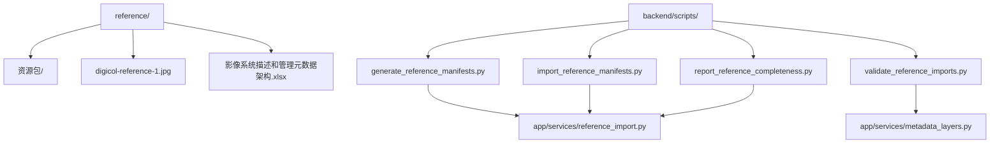
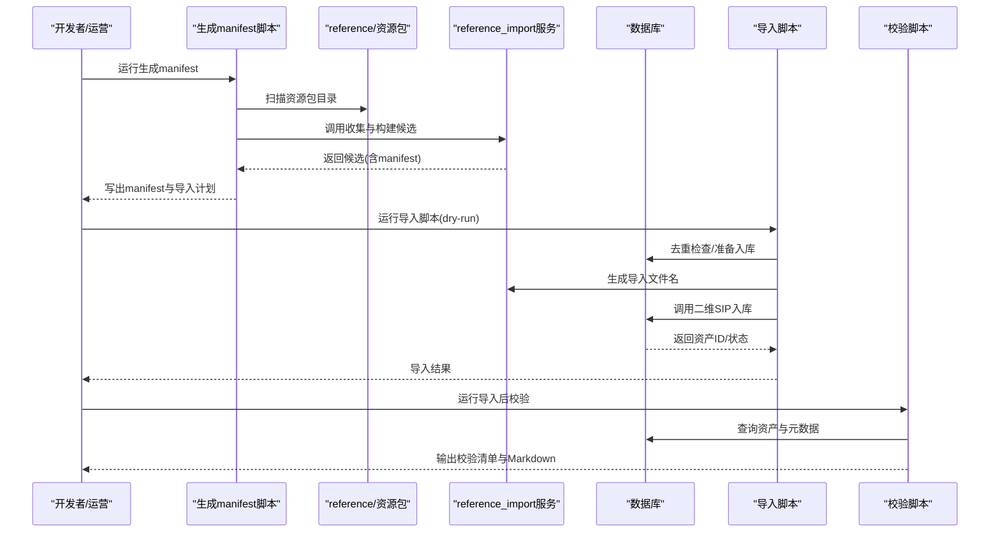
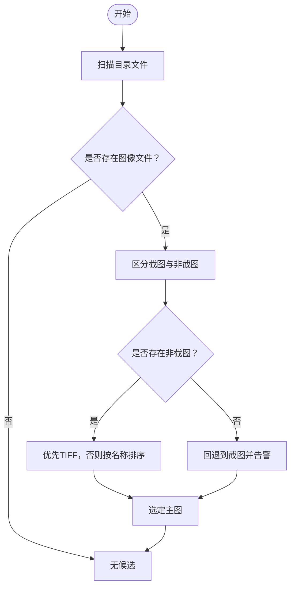
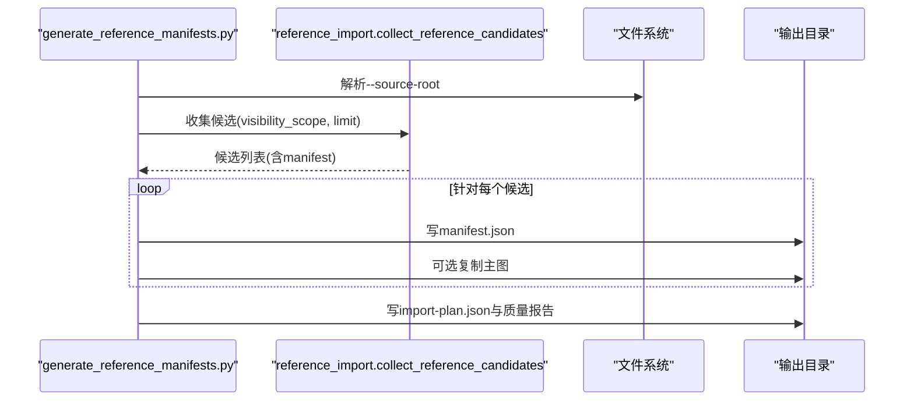
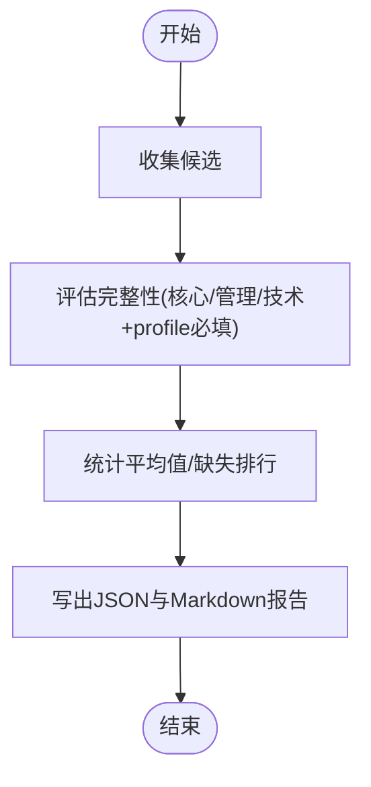
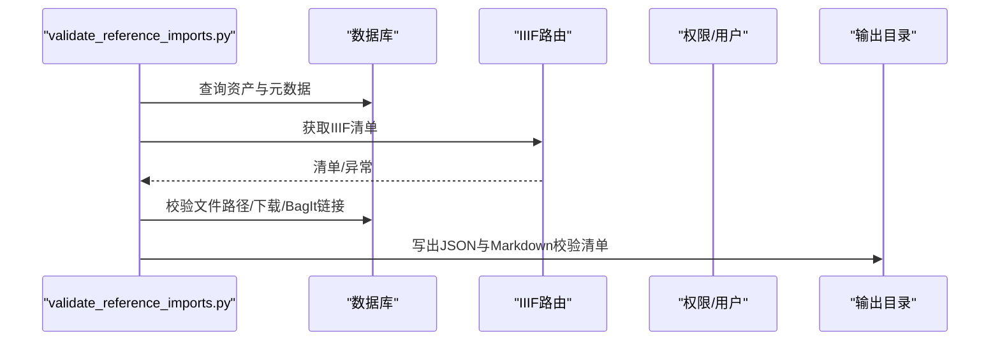
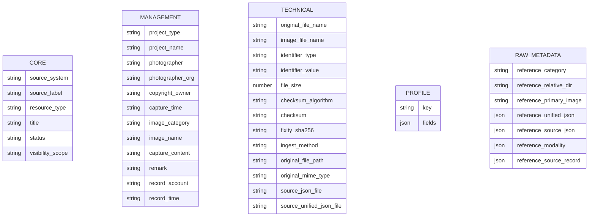
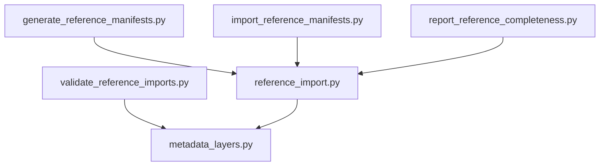

# 参考数据集与资源包

<cite>
**本文引用的文件**
- [REFERENCE_DATASET_GUIDE.md](file://docs/06-参考资料/REFERENCE_DATASET_GUIDE.md)
- [REFERENCE_RESOURCE_IMPORT_MAPPING.md](file://docs/06-参考资料/REFERENCE_RESOURCE_IMPORT_MAPPING.md)
- [UNIFIED_METADATA_EXAMPLE.md](file://docs/06-参考资料/UNIFIED_METADATA_EXAMPLE.md)
- [SCRIPT_AND_JOB_GUIDE.md](file://docs/05-部署与运维/SCRIPT_AND_JOB_GUIDE.md)
- [reference/资源包/业务活动影像/“金邻共曜”庆祝中泰建交50周年文物特展系列讲座——千年瓷缘：中国陶瓷在泰国的传播与影响 刘朝晖/04DSC02360_PMIM_125661642_0225105849.jpg](file://reference/资源包/业务活动影像/“金邻共曜”庆祝中泰建交50周年文物特展系列讲座——千年瓷缘：中国陶瓷在泰国的传播与影响 刘朝晖/04DSC02360_PMIM_125661642_0225105849.jpg)
- [reference/资源包/业务活动影像/故宫博物院标准化工作会议/06DSC02920_PMIM_125661642_0303123727.jpg](file://reference/资源包/业务活动影像/故宫博物院标准化工作会议/06DSC02920_PMIM_125661642_0303123727.jpg)
- [reference/资源包/其他影像/资料/haibao2_PMIM_139776574_0812024121.tif](file://reference/资源包/其他影像/资料/haibao2_PMIM_139776574_0812024121.tif)
- [reference/digicol-reference-1.jpg](file://reference/digicol-reference-1.jpg)
- [reference/影像系统描述和管理元数据架构.xlsx](file://reference/影像系统描述和管理元数据架构.xlsx)
- [generate_reference_manifests.py](file://backend/scripts/generate_reference_manifests.py)
- [import_reference_manifests.py](file://backend/scripts/import_reference_manifests.py)
- [report_reference_completeness.py](file://backend/scripts/report_reference_completeness.py)
- [validate_reference_imports.py](file://backend/scripts/validate_reference_imports.py)
- [reference_import.py](file://backend/app/services/reference_import.py)
- [metadata_layers.py](file://backend/app/services/metadata_layers.py)
</cite>

## 目录
1. [简介](#简介)
2. [项目结构](#项目结构)
3. [核心组件](#核心组件)
4. [架构总览](#架构总览)
5. [详细组件分析](#详细组件分析)
6. [依赖分析](#依赖分析)
7. [性能考虑](#性能考虑)
8. [故障排查指南](#故障排查指南)
9. [结论](#结论)
10. [附录](#附录)

## 简介
本文件面向MDAMS原型项目的参考数据集与资源包，系统性说明reference/目录的结构、用途与数据规范，梳理参考资源包、样例图片与元数据表格的组织方式；解释导入脚本与参考映射文档的关系，包括字段映射规则、数据转换逻辑与错误处理机制；提供导入流程、数据质量控制与最佳实践，并给出数据字典与字段说明，帮助研发与运营人员高效使用与扩展参考数据。

## 项目结构
- reference/ 是参考样例与导入素材目录，非运行时依赖，主要用于：
  - 参考导入
  - 元数据映射验证
  - 二维资源样例构造
  - 工作流与平台演示
- 典型内容包括：
  - 资源包/：按主题分类的参考资源集合（如业务活动影像、其他影像、古树影像、文物建筑影像、文物影像、考古影像）
  - digicol-reference-1.jpg：样例图片
  - 影像系统描述和管理元数据架构.xlsx：元数据表格
- backend/scripts/ 提供与reference/配套的导入与校验脚本，形成从“生成manifest”到“导入入库”再到“校验”的闭环。

图表来源
- [REFERENCE_DATASET_GUIDE.md:10-58](file://docs/06-参考资料/REFERENCE_DATASET_GUIDE.md#L10-L58)
- [SCRIPT_AND_JOB_GUIDE.md:12-49](file://docs/05-部署与运维/SCRIPT_AND_JOB_GUIDE.md#L12-L49)

章节来源
- [REFERENCE_DATASET_GUIDE.md:10-58](file://docs/06-参考资料/REFERENCE_DATASET_GUIDE.md#L10-L58)
- [SCRIPT_AND_JOB_GUIDE.md:12-49](file://docs/05-部署与运维/SCRIPT_AND_JOB_GUIDE.md#L12-L49)

## 核心组件
- 参考资源包
  - 结构：按主题分类的资源子目录，每个子目录通常包含一张主图、若干截图、一份源侧车JSON与一份统一侧车JSON。
  - 主图选择规则：优先非截图、偏好TIFF、若仅有截图则回退并告警。
- 导入脚本族
  - 生成manifest：扫描资源包，输出每个资源的manifest与导入计划摘要。
  - 导入入库：调用二维SIP入库链路，支持dry-run与去重。
  - 完整性报告：统计各profile字段填充情况，输出平均值与缺失项排行。
  - 导入后校验：校验Manifest、下载与BagIt可用性，输出清单。
- 映射与规范化
  - 外部参考包值与内部profile键存在差异，需进行映射与归一化。
  - 统一元数据示例文档提供字段风格与层级参考。

章节来源
- [REFERENCE_RESOURCE_IMPORT_MAPPING.md:14-57](file://docs/06-参考资料/REFERENCE_RESOURCE_IMPORT_MAPPING.md#L14-L57)
- [REFERENCE_RESOURCE_IMPORT_MAPPING.md:25-33](file://docs/06-参考资料/REFERENCE_RESOURCE_IMPORT_MAPPING.md#L25-L33)
- [generate_reference_manifests.py:53-115](file://backend/scripts/generate_reference_manifests.py#L53-L115)
- [import_reference_manifests.py:34-113](file://backend/scripts/import_reference_manifests.py#L34-L113)
- [report_reference_completeness.py:46-78](file://backend/scripts/report_reference_completeness.py#L46-L78)
- [validate_reference_imports.py:52-150](file://backend/scripts/validate_reference_imports.py#L52-L150)
- [REFERENCE_RESOURCE_IMPORT_MAPPING.md:34-57](file://docs/06-参考资料/REFERENCE_RESOURCE_IMPORT_MAPPING.md#L34-L57)
- [UNIFIED_METADATA_EXAMPLE.md:20-42](file://docs/06-参考资料/UNIFIED_METADATA_EXAMPLE.md#L20-L42)

## 架构总览
下图展示了从参考资源包到生成manifest、导入入库与校验的整体流程，以及关键模块间的交互关系。

图表来源
- [generate_reference_manifests.py:53-115](file://backend/scripts/generate_reference_manifests.py#L53-L115)
- [import_reference_manifests.py:34-113](file://backend/scripts/import_reference_manifests.py#L34-L113)
- [validate_reference_imports.py:52-150](file://backend/scripts/validate_reference_imports.py#L52-L150)
- [reference_import.py:359-377](file://backend/app/services/reference_import.py#L359-L377)

## 详细组件分析

### 参考资源包结构与主图选择
- 每个资源包子目录通常包含：
  - 一张主图（.jpg/.jpeg/.tif/.tiff/.png/.psb）
  - 若干截图（FireShot Capture *.jpg）
  - 一份源侧车JSON与一份统一侧车JSON
- 主图选择策略：
  - 仅选图像文件
  - 若存在非截图图像，优先非截图
  - 在非截图中优先TIFF
  - 若仅含截图，则回退并记录警告

图表来源
- [REFERENCE_RESOURCE_IMPORT_MAPPING.md:25-33](file://docs/06-参考资料/REFERENCE_RESOURCE_IMPORT_MAPPING.md#L25-L33)
- [reference_import.py:91-99](file://backend/app/services/reference_import.py#L91-L99)

章节来源
- [REFERENCE_RESOURCE_IMPORT_MAPPING.md:16-33](file://docs/06-参考资料/REFERENCE_RESOURCE_IMPORT_MAPPING.md#L16-L33)
- [reference_import.py:91-99](file://backend/app/services/reference_import.py#L91-L99)

### 字段映射与规范化
- 外部参考包值与内部profile键不完全一致，需进行映射与归一化：
  - 外部值到内部键映射表
  - 文件夹类别到内部profile键映射表
- 统一元数据示例文档提供了字段风格与层级参考，有助于保持跨模态一致性。

图表来源
- [REFERENCE_RESOURCE_IMPORT_MAPPING.md:34-57](file://docs/06-参考资料/REFERENCE_RESOURCE_IMPORT_MAPPING.md#L34-L57)
- [reference_import.py:139-143](file://backend/app/services/reference_import.py#L139-L143)

章节来源
- [REFERENCE_RESOURCE_IMPORT_MAPPING.md:34-57](file://docs/06-参考资料/REFERENCE_RESOURCE_IMPORT_MAPPING.md#L34-L57)
- [UNIFIED_METADATA_EXAMPLE.md:20-42](file://docs/06-参考资料/UNIFIED_METADATA_EXAMPLE.md#L20-L42)

### manifest生成与导入计划
- 生成脚本负责：
  - 收集候选（遍历资源包子目录）
  - 为每个候选生成manifest
  - 输出导入计划JSON与质量报告
- 导入脚本负责：
  - 读取候选并生成导入文件名
  - 调用二维SIP入库链路
  - 支持dry-run与重复跳过

图表来源
- [generate_reference_manifests.py:53-115](file://backend/scripts/generate_reference_manifests.py#L53-L115)
- [reference_import.py:359-377](file://backend/app/services/reference_import.py#L359-L377)

章节来源
- [generate_reference_manifests.py:53-115](file://backend/scripts/generate_reference_manifests.py#L53-L115)
- [import_reference_manifests.py:34-113](file://backend/scripts/import_reference_manifests.py#L34-L113)

### 完整性评估与报告
- 报告脚本负责：
  - 评估每个manifest的字段完整性
  - 按profile分组输出平均完成度
  - 统计缺失字段排行与逐条明细
- 评估规则：
  - 核心/管理/技术三段的关键字段
  - 各profile所需的必填字段

图表来源
- [report_reference_completeness.py:46-78](file://backend/scripts/report_reference_completeness.py#L46-L78)
- [reference_import.py:380-420](file://backend/app/services/reference_import.py#L380-L420)

章节来源
- [report_reference_completeness.py:46-78](file://backend/scripts/report_reference_completeness.py#L46-L78)
- [reference_import.py:15-19](file://backend/app/services/reference_import.py#L15-L19)
- [reference_import.py:405-411](file://backend/app/services/reference_import.py#L405-L411)

### 导入后校验
- 校验脚本负责：
  - 获取IIIF清单并检查items
  - 校验物理文件存在性与下载/BagIt链接
  - 检查业务活动主地点字段完整性
  - 输出JSON与Markdown清单

图表来源
- [validate_reference_imports.py:52-150](file://backend/scripts/validate_reference_imports.py#L52-L150)

章节来源
- [validate_reference_imports.py:52-150](file://backend/scripts/validate_reference_imports.py#L52-L150)

### 数据模型与字段字典
- 统一元数据示例文档提供了顶层公共字段、子系统字段与图像对象示例，便于理解字段含义与层级。
- 元数据分层与字段标签由metadata_layers服务定义，涵盖：
  - 核心字段（如visibility_scope、resource_type、status等）
  - 管理字段（如photographer、capture_time、image_category等）
  - 技术字段（如file_size、checksum、original_file_path等）
  - profile字段（按不同profile定义的必填与可选字段）

图表来源
- [UNIFIED_METADATA_EXAMPLE.md:20-42](file://docs/06-参考资料/UNIFIED_METADATA_EXAMPLE.md#L20-L42)
- [metadata_layers.py:30-86](file://backend/app/services/metadata_layers.py#L30-L86)
- [metadata_layers.py:88-191](file://backend/app/services/metadata_layers.py#L88-L191)
- [reference_import.py:268-316](file://backend/app/services/reference_import.py#L268-L316)

章节来源
- [UNIFIED_METADATA_EXAMPLE.md:20-42](file://docs/06-参考资料/UNIFIED_METADATA_EXAMPLE.md#L20-L42)
- [metadata_layers.py:30-86](file://backend/app/services/metadata_layers.py#L30-L86)
- [metadata_layers.py:88-191](file://backend/app/services/metadata_layers.py#L88-L191)
- [reference_import.py:268-316](file://backend/app/services/reference_import.py#L268-L316)

## 依赖分析
- 组件耦合与职责
  - generate_reference_manifests.py 与 import_reference_manifests.py 均依赖 reference_import.collect_reference_candidates 与 build_reference_manifest，形成“候选收集—manifest生成—导入”的主干流程。
  - report_reference_completeness.py 依赖 assess_manifest_completeness 评估字段完整性。
  - validate_reference_imports.py 依赖IIIF路由与资产详情服务，校验导入后可用性。
- 外部依赖
  - 脚本通过环境变量DATABASE_URL与UPLOAD_DIR与后端服务交互。
  - 脚本与服务通过Python模块导入建立运行时依赖。

图表来源
- [generate_reference_manifests.py:66](file://backend/scripts/generate_reference_manifests.py#L66)
- [import_reference_manifests.py:57](file://backend/scripts/import_reference_manifests.py#L57)
- [report_reference_completeness.py:57](file://backend/scripts/report_reference_completeness.py#L57)
- [validate_reference_imports.py:68](file://backend/scripts/validate_reference_imports.py#L68)
- [reference_import.py:10](file://backend/app/services/reference_import.py#L10)
- [metadata_layers.py:7](file://backend/app/services/metadata_layers.py#L7)

章节来源
- [generate_reference_manifests.py:66](file://backend/scripts/generate_reference_manifests.py#L66)
- [import_reference_manifests.py:57](file://backend/scripts/import_reference_manifests.py#L57)
- [report_reference_completeness.py:57](file://backend/scripts/report_reference_completeness.py#L57)
- [validate_reference_imports.py:68](file://backend/scripts/validate_reference_imports.py#L68)
- [reference_import.py:10](file://backend/app/services/reference_import.py#L10)
- [metadata_layers.py:7](file://backend/app/services/metadata_layers.py#L7)

## 性能考虑
- I/O与计算开销
  - 主图哈希计算采用分块读取，避免大文件一次性加载内存。
  - 文件复制与写入采用批量处理，建议在磁盘空间充足时启用“staging”以便快速定位问题。
- 并发与批处理
  - 导入脚本按候选顺序逐一处理，支持limit与dry-run减少风险。
  - 建议在大规模导入时结合limit与分批执行，配合完整性与校验报告迭代优化。
- 存储与缓存
  - 建议将上传目录与数据库置于高性能存储，确保导入与IIIF访问性能。

章节来源
- [reference_import.py:107-115](file://backend/app/services/reference_import.py#L107-L115)
- [generate_reference_manifests.py:90-94](file://backend/scripts/generate_reference_manifests.py#L90-L94)
- [import_reference_manifests.py:71-78](file://backend/scripts/import_reference_manifests.py#L71-L78)

## 故障排查指南
- 常见问题与定位
  - 缺失主图：检查资源包子目录是否包含有效图像文件；若仅含截图，将触发回退并记录警告。
  - 缺失侧车JSON：生成与导入均会记录缺失项，建议补齐后再执行。
  - 编码问题（mojibake）：侧车JSON中若存在编码异常，将被标记为质量旗标，建议修复源数据。
  - 重复导入：导入脚本会基于文件名去重，重复资源会被跳过。
  - 导入后可用性：校验脚本检查IIIF清单、下载链接与BagIt链接，失败时输出详细备注。
- 建议流程
  - dry-run先行，确认候选与导入计划
  - 生成完整性报告，优先补齐缺失字段
  - 执行导入后立即运行校验脚本
  - 对于业务活动类，确保主地点字段完整

章节来源
- [reference_import.py:318-356](file://backend/app/services/reference_import.py#L318-L356)
- [import_reference_manifests.py:71-78](file://backend/scripts/import_reference_manifests.py#L71-L78)
- [validate_reference_imports.py:88-135](file://backend/scripts/validate_reference_imports.py#L88-L135)

## 结论
reference/目录是MDAMS原型项目的重要参考数据源，配合生成、导入、报告与校验脚本，形成了从样例构造到质量控制的完整闭环。通过统一的字段映射与规范化策略，以及清晰的manifest结构，团队可以高效地扩展数据集、验证映射正确性并保障导入质量。建议在新增参考目录时同步更新映射文档与脚本参数，持续完善数据字典与最佳实践。

## 附录

### 使用示例与最佳实践
- 创建新的参考数据
  - 在资源包/下新建子目录，按“主图+截图+侧车JSON”的结构组织
  - 优先使用非截图图像，偏好TIFF格式
  - 补齐统一侧车JSON与源侧车JSON，避免质量旗标
- 扩展数据集
  - 新增子目录后，先运行生成manifest脚本，确认候选与质量报告
  - 使用dry-run导入，核对导入计划与去重情况
  - 导入后立即运行校验脚本，修复失败项
- 数据质量控制
  - 定期运行完整性报告，关注缺失字段与平均完成度
  - 对业务活动类资源，确保主地点字段完整
  - 对编码异常的侧车JSON，建议修复源数据而非自动修复

章节来源
- [REFERENCE_DATASET_GUIDE.md:59-68](file://docs/06-参考资料/REFERENCE_DATASET_GUIDE.md#L59-L68)
- [SCRIPT_AND_JOB_GUIDE.md:88-96](file://docs/05-部署与运维/SCRIPT_AND_JOB_GUIDE.md#L88-L96)

### 参考数据与导入映射文档的关系
- 参考映射文档定义了：
  - 源包形态与主图选择规则
  - 外部值到内部profile键的映射
  - manifest字段映射与分层写入策略
  - 已知限制与生成输出
- 服务层实现：
  - 收集候选、构建manifest、评估完整性、生成导入文件名
  - 与metadata_layers协作，保证字段标签与分层结构一致

章节来源
- [REFERENCE_RESOURCE_IMPORT_MAPPING.md:14-146](file://docs/06-参考资料/REFERENCE_RESOURCE_IMPORT_MAPPING.md#L14-L146)
- [reference_import.py:359-420](file://backend/app/services/reference_import.py#L359-L420)
- [metadata_layers.py:412-507](file://backend/app/services/metadata_layers.py#L412-L507)