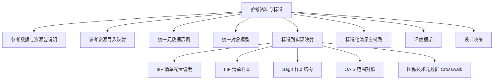
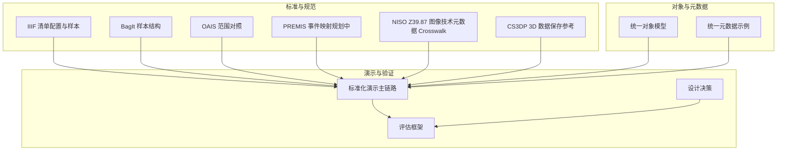
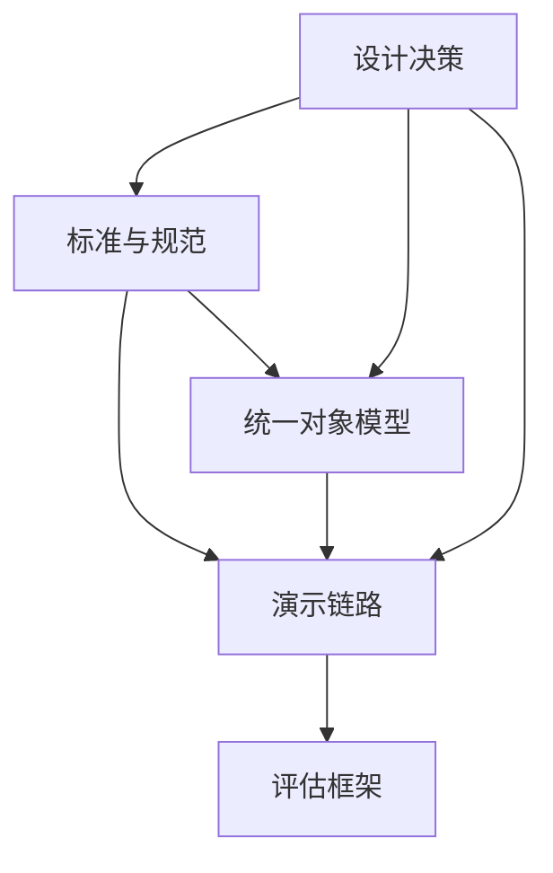

# 参考资料与标准

<cite>
**本文引用的文件**
- [REFERENCE_DATASET_GUIDE.md](file://docs/06-参考资料/REFERENCE_DATASET_GUIDE.md)
- [REFERENCE_RESOURCE_IMPORT_MAPPING.md](file://docs/06-参考资料/REFERENCE_RESOURCE_IMPORT_MAPPING.md)
- [UNIFIED_METADATA_EXAMPLE.md](file://docs/06-参考资料/UNIFIED_METADATA_EXAMPLE.md)
- [UNIFIED_OBJECT_MODEL.md](file://docs/08-研究/统一对象模型（UNIFIED_OBJECT_MODEL）.md)
- [STANDARDS_TO_IMPLEMENTATION_MAPPING.md](file://docs/08-研究/标准到实现映射（STANDARDS_TO_IMPLEMENTATION_MAPPING）.md)
- [IIIF_MANIFEST_SAMPLE.md](file://docs/08-研究/IIIF清单样本（IIIF_MANIFEST_SAMPLE）.md)
- [IIIF_MANIFEST_PROFILE.md](file://docs/08-研究/IIIF清单配置说明（IIIF_MANIFEST_PROFILE）.md)
- [IMAGE_METADATA_CROSSWALK.md](file://docs/08-研究/图像技术元数据映射（IMAGE_METADATA_CROSSWALK）.md)
- [OAIS_SCOPE_MAP.md](file://docs/08-研究/OAIS范围对照（OAIS_SCOPE_MAP）.md)
- [BAGIT_SAMPLE_STRUCTURE.md](file://docs/08-研究/BagIt样本结构（BAGIT_SAMPLE_STRUCTURE）.md)
- [STANDARDIZED_DEMO_CHAINS.md](file://docs/08-研究/标准化演示主链路（STANDARDIZED_DEMO_CHAINS）.md)
- [EVALUATION_FRAMEWORK.md](file://docs/08-研究/评估框架（EVALUATION_FRAMEWORK）.md)
- [DESIGN_DECISIONS.md](file://docs/08-研究/设计决策（DESIGN_DECISIONS）.md)
</cite>

## 目录
1. [简介](#简介)
2. [项目结构](#项目结构)
3. [核心组件](#核心组件)
4. [架构总览](#架构总览)
5. [详细组件分析](#详细组件分析)
6. [依赖分析](#依赖分析)
7. [性能考虑](#性能考虑)
8. [故障排查指南](#故障排查指南)
9. [结论](#结论)
10. [附录](#附录)

## 简介
本文件为 MDAMS 原型项目的参考资料与标准汇编，聚焦以下目标：
- 系统梳理并解释项目已采纳与正在对齐的行业标准与规范（IIIF、BagIt、OAIS、PREMIS、NISO Z39.87、CS3DP 等）
- 说明参考数据集的使用与管理：数据格式、字段定义、示例数据、导入方法
- 介绍统一对象模型的设计与应用：实体定义、关系映射、属性规范、扩展机制
- 明确标准到实现的映射关系：标准条款、实现方案、兼容性处理、版本演进
- 汇总研究文献与参考资料：学术论文、技术报告、白皮书、最佳实践
- 提供术语表与概念解释，帮助新用户理解专业术语
- 给出标准合规性检查与验证方法，包含具体的标准文档与参考示例

## 项目结构
本节概述与“参考资料与标准”主题直接相关的文档与研究材料分布，便于快速定位与交叉引用。

**图表来源**
- [REFERENCE_DATASET_GUIDE.md:1-69](file://docs/06-参考资料/REFERENCE_DATASET_GUIDE.md#L1-L69)
- [REFERENCE_RESOURCE_IMPORT_MAPPING.md:1-146](file://docs/06-参考资料/REFERENCE_RESOURCE_IMPORT_MAPPING.md#L1-L146)
- [UNIFIED_METADATA_EXAMPLE.md:1-284](file://docs/06-参考资料/UNIFIED_METADATA_EXAMPLE.md#L1-L284)
- [UNIFIED_OBJECT_MODEL.md:1-130](file://docs/08-研究/统一对象模型（UNIFIED_OBJECT_MODEL）.md#L1-L130)
- [STANDARDS_TO_IMPLEMENTATION_MAPPING.md:1-249](file://docs/08-研究/标准到实现映射（STANDARDS_TO_IMPLEMENTATION_MAPPING）.md#L1-L249)
- [IIIF_MANIFEST_PROFILE.md:1-196](file://docs/08-研究/IIIF清单配置说明（IIIF_MANIFEST_PROFILE）.md#L1-L196)
- [IIIF_MANIFEST_SAMPLE.md:1-141](file://docs/08-研究/IIIF清单样本（IIIF_MANIFEST_SAMPLE）.md#L1-L141)
- [BAGIT_SAMPLE_STRUCTURE.md:1-88](file://docs/08-研究/BagIt样本结构（BAGIT_SAMPLE_STRUCTURE）.md#L1-L88)
- [OAIS_SCOPE_MAP.md:1-117](file://docs/08-研究/OAIS范围对照（OAIS_SCOPE_MAP）.md#L1-L117)
- [IMAGE_METADATA_CROSSWALK.md:1-178](file://docs/08-研究/图像技术元数据映射（IMAGE_METADATA_CROSSWALK）.md#L1-L178)
- [STANDARDIZED_DEMO_CHAINS.md:1-237](file://docs/08-研究/标准化演示主链路（STANDARDIZED_DEMO_CHAINS）.md#L1-L237)
- [EVALUATION_FRAMEWORK.md:1-74](file://docs/08-研究/评估框架（EVALUATION_FRAMEWORK）.md#L1-L74)
- [DESIGN_DECISIONS.md:1-110](file://docs/08-研究/设计决策（DESIGN_DECISIONS）.md#L1-L110)

**章节来源**
- [REFERENCE_DATASET_GUIDE.md:1-69](file://docs/06-参考资料/REFERENCE_DATASET_GUIDE.md#L1-L69)
- [REFERENCE_RESOURCE_IMPORT_MAPPING.md:1-146](file://docs/06-参考资料/REFERENCE_RESOURCE_IMPORT_MAPPING.md#L1-L146)
- [UNIFIED_METADATA_EXAMPLE.md:1-284](file://docs/06-参考资料/UNIFIED_METADATA_EXAMPLE.md#L1-L284)
- [UNIFIED_OBJECT_MODEL.md:1-130](file://docs/08-研究/统一对象模型（UNIFIED_OBJECT_MODEL）.md#L1-L130)
- [STANDARDS_TO_IMPLEMENTATION_MAPPING.md:1-249](file://docs/08-研究/标准到实现映射（STANDARDS_TO_IMPLEMENTATION_MAPPING）.md#L1-L249)
- [IIIF_MANIFEST_PROFILE.md:1-196](file://docs/08-研究/IIIF清单配置说明（IIIF_MANIFEST_PROFILE）.md#L1-L196)
- [IIIF_MANIFEST_SAMPLE.md:1-141](file://docs/08-研究/IIIF清单样本（IIIF_MANIFEST_SAMPLE）.md#L1-L141)
- [BAGIT_SAMPLE_STRUCTURE.md:1-88](file://docs/08-研究/BagIt样本结构（BAGIT_SAMPLE_STRUCTURE）.md#L1-L88)
- [OAIS_SCOPE_MAP.md:1-117](file://docs/08-研究/OAIS范围对照（OAIS_SCOPE_MAP）.md#L1-L117)
- [IMAGE_METADATA_CROSSWALK.md:1-178](file://docs/08-研究/图像技术元数据映射（IMAGE_METADATA_CROSSWALK）.md#L1-L178)
- [STANDARDIZED_DEMO_CHAINS.md:1-237](file://docs/08-研究/标准化演示主链路（STANDARDIZED_DEMO_CHAINS）.md#L1-L237)
- [EVALUATION_FRAMEWORK.md:1-74](file://docs/08-研究/评估框架（EVALUATION_FRAMEWORK）.md#L1-L74)
- [DESIGN_DECISIONS.md:1-110](file://docs/08-研究/设计决策（DESIGN_DECISIONS）.md#L1-L110)

## 核心组件
- 参考数据与资源包：用于导入、元数据映射验证、二维资源样例构造与工作流演示
- 统一元数据模型：顶层公共字段、子系统专有字段、跨系统关联关系与接口返回示例
- 统一对象模型：以数字资产为核心，辅以协作对象、资源扩展对象、表示与聚合对象
- 标准到实现映射：IIIF、BagIt、OAIS、PREMIS、NISO Z39.87、CS3DP 的对齐级别与差距
- 标准化演示主链路：二维资产主链路、图像记录协作链路、三维对象与统一平台链路
- 评估框架与设计决策：原型评估维度、设计取舍与研究解释力

**章节来源**
- [REFERENCE_DATASET_GUIDE.md:1-69](file://docs/06-参考资料/REFERENCE_DATASET_GUIDE.md#L1-L69)
- [UNIFIED_METADATA_EXAMPLE.md:1-284](file://docs/06-参考资料/UNIFIED_METADATA_EXAMPLE.md#L1-L284)
- [UNIFIED_OBJECT_MODEL.md:1-130](file://docs/08-研究/统一对象模型（UNIFIED_OBJECT_MODEL）.md#L1-L130)
- [STANDARDS_TO_IMPLEMENTATION_MAPPING.md:1-249](file://docs/08-研究/标准到实现映射（STANDARDS_TO_IMPLEMENTATION_MAPPING）.md#L1-L249)
- [STANDARDIZED_DEMO_CHAINS.md:1-237](file://docs/08-研究/标准化演示主链路（STANDARDIZED_DEMO_CHAINS）.md#L1-L237)
- [EVALUATION_FRAMEWORK.md:1-74](file://docs/08-研究/评估框架（EVALUATION_FRAMEWORK）.md#L1-L74)
- [DESIGN_DECISIONS.md:1-110](file://docs/08-研究/设计决策（DESIGN_DECISIONS）.md#L1-L110)

## 架构总览
下图从“标准支撑—对象模型—演示链路—评估验证”的角度，呈现 MDAMS 原型在标准与实现之间的映射关系与验证路径。

**图表来源**
- [STANDARDS_TO_IMPLEMENTATION_MAPPING.md:1-249](file://docs/08-研究/标准到实现映射（STANDARDS_TO_IMPLEMENTATION_MAPPING）.md#L1-L249)
- [UNIFIED_OBJECT_MODEL.md:1-130](file://docs/08-研究/统一对象模型（UNIFIED_OBJECT_MODEL）.md#L1-L130)
- [STANDARDIZED_DEMO_CHAINS.md:1-237](file://docs/08-研究/标准化演示主链路（STANDARDIZED_DEMO_CHAINS）.md#L1-L237)
- [EVALUATION_FRAMEWORK.md:1-74](file://docs/08-研究/评估框架（EVALUATION_FRAMEWORK）.md#L1-L74)
- [DESIGN_DECISIONS.md:1-110](file://docs/08-研究/设计决策（DESIGN_DECISIONS）.md#L1-L110)

## 详细组件分析

### 参考数据与资源包
- 目标与范围：明确 reference/ 目录作为参考样例与导入素材目录，服务于参考导入、元数据映射验证、二维资源样例构造与工作流演示
- 已知内容：资源包、样例图片、元数据表格；资源包下包含业务活动影像、其他影像、古树影像、文物建筑影像、文物影像、考古影像等分类
- 与脚本关系：生成参考 manifest、导入参考资源、校验导入结果、输出完整性报告
- 使用建议：不要随意改动样例资源结构；导入前优先做 dry-run；新增参考目录时同步更新导入与映射文档

**章节来源**
- [REFERENCE_DATASET_GUIDE.md:1-69](file://docs/06-参考资料/REFERENCE_DATASET_GUIDE.md#L1-L69)

### 参考资源导入映射
- 目标：将 reference/资源包下的文件与侧车元数据转换为当前 MDAMS 二维入库形态
- 源包形态：每个资源夹通常包含主图像文件、截图、JSON 源侧车、JSON 统一侧车
- 主文件选择规则：限定图像类型、排除截图优先级、当仅有截图时回退并警告
- Profile 映射：外部参考包值与内部 MDAMS profile 键的映射及文件夹分类回退
- 元数据映射：core/management/technical/profile/raw_metadata 分层字段来源与生成策略
- 已知限制：上游编码问题保留、不自动修复；manifest 生成不调用入库 API；访问级别与 visibility_scope 的差异通过 CLI 参数处理
- 生成输出：每个资源夹生成一个 manifest、汇总导入计划、可选复制主图像到工件位置

**章节来源**
- [REFERENCE_RESOURCE_IMPORT_MAPPING.md:1-146](file://docs/06-参考资料/REFERENCE_RESOURCE_IMPORT_MAPPING.md#L1-L146)

### 统一元数据示例
- 目的：为统一元数据体系提供可直接参考的示例，支撑数据库结构、接口返回、接入适配器、聚合检索索引与模型理解
- 字段示例：顶层主键、来源系统标识、资源类型、标题、关键词、创建者、权利、访问级别、状态、预览地址、详情地址、更新时间等
- 顶层公共元数据：说明顶层聚合层公共语义，不关心文件内部处理细节
- 子系统元数据：子系统保存自身专有字段与全局 ID 映射
- 图像对象完整示例：接近当前实现的图像对象结构，包含技术元数据、文件结构、处理时间线
- 跨系统关联示例：统一资源 ID 支持图像与文档、图像与视频等关系
- 接口返回示例：列表与详情接口返回统一资源摘要
- 使用建议：新增资源时生成 global_resource_id；顶层与子系统均保存统一 ID；优先遵循字段风格

**章节来源**
- [UNIFIED_METADATA_EXAMPLE.md:1-284](file://docs/06-参考资料/UNIFIED_METADATA_EXAMPLE.md#L1-L284)

### 统一对象模型
- 目的：把主要对象收敛为一页内可解释的统一对象模型，服务于实现侧与论文侧
- 核心判断：数字资产（Asset）仍是核心管理对象，但并非唯一对象；围绕核心形成协作对象、资源扩展对象、表示与聚合对象三组辅助对象
- 稳定术语：数字资产、文件对象、图像记录、三维对象、访问表示、导出表示、统一资源视图、申请对象、权限范围
- 当前对象关系图：涵盖图像记录协作、资产与访问/导出表示、三维对象与文件包、统一平台聚合、权限范围控制等
- 解释规则：Asset 为核心对象；ImageRecord 为协作记录对象；三维采用“对象+版本+文件包”结构；统一平台为聚合视图层；访问/导出表示非资源本体；权限范围为控制语义层
- 当前边界：对象模型尚未完全 formalize，仍存在三类未决问题

**章节来源**
- [UNIFIED_OBJECT_MODEL.md:1-130](file://docs/08-研究/统一对象模型（UNIFIED_OBJECT_MODEL）.md#L1-L130)

### 标准到实现映射
- 目的：把当前实现与已识别的标准、参考模型和社区框架进行直接对应，回答四个问题并给出下一步建议
- 映射级别：直接对齐、部分对齐、概念对齐、未来导向
- IIIF：直接对齐，具备动态 Manifest 生成、访问 URL 结构、Cantaloupe 集成、Mirador 集成、访问/保存表示区分
- BagIt：直接对齐，具备 BagIt ZIP 导出、与 fixity 导向和导出链路相连
- OAIS：概念对齐，受其思维启发并在局部表现出 SIP-like、生命周期导向与分层意识
- PREMIS：部分对齐，具备多种 proto-PREMIS 行为，但尚未正式建模
- NISO Z39.87：部分对齐，具备图像技术元数据提取与处理，但尚未形成稳定 profile
- CS3DP：未来导向，带有限实现参照意义，已出现三维对象、版本、文件包与 Web 展示实现
- 跨标准总体判断：IIIF 最强直接实现层；BagIt 直接导出/打包层；OAIS 概念解释层；PREMIS 保存元数据的部分对齐层；NISO Z39.87 图像技术元数据的部分对齐层；CS3DP 三维扩展的未来导向参考层
- 研究意义：MDAMS Prototype 的价值在于把若干关键互操作/导出标准的直接实现与保存和元数据框架的选择性吸收结合

**章节来源**
- [STANDARDS_TO_IMPLEMENTATION_MAPPING.md:1-249](file://docs/08-研究/标准到实现映射（STANDARDS_TO_IMPLEMENTATION_MAPPING）.md#L1-L249)

### IIIF 清单配置与样本
- IIIF 清单配置说明：明确当前 IIIF 能力的实现锚点、最小 Manifest Profile、稳定支持能力、不宜宣称能力、实现链理解、当前缺口与建议
- IIIF 清单样本：提供代表性 Manifest 样本与关键字段注释，说明当前输出为单资产、单 Canvas 导向，图像服务地址与查看器路径已真实连通，metadata 承载基础对象识别信息
- 最小 Manifest Profile：面向单一数字资产图像访问的最小 IIIF Presentation profile，重点是单资产导向、单 Canvas 图像访问导向、Mirador 兼容优先、图像服务集成优先
- 稳定支持字段：id、type、label、summary、homepage、metadata、items、Canvas、AnnotationPage、Annotation、body、service
- 不宜宣称能力：复杂多对象叙事结构、丰富注释生态、多媒体混合对象、全覆盖 Presentation API

**章节来源**
- [IIIF_MANIFEST_PROFILE.md:1-196](file://docs/08-研究/IIIF清单配置说明（IIIF_MANIFEST_PROFILE）.md#L1-L196)
- [IIIF_MANIFEST_SAMPLE.md:1-141](file://docs/08-研究/IIIF清单样本（IIIF_MANIFEST_SAMPLE）.md#L1-L141)

### BagIt 样本结构
- 目的：提供基于当前下载打包逻辑的代表性 BagIt 样本结构，作为论文证据与演示说明
- 样本来源：后端下载路由与前端组件
- 代表性目录结构：包含 bagit.txt、bag-info.txt、manifest-sha256.txt、data/ 下的 payload
- 关键文件样本：bagit.txt（版本与编码）、bag-info.txt（基础打包说明）、manifest-sha256.txt（payload 文件的 SHA256 清单）
- 当前边界：当前导出具备 tag files、payload 目录与 SHA256 manifest，以单个二维资产为中心组织，保存导向对象与访问对象可共存于包内

**章节来源**
- [BAGIT_SAMPLE_STRUCTURE.md:1-88](file://docs/08-研究/BagIt样本结构（BAGIT_SAMPLE_STRUCTURE）.md#L1-L88)

### OAIS 范围对照
- 目的：把当前实现与 OAIS 参考模型进行轻量范围对照，帮助研究写作清楚说明对齐与边界
- 当前总体判断：MDAMS 受 OAIS 思维启发并在局部表现出 SIP-like、生命周期导向与分层意识，但不是完整 OAIS 仓储系统
- OAIS 范围图：Ingest、Archival Storage、Data Management、Access、Administration、Preservation Planning 的概念映射
- 按职能域对照：Ingest 最接近实现面，Access 最成熟，Administration 与 Preservation Planning 仅为概念对齐
- 信息包视角对照：SIP 有概念与局部实现，AIP 无正式一等实体，DIP 有输出层现实但未 formalize
- 论文写作可直接复用表述：MDAMS 以 OAIS 作为概念性保存框架，在 ingest、生命周期分层、访问表示和输出打包等方面体现 preservation-aware 的原型取向

**章节来源**
- [OAIS_SCOPE_MAP.md:1-117](file://docs/08-研究/OAIS范围对照（OAIS_SCOPE_MAP）.md#L1-L117)

### 图像技术元数据 Crosswalk（面向 NISO Z39.87）
- 目的：把二维图像工作流中的技术元数据能力与 NISO Z39.87 的核心关注点建立最小 crosswalk
- 实现锚点：metadata_layers、Asset.metadata_info、ImageRecord.metadata_info、iiif_access 服务中的访问副本生成与回写
- 最小 still image profile：Core（对象标识、来源系统、资源类型、可见性范围、藏品关联、profile 键）、Management（项目类型、项目名称、摄影师、版权归属、拍摄时间、备注/标签）、Technical（文件名、大小、格式、宽度、高度、校验算法、校验值等）
- 访问扩展与工作流扩展：访问副本与预览图字段、衍生策略与转换方法等，应与 PREMIS 事件模型联动
- 字段级 crosswalk：列出 MDAMS 字段与 Z39.87 关注点的近似对应关系与建议
- 当前最小图像技术 profile 建议：P0 必选、P1 建议、P2 扩展字段清单

**章节来源**
- [IMAGE_METADATA_CROSSWALK.md:1-178](file://docs/08-研究/图像技术元数据映射（IMAGE_METADATA_CROSSWALK）.md#L1-L178)

### 标准化演示主链路
- 选择原则：已有真实前后端入口、已有代码或测试支撑、能体现核心研究主张、能被他人相对稳定复现
- 三条主链路：二维数字资产主链路、图像记录协作链路、三维对象与统一平台链路
- 链路 A（二维资产主链路）：从接收、校验、访问表示到导出打包的完整主链路，验证点包括资产登记、metadata 可读、IIIF 可用、访问表示与本体区分、BagIt 可导出
- 链路 B（图像记录协作链路）：记录与文件分离协作的双角色工作流，验证点包括记录可提交、摄影角色任务池可见、上传需显式确认、记录与资产分离协作
- 链路 C（三维对象与统一平台链路）：三维对象、版本、多文件资源包与统一平台聚合，验证点包括对象/版本语义、多文件角色、viewer 契约、平台聚合、统一平台跳转
- 论文复用价值：支撑“系统主链路”“协作语义”“多来源资源组织能力”的论断

**章节来源**
- [STANDARDIZED_DEMO_CHAINS.md:1-237](file://docs/08-研究/标准化演示主链路（STANDARDIZED_DEMO_CHAINS）.md#L1-L237)

### 评估框架（草案）
- 评估维度：核心工作流可演示性、核心对象模型清晰度、标准与框架对齐质量、保存导向表达能力、多来源资源组织能力、工程实现可信度、研究可解释性
- 当前判断：在可演示主链路、真实工程实现、资产中心倾向、统一平台与三维扩展证据、较好标准参照基础、测试与工作日志支撑方面表现较强
- 仍需增强：更细粒度的标准到实现映射、更清晰的事件模型、更稳的图像与三维元数据 profile、更明确的对象模型与范围边界、更系统的治理与长期保存表述

**章节来源**
- [EVALUATION_FRAMEWORK.md:1-74](file://docs/08-研究/评估框架（EVALUATION_FRAMEWORK）.md#L1-L74)

### 设计决策
- 决策 1：优先稳定“可演示的核心工作流”，理由是研究型原型首先需要“可解释、可演示、可评估”
- 决策 2：以数字资产（Asset）作为核心对象，理由是资产模型更适合连接文件、元数据、处理状态、访问表示与导出包
- 决策 3：采用选择性标准对齐，理由是原型阶段不适合一次性做全面实现，避免过度宣称
- 影响：围绕主链路组织研究表达，后续开发更强调稳定性与说明性，论文结构更清晰；以资产为核心对象提升概念模型与数据模型统一性；分层标准对齐增强研究解释力

**章节来源**
- [DESIGN_DECISIONS.md:1-110](file://docs/08-研究/设计决策（DESIGN_DECISIONS）.md#L1-L110)

## 依赖分析
- 标准依赖：IIIF（访问/展示互操作）、BagIt（保存导向传输与导出）、OAIS（概念性数字保存参考模型）、PREMIS（保存元数据框架）、NISO Z39.87（数字静态图像技术元数据）、CS3DP（3D 数据生命周期与保存社区标准）
- 对象模型依赖：统一对象模型为各标准实现提供对象边界与关系约束，确保访问表示、导出表示与本体对象不混淆
- 演示链路依赖：三条主链路依赖标准实现与对象模型，验证点与标准支撑材料相互印证
- 评估与设计：评估框架与设计决策为标准对齐与对象模型提供取舍依据与研究解释力

**图表来源**
- [STANDARDS_TO_IMPLEMENTATION_MAPPING.md:1-249](file://docs/08-研究/标准到实现映射（STANDARDS_TO_IMPLEMENTATION_MAPPING）.md#L1-L249)
- [UNIFIED_OBJECT_MODEL.md:1-130](file://docs/08-研究/统一对象模型（UNIFIED_OBJECT_MODEL）.md#L1-L130)
- [STANDARDIZED_DEMO_CHAINS.md:1-237](file://docs/08-研究/标准化演示主链路（STANDARDIZED_DEMO_CHAINS）.md#L1-L237)
- [EVALUATION_FRAMEWORK.md:1-74](file://docs/08-研究/评估框架（EVALUATION_FRAMEWORK）.md#L1-L74)
- [DESIGN_DECISIONS.md:1-110](file://docs/08-研究/设计决策（DESIGN_DECISIONS）.md#L1-L110)

## 性能考虑
- IIIF 清单生成：动态组装，建议在高并发场景下缓存常用 Manifest，减少后端计算压力
- 访问副本策略：优先使用 IIIF access 副本，回退原始文件时注意带宽与延迟
- BagIt 导出：payload 选择与校验清单生成应避免重复计算，建议在文件变更时触发增量导出
- 元数据映射：分层元数据（core/management/technical/profile/raw_metadata）在导入时应批量处理，降低数据库往返次数
- 三维对象：多文件资源包与 viewer 契约应采用异步处理与进度反馈，避免阻塞主线程

## 故障排查指南
- IIIF 清单不可用
  - 检查后端路由与访问副本解析逻辑
  - 确认 Cantaloupe 服务连通性
  - 验证权限控制未导致 403
- BagIt 导出异常
  - 检查导出路由与 payload 选择规则
  - 核对 manifest-sha256 清单与文件一致性
- 元数据映射错误
  - 核对参考资源导入映射规则与文件夹分类
  - 检查统一元数据示例字段与接口返回一致性
- 对象模型边界混淆
  - 明确访问表示与导出表示非资源本体
  - 区分 Asset 与 ImageRecord 的角色与职责

**章节来源**
- [IIIF_MANIFEST_PROFILE.md:1-196](file://docs/08-研究/IIIF清单配置说明（IIIF_MANIFEST_PROFILE）.md#L1-L196)
- [BAGIT_SAMPLE_STRUCTURE.md:1-88](file://docs/08-研究/BagIt样本结构（BAGIT_SAMPLE_STRUCTURE）.md#L1-L88)
- [REFERENCE_RESOURCE_IMPORT_MAPPING.md:1-146](file://docs/06-参考资料/REFERENCE_RESOURCE_IMPORT_MAPPING.md#L1-L146)
- [UNIFIED_OBJECT_MODEL.md:1-130](file://docs/08-研究/统一对象模型（UNIFIED_OBJECT_MODEL）.md#L1-L130)

## 结论
本文件系统梳理了 MDAMS 原型在标准与实现之间的映射关系与支撑材料，明确了：
- 参考数据与资源包的使用与管理方法
- 统一元数据与统一对象模型的设计与应用
- IIIF、BagIt、OAIS、PREMIS、NISO Z39.87、CS3DP 的对齐级别与差距
- 三条标准化演示主链路与评估框架
- 设计决策与研究解释力的平衡

建议后续工作围绕“更细粒度的标准到实现映射、更清晰的事件模型、更稳的元数据 profile、更明确的对象模型边界、更系统的治理与长期保存表述”持续推进。

## 附录
- 术语表与概念解释（摘自相关文档）
  - 数字资产（Asset）：系统的核心管理对象，承载文件、元数据、状态、访问与导出链路
  - 访问表示：用于浏览和展示的外部表达，如 IIIF Manifest、预览图、viewer-ready 文件
  - 导出表示：面向打包、传输和交付的保存导向表达，如 BagIt ZIP、交付包
  - 统一资源 ID：跨系统关联的基础标识，支持资源编排与跨模态检索
  - SIP-like：受 OAIS 思维启发的入库语言与接口风格
  - preservation-aware：体现保存意识、生命周期意识与信息分层意识的原型取向
  - 选择性标准对齐：针对不同标准采取不同层级的进入方式，避免过度宣称

**章节来源**
- [UNIFIED_OBJECT_MODEL.md:1-130](file://docs/08-研究/统一对象模型（UNIFIED_OBJECT_MODEL）.md#L1-L130)
- [STANDARDIZED_DEMO_CHAINS.md:1-237](file://docs/08-研究/标准化演示主链路（STANDARDIZED_DEMO_CHAINS）.md#L1-L237)
- [DESIGN_DECISIONS.md:1-110](file://docs/08-研究/设计决策（DESIGN_DECISIONS）.md#L1-L110)