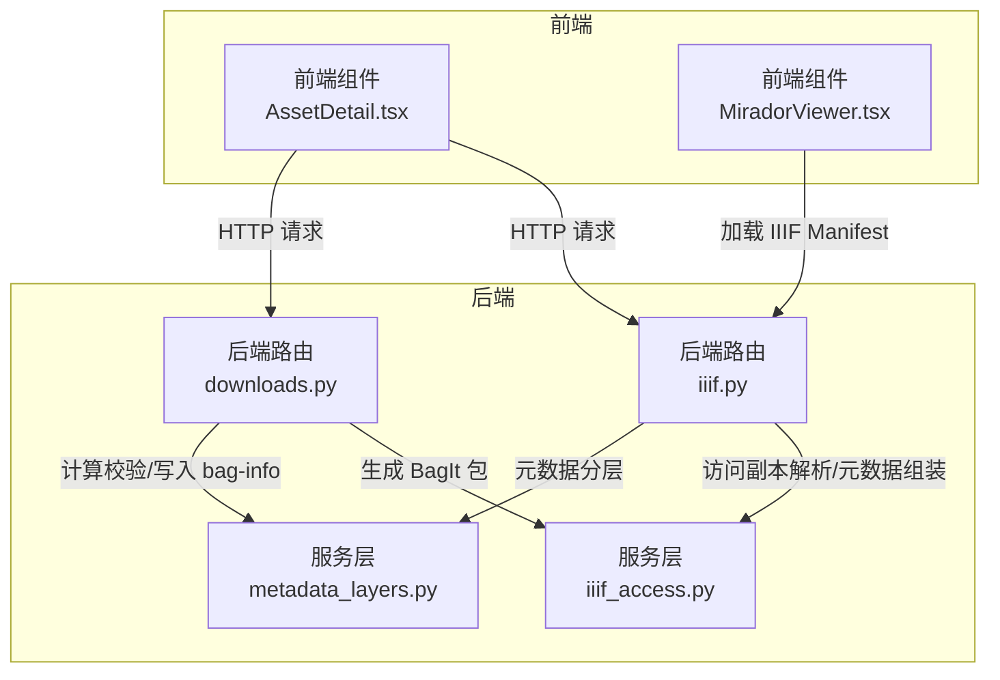
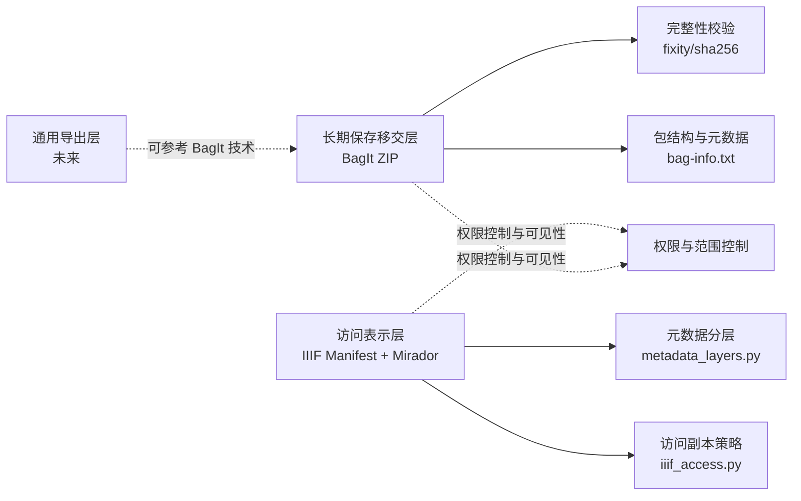
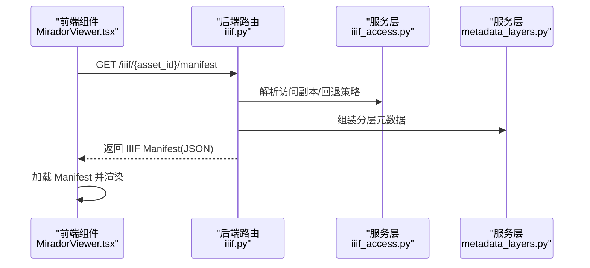
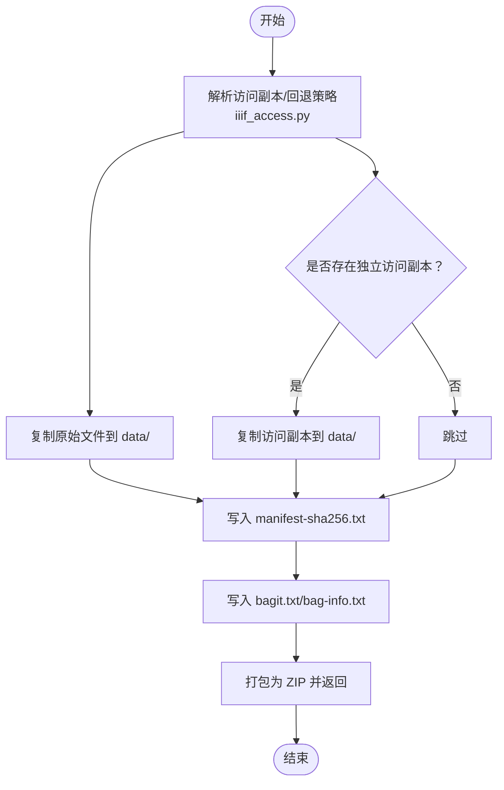
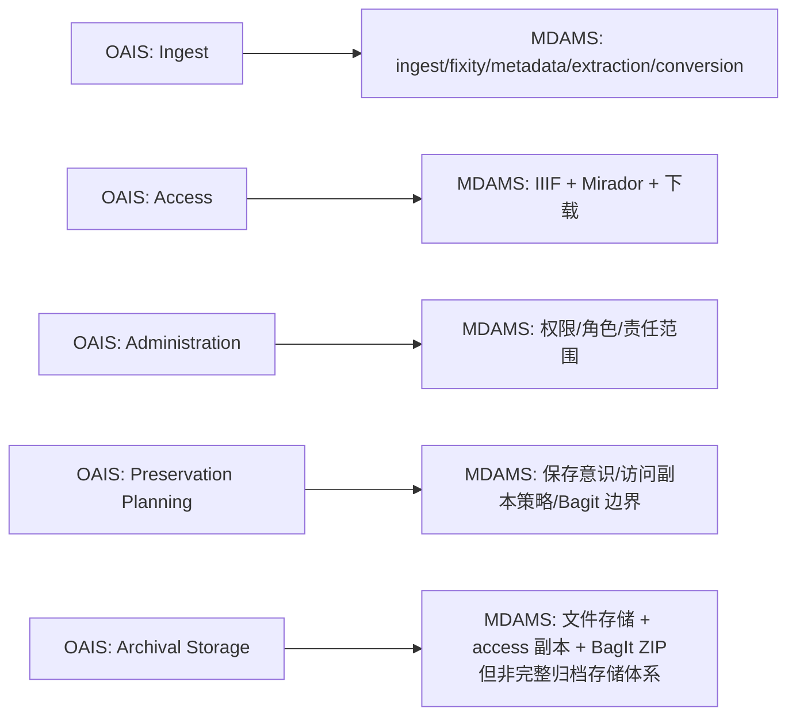
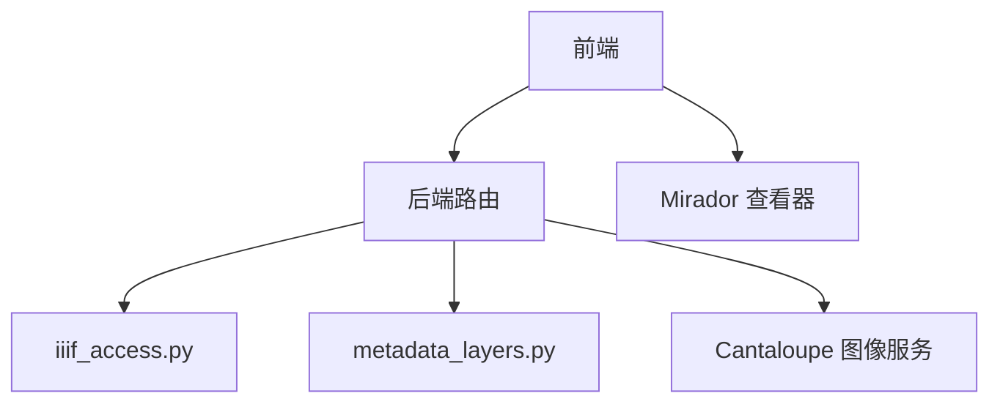

# 相关标准与规范

<cite>
**本文引用的文件**
- [标准到实现映射（STANDARDS_TO_IMPLEMENTATION_MAPPING）.md](file://docs/08-研究/标准到实现映射（STANDARDS_TO_IMPLEMENTATION_MAPPING）.md)
- [OAIS范围对照（OAIS_SCOPE_MAP）.md](file://docs/08-研究/OAIS范围对照（OAIS_SCOPE_MAP）.md)
- [长期保存SIP打包说明（BAGIT_SIP_PROFILE）.md](file://docs/08-研究/长期保存SIP打包说明（BAGIT_SIP_PROFILE）.md)
- [IIIF清单配置说明（IIIF_MANIFEST_PROFILE）.md](file://docs/08-研究/IIIF清单配置说明（IIIF_MANIFEST_PROFILE）.md)
- [BagIt样本结构（BAGIT_SAMPLE_STRUCTURE）.md](file://docs/08-研究/BagIt样本结构（BAGIT_SAMPLE_STRUCTURE）.md)
- [图像技术元数据映射（IMAGE_METADATA_CROSSWALK）.md](file://docs/08-研究/图像技术元数据映射（IMAGE_METADATA_CROSSWALK）.md)
- [统一对象模型（UNIFIED_OBJECT_MODEL）.md](file://docs/08-研究/统一对象模型（UNIFIED_OBJECT_MODEL）.md)
- [评估框架（EVALUATION_FRAMEWORK）.md](file://docs/08-研究/评估框架（EVALUATION_FRAMEWORK）.md)
- [设计决策（DESIGN_DECISIONS）.md](file://docs/08-研究/设计决策（DESIGN_DECISIONS）.md)
- [输出层边界说明（EXPORT_BOUNDARIES）.md](file://docs/08-研究/输出层边界说明（EXPORT_BOUNDARIES）.md)
- [iiif.py](file://backend/app/routers/iiif.py)
- [downloads.py](file://backend/app/routers/downloads.py)
- [iiif_access.py](file://backend/app/services/iiif_access.py)
- [metadata_layers.py](file://backend/app/services/metadata_layers.py)
- [MiradorViewer.tsx](file://frontend/src/MiradorViewer.tsx)
- [AssetDetail.tsx](file://frontend/src/components/AssetDetail.tsx)
</cite>

## 目录
1. [引言](#引言)
2. [项目结构](#项目结构)
3. [核心组件](#核心组件)
4. [架构总览](#架构总览)
5. [详细组件分析](#详细组件分析)
6. [依赖分析](#依赖分析)
7. [性能考虑](#性能考虑)
8. [故障排查指南](#故障排查指南)
9. [结论](#结论)
10. [附录](#附录)

## 引言
本文件面向MDAMS原型项目的“相关标准与规范”，系统梳理项目在国际标准、行业规范与研究框架层面的现状与差距，重点覆盖以下方面：
- IIIF（国际图像互操作框架）：清单标准、图像访问协议、派生文件规范与访问表示层实现
- OAIS（开放档案信息系统）：概念解释与范围映射，以及与系统现有能力的对应关系
- BagIt：长期保存移交的打包结构、元数据与完整性校验
- 数字资产管理相关的国家标准与行业标准：图像技术元数据（NISO Z39.87）、保存元数据（PREMIS）、三维数据保存（CS3DP）等
- 标准合规性检查清单与验证方法，帮助开发者理解与实施相关标准

## 项目结构
MDAMS原型项目采用前后端分离架构，后端以FastAPI为核心，提供IIIF清单生成、访问副本解析、BagIt导出等能力；前端通过Mirador查看器消费IIIF清单，提供资源详情与导出操作界面。

图表来源
- [iiif.py:138-254](file://backend/app/routers/iiif.py#L138-L254)
- [downloads.py:51-119](file://backend/app/routers/downloads.py#L51-L119)
- [iiif_access.py:115-154](file://backend/app/services/iiif_access.py#L115-L154)
- [metadata_layers.py:412-507](file://backend/app/services/metadata_layers.py#L412-L507)
- [MiradorViewer.tsx:202-261](file://frontend/src/MiradorViewer.tsx#L202-L261)
- [AssetDetail.tsx:423-481](file://frontend/src/components/AssetDetail.tsx#L423-L481)

章节来源
- [统一对象模型（UNIFIED_OBJECT_MODEL）.md:1-130](file://docs/08-研究/统一对象模型（UNIFIED_OBJECT_MODEL）.md#L1-L130)

## 核心组件
- IIIF访问表示层：后端路由动态生成清单，服务层解析访问副本与元数据，前端通过Mirador消费
- BagIt长期保存移交层：后端路由生成ZIP包，包含tag files与payload，携带完整性校验
- 元数据分层与技术元数据：统一对象模型与分层元数据服务，支撑IIIF清单与保存导向输出
- 输出层边界：明确区分访问表示、长期保存移交与通用导出三层边界，避免混淆

章节来源
- [IIIF清单配置说明（IIIF_MANIFEST_PROFILE）.md:1-196](file://docs/08-研究/IIIF清单配置说明（IIIF_MANIFEST_PROFILE）.md#L1-L196)
- [长期保存SIP打包说明（BAGIT_SIP_PROFILE）.md:1-173](file://docs/08-研究/长期保存SIP打包说明（BAGIT_SIP_PROFILE）.md#L1-L173)
- [输出层边界说明（EXPORT_BOUNDARIES）.md:1-165](file://docs/08-研究/输出层边界说明（EXPORT_BOUNDARIES）.md#L1-L165)
- [统一对象模型（UNIFIED_OBJECT_MODEL）.md:1-130](file://docs/08-研究/统一对象模型（UNIFIED_OBJECT_MODEL）.md#L1-L130)

## 架构总览
下图展示MDAMS在标准实现层面的分层与交互：访问表示层（IIIF）、长期保存移交层（BagIt）、通用导出层（未来），以及与元数据与访问副本策略的耦合关系。

图表来源
- [iiif.py:138-254](file://backend/app/routers/iiif.py#L138-L254)
- [downloads.py:51-119](file://backend/app/routers/downloads.py#L51-L119)
- [iiif_access.py:115-154](file://backend/app/services/iiif_access.py#L115-L154)
- [metadata_layers.py:412-507](file://backend/app/services/metadata_layers.py#L412-L507)
- [MiradorViewer.tsx:202-261](file://frontend/src/MiradorViewer.tsx#L202-L261)
- [AssetDetail.tsx:423-481](file://frontend/src/components/AssetDetail.tsx#L423-L481)

## 详细组件分析

### IIIF清单与访问表示
- 实现锚点：后端路由动态生成清单，服务层解析访问副本与元数据，前端Mirador消费
- 最小Manifest Profile：面向单资产图像访问，包含核心字段与与Cantaloupe图像服务集成
- 权限与可见性：清单生成前进行权限校验，隐藏资源对无权限用户返回禁止访问
- 与派生文件策略协同：优先使用独立访问副本，不存在时回退原始文件；若尚未生成则返回特定状态

图表来源
- [iiif.py:138-254](file://backend/app/routers/iiif.py#L138-L254)
- [iiif_access.py:115-154](file://backend/app/services/iiif_access.py#L115-L154)
- [metadata_layers.py:412-507](file://backend/app/services/metadata_layers.py#L412-L507)
- [MiradorViewer.tsx:202-261](file://frontend/src/MiradorViewer.tsx#L202-L261)

章节来源
- [IIIF清单配置说明（IIIF_MANIFEST_PROFILE）.md:1-196](file://docs/08-研究/IIIF清单配置说明（IIIF_MANIFEST_PROFILE）.md#L1-L196)
- [iiif.py:138-254](file://backend/app/routers/iiif.py#L138-L254)
- [iiif_access.py:115-154](file://backend/app/services/iiif_access.py#L115-L154)
- [metadata_layers.py:412-507](file://backend/app/services/metadata_layers.py#L412-L507)
- [MiradorViewer.tsx:202-261](file://frontend/src/MiradorViewer.tsx#L202-L261)

### BagIt长期保存移交
- 实现锚点：后端路由生成ZIP包，包含tag files与payload，携带原始文件与可选访问副本
- 包结构事实：包含bagit.txt、bag-info.txt、manifest-sha256.txt与data/目录
- 校验与元数据：记录原始文件与访问副本的SHA256，写入bag-info.txt关键字段
- 与访问层区分：长期保存移交层，不等同于访问层输出或通用导出

图表来源
- [downloads.py:51-119](file://backend/app/routers/downloads.py#L51-L119)
- [iiif_access.py:115-154](file://backend/app/services/iiif_access.py#L115-L154)
- [metadata_layers.py:563-569](file://backend/app/services/metadata_layers.py#L563-L569)

章节来源
- [长期保存SIP打包说明（BAGIT_SIP_PROFILE）.md:1-173](file://docs/08-研究/长期保存SIP打包说明（BAGIT_SIP_PROFILE）.md#L1-L173)
- [BagIt样本结构（BAGIT_SAMPLE_STRUCTURE）.md:1-88](file://docs/08-研究/BagIt样本结构（BAGIT_SAMPLE_STRUCTURE）.md#L1-L88)
- [downloads.py:51-119](file://backend/app/routers/downloads.py#L51-L119)

### OAIS概念解释与范围映射
- OAIS在MDAMS中主要作为概念解释框架，体现生命周期意识、输入/访问/输出分层与保存导向表达
- 与系统现有能力的对应：Ingest、fixity、metadata extraction、conversion、IIIF访问、BagIt SIP-like打包等
- 未覆盖完整职能域：Archival Storage、Administration、Preservation Planning等未建模为完整子系统

图表来源
- [OAIS范围对照（OAIS_SCOPE_MAP）.md:28-36](file://docs/08-研究/OAIS范围对照（OAIS_SCOPE_MAP）.md#L28-L36)

章节来源
- [OAIS范围对照（OAIS_SCOPE_MAP）.md:1-117](file://docs/08-研究/OAIS范围对照（OAIS_SCOPE_MAP）.md#L1-L117)

### 图像技术元数据与NISO Z39.87
- 最小still image profile：聚焦文件名、大小、格式、宽高、色彩空间、校验算法与校验值等核心字段
- 访问扩展与工作流扩展：访问副本与预览图、衍生策略与转换方法等字段作为扩展，不直接等同Z39.87核心
- 与PREMIS事件模型联动：工作流扩展字段适合与事件层联动，支撑保存元数据建模

章节来源
- [图像技术元数据映射（IMAGE_METADATA_CROSSWALK）.md:1-178](file://docs/08-研究/图像技术元数据映射（IMAGE_METADATA_CROSSWALK）.md#L1-L178)
- [metadata_layers.py:48-86](file://backend/app/services/metadata_layers.py#L48-L86)

### 统一对象模型与范围边界
- 核心对象：数字资产（Asset）为中心，辅以图像记录、三维对象、访问表示、导出表示与统一平台视图
- 权限与范围控制：作为结构性语义贯穿系统，决定对象可见性与可执行动作
- 输出层边界：访问表示、长期保存移交、通用导出三层边界清晰，避免混淆

章节来源
- [统一对象模型（UNIFIED_OBJECT_MODEL）.md:1-130](file://docs/08-研究/统一对象模型（UNIFIED_OBJECT_MODEL）.md#L1-L130)
- [输出层边界说明（EXPORT_BOUNDARIES）.md:1-165](file://docs/08-研究/输出层边界说明（EXPORT_BOUNDARIES）.md#L1-L165)

## 依赖分析
- 组件耦合与内聚：IIIF访问表示层依赖元数据分层与访问副本策略；BagIt移交层依赖访问副本策略与校验服务
- 外部依赖与集成点：Cantaloupe图像服务、Mirador查看器、前端本地存储认证头
- 潜在循环依赖：当前实现未发现循环依赖，各层职责清晰

图表来源
- [iiif.py:107-108](file://backend/app/routers/iiif.py#L107-L108)
- [iiif_access.py:115-154](file://backend/app/services/iiif_access.py#L115-L154)
- [metadata_layers.py:412-507](file://backend/app/services/metadata_layers.py#L412-L507)
- [MiradorViewer.tsx:132-149](file://frontend/src/MiradorViewer.tsx#L132-L149)

章节来源
- [iiif.py:107-108](file://backend/app/routers/iiif.py#L107-L108)
- [downloads.py:51-119](file://backend/app/routers/downloads.py#L51-L119)

## 性能考虑
- IIIF图像服务：tile尺寸与金字塔参数影响大图加载性能，建议在派生策略中统一配置
- 完整性校验：SHA256计算与ZIP打包在大文件场景下可能成为瓶颈，建议异步生成与缓存
- 前端加载：首次加载低清预览与生成高清切片耗时较长，建议优化首屏体验与进度反馈

## 故障排查指南
- IIIF清单403/404：检查权限控制与访问副本可用性；确认访问副本策略与状态
- 访问副本未就绪：检查派生策略与状态标记，确保生成流程完成
- BagIt包为空或缺少文件：核对原始文件路径与访问副本路径，确认复制逻辑与校验写入
- 前端无法加载Manifest：检查后端路由、CORS与认证头设置

章节来源
- [iiif.py:57-63](file://backend/app/routers/iiif.py#L57-L63)
- [iiif_access.py:176-180](file://backend/app/services/iiif_access.py#L176-L180)
- [downloads.py:51-119](file://backend/app/routers/downloads.py#L51-L119)
- [MiradorViewer.tsx:55-62](file://frontend/src/MiradorViewer.tsx#L55-L62)

## 结论
MDAMS原型在标准实现层面形成了清晰的分层与边界：IIIF作为最强直接实现层，BagIt作为长期保存移交层，OAIS作为概念解释框架，NISO Z39.87与PREMIS为技术元数据与保存元数据的参考基础。当前实现已具备可演示的工作流与稳定的工程证据，建议后续围绕最小Profile与Capability Matrix完善标准映射，并逐步 Formalize 事件模型与对象模型。

## 附录

### 标准合规性检查清单与验证方法
- IIIF清单
  - 已支持字段：清单标识、类型、标签、摘要、主页、元数据、Canvas/Annotation结构、图像服务
  - 验证方法：前端加载Manifest并解析元数据字段；权限边界验证（隐藏资源403）
  - 建议：补充字段级Capability Matrix与Viewer兼容性说明
- BagIt包
  - 已支持结构：bagit.txt、bag-info.txt、manifest-sha256.txt、data/目录
  - 验证方法：解包后核对关键文件与字段；校验SHA256一致性
  - 建议：补充包样本树与payload纳入规则表
- OAIS范围
  - 已体现：生命周期意识、输入/访问/输出分层、保存导向表达
  - 验证方法：对照范围图与职能域矩阵
  - 建议：绘制轻量OAIS范围图并标注原型边界
- 图像技术元数据（NISO Z39.87）
  - 已支持字段：文件名、大小、格式、宽高、色彩空间、校验算法与值
  - 验证方法：对比Crosswalk与实际字段
  - 建议：形成最小still image profile并标注扩展字段
- PREMIS事件模型
  - 已体现：对象状态、处理动作与日志痕迹
  - 建议：建立最小事件模型与事件词表，覆盖关键流程

章节来源
- [标准到实现映射（STANDARDS_TO_IMPLEMENTATION_MAPPING）.md:1-249](file://docs/08-研究/标准到实现映射（STANDARDS_TO_IMPLEMENTATION_MAPPING）.md#L1-L249)
- [IIIF清单配置说明（IIIF_MANIFEST_PROFILE）.md:112-187](file://docs/08-研究/IIIF清单配置说明（IIIF_MANIFEST_PROFILE）.md#L112-L187)
- [长期保存SIP打包说明（BAGIT_SIP_PROFILE）.md:148-172](file://docs/08-研究/长期保存SIP打包说明（BAGIT_SIP_PROFILE）.md#L148-L172)
- [OAIS范围对照（OAIS_SCOPE_MAP）.md:12-117](file://docs/08-研究/OAIS范围对照（OAIS_SCOPE_MAP）.md#L12-L117)
- [图像技术元数据映射（IMAGE_METADATA_CROSSWALK）.md:108-178](file://docs/08-研究/图像技术元数据映射（IMAGE_METADATA_CROSSWALK）.md#L108-L178)
- [评估框架（EVALUATION_FRAMEWORK）.md:15-74](file://docs/08-研究/评估框架（EVALUATION_FRAMEWORK）.md#L15-L74)
- [设计决策（DESIGN_DECISIONS）.md:68-98](file://docs/08-研究/设计决策（DESIGN_DECISIONS）.md#L68-L98)