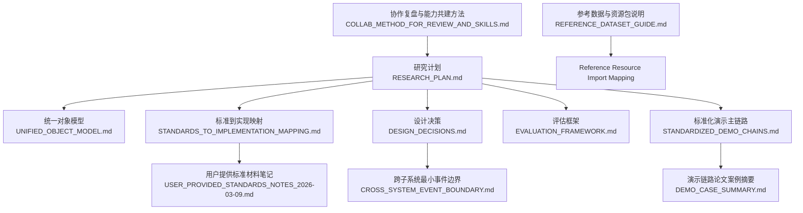
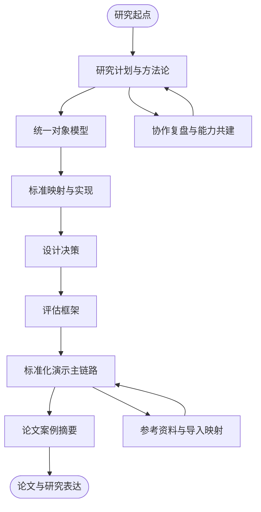
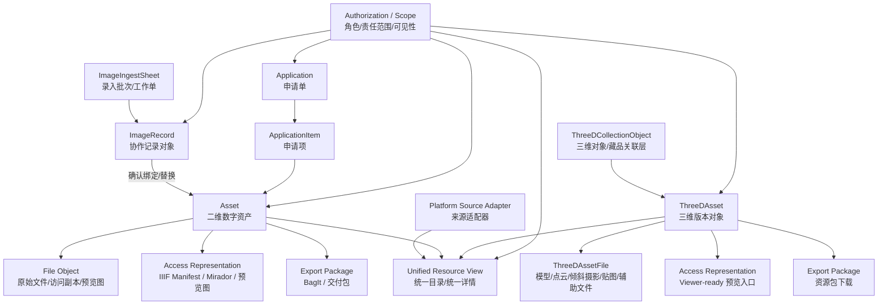
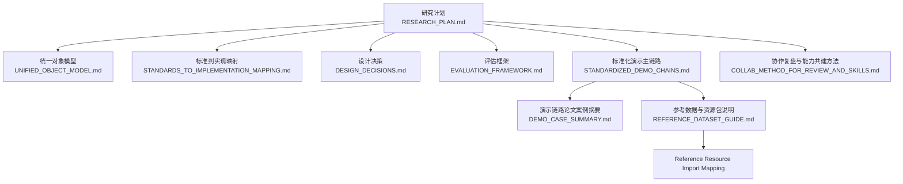

# 研究文献与参考资料

<cite>
**本文引用的文件**
- [文献回顾计划（LITERATURE_REVIEW_PLAN）.md](file://docs/08-研究/文献回顾计划（LITERATURE_REVIEW_PLAN）.md)
- [研究计划（RESEARCH_PLAN）.md](file://docs/08-研究/研究计划（RESEARCH_PLAN）.md)
- [评估框架（EVALUATION_FRAMEWORK）.md](file://docs/08-研究/评估框架（EVALUATION_FRAMEWORK）.md)
- [设计决策（DESIGN_DECISIONS）.md](file://docs/08-研究/设计决策（DESIGN_DECISIONS）.md)
- [论文大纲（PAPER_OUTLINE）.md](file://docs/08-研究/论文大纲（PAPER_OUTLINE）.md)
- [当前项目事实（CURRENT_PROJECT_FACTS）.md](file://docs/08-研究/当前项目事实（CURRENT_PROJECT_FACTS）.md)
- [统一对象模型（UNIFIED_OBJECT_MODEL）.md](file://docs/08-研究/统一对象模型（UNIFIED_OBJECT_MODEL）.md)
- [标准到实现映射（STANDARDS_TO_IMPLEMENTATION_MAPPING）.md](file://docs/08-研究/标准到实现映射（STANDARDS_TO_IMPLEMENTATION_MAPPING）.md)
- [协作复盘与能力共建方法（COLLAB_METHOD_FOR_REVIEW_AND_SKILLS）.md](file://docs/08-研究/协作复盘与能力共建方法（COLLAB_METHOD_FOR_REVIEW_AND_SKILLS）.md)
- [标准化演示主链路（STANDARDIZED_DEMO_CHAINS）.md](file://docs/08-研究/标准化演示主链路（STANDARDIZED_DEMO_CHAINS）.md)
- [演示链路论文案例摘要（DEMO_CASE_SUMMARY）.md](file://docs/08-研究/演示链路论文案例摘要（DEMO_CASE_SUMMARY）.md)
- [用户提供标准材料笔记（USER_PROVIDED_STANDARDS_NOTES_2026-03-09）.md](file://docs/08-研究/用户提供标准材料笔记（USER_PROVIDED_STANDARDS_NOTES_2026-03-09）.md)
- [跨子系统最小事件边界（CROSS_SYSTEM_EVENT_BOUNDARY）.md](file://docs/08-研究/跨子系统最小事件边界（CROSS_SYSTEM_EVENT_BOUNDARY）.md)
- [参考数据与资源包说明（REFERENCE_DATASET_GUIDE）.md](file://docs/06-参考资料/REFERENCE_DATASET_GUIDE.md)
- [Reference Resource Import Mapping](file://docs/06-参考资料/REFERENCE_RESOURCE_IMPORT_MAPPING.md)
</cite>

## 目录
1. [引言](#引言)
2. [项目结构](#项目结构)
3. [核心组件](#核心组件)
4. [架构总览](#架构总览)
5. [详细组件分析](#详细组件分析)
6. [依赖分析](#依赖分析)
7. [性能考虑](#性能考虑)
8. [故障排查指南](#故障排查指南)
9. [结论](#结论)
10. [附录](#附录)

## 引言
本文件面向MDAMS原型项目的研究与论文写作，系统梳理项目的研究背景、理论基础、研究方法与计划、评估框架与指标、设计决策依据、标准映射与实现关系、演示主链路与论文案例摘要，以及协作复盘与能力共建方法。其目标是帮助读者快速把握MDAMS在数字资产管理领域的定位、原型边界、工程实现与研究表达之间的关系，并为后续论文撰写与学术交流提供可复用的材料与参考。

## 项目结构
MDAMS研究相关资料集中于docs/08-研究与docs/06-参考资料两大板块，辅以docs/03-产品与流程、docs/05-部署与运维等配套文档。研究资料以“研究计划—概念模型—标准映射—设计决策—评估框架—演示主链路—协作方法—参考资料”为主线组织，形成从问题域到论文表达的闭环。

图表来源
- [研究计划（RESEARCH_PLAN）.md](file://docs/08-研究/研究计划（RESEARCH_PLAN）.md)
- [统一对象模型（UNIFIED_OBJECT_MODEL）.md](file://docs/08-研究/统一对象模型（UNIFIED_OBJECT_MODEL）.md)
- [标准到实现映射（STANDARDS_TO_IMPLEMENTATION_MAPPING）.md](file://docs/08-研究/标准到实现映射（STANDARDS_TO_IMPLEMENTATION_MAPPING）.md)
- [设计决策（DESIGN_DECISIONS）.md](file://docs/08-研究/设计决策（DESIGN_DECISIONS）.md)
- [评估框架（EVALUATION_FRAMEWORK）.md](file://docs/08-研究/评估框架（EVALUATION_FRAMEWORK）.md)
- [标准化演示主链路（STANDARDIZED_DEMO_CHAINS）.md](file://docs/08-研究/标准化演示主链路（STANDARDIZED_DEMO_CHAINS）.md)
- [演示链路论文案例摘要（DEMO_CASE_SUMMARY）.md](file://docs/08-研究/演示链路论文案例摘要（DEMO_CASE_SUMMARY）.md)
- [用户提供标准材料笔记（USER_PROVIDED_STANDARDS_NOTES_2026-03-09）.md](file://docs/08-研究/用户提供标准材料笔记（USER_PROVIDED_STANDARDS_NOTES_2026-03-09）.md)
- [跨子系统最小事件边界（CROSS_SYSTEM_EVENT_BOUNDARY）.md](file://docs/08-研究/跨子系统最小事件边界（CROSS_SYSTEM_EVENT_BOUNDARY）.md)
- [协作复盘与能力共建方法（COLLAB_METHOD_FOR_REVIEW_AND_SKILLS）.md](file://docs/08-研究/协作复盘与能力共建方法（COLLAB_METHOD_FOR_REVIEW_AND_SKILLS）.md)
- [参考数据与资源包说明（REFERENCE_DATASET_GUIDE）.md](file://docs/06-参考资料/REFERENCE_DATASET_GUIDE.md)
- [Reference Resource Import Mapping](file://docs/06-参考资料/REFERENCE_RESOURCE_IMPORT_MAPPING.md)

章节来源
- [研究计划（RESEARCH_PLAN）.md](file://docs/08-研究/研究计划（RESEARCH_PLAN）.md)
- [标准化演示主链路（STANDARDIZED_DEMO_CHAINS）.md](file://docs/08-研究/标准化演示主链路（STANDARDIZED_DEMO_CHAINS）.md)

## 核心组件
- 研究计划与方法论：明确研究目标、问题域、方法取向与阶段性推进策略，确立“设计科学/原型研究”“实践驱动的系统设计反思”“标准映射与实现分析”的研究取向。
- 概念模型与对象关系：以“数字资产（Asset）为核心”，辅以协作对象（如ImageRecord）、资源扩展对象（三维对象/版本/文件包）、表示与聚合对象（访问表示、导出包、统一平台视图），并强调权限范围控制的结构性语义。
- 标准映射与实现：对IIIF、BagIt、OAIS、PREMIS、NISO Z39.87、CS3DP进行分层映射，明确直接对齐、部分对齐、概念对齐与未来导向的边界。
- 设计决策：围绕“优先稳定可演示核心工作流”“以数字资产为中心”“选择性标准对齐”三条主线，支撑原型工程与研究表达。
- 评估框架：从核心工作流可演示性、对象模型清晰度、标准对齐质量、保存导向表达能力、多来源资源组织能力、工程实现可信度、研究可解释性七个维度评估原型价值。
- 演示主链路：固化二维数字资产主链路、图像记录协作链路、三维对象与统一平台链路三大案例，形成论文与论文复用的稳定证据。
- 协作复盘与能力共建：建立“目标—对象—边界—流程—表达”五层复盘顺序，沉淀可复用方法与技能化能力，避免在局部细节中偏离上层目标。
- 参考资料与导入映射：整理参考数据集、导入映射与样例资源，支撑元数据映射验证与工作流演示。

章节来源
- [研究计划（RESEARCH_PLAN）.md](file://docs/08-研究/研究计划（RESEARCH_PLAN）.md)
- [统一对象模型（UNIFIED_OBJECT_MODEL）.md](file://docs/08-研究/统一对象模型（UNIFIED_OBJECT_MODEL）.md)
- [标准到实现映射（STANDARDS_TO_IMPLEMENTATION_MAPPING）.md](file://docs/08-研究/标准到实现映射（STANDARDS_TO_IMPLEMENTATION_MAPPING）.md)
- [设计决策（DESIGN_DECISIONS）.md](file://docs/08-研究/设计决策（DESIGN_DECISIONS）.md)
- [评估框架（EVALUATION_FRAMEWORK）.md](file://docs/08-研究/评估框架（EVALUATION_FRAMEWORK）.md)
- [标准化演示主链路（STANDARDIZED_DEMO_CHAINS）.md](file://docs/08-研究/标准化演示主链路（STANDARDIZED_DEMO_CHAINS）.md)
- [协作复盘与能力共建方法（COLLAB_METHOD_FOR_REVIEW_AND_SKILLS）.md](file://docs/08-研究/协作复盘与能力共建方法（COLLAB_METHOD_FOR_REVIEW_AND_SKILLS）.md)
- [参考数据与资源包说明（REFERENCE_DATASET_GUIDE）.md](file://docs/06-参考资料/REFERENCE_DATASET_GUIDE.md)
- [Reference Resource Import Mapping](file://docs/06-参考资料/REFERENCE_RESOURCE_IMPORT_MAPPING.md)

## 架构总览
MDAMS研究资料的组织遵循“问题—方法—模型—标准—实现—评估—表达”的闭环路径。研究计划确定方法取向与阶段性目标；统一对象模型与标准映射为实现提供概念与边界；设计决策与评估框架保障原型工程与研究表达的一致性；标准化演示主链路与论文案例摘要为论文写作提供可复用证据；协作复盘与能力共建确保长期迭代的质量与一致性；参考资料与导入映射为研究与演示提供数据与流程支撑。

图表来源
- [研究计划（RESEARCH_PLAN）.md](file://docs/08-研究/研究计划（RESEARCH_PLAN）.md)
- [统一对象模型（UNIFIED_OBJECT_MODEL）.md](file://docs/08-研究/统一对象模型（UNIFIED_OBJECT_MODEL）.md)
- [标准到实现映射（STANDARDS_TO_IMPLEMENTATION_MAPPING）.md](file://docs/08-研究/标准到实现映射（STANDARDS_TO_IMPLEMENTATION_MAPPING）.md)
- [设计决策（DESIGN_DECISIONS）.md](file://docs/08-研究/设计决策（DESIGN_DECISIONS）.md)
- [评估框架（EVALUATION_FRAMEWORK）.md](file://docs/08-研究/评估框架（EVALUATION_FRAMEWORK）.md)
- [标准化演示主链路（STANDARDIZED_DEMO_CHAINS）.md](file://docs/08-研究/标准化演示主链路（STANDARDIZED_DEMO_CHAINS）.md)
- [演示链路论文案例摘要（DEMO_CASE_SUMMARY）.md](file://docs/08-研究/演示链路论文案例摘要（DEMO_CASE_SUMMARY）.md)
- [协作复盘与能力共建方法（COLLAB_METHOD_FOR_REVIEW_AND_SKILLS）.md](file://docs/08-研究/协作复盘与能力共建方法（COLLAB_METHOD_FOR_REVIEW_AND_SKILLS）.md)
- [参考数据与资源包说明（REFERENCE_DATASET_GUIDE）.md](file://docs/06-参考资料/REFERENCE_DATASET_GUIDE.md)
- [Reference Resource Import Mapping](file://docs/06-参考资料/REFERENCE_RESOURCE_IMPORT_MAPPING.md)

## 详细组件分析

### 研究计划与方法论
- 研究目标：将MDAMS Prototype发展为既有工程实现价值、又能支撑研究/论文表达的数字资产管理原型案例。
- 方法取向：设计科学/原型研究、实践驱动的系统设计反思、标准映射与实现分析、面向文化遗产/数字保存场景的案例研究表达。
- 项目定位：面向博物馆/展陈数字资源场景的数字资产管理原型，以数字资产为中心，重点支持采集、校验、处理、访问与导出主链路，具备保存意识但不宣称完整OAIS仓储。
- 阶段推进：第一阶段写实项目事实与概念模型；第二阶段细化标准到实现映射；第三阶段转向论文表达。

章节来源
- [研究计划（RESEARCH_PLAN）.md](file://docs/08-研究/研究计划（RESEARCH_PLAN）.md)

### 统一对象模型与关系
- 核心对象：数字资产（Asset）仍是系统的核心管理对象，但当前主要覆盖二维数字资产。
- 协作对象：ImageRecord、申请单、申请项，体现“元数据记录”和“影像文件”分离协作的趋势。
- 资源扩展对象：三维对象、三维版本、三维文件包，形成“对象+版本+文件包+viewer契约”的结构。
- 表示与聚合对象：访问表示（IIIF Manifest/Mirador/预览图）、导出表示（BagIt/交付包）、统一平台视图（聚合目录/详情）。
- 权限范围：角色/责任范围/可见性控制语义，影响菜单可见性、资源可见性、申请与管理动作。

图表来源
- [统一对象模型（UNIFIED_OBJECT_MODEL）.md](file://docs/08-研究/统一对象模型（UNIFIED_OBJECT_MODEL）.md)

章节来源
- [统一对象模型（UNIFIED_OBJECT_MODEL）.md](file://docs/08-研究/统一对象模型（UNIFIED_OBJECT_MODEL）.md)

### 标准映射与实现关系
- IIIF：直接对齐，动态Manifest生成、Cantaloupe图像服务集成、Mirador查看器集成、访问副本与原始文件区分。
- BagIt：直接对齐，导出逻辑围绕数字资产或交付结果展开，与fixity导向和导出/交付链路相连。
- OAIS：概念对齐，体现in gest过程语言、生命周期意识、原始/访问/导出区分、保存导向打包与输出思路。
- PREMIS：部分对齐，已具备proto-PREMIS行为（对象状态、处理动作、日志痕迹），尚需事件词表与最小Agent/Rights/Object集合。
- NISO Z39.87：部分对齐，图像技术元数据提取与图像导向工作流，需建立minimum viable profile。
- CS3DP：未来导向，带有限实现参照意义，三维对象、版本、文件包与Web展示实现已具备初步参照价值。

章节来源
- [标准到实现映射（STANDARDS_TO_IMPLEMENTATION_MAPPING）.md](file://docs/08-研究/标准到实现映射（STANDARDS_TO_IMPLEMENTATION_MAPPING）.md)
- [用户提供标准材料笔记（USER_PROVIDED_STANDARDS_NOTES_2026-03-09）.md](file://docs/08-研究/用户提供标准材料笔记（USER_PROVIDED_STANDARDS_NOTES_2026-03-09）.md)

### 设计决策与依据
- 优先稳定“可演示的核心工作流”：原型阶段以“可解释、可演示、可评估”为先，避免功能无限扩张。
- 以数字资产（Asset）作为核心对象：资产模型更利于连接文件、元数据、处理状态、访问表示与导出包。
- 采用选择性标准对齐：对不同标准采取不同层级进入方式，既保留工程可行性，也增强研究解释力。

章节来源
- [设计决策（DESIGN_DECISIONS）.md](file://docs/08-研究/设计决策（DESIGN_DECISIONS）.md)

### 评估框架与指标
- 评估维度：核心工作流可演示性、核心对象模型清晰度、标准与框架对齐质量、保存导向表达能力、多来源资源组织能力、工程实现可信度、研究可解释性。
- 判断要点：是否具备稳定可演示主链路、真实工程实现、清晰资产中心倾向、统一平台与三维扩展证据、较好标准参照基础、测试与工作日志支撑可信度。

章节来源
- [评估框架（EVALUATION_FRAMEWORK）.md](file://docs/08-研究/评估框架（EVALUATION_FRAMEWORK）.md)

### 标准化演示主链路与论文案例
- 二维数字资产主链路：从资产登记、技术元数据处理、访问副本准备、IIIF Manifest生成、Mirador访问到BagIt打包输出，证明系统具备以数字资产为核心的完整主链路。
- 图像记录协作链路：元数据录入与摄影上传角色分离协作，证明系统具备“协作记录对象”与“数字资产对象”相互配合的结构。
- 三维对象与统一平台链路：三维对象、版本、多文件资源包与viewer预览状态，统一平台聚合二维与三维资源，证明系统具备多来源资源底座与平台化趋势。
- 论文案例摘要：三条链路共同支撑MDAMS Prototype的价值判断：有限但扎实的实现，建立可演示、可解释、可验证的工作流，分别承担主链路证明、协作语义证明与多来源平台化证明。

章节来源
- [标准化演示主链路（STANDARDIZED_DEMO_CHAINS）.md](file://docs/08-研究/标准化演示主链路（STANDARDIZED_DEMO_CHAINS）.md)
- [演示链路论文案例摘要（DEMO_CASE_SUMMARY）.md](file://docs/08-研究/演示链路论文案例摘要（DEMO_CASE_SUMMARY）.md)

### 跨子系统最小事件边界
- 当前立场：不直接引入跨子系统统一事件持久化，先建立“跨子系统最小事件边界”，优先落到detail层统一事件摘要表达、contract tests的行为边界与局部已存在事件对象的术语和分类收口。
- 二维资产链路：object_created、ingest_completed、fixity_recorded、metadata_extracted、access_derivative_generated、manifest_generate、export_generate等。
- 图像记录协作链路：image_record_submit、image_record_return、image_record_bind_confirm、image_record_replace_confirm等。
- 三维对象链路：register、files_saved、manifest_built、web_preview、storage_tier等。
- 访问表示与导出表示：manifest_generate、iiif_access_generate、export_generate、delivery_export等。
- 申请与交付链路：application_submit、application_review、delivery_export等。
- 建议落地顺序：先收口detail/测试层事件术语，再评估是否引入事件摘要对象，最后讨论是否统一持久化。

章节来源
- [跨子系统最小事件边界（CROSS_SYSTEM_EVENT_BOUNDARY）.md](file://docs/08-研究/跨子系统最小事件边界（CROSS_SYSTEM_EVENT_BOUNDARY）.md)

### 协作复盘与能力共建方法
- 复盘顺序：目标层（任务真实目标）、对象层（核心对象判断）、边界层（能力范围与标准边界）、流程层（统一流程与类型流程）、表达层（理解错误与表达准确性）。
- 能力判定：高频出现、输入边界清晰、输出可结构化、可明显降低未来错误率。
- 长期协作节奏：周度（选关键偏差、讨论soul调整、判断是否skill化）、项目阶段（检查目标与框架平衡、文档跟进）、能力建设（产品化反复问题、沉淀模板或skill）。
- 当前协作原则：先目标后细节、先对象后字段、先边界后标准落点、先区分共性层与类型层再讨论统一方案、当讨论长期停留在局部时主动回到上层问题、当判断稳定时及时沉淀为文档、当错误重复出现时规则化或skill化、soul讨论应面向行为修正与能力建设。

章节来源
- [协作复盘与能力共建方法（COLLAB_METHOD_FOR_REVIEW_AND_SKILLS）.md](file://docs/08-研究/协作复盘与能力共建方法（COLLAB_METHOD_FOR_REVIEW_AND_SKILLS）.md)

### 参考资料与导入映射
- 参考数据与资源包：reference/目录承载参考样例与导入素材，服务参考导入、元数据映射验证、二维资源样例构造、工作流与平台演示。
- 导入映射：定义reference/资源包下文件与sidecar元数据如何转换为MDAMS 2D ingest形态，包括主文件选择规则、profile映射、metadata映射、raw_metadata保留策略与已知限制。
- 使用建议：不要随意改动样例资源结构、导入前优先dry-run、新增参考目录时同步更新导入与映射文档。

章节来源
- [参考数据与资源包说明（REFERENCE_DATASET_GUIDE）.md](file://docs/06-参考资料/REFERENCE_DATASET_GUIDE.md)
- [Reference Resource Import Mapping](file://docs/06-参考资料/REFERENCE_RESOURCE_IMPORT_MAPPING.md)

## 依赖分析
- 研究计划与对象模型、标准映射、设计决策、评估框架、演示主链路、协作方法之间存在强耦合关系，形成“问题—方法—模型—标准—实现—评估—表达”的闭环。
- 标准映射与实现依赖当前对象模型与演示主链路的证据，反过来标准映射也为对象模型与演示主链路提供边界与一致性约束。
- 设计决策与评估框架共同决定原型的工程取舍与研究表达重点，协作方法保障长期迭代的质量与一致性。
- 参考资料与导入映射为研究与演示提供数据与流程支撑，确保论文与演示的可复用性与可验证性。

图表来源
- [研究计划（RESEARCH_PLAN）.md](file://docs/08-研究/研究计划（RESEARCH_PLAN）.md)
- [统一对象模型（UNIFIED_OBJECT_MODEL）.md](file://docs/08-研究/统一对象模型（UNIFIED_OBJECT_MODEL）.md)
- [标准到实现映射（STANDARDS_TO_IMPLEMENTATION_MAPPING）.md](file://docs/08-研究/标准到实现映射（STANDARDS_TO_IMPLEMENTATION_MAPPING）.md)
- [设计决策（DESIGN_DECISIONS）.md](file://docs/08-研究/设计决策（DESIGN_DECISIONS）.md)
- [评估框架（EVALUATION_FRAMEWORK）.md](file://docs/08-研究/评估框架（EVALUATION_FRAMEWORK）.md)
- [标准化演示主链路（STANDARDIZED_DEMO_CHAINS）.md](file://docs/08-研究/标准化演示主链路（STANDARDIZED_DEMO_CHAINS）.md)
- [演示链路论文案例摘要（DEMO_CASE_SUMMARY）.md](file://docs/08-研究/演示链路论文案例摘要（DEMO_CASE_SUMMARY）.md)
- [协作复盘与能力共建方法（COLLAB_METHOD_FOR_REVIEW_AND_SKILLS）.md](file://docs/08-研究/协作复盘与能力共建方法（COLLAB_METHOD_FOR_REVIEW_AND_SKILLS）.md)
- [参考数据与资源包说明（REFERENCE_DATASET_GUIDE）.md](file://docs/06-参考资料/REFERENCE_DATASET_GUIDE.md)
- [Reference Resource Import Mapping](file://docs/06-参考资料/REFERENCE_RESOURCE_IMPORT_MAPPING.md)

## 性能考虑
- 原型阶段以“有限但扎实的实现”为主，优先保证可演示主链路的稳定性与可重复性，避免在局部细节中过度消耗资源。
- 事件边界与对象模型的清晰化有助于减少不必要的持久化与重复计算，提高系统可维护性与可解释性。
- 标准映射的分层策略避免一次性实现过多标准带来的复杂度与性能负担，确保工程可行性与研究解释力的平衡。

## 故障排查指南
- 当讨论长期停留在局部细节时，主动回到上层问题（目标层—对象层—边界层—流程层—表达层）。
- 当判断已经稳定时，及时沉淀为文档，避免重复错误与沟通成本上升。
- 当错误重复出现时，考虑规则化或skill化，将反复问题产品化，形成可复用方法与检查点。
- 在标准边界与对象模型判断上出现分歧时，优先参考统一对象模型与标准映射文档，确保边界一致。

章节来源
- [协作复盘与能力共建方法（COLLAB_METHOD_FOR_REVIEW_AND_SKILLS）.md](file://docs/08-研究/协作复盘与能力共建方法（COLLAB_METHOD_FOR_REVIEW_AND_SKILLS）.md)

## 结论
MDAMS研究资料以“研究计划—概念模型—标准映射—设计决策—评估框架—演示主链路—协作方法—参考资料”为主线，形成从问题域到论文表达的闭环。通过三条标准化演示主链路与统一对象模型，MDAMS证明了其作为“以数字资产为核心、具有保存意识并采用选择性标准对齐策略的研究型技术原型”的价值。协作复盘与能力共建方法确保长期迭代的质量与一致性，参考资料与导入映射为研究与演示提供可复用的数据与流程支撑。

## 附录
- 文献回顾计划：明确资料类型（技术标准与官方规范、学术研究文献、行业与机构实践资料）、回顾目标（回答现实问题、理解外部语境、定位MDAMS原型独特价值与局限）、优先级与输出方式。
- 当前项目事实：记录已实现能力、最强可演示工作流、当前架构事实、当前对象模型事实、当前最值得强调的研究事实与主要缺口。
- 论文大纲：涵盖引言、相关背景与参考框架、研究方法与项目定位、原型设计、标准与实现映射、当前实现与演示链路、评估与讨论、结论等章节。

章节来源
- [文献回顾计划（LITERATURE_REVIEW_PLAN）.md](file://docs/08-研究/文献回顾计划（LITERATURE_REVIEW_PLAN）.md)
- [当前项目事实（CURRENT_PROJECT_FACTS）.md](file://docs/08-研究/当前项目事实（CURRENT_PROJECT_FACTS）.md)
- [论文大纲（PAPER_OUTLINE）.md](file://docs/08-研究/论文大纲（PAPER_OUTLINE）.md)