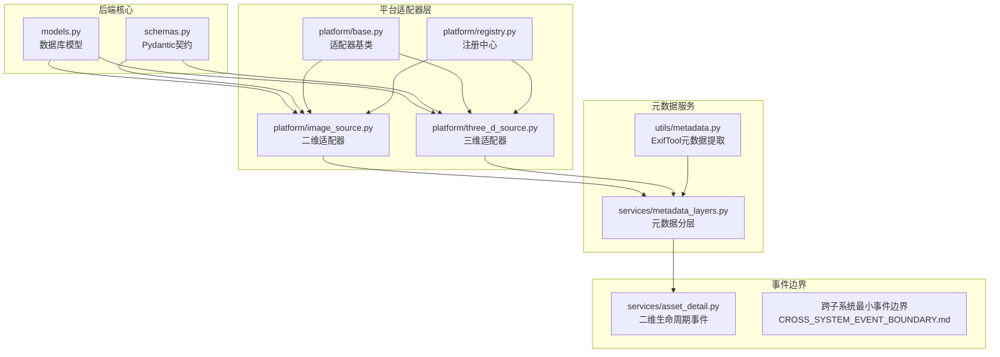
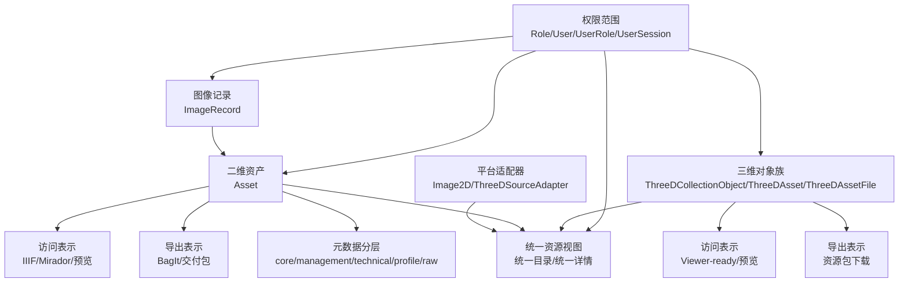
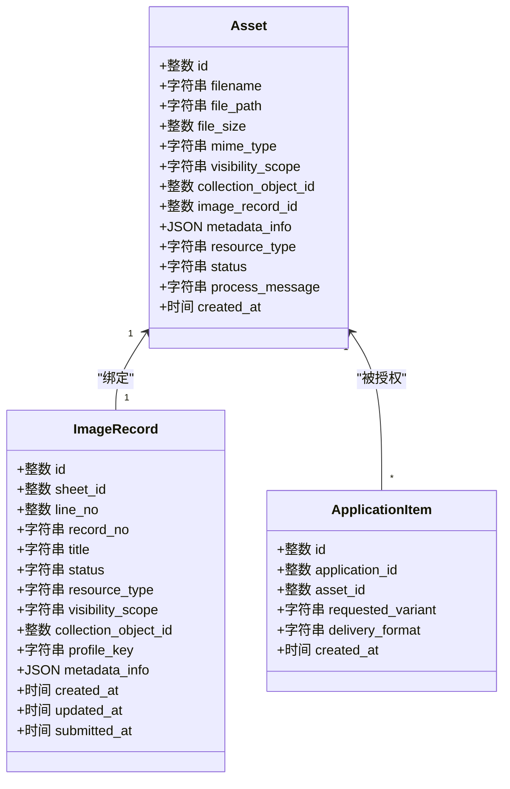
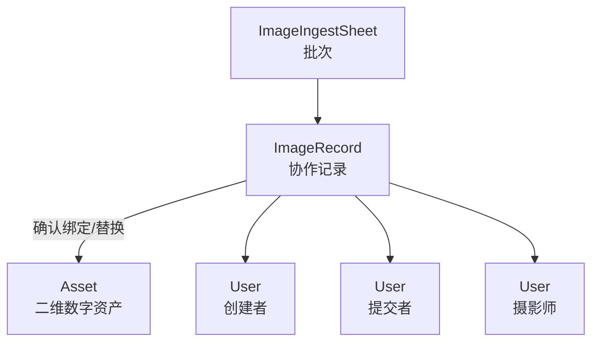
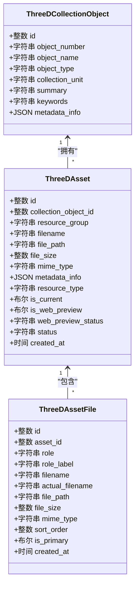
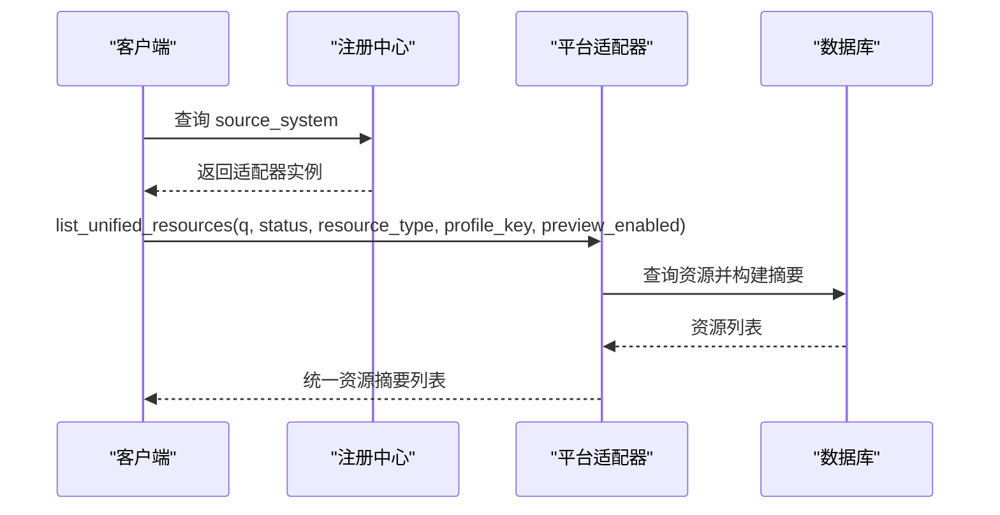
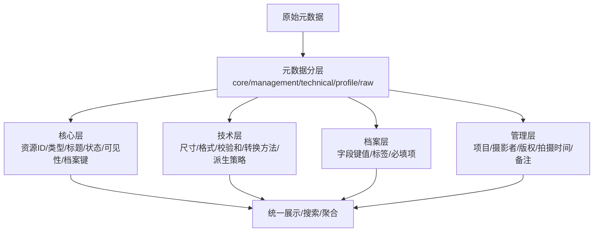
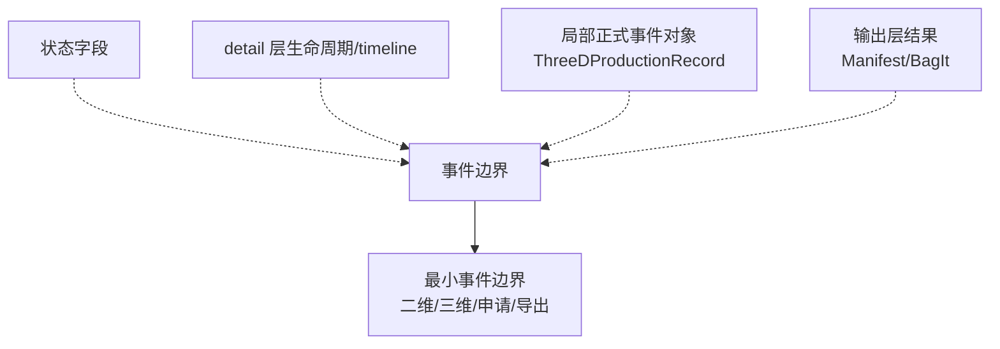
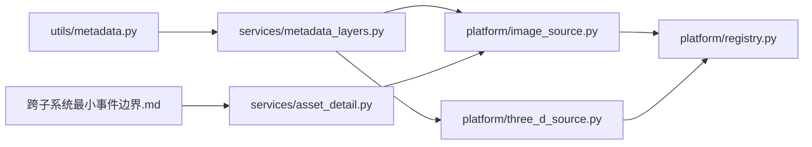

# 统一对象模型

<cite>
**本文引用的文件**
- [统一对象模型（UNIFIED_OBJECT_MODEL）.md](file://docs/08-研究/统一对象模型（UNIFIED_OBJECT_MODEL）.md)
- [models.py](file://backend/app/models.py)
- [schemas.py](file://backend/app/schemas.py)
- [base.py](file://backend/app/platform/base.py)
- [image_source.py](file://backend/app/platform/image_source.py)
- [three_d_source.py](file://backend/app/platform/three_d_source.py)
- [registry.py](file://backend/app/platform/registry.py)
- [metadata.py](file://backend/app/utils/metadata.py)
- [metadata_layers.py](file://backend/app/services/metadata_layers.py)
- [asset_detail.py](file://backend/app/services/asset_detail.py)
- [UNIFIED_METADATA_EXAMPLE.md](file://docs/06-参考资料/UNIFIED_METADATA_EXAMPLE.md)
- [跨子系统最小事件边界（CROSS_SYSTEM_EVENT_BOUNDARY）.md](file://docs/08-研究/跨子系统最小事件边界（CROSS_SYSTEM_EVENT_BOUNDARY）.md)
- [PREMIS事件映射（PREMIS_EVENT_MAPPING）.md](file://docs/08-研究/PREMIS事件映射（PREMIS_EVENT_MAPPING）.md)
- [图像技术元数据映射（IMAGE_METADATA_CROSSWALK）.md](file://docs/08-研究/图像技术元数据映射（IMAGE_METADATA_CROSSWALK）.md)
</cite>

## 目录
1. [简介](#简介)
2. [项目结构](#项目结构)
3. [核心组件](#核心组件)
4. [架构总览](#架构总览)
5. [详细组件分析](#详细组件分析)
6. [依赖分析](#依赖分析)
7. [性能考量](#性能考量)
8. [故障排查指南](#故障排查指南)
9. [结论](#结论)
10. [附录](#附录)

## 简介
本文件系统化阐述 MDAMS 原型项目的“统一对象模型”。该模型以“数字资产（Asset）为核心”，整合二维资产、三维资产、图像记录、申请单等资源对象，统一其属性、关系与行为边界；并通过“元数据跨 walk 映射”与“跨子系统事件边界”两条主线，支撑平台聚合、访问/导出表示、保存导向与流程控制等能力。文档旨在帮助实现侧与论文侧共同理解并一致应用该统一框架。

## 项目结构
- 后端核心对象模型位于 models.py，Pydantic 数据契约位于 schemas.py。
- 平台聚合层通过适配器模式对接二维与三维子系统，适配器基类与注册中心位于 platform 目录。
- 元数据层通过 metadata_layers.py 将原始元数据归并为多层结构，支持跨系统统一展示。
- 事件边界与最小事件集由跨子系统事件边界文档定义，二维 detail 层提供事件化生命周期表达。

**图表来源**
- [models.py:6-307](file://backend/app/models.py#L6-L307)
- [schemas.py:1-652](file://backend/app/schemas.py#L1-L652)
- [base.py:14-42](file://backend/app/platform/base.py#L14-L42)
- [registry.py:8-24](file://backend/app/platform/registry.py#L8-L24)
- [image_source.py:196-228](file://backend/app/platform/image_source.py#L196-L228)
- [three_d_source.py:192-224](file://backend/app/platform/three_d_source.py#L192-L224)
- [metadata_layers.py:412-507](file://backend/app/services/metadata_layers.py#L412-L507)
- [asset_detail.py:77-186](file://backend/app/services/asset_detail.py#L77-L186)
- [metadata.py:19-79](file://backend/app/utils/metadata.py#L19-L79)

**章节来源**
- [models.py:6-307](file://backend/app/models.py#L6-L307)
- [schemas.py:1-652](file://backend/app/schemas.py#L1-L652)
- [base.py:14-42](file://backend/app/platform/base.py#L14-L42)
- [registry.py:8-24](file://backend/app/platform/registry.py#L8-L24)
- [image_source.py:196-228](file://backend/app/platform/image_source.py#L196-L228)
- [three_d_source.py:192-224](file://backend/app/platform/three_d_source.py#L192-L224)
- [metadata_layers.py:412-507](file://backend/app/services/metadata_layers.py#L412-L507)
- [asset_detail.py:77-186](file://backend/app/services/asset_detail.py#L77-L186)
- [metadata.py:19-79](file://backend/app/utils/metadata.py#L19-L79)

## 核心组件
- 数字资产（Asset）：二维数字资产的核心管理对象，承载文件、元数据、状态、访问与导出链路。
- 图像记录（ImageRecord）：元数据先行、影像后绑定的协作记录对象，非资产本体。
- 三维对象族：ThreeDCollectionObject（对象/藏品关联层）、ThreeDAsset（版本对象）、ThreeDAssetFile（文件包成员），构成扩展资源模型。
- 访问表示与导出表示：IIIF Manifest、预览图、BagIt 包等，属于资源外部表达，非资源本体。
- 统一平台视图：通过适配器聚合二维与三维资源，提供统一目录与详情。
- 申请对象（Application/ApplicationItem）：围绕二维资产授权、审批与交付的业务流程对象。
- 权限范围（Role/User/UserRole/UserSession）：控制语义层，决定可见性、可执行动作与责任边界。

**章节来源**
- [统一对象模型（UNIFIED_OBJECT_MODEL）.md:22-35](file://docs/08-研究/统一对象模型（UNIFIED_OBJECT_MODEL）.md#L22-L35)
- [models.py:6-307](file://backend/app/models.py#L6-L307)
- [schemas.py:176-450](file://backend/app/schemas.py#L176-L450)

## 架构总览
统一对象模型以“核心对象 + 扩展对象 + 视图层 + 表示层 + 权限层”构成整体框架。平台适配器负责从各子系统抽取统一资源摘要与详情，元数据分层服务提供跨系统字段映射与统一展示，事件边界文档定义最小共享事件集合，确保论文与实现的一致性。

**图表来源**
- [统一对象模型（UNIFIED_OBJECT_MODEL）.md:36-63](file://docs/08-研究/统一对象模型（UNIFIED_OBJECT_MODEL）.md#L36-L63)
- [image_source.py:154-194](file://backend/app/platform/image_source.py#L154-L194)
- [three_d_source.py:161-189](file://backend/app/platform/three_d_source.py#L161-L189)
- [metadata_layers.py:412-507](file://backend/app/services/metadata_layers.py#L412-L507)

**章节来源**
- [统一对象模型（UNIFIED_OBJECT_MODEL）.md:36-130](file://docs/08-研究/统一对象模型（UNIFIED_OBJECT_MODEL）.md#L36-L130)

## 详细组件分析

### 数字资产（Asset）模型
- 属性要点：文件名、文件路径、大小、MIME 类型、可见性范围、收藏对象关联、元数据 JSON、状态（processing/ready/error）、资源类型、处理消息、创建时间等。
- 关系要点：与 ImageRecord（一对一绑定）、与 ApplicationItem（一对多授权项）。
- 生命周期事件：二维 detail 层以生命周期事件表达关键步骤，如对象创建、入库完成、Fixity 记录、元数据提取、IIIF 访问就绪、预览就绪、输出就绪等。

**图表来源**
- [models.py:6-26](file://backend/app/models.py#L6-L26)
- [models.py:144-174](file://backend/app/models.py#L144-L174)
- [models.py:200-213](file://backend/app/models.py#L200-L213)

**章节来源**
- [models.py:6-26](file://backend/app/models.py#L6-L26)
- [models.py:144-174](file://backend/app/models.py#L144-L174)
- [models.py:200-213](file://backend/app/models.py#L200-L213)
- [asset_detail.py:77-186](file://backend/app/services/asset_detail.py#L77-L186)

### 图像记录（ImageRecord）与协作工作流
- 角色定位：协作记录对象，服务于“元数据先行、影像后绑定”的工作流。
- 关键字段：批次（ImageIngestSheet）、行号、记录号、状态、资源类型、可见性范围、收藏对象关联、元数据 JSON、用户关联（创建/提交/摄影师）。
- 与资产关系：通过 image_record_id 与 Asset 建立一对一绑定，支持替换与确认流程。

**图表来源**
- [models.py:113-142](file://backend/app/models.py#L113-L142)
- [models.py:144-174](file://backend/app/models.py#L144-L174)

**章节来源**
- [models.py:113-142](file://backend/app/models.py#L113-L142)
- [models.py:144-174](file://backend/app/models.py#L144-L174)

### 三维对象族（ThreeDAsset/ThreeDCollectionObject/ThreeDAssetFile）
- ThreeDCollectionObject：对象/藏品关联层，承载编号、名称、类型、单位、摘要、关键词等。
- ThreeDAsset：版本级数字资源对象，含版本标签/序、Web 预览状态、保存状态、存储层级、文件成员与生产记录。
- ThreeDAssetFile：文件包成员，含角色、排序、主次标记、下载/预览 URL 等。
- 三维适配器：提供统一资源摘要与详情，支持预览启用判定与元数据分层。

**图表来源**
- [models.py:215-255](file://backend/app/models.py#L215-L255)
- [models.py:257-274](file://backend/app/models.py#L257-L274)
- [models.py:276-290](file://backend/app/models.py#L276-L290)

**章节来源**
- [models.py:215-255](file://backend/app/models.py#L215-L255)
- [models.py:257-274](file://backend/app/models.py#L257-L274)
- [models.py:276-290](file://backend/app/models.py#L276-L290)
- [three_d_source.py:161-189](file://backend/app/platform/three_d_source.py#L161-L189)

### 统一平台适配器与聚合视图
- 适配器基类：定义 list_source_summary、list_unified_resources、get_unified_resource 三类接口。
- 注册中心：集中管理适配器实例，按 source_system 查找。
- 二维适配器：基于 Asset 构建统一资源摘要与详情，支持按状态、类型、档案键、预览启用等筛选与搜索。
- 三维适配器：基于 ThreeDAsset 构建统一资源摘要与详情，支持三维特有字段与预览启用判定。

**图表来源**
- [base.py:21-40](file://backend/app/platform/base.py#L21-L40)
- [registry.py:12-20](file://backend/app/platform/registry.py#L12-L20)
- [image_source.py:50-151](file://backend/app/platform/image_source.py#L50-L151)
- [three_d_source.py:70-158](file://backend/app/platform/three_d_source.py#L70-L158)

**章节来源**
- [base.py:14-42](file://backend/app/platform/base.py#L14-L42)
- [registry.py:8-24](file://backend/app/platform/registry.py#L8-L24)
- [image_source.py:196-228](file://backend/app/platform/image_source.py#L196-L228)
- [three_d_source.py:192-224](file://backend/app/platform/three_d_source.py#L192-L224)

### 元数据跨 walk 映射与统一展示
- 元数据分层：core（核心标识与概要）、management（共享管理元数据）、technical（技术元数据）、profile（档案键字段）、raw_metadata（原始元数据）。
- 字段解析与归并：支持别名标准化、字段查找、覆盖合并、衍生策略推断、校验和映射等。
- 统一示例：顶层公共元数据、子系统元数据、统一资源 ID、关系映射、接口返回样例等。

**图表来源**
- [metadata_layers.py:412-507](file://backend/app/services/metadata_layers.py#L412-L507)
- [UNIFIED_METADATA_EXAMPLE.md:20-161](file://docs/06-参考资料/UNIFIED_METADATA_EXAMPLE.md#L20-L161)

**章节来源**
- [metadata_layers.py:88-191](file://backend/app/services/metadata_layers.py#L88-L191)
- [metadata_layers.py:412-507](file://backend/app/services/metadata_layers.py#L412-L507)
- [UNIFIED_METADATA_EXAMPLE.md:20-161](file://docs/06-参考资料/UNIFIED_METADATA_EXAMPLE.md#L20-L161)

### 跨子系统事件边界与最小事件集
- 事件相关表达四类：状态字段、detail 层生命周期/timeline、局部正式事件对象（三维生产记录）、输出层结果。
- 最小事件边界原则：先区分“状态/事件/输出”，先统一分类与 detail/test 表达，再考虑持久化。
- 二维事件边界：对象创建、入库完成、Fixity 记录、元数据提取、访问派生生成、预览就绪、输出就绪。
- 三维事件边界：登记、文件保存、清单生成、发布、保存层登记。
- 申请/导出事件边界：申请提交、审批处理、交付导出。

**图表来源**
- [跨子系统最小事件边界（CROSS_SYSTEM_EVENT_BOUNDARY）.md:30-120](file://docs/08-研究/跨子系统最小事件边界（CROSS_SYSTEM_EVENT_BOUNDARY）.md#L30-L120)
- [asset_detail.py:77-186](file://backend/app/services/asset_detail.py#L77-L186)
- [models.py:292-307](file://backend/app/models.py#L292-L307)

**章节来源**
- [跨子系统最小事件边界（CROSS_SYSTEM_EVENT_BOUNDARY）.md:111-323](file://docs/08-研究/跨子系统最小事件边界（CROSS_SYSTEM_EVENT_BOUNDARY）.md#L111-L323)
- [asset_detail.py:77-186](file://backend/app/services/asset_detail.py#L77-L186)
- [models.py:292-307](file://backend/app/models.py#L292-L307)

## 依赖分析
- 组件耦合与内聚：平台适配器通过统一契约与注册中心解耦具体子系统；元数据分层服务为适配器与 detail 层提供跨系统一致性；事件边界文档为实现与测试提供统一语义。
- 外部依赖：ExifTool 用于技术元数据提取；SQLAlchemy ORM 用于模型持久化；Pydantic 用于数据契约与序列化。
- 潜在循环依赖：当前结构以适配器/服务/模型分层清晰，未见循环导入迹象。

**图表来源**
- [metadata.py:19-79](file://backend/app/utils/metadata.py#L19-L79)
- [metadata_layers.py:412-507](file://backend/app/services/metadata_layers.py#L412-L507)
- [image_source.py:14-18](file://backend/app/platform/image_source.py#L14-L18)
- [three_d_source.py:9-13](file://backend/app/platform/three_d_source.py#L9-L13)
- [registry.py:8-24](file://backend/app/platform/registry.py#L8-L24)
- [asset_detail.py:77-186](file://backend/app/services/asset_detail.py#L77-L186)
- [跨子系统最小事件边界（CROSS_SYSTEM_EVENT_BOUNDARY）.md:111-120](file://docs/08-研究/跨子系统最小事件边界（CROSS_SYSTEM_EVENT_BOUNDARY）.md#L111-L120)

**章节来源**
- [metadata.py:19-79](file://backend/app/utils/metadata.py#L19-L79)
- [metadata_layers.py:412-507](file://backend/app/services/metadata_layers.py#L412-L507)
- [image_source.py:14-18](file://backend/app/platform/image_source.py#L14-L18)
- [three_d_source.py:9-13](file://backend/app/platform/three_d_source.py#L9-L13)
- [registry.py:8-24](file://backend/app/platform/registry.py#L8-L24)
- [asset_detail.py:77-186](file://backend/app/services/asset_detail.py#L77-L186)
- [跨子系统最小事件边界（CROSS_SYSTEM_EVENT_BOUNDARY）.md:111-120](file://docs/08-研究/跨子系统最小事件边界（CROSS_SYSTEM_EVENT_BOUNDARY）.md#L111-L120)

## 性能考量
- 元数据分层与搜索：分层字段与规范化处理降低查询复杂度；适配器在构建统一摘要时进行字段拼接与过滤，建议在数据库侧配合索引优化（如状态、资源类型、档案键、预览启用）。
- 事件边界落地：优先在 detail 与测试层统一事件语义，减少重复计算与冗余持久化开销。
- 访问/导出表示：IIIF 与 BagIt 生成作为结果对象，建议缓存与 CDN 加速，避免重复生成。

## 故障排查指南
- 元数据提取失败：检查 ExifTool 可执行路径与权限，确认输出 JSON 解析与异常日志。
- 统一资源 ID 未知：确认资源 ID 格式与 source_system 前缀匹配，核对适配器注册与查询逻辑。
- 三维预览启用异常：检查 web_preview_status、is_web_preview 与状态字段组合，核对元数据分层中的预览启用判定逻辑。
- 二维生命周期事件缺失：核对 detail 层事件构建逻辑与技术元数据字段完整性。

**章节来源**
- [metadata.py:19-79](file://backend/app/utils/metadata.py#L19-L79)
- [image_source.py:154-194](file://backend/app/platform/image_source.py#L154-L194)
- [three_d_source.py:161-189](file://backend/app/platform/three_d_source.py#L161-L189)
- [asset_detail.py:77-186](file://backend/app/services/asset_detail.py#L77-L186)

## 结论
MDAMS 的统一对象模型以“数字资产为核心”，通过协作对象（图像记录）、扩展对象（三维对象族）、视图层（平台适配器）、表示层（访问/导出）与权限层（角色/范围）形成完整框架。元数据跨 walk 映射与最小事件边界为实现与论文提供了统一语义基础。建议后续优先完善 detail 与测试层的事件语义，再评估是否引入跨子系统统一事件持久化。

## 附录
- 模型扩展与定制方法
  - 新增实体类型：在 models.py 定义新模型，补充 Pydantic 响应模型与适配器；在适配器中实现统一摘要与详情构建。
  - 扩展属性定义：在元数据分层中增加字段映射与别名，确保 core/management/technical/profile/raw 的一致性。
  - 复杂业务关系：通过适配器注册中心集中管理，遵循统一契约，避免直接耦合。
- 使用场景示例
  - 二维资产详情：结合 detail 层生命周期事件与元数据分层，输出统一资源摘要与访问/导出链接。
  - 三维资源聚合：利用三维适配器的预览启用判定与元数据分层，提供统一目录与详情。
  - 申请与交付：通过 Application/ApplicationItem 与事件边界，明确审批与交付的关键步骤。

**章节来源**
- [models.py:6-307](file://backend/app/models.py#L6-L307)
- [schemas.py:1-652](file://backend/app/schemas.py#L1-L652)
- [image_source.py:50-151](file://backend/app/platform/image_source.py#L50-L151)
- [three_d_source.py:70-158](file://backend/app/platform/three_d_source.py#L70-L158)
- [metadata_layers.py:412-507](file://backend/app/services/metadata_layers.py#L412-L507)
- [UNIFIED_METADATA_EXAMPLE.md:253-284](file://docs/06-参考资料/UNIFIED_METADATA_EXAMPLE.md#L253-L284)